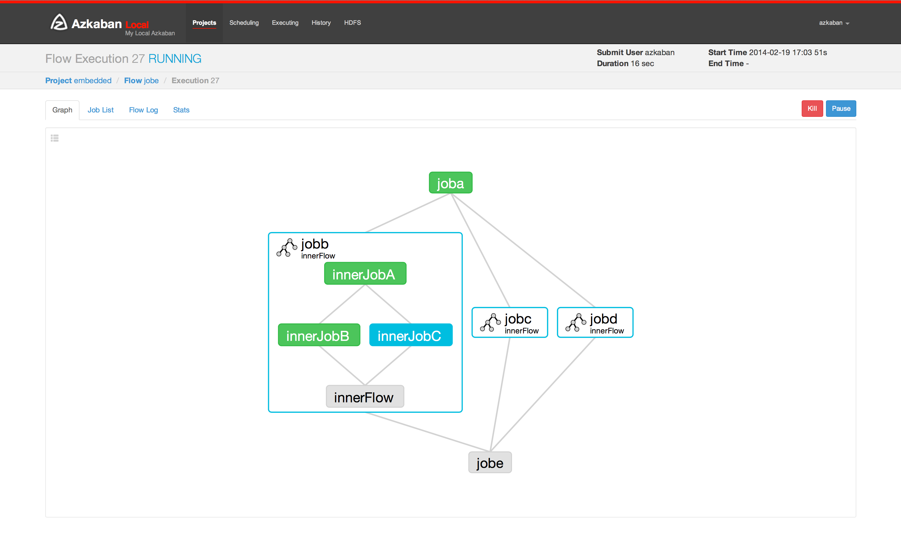
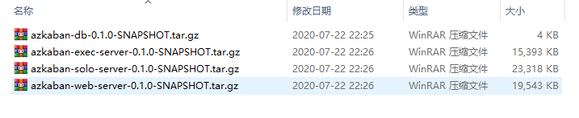
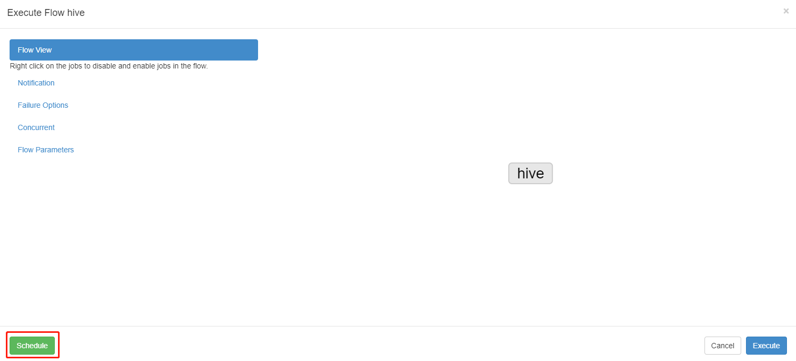
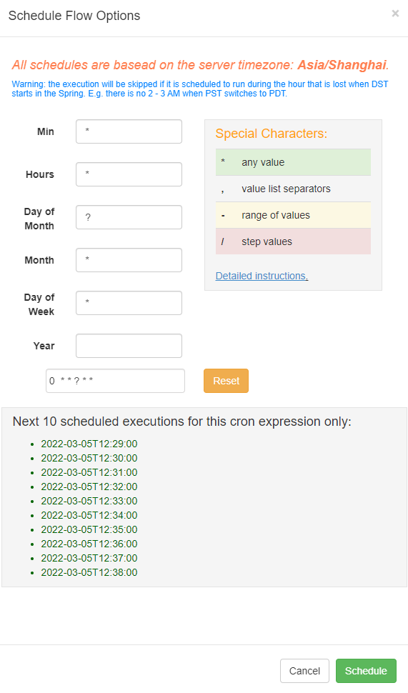

# Azkaban

工作流调度系统

## 第 1 节 概述

### 1.1 ⼯作流调度系统

⼀个完整的数据分析系统通常都是由⼤量任务单元组成：

- shell脚本程序
- Java程序
- MapReduce程序
- Hive脚本等

各任务单元之间存在时间先后及前后依赖关系,为了很好地组织起这样的复杂执⾏计划，需要⼀个⼯作流调度系统来调度任务的执⾏。

假如，我有这样⼀个需求，某个业务系统每天产⽣20G原始数据，每天都要对其进⾏处理，处理步骤如下所示：

- 通过Hadoop先将原始数据同步到HDFS上；
- 借助MapReduce计算框架对原始数据进⾏转换，⽣成的数据以分区表的形式存储到多张Hive表中；
- 需要对Hive中多个表的数据进⾏JOIN处理，得到⼀个明细数据Hive⼤表；
- 将明细数据进⾏各种统计分析，得到结果报表信息；
- 需要将统计分析得到的结果数据同步到业务系统中，供业务调⽤使⽤。

### 1.2 ⼯作流调度实现⽅式

- 简单的任务调度

直接使⽤linux的crontab；

- 复杂的任务调度

开发调度平台或使⽤现成的开源调度系统，⽐如Ooize、Azkaban、Airflow等

### 1.3 Azkaban与Oozie对⽐

对市⾯上最流⾏的两种调度器，进⾏对⽐分析。

总体来说，Ooize相⽐Azkaban是⼀个重量级的任务调度系统，功能全⾯，但配置使⽤也更复杂(一个任务就是一个xml文件)。
如果可以不在意某些功能的缺失，轻量级调度器Azkaban是很不错的候选对象。

- 功能

两者均可以调度 MapReduce, Pig, Java, 脚本⼯作流任务

两者均可以定时执⾏⼯作流任务

- ⼯作流定义

Azkaban使⽤Properties⽂件定义⼯作流

Oozie使⽤XML⽂件定义⼯作流

- ⼯作流传参

Azkaban⽀持直接传参，例如 `${input}`

Oozie⽀持参数和EL表达式，例如 `${fs:dirSize(myInputDir)}`

- 定时执⾏

Azkaban的定时执⾏任务是基于时间的

Oozie的定时执⾏任务基于时间和输⼊数据

- 资源管理

Azkaban有较严格的权限控制，如⽤户对⼯作流进⾏读/写/执⾏等操作

Oozie暂⽆严格的权限控制

- ⼯作流执⾏

Azkaban有两种运⾏模式，分别是solo server mode(executor server和web server部署在同⼀台节点)
和multi server mode(executor server和web server可以部署在不同节点)

Oozie作为⼯作流服务器运⾏，⽀持多⽤户和多⼯作流

## 第 2 节 Azkaban介绍

Azkaban是由Linkedin（领英）公司推出的⼀个批量⼯作流任务调度器，⽤于在⼀个⼯作流内以⼀个特定的顺序运⾏⼀组⼯作和流程。
Azkaban使⽤job配置⽂件建⽴任务之间的依赖关系，并提供⼀个易于使⽤的web⽤户界⾯维护和跟踪你的⼯作流。



Azkaban定义了⼀种KV⽂件(properties)格式来建⽴任务之间的依赖关系，并提供⼀个易于使⽤的web⽤户界⾯维护和跟踪你的⼯作流。

有如下功能特点：

- Web⽤户界⾯
- ⽅便上传⼯作流
- ⽅便设置任务之间的关系
- 调度⼯作流

架构⻆⾊

- mysql服务器: 存储元数据，如项⽬名称、项⽬描述、项⽬权限、任务状态、SLA规则等
- AzkabanWebServer: 对外提供web服务，使⽤户可以通过web⻚⾯管理。职责包括项⽬管理、权限授权、任务调度、监控executor。
- AzkabanExecutorServer: 负责具体的⼯作流的提交、执⾏。

## 第 3 节 Azkaban安装部署

### 3.1 Azkaban的安装准备⼯作

1. 编译

这⾥选⽤azkaban3.51.0这个版本⾃⼰进⾏重新编译，编译完成之后得到我们需要的安装包进⾏安装

```shell
cd /opt/zmn/software/

wget https://github.com/azkaban/azkaban/archive/3.51.0.tar.gz

tar -zxvf 3.51.0.tar.gz -C ../servers/

cd /opt/zmn/servers/azkaban-3.51.0/

yum -y install git
yum -y install gcc-c++

./gradlew build installDist -x test
```

> Gradle是⼀个基于Apache Ant和Apache Maven的项⽬⾃动化构建⼯具。`-x test` 跳过测试。（注意联⽹下载jar可能会失败、慢）

2. 上传编译后的安装⽂件

```shell
# 在linux122节点创建⽬录
mkdir /opt/zmn/servers/azkaban
```

> 将编译产生的四个文件都放入此文件夹中



### 3.2 solo-server模式部署

#### 单服务模式安装

1. 解压

Azkaban 的solo server使⽤的是⼀个单节点的模式来进⾏启动服务的，只需要⼀个 `azkaban-soloserver-0.1.0-SNAPSHOT.tar.gz` 的安装包即可启动，
所有的数据信息都是保存在H2这个azkaban默认的数据库当中.

```shell
tar -zxvf azkaban-solo-server-0.1.0-SNAPSHOT.tar.gz -C /opt/zmn/servers/azkaban
```

2. 修改配置⽂件

修改时区配置⽂件

```shell
cd /opt/zmn/servers/azkaban-solo-server-0.1.0-SNAPSHOT/conf

vim azkaban.properties
# 修改如下内容

default.timezone.id=Asia/Shanghai
```

修改 `commonprivate.properties` 配置⽂件

```shell
cd /opt/zmn/servers/azkaban-solo-server-0.1.0-SNAPSHOT/plugins/jobtypes

vim commonprivate.properties
# 修改内容如下

execute.as.user=false
memCheck.enabled=false
```

> azkaban默认需要3G的内存，剩余内存不⾜则会报异常。

3. 启动solo-server

```shell
cd /opt/zmn/servers/azkaban/azkaban-solo-server-0.1.0-SNAPSHOT
bin/start-solo.sh
```

> 不要自作聪明的进入 bin 目录然后再执行 `sh start-solo.sh` 命令, 
> 会报: `Cannot find 'database.properties' file xxx` 异常

4. 浏览器⻚⾯访问

访问地址：<http://linux122:8081/index>

登录信息: `azkaban/azkaban`

#### 单服务模式使⽤

需求：使⽤azkaban调度我们的shell脚本，执⾏linux的shell命令

具体步骤:

1. 开发job⽂件

创建普通⽂本⽂件 foo.job，⽂件内容如下

```properties
type=command
command=echo 'hello world'
```

打成 `.zip` 压缩包

2. 上传压缩包到Azkaban

点击 `+Create Project` 按钮，创建project; 

到项目空间下点击 `Upload` 按钮上传文件(foo.zip)。

点击 `Execute Flow` 按钮，运行工作流; 

停⽌程序: 

```shell
bin/shutdown-solo.sh
```

### 3.3 multiple-executor模式部署

#### 1. 安装所需软件

Azkaban Web服务安装包 `azkaban-web-server-0.1.0-SNAPSHOT.tar.gz`
Azkaban执⾏服务安装包 `azkaban-exec-server-0.1.0-SNAPSHOT.tar.gz`
sql脚本 `azkaban-db-server-0.1.0-SNAPSHOT.tar.gz`

节点规划

| HOST     | ROLE               |
|----------|--------------------|
| linux123 | mysql, exec-server |
| linux122 | web-server         |
| linux121 | exec-server        |

#### 2. 数据库准备

linux123 进⼊mysql的客户端执⾏以下命令

```shell
mysql -u root -p
12345678
```

```mysql
-- 修改密码位数
SET GLOBAL validate_password_length=5;
-- 降低密码强度策略
SET GLOBAL validate_password_policy=0;
-- 创建用户 azkaban/azkaban
CREATE USER 'azkaban'@'%' IDENTIFIED BY 'azkaban';
GRANT all privileges ON azkaban.* to 'azkaban'@'%' identified by 'azkaban' WITH GRANT OPTION;
-- 创建并使用 azkaban 数据库
CREATE DATABASE azkaban;
use azkaban;
```

```shell
mkdir /opt/zmn/servers/azkaban
cd /opt/zmn/software/
#解压数据库脚本
tar -zxvf azkaban-db-0.1.0-SNAPSHOT.tar.gz -C /opt/zmn/servers/azkaban

#加载初始化sql创建表
source /opt/zmn/servers/azkaban/azkaban-db-0.1.0-SNAPSHOT/create-all-sql-0.1.0-SNAPSHOT.sql;
```

#### 3. 配置Azkaban-web-server

进⼊linux122节点，解压azkaban-web-server

```shell
# 这里可能已经创建过了
mkdir /opt/zmn/servers/azkaban

cd /opt/zmn/software/
tar -zxvf azkaban-web-server-0.1.0-SNAPSHOT.tar.gz -C /opt/zmn/servers/azkaban/
```

进⼊azkaban-web-server 根⽬录下

```shell
cd /opt/zmn/servers/azkaban/azkaban-web-server-0.1.0-SNAPSHOT

#⽣成ssl证书：
keytool -keystore keystore -alias jetty -genkey -keyalg RSA
```

> 注意：运⾏此命令后, 会提示输⼊当前⽣成keystore的密码及相应信息,输⼊的密码请记住(所有密码统⼀以 `azkaban` 输⼊)

修改 azkaban-web-server 的配置⽂件

```shell
cd /opt/zmn/servers/azkaban/azkaban-web-server-0.1.0-SNAPSHOT/conf

vim azkaban.properties
```

内容如下

```properties{7,12-20,24,26-27,31}
# Azkaban Personalization Settings
azkaban.name=Test
azkaban.label=My Local Azkaban
azkaban.color=#FF3601
azkaban.default.servlet.path=/index
web.resource.dir=web/
default.timezone.id=Asia/Shanghai # 时区注意后⾯不要有空格
# Azkaban UserManager class
user.manager.class=azkaban.user.XmlUserManager
user.manager.xml.file=conf/azkaban-users.xml
# Azkaban Jetty server properties. 开启使⽤ssl 并且知道端⼝
jetty.use.ssl=true
jetty.port=8443
jetty.maxThreads=25
# KeyStore for SSL ssl相关配置 注意密码和证书路径
jetty.keystore=keystore
jetty.password=azkaban
jetty.keypassword=azkaban
jetty.truststore=keystore
jetty.trustpassword=azkaban
# Azkaban mysql settings by default. Users should configure their own username and password.
database.type=mysql
mysql.port=3306
mysql.host=linux123
mysql.database=azkaban
mysql.user=azkaban
mysql.password=azkaban
mysql.numconnections=100
#Multiple Executor 设置为false
azkaban.use.multiple.executors=true
#azkaban.executorselector.filters=StaticRemainingFlowSize,MinimumFreeMemory,CpuStatus
azkaban.executorselector.comparator.NumberOfAssignedFlowComparator=1
azkaban.executorselector.comparator.Memory=1
azkaban.executorselector.comparator.LastDispatched=1
azkaban.executorselector.comparator.CpuUsage=1
```

> 如果 MySQL 的用户配置成 root 的话, 需要保证 root 用户在任何服务器都可以登录.

添加属性

```shell
mkdir -p plugins/jobtypes
cd plugins/jobtypes/
vim commonprivate.properties
```

内容如下：

```properties
azkaban.native.lib=false
execute.as.user=false
memCheck.enabled=false
```

#### 4. 配置Azkaban-exec-server

linux123节点，上传 `exec` 安装包到 `/opt/zmn/software/` 路径下

```shell
tar -zxvf azkaban-exec-server-0.1.0-SNAPSHOT.tar.gz -C /opt/zmn/servers/azkaban/
```

修改azkaban-exec-server的配置⽂件

```shell
cd /opt/zmn/servers/azkaban/azkaban-exec-server-0.1.0-SNAPSHOT/conf
vim azkaban.properties
```

内容如下：

```properties{7,15,19,21-22,26}
# Azkaban Personalization Settings
azkaban.name=Test
azkaban.label=My Local Azkaban
azkaban.color=#FF3601
azkaban.default.servlet.path=/index
web.resource.dir=web/
default.timezone.id=Asia/Shanghai
# Azkaban UserManager class
user.manager.class=azkaban.user.XmlUserManager
user.manager.xml.file=conf/azkaban-users.xml
# Loader for projects
executor.global.properties=conf/global.properties
azkaban.project.dir=projects
# Where the Azkaban web server is located
azkaban.webserver.url=https://linux122:8443
# Azkaban mysql settings by default. Users should configure their own username and password.
database.type=mysql
mysql.port=3306
mysql.host=linux123
mysql.database=azkaban
mysql.user=azkaban
mysql.password=azkaban
mysql.numconnections=100
# Azkaban Executor settings
executor.maxThreads=50
executor.port=12321
executor.flow.threads=30
```

分发exec-server到linux121节点

```shell
cd /opt/zmn/servers
scp -r azkaban linux121:$PWD
```

#### 5. 启动服务

先启动exec-server, 再启动web-server

```shell
#启动exec-server (linux121, linux123)
cd /opt/zmn/servers/azkaban/azkaban-exec-server-0.1.0-SNAPSHOT
bin/start-exec.sh
#启动web-server (linux122)
cd /opt/zmn/servers/azkaban/azkaban-web-server-0.1.0-SNAPSHOT
bin/start-web.sh
```

激活我们的exec-server

启动webServer之后进程失败消失，可通过安装包根⽬录下对应启动⽇志进⾏排查。

如果报错: `No active executor found.`

需要⼿动激活executor

```shell
cd /opt/zmn/servers/azkaban/azkaban-exec-server-0.1.0-SNAPSHOT
curl -G "linux121:$(<./executor.port)/executor?action=activate" && echo
curl -G "linux123:$(<./executor.port)/executor?action=activate" && echo
```

访问地址：<https://linux122:8443/>

## 第 4 节 Azkaban使⽤

### 1. shell command调度

创建job描述⽂件 `vi command.job` 内容如下：

```properties
type=command
command=echo 'hello'
```

将job资源⽂件打包成zip⽂件 `zip command.job`

通过azkaban的web管理平台创建project并上传job压缩包，然后点击 `Execute Flow`执行

### 2. job依赖调度

创建有依赖关系的多个job描述

第⼀个job：foo.job

```properties
type=command
command=echo 'foo'
```

第⼆个job：bar.job依赖foo.job

```properties
type=command
dependencies=foo
command=echo 'bar'
```

将所有job资源⽂件打到⼀个zip包中

在azkaban的web管理界⾯创建⼯程并上传zip包, 然后点击 `Execute Flow`执行

### 3. HDFS任务调度

创建job描述⽂件 fs.job

```properties
type=command
command=/opt/zmn/servers/hadoop-2.9.2/bin/hadoop fs -mkdir /azkaban
```

将job资源⽂件打包成zip⽂件

通过azkaban的web管理平台创建project并上传job压缩包, 然后点击 `Execute Flow`执行

### 4. MapReduce 任务调度

MR 任务依然可以使⽤command的job类型来执⾏

创建job描述⽂件 mrwc.job，及mr程序jar包（示例中直接使⽤hadoop⾃带的example jar）

```properties
type=command
command=/opt/zmn/servers/hadoop-2.9.2/bin/hadoop jar hadoop-mapreduce-examples-2.9.2.jar wordcount /azkaban-test-101/wc/input /azkaban-test-101/wc/output
```

将所有job(`.job`文件和 jar 包)资源⽂件打到⼀个 `mrwc.zip` 包中

在azkaban的web管理界⾯创建⼯程并上传zip包, 然后启动job


遇到虚拟机内存不⾜情况：

1. 增⼤机器内存
2. 使⽤清除系统缓存命令，暂时释放⼀些内存

```shell
echo 1 > /proc/sys/vm/drop_caches
echo 2 > /proc/sys/vm/drop_caches
echo 3 > /proc/sys/vm/drop_caches
```

### 5. HIVE脚本任务调度

创建job描述⽂件和hive脚本

Hive脚本： test.sql

```sql
use default;
drop table aztest;
create table aztest(id int,name string) row format delimited fields terminated by ',';
```

Job描述⽂件：hivef.job

```properties
type=command
command=/opt/zmn/servers/hive-2.3.7/bin/hive -f 'test.sql'
```

将所有job资源⽂件打到⼀个zip包中创建⼯程并上传zip包,启动job

### 6. 定时任务调度

除了⼿动⽴即执⾏⼯作流任务外，azkaban也⽀持配置定时任务调度。

开启⽅式如下：

1. ⾸⻚选择待处理的project
2. 选择左边schedule表示配置定时调度信息，选择右边execute表示⽴即执⾏⼯作流任务。





> 语法同 Cron 表达式
