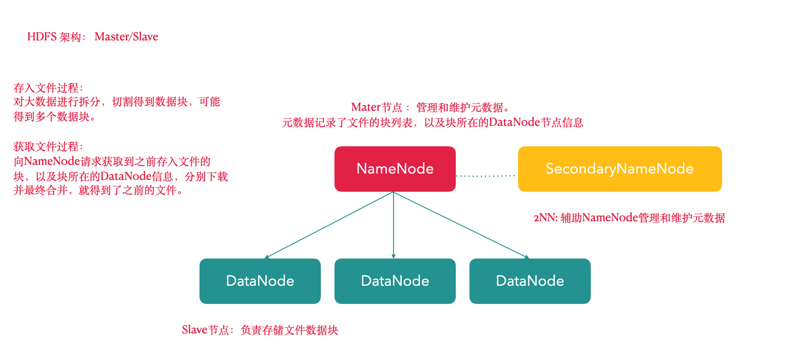
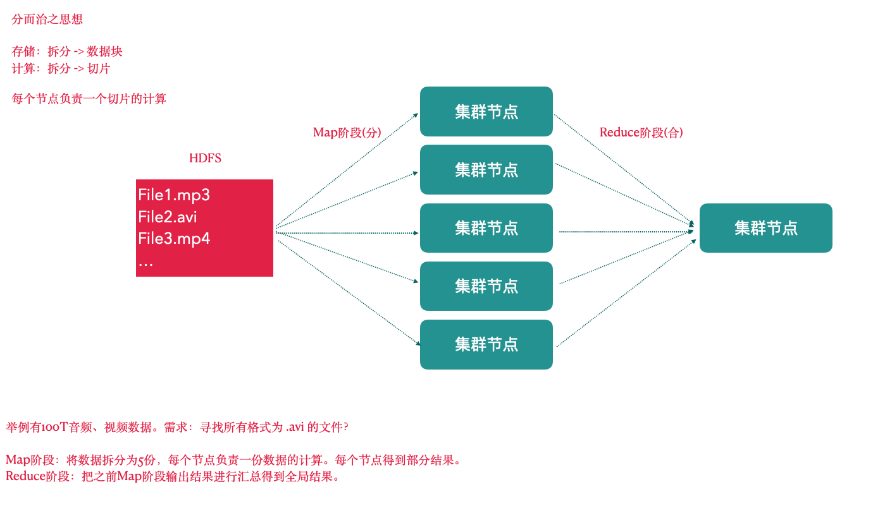
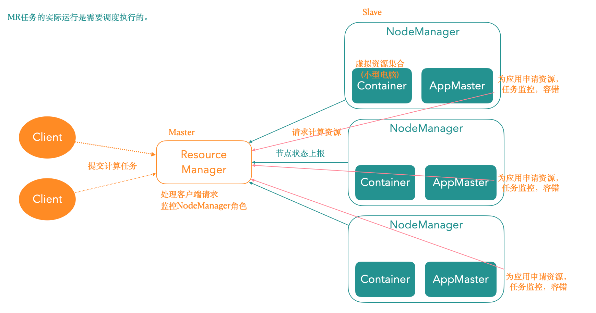

# 3. Apache Hadoop的重要组成 【熟悉】

> Hadoop = HDFS(分布式文件系统) + MapReduce(分布式计算框架) + Yarn(资源协调框架) + Common模块

## 3.1 Hadoop HDFS

HDFS(Hadoop Distribute File System )是一个高可靠、高吞吐量的分布式文件系统

比如:需要实现100T数据存储，怎么办？

“分而治之”。分，即拆分 -> 数据切割，100T数据拆分为10G一个数据块由一个电脑节点存储这个数据块。

> 核心思想：数据切割、制作副本、分散储存

图中涉及到几个角色

- NameNode(nn): 存储文件的元数据，比如文件名、文件目录结构、文件属性(生成时间、副本数、文件权限)，以及每个文件的块列表和块所在的DataNode等。
- SecondaryNameNode(2nn): 辅助NameNode更好的工作，用来监控HDFS状态的辅助后台程序，每隔一段时间获取HDFS元数据快照。
- DataNode(dn): 在本地文件系统存储文件块数据，以及块数据的校验

> 注意: NN，2NN, DN这些既是角色名称，也是进程名称，也代指电脑节点!!!

## 3.2 Hadoop MapReduce

一个分布式的离线并行计算框架。

> 核心思想：拆解任务、分散处理、汇整结果

**MapReduce计算 = Map阶段 + Reduce阶段**

- Map阶段就是“分”的阶段，并行处理输入数据;
- Reduce阶段就是“合”的阶段，对Map阶段结果进行汇总;

## 3.3 Hadoop YARN

作业调度与集群资源管理的框架

计算资源协调

Yarn中有如下几个主要角色:

> 同样，既是角色名、也是进程名，也指代所在计算机节点名称!

- ResourceManager(rm): 处理客户端请求、启动/监控ApplicationMaster、监控NodeManager、资源分配与调度;
- NodeManager(nm): 单个节点上的资源管理、处理来自ResourceManager的命令、处理来自ApplicationMaster的命令;
- ApplicationMaster(am): 数据切分、为应用程序申请资源，并分配给内部任务、任务监控与容错。
- Container:对任务运行环境的抽象，封装了CPU、内存等多维资源以及环境变量、启动命令等任务运行相关的信息。

**ResourceManager是老大，NodeManager是小弟，ApplicationMaster是计算任务专员。**

## 3.4  Hadoop Common

支持其他模块的工具模块(Configuration、RPC、序列化机制、日志操作)

