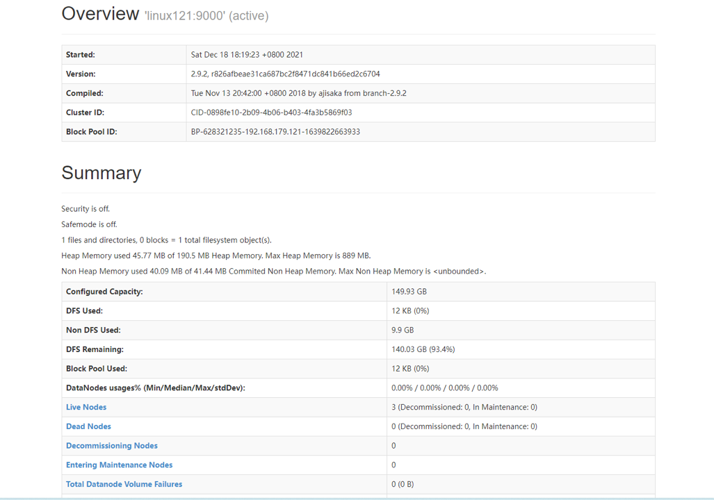

# 4. Apache Hadoop 完全分布式集群搭建【练习】

Hadoop框架是采用Java语言编写，需要Java环境(jvm)。

Hadoop搭建方式

- 单机模式: 单节点模式，非集群，生产不会使用这种方式
- 单机伪分布式模式: 单节点，多线程模拟集群的效果，生产不会使用这种方式
- 完全分布式模式: 多台节点，真正的分布式Hadoop集群的搭建(生产环境建议使用这种方式)

## 4.1 虚拟机环境准备

1. 三台虚拟机(静态IP，关闭防火墙，修改主机名，配置免密登录，集群时间同步)

```shell
# 修改静态IP
vi /etc/sysconfig/network-scripts/ifcfg-ens33
# 关闭防火墙
firewall-cmd --state
systemctl stop firewalld.service
systemctl disable firewalld.service
# 修改主机名(重启后生效)
hostnamectl set-hostname linux121
# 同步时间
# 安装软件
yum -y install ntpdate
# 向阿里云服务器同步时间
ntpdate time1.aliyun.com
# 删除本地时间并设置时区为上海
rm -rf /etc/localtime
ln -s /usr/share/zoneinfo/Asia/Shanghai /etc/localtime
# 查看时间
date -R || date
# 配置集群节点间免密登陆
ssh-keygen -t rsa
# 复制公钥到另外两个节点
ssh-copy-id root@linux121
ssh-copy-id -i ~/.ssh/id_rsa.pub root@linux122
ssh-copy-id -i ~/.ssh/id_rsa.pub root@linux123
```

2. 在/opt目录下创建文件夹

```shell
# 软件安装包存放目录 
mkdir -p /opt/zmn/software
# 软件安装目录
mkdir -p /opt/zmn/servers
```

3. Hadoop下载地址:

<https://archive.apache.org/dist/hadoop/common/hadoop-2.9.2/>

Hadoop官网地址: <http://hadoop.apache.org/>

4. 上传Hadoop安装文件到 `/opt/zmn/software`

## 4.2 集群规划

| 框架\主机 | linux121          | linux122                    | linux123                   |
|-------|-------------------|-----------------------------|----------------------------|
| HDFS  | NameNode、DataNode | DataNode                    | SecondaryNameNode、DataNode |
| YARN  | NodeManager       | NodeManager、ResourceManager | NodeManager                |

## 4.3 安装Hadoop

### 4.3.1 安装文件准备

登录linux121节点; 进入 `/opt/zmn/software`, 解压安装文件到 `/opt/zmn/servers`

```shell
tar -zxvf hadoop-2.9.2.tar.gz -C /opt/zmn/servers
```

查看是否解压成功

```shell
ll /opt/zmn/servers/hadoop-2.9.2
```

添加Hadoop到环境变量

```shell
vim /etc/profile

# JAVA_HOME
export JAVA_HOME=/opt/zmn/servers/jdk1.8.0_231
export PATH=$PATH:$JAVA_HOME/bin

# HADOOP_HOME
export HADOOP_HOME=/opt/zmn/servers/hadoop-2.9.2
export PATH=$PATH:$HADOOP_HOME/bin
export PATH=$PATH:$HADOOP_HOME/sbin
```

使环境变量生效

```shell
source /etc/profile
```

验证Hadoop安装

```shell
hadoop version
```

```shell
[root@linux121 software]# hadoop version
Hadoop 2.9.2
Subversion https://git-wip-us.apache.org/repos/asf/hadoop.git -r 826afbeae31ca687bc2f8471dc841b66ed2c6704
Compiled by ajisaka on 2018-11-13T12:42Z
Compiled with protoc 2.5.0
From source with checksum 3a9939967262218aa556c684d107985
This command was run using /opt/zmn/servers/hadoop-2.9.2/share/hadoop/common/hadoop-common-2.9.2.jar
```

hadoop 目录

```shell
total 128
drwxr-xr-x. 2 501 dialout    194 Nov 13  2018 bin
drwxr-xr-x. 3 501 dialout     20 Nov 13  2018 etc
drwxr-xr-x. 2 501 dialout    106 Nov 13  2018 include
drwxr-xr-x. 3 501 dialout     20 Nov 13  2018 lib
drwxr-xr-x. 2 501 dialout    239 Nov 13  2018 libexec
-rw-r--r--. 1 501 dialout 106210 Nov 13  2018 LICENSE.txt
-rw-r--r--. 1 501 dialout  15917 Nov 13  2018 NOTICE.txt
-rw-r--r--. 1 501 dialout   1366 Nov 13  2018 README.txt
drwxr-xr-x. 3 501 dialout   4096 Nov 13  2018 sbin
drwxr-xr-x. 4 501 dialout     31 Nov 13  2018 share
```

1. bin目录: 对Hadoop进行操作的相关命令，如`hadoop`, `hdfs`等
2. etc目录: Hadoop的配置文件目录，如`hdfs-site.xml`, `core-site.xml`等
3. lib目录: Hadoop本地库(解压缩的依赖)
4. sbin目录: 存放的是Hadoop集群启动停止相关脚本、命令
5. share目录: Hadoop的一些jar,官方案例jar，文档等

### 4.3.2 集群配置

> Hadoop集群配置 = HDFS集群配置 + MapReduce集群配置 + Yarn集群配置

- HDFS集群配置

1. 将JDK路径明确配置给HDFS(修改`hadoop-env.sh`)
2. 指定NameNode节点以及数据存储目录(修改`core-site.xml`)
3. 指定SecondaryNameNode节点(修改`hdfs-site.xml`)
4. 指定DataNode从节点(修改`etc/hadoop/slaves`文件，每个节点配置信息占一行)

- MapReduce集群配置

1. 将JDK路径明确配置给MapReduce(修改`mapred-env.sh`)
2. 指定MapReduce计算框架运行Yarn资源调度框架(修改`mapred-site.xml`)

- Yarn集群配置

1. 将JDK路径明确配置给Yarn(修改`yarn-env.sh`)
2. 指定ResourceManager老大节点所在计算机节点(修改`yarn-site.xml`)
3. 指定NodeManager节点(会通过`slaves`文件内容确定)

---

> 将 Linux121 服务器配置完成后，再分发到 122 和 123，因此下面的操作默认都在 121 服务器上面。

#### 4.3.2.1 HDFS集群配置

进入配置文件目录

```shell
cd /opt/zmn/servers/hadoop-2.9.2/etc/hadoop
```

> 配置文件都在此目录中，下面所有的操作默认都在此目录中进行。

编辑`hadoop-env.sh`文件，将JDK路径明确配置给HDFS

```shell
vi hadoop-env.sh

export JAVA_HOME=/opt/zmn/servers/jdk1.8.0_231
```

指定NameNode节点以及数据存储目录(修改`core-site.xml`)

```xml

<configuration>
    <!-- 指定HDFS中NameNode的地址 -->
    <property>
        <name>fs.defaultFS</name>
        <value>hdfs://linux121:9000</value>
    </property>
    <!-- 指定Hadoop运行时产生文件的存储目录 -->
    <property>
        <name>hadoop.tmp.dir</name>
        <value>/opt/zmn/servers/hadoop-2.9.2/data/tmp</value>
    </property>
</configuration>
```

> `core-site.xml` 的默认配置信息 <https://hadoop.apache.org/docs/r2.9.2/hadoop-project-dist/hadoop-common/core-default.xml>

指定SecondaryNameNode节点(修改`hdfs-site.xml`文件)

```xml
<configuration>
    <!-- 指定Hadoop辅助名称节点主机配置 -->
    <property>
        <name>dfs.namenode.secondary.http-address</name>
        <value>linux123:50090</value>
    </property>
    <!--副本数量 -->
    <property>
        <name>dfs.replication</name>
        <value>3</value>
    </property>
</configuration>
```

> `hdfs-site.xml` 的默认配置信息 <https://hadoop.apache.org/docs/r2.9.2/hadoop-project-dist/hadoop-hdfs/hdfs-default.xml>

指定 DataNode 从节点(修改`/opt/zmn/servers/hadoop-2.9.2/etc/hadoop/slaves`文件，每个节点配置信息占一行)

```shell
linux121
linux122
linux123
```

> 删除文件中原本的 `localhost`

**注意: 该文件中添加的内容结尾不允许有空格，文件中不允许有空行。**

#### 4.3.2.2 MapReduce集群配置

指定MapReduce使用的JDK路径(修改`/opt/zmn/servers/hadoop-2.9.2/etc/hadoop/mapred-env.sh`)

```shell
export JAVA_HOME=/opt/zmn/servers/jdk1.8.0_231
```

指定MapReduce计算框架运行Yarn资源调度框架(修改`/opt/zmn/servers/hadoop-2.9.2/etc/hadoop/mapred-site.xml`)

```shell
mv mapred-site.xml.template mapred-site.xml
vim mapred-site.xml
```

```xml
<configuration>
    <!-- 指定MR运行在Yarn上 -->
    <property>
        <name>mapreduce.framework.name</name>
        <value>yarn</value>
    </property>
</configuration>
```

> `mapred-site.xml` 默认配置信息 <https://hadoop.apache.org/docs/r2.9.2/hadoop-mapreduce-client/hadoop-mapreduce-client-core/mapred-default.xml>

#### 4.3.2.3 Yarn集群配置

指定JDK路径

```shell
vim yarn-env.sh

export JAVA_HOME=/opt/zmn/servers/jdk1.8.0_231
```

指定ResourceManager的master节点信息(修改`yarn-site.xml`)

```xml
<configuration>
    <!-- Site specific YARN configuration properties -->
    <!-- 指定YARN的ResourceManager的地址 -->
    <property>
        <name>yarn.resourcemanager.hostname</name>
        <value>linux123</value>
    </property>
    <!-- Reducer获取数据的方式 -->
    <property>
        <name>yarn.nodemanager.aux-services</name>
        <value>mapreduce_shuffle</value>
    </property>
</configuration>
```

> `yarn-site.xml` 的默认配置信息：<https://hadoop.apache.org/docs/r2.9.2/hadoop-yarn/hadoop-yarn-common/yarn-default.xml>

指定NodeManager节点(`slaves`文件已修改)

**注意**

Hadoop安装目录所属用户和所属用户组信息，默认是501 dialout，而我们操作Hadoop集群的用户使用的是虚拟机的root用户， 所以为了避免出现信息混乱，修改Hadoop安装目录所属用户和用户组!

```shell
chown -R root:root /opt/zmn/servers/hadoop-2.9.2
```

### 4.3.3 分发配置

#### 4.3.3.1 rsync 远程同步工具

rsync主要用于备份和镜像。具有速度快、避免复制相同内容和支持符号链接的优点。

rsync和scp区别:用rsync做文件的复制要比scp的速度快。

> rsync只对差异文件做更新, scp是把所有文件都复制过去。

基本语法

```shell
rsync -rvl $pdir/$fname $user@$host:$pdir/$fname
```

> `命令 选项参数 要拷贝的文件路径/名称 目的用户@主机:目的路径/名称`

选项参数说明

| 选项  | 功能     |
|-----|--------|
| -r  | 递归     |
| -v  | 显示复制过程 |
| -l  | 拷贝符号连接 |

rsync演示案例

```shell
# 1. 三台虚拟机安装rsync (执行安装需要保证机器联网)
yum install -y rsync
# 2.把linux121机器上的 /opt/zmn/software 目录同步到linux122服务器的root用户下的 /opt/ 目录
rsync -rvl /opt/zmn/software/ root@linux122:/opt/zmn/software
```

#### 4.3.3.2 集群分发脚本编写

1. 需求: 循环复制文件到集群所有节点的相同目录下

rsync命令原始拷贝: `rsync -rvl /opt/module root@linux123:/opt/`

2. 期望脚本

脚本+要同步的文件名称

3. 说明

在 `/usr/local/bin` 这个目录下存放的脚本，root用户可以在系统任何地方直接执行。

4. 脚本实现

- 在 `/usr/local/bin` 目录下创建文件 `rsync-script`，并编写脚本内容

```shell
vi rsync-script
```

```shell
#!/bin/bash

# 需求：循环复制文件到集群所有节点的相同目录下
# 使用方式：脚本 + 需要复制的文件名称

# 脚本编写大致步骤
# 1.获取传入脚本的参数,参数个数
paramnum=$#

if ((paramnum==0));
then
  echo no args;  
exit;
fi

# 2.获取文件名称
p1=$1

file_name=`basename $p1`

echo fname=${file_name}
# 3.获取文件绝对路径，获取到文件目录信息
dir_name=`cd -P $(dirname $p1);pwd`
echo dirname=${dir_name}
# 4.获取到当前用户信息
user=`whoami`
# 5.执行 rsync 命令，循环执行，要把数据发送到集群中所有其他节点
for (( host = 121; host < 124; host++ )); 
do
  echo -----target hostname=linux$host-----
  rsync -rvl ${dir_name}/${file_name} ${user}@linux${host}:${dir_name}
done
```

- 修改脚本 `rsync-script` 具有执行权限

```shell
chmod 777 rsync-script
```

- 调用脚本形式 `rsync-script 文件名称`

```shell
rsync-script /home/root/bin
```

- 调用脚本分发Hadoop安装目录到其它节点

```shell
rsync-script /opt/zmn/servers/hadoop-2.9.2
```

## 4.4 启动集群

**注意:如果集群是第一次启动，需要在NameNode所在节点格式化NameNode，非第一次不用执行格式化NameNode操作!!**

### 4.4.1 单节点启动

```shell
hadoop namenode -format
```

格式化成功的输出：

```shell
21/12/18 18:17:43 INFO common.Storage: Storage directory /opt/zmn/servers/hadoop-2.9.2/data/tmp/dfs/name has been successfully formatted.
21/12/18 18:17:43 INFO namenode.FSImageFormatProtobuf: Saving image file /opt/zmn/servers/hadoop-2.9.2/data/tmp/dfs/name/current/fsimage.ckpt_0000000000000000000 using no compression
21/12/18 18:17:44 INFO namenode.FSImageFormatProtobuf: Image file /opt/zmn/servers/hadoop-2.9.2/data/tmp/dfs/name/current/fsimage.ckpt_0000000000000000000 of size 323 bytes saved in 0 seconds .
```

格式化后创建的文件: `/opt/zmn/servers/hadoop-2.9.2/data/tmp/dfs/name/current`

```shell
total 16
-rw-r--r--. 1 root root 323 Dec 18 18:17 fsimage_0000000000000000000
-rw-r--r--. 1 root root  62 Dec 18 18:17 fsimage_0000000000000000000.md5
-rw-r--r--. 1 root root   2 Dec 18 18:17 seen_txid
-rw-r--r--. 1 root root 218 Dec 18 18:17 VERSION
```

1. 在linux121上启动NameNode

```shell
# 启动
hadoop-daemon.sh start namenode
# 查看Java进程
jps
```

2. 在linux121、linux122以及linux123上分别启动DataNode

> 执行前先分别为 linux122 和 123 配置好 JAVA_HOME 和 HADOOP_HOME

```shell
# 启动
hadoop-daemon.sh start datanode
# 查看Java进程
jps
```

3. Web端查看HDFS界面

```shell
# linux121 为 NameNode 节点
http://linux121:50070/
```

查看HDFS集群正常节点



4. Yarn集群单节点启动

```shell
# 123 节点
yarn-daemon.sh start resourcemanager
jps

# 122 节点
yarn-daemon.sh start nodemanager
jps

# 121 节点
yarn-daemon.sh start nodemanager
jps
```

> 思考:Hadoop集群每次需要一个一个节点的启动，如果节点数增加到成千上万个怎么办?

### 4.4.2 集群群起

> 如果已经单节点方式启动了Hadoop,可以先停止之前的启动的NameNode与DataNode进程,如果之前NameNode没有执行格式化，这里需要执行格式化!!!!

```shell
# 停止正在运行的服务
# 121
hadoop-daemon.sh stop namenode
hadoop-daemon.sh stop datanode
yarn-daemon.sh stop nodemanager
jps
# 122
hadoop-daemon.sh stop datanode
yarn-daemon.sh stop nodemanager
# 123
hadoop-daemon.sh stop datanode
yarn-daemon.sh stop resourcemanager
```

1. 启动HDFS

```shell
# 121
sbin/start-dfs.sh
jps
```

2. 启动YARN

```shell
# 123
sbin/start-yarn.sh
jps
```

**注意: NameNode和ResourceManger不是在同一台机器，不能在NameNode上启动YARN，应该在ResourceManager所在的机器上启动YARN。**

### 4.4.3 Hadoop集群启动停止命令汇总

1. 各个服务组件逐一启动/停止

```shell
# 1.分别启动/停止HDFS组件
hadoop-daemon.sh  start/stop  namenode/datanode/secondarynamenode
# 2.启动/停止YARN
yarn-daemon.sh  start/stop  resourcemanager/nodemanager
```

2. 各个模块分开启动/停止(配置ssh是前提)常用

```shell
# 1.整体启动/停止HDFS
start-dfs.sh
stop-dfs.sh
# 2.整体启动/停止YARN
start-yarn.sh
stop-yarn.sh
```

## 4.5 集群测试

### 4.5.1 HDFS 分布式存储初体验

从Linux本地文件系统上传下载文件验证HDFS集群工作正常

```shell
#本地home目录创建一个文件
cd /root
vim test.txt
hello hdfs
# 在HDFS上创建目录
hdfs dfs -mkdir -p /test/input 
#上传linux文件到Hdfs
hdfs dfs -put /root/test.txt /test/input
#从Hdfs下载文件到linux本地
hdfs dfs -get /test/input/test.txt
```

### 4.5.2 MapReduce 分布式计算初体验

- 在HDFS文件系统根目录下面创建一个 `wcinput` 文件夹

```shell
hdfs dfs -mkdir /wcinput
```

- 在 `/root/` 目录下创建一个 `wc.txt` 文件(本地文件系统)

```shell
cd /root/
touch wc.txt
vi wc.txt

# 输入如下内容
hadoop mapreduce yarn
hdfs hadoop mapreduce
mapreduce yarn zmn
zmn
zmn

# 保存退出
:wq!
```

- 上传 `wc.txt` 到Hdfs目录 `/wcinput` 下

```shell
hdfs dfs -put wc.txt /wcinput
```

- 回到Hadoop目录

```shell
cd /opt/zmn/servers/hadoop-2.9.2
```

- 执行程序

```shell
# 进入案例任务目录
cd share/hadoop/mapreduce/
# 执行任务
hadoop jar hadoop-mapreduce-examples-2.9.2.jar wordcount /wcinput /wcoutput
```

- 查看任务执行结果

```shell
hdfs dfs -cat /wcoutput/part-r-00000
hadoop  2
hdfs    1
mapreduce       3
yarn    2
zmn     3
```

### 4.5.3 查看 YARN 集群的Web管理界面

YARN集群的Web管理界面地址：<http://resourceMangerIp:8088>。

本例中的地址为：<http://linux123:8088>

## 4.6 配置历史服务器

在Yarn中运行的任务产生的日志数据不能查看，为了查看程序的历史运行情况，需要配置一下历史日志服务器。

具体配置步骤如下:

1. 配置`mapred-site.xml`

```shell
vi mapred-site.xml
```

在该文件里面增加如下配置

```xml
<configuration>
    <!-- 指定MR运行在Yarn上 -->
    <property>
        <name>mapreduce.framework.name</name>
        <value>yarn</value>
    </property>
    <!-- 历史服务器端地址 -->
    <property>
        <name>mapreduce.jobhistory.address</name>
        <value>linux121:10020</value>
    </property>
    <!-- 历史服务器web端地址 -->
    <property>
        <name>mapreduce.jobhistory.webapp.address</name>
        <value>linux121:19888</value>
    </property>
</configuration>
```

```shell
#2. 分发 `mapred-site.xml` 到其它节点
rsync-script mapred-site.xml
#3. 启动历史服务器
# 121
sbin/mr-jobhistory-daemon.sh start historyserver
#4. 查看历史服务器是否启动
jps
```

5. 查看JobHistory

<http://linux121:19888/jobhistory>

### 4.6.1 配置日志的聚集

日志聚集: 应用(Job)运行完成以后，将应用运行日志信息从各个task汇总上传到HDFS系统上。

日志聚集功能好处: 可以方便的查看到程序运行详情，方便开发调试。

**注意: 开启日志聚集功能，需要重新启动NodeManager 、ResourceManager和 HistoryManager。**

开启日志聚集功能具体步骤如下:

1. 配置 `yarn-site.xml`

```xml
<configuration>
    <!-- Site specific YARN configuration properties -->
    <!-- 指定YARN的ResourceManager的地址 -->
    <property>
        <name>yarn.resourcemanager.hostname</name>
        <value>linux123</value>
    </property>
    <!-- Reducer获取数据的方式 -->
    <property>
        <name>yarn.nodemanager.aux-services</name>
        <value>mapreduce_shuffle</value>
    </property>

    <!-- 日志聚集功能 -->
    <property>
        <name>yarn.log-aggregation-enable</name>
        <value>true</value>
    </property>
    <!-- 日志保留时间设置7天 -->
    <property>
        <name>yarn.log-aggregation.retain-seconds</name>
        <value>604800</value>
    </property>
    <property>
        <name>yarn.log.server.url</name>
        <value>http://linux121:19888/jobhistory/logs</value>
    </property>
</configuration>
```

```shell
# 2.分发yarn-site.xml到集群其它节点
rsync-script yarn-site.xml
# 3.关闭NodeManager、ResourceManager和HistoryManager
#sbin/yarn-daemon.sh stop resourcemanager
#sbin/yarn-daemon.sh stop nodemanager
# 在 123 停止全部 YARN
stop-yarn.sh
# 在 121 停止 history server
sbin/mr-jobhistory-daemon.sh stop historyserver
#3.启动NodeManager、ResourceManager和HistoryManager
#sbin/yarn-daemon.sh start resourcemanager
#sbin/yarn-daemon.sh start nodemanager
# 在 121 重启 history server
sbin/mr-jobhistory-daemon.sh start historyserver
# 在 123 重新群起 YARN
start-yarn.sh
# 4.删除HDFS上已经存在的输出文件
bin/hdfs dfs -rm -R /wcoutput
# 5.执行WordCount程序
[root@linux121 hadoop-2.9.2]# hadoop jar share/hadoop/mapreduce/hadoop-mapreduce-examples-2.9.2.jar wordcount /wcinput /wcoutput
# 6.查看日志，
# 地址：http://linux121:19888/jobhistory
```