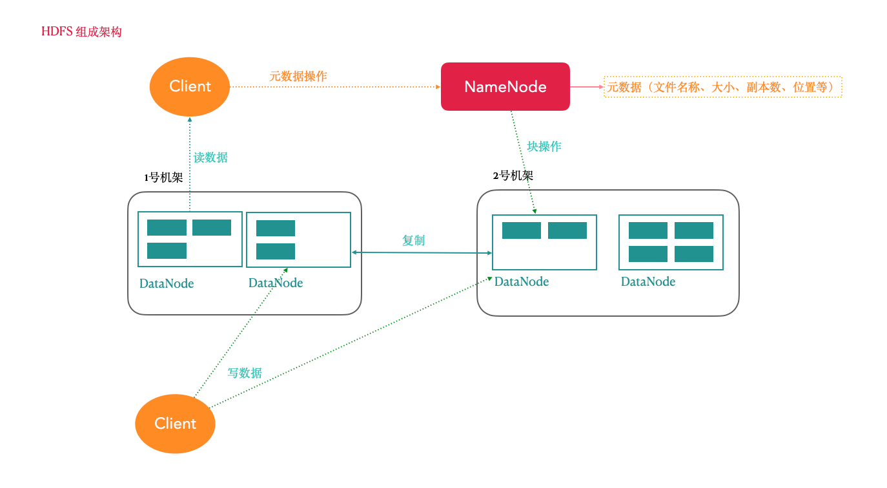
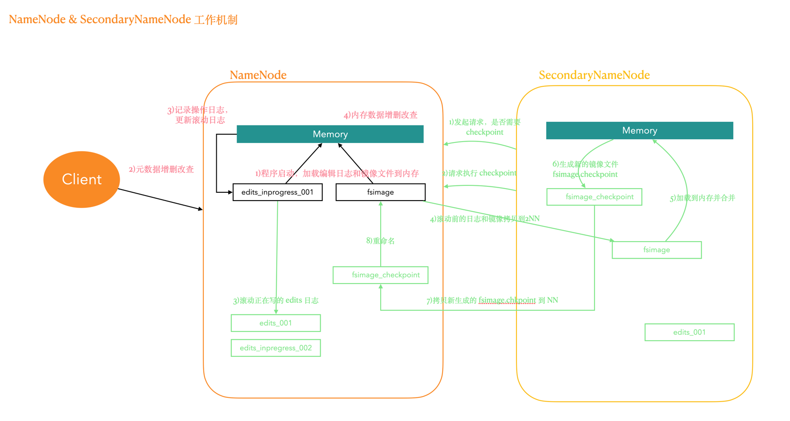
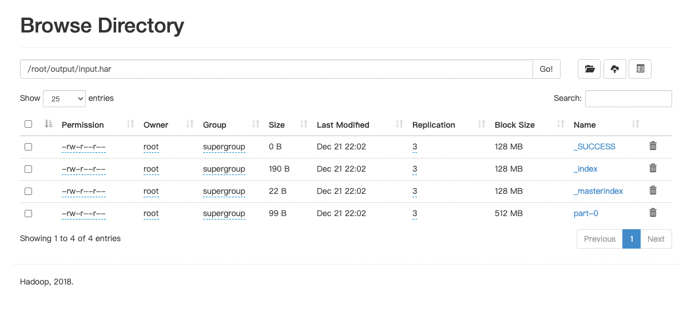

# 5. HDFS分布式文件系统

## 5.1 HDFS 简介

HDFS (全称:Hadoop Distribute File System，Hadoop 分布式文件系统) 是 Hadoop 核心组成，是分布式存储服务。

分布式文件系统横跨多台计算机，在大数据时代有着广泛的应用前景，它们为存储和处理超大规模数据提供所需的扩展能力。

HDFS是分布式文件系统中的一种。

## 5.2 HDFS 的重要概念【重点掌握】

HDFS 通过统一的命名空间目录树来定位文件; 另外，它是分布式的，由很多服务器联合起来实现其功能，集群中的服务器有各自的角色(分布式本质是拆分，各司其职);

### 5.2.1 典型的 Master/Slave 架构

HDFS 的架构是典型的 Master/Slave 结构。

HDFS集群往往是一个NameNode(HA架构会有两个NameNode,联邦机制)+多个DataNode组成;

NameNode是集群的主节点，DataNode是集群的从节点。

### 5.2.2 分块存储(block机制)

HDFS 中的文件在物理上是分块存储(block)的，块的大小可以通过配置参数来规定;

Hadoop2.x版本中默认的block大小是128M;

### 5.2.3 命名空间(NameSpace)

HDFS 支持传统的层次型文件组织结构。用户或者应用程序可以创建目录，然后将文件保存在这些目录里。文件系统命名空间的层次结构和大多数现有的文件系统类似: 用户可以创建、删除、移动或重命名文件。

NameNode 负责维护文件系统的命名空间，任何对文件系统命名空间或属性的修改都将被 NameNode 记录下来。

HDFS提供给客户端一个抽象目录树，访问形式: `hdfs://namenode的hostname:port/test/input`。

如：<hdfs://linux121:9000/test/input>

### 5.2.4 NameNode元数据管理

我们把目录结构及文件分块位置信息叫做元数据。

NameNode的元数据记录每一个文件所对应的block信息(block的id,以及所在的DataNode节点的信息)

### 5.2.5 DataNode数据存储

文件的各个 block 的具体存储管理由 DataNode 节点承担。

一个block会有多个DataNode来存储，DataNode 会定时向 NameNode 来汇报自己持有的block信息。

### 5.2.6 副本机制

为了容错，文件的所有 block 都会有副本。每个文件的 block 大小和副本系数都是可配置的。

应用程序可以指定某个文件的副本数目。副本系数可以在文件创建的时候指定，也可以在之后改变。 副本数量默认是3个。

### 5.2.7 一次写入，多次读出

HDFS 是设计成适应一次写入，多次读出的场景，且不支持文件的随机修改。(支持追加写入，不只支持随机更新)

正因为如此，HDFS 适合用来做大数据分析的底层存储服务，并不适合用来做网盘等应用(修改不方便，延迟大，网络开销大，成本太高)

## 5.3 HDFS 架构【重点掌握】



### 5.3.1 NameNode(nn)

HDFS 集群的管理者，Master

- 维护管理Hdfs的名称空间(NameSpace)
- 维护副本策略
- 记录文件块(Block)的映射信息
- 负责处理客户端读写请求

### 5.3.2 DataNode

NameNode 下达命令，DataNode 执行实际操作，Slave 节点。

- 保存实际的数据块
- 负责数据块的读写

### 5.3.3 Client

客户端

- 上传文件到 HDFS 的时候，Client 负责将文件切分成 Block, 然后进行上传
- 与 NameNode 交互，获取文件的位置信息
- 与 DataNode 交互，读取或写入文件
- Client 可以使用一些命令来管理HDFS或者访问HDFS

## 5.4 HDFS 客户端操作

### 5.4.1 Shell 命令行操作 HDFS

1. 基本语法

```shell
bin/hadoop fs 具体命令
bin/hdfs dfs 具体命令
```

2. HDFS 命令演示

```shell
# 1.启动Hadoop集群(方便后续的测试)
sbin/start-dfs.sh
sbin/start-yarn.sh

# 2. -help:输出这个命令参数
hadoop fs -help rm

# 3. -ls: 显示目录信息
hadoop fs -ls /

# 4. -mkdir:在HDFS上创建目录
hadoop fs -mkdir -p /zmn/bigdata

# 5. -moveFromLocal:从本地剪切粘贴到HDFS
touch hadoop.txt
hadoop fs -moveFromLocal ./hadoop.txt /zmn/bigdata

# 6. -appendToFile:追加一个文件到已经存在的文件末尾
touch hdfs.txt
vi hdfs.txt
# 输入如下内容
# namenode datanode block replication
hadoop fs -appendToFile ./hdfs.txt /zmn/bigdata/hadoop.txt

# 7. -cat:显示文件内容
hadoop fs -cat /zmn/bigdata/hadoop.txt

#8. -chgrp 、-chmod、-chown:Linux文件系统中的用法一样，修改文件所属权限
hadoop fs  -chmod  666  /zmn/bigdata/hadoop.txt
hadoop fs -chown root:root /zmn/bigdata/hadoop.txt

#9. -copyFromLocal:从本地文件系统中拷贝文件到HDFS路径去
hadoop fs -copyFromLocal README.txt /

#10. -copyToLocal:从HDFS拷贝到本地
hadoop fs -copyToLocal /zmn/bigdata/hadoop.txt ./

#11. -cp :从HDFS的一个路径拷贝到HDFS的另一个路径
hadoop fs -cp /zmn/bigdata/hadoop.txt /hdfs.txt

# 12. -mv:在HDFS目录中移动文件
hadoop fs -mv /hdfs.txt /zmn/bigdata/

# 13. -get:等同于copyToLocal，就是从HDFS下载文件到本地
hadoop fs -get /zmn/bigdata/hadoop.txt ./

# 14. -put:等同于 copyFromLocal
hadoop fs -mkdir -p /user/root/test/
# #本地文件系统创建yarn.txt
vim yarn.txt
# 写入如下内容
# resourcemanager nodemanager
hadoop fs -put ./yarn.txt /user/root/test/

# 15. -tail:显示一个文件的末尾
hadoop fs -tail /user/root/test/yarn.txt

# 16. -rm:删除文件或文件夹
hadoop fs -rm /user/root/test/yarn.txt

# 17. -rmdir:删除空目录
hadoop fs -mkdir /test
hadoop fs -rmdir /test

# 18. -du:统计文件夹的大小信息
# 整个文件夹大小
hadoop fs -du -s -h /user/root/test
# 具体到文件
hadoop fs -du  -h /user/root/test

# 19. -setrep:设置HDFS中文件的副本数量
hadoop fs -setrep 10 /zmn/bigdata/hadoop.txt

# 注意：这里设置的副本数只是记录在NameNode的元数据中，是否真的会有这么多副本，还得看DataNode的数量。
# 因为目前只有3台设备，最多也就3个副本，只有节点数的增加到10台时，副本数才能达到10。
```

### 5.4.2 JAVA客户端

#### 5.4.2.1 客户端环境准备

1. 将 Hadoop-2.9.2 安装包解压到非中文路径(例如: `/opt/hadoop-2.9.2`)。
2. 配置HADOOP_HOME环境变量
3. 创建一个Maven工程ClientDemo
4. 导入相应的依赖坐标+日志配置文件

```xml
<!--  Hadoop-common, Hadoop-client, Hadoop-hdfs  -->
<dependencies>
    <!-- https://mvnrepository.com/artifact/org.apache.hadoop/hadoop-common -->
    <dependency>
        <groupId>org.apache.hadoop</groupId>
        <artifactId>hadoop-common</artifactId>
        <version>2.9.2</version>
    </dependency>
    <!-- https://mvnrepository.com/artifact/org.apache.hadoop/hadoop-client -->
    <dependency>
        <groupId>org.apache.hadoop</groupId>
        <artifactId>hadoop-client</artifactId>
        <version>2.9.2</version>
    </dependency>
    <!-- https://mvnrepository.com/artifact/org.apache.hadoop/hadoop-hdfs -->
    <dependency>
        <groupId>org.apache.hadoop</groupId>
        <artifactId>hadoop-hdfs</artifactId>
        <version>2.9.2</version>
        <scope>test</scope>
    </dependency>
    <!--    测试和日志    -->
    <dependency>
        <groupId>junit</groupId>
        <artifactId>junit</artifactId>
        <version>RELEASE</version>
    </dependency>
    <dependency>
        <groupId>org.apache.logging.log4j</groupId>
        <artifactId>log4j-core</artifactId>
        <version>2.8.2</version>
    </dependency>
</dependencies>
```

为了便于控制程序运行打印的日志数量，添加日志配置文件: `log4j.properties`，文件内容:

```properties
log4j.rootLogger=INFO, stdout
log4j.appender.stdout=org.apache.log4j.ConsoleAppender
log4j.appender.stdout.layout=org.apache.log4j.PatternLayout
log4j.appender.stdout.layout.ConversionPattern=%d %p [%c] - %m%n
log4j.appender.logfile=org.apache.log4j.FileAppender
log4j.appender.logfile.File=target/spring.log
log4j.appender.logfile.layout=org.apache.log4j.PatternLayout
log4j.appender.logfile.layout.ConversionPattern=%d %p [%c] - %m%n
```

5. `com.zmn.hdfs` 包下创建 `HdfsClient` 类

```java
public class HdfsClientDemo {
    @Test
    public void testMkDirs() throws URISyntaxException, IOException, InterruptedException {
        // 1.获取Hadoop集群的 Configuration 对象
        Configuration configuration = new Configuration();
        // 2.根据 Configuration 获取 FileSystem 对象
        FileSystem fs = FileSystem.get(new URI("hdfs://linux121:9000"), configuration, "root");

        // 也可以通过这种方式获取 FileSystem
        // configuration.set("fs.defaultFS", "hdfs://linux121:9000");
        // FileSystem fs = FileSystem.get(configuration);

        // 3.使用 FileSystem 对象创建测试目录
        fs.mkdirs(new Path("/api_test"));
        // 4.释放 FileSystem 对象(类似数据库连接)
        fs.close();
    }
}
```

如果不指定操作HDFS集群的用户信息，默认是获取当前操作系统的用户信息，出现权限被拒绝的问题，报错如下:

```text
org.apache.hadoop.security.AccessControlException: Permission denied: user=faustine, access=WRITE, inode="/":root:supergroup:drwxr-xr-x
```

##### 文件权限问题

HDFS的文件权限机制与Linux系统的文件权限机制类似!!

`r:read w:write x:execute` 权限对于文件表示忽略，对于文件夹表示是否有权限访问其内容

如果Linux系统用户A使用 `hadoop` 命令创建一个文件，那么这个文件在 HDFS 当中的 owner 就是 A

HDFS文件权限的目的，防止好人做错事，而不是阻止坏人做坏事。HDFS相信你告诉我你是谁，你就是谁!!

- 解决方案

1. 每次获取获取FileSystem对象都指定用户信息
2. 关闭HDFS集群权限校验

```shell
vim hdfs-site.xml #添加如下属性
```

```xml
<property>
    <name>dfs.permissions</name>
    <value>true</value>
</property>
```

> 修改完成之后要分发到其它节点，同时要重启HDFS集群。

3. 基于HDFS权限本身比较鸡肋的特点，我们可以彻底放弃HDFS的权限校验

如果生产环境中 我们可以考虑借助 kerberos 以及 sentry 等安全框架来管理大数据集群安全。所以我们直接修改 HDFS 的根目录权限为 777。

```shell
hadoop fs -chmod -R 777 /
```

#### 5.4.2.2 HDFS 的 API 操作

##### 1.上传文件

测试案例

```java
public class HdfsClientDemo {
    // 上传文件
    @Test
    public void testCopyFromLocalToHdfs() throws IOException {
        // 上传文件
        // src:源文件目录；dst:目标文件路径(HDFS路径)
        fs.copyFromLocalFile(new Path("/Users/faustine/Downloads/zmn.txt"), new Path("/zmn.txt"));
    }
}
```

上传文件到 HDFS 默认为 3。如何改变上传文件的副本数量 ?

1. 可以在 configuration 中指定新的副本数量 `configuration.set("dfs.replication", "2");`
2. 将hdfs-site.xml拷贝到项目的根目录下(`main/resoureces/`目录下)

```xml
<?xml version="1.0" encoding="UTF-8"?>
<?xml-stylesheet type="text/xsl" href="configuration.xsl"?>
<configuration>
    <!--副本数量 -->
    <property>
        <name>dfs.replication</name>
        <value>1</value>
    </property>
</configuration>
```

> 在 `hadoop-hdfs` 的 jar 包中也可以发现项目根目录下 `hdfs-default.xml` 配置文件中有相关的配置，默认副本数为 3。

3. 参数优先级

参数优先级排序: 代码中设置的值 > 用户自定义配置文件 > 服务器的默认配置

##### 2.下载文件

```java
public class HdfsClientDemo {
    // 下载文件
    @Test
    public void testCopyFromHdfsToLocal() throws IOException {
        // boolean: 是否删除源文件; src: hdfs路径；dst: 目标路径（本地路径）
        fs.copyToLocalFile(true, new Path("/zmn.txt"), new Path("/Users/faustine/Downloads/zmn_copy.txt"));
    }
}
```

##### 3.删除文件或文件夹

```java
public class HdfsClientDemo {
    // 删除文件或文件夹
    @Test
    public void testDeleteFile() throws IOException {
        fs.delete(new Path("/api_test2"), true);
    }
}
```

##### 4.查看文件名称、权限、长度、块信息

```java
public class HdfsClientDemo {
    // 遍历 HDFS 的根目录得到文件以及文件夹的信息：名称、权限、大小等.
    @Test
    public void testListFiles() throws IOException {
        // 得到一个迭代器：装有指定目录下所有文件信息
        RemoteIterator<LocatedFileStatus> remoteIterator = fs.listFiles(new Path("/"), true);
        // 遍历迭代器
        while (remoteIterator.hasNext()) {
            LocatedFileStatus fileStatus = remoteIterator.next();
            // 文件名
            String fileName = fileStatus.getPath().getName();
            // 长度（大小信息）
            long len = fileStatus.getLen();
            // 权限
            FsPermission permission = fileStatus.getPermission();
            // 分组
            String group = fileStatus.getGroup();
            // 用户
            String owner = fileStatus.getOwner();
            // 打印信息
            System.out.println(fileName + "\t" + len + "\t" + permission + "\t" + group + "\t" + owner);
            // 块信息
            BlockLocation[] blockLocations = fileStatus.getBlockLocations();
            for (BlockLocation item : blockLocations) {
                String[] hosts = item.getHosts();
                for (String host : hosts) {
                    System.out.println("主机名称：" + host);
                }
            }
            System.out.println("--------------------------");
        }
    }
}
```

##### 5.文件夹判断

```java
public class HdfsClientDemo {
    // 文件还是文件夹判断
    @Test
    public void testIsFile() throws IOException {
        FileStatus[] fileStatuses = fs.listStatus(new Path("/"));
        for (FileStatus fileStatus : fileStatuses) {
            boolean file = fileStatus.isFile();
            if (file) {
                System.out.println("file:" + fileStatus.getPath().getName());
            } else {
                System.out.println("dir:" + fileStatus.getPath().getName());
            }
        }
    }
}
```

##### 6 I/O流操作HDFS

以上我们使用的API操作都是 HDFS 系统框架封装好的。我们自己也可以采用IO流的方式实现文件的上传和下载。

###### 6.1 文件上传

```java
public class HdfsClientDemo {
    // 使用IO流操作 HDFS
// 上传文件：准备输入流读取本地文件，使用 HDFS 的输出流写出数据到 HDFS
    @Test
    public void uploadFileIO() throws IOException {
        // 1.获取读取本地文件的输入流
        FileInputStream inputStream = new FileInputStream(new File("/Users/faustine/Downloads/zmn.txt"));
        // 2.准备写数据到 HDFS
        FSDataOutputStream fsDataOutputStream = fs.create(new Path("/zmn.txt"));
        // 3.输入流数据拷贝到输出流
        IOUtils.copyBytes(inputStream, fsDataOutputStream, configuration);
        // 4.可以再次关闭流(非必须)
        IOUtils.closeStream(fsDataOutputStream);
        IOUtils.closeStream(inputStream);
    }
}
```

###### 6.2 文件下载

```java
public class HdfsClientDemo {
    // 下载文件
    @Test
    public void downloadFileIO() throws IOException {
        // 1.读取 HDFS 文件的输入流
        FSDataInputStream in = fs.open(new Path("/zmn.txt"));
        // 2.准备一个本地文件的输出流
        FileOutputStream fileOutputStream = new FileOutputStream(new File("/Users/faustine/Downloads/zmn_copy.txt"));
        // 3.流的拷贝
        IOUtils.copyBytes(in, fileOutputStream, configuration);
        // 4.关闭流(非必须)
        IOUtils.closeStream(fileOutputStream);
        IOUtils.closeStream(in);
    }
}
```

###### 6.3 seek 定位读取

```java
public class HdfsClientDemo {
    // seek 定位读取 HDFS 指定文件
    // 使用IO流读取文件，并把内容输出两次(本质就是读取文件内容输出两次)
    @Test
    public void seekReadFile() throws IOException {
        // 1.创建一个读取 HDFS 文件的输入流
        FSDataInputStream in = fs.open(new Path("/zmn.txt"));
        // 2.控制台输出
        // 3.实现流拷贝
        // IOUtils.copyBytes(in, System.out, configuration);
        IOUtils.copyBytes(in, System.out, 4096, false); // 不自动关闭流
        // 4.再次读取文件
        in.seek(0);// 定位从0偏移量(文件头部)再次读取
        IOUtils.copyBytes(in, System.out, 4096, false); // 不自动关闭流
        // 5.关闭输入流
        IOUtils.closeStream(in);
    }
}
```

## 5.5 HDFS 读写解析

### 5.5.1 HDFS 读数据流程

1. 客户端通过 Distributed FileSystem 向 NameNode 请求下载文件，NameNode 通过查询元数据，找到文件块所在的 DataNode 地址。

> 如果请求的文件被切分成了很多块，并不是一次性返回所有块的元数据信息，而是分批返回。等前一部分全部读取完成后，再返回下一部分块数据的元数据信息。

2. 挑选一台 DataNode (就近原则，然后随机)服务器，请求读取数据。

> 网络距离远近

3. DataNode 开始传输数据给客户端(从磁盘里面读取数据输入流，以 Packet 为单位来做校验)。
4. 客户端以 Packet 为单位接收，先在本地缓存，然后写入目标文件。

### 5.5.2 HDFS 写数据流程

1. 客户端通过 Distributed FileSystem 模块向 NameNode 请求上传文件，NameNode 检查目标文件是否已存在，父目录是否存在。
2. NameNode 返回是否可以上传。
3. 客户端请求第一个 Block 上传到哪几个 DataNode 服务器上。
4. NameNode 返回3个 DataNode 节点，分别为dn1、dn2、dn3。
5. 客户端通过 FSDataOutputStream 模块请求dn1上传数据，dn1收到请求会继续调用dn2，然后dn2调用dn3，将这个通信管道建立完成。
6. dn1、dn2、dn3逐级应答客户端。
7. 客户端开始往 dn1 上传第一个 Block(先从磁盘读取数据放到一个本地内存缓存)，以 Packet 为单位，
   dn1 收到一个Packet就会传给 dn2，dn2 传给 dn3; dn1 每传一个 packet 会放入一个确认队列等待确认。

> 也就是多副本，写入数据的时候就保证了各个节点的数据同步。

8. 当一个 Block 传输完成之后，客户端再次请求 NameNode 上传第二个 Block 的服务器。(重复执行3-7步)。

### 5.5.3 packet 验证

`fs.create()` 方法有一个重载实现的第二个参数是一个 `Progressable` 接口，他的 `progress` 方法就是每传输 64KB(packet) 就会执行一次。
(传输数据前的建立连接通道也会调用一次)

```java
public class HdfsClientDemo {
    // 演示从本地文件系统上传文件到 HDFS 的过程
    @Test
    public void testUploadPacket() throws IOException {
        // 1.准备读取本地文件的输入流
        FileInputStream input = new FileInputStream(new File("/Users/faustine/Downloads/zmn.txt"));
        // 2.准备写出数据到 HDFS 的输出流
        FSDataOutputStream out = fs.create(new Path("/zmn.txt"), () -> {
            // 这个 progress 方法就是每传输 64KB(packet) 就会执行一次。(传输数据前的建立连接通道也会调用一次)
            System.out.println("&");
        });
        // 3.实现流拷贝
        IOUtils.copyBytes(input, out, configuration);
        // 4.关闭流
        IOUtils.closeStream(input);
        IOUtils.closeStream(out);
    }
}
```

## 5.6 NN与2NN

### 5.6.1 HDFS 元数据管理机制

**问题1:** NameNode如何管理和存储元数据?

> 计算机中存储数据两种: 内存或者是磁盘。

- 元数据存储磁盘: 存储磁盘无法面对客户端对元数据信息的任意的快速低延迟的响应，但是安全性高。

- 元数据存储内存: 元数据存放内存，可以高效的查询以及快速响应客户端的查询请求。数据保存在内存，如果断电，内存中的数据全部丢失。

解决方案: 内存+磁盘; 更具体讲就是 NameNode内存 + FsImage的文件(磁盘)

**新问题:** 磁盘和内存中元数据如何划分?

两个数据一模一样，还是两个数据合并到一起才是一份完整的数据呢?

- 一模一样: client如果对元数据进行增删改操作，需要保证两个数据的一致性。而且 fsImage 文件操作起来效率也不高。
- 合并产生完整数据: 为了解决 fsImage 文件操作效率不高的问题，NameNode 引入了一个 edits 文件(简单理解为日志文件,特点是只能追加写入)，
  edits 文件记录的是 client 的增删改操作，不再选择让 NameNode 把数据 dump 出来形成 FsImage 文件(这种操作是比较消耗资源)。

元数据管理流程图



> 镜像文件可以理解为从内存中 Dump 出来的一份数据

#### 第一阶段: NameNode启动

1. 第一次启动 NameNode 格式化后，创建 Fsimage 和 Edits 文件。如果不是第一次启动，直接加载编辑日志和镜像文件到内存。
2. 客户端对元数据进行增删改的请求。
3. NameNode记录操作日志，更新滚动日志。
4. NameNode在内存中对数据进行增删改。

> 例如客户端向 NameNode 请求往根目录添加一文件，首先会把这个添加操作的元数据(文件大小、块等信息)记录到 edits 文件中，再把记录的操作向内存发送。内存会更新元数据信息。
>
> 假设此时宕机，内存中数据丢失了，但是 edits 文件中仍然有数据。系统重启会重新加载 edits 文件和 fsImage 文件的信息，数据又恢复了。

#### 第二阶段: Secondary NameNode 工作

1. Secondary NameNode 询问 NameNode 是否需要CheckPoint。直接带回 NameNode 是否执行检查点操作结果。
2. Secondary NameNode 请求执行 CheckPoint。
3. NameNode滚动正在写的Edits日志。
4. 将滚动前的编辑日志和镜像文件拷贝到Secondary NameNode。
5. Secondary NameNode 加载编辑日志(NameNode滚动好的日志文件)和镜像文件(NameNode的fsimage)到内存，并合并。
6. 生成新的镜像文件 `fsimage.chkpoint`。
7. 拷贝 `fsimage.chkpoint` 到NameNode。
8. NameNode 将 `fsimage.chkpoint` 重新命名成 `fsimage`。

> 也就是将 edits 文件与 fsimage 文件加载到内存合并，并从内存中 dump 出文件的操作交给 SecondaryNameNode 节点

### 5.6.2 fsimage 与 edits 文件解析

NameNode 在执行格式化之后，会在 `/opt/zmn/servers/hadoop-2.9.2/data/tmp/dfs/name/current` 目录下产生如下文件

```text
-rw-r--r--. 1 root root     977 Dec 19 22:17 edits_0000000000000000322-0000000000000000335
-rw-r--r--. 1 root root     852 Dec 20 20:38 edits_0000000000000000336-0000000000000000349 // 记录了客户端对 HDFS 集群进行元数据更新的操作
-rw-r--r--. 1 root root 1048576 Dec 20 20:38 edits_inprogress_0000000000000000350
-rw-r--r--. 1 root root    3379 Dec 19 22:17 fsimage_0000000000000000335     // name node 内存数据的镜像 
-rw-r--r--. 1 root root      62 Dec 19 22:17 fsimage_0000000000000000335.md5 // 与 secondary name node 进行数据传输的校验文件 
-rw-r--r--. 1 root root    3381 Dec 20 20:38 fsimage_0000000000000000349
-rw-r--r--. 1 root root      62 Dec 20 20:38 fsimage_0000000000000000349.md5
-rw-r--r--. 1 root root       4 Dec 20 20:38 seen_txid 
-rw-r--r--. 1 root root     218 Dec 18 18:17 VERSION
```

- fsimage 文件: 是 NameNode 中关于元数据的镜像，一般称为检查点，这里包含了HDFS文件系统所有目录以及文件相关信息(Block数量，副本数量，权限等信息)
- edits文件: 存储了客户端对HDFS文件系统所有的更新操作记录，Client 对HDFS文件系统所有的更新操作都会被记录到 edits 文件中(不包括查询操作)
- seen_txid: 该文件是保存了一个数字，数字对应着最后一个 edits 文件名的数字
- VERSION: 该文件记录 NameNode 的一些版本号信息，比如: CusterId, namespaceID等

```shell
cat seen_txid 
350

cat VERSION 
#Sat Dec 18 18:17:43 CST 2021
namespaceID=766851790 # 命名空间ID
clusterID=CID-0898fe10-2b09-4b06-b403-4fa3b5869f03 # 当前集群的唯一标志
cTime=1639822663933
storageType=NAME_NODE
blockpoolID=BP-628321235-192.168.179.121-1639822663933 # 块池ID
layoutVersion=-63
```

#### 5.6.2.1 fsimage 文件内容

> 官方帮助文档：<https://hadoop.apache.org/docs/r2.9.2/hadoop-project-dist/hadoop-hdfs/HdfsImageViewer.html>

fsimage 是二进制文件，不能直接查看，不过可以通过官方工具oiv和oev命令

- oiv: Offline Image Viewer View a Hadoop fsimage INPUTFILE using the specified PROCESSOR,saving the results in OUTPUTFILE.
- oev: Offline edits viewer Parse a Hadoop edits log file INPUT_FILE and save results in OUTPUT_FILE

基本语法: `hdfs oiv -p 文件类型(xml) -i 镜像文件 -o 转换后文件输出路径`

测试案例

```shell
# 生成可视化文件
hdfs oiv -p XML -i fsimage_0000000000000000349 -o /root/image349.xml
# 查看
cat /root/image349.xml
```

问题: fsimage 中为什么没有记录块所在的 DataNode?

在内存元数据中是有记录块所在 DataNode 信息的，但是 fsimage 中剔除了这个信息;

HDFS集群在启动的时候会加载 image 以及 edits 文件，Block所在的 DataNode 信息在这两个文件中都没有记录。

集群启动时会有一个安全模式 (SafeMode), 安全模式就是为了让 DataNode 汇报自己当前所持有的 Block 信息给 NameNode 来补全元数据。后续每隔一段时间 DataNode 都要汇报自己持有的 Block 信息。

#### 5.6.2.2 edits文件内容

基本语法

```shell
hdfs oev -p 文件类型 -i编辑日志 -o 转换后文件输出路径
````

测试案例

```shell
# 生成
hdfs oev -p XML -i edits_0000000000000000336-0000000000000000349 -o /root/edits_351.xml
# 查看
cat /root/edits_351.xml 
```

> 备注: edits 中只记录了更新相关的操作，查询或者下载文件并不会记录在内!!

问题: NameNode 启动时如何确定加载哪些 edits 文件呢?

NameNode 启动时需要加载 fsimage 文件以及那些没有被 SecondaryNameNode 进行合并的edits文件。

问题二：NameNode 如何判断哪些 edits 已经被合并了呢?

可以通过 fsimage 文件自身的编号来确定哪些已经被合并。

> fsimage 文件的编号等于已经合并的 edits 文件的编号。

### 5.6.3 checkpoint 周期

配置文件 `hdfs-default.xml` 默认信息如下：

```xml
<configuration>
    <!-- 定时：一小时 -->
    <property>
        <name>dfs.namenode.checkpoint.period</name>
        <value>3600</value>
        <description>The number of seconds between two periodic checkpoints.
        </description>
    </property>

    <!-- 一分钟检查一次操作次数，当操作次数达到1百万时，SecondaryNameNode执行一次 -->
    <property>
        <name>dfs.namenode.checkpoint.txns</name>
        <value>1000000</value>
        <description>The Secondary NameNode or CheckpointNode will create a checkpoint
            of the namespace every 'dfs.namenode.checkpoint.txns' transactions, regardless
            of whether 'dfs.namenode.checkpoint.period' has expired.
        </description>
    </property>

    <property>
        <name>dfs.namenode.checkpoint.check.period</name>
        <value>60</value>
        <description>The SecondaryNameNode and CheckpointNode will poll the NameNode
            every 'dfs.namenode.checkpoint.check.period' seconds to query the number
            of uncheckpointed transactions.
        </description>
    </property>
</configuration>
```

## 5.7 NN故障处理

NameNode 故障后，HDFS 集群就无法正常工作，因为 HDFS 文件系统的元数据需要由 NameNode 来管理维护并与 Client 交互，
如果元数据出现损坏和丢失同样会导致 NameNode 无法正常工作进而 HDFS 文件系统无法正常对外提供服务。

如果元数据出现丢失损坏如何恢复呢?

1. 将2NN的元数据拷贝到NN的节点下

> 此种方式会存在元数据的丢失。会丢失两次 checkpoint 之间产生的新的元数据。

2. 搭建HDFS的HA(高可用)集群，解决NN的单点故障问题!!!

> 借助 Zookeeper 实现HA，一个 Active 的 NameNode,一个 Standby 的 NameNode。

## 5.8 限额与归档及集群安全模式

### 5.8.1 HDFS文件限额配置

HDFS文件的限额配置允许我们以文件大小或者文件个数来限制我们在某个目录下上传的文件数量或者文件内容总量，
以便达到我们类似百度网盘等限制每个用户允许上传的最大的文件的量。

1. 数量限额

```shell
# 创建hdfs文件夹
hdfs dfs -mkdir -p /user/root/zmn
# 给该文件夹下面设置最多上传两个文件，上传文件，发现只能上传一个文件
hdfs dfsadmin -setQuota 2 /user/root/zmn 

# put: The NameSpace quota (directories and files) of directory /user/root/zmn is exceeded: quota=2 file count=3

# 清除文件数量限制
hdfs dfsadmin -clrQuota /user/root/zmn
```

2. 空间大小限额

```shell
# 限制空间大小4KB
hdfs dfsadmin -setSpaceQuota 4k /user/root/zmn  
# 上传超过4Kb的文件大小上去提示文件超过限额
hdfs dfs -put -put /opt/zmn/software/jdk-8u231-linux-x64.tar.gz /user/root/zmn
# put: The DiskSpace quota of /user/root/zmn is exceeded: quota = 4096 B = 4 KB but diskspace consumed = 402653184 B = 384 MB
# 清除空间限额
hdfs dfsadmin -clrSpaceQuota /user/root/zmn 
#查看hdfs文件限额数量
hdfs dfs -count -q -h /user/root/zmn
```

### 5.8.2 HDFS的安全模式

> HDFS 集群启动时需要加载 fsimage 以及 edit 文件，而这两个文件都没有记录 Block 所在的 DataNode 节点信息，如果此时 Client 请求下载文件，集群是不能工作的。

安全模式是 HDFS 所处的一种特殊状态，在这种状态下，文件系统只接受读数据请求，而不接受删除、修改等变更请求。

在 NameNode 主节点启动时，HDFS 首先进入安全模式，DataNode 在启动的时候会向 NameNode 汇报可用的 block 等状态，
当整个系统达到安全标准时，HDFS 自动离开安全模式。

如果 HDFS 处于安全模式下，则文件 block 不能进行任何的副本复制操作，因此达到最小的副本数量要求是基于 DataNode 启动时的状态来判定的，
启动时不会再做任何复制(从而达到最小副本数量要求)。

HDFS 集群刚启动的时候，默认30S钟的时间是处于安全期的，只有过了 30S 之后，集群脱离了安全期，然后才可以对集群进行操作。

```shell
# 进入或退出安全模式
hdfs dfsadmin -safemode <enter|leave|get|wait|forceExit>
```

### 5.8.3 Hadoop归档技术

> 主要解决HDFS集群存在大量小文件的问题!!

由于大量小文件会占用 NameNode 的内存，因此对 HDFS 来说存储大量小文件会造成 NameNode 内存资源的浪费!

Hadoop 存档文件 HAR 文件，是一个更高效的文件存档工具，HAR 文件是由一组文件通过 archive 工具创建而来，
在减少了 NameNode 的内存使用的同时，可以对文件进行透明的访问，通俗来说就是 HAR 文件对 NameNode 来说是一个文件减少了内存的浪费，
对于实际操作处理文件依然是一个一个独立的文件。

> 归档成一个文件，NameNode 认为是一个整体，但是内部仍然是多个小文件。

#### 测试案例

1. 启动 YARN 集群

```shell
start-yarn.sh
```

2. 归档文件

把 `/wcinput` 目录里面的所有文件归档成一个叫 `input.har` 的归档文件，并把归档后文件存储到 `/root/output` 路径下。

> 这里的这些文件夹都是 HDFS 服务里面的文件夹。

```shell
hadoop archive -archiveName input.har -p /wcinput /root/output
```



3. 查看归档

```shell
hdfs dfs -ls -R /root/output/input.har
-rw-r--r--   3 root supergroup          0 2021-12-21 22:02 /root/output/input.har/_SUCCESS
-rw-r--r--   3 root supergroup        190 2021-12-21 22:02 /root/output/input.har/_index
-rw-r--r--   3 root supergroup         22 2021-12-21 22:02 /root/output/input.har/_masterindex
-rw-r--r--   3 root supergroup         99 2021-12-21 22:02 /root/output/input.har/part-0

# 这种查看方式可以查看原始的数据文件
hdfs dfs -ls -R har:///root/output/input.har
-rw-r--r--   3 root supergroup         71 2021-12-18 19:38 har:///root/output/input.har/wc.txt
-rw-r--r--   3 root supergroup         28 2021-12-21 22:01 har:///root/output/input.har/yarn.txt
```

4. 解归档文件

```shell
hdfs dfs -cp har:///root/output/input.har/* /wcoutput
```

## 5.9 日志采集综合案例

### 5.9.1 需求分析

- 定时采集已滚动完毕日志文件
- 将待采集文件上传到临时目录
- 备份日志文件

### 5.9.2 代码实现

> 所需依赖与前面的实例项目一致，此处不在赘述。

1. 创建日志搜集主类

```java
public class LogCollector {
    public static void main(String[] args) {
        Timer timer = new Timer();
        // 定时采集任务的调度
        // task: 采集的业务逻辑；延迟时间；周期时间
        timer.schedule(new LogCollectorTask(), 0, 3600 * 1000);
    }
}
```

2. 收集日志主要业务逻辑实现

```java
public class LogCollectorTask extends TimerTask {
    @Override
    public void run() {
        // 采集的业务逻辑
        SimpleDateFormat sdf = new SimpleDateFormat("yyyy-MM-dd");
        String todayStr = sdf.format(new Date());

        // 1.扫描指定目录，找到待上传文件
        File logsDir = new File("/opt/a/logs");
        File[] uploadFiles = logsDir.listFiles((dir, name) -> name.startsWith("access.log."));

        // 2.把待上传文件转移到临时目录
        // 2.1.判断是否存在临时目录
        File tmpDir = new File("/opt/a/log_tmp/");
        if (!tmpDir.exists()) {
            tmpDir.mkdirs();
        }
        for (File file : uploadFiles) {
            file.renameTo(new File(tmpDir.getPath() + "/" + file.getName()));
        }

        // 3.使用 HDFS API 上传文件到指定目录
        Configuration conf = new Configuration();
        conf.set("fs.defaultFS", "hdfs://linux121:9000");
        FileSystem fs = null;
        try {
            fs = FileSystem.get(conf);
            // 判断 HDFS 目标路径是否存在,备份目录是否存在
            Path path = new Path("/collect_log/" + todayStr);
            if (!fs.exists(path)) {
                fs.mkdirs(path);
            }

            File bakDir = new File("/opt/a/log_bak/" + todayStr);
            if (!bakDir.exists()) {
                bakDir.mkdirs();
            }
            File[] files = tmpDir.listFiles();
            for (File file : files) {
                // 按照日期分门别类存放
                fs.copyFromLocalFile(new Path(file.getPath()), new Path("/collect_log/" + file.getName()));
                // 4.上传后的文件转移到备份目录
                file.renameTo(new File(bakDir.getPath() + "/" + file.getName()));
            }
        } catch (IOException e) {
            e.printStackTrace();
        }
    }
}
```

### 5.9.3 代码优化

- 配置文件

目录等信息，不硬编码在代码中，使用配置文件。

- 常量类

`Properties` 的 Key 使用常量定义。

- 单例模式

加载配置文件，使用单例的工具类加载。

```java
public class PropTool {

    private static Properties properties = null;

    // 静态代码块初始化
    static {
        properties = new Properties();
        try {
            properties.load(LogCollectorTask.class.getClassLoader().getResourceAsStream("collector.properties"));
        } catch (IOException e) {
            e.printStackTrace();
        }
    }

    public static Properties getProperties() {
        return properties;
    }

    private PropTool() {
    }

}
```

