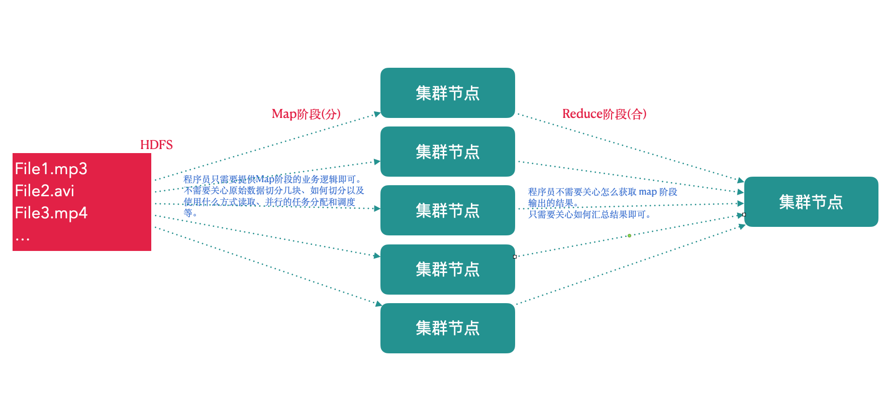
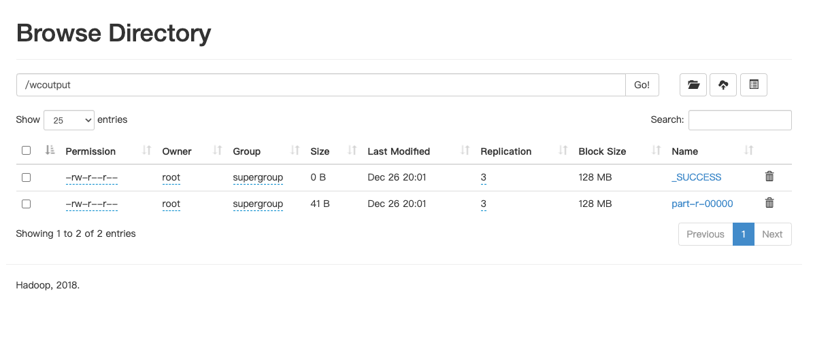
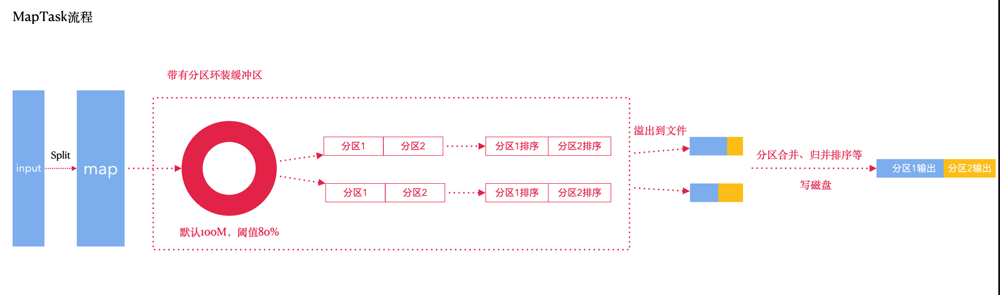
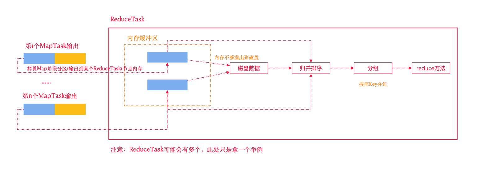

# 6. MapReduce 编程框架

## 6.1 MapReduce 思想

MapReduce 思想在生活中处处可见。我们或多或少都曾接触过这种思想。

MapReduce的思想核心是**分而治之**，充分利用了并行处理的优势。

> 即使是发布过论文实现分布式计算的谷歌也只是实现了这种思想，而不是自己原创。

MapReduce任务过程是分为两个处理阶段:

- Map阶段: Map阶段的主要作用是『分』，即把复杂的任务分解为若干个『简单的任务』来并行处理。Map阶段的这些任务可以并行计算，彼此间没有依赖关系。
- Reduce阶段: Reduce阶段的主要作用是『合』，即对map阶段的结果进行全局汇总。

再次理解MapReduce的思想



## 6.2 WordCount 源码解析

WordCount 源代码如下：

```java
public class WordCount {
    public WordCount() {
    }

    public static void main(String[] args) throws Exception {
        Configuration conf = new Configuration();
        String[] otherArgs = (new GenericOptionsParser(conf, args)).getRemainingArgs();
        if (otherArgs.length < 2) {
            System.err.println("Usage: wordcount <in> [<in>...] <out>");
            System.exit(2);
        }
        // 构建Job对象
        Job job = Job.getInstance(conf, "word count");
        job.setJarByClass(WordCount.class);
        job.setMapperClass(WordCount.TokenizerMapper.class);
        job.setCombinerClass(WordCount.IntSumReducer.class);
        job.setReducerClass(WordCount.IntSumReducer.class);
        job.setOutputKeyClass(Text.class);
        job.setOutputValueClass(IntWritable.class);
        // 设置当前任务的输入和输出数据的路径
        for (int i = 0; i < otherArgs.length - 1; ++i) {
            FileInputFormat.addInputPath(job, new Path(otherArgs[i]));
        }
        FileOutputFormat.setOutputPath(job, new Path(otherArgs[otherArgs.length - 1]));
        // 提交任务
        System.exit(job.waitForCompletion(true) ? 0 : 1);
    }

    public static class IntSumReducer extends Reducer<Text, IntWritable, Text, IntWritable> {
        private IntWritable result = new IntWritable();

        public IntSumReducer() {
        }

        // Reduce 阶段的业务逻辑
        public void reduce(Text key, Iterable<IntWritable> values, Reducer<Text, IntWritable, Text, IntWritable>.Context context) throws IOException, InterruptedException {
            // key: map 阶段输出的key(单词,因为map阶段输出的是<单词,1>这种结构)； 
            // value: 迭代器，数据在 map 阶段结束后，MR 框架进行了 shuffle 操作; value 是一组相同key的value(map阶段输出的value)的集合。
            int sum = 0;
            IntWritable val;
            for (Iterator i$ = values.iterator(); i$.hasNext(); sum += val.get()) {
                val = (IntWritable) i$.next();
            }
            this.result.set(sum);
            context.write(key, this.result);
        }
    }

    // 注意：此处的 Mapper 的泛型。前两个类型是输入的 <k,v> 的类型，后两个是输出的 <k, v> 的类型。
    public static class TokenizerMapper extends Mapper<Object, Text, Text, IntWritable> {
        private static final IntWritable one = new IntWritable(1);
        private Text word = new Text();

        public TokenizerMapper() {
        }

        // Map 阶段任务的业务逻辑定义在此方法中
        public void map(Object key, Text value, Mapper<Object, Text, Text, IntWritable>.Context context) throws IOException, InterruptedException {
            // key:一行文本的偏移量；value:一行文本
            StringTokenizer itr = new StringTokenizer(value.toString());
            // map 接收到一行文本数据，把文本按照指定分隔符切分，然后得到单词。map最终输出<单词, 1>
            while (itr.hasMoreTokens()) {
                this.word.set(itr.nextToken());
                context.write(this.word, one);
            }
        }
    }
}
```

经过查看分析官方WordCount案例源码我们发现一个统计单词数量的 MapReduce 程序的代码由三个部分组成，

- Mapper类
- Reducer类
- 运行作业的代码(Driver)

Mapper 类继承了 `org.apache.hadoop.mapreduce.Mapper` 类重写了其中的 `map` 方法，
Reducer类继承了 `org.apache.hadoop.mapreduce.Reducer` 类重写了其中的 `reduce` 方法。

- 重写的Map方法作用: map方法其中的逻辑就是用户希望mr程序map阶段如何处理的逻辑;
- 重写的Reduce方法作用: reduce方法其中的逻辑是用户希望mr程序reduce阶段如何处理的逻辑;

### 6.2.1 Hadoop序列化

为什么进行序列化?

序列化主要是我们通过网络通信传输数据时或者把对象持久化到文件，需要把对象序列化成二进制的结构。

观察源码时发现自定义 Mapper 类与自定义 Reducer 类都有泛型类型约束，比如自定义 Mapper 有四个形参类型，但是形参类型并不是常见的java基本类型。

为什么 Hadoop 要选择建立自己的序列化格式而不使用 Java 自带 serializable?

序列化在分布式程序中非常重要。在 Hadoop 中，集群中多个节点的进程间的通信是通过RPC(远程过程调用: Remote Procedure Call)实现;
RPC 将消息序列化成二进制流发送到远程节点，远程节点再将接收到的二进制数据反序列化为原始的消息，因此 RPC 往往追求如下特点:

- 紧凑: 数据更紧凑，能充分利用网络带宽资源
- 快速: 序列化和反序列化的性能开销更低

Hadoop 使用的是自己的序列化格式 Writable,它比 Java 的序列化 serialization 更紧凑速度更快。

一个对象使用 Serializable 序列化后，会携带很多额外信息比如：校验信息，Header，继承体系等。

Java 基本类型与 Hadoop 常用序列化类型

| Java 基本类型 | Hadoop Writable 类型 |
|-----------|--------------------|
| boolean   | BooleanWritable    |
| byte      | ByteWritable       |
| int       | IntWritable        |
| float     | FloatWritable      |
| long      | LongWritable       |
| double    | DoubleWritable     |
| String    | Text               |
| map       | MapWritable        |
| array     | ArrayWritable      | 

## 6.3 MapReduce编程规范及示例

### 6.3.1 Mapper类

- 用户自定义一个 Mapper 类继承 Hadoop 的 Mapper 类
- Mapper的输入数据是KV对的形式(类型可以自定义)
- Map阶段的业务逻辑定义在 `map()` 方法中
- Mapper的输出数据是KV对的形式(类型可以自定义)

> 注意: `map()` 方法对输入的每个KV对都会调用一次!!

### 6.3.2 Reducer类

- 用户自定义 Reducer 类要继承 Hadoop 的 Reducer 类
- Reducer 的输入数据类型对应 Mapper 的输出数据类型(KV 对)
- Reducer 的业务逻辑写在 `reduce()` 方法中
- `reduce()` 方法对相同K的一组KV调用执行一次

### 6.3.3 Driver阶段

创建提交 YARN 集群运行的 Job 对象，其中封装了 MapReduce 程序运行所需要的相关参数入数据路径，输出数据路径等，
也相当于是一个YARN集群的客户端，主要作用就是提交我们 MapReduce 程序运行。

### 6.3.4 WordCount 代码实现

#### 6.3.4.1 需求

在给定的文本文件中统计输出每一个单词出现的总次数

输入数据: wc.txt;

输出数据:

```text
apache  2
clickhouse  2
hadoop  1
mapreduce   1
spark   2
xiaoming    1
```

#### 6.3.4.2 具体步骤

按照 MapReduce 编程规范，分别编写 `Mapper`，`Reducer`，`Driver`。

##### 1. 新建maven工程

1. 导入 `hadoop` 依赖和 maven 打包插件

```xml
<!--maven打包插件 -->
<build>
    <plugins>
        <plugin>
            <artifactId>maven-compiler-plugin</artifactId>
            <version>2.3.2</version>
            <configuration>
                <source>1.8</source>
                <target>1.8</target>
            </configuration>
        </plugin>
        <plugin>
            <artifactId>maven-assembly-plugin</artifactId>
            <configuration>
                <descriptorRefs>
                    <descriptorRef>jar-with-dependencies</descriptorRef>
                </descriptorRefs>
            </configuration>
            <executions>
                <execution>
                    <id>make-assembly</id>
                    <phase>package</phase>
                    <goals>
                        <goal>single</goal>
                    </goals>
                </execution>
            </executions>
        </plugin>
    </plugins>
</build>
```

2. 添加log4j.properties

```properties
log4j.rootLogger=INFO, stdout
log4j.appender.stdout=org.apache.log4j.ConsoleAppender
log4j.appender.stdout.layout=org.apache.log4j.PatternLayout
log4j.appender.stdout.layout.ConversionPattern=%d %p [%c] - %m%n
log4j.appender.logfile=org.apache.log4j.FileAppender
log4j.appender.logfile.File=target/spring.log
log4j.appender.logfile.layout=org.apache.log4j.PatternLayout
log4j.appender.logfile.layout.ConversionPattern=%d %p [%c] - %m%n
```

##### 2. 整体思路梳理(仿照源码)

Map阶段

1. `map()` 方法中把传入的数据转为String类型
2. 根据空格切分出单词
3. 输出 `<单词，1>`

Reduce阶段

1. 汇总各个 key(单词)的个数，遍历 value 数据进行累加
2. 输出 key 的总数

Driver

1. 获取配置文件对象，获取 job 对象实例
2. 指定程序 jar 的本地路径
3. 指定 Mapper / Reducer 类
4. 指定 Mapper 输出的 kv 数据类型
5. 指定最终输出的 kv 数据类型
6. 指定 job 处理的原始数据路径
7. 指定 job 输出结果路径
8. 提交作业

##### 3. 编写 Mapper 类

```java
// 1.继承 Mapper 类
// 2.Mapper 类的泛型参数共四个，两对KV。
// 2.1.第一对KV是 map 输入参数类型 (文本偏移量，一行文本内容)
// 2.2.第二对KV是 map 输出参数类型 (单词，1)
public class WordCountMapper extends Mapper<LongWritable, Text, Text, IntWritable> {
    Text word = new Text();
    IntWritable one = new IntWritable(1);

    @Override
    protected void map(LongWritable key, Text value, Mapper<LongWritable, Text, Text, IntWritable>.Context context) throws IOException, InterruptedException {
        // 主要业务逻辑：
        // 1.接收到文本内容，转换为 string 类型
        String str = value.toString();
        // 2.按照空格进行切分
        String[] words = str.split(" ");
        // 3.输出 <单词，1>
        for (String s : words) {
            word.set(s);
            context.write(word, one);
        }
    }
}
```

##### 4. 编写 Reducer 类

```java
// 继承的 Reducer 类有四个泛型参数
// 两对KV：第一对类型要与 Mapper 输出类型保持一致；第二对KV自己设计的输出结果数据
public class WordCountReducer extends Reducer<Text, IntWritable, Text, IntWritable> {

    IntWritable total = new IntWritable();

    // key: map 方法输出的 key，本案例中是单词
    // values: 一组key相同的value，组成的集合
    @Override
    protected void reduce(Text key, Iterable<IntWritable> values, Reducer<Text, IntWritable, Text, IntWritable>.Context context) throws IOException, InterruptedException {
        // 遍历 values，累加结果
        int sum = 0;
        for (IntWritable value : values) {
            int val = value.get();
            sum += 1;
        }
        // 直接输出当前 key 对应的 sum 值，结果就是单词出现的总次数
        total.set(sum);
        context.write(key, total);
    }
}
```

##### 5. 编写 Driver 类

```java
// 封装任务并提交运行
public class WordCountDriver {
    public static void main(String[] args) throws IOException, InterruptedException, ClassNotFoundException {
        // 1. 获取配置文件对象，获取job对象实例
        Configuration conf = new Configuration();
        Job job = Job.getInstance(conf, "WordCountDriver");
        // 2. 指定程序jar的本地路径
        job.setJarByClass(WordCountDriver.class);
        // 3. 指定Mapper/Reducer类
        job.setMapperClass(WordCountMapper.class);
        job.setReducerClass(WordCountReducer.class);
        // 4. 指定Mapper输出的kv数据类型
        job.setMapOutputKeyClass(Text.class);
        job.setMapOutputValueClass(IntWritable.class);
        // 5. 指定最终输出的kv数据类型
        job.setOutputKeyClass(Text.class);
        job.setOutputValueClass(IntWritable.class);
        // 6. 指定job处理的原始数据路径
        FileInputFormat.setInputPaths(job, new Path(args[0]));
        // 7. 指定job输出结果路径
        FileOutputFormat.setOutputPath(job, new Path(args[1]));
        // 8. 提交作业
        boolean flag = job.waitForCompletion(true);
        // JVM 退出：0正常退出；非0错误退出
        System.exit(flag ? 0 : 1);
    }
}
```

##### 6. 运行任务

1. 本地模式

设置程序实际参数，参数间使用空格分割

```text
/Users/faustine/Downloads/wc.txt /Users/faustine/Downloads/output
```

> 注意：本地idea运行mr任务与集群没有任何关系，没有提交任务到yarn集群，是在本地使用多线程的方式模拟的mr的运行。

查看输出结果

```shell
ls -al

total 24
drwxr-xr-x@  6 faustine  staff  192 12 26 19:37 .
drwx------@ 18 faustine  staff  576 12 26 19:37 ..
-rw-r--r--   1 faustine  staff    8 12 26 19:37 ._SUCCESS.crc
-rw-r--r--   1 faustine  staff   12 12 26 19:37 .part-r-00000.crc
-rw-r--r--   1 faustine  staff    0 12 26 19:37 _SUCCESS
-rw-r--r--   1 faustine  staff   46 12 26 19:37 part-r-00000
```

2. YARN 集群模式

- 把程序打成 jar 包，改名为 `wc.jar`，上传到Hadoop集群
- 启动 Hadoop 集群(Hdfs, Yarn)
- 使用 Hadoop 命令提交任务运行

```shell
hadoop jar wc.jar com.faustine.mr.wc.WordCountDriver /wcinput /wcoutput
```

> 准备的原始数据文件，需要上传到HDFS的路径，不能是本地路径，因为跨节点运行无法获取数据!!

执行结果



## 6.4 序列化Writable接口

基本序列化类型往往不能满足所有需求，比如在 Hadoop 框架内部传递一个自定义bean对象，那么该对象就需要实现 `Writable` 序列化接口。

### 6.4.1 实现 Writable 序列化步骤

1. 必须实现 `Writable` 接口
2. 反序列化时，需要反射调用空参构造函数，所以必须有空参构造

```java
public CustomBean() {
    super();
}
```

3. 重写序列化方法

```java
@Override
public void write(DataOutput out) throws IOException {
    // ...
}
```

4. 重写反序列化方法

```java
@Override
public void readFields(DataInput in) throws IOException {
    // ...
}
```

5. 反序列化的字段顺序和序列化字段的顺序必须完全一致
6. 方便展示结果数据，需要重写 Bean 对象的 `toString()` 方法，可以自定义分隔符
7. 如果自定义 Bean 对象需要放在 Mapper 输出KV中的K, 则该对象还需实现 `Comparable` 接口，因为因为 MapReduce 框中的 Shuffle 过程要求key必须能排序!!

```java
@Override
public int compareTo(CustomBean o) { // 自定义排序规则
    return this.num > o.getNum() ? -1 : 1;
}
```

> 排序内容专门案例讲解!!

### 6.4.2 Writable 接口案例

1. 需求

统计每台智能音箱设备内容播放时长
   
原始日志格式

```text
001     001577c3        kar_890809              120.196.100.99          1116                954                      200
日志ID    设备ID        appkey(合作硬件厂商)          网络IP             自由内容时长(秒)      第三方内容时长(秒)      网络状态码
```

输出结果

```text
001577c3            11160               9540                     20700
设备ID            自有内容时长(秒)       第三方内容时长(秒)          总时长      
```

`map()` 方法输出的kv以及具体类型如何确定？

mr 中 `map()` 方法输出的 kv 中的 k，如果是相同 key, 则会去往同一个 reducer 调用 `reduce()` 方法

`reduce()` 方法中，输入参数 key: `map()` 方法输出的某个 key; value: 是一个集合，这个集合中的数据都来自 `map()` 输出的 key/value，而且是 key 相同的所有 KV 对的 value 集合。

整体思路分析：

Map 阶段：

- 读取一行文本数据，按照制表符切分出设备ID
- 抽取出自有内容时长、第三方内容时长、设备ID
- 输出数据（Key -> 设备ID; value -> 封装一个 Bean 对象, 由 Bean 对象携带自有时长、第三方内容时长、设备ID）
- 自定义 Bean 对象作为 Value 输出，需要实现 Writable 序列化接口

Reduce 阶段：

- 在 `reduce()` 方法中直接遍历迭代器，累加时长然后输出即可

2. 编写 MapReduce 程序

创建SpeakBean对象

```java
/**
 * 这个类型是 map 输出的 KV 中的 Value 的类型，需要实现 Writable 序列化接口
 */
@Data
@NoArgsConstructor
public class SpeakBean implements Writable {

    // 定义属性
    private Long selfDuration; // 自有内容时长
    private Long thirdPartDuration; // 第三方内容时长
    private String deviceId; // 设备ID
    private Long sumDuration; // 总时长

    public SpeakBean(Long selfDuration, Long thirdPartDuration, String deviceId) {
        this.selfDuration = selfDuration;
        this.thirdPartDuration = thirdPartDuration;
        this.deviceId = deviceId;
        this.sumDuration = this.selfDuration + this.thirdPartDuration;
    }

    // 序列化方法: 就是把内容输出到网络或文本中
    @Override
    public void write(DataOutput out) throws IOException {
        out.writeLong(selfDuration);
        out.writeLong(thirdPartDuration);
        out.writeUTF(deviceId);
        out.writeLong(sumDuration);
    }

    // 反序列化方法
    @Override
    public void readFields(DataInput in) throws IOException {
        this.selfDuration = in.readLong(); // 自有时长
        this.thirdPartDuration = in.readLong(); // 第三方时长
        this.deviceId = in.readUTF(); // 设备ID
        this.sumDuration = in.readLong(); // 总时长
    }

}
```

编写Mapper类

```java
// 四个参数分为两对 KV
// 第一对：map 输入参数的 KV 类型。K -> 一行文本偏移量; V -> 一行文本内容
// 第二对：map 输出参数类型。K -> map 输出的 key 类型; V -> map 输出的 value 类型
public class SpeakMapper extends Mapper<LongWritable, Text, Text, SpeakBean> {

    Text device_id = new Text();

    @Override
    protected void map(LongWritable key, Text value, Mapper<LongWritable, Text, Text, SpeakBean>.Context context) throws IOException, InterruptedException {
        // 1. 转换接收到的 Text 数据为 String 类型
        String line = value.toString();
        // 2. 按照制表符进行切分，得到自有内容时长、第三方内容时长、设备ID并封装为 SpeakBean
        String[] fields = line.split("\t");
        String selfDuration = fields[fields.length -3];
        String thirdPartDuration = fields[fields.length -2];
        String deviceId = fields[1];
        SpeakBean speakBean = new SpeakBean(Long.valueOf(selfDuration), Long.valueOf(thirdPartDuration), deviceId);
        // 3. 直接输出 (K -> 设备ID, V -> SpeakBean)
        device_id.set(deviceId);
        context.write(device_id, speakBean);
    }
}
```

编写 Reducer 类

```java
public class SpeakReducer extends Reducer<Text, SpeakBean, Text, SpeakBean> {

    @Override
    protected void reduce(Text key, Iterable<SpeakBean> values, Reducer<Text, SpeakBean, Text, SpeakBean>.Context context) throws IOException, InterruptedException {
        // 定义时长累加的初始值
        Long self_duration = 0L;
        Long third_duration = 0L;

        // reduce() 方法的 key -> map 输出的某一个 key; value -> map 输出的 KV 对中相同key组成的一个集合
        // 遍历迭代器，累加时长即可
        for (SpeakBean bean : values) {
            Long selfDuration = bean.getSelfDuration();
            Long thirdPartDuration = bean.getThirdPartDuration();
            self_duration += selfDuration;
            third_duration += thirdPartDuration;
        }
        // 封装成一个Bean对象输出
        SpeakBean bean = new SpeakBean(self_duration, third_duration, key.toString());
        context.write(key, bean);
    }
}
```

编写驱动

```java
public class SpeakDriver {

    public static void main(String[] args) throws IOException, InterruptedException, ClassNotFoundException {
        Configuration conf = new Configuration();
        Job job = Job.getInstance(conf, "speakDriver");
        // 设置 Jar 包本地路径
        job.setJarByClass(SpeakDriver.class);
        // 使用的 Mapper 和 Reducer
        job.setMapperClass(SpeakMapper.class);
        job.setReducerClass(SpeakReducer.class);
        // 设置 Map 的输出 KV 类型
        job.setMapOutputKeyClass(Text.class);
        job.setMapOutputValueClass(SpeakBean.class);
        // 设置 Reduce 输出
        job.setOutputKeyClass(Text.class);
        job.setOutputValueClass(SpeakBean.class);
        // 读取数据的路径
        FileInputFormat.setInputPaths(job, new Path(args[0]));
        FileOutputFormat.setOutputPath(job, new Path(args[1]));
        // 提交任务
        boolean flag = job.waitForCompletion(true);
        System.exit(flag ? 0 : 1);
    }

}
```

总结

- 结合业务设计 Map 输出的 Key 和 Value，利用 Key 相同则去往同一个 Reduce 的特点！
- `map()` 方法中获取到的只是一行文本，尽量不做聚合运算
- `reduce()` 方法中的参数要清楚含义

## 6.5 MapReduce原理分析

### 6.5.1 MapTask运行机制详解

MapTask流程



详细步骤:

1. 首先，读取数据组件 InputFormat(默认TextInputFormat)会通过 `getSplits()`
   方法对输入目录中的文件进行*逻辑切片*规划得到splits，有多少个split就对应启动多少个MapTask。split与block的对应关系默认是一对一。
2. 将输入文件切分为splits之后，由 RecordReader 对象(默认LineRecordReader)进行读取，以 "\n" 作为分隔符，读取一行数据，返回<key，value>。Key表示每行首字符偏移值，value表示这一行文本内容。
3. 读取split返回的<key,value>，进入用户自己继承的 Mapper 类中，执行用户重写的 `map` 方法。RecordReader 每读取一行这里就调用一次。
4. `map` 逻辑完之后，将map的每条结果通过 `context.write` 进行collect数据收集。在collect中，会先对其进行分区处理，默认使用 `HashPartitioner`。

> MapReduce提供Partitioner接口，它的作用就是根据key或value及reduce的数量来决定当前的这对输出数据最终应该交由哪个reduce task处理。
> 默认对key进行hash后再以reduce task数量取模。默认的取模方式只是为了平均reduce的处理能力，如果用户自己对Partitioner有需求，可以订制并设置到job上。

5. 接下来，会将数据写入内存，内存中这片区域叫做环形缓冲区，缓冲区的作用是批量收集map结果，减少磁盘IO的影响。我们的 key/value 对以及Partition的结果都会被写入缓冲区。当然写入之前，key与value值都会被序列化成字节数组。

> 环形缓冲区其实是一个数组，数组中存放着key/value的序列化数据和key/value的元数据信息，包括partition、key的起始位置、value的起始位置以及value的长度。环形结构是一个抽象概念。

> 缓冲区是有大小限制，默认是100MB。当map task的输出结果很多时，就可能会撑爆内存，所以需要在一定条件下将缓冲区中的数据临时写入磁盘，然后重新利用这块缓冲区。
> 这个从内存往磁盘写数据的过程被称为Spill，中文可译为溢写。这个溢写是由单独线程来完成，不影响往缓冲区写map结果的线程。
> 溢写线程启动时不应该阻止map的结果输出，所以整个缓冲区有个溢写的比例 `spill.percent`。这个比例默认是0.8，也就是当缓冲区的数据已经达到阈值(buffer size * spill percent = 100MB * 0.8 = 80MB)，溢写线程启动，锁定这80MB的内存，执行溢写过程。
> Map task的输出结果还可以往剩下的20MB内存中写，互不影响。

6. 当溢写线程启动后，需要对这80MB空间内的key做排序(Sort)。排序是MapReduce模型默认的行为!

> 如果job设置过Combiner，那么现在就是使用Combiner的时候了。将有相同key的key/value对的 value加起来，减少溢写到磁盘的数据量。Combiner会优化MapReduce的中间结果，所以它在整个模型中会多次使用。

> 哪些场景才能使用Combiner呢?
> 
> 从这里分析，Combiner的输出是Reducer的输入，Combiner绝不能改变最终的计算结果。Combiner只应该用于那种Reduce的输入key/value与输出key/value类型完全一致，且不影响最终结果的场景。比如累加，最大值等。
> Combiner的使用一定得慎重，如果用好，它对job执行效率有帮助，反之会影响reduce的最终结果。

7. 合并溢写文件:每次溢写会在磁盘上生成一个临时文件(写之前判断是否有combiner)，如果map的输出结果真的很大，有多次这样的溢写发生，磁盘上相应的就会有多个临时文件存在。
   当整个数据处理结束之后开始对磁盘中的临时文件进行merge合并，因为最终的文件只有一个写入磁盘，并且为这个文件提供了一个索引文件，以记录每个reduce对应数据的偏移量。

至此map整个阶段结束!! 

> Map 阶段所有的排序，都是针对 map 输出的 key/value 的 key 进行的排序。

### 6.5.2 MapTask 的并行度

> 并行度就是指 MapTask 的数量

1. MapTask并行度思考

MapTask的并行度决定Map阶段的任务处理并发度，从而影响到整个Job的处理速度。

> 思考: MapTask并行任务是否越多越好呢?哪些因素影响了MapTask并行度?

2. MapTask并行度决定机制

- 数据块: Block是HDFS物理上把数据分成一块一块。
- 切片: 数据切片只是在逻辑上对输入进行分片，并不会在磁盘上将其切分成片进行存储。

> 分片大小与 Block 大小的关系？ 默认就是 Block 的大小！

问题：

A 文件 300M, B 文件 100M, 两个文件都存入 HDFS 并作为某个 MR 任务的输入数据，那么当前这个 MR 任务的 split 以及 MapTask 的并行度是多少呢？

切片的计算方式：按文件逐个计算。

- A 文件：0 ~ 128, 128 ~ 256, 256 ~ 300  => 3 个切片
- B 文件：0  ~ 100 => 1 个切片

总共是4个 split, MapTask 的并行度为 4。

> 在大数据分布式计算框架中，移动计算不要移动数据。移动数据的成本很高，移动计算比较简单！


#### 6.5.2.1 切片机制源码阅读

MapTask并行度是不是越多越好呢? 

答案: 不是。 如果一个文件仅仅比128M大一点点(10%)也被当成一个split来对待，而不是多个split.

MR框架在并行运算的同时也会消耗更多资源，并行度越高资源消耗也越高，假设129M文件分为两个分片，一个是128M，一个是1M;

对于1M的切片的 MapTask 来说，太浪费资源。

> 129M 的文件在 Hdfs 存储的时候会不会切成两块?

### 6.5.3 ReduceTask 工作机制



Reduce大致分为copy、sort、reduce三个阶段，重点在前两个阶段。

copy阶段包含一个 eventFetcher 来获取已完成的map列表，由Fetcher线程去copy数据，在此过程中会启动两个merge线程，分别为inMemoryMerger和onDiskMerger，分别将内存中的数据merge到磁盘和将磁盘中的数据进行merge。

待数据copy完成之后，copy阶段就完成了，开始进行sort阶段，sort阶段主要是执行finalMerge操作，纯粹的sort阶段，完成之后就是reduce阶段，调用用户定义的reduce函数进行处理。

详细步骤

- Copy阶段，简单地拉取数据。

Reduce进程启动一些数据copy线程(Fetcher)，通过HTTP方式请求 mapTask 获取属于自己的文件。

- Merge阶段。

这里的merge如map端的merge动作，只是数组中存放的是不同map端copy来的数值。

Copy过来的数据会先放入内存缓冲区中，这里的缓冲区大小要比map端的更为灵活。merge 有三种形式:内存到内存;内存到磁盘;磁盘到磁盘。默认情况下第一种形式不启用。
当内存中的数据量到达一定阈值，就启动内存到磁盘的merge。与map 端类似，这也是溢写的过程，这个过程中如果你设置有Combiner，也是会启用的，然后在磁盘中生成了众多的溢写文件。
第二种merge方式一直在运行，直到没有map端的数据时才结束，然后启动第三种磁盘到磁盘的merge方式生成最终的文件。

- 合并排序。

把分散的数据合并成一个大的数据后，还会再对合并后的数据排序。 

- 对排序后的键值对调用reduce方法，键相等的键值对调用一次reduce方法，每次调用会产生零个或者多个键值对，最后把这些输出的键值对写入到HDFS文件中。

### 6.5.4 ReduceTask并行度

> MapTask 并行度取决于 split 的数量，而 split 大小默认是 blockSize，所以 block 的数量约等于分片数量。

ReduceTask 的并行度同样影响整个Job的执行并发度和执行效率，但与MapTask的并发数由切片数决定不同，ReduceTask数量的决定是可以直接手动设置:

```java
// 默认值是1，手动设置为4 
job.setNumReduceTasks(4);
```

注意事项

1. ReduceTask=0，表示没有Reduce阶段，输出文件数和MapTask数量保持一致; 
2. ReduceTask数量不设置默认就是一个，输出文件数量为1个;
3. 如果数据分布不均匀，可能在Reduce阶段产生数据倾斜;

> 数据倾斜就是某个 ReduceTask 处理的数据量远远大过其他节点。数据分配不均匀导致的。

### 6.5.5 Shuffle 机制

map阶段处理的数据如何传递给reduce阶段，是MapReduce框架中最关键的一个流程，这个流程就叫shuffle。

> MapTask 的 `map()` 方法之后，ReduceTask 的 `reduce()` 方法之前，这段数据的处理过程就称为 Shuffle。
> 这个过程非常关键，是 MR 的核心阶段。

#### 6.5.5.1 MapReduce的分区与reduceTask的数量

在MapReduce中，通过我们指定分区，会将同一个分区的数据发送到同一个reduce当中进行处理(默认是key相同去往同个分区，同一个分区最终会去往同一个reduceTask)

例如: 我们为了数据的统计，我们可以把一批类似的数据发送到同一个reduce当中去，在同一个reduce当中统计相同类型的数据，

如何才能保证相同key的数据去往同个reduce呢? 只需要保证相同key的数据分发到同个分区即可。

结合以上原理分析我们知道MR程序shuffle机制默认就是这种规则 ！！

##### 1. 分区源码 

翻阅源码验证以上规则，MR程序默认使用的HashPartitioner，保证了相同的key去往同个分区!!

```java
public class JobContextImpl implements JobContext {
   public Class<? extends Partitioner<?,?>> getPartitionerClass()
           throws ClassNotFoundException {
      return (Class<? extends Partitioner<?,?>>)
              conf.getClass(PARTITIONER_CLASS_ATTR, HashPartitioner.class);
   }
}
```

```java
public class HashPartitioner<K, V> extends Partitioner<K, V> {
  /** Use {@link Object#hashCode()} to partition. */
  public int getPartition(K key, V value,
                          int numReduceTasks) {
    return (key.hashCode() & Integer.MAX_VALUE) % numReduceTasks;
  }
}
```

`getPartition()` 方法决定了每条数据进入哪个分区；`numReduceTasks` 就是 ReduceTask 的数量；

##### 2. 自定义分区 

实际生产中需求变化多端，默认分区规则往往不能满足需求，需要结合业务逻辑来灵活控制分区规则以及分区数量!!

如何制定自己需要的分区规则?

**具体步骤**

1. 自定义类继承Partitioner，重写 `getPartition()` 方法
2. 在Driver驱动中，指定使用自定义Partitioner
3. 在Driver驱动中，要根据自定义Partitioner的逻辑设置相应数量的ReduceTask数量。

**测试案例**

需求: 按照不同的 appkey 把记录输出到不同的分区中。

原始日志格式

| 001  | 001577c3 | kar_890809     | 120.196.100.99 | 1116      | 954        | 200   |
|------|----------|----------------|----------------|-----------|------------|-------|
| 日志id | 设备id     | appkey(合作硬件厂商) | 网络ip           | 自有内容时长(秒) | 第三方内容时长(秒) | 网络状态码 |

输出结果

根据appkey把不同厂商的日志数据分别输出到不同的文件中

**需求分析** 

面对业务需求，结合mr的特点，来设计map输出的kv,以及reduce输出的kv数据。

一个ReduceTask对应一个输出文件，因为在shuffle机制中每个reduceTask拉取的都是某一个分区的数据，一个分区对应一个输出文件。

结合 appkey 的前缀相同的特点，不能使用默认分区规则，而使用自定义分区器，只要 appkey 前缀相同则数据进入同个分区。
                     
**整体思路**

Mapper

1. 读取一行文本，按照制表符切分
2. 解析出appkey字段，其余数据封装为PartitionBean对象(实现序列化Writable接口)
3. 设计 `map()` 输出的kv。key -> appkey(依靠该字段完成分区)，value -> PartitionBean对象

Partition

自定义分区器，实现按照appkey字段的前缀来区分所属分区 

Reduce

`reduce()` 正常输出即可，无需进行聚合操作 

Driver

1. 在原先设置job属性的同时增加设置使用自定义分区器 
2. 注意设置ReduceTask的数量(与分区数量保持一致)

**代码实现**

```java
@Data
@NoArgsConstructor
@AllArgsConstructor
public class PartitionBean implements Writable {

    // 日志ID
    private String id;
    // 设备ID
    private String deviceId;
    // 厂商ID
    private String appKey;
    // IP 地址
    private String ip;
    // 自有内容播放时长
    private Long selfDuration;
    // 三方内容播放时长
    private Long thirdPartDuration;
    // 状态码
    private String status;

    @Override
    public void write(DataOutput dataOutput) throws IOException {
        dataOutput.writeUTF(id);
        dataOutput.writeUTF(deviceId);
        dataOutput.writeUTF(appKey);
        dataOutput.writeUTF(ip);
        dataOutput.writeLong(selfDuration);
        dataOutput.writeLong(thirdPartDuration);
        dataOutput.writeUTF(status);
    }

    @Override
    public void readFields(DataInput dataInput) throws IOException {
        this.id = dataInput.readUTF();
        this.deviceId = dataInput.readUTF();
        this.appKey = dataInput.readUTF();
        this.ip = dataInput.readUTF();
        this.selfDuration = dataInput.readLong();
        this.thirdPartDuration = dataInput.readLong();
        this.status = dataInput.readUTF();
    }

    @Override
    public String toString() {
        return id + "\t" + deviceId + "\t" + appKey + "\t" + ip + "\t" + selfDuration + "\t" + thirdPartDuration + "\t" + status;
    }
}
```

```java
// Partitioner 分区器的泛型是 map 输出的 kv 类型
public class CustomPartitioner extends Partitioner<Text, PartitionBean> {
    @Override
    public int getPartition(Text text, PartitionBean partitionBean, int numPartitions) {

        int partition = 0;

        switch (text.toString()) {
            case "kar":
                // 只需要保证满足此条件的数据获得相同的分区编号即可
                break;
            case "pandora":
                partition = 1;
                break;
            default:
                partition = 2;
                break;
        }
        return partition;
    }
}
```

```java
public class PartitionMapper extends Mapper<LongWritable, Text, Text, PartitionBean> {

    PartitionBean bean = new PartitionBean();
    Text k = new Text();


    @Override
    protected void map(LongWritable key, Text value, Mapper<LongWritable, Text, Text, PartitionBean>.Context context) throws IOException, InterruptedException {
        String[] fields = value.toString().split("\t");
        String appKey = fields[2];
        bean.setId(fields[0]);
        bean.setDeviceId(fields[1]);
        bean.setAppKey(appKey);
        bean.setIp(fields[3]);
        bean.setSelfDuration(Long.valueOf(fields[4]));
        bean.setThirdPartDuration(Long.valueOf(fields[5]));
        bean.setStatus(fields[6]);

        k.set(appKey);

        // shuffle 开始时，会根据 k 的hashCode 值进行分区，但是我们的业务默认hash分区方式不能满足
        context.write(k, bean);
    }
}
```

```java
// reduce 输入类型和 map 的输出类型一致
public class PartitionReducer extends Reducer<Text, PartitionBean, Text, PartitionBean> {

    @Override
    protected void reduce(Text key, Iterable<PartitionBean> values, Reducer<Text, PartitionBean, Text, PartitionBean>.Context context) throws IOException, InterruptedException {
        // 无需聚合运算，只需要进行输出即可
        for (PartitionBean bean : values) {
            context.write(key, bean);
        }
    }
}
```

```java
public class PartitionDriver {

    public static void main(String[] args) throws IOException, InterruptedException, ClassNotFoundException {
        // 1.获取配置文件
        Configuration conf = new Configuration();
        // 2.获取 Job 实例
        Job job = Job.getInstance(conf);
        // 3.设置任务相关参数
        job.setJarByClass(PartitionDriver.class);
        job.setMapperClass(PartitionMapper.class);
        job.setReducerClass(PartitionReducer.class);

        job.setMapOutputKeyClass(Text.class);
        job.setMapOutputValueClass(PartitionBean.class);

        job.setOutputKeyClass(Text.class);
        job.setOutputValueClass(PartitionBean.class);

        // 4.设置使用自定义分区器
        job.setPartitionerClass(CustomPartitioner.class);
        // 5.指定 ReduceTask 的数量与分区数量保持一致
        job.setNumReduceTasks(3);
        // 6.指定输入和输出数据路径
        FileInputFormat.setInputPaths(job, new Path("D:/tmp/test/mr/input"));
        FileOutputFormat.setOutputPath(job, new Path("D:/tmp/test/partition/output"));
        // 7.提交任务
        boolean flag = job.waitForCompletion(true);
        System.exit(flag ? 0 : 1);
    }

}
```

总结

1. 自定义分区器时，最好保证分区数量与reduceTask数量保持一致。
2. 如果分区数量不止1个，但是reduceTask数量只有1个，此时只会输出一个文件(此时不会报错，但是分区将没有意义)。
3. 如果reduceTask数量大于分区数量，会输出多个空文件。
4. 如果reduceTask数量小于分区数量，有可能会报错。


#### 6.5.5.2 MapReduce 中的 Combiner


> combiner 运行机制: combiner 运行在 mapTask 的溢写文件之后，reduceTask 拉取数据之前，进行文件的预聚合。

1. Combiner是MR程序中Mapper和Reducer之外的一种组件
2. Combiner组件的父类就是 *Reducer*
3. Combiner和reducer的区别在于运行的位置
4. Combiner是在每一个mapTask所在的节点运行;
5. Combiner的意义就是对每一个mapTask的输出进行局部汇总，以减小网络传输量。
6. Combiner能够应用的前提是不能影响最终的业务逻辑，此外，Combiner的输出kv应该跟reducer的输入kv类型要对应起来。 

举例说明

假设一个计算平均值的MR任务

Map阶段: 2个MapTask

MapTask1输出数据: 10,5,15 如果使用Combiner:(10+5+15)/3=10 

MapTask2输出数据:2,6 如果使用Combiner:(2+6)/2=4 

Reduce阶段汇总: (10+4)/2=7

而正确结果应该是: 10+5+15+2+6)/5=7.6


- 自定义Combiner实现步骤 

1. 自定义一个Combiner继承Reducer，重写Reduce方法 
2. 在驱动(Driver)设置使用Combiner(默认是不使用Combiner组件)

**代码实现**

改造WordCount程序，添加 combine 组件

```java
// combiner 组件的输入和输出类型，与 map() 方法保持一致
public class WordCountCombiner extends Reducer<Text, IntWritable, Text, IntWritable> {
    IntWritable total = new IntWritable();
    @Override
    protected void reduce(Text key, Iterable<IntWritable> values, Reducer<Text, IntWritable, Text, IntWritable>.Context context) throws IOException, InterruptedException {
        // 进行局部汇总，逻辑是与 reduce 方法保持一致
        int num = 0;
        for (IntWritable value : values) {
            int i = value.get();
            num += i;
        }
        // 输出单词和累加结果
        total.set(num);
        context.write(key, total);
    }
}
```

在驱动(Driver)设置使用Combiner

```java
// 5.1 设置使用 combiner 组件
job.setCombinerClass(WordCountCombiner.class);
```

验证结果

观察程序运行日志

```text
Map-Reduce Framework
	Map input records=9
	Map output records=9
	Map output bytes=104
	Map output materialized bytes=128
	Input split bytes=102
	Combine input records=0     // 未使用
	Combine output records=0    // 未使用
	Reduce input groups=6
	Reduce shuffle bytes=128
	Reduce input records=9
```

```text
Map-Reduce Framework
	Map input records=9
	Map output records=9
	Map output bytes=104
	Map output materialized bytes=86
	Input split bytes=102
	Combine input records=9     // 使用 combine 组件
	Combine output records=6    // 减少了 map 输入到 reduce 的数据
	Reduce input groups=6
	Reduce shuffle bytes=86
```

> 如果直接使用WordCountReducer作为Combiner使用是否可以?
> 
> 直接使用Reducer作为Combiner组件来使用是可以的!!


### 6.5.6 MapReduce中的排序 

> 排序是MapReduce框架中最重要的操作之一。

MapTask 和 ReduceTask 均会对数据按照key进行排序。该操作属于Hadoop的默认行为。任何应用程序中的数据均会被排序，而不管逻辑上是否需要。默认排序是按照字典顺序排序，且实现该排序的方法是快速排序。

MapTask

它会将处理的结果暂时放到环形缓冲区中，当环形缓冲区使用率达到一定阈值后，再对缓冲区中的数据进行一次快速排序，并将这些有序数据溢写到磁盘上，溢写完毕后，它会对磁盘上所有文件进行归并排序。

ReduceTask

当所有数据拷贝完毕后，ReduceTask 统一对内存和磁盘上的所有数据进行一次归并排序。

1. 部分排序

MapReduce根据输入记录的键对数据集排序。保证输出的每个文件内部有序。

2. 全排序
   
最终输出结果只有一个文件，且文件内部有序。

实现方式是只设置一个ReduceTask。但该方法在处理大型文件时效率极低，因为一台机器处理所有文件，完全丧失了MapReduce所提供的并行架构。

3. 辅助排序: (GroupingComparator分组) 在Reduce端对key进行分组。

应用于:在接收的key为bean对象时，想让一个或几个字段相同(全部字段比较不相同)的key进入到同一个reduce方法时，可以采用分组排序。

4. 二次排序. 在自定义排序过程中，如果compareTo中的判断条件为两个即为二次排序。


#### 6.5.6.1 WritableComparable

Bean对象如果作为Map输出的key时，需要实现WritableComparable接口并重写compareTo方法指定排序规则

##### 1.全排序 

基于统计的播放时长案例的输出结果对总时长进行排序 

实现全局排序只能设置一个ReduceTask!!

**测试案例**

播放时长案例输出结果

```text
00fdaf3	33180	33420	00fdaf3	66600
00wersa4	30689	35191	00wersa4	65880
0a0fe2	43085	44254	0a0fe2	87339
0ad0s7	31702	29183	0ad0s7	60885
0sfs01	31883	29101	0sfs01	60984
a00df6s	33239	36882	a00df6s	70121
adfd00fd5	30727	31491	adfd00fd5	62218
```

**需求分析**

如何设计 `map()` 方法输出的 key, value ?

> MR框架中shuffle阶段的排序是默认行为，不管你是否需要都会进行排序。

key: 把所有字段封装成为一个bean对象，并且指定bean对象作为key输出，如果作为key输出，需要实现排序接口，指定自己的排序规则;

**具体步骤**

Mapper

1. 读取结果文件，按照制表符进行切分
2. 解析出相应字段封装为SpeakBean
3. SpeakBean实现WritableComparable接口重写compareTo方法 
4. map()方法输出kv; key-->SpeakBean,value-->NullWritable.get()
   
Reducer

循环遍历输出

**代码实现**

自定义 Bean 对象

```java
@Data
@NoArgsConstructor
@AllArgsConstructor
// 因为这个类的实例对象要作为 map 输出的key，所以需要实现 WritableComparable 接口
public class SortSpeakBean implements WritableComparable<SortSpeakBean> {

    // 属性定义
    private Long selfDuration; // 自有内容播放时长
    private Long thirdPartDuration; // 三方内容播放时长
    private String deviceId; // 设备ID
    private Long sumDuration; // 总时长

    // 指定排序规则
    @Override
    public int compareTo(SortSpeakBean o) {
        // 安装Bean对象的总时长进行排序
        return o.sumDuration.compareTo(this.sumDuration); // 如果一个条件相同，再比较第二个成员变量，就是“二次排序”
    }

    // 序列化方法
    @Override
    public void write(DataOutput dataOutput) throws IOException {
        dataOutput.writeLong(selfDuration);
        dataOutput.writeLong(thirdPartDuration);
        dataOutput.writeUTF(deviceId);
        dataOutput.writeLong(sumDuration);
    }

    // 反序列化方法
    @Override
    public void readFields(DataInput dataInput) throws IOException {
        this.selfDuration = dataInput.readLong();
        this.thirdPartDuration = dataInput.readLong();
        this.deviceId = dataInput.readUTF();
        this.sumDuration = dataInput.readLong();
    }

    @Override
    public String toString() {
        return selfDuration +
                "\t" + thirdPartDuration +
                "\t" + deviceId +
                "\t" + sumDuration;
    }
}
```

Mapper代码

```java
public class SortMapper extends Mapper<LongWritable, Text, SortSpeakBean, NullWritable> {

    SortSpeakBean bean = new SortSpeakBean();

    @Override
    protected void map(LongWritable key, Text value, Mapper<LongWritable, Text, SortSpeakBean, NullWritable>.Context context) throws IOException, InterruptedException {
        // 1.读取一行文本转为字符串，切分
        String[] fields = value.toString().split("\t");
        // 2.解析出各个字段，封装成 SortSpeakBean 对象
        bean.setDeviceId(fields[0]);
        bean.setSelfDuration(Long.valueOf(fields[1]));
        bean.setThirdPartDuration(Long.valueOf(fields[2]));
        bean.setSumDuration(Long.valueOf(fields[4]));

        // 3.输出 SortSpeakBean 作为key输出
        context.write(bean, NullWritable.get());
    }
    
}
```

Reducer代码

```java
public class SortReducer extends Reducer<SortSpeakBean, NullWritable, SortSpeakBean, NullWritable> {

    // reduce 方法的调用是相同 key 组成的 value 的集合，调用一次
    @Override
    protected void reduce(SortSpeakBean key, Iterable<NullWritable> values, Reducer<SortSpeakBean, NullWritable, SortSpeakBean, NullWritable>.Context context) throws IOException, InterruptedException {
        // 按照总流量进行排序，还需要在 reduce 端进行处理吗？
        // 因为之前已经利用 MR 的 shuffle 对数据进行了排序，
        for (NullWritable value : values) {
            // 遍历 value 的同时, key 也会变化
            context.write(key, value);
        }
    }
}
```

Driver 代码

```java
public class SortDriver {

    public static void main(String[] args) throws IOException, InterruptedException, ClassNotFoundException {
        // 1. 获取配置文件对象，获取job对象实例
        Configuration conf = new Configuration();
        Job job = Job.getInstance(conf, "SortDriver");
        // 2. 指定程序jar的本地路径
        job.setJarByClass(SortDriver.class);
        // 3. 指定Mapper/Reducer类
        job.setMapperClass(SortMapper.class);
        job.setReducerClass(SortReducer.class);
        // 4. 指定Mapper输出的kv数据类型
        job.setMapOutputKeyClass(SortSpeakBean.class);
        job.setMapOutputValueClass(NullWritable.class);
        // 5. 指定最终输出的kv数据类型
        job.setOutputKeyClass(SortSpeakBean.class);
        job.setOutputValueClass(NullWritable.class);
        // 指定 reduceTask 的数量，默认是1
        job.setNumReduceTasks(1);
        // 6. 指定job处理的原始数据路径
        FileInputFormat.setInputPaths(job, new Path("D:/tmp/test/mr/speak/output"));
        // 7. 指定job输出结果路径
        FileOutputFormat.setOutputPath(job, new Path("D:/tmp/test/mr/sort/output"));
        // 8. 提交作业
        boolean flag = job.waitForCompletion(true);
        // JVM 退出：0正常退出；非0错误退出
        System.exit(flag ? 0 : 1);
    }

}
```

输出结果：

```text
43085	44254	0a0fe2	87339
33239	36882	a00df6s	70121
33180	33420	00fdaf3	66600
30689	35191	00wersa4	65880
30727	31491	adfd00fd5	62218
31883	29101	0sfs01	60984
31702	29183	0ad0s7	60885
```

总结

1. 自定义对象作为Map的key输出时，需要实现WritableComparable接口，排序: 重写 `compareTo()` 方法，序列以及反序列化方法
2. 再次理解reduce()方法的参数; reduce()方法是map输出的kv中key相同的kv中的v组成一个集合调用一次reduce()方法，选择遍历values得到所有的key(因为遍历value,key也会随之变化).
3. 默认reduceTask数量是1个;
4. 对于全局排序需要保证只有一个reduceTask!!

##### 2.分区排序

(默认的分区规则，区内有序)

#### 6.5.6.2 GroupingComparator

GroupingComparator是mapreduce当中reduce端的一个功能组件，主要的作用是决定哪些数据作为一组，调用一次reduce的逻辑。默认是每个不同的key，作为多个不同的组，每个组调用一次reduce逻辑，

我们可以自定义GroupingComparator实现不同的key作为同一个组，调用一次reduce逻辑。

##### 测试案例

原始数据

| 订单id          | 商品id   | 成交金额  |
|---------------|--------|-------|
| Order_0000001 | Pdt_01 | 222.8 |
| Order_0000001 | Pdt_05 | 25.8  |
| Order_0000002 | Pdt_03 | 522.8 |
| Order_0000002 | Pdt_04 | 122.4 |
| Order_0000002 | Pdt_05 | 722.4 |
| Order_0000003 | Pdt_01 | 232.8 |

需求：需要求出每一个订单中成交金额最大的一笔交易。

**实现思路**

Mapper

- 读取一行文本数据，切分出每个字段; 
- 订单id和金额封装为一个Bean对象，Bean对象的排序规则指定为先按照订单Id排序，订单Id相等再按照金额降序排;
- map() 方法输出kv; key-->bean对象，value-->NullWritable.get();

Shuffle

- 指定分区器，保证订单id相同的数据去往同一个分区(自定义分区器) 
- 指定GroupingComparator，分组规则指定只要订单Id相等则认为属于同一组;

Reduce 

- 每个 `reduce()` 方法写出一组 key 的第一个

**代码实现**

自定义Bean对象

```java
@Data
@NoArgsConstructor
@AllArgsConstructor
public class OrderBean implements WritableComparable<OrderBean> {

    private String orderId; // 订单ID
    private Double price; // 金额

    // 指定排序规则。先按照订单ID比较，再按照金额比较
    @Override
    public int compareTo(OrderBean o) {
        // 二次排序：此处主要是用于所有数据的排序
        int res = this.orderId.compareTo(o.getOrderId());
        return res == 0 ? -this.price.compareTo(o.getPrice()) : res;
    }

    // 序列化
    @Override
    public void write(DataOutput dataOutput) throws IOException {
        dataOutput.writeUTF(orderId);
        dataOutput.writeDouble(price);
    }

    // 反序列化方法
    @Override
    public void readFields(DataInput dataInput) throws IOException {
        this.orderId = dataInput.readUTF();
        this.price = dataInput.readDouble();
    }

    @Override
    public String toString() {
        return orderId +
                "\t" + price;
    }
}
```

Mapper

```java
public class GroupMapper extends Mapper<LongWritable, Text, OrderBean, NullWritable> {

    OrderBean bean = new OrderBean();

    @Override
    protected void map(LongWritable key, Text value, Mapper<LongWritable, Text, OrderBean, NullWritable>.Context context) throws IOException, InterruptedException {
        String[] fields = value.toString().split("\t");
        // 订单ID与金额封装为 OrderBean
        bean.setOrderId(fields[0]);
        bean.setPrice(Double.valueOf(fields[2]));

        context.write(bean, NullWritable.get());
    }
}
```

Partitioner

```java
public class CustomPartitioner extends Partitioner<OrderBean, NullWritable> {
    @Override
    public int getPartition(OrderBean key, NullWritable value, int numPartitions) {
        // 希望订单ID相同的数据进入同一个分区
        return (key.getOrderId().hashCode() & Integer.MAX_VALUE) % numPartitions;
    }

}
```

CustomGroupingComparator

```java
public class CustomGroupingComparator extends WritableComparator {

    public CustomGroupingComparator() {
        super(OrderBean.class, true); // 注册自定义的 GroupingComparator 接受 OrderBean 对象
    }

    // 重写 compare() 方法，来让 MR 接受 orderId 相等则两个对象相等的规则
    @Override
    public int compare(WritableComparable a, WritableComparable b) {
        // 比较两个对象的 OrderId
        OrderBean o1 = (OrderBean) a;
        OrderBean o2 = (OrderBean) b;
        return o1.getOrderId().compareTo(o2.getOrderId());
    }
}
```

Reducer

```java
public class GroupReducer extends Reducer<OrderBean, NullWritable, OrderBean, NullWritable> {
    
    @Override
    protected void reduce(OrderBean key, Iterable<NullWritable> values, Reducer<OrderBean, NullWritable, OrderBean, NullWritable>.Context context) throws IOException, InterruptedException {
        // 直接输出 key，就是金额最大的交易
        context.write(key, NullWritable.get());
    }
}
```

Driver

```java
public class GroupDriver {

    public static void main(String[] args) throws IOException, InterruptedException, ClassNotFoundException {
        // 1. 获取配置文件对象，获取job对象实例
        Configuration conf = new Configuration();
        Job job = Job.getInstance(conf, "GroupDriver");
        // 2. 指定程序jar的本地路径
        job.setJarByClass(GroupDriver.class);
        // 3. 指定Mapper/Reducer类
        job.setMapperClass(GroupMapper.class);
        job.setReducerClass(GroupReducer.class);
        // 4. 指定Mapper输出的kv数据类型
        job.setMapOutputKeyClass(OrderBean.class);
        job.setMapOutputValueClass(NullWritable.class);
        // 5. 指定最终输出的kv数据类型
        job.setOutputKeyClass(OrderBean.class);
        job.setOutputValueClass(NullWritable.class);

        // 指定分区器
        job.setPartitionerClass(CustomPartitioner.class);
        // 指定 groupingComparator
        job.setGroupingComparatorClass(CustomGroupingComparator.class);
        // 指定 reduceTask 的数量
        job.setNumReduceTasks(2);

        // 6. 指定job处理的原始数据路径
        FileInputFormat.setInputPaths(job, new Path("D:\\tmp\\test\\mr\\group\\input\\GroupingComparator\\groupingComparator.txt"));
        // 7. 指定job输出结果路径
        FileOutputFormat.setOutputPath(job, new Path("D:\\tmp\\test\\mr\\group\\output"));
        // 8. 提交作业
        boolean flag = job.waitForCompletion(true);
        // JVM 退出：0正常退出；非0错误退出
        System.exit(flag ? 0 : 1);
    }

}
```

### 6.5.7 MapReduce Join 实战

#### 6.5.7.1 MR reduce 端 join

##### 1.需求分析

需求: 投递行为数据表deliver_info:

| userId | positionId | date       |
|--------|------------|------------|
| 1001   | 177725422  | 2020-01-03 |
| 1002   | 177725422  | 2020-01-04 |
| 1002   | 177725433  | 2020-01-03 |

职位表position

| id        | positionName |
|-----------|--------------|
| 177725422 | 产品经理         |
| 177725433 | 大数据开发工程师     |

假如数据量巨大，两表的数据是以文件的形式存储在HDFS中，需要用mapreduce程序来实现一下SQL查询运算

> 如何判断读取的是哪个文件的数据？
> 
> 可以通过在 Mapper 中重写 setup() 方法，通过获取切片信息获取到正在读取的文件信息

##### 2.代码实现 

通过将关联的条件作为map输出的key，将两表满足join条件的数据并携带数据所来源的文件信息，发往同一个reduce task，在reduce中进行数据的串联

DeliverBean

```java
@Data
@NoArgsConstructor
@AllArgsConstructor
public class DeliverBean implements Writable {

    private String userId;
    private String positionId;
    private String date;
    private String positionName;
    // 判断是投递数据还是职位数据标识
    private String flag;

    @Override
    public void write(DataOutput out) throws IOException {
        out.writeUTF(userId);
        out.writeUTF(positionId);
        out.writeUTF(date);
        out.writeUTF(positionName);
        out.writeUTF(flag);
    }

    @Override
    public void readFields(DataInput in) throws IOException {
        this.userId = in.readUTF();
        this.positionId = in.readUTF();
        this.date = in.readUTF();
        this.positionName = in.readUTF();
        this.flag = in.readUTF();
    }

}
```

Mapper

```java
public class ReduceJoinMapper extends Mapper<LongWritable, Text, Text, DeliverBean> {

    String name = "";
    DeliverBean bean = new DeliverBean();
    Text k = new Text();

    // map 任务启动时执行一次
    @Override
    protected void setup(Mapper<LongWritable, Text, Text, DeliverBean>.Context context) throws IOException, InterruptedException {
        FileSplit inputSplit = (FileSplit)context.getInputSplit();
        name = inputSplit.getPath().getName();
    }

    @Override
    protected void map(LongWritable key, Text value, Mapper<LongWritable, Text, Text, DeliverBean>.Context context) throws IOException, InterruptedException {
        String[] fields = value.toString().split("\t");
        if (name.startsWith("deliver_info")) {
            // 读取的投递行为数据
            bean.setUserId(fields[0]);
            bean.setPositionId(fields[1]);
            bean.setDate(fields[2]);
            // 空数据设置为空串，避免序列化异常
            bean.setPositionName("");
            bean.setFlag("deliver");
        } else {
            // 读取的职位数据
            bean.setUserId("");
            bean.setPositionId(fields[0]);
            bean.setDate("");
            bean.setPositionName(fields[1]);
            bean.setFlag("position");
        }


        k.set(bean.getPositionId());
        context.write(k, bean);
    }
}
```

ReduceJoinReducer

```java
public class ReduceJoinReducer extends Reducer<Text, DeliverBean, DeliverBean, NullWritable> {

    @Override
    protected void reduce(Text key, Iterable<DeliverBean> values, Reducer<Text, DeliverBean, DeliverBean, NullWritable>.Context context) throws IOException, InterruptedException {
        // 相同 positionId 的 bean 对象放到了一起 （1个职位数据，n个投递行为数据）

        ArrayList<DeliverBean> deBeans = new ArrayList<>();
        DeliverBean positionBean = new DeliverBean();

        for (DeliverBean bean : values) {
            String flag = bean.getFlag();
            if ("deliver".equals(flag)) {
                // 投递行为数据
                DeliverBean newBean = new DeliverBean();
                try {
                    BeanUtils.copyProperties(newBean, bean);
                    deBeans.add(newBean);
                } catch (IllegalAccessException e) {
                    e.printStackTrace();
                } catch (InvocationTargetException e) {
                    e.printStackTrace();
                }
            } else {
                // 职位数据
                try {
                    BeanUtils.copyProperties(positionBean, bean);
                } catch (IllegalAccessException e) {
                    e.printStackTrace();
                } catch (InvocationTargetException e) {
                    e.printStackTrace();
                }
            }
        }

        // 遍历投递行为数据，补全 positionName
        for (DeliverBean bean : deBeans) {
            bean.setPositionName(positionBean.getPositionName());
            context.write(bean, NullWritable.get());
        }

    }
}
```

Driver

```java
public class ReduceJoinDriver {

    public static void main(String[] args) throws IOException, InterruptedException, ClassNotFoundException {
        // 1. 获取配置文件对象，获取job对象实例
        Configuration conf = new Configuration();
        Job job = Job.getInstance(conf, "ReduceJoinDriver");
        // 2. 指定程序jar的本地路径
        job.setJarByClass(ReduceJoinDriver.class);
        // 3. 指定Mapper/Reducer类
        job.setMapperClass(ReduceJoinMapper.class);
        job.setReducerClass(ReduceJoinReducer.class);
        // 4. 指定Mapper输出的kv数据类型
        job.setMapOutputKeyClass(Text.class);
        job.setMapOutputValueClass(DeliverBean.class);
        // 5. 指定最终输出的kv数据类型
        job.setOutputKeyClass(DeliverBean.class);
        job.setOutputValueClass(NullWritable.class);
        // 6. 指定job处理的原始数据路径
        FileInputFormat.setInputPaths(job, new Path("D:\\tmp\\test\\mr\\reduce_join\\input"));
        // 7. 指定job输出结果路径
        FileOutputFormat.setOutputPath(job, new Path("D:\\tmp\\test\\mr\\reduce_join\\output"));
        // 8. 提交作业
        boolean flag = job.waitForCompletion(true);
        // JVM 退出：0正常退出；非0错误退出
        System.exit(flag ? 0 : 1);
    }

}
```


缺点: 这种方式中，join的操作是在reduce阶段完成，reduce端的处理压力太大，map节点的运算负载则很低，资源利用率不高，且在reduce阶段极易产生数据倾斜

- 数据聚合功能在reduce端完成，而 reduce 端的并行度一般不高，所以执行效率存在隐患。
- 相同 position 的数据去往了同一个分区，如果数据本身存在不均衡，容易造成*数据倾斜*

解决方案: map端join实现方式

#### 6.5.7.2 MR map 端 join

##### 1.需求分析

适用于关联表中有小表的情形;

可以将小表分发到所有的map节点，这样，map节点就可以在本地对自己所读到的大表数据进行join并输出最终结果，可以大大提高join操作的并发度，加快处理速度 

##### 2.代码实现

- 在Mapper的setup阶段，将文件读取到缓存集合中
- 在驱动函数中加载缓存

```java
// 缓存普通文件到Task运行节点。
job.addCacheFile(new URI("file:///e:/cache/position.txt"));
```

**代码实现**

Mapper

```java
// 使用 Map 端 Join
// map 端缓存所有职位数据，map() 方法读取的文件数据是投递行为数据。获取到投递行为数据后，去缓存中查询出 position 数据拼接输出。
// 这个 Job 中无须 reduce task，可以设置 setnumreducetask 为 0
public class MapJoinMapper extends Mapper<LongWritable, Text, Text, NullWritable> {

    Text k = new Text();
    HashMap<String, String> map = new HashMap<>();

    // 初始化加载职位数据
    @Override
    protected void setup(Mapper<LongWritable, Text, Text, NullWritable>.Context context) throws IOException, InterruptedException {
        // 读取缓存文件
        InputStreamReader inputStreamReader = new InputStreamReader(new FileInputStream("position.txt"), StandardCharsets.UTF_8);
        BufferedReader bufferedReader = new BufferedReader(inputStreamReader);
        // 读取职位数据，解析为 K/V 类型
        String line;
        while (StringUtils.isNoneEmpty(line = bufferedReader.readLine())) {
            String[] fields = line.split("\t");
            map.put(fields[0], fields[1]);
        }
        bufferedReader.close();
    }

    @Override
    protected void map(LongWritable key, Text value, Mapper<LongWritable, Text, Text, NullWritable>.Context context) throws IOException, InterruptedException {
        String line = value.toString();
        String[] fields = line.split("\t");
        // 都是投递行为数据
        String positionName = map.get(fields[1]);
        k.set(line + "\t" + positionName);
        context.write(k, NullWritable.get());
    }
}
```

Driver

```java
public class MapJoinDriver {

    public static void main(String[] args) throws IOException, InterruptedException, ClassNotFoundException, URISyntaxException {
        // 1. 获取配置文件对象，获取job对象实例
        Configuration conf = new Configuration();
        Job job = Job.getInstance(conf, "MapJoinDriver");
        // 2. 指定程序jar的本地路径
        job.setJarByClass(MapJoinDriver.class);
        // 3. 指定Mapper/Reducer类
        job.setMapperClass(MapJoinMapper.class);
        // 4. 指定Mapper输出的kv数据类型
        // 5. 指定最终输出的kv数据类型
        job.setOutputKeyClass(Text.class);
        job.setOutputValueClass(NullWritable.class);
        // 6. 指定job处理的原始数据路径
        FileInputFormat.setInputPaths(job, new Path("D:\\tmp\\test\\mr\\map_join\\input"));
        // 7. 指定job输出结果路径
        FileOutputFormat.setOutputPath(job, new Path("D:\\tmp\\test\\mr\\map_join\\output"));
        // 设置加载缓存文件
        job.addCacheFile(new File("D:/tmp/test/mr/map_join/cache/position.txt").toURI());
        // 设置 reduceTask 数量为 0
        job.setNumReduceTasks(0);
        // 8. 提交作业
        boolean flag = job.waitForCompletion(true);
        // JVM 退出：0正常退出；非0错误退出
        System.exit(flag ? 0 : 1);
    }

}
```

> Map 端 Join 避免了 Reduce 端 Join 的数据倾斜问题。

#### 6.5.7.3 数据倾斜解决方案

什么是数据倾斜? 数据倾斜无非就是大量的相同key被partition分配到一个分区里,

现象: 绝大多数task执行得都非常快，但个别task执行的极慢。甚至失败!

**通用解决方案: 对key增加随机数。**

### 6.5.8 MapReduce读取和输出数据

#### 6.5.8.1 InputFormat

运行MapReduce程序时，输入的文件格式包括: 基于行的日志文件、二进制格式文件、数据库表等。那么，针对不同的数据类型，MapReduce是如何读取这些数据的呢?

InputFormat是MapReduce框架用来读取数据的类。 

InputFormat常见子类包括:

- TextInputFormat (普通文本文件，MR框架*默认*的读取实现类型) 
- KeyValueTextInputFormat(读取一行文本数据按照指定分隔符，把数据封装为kv类型) 
- NLineInputFormat(读取数据按照行数进行划分分片) 
- CombineTextInputFormat(合并小文件，避免启动过多MapTask任务) 
- 自定义InputFormat

##### 1.CombineTextInputFormat案例
   
MR框架默认的TextInputFormat切片机制按文件划分切片，文件无论多小，都是单独一个切片， 然后由一个MapTask处理，
如果有大量小文件，就对应的会生成并启动大量的 MapTask，而每个MapTask处理的数据量很小，大量时间浪费在初始化资源启动收回等阶段，这种方式导致资源利用率不高。

CombineTextInputFormat用于小文件过多的场景，它可以将多个小文件从逻辑上划分成一个切片，这样多个小文件就可以交给一个MapTask处理，提高资源利用率。
   
需求：将输入数据中的多个小文件合并为一个切片处理

运行WordCount案例，准备多个小文件 

具体使用方式：

在 Driver 中添加如下代码：

```java
// 如果不设置InputFormat，它默认用的是TextInputFormat.class 
job.setInputFormatClass(CombineTextInputFormat.class);
// 虚拟存储切片最大值设置4m, 此处的单位是 Byte
CombineTextInputFormat.setMaxInputSplitSize(job, 4194304);
```

**CombineTextInputFormat切片原理**

切片生成过程分为两部分: 虚拟存储过程和切片过程 

假设设置setMaxInputSplitSize值为4M

四个小文件: 1.txt -->2M; 2.txt-->7M; 3.txt-->0.3M; 4.txt--->8.2M

虚拟存储过程: 把输入目录下所有文件大小，依次和`setMaxInputSplitSize`的值进行比较，如果不大于设置的最大值，逻辑上划分一个块。
如果输入文件大于设置的最大值且大于两倍，那么以最大值切割一块; 当剩余数据大小超过设置的最大值且不大于最大值2倍，此时将文件均分成2个虚拟存储块(防止出现太小切片)。 

> 比如 `setMaxInputSplitSize` 值为4M，输入文件大小为8.02M，则先逻辑上分出一个4M的块。剩余的大小为4.02M，如果按照4M逻辑划分，就会出现0.02M的非常小的虚拟存储文件，
> 所以将剩余的4.02M文件切分成(2.01M和2.01M)两个文件。

```text
划分情况

1.txt-->2M; 2M<4M; 一个块;
2.txt-->7M; 7M>4M,但是不大于两倍，均匀分成两块; 两块:每块3.5M; 
3.txt-->0.3M; 0.3<4M; 一个块 
4.txt-->8.2M; 大于最大值且大于两倍; 一个4M的块，剩余4.2M分成两块，每块2.1M 

所有块信息:

2M，3.5M，3.5M，0.3M，4M，2.1M，2.1M 共7个虚拟存储块。 
```

切片过程

判断虚拟存储的文件大小是否大于 `setMaxInputSplitSize` 的值，大于等于则单独形成一个切片。

如果不大于则跟下一个虚拟存储文件进行合并，共同形成一个切片。 

按照之前输入文件: 有4个小文件大小分别为 2M、7M、0.3M以及8.2M这四个小文件，则虚拟存储之后形成7个文件块，大小分别为: 2M，3.5M，3.5M，0.3M，4M，2.1M，2.1M

最终会形成3个切片，大小分别为: (2+3.5)M，(3.5+0.3+4)M，(2.1+2.1)M

> 注意: 虚拟存储切片最大值设置最好根据实际的小文件大小情况来设置具体的值。

##### 2.自定义InputFormat 

无论是HDFS还是MapReduce，在处理小文件时效率都非常低，但又难免面临处理大量小文件的场景，此时，就需要有相应解决方案。

可以自定义InputFormat实现小文件的合并。 

**需求**

将多个小文件合并成一个SequenceFile文件(SequenceFile文件是Hadoop用来存储二进制形式的key-value对的文件格式)。
SequenceFile里面存储着多个文件，存储的形式为 `文件路径+名称` 为key，文件内容为value。
   
结果
   
得到一个合并了多个小文件的SequenceFile文件 

整体思路

1. 定义一个类继承FileInputFormat （TextInputFormat的父类就是 FileInputFormat）
2. 重写 `isSplitable()` 方法指定为不可切分; 重写 `createRecordReader()` 方法，创建自己的RecorderReader对象，实现自定义读取数据逻辑
3. 改变默认读取数据方式，实现一次读取一个完整文件作为kv输出;
4. Driver指定使用的InputFormat类型

代码实现

CustomInputFormat

```java
// 自定义 InputFormat 实现多个小文件合并为一个 SequenceFile 文件
// SequenceFile 文件中以 K/V 形式存储文件。 key -> 文件路径+文件名称；value -> 文件的完整内容
// TextInputFormat 的泛型是：LongWritable(文本偏移量), Text(文本内容)。表明当前 InputFormat 的输出类型
public class CustomInputFormat extends FileInputFormat<Text, BytesWritable> {

    // RecordReader 用来读取数据的对象
    @Override
    public RecordReader<Text, BytesWritable> createRecordReader(InputSplit split, TaskAttemptContext context) throws IOException, InterruptedException {
        CustomRecordReader recordReader = new CustomRecordReader();
        // 调用 recordReader 的初始化方法
        recordReader.initialize(split, context);
       return recordReader;
    }

    // 判断当前文件是否可切分
    @Override
    protected boolean isSplitable(JobContext context, Path filename) {
        // 对于当前需求，不需要切分文件，保证一个切片就是一个文件
        return false;
    }
}
```

CustomRecordReader

```java
// 负责读取数据。一次读取整个文件内容，封装成 kv 输出
public class CustomRecordReader extends RecordReader<Text, BytesWritable> {

    private FileSplit fileSplit;

    // hadoop 配置文件对象
    private Configuration conf;

    // 定义 key、value 的成员变量
    private Text key = new Text();
    private BytesWritable value = new BytesWritable();

    // 初始化方法，把切片以及上下文提升为全局
    @Override
    public void initialize(InputSplit split, TaskAttemptContext context) throws IOException, InterruptedException {
        fileSplit = (FileSplit) split;
        conf = context.getConfiguration();
    }

    private boolean flag = true;

    // 用来读取数据的方法
    @Override
    public boolean nextKeyValue() throws IOException, InterruptedException {

        // 对于当前 split 来说，只需要读取一次即可，因为一次就读取了整个文件
        if (!flag) return false;

        // 获取切片的 path 信息
        Path path = fileSplit.getPath();
        // 获取文件系统对象
        FileSystem fs = path.getFileSystem(conf);
        // 获取输入流
        FSDataInputStream fsDataInputStream = fs.open(path);
        // 准备一个数组存放读取到的数据
        byte[] content = new byte[(int) fileSplit.getLength()];
        // 读取数据，并把数据放入 byte 数组中
        IOUtils.readFully(fsDataInputStream, content, 0, content.length);

        // 封装 key/value
        key.set(path.toString());
        value.set(content, 0, content.length);

        // 关闭资源
        IOUtils.closeStream(fsDataInputStream);

        // 关闭可以再次读取的开关
        flag = false;

        return true;
    }

    // 获取 Key
    @Override
    public Text getCurrentKey() throws IOException, InterruptedException {
        return key;
    }

    // 获取 Value
    @Override
    public BytesWritable getCurrentValue() throws IOException, InterruptedException {
        return value;
    }

    // 获取进度
    @Override
    public float getProgress() throws IOException, InterruptedException {
        return 0;
    }

    // 关闭资源
    @Override
    public void close() throws IOException {

    }
}
```

SequenceMapper

```java
// Text 在此代表的是一个文件的 'path + 名称'，BytesWritable 一个文件的内容
public class SequenceMapper extends Mapper<Text, BytesWritable, Text, BytesWritable> {

    @Override
    protected void map(Text key, BytesWritable value, Mapper<Text, BytesWritable, Text, BytesWritable>.Context context) throws IOException, InterruptedException {
        context.write(key, value);
    }
}
```

SequenceReducer

```java
public class SequenceReducer extends Reducer<Text, BytesWritable, Text, BytesWritable> {

    @Override
    protected void reduce(Text key, Iterable<BytesWritable> values, Reducer<Text, BytesWritable, Text, BytesWritable>.Context context) throws IOException, InterruptedException {
        // 输出 value 值(文件内容)，只获取其中第一个即可（内容只有一个）
        context.write(key, values.iterator().next());
    }
}
```

Driver

```java
public class SequenceDriver {

    public static void main(String[] args) throws IOException, InterruptedException, ClassNotFoundException {
        // 1. 获取配置文件对象，获取job对象实例
        Configuration conf = new Configuration();
        Job job = Job.getInstance(conf, "SequenceDriver");
        // 2. 指定程序jar的本地路径
        job.setJarByClass(SequenceDriver.class);
        // 3. 指定Mapper/Reducer类
        job.setMapperClass(SequenceMapper.class);
        job.setReducerClass(SequenceReducer.class);
        // 4. 指定Mapper输出的kv数据类型
        job.setMapOutputKeyClass(Text.class);
        job.setMapOutputValueClass(BytesWritable.class);
        // 5. 指定最终输出的kv数据类型
        job.setOutputKeyClass(Text.class);
        job.setOutputValueClass(BytesWritable.class);

        // 使用自定义 InputFormat 读取数据
        job.setInputFormatClass(CustomInputFormat.class);

        // 6. 指定job处理的原始数据路径
        FileInputFormat.setInputPaths(job, new Path(args[0]));
        // 7. 指定job输出结果路径
        FileOutputFormat.setOutputPath(job, new Path(args[1]));
        // 8. 提交作业
        boolean flag = job.waitForCompletion(true);
        // JVM 退出：0正常退出；非0错误退出
        System.exit(flag ? 0 : 1);
    }

}
```

#### 6.5.8.2 OutputFormat

`OutputFormat` 是 MapReduce 输出数据的基类，所有MapReduce的数据输出都继承了OutputFormat 抽象类。

下面我们介绍几种常见的OutputFormat子类：

- TextOutputFormat 

默认的输出格式是TextOutputFormat，它把每条记录写为文本行。它的键和值可以是任意类型，因为TextOutputFormat调用toString()方法把它们转换为字符串。 

- SequenceFileOutputFormat

将SequenceFileOutputFormat输出作为后续MapReduce任务的输入，这是一种好的输出格式，因为它的格式紧凑，很容易被压缩。

##### 自定义OutputFormat 

**需求分析**

要在一个MapReduce程序中根据数据的不同输出两类结果到不同目录，这类输出需求可以通过自定义 OutputFormat来实现。

**实现步骤**

1. 自定义一个类继承FileOutputFormat。
2. 改写RecordWriter，改写输出数据的方法write()。

**需求**

网络请求日志数据

```text
http://www.baidu.com
http://www.google.com
http://cn.bing.com
http://www.zmn.cn
http://www.sohu.com
http://www.sina.com
http://www.sin2a.com
http://www.sin2desa.com
http://www.sindsafa.com
```

输出结果: 

zmn.log

```text
http://www.zmn.com
```

other.log

```text
http://cn.bing.com
http://www.baidu.com
http://www.google.com
http://www.sin2a.com
http://www.sin2desa.com
http://www.sina.com
http://www.sindsafa.com
http://www.sohu.com
```

**参考代码**

Mapper和Reducer为了简单起见，都不做任何事情

```java
public class OutputMapper extends Mapper<LongWritable, Text, Text, NullWritable> {

    @Override
    protected void map(LongWritable key, Text value, Mapper<LongWritable, Text, Text, NullWritable>.Context context) throws IOException, InterruptedException {
        context.write(value, NullWritable.get());
    }
}
```

```java
public class OutputReducer extends Reducer<Text, NullWritable, Text, NullWritable> {

    @Override
    protected void reduce(Text key, Iterable<NullWritable> values, Reducer<Text, NullWritable, Text, NullWritable>.Context context) throws IOException, InterruptedException {
        context.write(key, NullWritable.get());
    }
}
```

CustomOutputFormat

```java
public class CustomOutputFormat extends FileOutputFormat<Text, NullWritable> {

    // 写出数据的对象
    @Override
    public RecordWriter<Text, NullWritable> getRecordWriter(TaskAttemptContext context) throws IOException, InterruptedException {
        // 定义写出数据的路径，并获取到输出流传入 writer 对象中
        Configuration conf = context.getConfiguration();
        FileSystem fs = FileSystem.get(conf);
        // 定义输出的路径
        FSDataOutputStream zmnOut = fs.create(new Path("D:/tmp/test/mr/output/zmn.log"));
        FSDataOutputStream otherOut = fs.create(new Path("D:/tmp/test/mr/output/other.log"));


        CustomWriter customWriter = new CustomWriter(zmnOut, otherOut);
        return customWriter;
    }
}
```

CustomWriter

```java
@NoArgsConstructor
@AllArgsConstructor
public class CustomWriter extends RecordWriter<Text, NullWritable> {

    // 定义成员变量
    private FSDataOutputStream zmnOut;
    private FSDataOutputStream otherOut;

    // 写出数据的逻辑
    @Override
    public void write(Text key, NullWritable value) throws IOException, InterruptedException {
        String line = key.toString();
        if (line.contains("zmn")) {
            zmnOut.write(line.getBytes(StandardCharsets.UTF_8));
            zmnOut.write("\r\n".getBytes(StandardCharsets.UTF_8));
        } else {
            otherOut.write(line.getBytes(StandardCharsets.UTF_8));
            otherOut.write("\r\n".getBytes(StandardCharsets.UTF_8));
        }
    }

    // 关闭、释放资源
    @Override
    public void close(TaskAttemptContext context) throws IOException, InterruptedException {
        IOUtils.closeStream(zmnOut);
        IOUtils.closeStream(otherOut);
    }
}
```

OutputDriver

```java
public class OutputDriver {

    public static void main(String[] args) throws IOException, InterruptedException, ClassNotFoundException {
        // 1. 获取配置文件对象，获取job对象实例
        Configuration conf = new Configuration();
        Job job = Job.getInstance(conf, "OutputDriver");
        // 2. 指定程序jar的本地路径
        job.setJarByClass(OutputDriver.class);
        // 3. 指定Mapper/Reducer类
        job.setMapperClass(OutputMapper.class);
        job.setReducerClass(OutputReducer.class);
        // 4. 指定Mapper输出的kv数据类型
        job.setMapOutputKeyClass(LongWritable.class);
        job.setMapOutputValueClass(Text.class);
        // 5. 指定最终输出的kv数据类型
        job.setOutputKeyClass(Text.class);
        job.setOutputValueClass(NullWritable.class);

        // 使用自定义 OutputFormat
        job.setOutputFormatClass(CustomOutputFormat.class);

        // 6. 指定job处理的原始数据路径 (click_log)
        FileInputFormat.setInputPaths(job, new Path(args[0]));
        // 7. 指定job输出结果路径 【
        // 虽然在代码中已经通过流的方式指定了输出路径，但是因为还需要输出基本数据，如 SUCCESS 文件，所以此处仍然需要指定输出路径】
        FileOutputFormat.setOutputPath(job, new Path(args[1]));
        // 8. 提交作业
        boolean flag = job.waitForCompletion(true);
        // JVM 退出：0正常退出；非0错误退出
        System.exit(flag ? 0 : 1);
    }

}
```


### 6.5.9 shuffle阶段数据的压缩机制

#### 6.5.9.1 hadoop 当中支持的压缩算法 

数据压缩有两大好处: 节约磁盘空间，加速数据在网络和磁盘上的传输!!

我们可以使用 `bin/hadoop checknative` 来查看我们编译之后的hadoop支持的各种压缩，如果出现 openssl 为false，那么就在线安装一下依赖包!!

```shell
hadoop checknative

22/01/12 17:36:13 WARN util.NativeCodeLoader: Unable to load native-hadoop library for your platform... using builtin-java classes where applicable
Native library checking:
hadoop:  false
zlib:    false
snappy:  false
zstd  :  false
lz4:     false
bzip2:   false
openssl: false
22/01/12 17:36:14 INFO util.ExitUtil: Exiting with status 1: ExitException
```

安装 openssl

```shell
yum install -y openssl-devel
```

| 压缩格式    | Hadoop自带 | 算法      | 文件扩展名    | 是否可切分 | 换成压缩格式后，原来的程序是否需要修改 |
|---------|----------|---------|----------|-------|---------------------|
| DEFLATE | 是，直接使用   | DEFLATE | .deflate | 否     | 和文本处理一样，不需要修改       |
| Gzip    | 是，直接使用   | DEFLATE | .gz      | 否     | 和文本处理一样，不需要修改       |
| bzip2   | 是，直接使用   | bzip2   | .bz2     | 是     | 和文本处理一样，不需要修改       |
| LZO     | 否，需要安装   | LZO     | .lzo     | 是     | 需要建索引，还需要指定输入       |
| Snappy  | 否，需要安装   | Snappy  | .snappy  | 否     | 和文本处理一样，不需要修改       |


为了支持多种压缩/解压缩算法，Hadoop引入了编码/解码器

| 压缩格式    | 对应的编码/解码器                                  |
|---------|--------------------------------------------|
| DEFLATE | org.apache.hadoop.io.compress.DefaultCodec |
| gzip    | org.apache.hadoop.io.compress.GzipCodec    |
| bzip2   | org.apache.hadoop.io.compress.BZip2Codec   |
| LZO     | com.hadoop.compression.lzo.LzopCodec       |
| Snappy  | org.apache.hadoop.io.compress.SnappyCodec  |

常见压缩方式对比分析

| 压缩算法     | 原始文件大小 | 压缩后的文件大小 | 压缩速度     | 解压缩速度    |
|----------|--------|----------|----------|----------|
| gzip     | 8.3GB  | 1.8GB    | 17.5MB/s | 58MB/s   |
| bzip2    | 8.3GB  | 1.1GB    | 2.4MB/s  | 9.5MB/s  |
| LZO-bset | 8.3GB  | 2GB      | 4MB/s    | 60.6MB/s |
| LZO      | 8.3GB  | 2.9GB    | 49.3MB/S | 74.6MB/s |

#### 6.5.9.2 压缩位置 

- Map输入端压缩

此处使用压缩文件作为Map的输入数据，无需显示指定编解码方式，Hadoop会自动检查文件扩展名，如果压缩方式能够匹配，Hadoop就会选择合适的编解码方式对文件进行压缩和解压。

- Map输出端压缩

Shuffle 是Hadoop MR过程中资源消耗最多的阶段，如果有数据量过大造成网络传输速度缓慢，可以考虑使用压缩。

- Reduce 端输出压缩

输出的结果数据使用压缩能够减少存储的数据量，降低所需磁盘的空间，并且作为第二个MR的输入时可以复用压缩。

#### 6.5.9.3 压缩配置方式

1. 在驱动代码中通过 Configuration 直接设置使用的压缩方式，可以开启Map输出和Reduce输出压缩

```java
// 设置map阶段压缩
Configuration configuration = new Configuration(); 
configuration.set("mapreduce.map.output.compress","true"); 
configuration.set("mapreduce.map.output.compress.codec","org.apache.hadoop.i o.compress.SnappyCodec");
// 设置reduce阶段的压缩 
configuration.set("mapreduce.output.fileoutputformat.compress","true"); 
configuration.set("mapreduce.output.fileoutputformat.compress.type","RECORD" ); 
configuration.set("mapreduce.output.fileoutputformat.compress.codec","org.ap ache.hadoop.io.compress.SnappyCodec");
```

2. 配置 mapred-site.xml(修改后分发到集群其它节点，重启Hadoop集群),此种方式对运行在集群的所有MR任务都会执行压缩。

```xml
<configuration>
   <property>
      <name>mapreduce.output.fileoutputformat.compress</name>
      <value>true</value>
   </property>
   <property>
      <name>mapreduce.output.fileoutputformat.compress.type</name>
      <value>RECORD</value>
   </property>
   <property>
      <name>mapreduce.output.fileoutputformat.compress.codec</name>
      <value>org.apache.hadoop.io.compress.SnappyCodec</value>
   </property>
</configuration>
```

#### 6.5.9.4 压缩案例

需求：使用snappy压缩方式压缩WordCount案例的输出结果数据 

具体实现

在驱动代码中添加压缩配置

```java
configuration.set("mapreduce.output.fileoutputformat.compress","true");
configuration.set("mapreduce.output.fileoutputformat.compress.type","RECORD");
configuration.set("mapreduce.output.fileoutputformat.compress.codec","org.apache.hadoop.io.compress.SnappyCodec");
```

重新打成jar包，提交集群运行，验证输出结果是否已进行了snappy压缩!!

```shell
hadoop jar wc.jar com.faustine.mr.wc2.WordCountDriver /wcinput /wcoutput
```

## 6.6.6 MR综合案例

### 1.需求 

现在有一些订单的评论数据，需要将订单按照好评与差评区分开来，将数据输出到不同的文件目录下。
数据内容如下，其中数据第九个字段表示好评，中评，差评。0:好评，1:中评，2:差评。 

现需要根据好评，中评，差评把数据分类并输出到不同的目录中,并且要求按照时间顺序降序排列。

```text
300 东西很不错，物流也很快 \N 1 106 131******33 0 2019-02-06 19:10:13
301 还行，洗完有点干，不知道怎么回事 \N 1 106 136******44 0   2019-03-22 14:16:41
302 还可以吧，保质期短，感觉貌似更天然些 \N 1 106 134******34  0   2019-04-10 13:40:06
303 还可以吧，保质期短，感觉貌似更天然些 \N 1 105 134******33  0   2019-01-15 14:40:21
304 还没用，，不知道效果怎么样 \N 1 105 137******66 0 2019-02-28 18:55:43
305 刚收到，还没用，用后再追评!不过，听朋友说好用，才买的! \N 1 105 138******60 0   2019-03-13 19:10:09
306 一般，感觉用着不是很好，可能我头发太干了 \N 1 105 132******44 0 2019- 04-09 10:35:49
307 非常好用，之前买了10支，这次又买了10支，不错，会继续支持! \N 1 103 131******33 0 2019-01-15 13:10:46
308 喜欢茶树油的 \N 1 103 135******33 0 2019-02-08 14:35:09
309 好像比其他的强一些，继续使用中 \N 1 103 133******99 0 2019-03-14 19:55:36
310 感觉洗后头发很干净，头皮有一定改善。 \N 1 103 138******44 0 2019-04-09 22:55:59
311 从出生到现在一直都是惠氏 现在宝宝两周半了 \N 1 157 那***情 0 2017-12- 01 06:05:30
312 口感不错，孩子很喜欢。推荐。 \N 1 157 w***4 0 2017-12-12 08:35:06
313 价格优惠，日期新鲜，包装完好!发货速度快，非常喜欢!还有赠品! \N 1 157 j***0 0   2019-01-09 22:55:41
```

> 备注: 现在有大量类似上面的小文件!

### 2.分析

- 自定义InputFormat合并小文件 
- 自定义分区根据评论等级把数据分区 
- 自定义OutputFormat把数据输出到多个目录

### 3.开发步骤

#### 3.1.合并小文件

1、Mapper


2、自定义InputFormat


3、Reducer


4、Driver


#### 3.2.分区排序多目录输出

1、Mapper


2、CommentBean


3、自定义分区器


4、自定义OutputFormat


5、Reducer


6、Driver


### 4.程序调优

#### 预合并


#### 压缩输出

## 6.6.7 MR算法扩展

### 6.7.1 MergeSort 归并排序

1. 不断地将当前序列平均分割成 2个子序列 直到不能再分割(序列中只剩 1个元素)
2. 不断地将 2个子序列合并成一个有序序列 直到最终只剩下 1个子序列
   

时间复杂度:O(nlogn) 

空间复杂度:O(n)

### 6.7.2 QuickSort-快排

第一步

从数组中选择一个轴点元素(Pivot element)，一般选择0位置元素为轴点元素 

第二步

- 利用Pivot将数组分割成2个子序列
- 将小于 Pivot的元素放在Pivot前面(左侧) 
- 将大于 Pivot的元素放在Pivot后面(右侧) 
- 等于Pivot的元素放哪边都可以(暂定放在左边)

第三步 

对子数组进行第一步，第二步操作，直到不能再分割(子数组中只有一个元素)

时间复杂度

最坏情况: 

最好情况:

空间复杂度

由于递归调用，每次类似折半效果所以空间复杂度是O(logn)

