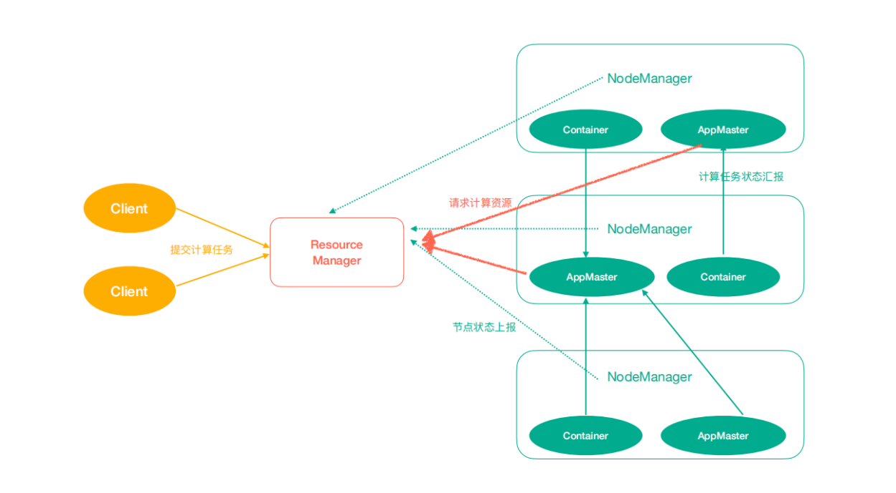
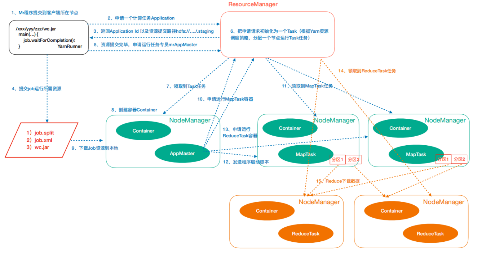
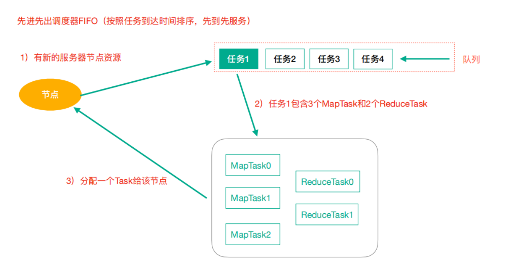
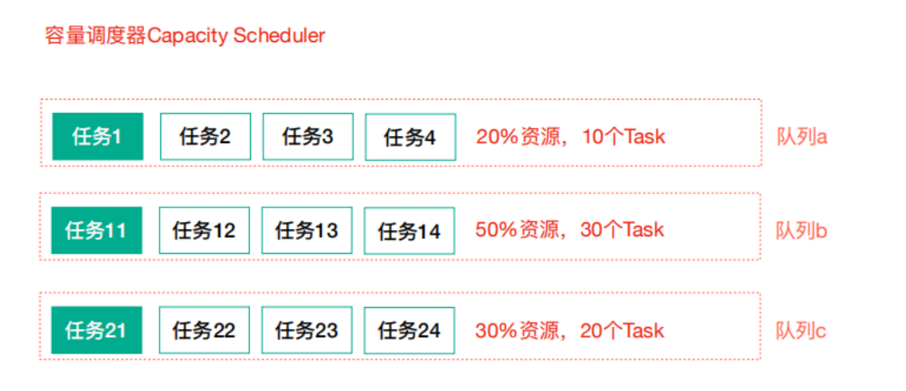
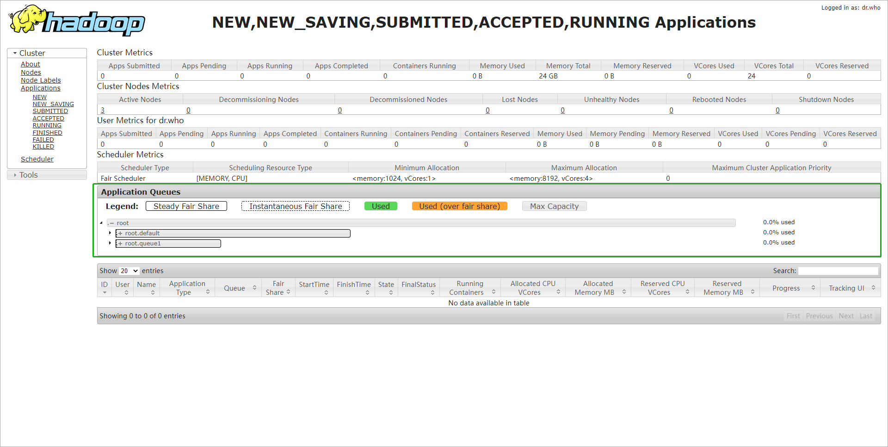

# 7. YARN资源调度

## 7.1 Yarn架构



- ResourceManager(rm): 处理客户端请求、启动/监控 ApplicationMaster、监控 NodeManager、资源分配与调度;
- NodeManager(nm): 单个节点上的资源管理、处理来自 ResourceManager 的命令、处理来自 ApplicationMaster 的命令;
- ApplicationMaster(am): 数据切分、为应用程序申请资源，并分配给内部任务、任务监控与容错。
- Container: 对任务运行环境的抽象，封装了 CPU、内存等多维资源以及环境变量、启动命令等任务运行相关的信息。

## 7.2 Yarn任务提交(工作机制)

作业提交过程之YARN




作业提交

- 第1步: Client调用 `job.waitForCompletion` 方法，向整个集群提交 MapReduce 作业。
- 第2步: Client向 RM 申请一个作业id。
- 第3步: RM 给 Client 返回该job资源的提交路径和作业id。
- 第4步: Client 提交 jar 包、切片信息和配置文件到指定的资源提交路径。
- 第5步: Client 提交完资源后，向 RM 申请运行 MrAppMaster。

作业初始化

- 第6步: 当 RM 收到Client的请求后，将该 job 添加到容量调度器中。
- 第7步: 某一个空闲的 NM 领取到该Job。
- 第8步: 该 NM 创建 Container，并产生MR AppMaster。
- 第9步: 下载 Client 提交的资源到本地。

任务分配

- 第10步: MrAppMaster 向 RM 申请运行多个 MapTask 任务资源。
- 第11步: RM 将运行 MapTask 任务分配给另外两个 NodeManager，另两个 NodeManager 分别领取任务并创建容器。

任务运行

- 第12步: MR 向两个接收到任务的 NodeManager 发送程序启动脚本，这两个 NodeManager 分别启动 MapTask，MapTask对数据分区排序。
- 第13步: MrAppMaster 等待所有 MapTask 运行完毕后，向 RM 申请容器，运行 ReduceTask。
- 第14步: ReduceTask 向 MapTask 获取相应分区的数据。
- 第15步: 程序运行完毕后，MR 会向 RM 申请注销自己。

进度和状态更新

YARN中的任务将其进度和状态返回给应用管理器, 客户端每秒(通过 `mapreduce.client.progressmonitor.pollinterval` 设置)
向应用管理器请求进度更新, 展示给用户。

作业完成

除了向应用管理器请求作业进度外, 客户端每5秒都会通过调用 `waitForCompletion()` 来检查作业是否完成。
时间间隔可以通过 `mapreduce.client.completion.pollinterval` 来设置。

作业完成之后, 应用管理器和 `Container` 会清理工作状态。作业的信息会被作业历史服务器存储以备之后用户核查。

## 7.3 Yarn调度策略

Hadoop作业调度器主要有三种: FIFO、Capacity Scheduler 和 Fair Scheduler。

> Hadoop2.9.2 默认的资源调度器是 Capacity Scheduler。

可以查看 `yarn-default.xml`

1. FIFO(先进先出调度器)



> 缺点：任务的优先级，并不能简单按照时间进行排序。实际情况应该要更加灵活。

2. 容量调度器(Capacity Scheduler)



Apache Hadoop默认使用的调度策略。

Capacity 调度器允许多个组织共享整个集群，每个组织可以获得集群的一部分计算能力。
通过为每个组织分配专门的队列，然后再为每个队列分配一定的集群资源，这样整个集群就可以通过设置多个队列的方式给多个组织提供服务了。

除此之外，队列内部又可以垂直划分，这样一个组织内部的多个成员就可以共享这个队列资源了，在一个队列内部，资源的调度是采用的是先进先出(FIFO)策略。

> 特点：支持多队列共享集群资源。

3. Fair Scheduler(公平调度器，CDH 版本的 Hadoop 默认使用的调度器)

Fair 调度器的设计目标是为所有的应用分配公平的资源(对公平的定义可以通过参数来设置)。公平调度在也可以在多个队列间工作。

举个例子，假设有两个用户 A 和 B，他们分别拥有一个队列。当 A 启动一个 job 而 B 没有任务时，A 会获得全部集群资源;
当 B 启动一个 job 后，A 的 job 会继续运行，不过一会儿之后两个任务会各自获得一半的集群资源。
如果此时 B 再启动第二个 job 并且其它 job 还在运行，则它将会和 B 的第一个 job 共享 B 这个队列的资源，
也就是 B 的两个 job 会各占用四分之一的集群资源，而 A 的 job 仍然用于集群一半的资源，结果就是资源最终在两个**用户之间平等**的共享。

> 特点：任务较少的时候，能够充分的使用所有资源；有较多任务的时候，尽量保证公平的使用资源。

## 7.4 Yarn多租户资源隔离配置

Yarn 集群资源设置为 A, B 两个队列

- A 队列设置占用资源 70% 主要用来运行常规的定时任务
- B 队列设置占用资源 30% 主要运行临时任务
- 两个队列间可相互资源共享，假如 A 队列资源占满，B 队列资源比较充裕，A 队列可以使用B队列的资源，使总体做到资源利用最大化.

> 选择使用 Fair Scheduler 调度策略!! 
 
### 具体配置

1. yarn-site.xml

```xml
<!-- 指定我们的任务调度使用fairScheduler的调度方式 -->
<property>
    <name>yarn.resourcemanager.scheduler.class</name>
    <value>org.apache.hadoop.yarn.server.resourcemanager.scheduler.fair.FairScheduler</value>
    <description>In case you do not want to use the default scheduler</description>
</property>
```

同步到其他节点：`rsync-script yarn-site.xml`

2. 创建 `fair-scheduler.xml` 文件

在Hadoop安装目录 `$HADOOP_HOME/etc/hadoop` 创建该文件
 
```xml
<?xml version="1.0" encoding="UTF-8" standalone="yes"?>
<allocations>
    <defaultQueueSchedulingPolicy>fair</defaultQueueSchedulingPolicy>
    <!-- 顶级队列 -->
    <queue name="root">
        <!-- 子级队列 -->
        <queue name="default">
            <!-- 管理当前队列的用户和组 -->
            <aclAdministerApps>*</aclAdministerApps>
            <!-- 使用队列的用户和组 -->
            <aclSubmitApps>*</aclSubmitApps>
            <maxResources>9216 mb,4 vcores</maxResources>
            <maxRunningApps>100</maxRunningApps>
            <minResources>1024 mb,1vcores</minResources>
            <minSharePreemptionTimeout>1000</minSharePreemptionTimeout>
            <schedulingPolicy>fair</schedulingPolicy>
            <weight>7</weight>
        </queue>
        <queue name="queue1">
            <aclAdministerApps>*</aclAdministerApps>
            <aclSubmitApps>*</aclSubmitApps>
            <maxResources>4096 mb,4vcores</maxResources>
            <maxRunningApps>5</maxRunningApps>
            <minResources>1024 mb, 1vcores</minResources>
            <minSharePreemptionTimeout>1000</minSharePreemptionTimeout>
            <schedulingPolicy>fair</schedulingPolicy>
            <weight>3</weight>
        </queue>
    </queue>
    <queuePlacementPolicy>
        <rule create="false" name="specified"/>
        <rule create="true" name="default"/>
    </queuePlacementPolicy>
</allocations>
```

页面验证


