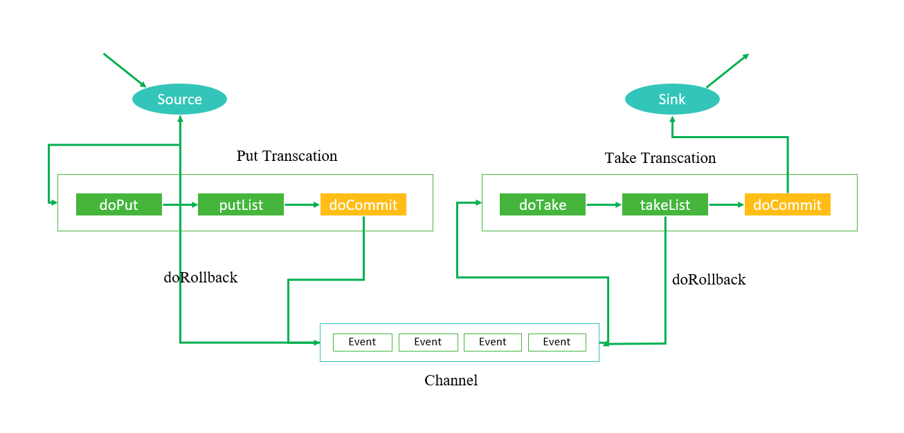
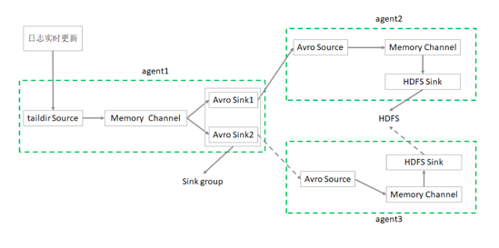

# Flume

## 第四部分 高级特性

### 第 1 节 拦截器

Flume支持在运行时对event进行修改或丢弃，通过拦截器来实现; 

Flume里面的拦截器是实现了 `org.apache.flume.interceptor.Interceptor` 接口的类; 

拦截器可以根据配置修改甚至丢弃 Event;

Flume也支持链式的拦截器执行方式，在配置文件里面配置多个拦截器就可以了; 

拦截器的顺序取决于它们配置的顺序，Event 按照顺序经过每一个拦截器;

#### 时间添加戳拦截器

这个拦截器会向每个event的header中添加一个时间戳属性进去，key默认是 “timestamp”(也可以通过下面表格中的header来自定义)，value就是当前的毫秒值(其实就是用`System.currentTimeMillis()`方法得到的)。
如果event已经存在同名的属性，可以选择是否保留原始的值。

| 属性                 | 默认值       | 解释                                                         |
|--------------------|-----------|------------------------------------------------------------|
| `type`             | -         | timestamp                                                  |
| `header`           | timestamp | 向event header中添加时间戳键值对的key                                 |
| `preserveExisting` | false     | 是否保留event header中已经存在的同名 (上面header设置的key，默认是 timestamp)时间戳 |

##### 时间添加拦截器测试

1. 再次运行入门案例中的测试，观察 event header 信息

```shell
$FLUME_HOME/bin/flume-ng agent --name a1 \
  --conf-file /root/conf/flume-netcat-logger.conf \
  -Dflume.root.logger=INFO,console

telnet linux123 8888
# 输入 hello world

# 可以看见 header 为空
# 22/02/22 16:53:13 INFO sink.LoggerSink: Event: { headers:{} body: 68 65 6C 6C 6F 0D                               hello. }
# 22/02/22 16:53:13 INFO sink.LoggerSink: Event: { headers:{} body: 77 6F 72 6C 64 0D                               world. }
```

2. 在入门案例的基础上，在配置文件中增加时间拦截器的配置。

复制原本的测试配置文件，重命名为 `timestamp.conf`

```shell
cp flume-netcat-logger.conf timestamp.conf
```

```properties
# Name the components on this agent
a1.sources = r1
a1.sinks = k1
a1.channels = c1

# configure the source
a1.sources.r1.type = netcat
a1.sources.r1.bind = linux123
a1.sources.r1.port = 8888

# 这部分是新增 时间拦截器 的内容
a1.sources.r1.interceptors = i1
a1.sources.r1.interceptors.i1.type = timestamp
# 是否保留Event header中已经存在的同名时间戳，缺省值false
a1.sources.r1.interceptors.i1.preserveExisting= false
# 这部分是新增 时间拦截器 的内容

# Describe the sink
a1.sinks.k1.type = logger

# Use a channel which buffers events in memory
a1.channels.c1.type = memory
a1.channels.c1.capacity = 10000
a1.channels.c1.transactionCapacity = 500

# Bind the source and sink to the channel
a1.sources.r1.channels = c1
a1.sinks.k1.channel = c1
```

3. 启动Agent，启动 telnet 输入信息

```shell
$FLUME_HOME/bin/flume-ng agent --name a1 \
  --conf-file /root/conf/timestamp.conf \
  -Dflume.root.logger=INFO,console

telnet linux3 8888 
# 输入 hello world

# 可以看见 event header 中出现了时间戳信息。
# 22/02/22 17:01:34 INFO sink.LoggerSink: Event: { headers:{timestamp=1645520494160} body: 68 65 6C 6C 6F 0D                               hello. }
# 22/02/22 17:01:35 INFO sink.LoggerSink: Event: { headers:{timestamp=1645520495574} body: 77 6F 72 6C 64 0D                               world. }
```

#### Host添加拦截器

这个拦截器会把当前Agent的 hostname 或者 IP 地址写入到Event的header中，key 默认是“host”(也可以通过配置自定义key)，value可以选择使用hostname或者IP地址。

| 属性               | 默认值   | 描述                                 |
|------------------|-------|------------------------------------|
| type             | -     | 组件类型，这个是 `host`                    |
| preserveExisting | false | 如果 header 中存在同名属性，是否保留             |
| useIP            | true  | true: 使用 IP 地址; false: 使用 hostname |
| hostHeader       | host  | 向 Event 中添加host键值对中的 'key'         |

##### host添加拦截器测试

1. 在时间拦截器案例的基础上，在配置文件中增加主机名拦截器的配置。

复制原本的测试配置文件，重命名为 `hostname.conf`

```shell
cp timestamp.conf hostname.conf
```

```properties
# Name the components on this agent
a1.sources = r1
a1.sinks = k1
a1.channels = c1

# configure the source
a1.sources.r1.type = netcat
a1.sources.r1.bind = linux123
a1.sources.r1.port = 8888

# 这部分是新增 时间拦截器 的内容 
a1.sources.r1.interceptors = i1 i2
a1.sources.r1.interceptors.i1.type = timestamp
a1.sources.r1.interceptors.i1.preserveExisting= false
# 这部分是新增 时间拦截器 的内容

# 这部分是新增 主机名拦截器 的内容 
a1.sources.r1.interceptors.i2.type = host
# 如果header中已经存在同名的属性是否保留 
a1.sources.r1.interceptors.i2.preserveExisting= false
# true:使用IP地址;false:使用hostname
a1.sources.r1.interceptors.i2.useIP = false
# 这部分是新增 主机名拦截器 的内容

# Describe the sink
a1.sinks.k1.type = logger

# Use a channel which buffers events in memory
a1.channels.c1.type = memory
a1.channels.c1.capacity = 10000
a1.channels.c1.transactionCapacity = 500

# Bind the source and sink to the channel
a1.sources.r1.channels = c1
a1.sinks.k1.channel = c1
```

> 注意此案例中 `a1.sources.r1.interceptors = i1 i2` 有两个值

2. 启动Agent，启动 telnet 输入信息

```shell
$FLUME_HOME/bin/flume-ng agent --name a1 \
  --conf-file /root/conf/hostname.conf \
  -Dflume.root.logger=INFO,console

telnet linux123 8888 
# 输入 hello world

# 可以看见event headers 中 增加了主机名信息、时间戳信息。
# 22/02/22 17:08:05 INFO sink.LoggerSink: Event: { headers:{host=linux123, timestamp=1645520884941} body: 68 65 6C 6C 6F 0D                               hello. }
# 22/02/22 17:08:06 INFO sink.LoggerSink: Event: { headers:{host=linux123, timestamp=1645520886148} body: 77 6F 72 6C 64 0D                               world. }
```

#### 正则表达式过滤拦截器

这个拦截器会把Event的body当做字符串来处理，并用配置的正则表达式来匹配。可以配置指定被匹配到的Event丢弃还是没被匹配到的Event丢弃。

### 第 2 节 选择器 

source可以向多个channel同时写数据，所以也就产生了以何种方式向多个channel写的问题:

- replication(复制，缺省)：数据完整地发送到每一个channel;
- multiplexing(多路复用)：通过配置来按照一定的规则进行分发;

#### 复制选择器

默认的选择器。

| 属性                  | 默认值         | 描述                        |
|---------------------|-------------|---------------------------|
| `selector.type`     | replicating | -                         |
| `selector.optional` | -           | 指定哪些 Channel 是可选的，多个用空格分开 |

```properties
a1.sources = r1
a1.channels = c1 c2 c3
a1.sources.r1.selector.type = replicating
a1.sources.r1.channels = c1 c2 c3
a1.sources.r1.selector.optional = c3
```

> 上面这个例子中，c3配置成了可选的。向c3发送数据如果失败了会被忽略。c1和c2 没有配置成可选的，向c1和c2写数据失败会导致事务失败回滚。

#### 多路复用选择器

| 属性                   | 默认值                   | 描述                                           |
|----------------------|-----------------------|----------------------------------------------|
| `selector.type`      | replicating           | 组件类型，这个是 `multiplexing`                      |
| `selector.header`    | flume.selector.header | 想要进行匹配的header属性的名字                           |
| `selector.default`   | -                     | 指定一个默认的 channel，如果没有被规则匹配到，默认会发到这个 channel 上 |
| `selector.mapping.*` | -                     | 一些匹配规则，具体参考示例                                |

```properties
a1.sources = r1
a1.channels = c1 c2 c3 c4
a1.sources.r1.selector.type = multiplexing
# 以每个Event的header中的state这个属性的值作为选择channel的依据
a1.sources.r1.selector.header = state
# 如果state=CZ，则选择c1这个channel
a1.sources.r1.selector.mapping.CZ = c1
# 如果state=US，则选择c2 和 c3 这两个channel
a1.sources.r1.selector.mapping.US = c2 c3
# 默认使用c4这个channel
a1.sources.r1.selector.default = c4
```

#### 自定义选择器

自定义选择器就是开发一个 `org.apache.flume.ChannelSelector` 接口的实现类。实现类以及依赖的jar包在启动时候都必须放入Flume的classpath。

| 属性              | 默认值 | 描述                                                       |
|-----------------|-----|----------------------------------------------------------|
| `selector.type` | -   | 自定义选择器的全限定类名，如：`com.zmn.flume.channel.MyChannelSelector` |

```properties
a1.sources = r1
a1.channels = c1
a1.sources.r1.selector.type = org.liyifeng.flume.channel.MyChannelSelector
```

### 第 3 节 Sink组逻辑处理器

可以把多个Sink分成一个组，Sink组逻辑处理器可以对这同一个组里的几个sink进行负载均衡，或者其中一个sink发生故障后将输出Event的任务转移到其他的sink上。 

N个Sink将Event输出到对应的N个目的地的，通过Sink组逻辑处理器可以把这N个sink配置成**负载均衡**或者**故障转移**的工作方式:

- 负载均衡：是将channel里面的Event，按照配置的负载机制(比如轮询)分别发送到sink各自对应的目的地 
- 故障转移：是这N个sink同一时间只有一个在工作，其余的作为备用，工作的sink挂掉之后备用的sink顶上

| 属性               | 默认值     | 描述                                                                          |
|------------------|---------|-----------------------------------------------------------------------------|
| `sinks`          | -       | 这一组的所有sink名，多个使用空格分割                                                        |
| `processor.type` | default | 这个sink组的逻辑处理器类型，可选值：`default`(默认一对一的)、`failover`(故障转移)、`load_balance`(负载均衡) |

```properties
a1.sinkgroups = g1
a1.sinkgroups.g1.sinks = k1 k2
a1.sinkgroups.g1.processor.type = load_balance
```

#### 逻辑处理器类型

1. 默认

默认的组逻辑处理器就是只有一个sink的情况，这种情况就没必要配置sink组了。前面的例子都是 source-channel-sink 这种一对一，单个sink的。

2. 故障转移

故障转移组逻辑处理器维护了一个发送Event失败的sink的列表，保证有一个sink是可用的来发送Event。

故障转移机制的工作原理是将故障sink降级到一个池中，在池中为它们分配冷却期（超时时间），在重试之前随顺序故障而增加。 
Sink成功发送事件后，它将恢复到实时池。sink具有与之相关的优先级，数值越大，优先级越高。 如果在发送Event时Sink发生故障，会继续尝试下一个具有最高优先级的sink。 
例如，在优先级为80的sink之前激活优先级为100的sink。如果未指定优先级，则根据配置中的顺序来选取。

要使用故障转移选择器，不仅要设置sink组的选择器为failover，还有为每一个sink设置一个唯一的优先级数值。 可以使用 `maxpenalty` 属性设置故障转移时间的上限（毫秒）。

| 属性                              | 默认值     | 解释                                                |
|---------------------------------|---------|---------------------------------------------------|
| `sinks`                         | –       | 这一组的所有sink名，多个用空格分开                               |
| `processor.type`                | default | 组件类型，这个是： failover                                |
| `processor.priority.<sinkName>` | –       | 组内sink的权重值，`<sinkName>`必须是当前组关联的sink之一。数值越大越被优先使用 |
| `processor.maxpenalty`          | 30000   | 发生异常的sink最大故障转移时间（毫秒）                             |

```properties
a1.sinkgroups = g1
a1.sinkgroups.g1.sinks = k1 k2
a1.sinkgroups.g1.processor.type = failover
a1.sinkgroups.g1.processor.priority.k1 = 5
a1.sinkgroups.g1.processor.priority.k2 = 10
a1.sinkgroups.g1.processor.maxpenalty = 10000
```

3. 负载均衡

负载均衡Sink选择器提供了在多个sink上进行负载均衡流量的功能。它维护一个活动sink列表的索引来实现负载的分配。默认支持了轮询（round_robin）和随机（random）两种选择机制分配负载。 
默认是轮询，可以通过配置来更改。也可以从 `AbstractSinkSelector` 继承写一个自定义的选择器。

工作时，此选择器使用其配置的选择机制选择下一个sink并调用它。如果所选sink无法正常工作，则处理器通过其配置的选择机制选择下一个可用sink。此实现不会将失败的Sink列入黑名单，而是继续乐观地尝试每个可用的Sink。
如果所有sink调用都失败了，选择器会将故障抛给sink的运行器。

如果backoff设置为true则启用了退避机制，失败的sink会被放入黑名单，达到一定的超时时间后会自动从黑名单移除。
如从黑名单出来后sink仍然失败，则再次进入黑名单而且超时时间会翻倍，以避免在无响应的sink上浪费过长时间。
如果没有启用退避机制，在禁用此功能的情况下，发生sink传输失败后，会将本次负载传给下一个sink继续尝试，因此这种情况下是不均衡的。

| 属性                              | 默认值         | 解释                                                                                                                                                                              |
|---------------------------------|-------------|---------------------------------------------------------------------------------------------------------------------------------------------------------------------------------|
| `sinks`                         | –           | 这一组的所有sink名，多个用空格分开                                                                                                                                                             |
| `processor.type`                | default     | 组件类型，这个是： `load_balance`                                                                                                                                                        |
| `processor.backoff`             | false       | 失败的sink是否成倍地增加退避它的时间。 如果设置为false，负载均衡在某一个sink发生异常后，下一次选择sink的时候仍然会将失败的这个sink加入候选队列； 如果设置为true，某个sink连续发生异常时会成倍地增加它的退避时间，在退避的时间内是无法参与负载均衡竞争的。退避机制只统计1个小时发生的异常，超过1个小时没有发生异常就会重新计算 |
| `processor.selector`            | round_robin | 负载均衡机制，可选值：`round_robin`（轮询）、 `random`（随机选择）、「自定义选择器的全限定类名」：自定义的负载器要继承 `AbstractSinkSelector`                                                                                   |
| `processor.selector.maxTimeOut` | 30000       | 发生异常的sink最长退避时间（毫秒） 如果设置了processor.backoff=true，某一个sink发生异常的时候就会触发自动退避它一段时间，这个 maxTimeOut 就是退避一个sink的最长时间                                                                       |

```properties
a1.sinkgroups = g1
a1.sinkgroups.g1.sinks = k1 k2
a1.sinkgroups.g1.processor.type = load_balance
a1.sinkgroups.g1.processor.backoff = true
a1.sinkgroups.g1.processor.selector = random
```

### 第 4 节 事务机制与可靠性

一提到事务，首先就想到的是关系型数据库中的事务，事务一个典型的特征就是将一批操作做成原子性的，要么都成功，要么都失败。 

在Flume中一共有两个事务:

- Put事务：在Source到Channel之间
- Take事务：Channel到Sink之间

从 Source 到 Channel 过程中，数据在 Flume 中会被封装成 Event 对象，也就是一批 Event，把这批 Event 放到一个事务中，
把这个事务(也就是这批event)一次性的放入Channel中。
同理，Take事务的时候，也是把这一批event组成的事务统一拿出来 到sink放到HDFS上。



Put 事务

- `doPut`: 将一批 Event 写入 putList(临时缓冲区)
- `doCommit`: 检查 Channel 内存队列是否有足够的空间
- `doRollback`: 空间不够回滚数据

Take 事务

- `doTake`: 将数据写入 takeList, 并将数据发送到 HDFS 缓冲区
- `doCommit`: 如果数据全部发送成功，清空 takeList
- `doRollback`: 如果数据发送过程中失败，清空临时缓冲区，并将数据返还给 channel

#### Flume中的 Put 事务

1. 事务开始的时候会调用一个 `doPut` 方法， `doPut` 方法将一批数据放在 putList 中;

putList 在向 Channel 发送数据之前先检查 Channel 的容量能否放得下，如果放不下一个都不放，只能doRollback;

数据批的大小取决于配置参数 `batch size` 的值; putList的大小取决于配置 Channel 的参数 `transaction capacity` 的大小，该参数大小就体现在putList上;
(Channel的另一个参数 `capacity` 指的是 Channel 的容量);

2. 数据顺利的放到putList之后，接下来可以调用 `doCommit` 方法，把putList中所有的 Event 放到 Channel 中，成功放完之后就清空putList;

> 在 doCommit 提交之后，事务在向 Channel 存放数据的过程中，事务容易出问题。 
> 如Sink取数据慢，而 Source 放数据速度快，容易造成 Channel 中数据的积压，如果 putList 中的数据放不进去，会如何呢?
>
> 此时会调用 `doRollback` 方法，doRollback方法会进行两项操作: 将putList清空; 抛出 ChannelException异常。
> source会捕捉到doRollback抛出的异常，然后source 就将刚才的一批数据重新采集，然后重新开始一个新的事务，这就是事务的回滚。

#### Flume中的 Take 事务

Take事务同样也有takeList，HDFS sink配置有一个 `batch size`，这个参数决定 Sink 从 Channel 取数据的时候一次取多少个，
所以该 `batch size` 得小于 takeList 的大小，而takeList的大小取决于 `transaction capacity` 的大小，同样是channel 中的参数。

**Take事务流程**:

事务开始后:

- doTake 方法会将channel中的event剪切到takeList中。

> 如果后面接的是HDFS Sink的话，在把Channel中的event剪切到takeList中的同时，也往写入HDFS的IO缓冲流中放一份event(数据写入HDFS是先写入IO缓冲流然后flush到HDFS);

- 当takeList中存放了 `batch size` 数量的event之后，就会调用doCommit方法，doCommit方法会做两个操作: 

1. 针对HDFS Sink，手动调用IO流的flush方法，将IO流缓冲区的数据写入到 HDFS磁盘中;
2. 清空takeList中的数据

flush 到HDFS的时候组容易出问题。flush到HDFS的时候，可能由于网络原因超时导致数据传输失败，这个时候调用doRollback方法来进行回滚，
回滚的时候由于 takeList 中还有备份数据，所以将takeList中的数据原封不动地还给channel，这时候就完成了事务的回滚。

但是，如果flush到HDFS的时候，数据flush了一半之后出问题了，这意味着已经有一半的数据已经发送到HDFS上面了，现在出了问题，同样需要调用doRollback方法来进行回滚，回滚并没有“一半”之说，
它只会把整个takeList中的数据返回给 channel，然后继续进行数据的读写。这样开启下一个事务的时候容易造成数据重复的问题。

> Flume在数据进行采集传输的时候，有可能会造成数据的重复，但不会丢失数据。 

Flume在数据传输的过程中是否可靠，还需要考虑具体使用Source、Channel、Sink的类型。 

分析Source

- `exec Source`，后面接 `tail -f` ，这个数据也是有可能丢的
- TailDir Source，这个是不会丢数据的，它可以保证数据不丢失 

分析sink

Hdfs Sink，数据有可能重复，但是不会丢失 

最后，分析channel

理论上说: 要想数据不丢失的话，还是要用 File channel; memory channel 在 Flume 挂掉的时候是有可能造成数据的丢失的。

**如果使用 TailDir source 和 HDFS sink，数据会重复但是不会丢失。**

### 第 5 节 高可用案例 

案例: 实现Agent的故障转移

> 思路：sinkgroup 使用 failover



1. 配置环境 

在linux121、linux122上部署Flume、修改环境变量

```shell
# 在liunx123上执行 
cd /opt/zmn/servers
scp -r flume-1.9.0/ linux121:$PWD 
scp -r flume-1.9.0/ linux122:$PWD

cd /etc
scp profile linux121:$PWD
scp profile linux122:$PWD

# 在linux121、linux122上分别执行 
source /etc/profile
```

2. conf文件 

linux123: `flume-taildir-avro.conf`

```properties
# agent name
a1.sources = r1
a1.channels = c1
a1.sinks = k1 k2
# source
a1.sources.r1.type = TAILDIR
a1.sources.r1.positionFile = /root/flume_log/taildir_position.json
a1.sources.r1.filegroups = f1
a1.sources.r1.filegroups.f1 = /tmp/root/.*log
a1.sources.r1.fileHeader = true
# interceptor 静态属性拦截器，添加属性 type:login
a1.sources.r1.interceptors = i1 i2
a1.sources.r1.interceptors.i1.type = static
a1.sources.r1.interceptors.i1.key = Type
a1.sources.r1.interceptors.i1.value = LOGIN
# 在event header添加了时间戳
a1.sources.r1.interceptors.i2.type = timestamp
# Event header中必须存在带有“timestamp”键的属性（除非 hdfs.useLocalTimeStamp 设置为 true ）。

# channel
a1.channels.c1.type = memory
a1.channels.c1.capacity = 10000
a1.channels.c1.transactionCapacity = 500

# sink group
a1.sinkgroups = g1
a1.sinkgroups.g1.sinks = k1 k2
# set sink1
a1.sinks.k1.type = avro
a1.sinks.k1.hostname = linux121
a1.sinks.k1.port = 9999
# set sink2
a1.sinks.k2.type = avro
a1.sinks.k2.hostname = linux122
a1.sinks.k2.port = 9999

# set failover
a1.sinkgroups.g1.processor.type = failover
a1.sinkgroups.g1.processor.priority.k1 = 100
a1.sinkgroups.g1.processor.priority.k2 = 60
a1.sinkgroups.g1.processor.maxpenalty = 10000

a1.sources.r1.channels = c1
a1.sinks.k1.channel = c1
a1.sinks.k2.channel = c1
```

linux121: `flume-avro-hdfs.conf`

```properties
# set Agent name
a2.sources = r1
a2.channels = c1
a2.sinks = k1
# Source
a2.sources.r1.type = avro
a2.sources.r1.bind = linux121
a2.sources.r1.port = 9999
# interceptor
a2.sources.r1.interceptors = i1
a2.sources.r1.interceptors.i1.type = static
a2.sources.r1.interceptors.i1.key = Collector
a2.sources.r1.interceptors.i1.value = linux121

# set channel
a2.channels.c1.type = memory
a2.channels.c1.capacity = 10000
a2.channels.c1.transactionCapacity = 500

# HDFS Sink
a2.sinks.k1.type=hdfs
a2.sinks.k1.hdfs.path=hdfs://linux121:9000/flume/failover/
a2.sinks.k1.hdfs.fileType=DataStream
a2.sinks.k1.hdfs.writeFormat=TEXT
a2.sinks.k1.hdfs.rollInterval=60
a2.sinks.k1.hdfs.filePrefix=%Y-%m-%d
a2.sinks.k1.hdfs.minBlockReplicas=1
a2.sinks.k1.hdfs.rollSize=0
a2.sinks.k1.hdfs.rollCount=0
a2.sinks.k1.hdfs.idleTimeout=0

a2.sources.r1.channels = c1
a2.sinks.k1.channel=c1
```

linux122: `flume-avro-hdfs.conf`

```properties
# set Agent name
a3.sources = r1
a3.channels = c1
a3.sinks = k1
# Source
a3.sources.r1.type = avro
a3.sources.r1.bind = linux122
a3.sources.r1.port = 9999
# interceptor
a3.sources.r1.interceptors = i1
a3.sources.r1.interceptors.i1.type = static
a3.sources.r1.interceptors.i1.key = Collector
a3.sources.r1.interceptors.i1.value = linux122
# set channel
a3.channels.c1.type = memory
a3.channels.c1.capacity = 10000
a3.channels.c1.transactionCapacity = 500

# HDFS Sink
a3.sinks.k1.type=hdfs
a3.sinks.k1.hdfs.path=hdfs://linux121:9000/flume/failover/
a3.sinks.k1.hdfs.fileType=DataStream
a3.sinks.k1.hdfs.writeFormat=TEXT
a3.sinks.k1.hdfs.rollInterval=60
a3.sinks.k1.hdfs.filePrefix=%Y-%m-%d
a3.sinks.k1.hdfs.minBlockReplicas=1
a3.sinks.k1.hdfs.rollSize=0
a3.sinks.k1.hdfs.rollCount=0
a3.sinks.k1.hdfs.idleTimeout=0

a3.sources.r1.channels = c1
a3.sinks.k1.channel=c1
```

3. 分别在linux121、linux122、linux123上启动对应服务(先启动下游的agent)

```shell
# linux121
flume-ng agent --name a2 --conf-file ~/conf/flume-avro-hdfs.conf

# linux122
flume-ng agent --name a3 --conf-file ~/conf/flume-avro-hdfs.conf

# linux123
flume-ng agent --name a1 --conf-file ~/conf/flume-taildir-avro2.conf
```

4. 先hive.log中写入数据，检查HDFS目录 
5. 杀掉一个Agent，看看另外Agent是否能启动


