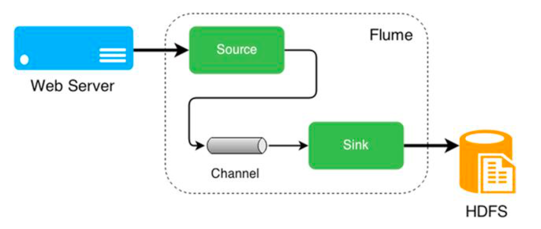
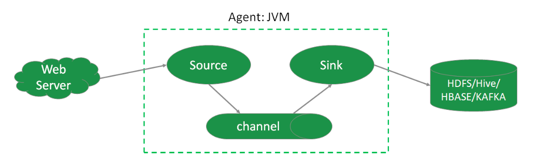
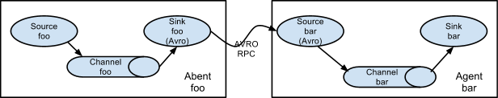
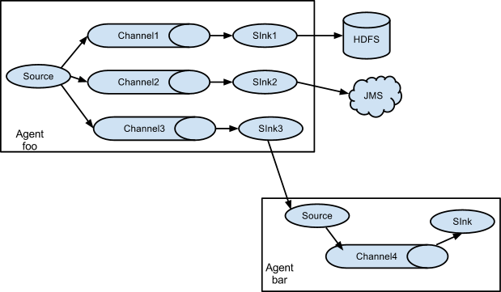
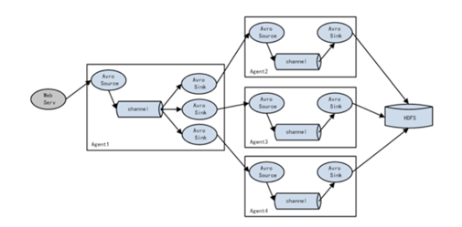
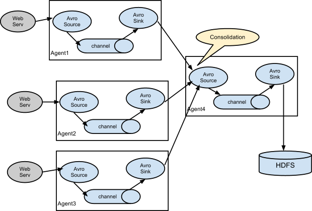
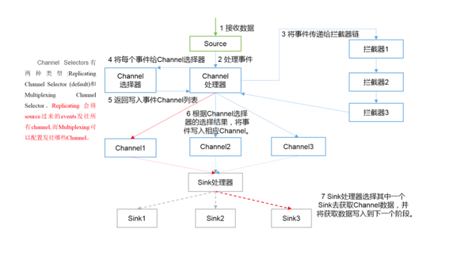
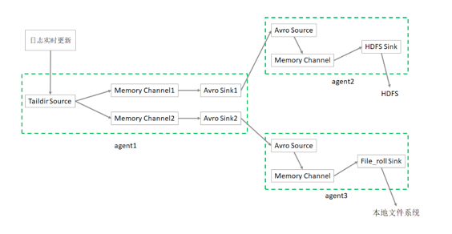

# Flume

## 第一部分 Flume概述

无论数据来自什么企业，或是多大量级，通过部署Flume，可以确保数据都安全、及时地到达大数据平台，用户可以将精力集中在如何洞悉数据上。

### 第 1 节 Flume的定义

Flume由Cloudera公司开发，是一个分布式、高可靠、高可用的海量日志采集、聚合、传输的系统。

Flume支持在日志系统中定制各类数据发送方，用于采集数据; Flume提供对数据进行简单处理，并写到各种数据接收方的能力。

简单的说，*Flume是实时采集日志的数据采集引擎*。



Flume有3个重要组件: Source、Channel、Sink

特点:

- 分布式: flume分布式集群部署，扩展性好
- 可靠性好: 当节点出现故障时，日志能够被传送到其他节点上而不会丢失
- 易用性: flume配置使用较繁琐，对使用人员专业技术要求高
- 实时采集: flume采集流模式进行数据实时采集

适用场景: 适用于日志文件实时采集。

> 其他数据采集工具还有: dataX、kettle、Logstash、Scribe、sqoop。

**扩展知识**

*dataX* 是阿里开源软件异构数据源离线同步工具。实现包括关系型数据库(MySQL、 Oracle等)、HDFS、Hive、ODPS、HBase、FTP等各种异构数据源之间稳定高效的 数据同步功能。

|  特点  |             描述             |
|:----:|:--------------------------:|
| 易用性  | 没有界面，以执行脚本方式运行，对使用人员技术要求较高 |
|  性能  |          数据抽取性能高           |
|  部署  |           可独立部署            |
| 适用场景 |   在异构数据库/文件系统之间*高速交换数据*    |

*kettle* 开源ETL工具。

支持数据库、FTP、文件、rest接口、hdfs、hive等平台的据进行抽取、转换、传输等操作，Java编写跨平台，C/S架构，不支持浏览器模式。

|  特点   |                    描述                    |
|:-----:|:----------------------------------------:|
|  易用性  |           有可视化设计器进行可视化操作，使用简单            |
| 功能强大  |         不仅能进行数据传输，能同时进行数据清洗转换等操作         |
| 支持多种源 |    支持各种数据库、FTP、文件、rest接口、hdfs、Hive等源     |
| 部署方便  |              独立部署，不依赖第三方产品               |
| 适用场景  | 数据量及增量不大，业务规则变化较快，要求可视化操作，对技术人员的技术门槛要求低。 |

*Logstash* 应用程序日志、事件的传输、处理、管理和搜索的平台。可以用它来统一对应用程序日志进行收集管理，提供了Web接口用于查询和统计。

*Scribe* 是Facebook开源的日志收集系统，它能够从各种日志源上收集日志，存储到一个中央存储系统(可以是NFS，分布式文件系统等)上，以便于进行集中统计分析处理。

### 第 2 节 Flume体系结构



Flume架构中的组件:

#### Agent

本质上是一个 JVM 进程，该JVM进程控制Event数据流从外部日志生产者那里传输到目的地(或者是下一个Agent)。

一个完整的Agent中包含了三个组件Source、Channel和Sink。

Source是指数据的来源和方式，Channel是一个数据的缓冲池，Sink定义了数据输出的方式和目的地。

#### Source

负责接收数据到Flume Agent的组件。

Source组件可以处理各种类型、各种格式的日志数据，包括avro、exec、spooldir、netcat等。

#### Channel

位于Source和Sink之间的缓冲区。

Channel允许Source和Sink运作在不同的速率上。Channel是线程安全的，可以同时处理多个Source的写入操作及多个Sink的读取操作。

常用的Channel包括:

- Memory Channel 是内存中的队列。Memory Channel在允许数据丢失的情景下适用。如果不允许数据丢失，应该避免使用Memory Channel，因为程序死亡、机器宕机或者重启都可能会导致数据丢失。

- File Channel 将所有事件写到磁盘。因此在程序关闭或机器宕机的情况下不会丢失数据。

#### Sink

不断地轮询Channel中的事件且批量地移除它们，并将这些事件批量写入到存储或索引系统、或者被发送到另一个Flume Agent。

Sink是完全事务性的。在从Channel批量删除数据之前，每个Sink用Channel启动一个事务。批量事件一旦成功写出到存储系统或下一个Flume Agent，Sink就利用Channel提交事务。
事务一旦被提交，该Channel从自己的内部缓冲区删除事件。

Sink组件包括hdfs、logger、avro、file、null、HBase、消息队列等。 

#### Event

是Flume定义的一个数据流传输的最小单位。

### 第 3 节 Flume拓扑结构

#### 串行模式

将多个flume给顺序连接起来，从最初的source开始到最终sink传送的目的存储系统。

此模式不建议桥接过多的flume数量，flume数量过多不仅会影响传输速率，而且一旦传输过程中某个节点flume宕机，会影响整个传输系统。




#### 复制模式

> 单Source多Channel、Sink模式

将事件流向一个或者多个目的地。

这种模式会将同一个数据源复制到多个channel中，每个channel都有相同的数据，每个sink可以选择传送的不同的目的地。




#### 负载均衡模式

> 单Source、Channel多Sink

将多个sink逻辑上分到一个sink组，flume将数据发送到不同的sink，主要解决负载均衡和故障转移问题。



#### 聚合模式

这种模式最常见的，也非常实用，日常web应用通常分布在上百个服务器，大者甚至上千个、上万个服务器。产生的日志，处理起来也非常麻烦。

用这种组合方式能很好的解决这一问题，每台服务器部署一个flume采集日志，传送到一个集中收集日志的 flume，再由此flume上传到hdfs、hive、hbase、消息队列中。



> 用类似从节点的 Flume 收集各个 App 的日志数据，再用一个类似主节点的 Flume 聚合各个从节点的日志数据，最后进入数据库。

### 第 4 节 Flume内部原理

> 总体数据流向: Source => Channel => Sink
> 
> Channel: 处理器、拦截器、选择器



具体过程:

1. Source接收数据加工成事件(Event)，交给其Channel处理器处理事件
2. 处理器通过拦截器Interceptor，对事件一些处理,比如压缩解码，正则拦截，时间戳拦截，分类，过滤等
3. 经过拦截器处理过的事件再传给Channel选择器，根据选择结果将事件写入相应的Channel。

> Channel Selector有两种:
> 
> Replicating Channel Selector(复制, 默认), 会将source过来的Event发往所有 Channel(比较常用的场景是，用多个Channel实现冗余副本，保证可用性)
> 
> Multiplexing Channel Selector，根据配置分发event。此selector会根据 event中某个header对应的value来将event发往不同的channel

4. 最后由Sink处理器处理各个Channel的事件

## 第二部分 安装部署

- Flume官网地址: <http://flume.apache.org/>
- 文档查看地址: <http://flume.apache.org/FlumeUserGuide.html>
- 下载地址: <http://archive.apache.org/dist/flume/>
- 选择的版本 1.9.0


**安装步骤**

1. 下载软件 apache-flume-1.9.0-bin.tar.gz，并上传到 linux123 上的 `/opt/zmn/software` 目录下
2. 解压 apache-flume-1.9.0-bin.tar.gz 到 `/opt/zmn/servers/` 目录下; 并重命名为 `flume-1.9.0`

```shell
tar zxvf apache-flume-1.9.0-bin.tar.gz
mv apache-flume-1.9.0-bin ../servers/flume-1.9.0/
```

3. 在 `/etc/profile` 中增加环境变量，并执行 `source /etc/profile`，使修改生效

```shell
export FLUME_HOME=/opt/zmn/servers/flume-1.9.0 
export PATH=$PATH:$FLUME_HOME/bin
```

4. 将 `$FLUME_HOME/conf` 下的 `flume-env.sh.template` 改名为 `flume-env.sh`，并添加 JAVA_HOME的配置

```shell
cd $FLUME_HOME/conf

mv flume-env.sh.template flume-env.sh

vi flume-env.sh

export JAVA_HOME=/opt/zmn/servers/jdk1.8.0_231
```

## 第三部分 基础应用

### 基本组件

#### Source 组件

Flume 支持的数据源种类有很多，可以来自directory、http、kafka等。

Flume提供了Source组件用来采集数据源。

常见的 Source 有:

1. avro source: 监听 Avro 端口来接收外部 avro 客户端的事件流。

avro-source 接收到的是经过avro序列化后的数据，然后反序列化数据继续传输。

如果是avro source的话，源数据必须是经过avro序列化后的数据。

利用Avro source可以实现*多级流动*、扇出流、扇入流等效果。接收通过flume提供的avro客户端发送的日志信息。

> Avro是Hadoop的一个数据序列化系统，由Hadoop的创始人Doug Cutting(也是 Lucene，Nutch等项目的创始人)开发，设计用于支持大批量数据交换的应用。
> 
> 它的主要特点有:
>
> 支持二进制序列化方式，可以便捷、快速地处理大量数据;
> 
> 动态语言友好，Avro提供的机制使动态语言可以方便地处理Avro数据;


2. exec source: 可以将命令产生的输出作为source。如 `ping 192.168.234.163`、`tail -f hive.log`。

3. netcat source: 一个NetCat Source用来监听一个指定端口，并接收监听到的数据。

4. spooling directory source: 将指定的文件加入到"自动搜集"目录中。flume会持续监听这个目录，把文件当做source来处理。

> 注意: 一旦文件被放到目录中后，便不能修改，如果修改，flume会报错。此外，也不能有重名的文件。

5. Taildir Source(since 1.7): 监控指定的多个文件，一旦文件内有新写入的数据，就会将其写入到指定的sink内，*来源可靠性高，不会丢失数据*。

> 简单讲：支持断点续传功能

其不会对于跟踪的文件有任何处理，不会重命名也不会删除，不会做任何修改。

目前不支持Windows系统，不支持读取二进制文件，支持一行一行的读取文本文件。

#### Channel组件

采集到的日志需要进行缓存，Flume提供了Channel组件用来缓存数据。

常见的 Channel 有:

1. memory channel: 缓存到内存中(最常用) 
2. file channel: 缓存到文件中
3. JDBC channel: 通过JDBC缓存到关系型数据库中 
4. kafka channel: 缓存到kafka中

#### Sink组件

缓存的数据最终需要进行保存，Flume提供了Sink组件用来保存数据。

常见的 Sink 有:

1. logger sink: 将信息显示在标准输出上，主要用于测试
2. avro sink: Flume events发送到sink，转换为Avro events，并发送到配置好的hostname/port。从配置好的channel按照配置好的批量大小批量获取events 
3. null sink: 将接收到events全部丢弃
4. HDFS sink: 将 events 写进HDFS。支持创建文本和序列文件，支持两种文件 类型压缩。文件可以基于数据的经过时间、大小、事件的数量周期性地滚动
5. Hive sink: 该 sink streams 将包含分割文本或者JSON数据的events直接传送到Hive表或分区中。使用Hive事务写events。当一系列events提交到Hive时，它们马上可以被Hive查询到
6. HBase sink: 保存到HBase中 
7. kafka sink: 保存到kafka中

日志采集就是根据业务需求选择合适的Source、Channel、Sink，并将其组合在一起。

### 第 1 节 入门案例

中文flume帮助文档 <https://flume.liyifeng.org/>

业务需求: 监听本机 8888 端口，Flume将监听的数据实时显示在控制台

需求分析: 

- 使用 telnet 工具可以向 8888 端口发送数据 
- 监听端口数据，选择 `netcat source`
- channel 选择 `memory`
- 数据实时显示，选择 `logger sink`


#### 实现步骤

1. 安装 telnet 工具

```shell
yum install -y telnet
```

2. 检查 8888 端口是否被占用。如果该端口被占用，可以选择使用其他端口完成任务

```shell
lsof -i:8888
```

3. 创建 Flume Agent 配置文件。

> 在linux123 `/root/conf/` 目录下创建文件 `flume-netcat-logger.conf`，内容如下：

```properties
# a1是agent的名称。source、channel、sink的名称分别为: r1 c1 k1 
a1.sources = r1
a1.channels = c1
a1.sinks = k1
# source
a1.sources.r1.type = netcat
a1.sources.r1.bind = linux123
a1.sources.r1.port = 8888
# channel
a1.channels.c1.type = memory
a1.channels.c1.capacity = 10000
a1.channels.c1.transactionCapacity = 100
# sink
a1.sinks.k1.type = logger
# source、channel、sink之间的关系
a1.sources.r1.channels = c1
a1.sinks.k1.channel = c1
```

Memory Channel 是使用内存缓冲Event的Channel实现。速度比较快速，容量会受到 jvm 内存大小的限制，可靠性不够高。适用于允许丢失数据，但对性能要求较高的日志采集业务。

4. 启动Flume Agent

```shell
flume-ng agent --name a1 \
  --conf-file /root/conf/flume-netcat-logger.conf \
  -Dflume.root.logger=INFO,console
```

- name 定义agent的名字，要与参数文件一致
- conf-file 指定参数文件位置
- -D表示flume运行时动态修改 flume.root.logger 参数属性值，并将控制台日志 打印级别设置为INFO级别。日志级别包括:log、info、warn、error

5. 使用 telnet 向本机的 8888 端口发送消息

```shell
telnet linux123 8888
```

6. 在 Flume 监听页面查看数据接收情况

```text
22/02/22 14:05:29 INFO sink.LoggerSink: Event: { headers:{} body: 68 65 6C 6C 6F 0D                               hello. }
22/02/22 14:05:30 INFO sink.LoggerSink: Event: { headers:{} body: 77 6F 72 6C 64 0D                               world. }
```

### 第 2 节 监控日志文件信息到HDFS 

业务需求: 监控本地日志文件，收集内容实时上传到HDFS

需求分析: 

- 使用 `tail -F` 命令即可找到本地日志文件产生的信息
- source 选择 exec。exec 监听一个指定的命令，获取命令的结果作为数据源。 source组件从这个命令的结果中取数据。当agent进程挂掉重启后，可能存在数据丢失。
- channel 选择 memory
- sink 选择 HDFS

> `tail -f` 等同于 `--follow=descriptor`，根据文件描述符进行追踪；当文件改名或被删除，追踪停止
> 
> `tail -F` 等同于 `--follow=name --retry`，根据文件名进行追踪，并保持重试；即该文件被删除或改名后，如果再次创建相同的文件名，会继续追踪

#### 实现步骤

1. 环境准备

Flume要想将数据输出到HDFS，必须持有Hadoop相关jar包。

将 `commons-configuration-1.6.jar hadoop-auth-2.9.2.jar hadoop-common-2.9.2.jar 
hadoop-hdfs-2.9.2.jar commons-io-2.4.jar htrace-core4-4.1.0- incubating.jar` 拷贝到 `$FLUME_HOME/lib` 文件夹下

```shell
#在 $HADOOP_HOME/share/hadoop/httpfs/tomcat/webapps/webhdfs/WEB-INF/lib 有这些文件

cd $HADOOP_HOME/share/hadoop/httpfs/tomcat/webapps/webhdfs/WEB-INF/lib

cp commons-configuration-1.6.jar $FLUME_HOME/lib/
cp hadoop-auth-2.9.2.jar $FLUME_HOME/lib/
cp hadoop-common-2.9.2.jar $FLUME_HOME/lib/
cp hadoop-hdfs-2.9.2.jar $FLUME_HOME/lib/
cp commons-io-2.4.jar $FLUME_HOME/lib/
cp htrace-core4-4.1.0-incubating.jar $FLUME_HOME/lib/
```

2. 创建配置文件 `flume-exec-hdfs.conf`，内容如下:

```properties
# Name the components on this agent
a2.sources = r2
a2.sinks = k2
a2.channels = c2

# Describe/configure the source
a2.sources.r2.type = exec
a2.sources.r2.command = tail -F /tmp/root/hive.log

# Use a channel which buffers events in memory
a2.channels.c2.type = memory
a2.channels.c2.capacity = 10000
a2.channels.c2.transactionCapacity = 500

# Describe the sink
a2.sinks.k2.type = hdfs
a2.sinks.k2.hdfs.path = hdfs://linux121:9000/flume/%Y%m%d/%H%M

# 上传文件的前缀
a2.sinks.k2.hdfs.filePrefix = logs-
# 是否使用本地时间戳
a2.sinks.k2.hdfs.useLocalTimeStamp = true
# 积攒500个Event才flush到HDFS一次
a2.sinks.k2.hdfs.batchSize = 500
# 设置文件类型，支持压缩。DataStream没启用压
a2.sinks.k2.hdfs.fileType = DataStream
# 1分钟滚动一次 (单位：秒)
a2.sinks.k2.hdfs.rollInterval = 60
# 128M滚动一次
a2.sinks.k2.hdfs.rollSize = 134217700
# 文件的滚动与Event数量无关
a2.sinks.k2.hdfs.rollCount = 0
# 最小冗余数
a2.sinks.k2.hdfs.minBlockReplicas = 1

# Bind the source and sink to the channel
a2.sources.r2.channels = c2
a2.sinks.k2.channel = c2
```

3. 启动Agent

```shell
$FLUME_HOME/bin/flume-ng agent --name a2 \
  --conf-file /root/conf/flume-exec-hdfs.conf \
  -Dflume.root.logger=INFO,console
```

4. 启动Hadoop和Hive，操作Hive产生日志

```shell
start-dfs.sh 
start-yarn.sh
# 在命令行多次执行
hive -e "show databases"
```

5. 在HDFS上查看文件

### 第 3 节 监控目录信息到HDFS

业务需求: 监控指定目录，收集信息实时上传到HDFS 

需求分析:

source 选择 spooldir；spooldir 能够保证数据不丢失，且能够实现断点续传，但延迟较高，不能实时监控
channel 选择 memory
sink 选择 HDFS

Spool Dir Source 监听一个指定的目录，即只要向指定目录添加新的文件，source 组件就可以获取到该信息，并解析该文件的内容，写入到channel。
Sink处理完之后，标记该文件已完成处理，文件名添加 `.completed` 后缀。虽然是自动监控整个目录，但是只能监控文件，如果以追加的方式向已被处理的文件中添加内容，
source并不能识别。需要注意的是:

- 拷贝到spool目录下的文件不可以再打开编辑 
- 无法监控子目录的文件夹变动 
- 被监控文件夹每500毫秒扫描一次文件变动 
- 适合用于同步新文件，但不适合对实时追加日志的文件进行监听并同步

#### 实现步骤

1. 创建配置文件 `flume-spooldir-hdfs.conf`

```properties
# Name the components on this agent
a3.sources = r3
a3.channels = c3
a3.sinks = k3

# Describe/configure the source
a3.sources.r3.type = spooldir
a3.sources.r3.spoolDir = /root/upload
a3.sources.r3.fileSuffix = .COMPLETED
# 是否添加文件的绝对路径名（绝对路径+文件名）到header中。
a3.sources.r3.fileHeader = true
# 忽略以.tmp结尾的文件，不上传
a3.sources.r3.ignorePattern = ([^ ]*\.tmp)

# Use a channel which buffers events in memory
a3.channels.c3.type = memory
a3.channels.c3.capacity = 10000
a3.channels.c3.transactionCapacity = 500

# Describe the sink
a3.sinks.k3.type = hdfs
a3.sinks.k3.hdfs.path = hdfs://linux121:9000/flume/upload/%Y%m%d/%H%M
# 上传文件的前缀
a3.sinks.k3.hdfs.filePrefix = upload-
# 是否使用本地时间戳
a3.sinks.k3.hdfs.useLocalTimeStamp = true
# 积攒500个Event，flush到HDFS一次
a3.sinks.k3.hdfs.batchSize = 500
# 设置文件类型
a3.sinks.k3.hdfs.fileType = DataStream
# 60秒滚动一次
a3.sinks.k3.hdfs.rollInterval = 60
# 128M滚动一次
a3.sinks.k3.hdfs.rollSize = 134217700
# 文件滚动与event数量无关
a3.sinks.k3.hdfs.rollCount = 0
# 最小冗余数
a3.sinks.k3.hdfs.minBlockReplicas = 1

# Bind the source and sink to the channel
a3.sources.r3.channels = c3
a3.sinks.k3.channel = c3
```

2. 启动Agent

```shell
$FLUME_HOME/bin/flume-ng agent --name a3 \
  --conf-file /root/conf/flume-spooldir-hdfs.conf \
  -Dflume.root.logger=INFO,console
```

3. 向upload文件夹中添加文件
4. 查看HDFS上的数据

#### HDFS Sink

一般使用 HDFS Sink 都会采用滚动生成文件的方式，滚动生成文件的策略有: 

| 滚动策略        | 参数                      | 默认值  | 说明                                                                                            |
|-------------|-------------------------|------|-----------------------------------------------------------------------------------------------|
| 基于时间        | `hdfs.rollInterval`     | 30   | 单位：秒；（0表示不按照时间来分割文件）                                                                          |
| 基于文件大小      | `hdfs.rollSize`         | 1024 | 单位：字节；（0表示不根据文件大小来分割文件）                                                                       |
| 基于Event数量   | `hdfs.rollCount`        | 10   | 0表示不根据 Event 数量来分割文件                                                                          |
| 基于文件空闲时间    | `hdfs.idleTimeout`      | 0    | 单位：秒；（0表示禁用）                                                                                  |
| 基于HDFS文件副本数 | `hdfs.minBlockReplicas` | -    | 指定每个HDFS块的最小副本数。 如果未指定，则使用 classpath 中 Hadoop 的默认配置。<br/>*通常要将该参数设置为1, 否则HFDS文件所在块的复制会引起文件滚动* |

**其他重要配置**

| 配置项                      | 说明                                       | 默认值                            |
|--------------------------|------------------------------------------|--------------------------------|
| `hdfs.useLocalTimeStamp` | 使用本地时间，而不是event header的时间戳               | 默认值:false                      |
| `hdfs.round`             | 时间戳是否四舍五入                                | 默认值false 如果为true，会影响所有的时间，除了t% |
| `hdfs.roundValue`        | 四舍五入的最高倍数(单位配置在hdfs.roundUnit)，但是要小于当前时间 | 默认值:1                          |
| `hdfs.roundUnit`         | 可选值为:second、minute、hour                  | 默认值:second                     |


如果要避免HDFS Sink产生小文件，参考如下参数设置:

```properties
a1.sinks.k1.type=hdfs
a1.sinks.k1.hdfs.useLocalTimeStamp=true
a1.sinks.k1.hdfs.path=hdfs://linux121:9000/flume/events/%Y/%m/%d/%H/%M
a1.sinks.k1.hdfs.minBlockReplicas=1
# 通常基于时间滚动
a1.sinks.k1.hdfs.rollInterval=3600
a1.sinks.k1.hdfs.rollSize=0
a1.sinks.k1.hdfs.rollCount=0
a1.sinks.k1.hdfs.idleTimeout=0
```

### 第 4 节 监控日志文件采集数据到HDFS、本地文件系统

业务需求: 监控日志文件，收集信息上传到HDFS和本地文件系统

需求分析:

- 需要多个Agent级联实现
- source 选择 taildir
- channel 选择 memory
- 最终的 sink 分别选择 hdfs、file_roll

`Taildir Source` Flume 1.7.0 加入的新Source，相当于 `spooldir source` + `exec source`。可以监控多个目录，并且使用正则表达式匹配该目录中的文件名进行实时收集。
实时监控一批文件，并记录每个文件最新消费位置，agent进程重启后不会有数据丢失的问题。

目前不适用于Windows系统; 其不会对于跟踪的文件有任何处理，不会重命名也不会删除，不会做任何修改; 不支持读取二进制文件，支持一行一行的读取文本文件。



#### 实现步骤

1. 创建第一个配置文件 `flume-taildir-avro.conf` 配置文件包括:

- 1个 taildir source 
- 2个 memory channel
- 2个 avro sink

```properties
# Name the components on this agent
a1.sources = r1
a1.sinks = k1 k2
a1.channels = c1 c2

# 将数据流复制给所有channel 
a1.sources.r1.selector.type = replicating

# source
a1.sources.r1.type = taildir
# 记录每个文件最新消费位置
a1.sources.r1.positionFile = /root/flume/taildir_position.json
a1.sources.r1.filegroups = f1
# 备注:.*log 是正则表达式; 这里写成 *.log 是错误的 
a1.sources.r1.filegroups.f1 = /tmp/root/.*log

# sink
a1.sinks.k1.type = avro
a1.sinks.k1.hostname = linux123
a1.sinks.k1.port = 9091

a1.sinks.k2.type = avro
a1.sinks.k2.hostname = linux123
a1.sinks.k2.port = 9092

# channel
a1.channels.c1.type = memory
a1.channels.c1.capacity = 10000
a1.channels.c1.transactionCapacity = 500

a1.channels.c2.type = memory
a1.channels.c2.capacity = 10000
a1.channels.c2.transactionCapacity = 500

# Bind the source and sink to the channel
a1.sources.r1.channels = c1 c2
a1.sinks.k1.channel = c1
a1.sinks.k2.channel = c2
```

2. 创建第二个配置文件 `flume-avro-hdfs.conf` 配置文件包括:

- 1个 avro source
- 1个 memory channel 
- 1个 hdfs sink

```properties
# Name the components on this agent
a2.sources = r1
a2.sinks = k1
a2.channels = c1

# Describe/configure the source
a2.sources.r1.type = avro
a2.sources.r1.bind = linux123
a2.sources.r1.port = 9091

# Describe the channel
a2.channels.c1.type = memory
a2.channels.c1.capacity = 10000
a2.channels.c1.transactionCapacity = 500

# Describe the sink
a2.sinks.k1.type = hdfs
a2.sinks.k1.hdfs.path = hdfs://linux121:9000/flume2/%Y%m%d/%H
# 上传文件的前缀
a2.sinks.k1.hdfs.filePrefix = flume2-
# 是否使用本地时间戳
a2.sinks.k1.hdfs.useLocalTimeStamp = true
# 500个Event才flush到HDFS一次
a2.sinks.k1.hdfs.batchSize = 500
# 设置文件类型，可支持压缩
a2.sinks.k1.hdfs.fileType = DataStream
# 60秒生成一个新的文件
a2.sinks.k1.hdfs.rollInterval = 60
a2.sinks.k1.hdfs.rollSize = 0
a2.sinks.k1.hdfs.rollCount = 0
a2.sinks.k1.hdfs.minBlockReplicas = 1

# Bind the source and sink to the channel
a2.sources.r1.channels = c1
a2.sinks.k1.channel = c1
```

3. 创建第三个配置文件 `flume-avro-file.conf` 配置文件包括:

- 1个 avro source
- 1个 memory channel 
- 1个 file_roll sink

```properties
# Name the components on this agent
a3.sources = r1
a3.sinks = k1
a3.channels = c2
# Describe/configure the source
a3.sources.r1.type = avro
a3.sources.r1.bind = linux123
a3.sources.r1.port = 9092
# Describe the sink
a3.sinks.k1.type = file_roll
# 目录需要提前创建好
a3.sinks.k1.sink.directory = /root/flume/output
# Describe the channel
a3.channels.c2.type = memory
a3.channels.c2.capacity = 10000
a3.channels.c2.transactionCapacity = 500
# Bind the source and sink to the channel
a3.sources.r1.channels = c2
a3.sinks.k1.channel = c2
```

4. 分别启动3个Agent

```shell
$FLUME_HOME/bin/flume-ng agent --name a3 \
  --conf-file /root/conf/flume-avro-file.conf \
  -Dflume.root.logger=INFO,console &

$FLUME_HOME/bin/flume-ng agent --name a2 \
  --conf-file /root/conf/flume-avro-hdfs.conf \
  -Dflume.root.logger=INFO,console &

$FLUME_HOME/bin/flume-ng agent --name a1 \
  --conf-file /root/conf/flume-taildir-avro.conf \
  -Dflume.root.logger=INFO,console &
```

5. 执行hive命令产生日志

```shell
hive -e "show databases"
```

6. 分别检查HDFS文件、本地文件、以及消费位置文件

*3种监控日志文件Source的对比*

- exec Source: 适用于监控一个实时追加的文件，但不能保证数据不丢失;
- spooldir Source: 能够保证数据不丢失，且能够实现断点续传，但延迟较高，不能实时监控;
- taildir Source: 既能够实现断点续传，又可以保证数据不丢失，还能够进行实时监控。

