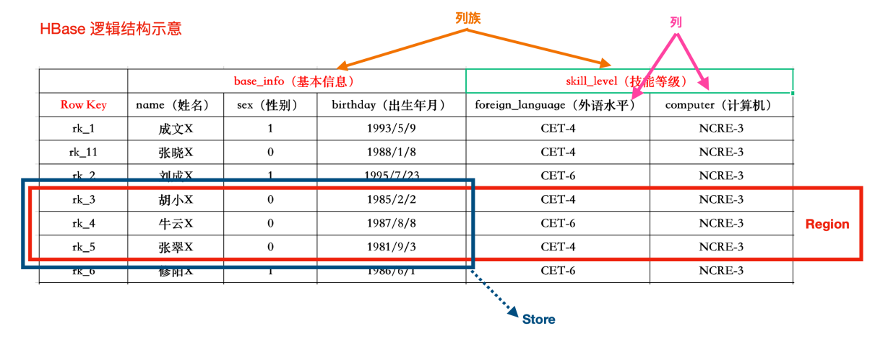
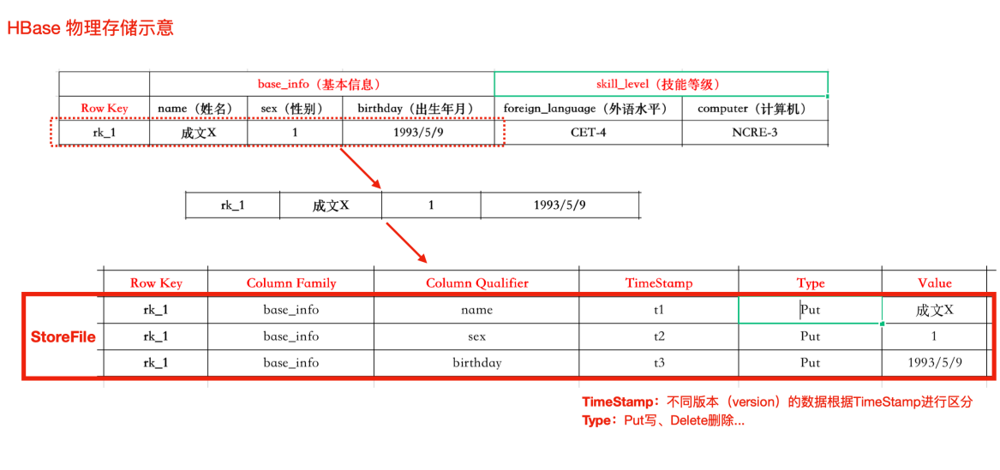
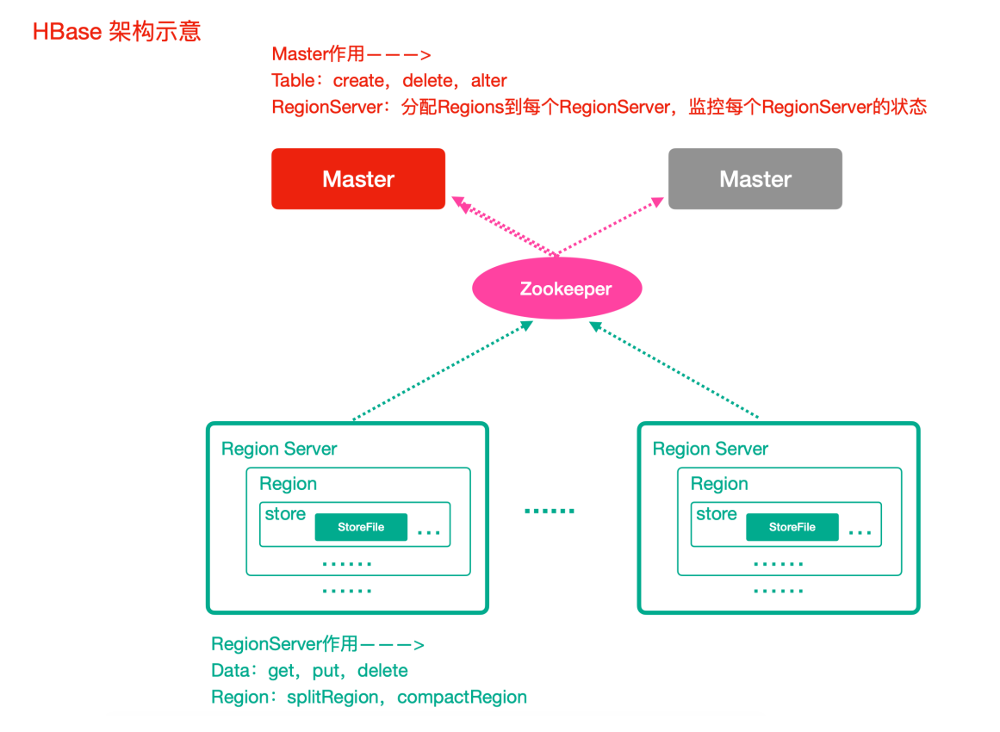
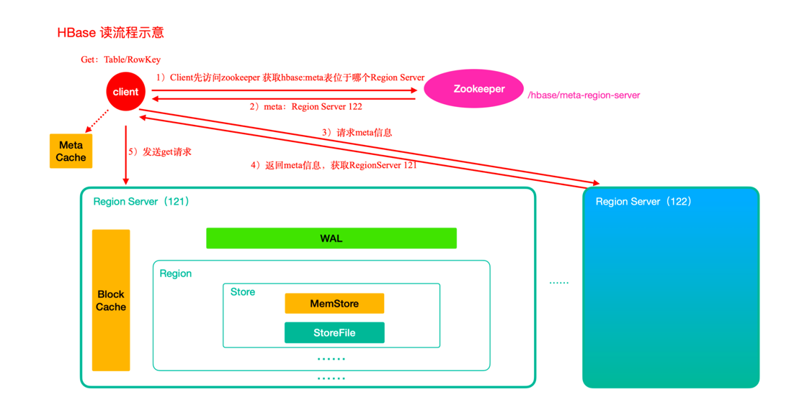
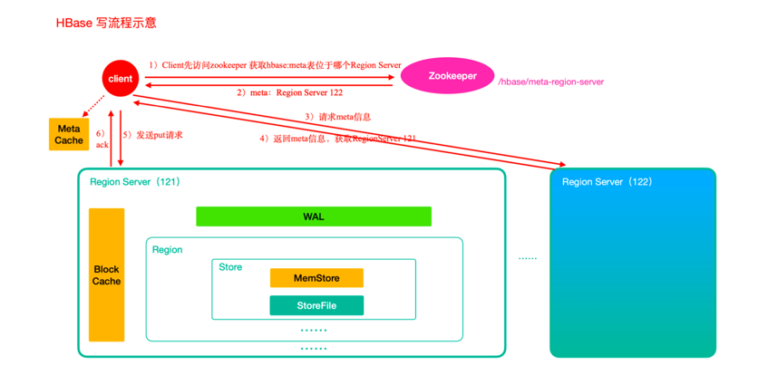
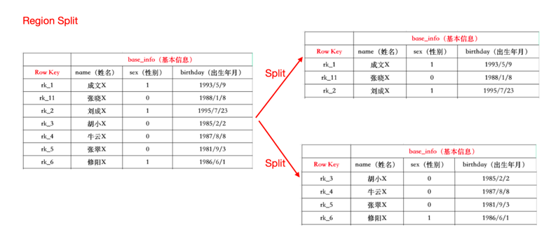
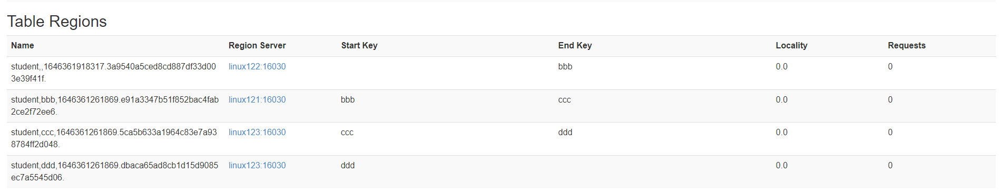
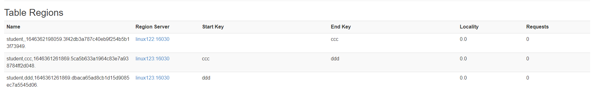
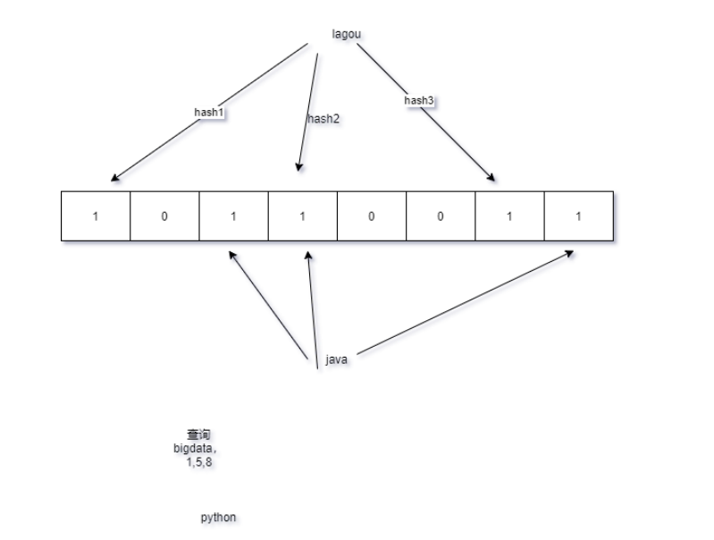

# HBase

## 第一部分 初识 HBase

### 第 1 节 HBase 简介

#### 1.1 HBase是什么

HBase 基于 Google的BigTable论文而来，是一个分布式海量列式非关系型**数据库**系统，可以提供超大规模数据集的实时随机读写。

接下来，通过一个场景初步认识HBase列存储。

如下MySQL存储机制，空值字段浪费存储空间

| id  | NAME | AGE | SALARY | JOB |
|-----|------|-----|--------|-----|
| 1   | 小明   | 23  |        | 学生  |
| 2   | 小红   |     | 10w    | 律师  |

如果是列存储的话，可以这么玩......

```text
rowkey:1 name:小明
rowkey:1 age:23
rowkey:1 job:学生
rowkey:2 name:小红
rowkey:2 salary:10w
rowkey:2 job:律师
....
```

列存储的优点: 

1. 减少存储空间占用
2. 支持多列

#### 1.2 HBase的特点

- 海量存储: 底层基于HDFS存储海量数据 
- 列式存储: HBase表的数据是基于列族进行存储的(一个列族包含若干列)
- 极易扩展: 底层依赖HDFS，当磁盘空间不足的时候，只需要动态增加DataNode服务节点就可以 
- 高并发: 支持高并发的读写请求 
- 稀疏: 稀疏主要是针对HBase列的灵活性，在列族中，你可以指定任意多的列，在列数据为空的情况下，不会占用存储空间
- 数据的多版本: HBase表中的数据可以有多个版本值，默认情况下是根据版本号去区分，版本号就是插入数据的时间戳
- 数据类型单一: 所有的数据在HBase中是以字节数组进行存储

#### 1.3 HBase的应用

- 交通方面: 船舶GPS信息，每天有上千万左右的数据存储。
- 金融方面: 消费信息、贷款信息、信用卡还款信息等。
- 电商方面: 电商网站的交易信息、物流信息、游览信息等。
- 电信方面: 通话信息。

*总结: HBase适合海量明细数据的存储，并且后期需要有很好的查询性能(单表超千万、上亿， 且并发要求高)*

### 第 2 节 HBase数据模型

HBase的数据也是以表(有行有列)的形式存储

#### HBase逻辑架构



- RowKey 类似于关系型数据库的主键, 要求唯一, 并对这一列所有数据进行字典排序

- 一个列族包含多个列, HBase 建表时必须指定列族, 具体的列可以插入数据的时候再指定.

- Region 由一个表的若干行组成, 一个表由多个 Region 组成; 如果 Region 过大, 还会被切分出新的 Region

- HBase 存储(写入文件)时, 会以列族为整体进行存储.

#### HBase物理存储




#### 重要概念详解

##### NameSpace

命名空间. 类似于关系型数据库的 **Database** 概念, 每个命名空间下有多个表. 

HBase 有两个自带的命名空间: hbase, default. hbase 存放的是 HBase 内置的表, default 表是用户默认的命名空间.

一个表可以自由的选择是否有命名空间, 如果创建表的时候加上了命名空间, 则表名以 `<Namespace>:<TableName>` 作为区分.

##### Table

类似于关系型数据库的表概念.

不同的是, HBase 定义表时声明列族即可, 数据的属性如: 超时时间(TTL), 压缩算法(COMPRESSION)等, 都在列族的定义中定义, 不需要声明具体的列.

##### Row

> 一行逻辑数据

HBase表中的每行数据都由一个 RowKey 和多个Column(列)组成。

一个行包含了多个列，这些列通过*列族*来分类, 行中的数据所属列族只能从该表所定义的列族中选取,
不能定义这个表中不存在的列族，否则报错 `NoSuchColumnFamilyException`。

##### RowKey

> 每行数据的主键

RowKey 是由用户指定的一串不重复的字符串定义，是一行的**唯一**标识！数据是按照 RowKey 的**字典顺序**存储的，并且查询数据时只能根据RowKey进行检索，
所以RowKey的设计十分重要。如果使用了之前已经定义的RowKey，则会更新之前的数据！


##### ColumnFamily

> 列族

列族是多个列的集合。一个列族可以动态地灵活定义多个列。表的相关属性大部分都定义在列族上，同一个表的不同列族可以有完全不同的属性配置，
但是同一个列族内的所有列都会有相同的属性。

列族存在的意义是HBase会把相同列族的列尽量放在同一台机器上，所以说，如果想让某几个列被放到一起，就给他们定义相同的列族。

##### ColumnQualifier

> 列

Hbase中的列是可以随意定义的，一个行中的列不限名字、不限数量，只限定列族。因此列必须依赖于列族存在！列的名称前必须带着其所属的列族！

例如: `info:name`, `info:age`

##### TimeStamp

> 时间戳, 也可以理解为数据版本

用于标识数据的不同版本(version)。时间戳默认由系统指定，也可以由用户显式指定。
在读取单元格的数据时，版本号可以省略，如果不指定，Hbase默认会获取最后一个版本的数据返回!

##### Cell

一个列中可以存储多个版本的数据。而每个版本就称为一个单元格(Cell)

##### Region

> 表的分区

Region由一个表的若干行组成！在Region中行的排序按照行键（RowKey）字典排序。

Region不能跨RegionSever，且当数据量大的时候，HBase会拆分Region。


### 第 3 节 HBase整体架构



> Master/Slave架构

> HBase 集群的元数据被存储为一张 HBase 的表, Zookeeper 中存储的是这张表的元数据(如:表名等)

#### Zookeeper

- 实现了HMaster的高可用
- 保存了HBase 的元数据信息，是所有HBase表的寻址入口
- 对HMaster和HRegionServer实现了监控

#### HMaster(Master)

- 为HRegionServer分配Region, 维护整个集群的负载均衡
- 维护集群的元数据信息
- 发现失效的Region，并将失效的Region分配到正常的HRegionServer上

#### HRegionServer(RegionServer)

- 负责管理Region
- 接受客户端的读写数据请求 
- 切分在运行过程中变大的Region

#### Region

- 每个HRegion由多个Store构成，
- 每个Store保存一个列族(Columns Family)，表有几个列族，则有几个Store，
- 每个Store由一个MemStore和多个StoreFile组成，MemStore是Store在内存中的内容，写到文件后就是StoreFile。StoreFile底层是以HFile的格式保存。

> 内存和磁盘的数据共同组成了一个 Store

### 第 4 节 HBase集群安装部署

#### HBase 安装

1. 下载安装包

<http://archive.apache.org/dist/hbase/1.3.1/>

hbase-1.3.1-bin.tar.gz

2. 规划安装目录 `[linux121]/opt/zmn/servers/`
3. 上传安装包到服务器 
4. 解压安装包到指定的规划目录

```shell
cd /opt/zmn/software/
tar -zxvf hbase-1.3.1-bin.tar.gz -C /opt/zmn/servers/
```

5. 修改配置文件

需要把hadoop中的配置 `core-site.xml`、`hdfs-site.xml`拷贝到hbase安装目录下的conf文件夹中

```shell
ln -s /opt/zmn/servers/hadoop-2.9.2/etc/hadoop/core-site.xml /opt/zmn/servers/hbase-1.3.1/conf/core-site.xml
ln -s /opt/zmn/servers/hadoop-2.9.2/etc/hadoop/hdfs-site.xml /opt/zmn/servers/hbase-1.3.1/conf/hdfs-site.xml
```

修改conf目录下配置文件

` hbase-env.sh`

```shell
#添加java环境变量
export JAVA_HOME=/opt/zmn/servers/jdk1.8.0_231
#指定使用外部的zk集群
export HBASE_MANAGES_ZK=FALSE
```

修改 `hbase-site.xml`

```xml
<configuration>
    <!-- 指定hbase在HDFS上存储的路径 -->
    <property>
        <name>hbase.rootdir</name>
        <value>hdfs://linux121:9000/hbase</value>
    </property>
    <!-- 指定hbase是分布式的 -->
    <property>
        <name>hbase.cluster.distributed</name>
        <value>true</value>
    </property>
    <!-- 指定zk的地址，多个用“,”分割 -->
    <property>
        <name>hbase.zookeeper.quorum</name>
        <value>linux121:2181,linux122:2181,linux123:2181</value>
    </property>
</configuration>
```

修改 `/opt/zmn/servers/hbase-1.3.1/conf/regionservers` 文件

```shell
#指定regionserver节点 
linux121
linux122
linux123
```

hbase的conf目录下创建文件 `backup-masters` (指定Standby Master)

```shell
linux122
```

6. 配置hbase的环境变量

```shell
export HBASE_HOME=/opt/zmn/servers/hbase-1.3.1
export PATH=$PATH:$HBASE_HOME/bin
```

7. 分发hbase目录和环境变量到其他节点

```shell
rsync-script /opt/zmn/servers/hbase-1.3.1
```

8. 让所有节点的hbase环境变量生效 

```shell
rsync-script /etc/profile
```

在所有节点执行 `source /etc/profile`

#### HBase集群的启动和停止

- 前提条件: 先启动hadoop和zk集群 
- 启动HBase: `start-hbase.sh`
- 停止HBase: `stop-hbase.sh`

#### HBase集群的web管理界面 

启动好HBase集群之后，可以访问地址: `HMaster的主机名:16010`

<http://linux121:16010>

### 第 5 节 HBase shell 基本操作

进入Hbase客户端命令操作界面

```shell
hbase shell
```

查看帮助命令

```shell
hbase(main):001:0> help
```

查看当前数据库中有哪些表

```shell
hbase(main):002:0> list
```

创建一张 zmn 表， 包含base_info、extra_info两个列族

```shell
# Hbase建表必须指定列族信息
create 'zmn', 'base_info', 'extra_info'
# 或者
create 'zmn', {NAME => 'base_info', VERSIONS => '3'},{NAME => 'extra_info', VERSIONS => '3'}

# VERSIONS 是指此单元格内的数据可以保留最近的 3 个版本
```

添加数据操作

```shell
# 向表中插入信息，row key为 rk1，列族base_info中添加name列标示符，值为wang
put 'zmn', 'rk1', 'base_info:name', 'wang'
# 向表中插入信息，row key为rk1，列族base_info中添加age列标示符，值为30
put 'zmn', 'rk1', 'base_info:age', 30
# 向表中插入信息，row key为rk1，列族extra_info中添加address列标示符，值为shanghai
put 'zmn', 'rk1', 'extra_info:address', 'shanghai'
```

查询数据

```shell
# 1. 通过row key进行查询
# 获取表中row key为rk1的所有信息
hbase(main):017:0> get 'zmn', 'rk1'
COLUMN                                          CELL                                                                                                                                      
 base_info:age                                  timestamp=1646292415744, value=30                                                                                                         
 base_info:name                                 timestamp=1646292411751, value=wang                                                                                                       
 extra_info:address                             timestamp=1646292419355, value=shanghai 

# 2. 查看rowkey下面的某个列族的信息
# 获取zmn表中row key为rk1，base_info列族的所有信息
hbase(main):018:0> get 'zmn', 'rk1', 'base_info'
COLUMN                                          CELL                                                                                                                                      
 base_info:age                                  timestamp=1646292415744, value=30                                                                                                         
 base_info:name                                 timestamp=1646292411751, value=wang  

# 3. 查看row key指定列族指定字段的值
# 获取表中row key为rk1，base_info列族的name、age列标示符的信息
hbase(main):019:0> get 'zmn', 'rk1', 'base_info:name', 'base_info:age'
COLUMN                                          CELL                                                                                                                                      
 base_info:age                                  timestamp=1646292415744, value=30                                                                                                         
 base_info:name                                 timestamp=1646292411751, value=wang    

# 4. 查看row key指定多个列族的信息
# 获取zmn表中row key为rk1，base_info、extra_info列族的信息
get 'zmn', 'rk1', 'base_info', 'extra_info'
get 'zmn', 'rk1', {COLUMN => ['base_info', 'extra_info']}
get 'zmn', 'rk1', {COLUMN => ['base_info:name', 'extra_info:address']}
# 此三个命令效果等同

# 5. 指定row key与列值查询
# 获取表中row key为rk1，cell的值为wang的信息
hbase(main):020:0> get 'zmn', 'rk1', {FILTER => "ValueFilter(=, 'binary:wang')"}
COLUMN                                          CELL                                                                                                                                      
 base_info:name                                 timestamp=1646292411751, value=wang

# 6. 指定row key与列值模糊查询
# 获取表中row key为rk1，列标示符中含有a的信息
hbase(main):021:0> get 'zmn', 'rk1', {FILTER => "(QualifierFilter(=,'substring:a'))"}
COLUMN                                          CELL                                                                                                                                      
 base_info:age                                  timestamp=1646292415744, value=30                                                                                                         
 base_info:name                                 timestamp=1646292411751, value=wang                                                                                                       
 extra_info:address                             timestamp=1646292419355, value=shanghai

# 7. 查询所有数据
# 查询zmn表中的所有信息
hbase(main):022:0> scan 'zmn'
ROW                                             COLUMN+CELL                                                                                                                               
 rk1                                            column=base_info:age, timestamp=1646292415744, value=30                                                                                   
 rk1                                            column=base_info:name, timestamp=1646292411751, value=wang                                                                                
 rk1                                            column=extra_info:address, timestamp=1646292419355, value=shanghai  

# 8. 列族查询
# 查询表中列族为 base_info 的信息
scan 'zmn', {COLUMNS => 'base_info'}
scan 'zmn', {COLUMNS => 'base_info', RAW => true, VERSIONS => 3}

# Scan 时可以设置是否开启Raw模式,开启Raw模式会返回包括已添加删除标记但是未实际删除的数据 
# VERSIONS指定查询的最大版本数

# 9. 指定多个列族与按照数据值模糊查询
# 查询zmn表中列族为 base_info 和 extra_info且列标示符中含有a字符的信息
scan 'zmn', {COLUMNS => ['base_info', 'extra_info'], FILTER => "(QualifierFilter(=,'substring:a'))"}

# 10. rowkey的范围值查询(非常重要!!!)
# 查询zmn表中列族为base_info，rk范围是[rk1, rk3)的数据(rowkey底层存储是字典序)
# 按rowkey顺序存储。
scan 'zmn', {COLUMNS => 'base_info', STARTROW => 'rk1', ENDROW => 'rk3'}

# 11. 指定rowkey模糊查询
# 查询zmn表中row key以rk字符开头的
scan 'zmn', {FILTER=>"PrefixFilter('rk')"}
```

更新数据 

> 更新操作同插入操作一模一样，只不过有数据就更新，没数据就添加

```shell
# 更新数据值
# 把zmn表中rowkey为rk1的base_info列族下的列name修改为 john
put 'zmn', 'rk1', 'base_info:name', 'john'
```

删除数据和表

```shell
# 1. 指定rowkey以及列名进行删除
# 删除zmn表row key为rk1，列标示符为 base_info:name 的数据
delete 'zmn', 'rk1', 'base_info:name'

# 2. 指定rowkey，列名以及字段值进行删除
# 删除user表row key为rk0001，列标示符为info:name，timestamp为 1646293773318 的数据
delete 'zmn', 'rk1', 'base_info:name', 1646293773318

# 3. 删除列族
# 删除 base_info 列族
alter 'zmn', 'delete' => 'base_info'

# 4. 清空表数据
# 删除zmn表数据
truncate 'zmn'

# 5. 删除表
# 删除zmn表

# 先disable 再drop
disable 'zmn'
drop 'zmn'

#如果不进行disable，直接drop会报错: ERROR: Table user is enabled. Disable it first.
```

## 第二部分 HBase原理深入

### 第 1 节 HBase读数据流程



HBase读操作

1. 首先从zk找到meta表的region位置，然后读取meta表中的数据，meta表中存储了用户表的region信息
2. 根据要查询的namespace、表名和rowkey信息。找到写入数据对应的region信息
3. 找到这个region对应的regionServer，然后发送请求
4. 查找对应的region
5. 先从MemStore查找数据，如果没有，再从BlockCache上读取

> HBase上RegionServer的内存分为两个部分: 一部分作为MemStore，主要用来写; 另外一部分作为BlockCache，主要用于读数据;

> BlockCache 缓存是 RS(Region Server)级别的; MemStore 是 Store 级别的(每个Store 都持有一个 MemStore);

6. 如果BlockCache中也没有找到，再到StoreFile上进行读取

> 从storeFile中读取到数据之后，不是直接把结果数据返回给客户端，而是把数据先写入到BlockCache中，目的是为了加快后续的查询; 然后在返回结果给客户端。

### 第 2 节 HBase写数据流程



HBase写操作

1. 首先从zk找到meta表的region位置，然后读取meta表中的数据，meta表中存储了用户表的region信息 
2. 根据namespace、表名和 RowKey 信息。找到写入数据对应的region信息 
3. 找到这个region对应的regionServer，然后发送请求 
4. 把数据分别写到HLog(WAL)和MemStore各一份 

> WAL: write ahead log, 预写入日志. 类似于 HDFS 的 edits 文件

5. MemStore达到阈值后把数据刷到磁盘，生成StoreFile文件

> 不断刷写会生成多个文件, 但是文件数量太多会降低查询效率, 因此会有文件合并.

6. 删除HLog中的历史数据

*小总结: 通过前面读写流程的学习, 不难发现 HBase 数据读取的步骤比数据写入更复杂, 因此 HBase 写入性能比读取性能好.*

### 第 3 节 HBase的Flush(刷写)及Compact(合并)机制

#### Flush机制

> 这些配置在哪个配置文件来着？ 都是默认配置.

1. 当MemStore的大小超过这个值的时候，会flush到磁盘,默认为128M

```xml
<property>
    <name>hbase.hregion.memstore.flush.size</name>
    <value>134217728</value>
</property>
```

2. 当MemStore中的数据时间超过1小时，会flush到磁盘

```xml
<property>
    <name>hbase.regionserver.optionalcacheflushinterval</name>
    <value>3600000</value>
</property>
```

3. HBaseRegionServer的全局MemStore的大小，超过该大小会触发flush到磁盘的操作,默认是堆大小的40%

```xml
<property>
    <name>hbase.regionserver.global.memstore.size</name>
    <value>0.4</value>
</property>
```

4. 手动flush

```shell
flush tableName
```

#### 阻塞机制

以上介绍的是Store中MemStore数据刷写磁盘的标准，但Hbase是周期性的检查内存是否满足标准, 如果满足则进行刷写.
但是如果在下次检查到来之前，数据疯狂写入MemStore中，会出现什么问题呢?

会触发阻塞机制，此时无法写入数据到 MemStore，数据无法写入Hbase集群。

1. MemStore中数据达到512MB 

计算公式: `hbase.hregion.memstore.flush.size * hbase.hregion.memstore.block.multiplier` 

- `hbase.hregion.memstore.flush.size` 刷写的阀值，默认是 134217728，即128MB。
- `hbase.hregion.memstore.block.multiplier` 是一个倍数，默认是4。 

2. RegionServer全部MemStore达到规定值 

- `hbase.regionserver.global.memstore.size.lower.limit` 是0.95，
- `hbase.regionserver.global.memstore.size` 是0.4

如: 堆内存总共是 16G，触发刷写的阈值是: (`16*0.4*0.95`)6.08GB; 触发阻塞的阈值是: (`16 * 0.4`)6.4GB

#### Compact合并机制

在 HBase 中主要存在两种类型的Compact合并：minor compact 小合并和 major compact 大合并

##### minor compact 小合并

将Store中多个HFile(StoreFile)合并为一个HFile

> 这个过程中，删除和更新的数据仅仅只是做了标记，并没有物理移除，这种合并的触发频率很高。

minor compact文件选择标准由以下几个参数共同决定:

```xml
<configuration>
    <!--待合并文件数据必须大于等于下面这个值-->
    <property>
        <name>hbase.hstore.compaction.min</name>
        <value>3</value>
    </property>
    <!--待合并文件数据必须小于等于下面这个值-->
    <property>
        <name>hbase.hstore.compaction.max</name>
        <value>10</value>
    </property>
    <!--默认值为128m, 表示文件大小小于该值的store file 一定会加入到minor compaction的store file中 -->
    <property>
        <name>hbase.hstore.compaction.min.size</name>
        <value>134217728</value>
    </property>
    <!--默认值为LONG.MAX_VALUE，表示文件大小大于该值的store file 一定会被minor compaction排除-->
    <property>
        <name>hbase.hstore.compaction.max.size</name>
        <value>9223372036854775807</value>
    </property>
</configuration>
```

触发条件

- MemStore flush: 在进行MemStore flush前后都会进行判断是否触发compact 
- 定期检查线程: 周期性检查是否需要进行compaction操作, 由参数 `hbase.server.thread.wakefrequency` 决定，默认值是 10000 millseconds

##### major compact 大合并

将Store中**所有的**HFile合并为一个HFile

> 这个过程有删除标记的数据会被真正移除，同时超过单元格maxVersion的版本记录也会被删除。

合并频率比较低，默认7天执行一次，并且性能消耗非常大，建议生产关闭(设置为0)，在应用空闲时间手动触发。

一般可以是手动控制进行合并，防止出现在业务高峰期。

major compaction 触发时间条件

```xml
<!--默认值为7天进行一次大合并，-->
<property>
    <name>hbase.hregion.majorcompaction</name>
    <value>604800000</value>
</property>
```

手动触发

```shell
# 使用major_compact命令 
major_compact tableName
```

### 第 4 节 Region 拆分机制

Region中存储的是大量的rowkey数据, 当Region中的数据条数过多的时候,直接影响查询效率。

当Region过大的时候, HBase会拆分Region, 这也是Hbase的一个优点。



#### 4.1 拆分策略

HBase的Region Split策略一共有以下几种:

##### 1. ConstantSizeRegionSplitPolicy

> 0.94版本前默认切分策略

当region大小大于某个阈值(`hbase.hregion.max.filesize=10G`)之后就会触发切分，一个region等分为2个region。

但是在生产线上这种切分策略却有相当大的弊端: 切分策略对于大表和小表没有明显的区分。
阈值(`hbase.hregion.max.filesize`)设置较大对大表比较友好，但是小表就有可能不会触发分裂，极端情况下可能就1个，这对业务来说并不是什么好事。
如果设置较小则对小表友好，但一个大表就会在整个集群产生大量的region，这对于集群的管理、资源使用、failover来说都不是一件好事。

##### 2. IncreasingToUpperBoundRegionSplitPolicy

> 0.94版本~2.0版本默认切分策略

切分策略稍微有点复杂，总体看和ConstantSizeRegionSplitPolicy思路相同，一个region大小大于设置阈值就会触发切分。
但是这个阈值并不像ConstantSizeRegionSplitPolicy是一个固定的值，而是会在一定条件下不断调整，调整规则和region所属表在当前RegionServer上的region个数有关系.

region split的计算公式是: `regioncount^3 * 128M * 2`，当region达到该size的时候进行split 

例如:

第一次split: 1^3 * 256 = 256MB

第二次split: 2^3 * 256 = 2048MB

第三次split: 3^3 * 256 = 6912MB

第四次split: 4^3 * 256 = 16384MB > 10GB，因此取较小的值10GB 后面每次split的size都是10GB了

##### 3. SteppingSplitPolicy

> 2.0版本默认切分策略

这种切分策略的切分阈值又发生了变化，相比 IncreasingToUpperBoundRegionSplitPolicy 简单了一些，
依然和待分裂region所属表在当前RegionServer上的region个数有关系，
如果region个数等于 1，切分阈值为 `flush size * 2`，否则为MaxRegionFileSize。

这种切分策略对于大集群中的大表、小表会比 IncreasingToUpperBoundRegionSplitPolicy 更加友好，
小表不会再产生大量的小region，而是适可而止。

##### 4. KeyPrefixRegionSplitPolicy

根据rowKey的前缀对数据进行分组，这里是指定rowKey的前多少位作为前缀，比如rowKey都是16位的，
指定前5位是前缀，那么前5位相同的rowKey在进行region split的时候会分到相同的region中。

##### 5. DelimitedKeyPrefixRegionSplitPolicy

保证相同前缀的数据在同一个region中，例如rowKey的格式为: `userid_eventtype_eventid`，指定的 delimiter 为 `_` ，
则split的的时候会确保userid相同的数据在同一个region中。

##### 6. DisabledRegionSplitPolicy 

不启用自动拆分, 需要指定手动拆分


#### 4.2 RegionSplitPolicy的应用

Region拆分策略可以全局统一配置，也可以为单独的表指定拆分策略。

1. 通过 `hbase-site.xml` 全局统一配置(对hbase所有表生效)

```xml
<property>
    <name>hbase.regionserver.region.split.policy</name>
    <value>org.apache.hadoop.hbase.regionserver.IncreasingToUpperBoundRegionSplitPolicy</value>
</property>
```

2. 通过Java API为单独的表指定Region拆分策略

```java{2}
HTableDescriptor tableDesc = new HTableDescriptor("test1");
tableDesc.setValue(HTableDescriptor.SPLIT_POLICY, IncreasingToUpperBoundRegionSplitPolicy.class.getName());
tableDesc.addFamily(new HColumnDescriptor(Bytes.toBytes("cf1")));
admin.createTable(tableDesc);
```

3. 通过HBase Shell为单个表指定Region拆分策略

```shell
create 'test2', {METADATA => {'SPLIT_POLICY' => 'org.apache.hadoop.hbase.regionserver.IncreasingToUpperBoundRegionSplitPolicy'}},{NAME => 'cf1'}
```

### 第 5 节 HBase表的预分区(Region)

#### 5.1 为何要预分区?

当一个table刚被创建的时候，Hbase默认的分配一个Region给table。
也就是说这个时候，所有的读写请求都会访问到同一个RegionServer的同一个Region中，
这个时候就达不到负载均衡的效果了，集群中的其他RegionServer就可能会处于比较空闲的状态。

解决这个问题可以用pre-splitting, 在创建table的时候就配置好，生成多个region。

- 增加数据读写效率
- 负载均衡，防止数据倾斜
- 方便集群容灾调度region

每一个region维护着startRow与endRowKey，如果加入的数据符合某个region维护的rowKey范围，则该数据交给这个region维护

#### 5.2 手动指定预分区

```shell
create 'person','info1','info2', SPLITS => ['1000','2000','3000']
```

> `SPLITS => ['1000','2000','3000']` 分区的 startKey 和 endKey

也可以把分区规则创建于文件中

```shell
vi split.txt

# 文件内容如下
aaa
bbb
ccc
ddd

# 执行命令
create 'student', 'info', SPLITS_FILE => '/root/hbase/split.txt'
```

### 第 6 节 Region 合并

Region的合并不是为了性能，而是出于维护的目的。

#### 通过Merge类冷合并Region

> 需要先关闭hbase集群

需求: 需要把student表中的2个region数据进行合并: 

> 下面的分区的信息可以在Web管理界面的 Table Regions 模块下取得

`student,,1646361261869.c0baba7dcad8c46ea45f599382e060eb.`

`student,aaa,1646361261869.594809a3327b8f312316a38904e2b787.`

这里通过 `org.apache.hadoop.hbase.util.Merge` 类来实现，不需要进入hbase shell，直接执行(需要先关闭hbase集群):

```shell
hbase org.apache.hadoop.hbase.util.Merge student \
student,,1646361261869.c0baba7dcad8c46ea45f599382e060eb. \
student,aaa,1646361261869.594809a3327b8f312316a38904e2b787.
```

> 在 linux121 正常执行完上面的命令后, 可以重新启动 HBase



#### 通过online_merge热合并Region

不需要关闭hbase集群，在线进行合并

与冷合并不同的是，online_merge的传参是Region的hash值，而Region的hash值就是Region名称的最后那段在两个 `.` 之间的字符串部分。

需求: 需要把 zmn_s 表中的2个region数据进行合并: 

`student,,1646361918317.3a9540a5ced8cd887df33d003e39f41f.` 

`student,bbb,1646361261869.e91a3347b51f852bac4fab2ce2f72ee6.`

需要进入hbase shell:

```shell
merge_region '3a9540a5ced8cd887df33d003e39f41f','e91a3347b51f852bac4fab2ce2f72ee6'
```

成功后观察界面



## 第三部分 HBase API应用和优化

### 第 1 节 HBase API客户端操作

创建Maven工程，添加依赖

```xml
<dependencies>
    <dependency>
        <groupId>org.apache.hbase</groupId>
        <artifactId>hbase-client</artifactId>
        <version>1.3.1</version>
    </dependency>
    <dependency>
        <groupId>junit</groupId>
        <artifactId>junit</artifactId>
        <version>4.12</version>
        <scope>test</scope>
    </dependency>
    <dependency>
        <groupId>org.testng</groupId>
        <artifactId>testng</artifactId>
        <version>6.14.3</version>
        <scope>test</scope>
    </dependency>
</dependencies>
```

#### 数据创建和删除


```java
public class HBaseClientTest {

    Configuration configuration;
    Connection connection;

    @Before
    public void init() throws IOException {
        // 获取一个配置文件对象
        configuration = HBaseConfiguration.create();
        // 通过 conf 获取 HBase 集群的连接
        configuration.set("hbase.zookeeper.quorum", "linux121,linux122,linux123");
        configuration.set("hbase.zookeeper.property.clientPort", "2181");
        connection = ConnectionFactory.createConnection(configuration);
    }

    // 释放连接
    @After
    public void release() {
        if (connection != null) {
            try {
                connection.close();
            } catch (IOException e) {
                e.printStackTrace();
            }
        }
    }

    // 创建一张 HBase 表
    @Test
    public void createTable() throws IOException {
        // 获取 HBaseAdmin 对象, 用来创建表
        HBaseAdmin admin = (HBaseAdmin) connection.getAdmin();
        // 创建表描述
        HTableDescriptor desc = new HTableDescriptor(TableName.valueOf("worker"));
        // 指定列族
        desc.addFamily(new HColumnDescriptor("info"));
        admin.createTable(desc);
        System.out.println("worker 表创建成功.");
    }

    // 插入一条数据
    @Test
    public void putData() throws IOException {
        // 获取 Table 对象
        Table worker = connection.getTable(TableName.valueOf("worker"));
        // 准备 put 对象
        Put put = new Put(Bytes.toBytes("110"));
        put.addColumn(Bytes.toBytes("info"), Bytes.toBytes("addr"), Bytes.toBytes("Beijing"));
        // 插入数据
        worker.put(put);
        // worker.put(List<Put>); // => 批量插入
        // 关闭 Table 对象
        worker.close();
        System.out.println("插入数据到 worker 表成功");
    }

    // 删除数据
    @Test
    public void deleteData() throws IOException {
        // 获取 Table 对象
        Table worker = connection.getTable(TableName.valueOf("worker"));
        // 准备 delete 对象
        Delete delete = new Delete(Bytes.toBytes(110));
        // 删除数据
        worker.delete(delete);
        // 关闭 Table 对象
        worker.close();
        System.out.println("删除数据成功");
    }
    
}
```

#### 数据查询

```java{62-64}
public class HBaseClientTest {

    Configuration configuration;
    Connection connection;
    
    // 查询数据
    @Test
    public void getData() throws IOException {
        // 获取 Table 对象
        Table worker = connection.getTable(TableName.valueOf("worker"));
        // 准备 get 对象
        Get get = new Get(Bytes.toBytes("110"));
        // 指定查询某个列族或列
        get.addFamily(Bytes.toBytes("info"));
        // 执行查询
        Result result = worker.get(get);
        // 获取 result 中所有的 cell 对象
        Cell[] cells = result.rawCells();
        // 遍历打印
        for (Cell cell : cells) {
            String rowKey = Bytes.toString(CellUtil.cloneRow(cell));
            String family = Bytes.toString(CellUtil.cloneFamily(cell));
            String qualifier = Bytes.toString(CellUtil.cloneQualifier(cell));
            String value = Bytes.toString(CellUtil.cloneValue(cell));
            System.out.println("rowKey = " + rowKey + "; family = " + family + "; qualifier = " + qualifier + "; value = " + value);
        }
        worker.close();
    }

    // 全表扫描
    @Test
    public void scanData() throws IOException {
        // 获取 Table 对象
        Table worker = connection.getTable(TableName.valueOf("worker"));
        // 准备 scan 对象
        Scan scan = new Scan();
        // 执行扫描
        ResultScanner scanner = worker.getScanner(scan);
        for (Result result : scanner) {
            // 获取 result 中所有的 cell 对象
            Cell[] cells = result.rawCells();
            // 遍历打印
            for (Cell cell : cells) {
                String rowKey = Bytes.toString(CellUtil.cloneRow(cell));
                String family = Bytes.toString(CellUtil.cloneFamily(cell));
                String qualifier = Bytes.toString(CellUtil.cloneQualifier(cell));
                String value = Bytes.toString(CellUtil.cloneValue(cell));
                System.out.println("rowKey = " + rowKey + "; family = " + family + "; qualifier = " + qualifier + "; value = " + value);
            }
        }
        worker.close();
    }

    // 指定 scan 开始 rowKey 和 结束 rowKey
    // [建议使用] 指定区间可以避免全表扫描
    @Test
    public void scanDataLimit() throws IOException {
        // 获取 Table 对象
        Table worker = connection.getTable(TableName.valueOf("worker"));
        // 准备 scan 对象
        Scan scan = new Scan();
        // 指定查询的 rowKey 区间; rowKey 子 HBase 中以字典序排序
        scan.setStartRow(Bytes.toBytes("001"));
        scan.setStopRow(Bytes.toBytes("2"));
        // 执行扫描
        ResultScanner scanner = worker.getScanner(scan);
        for (Result result : scanner) {
            // 获取 result 中所有的 cell 对象
            Cell[] cells = result.rawCells();
            // 遍历打印
            for (Cell cell : cells) {
                String rowKey = Bytes.toString(CellUtil.cloneRow(cell));
                String family = Bytes.toString(CellUtil.cloneFamily(cell));
                String qualifier = Bytes.toString(CellUtil.cloneQualifier(cell));
                String value = Bytes.toString(CellUtil.cloneValue(cell));
                System.out.println("rowKey = " + rowKey + "; family = " + family + "; qualifier = " + qualifier + "; value = " + value);
            }
        }
        worker.close();
    }

}
```

### 第 2 节 Hbase 协处理器

#### 2.1 协处理器概述

官网地址：<https://hbase.apache.org/book.html#cp>

访问HBase的方式是使用 `scan` 或 `get` 获取数据，在获取到的数据上进行业务运算。
但是在数据量非常大的时候，比如一个有上亿行及十万个列的数据集，再按常用的方式移动获取数据就会遇到性能问题。
客户端也需要有强大的计算能力以及足够的内存来处理这么多的数据。

此时就可以考虑使用Coprocessor(协处理器)。将业务运算代码封装到Coprocessor中并在RegionServer上运行，
即在数据实际存储位置执行，最后将运算结果返回到客户端。

*利用协处理器，用户可以编写运行在HBase Server端的代码。*

HBase Coprocessor类似以下概念:

- 触发器和存储过程: 一个 **Observer** Coprocessor有些类似于关系型数据库中的触发器，通过它我们可以在一些事件(如Get或是Scan)发生前后执行特定的代码。
**Endpoint** Coprocessor则类似于关系型数据库中的存储过程，因为它允许我们在RegionServer上直接对它存储的数据进行运算，而非是在客户端完成运算。

- MapReduce: MapReduce的原则就是将运算移动到数据所处的节点。Coprocessor也是按照相同的原则去工作的。

- AOP: 如果熟悉AOP的概念的话，可以将Coprocessor的执行过程视为在传递请求的过程中对请求进行了拦截，并执行了一些自定义代码。


#### 2.2 协处理器类型

##### Observer

协处理器与触发器(trigger)类似，在一些特定事件发生时回调函数(也被称作钩子函数，hook)被执行。这些事件包括一些用户产生的事件，
也包括服务器端内部自动产生的事件。

协处理器框架提供的接口如下: 

- `RegionObserver`: 用户可以用这种的处理器处理数据修改事件，它们与表的region联系紧密。
- `MasterObserver`: 可以被用作管理或DDL类型的操作，这些是集群级事件。
- `WALObserver`: 提供控制WAL(预写入日志)的钩子函数。

##### Endpoint

这类协处理器类似传统数据库中的存储过程，客户端可以调用这些 Endpoint 协处理器在RegionServer 中执行一段代码，并将 RegionServer 端执行结果返回给客户端进一步处理。

Endpoint常见用途: 聚合操作

假设需要找出一张表中的最大数据，即 max 聚合操作，普通做法就是必须进行全表扫描，然后Client代码内遍历扫描结果，并执行求最大值的操作。

这种方式存在的弊端是无法利用底层集群的并发运算能力，把所有计算都集中到 Client 端执行, 效率低下。

可以使用Endpoint Coprocessor，用户可以将求最大值的代码部署到 HBase RegionServer 端，HBase 会利用集群中多个节点的优势来并发执行求最大值的操作。
也就是在每个 Region 范围内执行求最大值的代码，将每个 Region 的最大值在 Region Server 端计算出，仅仅将该 max 值返回给Client。
在Client进一步将多个 Region 的最大值汇总进一步找到全局的最大值。

> Endpoint Coprocessor 的应用我们后续可以借助于 **Phoenix** 非常容易就能实现。针对Hbase数据集进行聚合运算直接使用SQL语句就能搞定。

#### 2.3 Observer 案例

需求: 通过协处理器Observer实现Hbase当中t1表插入数据,指定的另一张表t2也需要插入相对应的数据。

```shell
# 创建两个表
create 't1','info'
create 't2','info'
```

实现思路：通过Observer协处理器捕捉到t1插入数据时，将数据复制一份并保存到t2表中

开发步骤

1. 添加依赖并编写Observer协处理器

```xml
<!-- https://mvnrepository.com/artifact/org.apache.hbase/hbase-server -->
<dependency>
    <groupId>org.apache.hbase</groupId>
    <artifactId>hbase-server</artifactId>
    <version>1.3.1</version>
</dependency>
```

```java
public class MyProcessor extends BaseRegionObserver { // BaseRegionObserver 实现了 RegionObserver 接口

    // 重写 prePut() 方法, 监听向 t1 插入数据的事件, 然后插入数据到 t2 表
    @Override
    public void prePut(ObserverContext<RegionCoprocessorEnvironment> e, Put put, WALEdit edit, Durability durability) throws IOException {
        // 向 t2 表插入数据, 具体的插入内容与 t1 一致
        // 获取 T2 表对象
        HTable t2 = (HTable) e.getEnvironment().getTable(TableName.valueOf("t2"));
        // 解析 t1 表的插入对象
        byte[] rowKey = put.getRow();
        // 获取最新数据
        Cell cell = put.get(Bytes.toBytes("info"), Bytes.toBytes("name")).get(0);
        // 准备插入数据
        Put p1 = new Put(rowKey);
        p1.add(cell);
        // 执行向 t2 表插入数据
        t2.put(p1);
        // 关闭表
        t2.close();
    }
}
```

2. 打成Jar包，上传HDFS

```shell
# linux121
cd /opt/zmn/softwares

hdfs dfs -mkdir -p /processor
hdfs dfs -put processor.jar /processor
```

3. 挂载协处理器

```shell
describe 't1'

alter 't1', METHOD => 'table_att', 'Coprocessor' => 'hdfs://linux121:9000/processor/processor.jar|com.zmn.hbase.processor.MyProcessor|1001|'

# 再次查看't1'表，
describe 't1'
# Table t1 is ENABLED                                                                                                                                                                       
# t1, {TABLE_ATTRIBUTES => {coprocessor$1 => 'hdfs://linux121:9000/processor/processor.jar|com.zmn.hbase.processor.MyProcessor|1001|'}                                                      
# COLUMN FAMILIES DESCRIPTION                                                                                                                                                               
# {NAME => 'info', BLOOMFILTER => 'ROW', VERSIONS => '1', IN_MEMORY => 'false', KEEP_DELETED_CELLS => 'FALSE', DATA_BLOCK_ENCODING => 'NONE', TTL => 'FOREVER', COMPRESSION => 'NONE', MIN_V
# ERSIONS => '0', BLOCKCACHE => 'true', BLOCKSIZE => '65536', REPLICATION_SCOPE => '0'} 
```

4. 验证协处理器 

向t1表中插入数据(shell方式验证)

```shell
put 't1','rk1','info:name','john'
```


> 测试 t2 没有成功插入, 日志也没有报错...

5. 卸载协处理器

```shell
disable 't1'
alter 't1',METHOD=>'table_att_unset',NAME=>'coprocessor$1'
enable 't1'
```

### 第 3 节 HBase表的RowKey设计

RowKey 的基本介绍

ASCII码字典顺序。

```text
012,0,123,234,3

0,3,012,123,234

0,012,123,234,3 [最终排序结果]
```


字典序的排序规则: 

先比较第一个字节，如果相同，然后比对第二个字节，以此类推，如果到第X个字节，其中一个已经超出了 RowKey 的长度，则短 RowKey 排在前面。


#### 3.1 RowKey长度原则

RowKey 是一个二进制码流，可以是任意字符串，最大长度64kb，实际应用中一般为10-100bytes，以 `byte[]` 形式保存，一般设计成定长。

> 建议越短越好，不要超过16个字节(设计过长会降低MemStore内存的利用率和HFile存储数据的效率。)

#### 3.2 RowKey散列原则

建议将 RowKey 的高位作为散列字段，这样将提高数据均衡分布在每个RegionServer，以提高实现负载均衡的几率。

#### 3.3 RowKey唯一原则 

必须在设计上保证其唯一性.

访问hbase table中的行, 有3种方式:

- 单个RowKey
- RowKey 的range 
- 全表扫描(*一定要避免全表扫描*)

实现方式:

1. `org.apache.hadoop.hbase.client.Get`
2. scan方法: `org.apache.hadoop.hbase.client.Scan` 

> scan使用的时候注意: `setStartRow`，`setEndRow` 限定范围; 范围越小，性能越高。

#### 3.4 RowKey排序原则 

HBase的 RowKey 是按照ASCII有序设计的，我们在设计 RowKey 时要充分利用这点.

### 第 4 节 HBase表的热点

#### 4.1 什么是热点

检索HBase的记录首先要通过row key来定位数据行。当大量的client访问hbase集群的一个或少数几个节点，造成少数region server的读/写请求过多、负载过大，
而其他region server负载却很小，就造成了“热点”现象

#### 4.2 热点的解决方案

- 预分区

预分区的目的是让表的数据可以均衡的分散在集群中，而不是默认只有一个region分布在集群的一个节点上。

- 加盐

这里所说的加盐不是密码学中的加盐，而是在RowKey的前面增加随机数，具体就是给RowKey分配一个随机前缀以使得它和之前的RowKey的开头不同。

```text
4个region => [,a),[a,b),[b,c),[c,]

原始数据：abc1, abc2, abc3.

加盐后的RowKey：a-abc1, b-abc2, c-abc3
abc1,a
abc2,b
abc3,c
```

- 哈希

哈希会使同一行永远用一个前缀加盐。哈希也可以使负载分散到整个集群，但是读却是可以预测的。使用确定的哈希可以让客户端重构完整的RowKey，可以使用get操作准确获取某一个行数据。

- 反转

反转固定长度或者数字格式的RowKey。这样可以使得RowKey中经常改变的部分(最没有意义的部分)放在前面。这样可以有效的随机RowKey，但是牺牲了RowKey的有序性。

### 第 5 节 HBase的二级索引

HBase表按照RowKey查询性能是最高的。RowKey就相当于hbase表的一级索引!!

为了HBase的数据查询更高效、适应更多的场景，诸如使用非RowKey字段检索也能做到秒级响应，或者支持各个字段进行模糊查询和多字段组合查询等，
需要在HBase上面构建二级索引，以满足现实中更复杂多样的业务需求。

HBase的二级索引其本质就是建立HBase表中列与行键之间的映射关系。 

常见的二级索引我们一般可以借助各种其他的方式来实现，例如Phoenix或者solr或者ES等。

### 第 6 节 布隆过滤器在HBase的应用

- 布隆过滤器应用

之前在讲HBase的数据存储原理的时候，我们知道HBase的读操作需要访问大量的文件，大部分的实现通过布隆过滤器来避免大量的读文件操作。

- 布隆过滤器的原理

通常判断某个元素是否存在用的可以选择hashmap。但是 HashMap 的实现也有缺点，例如存储容量占比高，考虑到负载因子的存在，
通常空间是不能被用满的，而一旦你的值很多例如上亿的时候，那 HashMap 占据的内存大小就变得很可观了。

Bloom Filter是一种空间效率很高的随机数据结构，它利用位数组很简洁地表示一个集合，并能判断一个元素是否属于这个集合。

HBase 中布隆过滤器来过滤指定的RowKey是否在目标文件，避免扫描多个文件。(使用布隆过滤器来判断)

布隆过滤器返回true, 在结果不一定正确，如果返回false则说明确实不存在。 

> 因为可能有部分 hash 算法, 得出的结果相同的情况, 但是全部hash算法的结果都相同则一般不存在;



#### Bloom Filter案例

布隆过滤器，已经不需要自己实现，Google已经提供了非常成熟的实现。

```xml
<dependency>
    <groupId>com.google.guava</groupId>
    <artifactId>guava</artifactId>
    <version>27.0.1-jre</version>
</dependency>
```

使用: guava 的布隆过滤器，封装的非常好，使用起来非常简洁方便。

例: 预估数据量1w，错误率需要减小到万分之一。使用如下代码进行创建。

```java
public class Test {
    public static void main(String[] args) {
        // 1.创建符合条件的布隆过滤器
        // 预期数据量10000，错误率 0.0001 
        BloomFilter<CharSequence> bloomFilter = BloomFilter.create(Funnels.stringFunnel(Charset.forName("utf-8")), 10000, 0.0001);
        // 2.将一部分数据添加进去
        for (int i = 0; i < 5000; i++) {
            bloomFilter.put("" + i);
        }
        System.out.println("数据写入完毕");
        // 3.测试结果
        for (int i = 0; i < 10000; i++) {
            if (bloomFilter.mightContain("" + i)) {
                System.out.println(i + "存在");
            } else {
                System.out.println(i + "不存在");
            }
        }
    }
}
```

