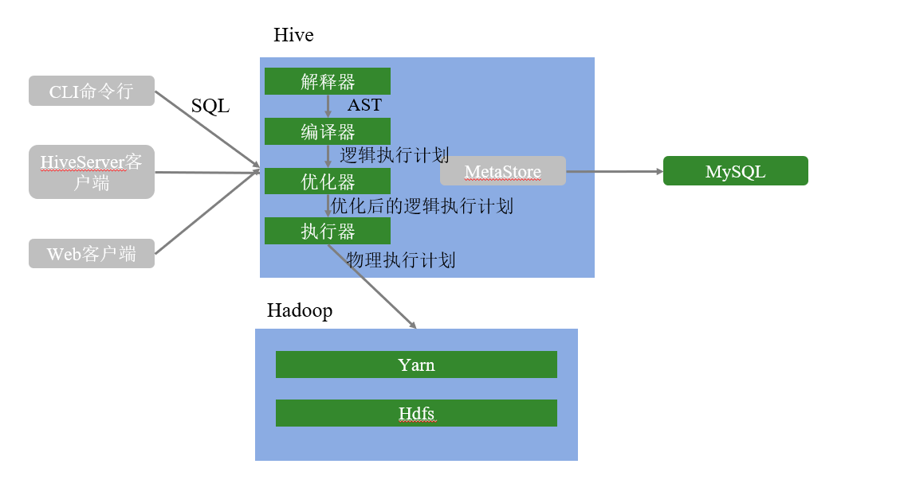

> 数据仓库工具

- 数据仓库工具：Hive 【重点】
- 数据交互工具：Hue
- 数据采集工具：Flume
- 数据迁移工具：Sqoop

# 1. Hive概述

- HDFS => 海量数据的存储
- MapReduce => 海量数据的分析和处理
- YARN => 集群资源的管理和作业调度

## 1.1 Hive产生背景

直接使用 MapReduce 处理大数据，将面临以下问题:

- MapReduce 开发难度大，学习成本高(wordCount => Hello World)
- HDFS 文件没有字段名、没有数据类型，不方便进行数据的有效管理
- 使用 MapReduce 框架开发，项目周期长，成本高

Hive 是基于 Hadoop 的一个数据仓库工具，可以将结构化的数据文件映射为一张表(类似于RDBMS中的表)，并提供类SQL查询功能; 
Hive 是由 Facebook 开源，用于解决海量结构化日志的数据统计。

- Hive 本质是将 SQL 转换为 MapReduce 的任务进行运算
- 底层由 HDFS 来提供数据存储
- 可以将 Hive 理解为：一个*将 SQL 转换为 MapReduce 任务的工具*

数据仓库(Data Warehouse)是一个面向主题的、集成的、相对稳定的、反映历史变化的数据集合，主要用于管理决策。
(数据仓库之父比尔·恩门，1991年提出)。

- 数据仓库的目的: 构建面向分析的、集成的数据集合; 为企业提供决策支持
- 数据仓库本身不产生数据，数据来源于外部
- 存储了大量数据，对这些数据的分析和处理不可避免的用到 Hive

## 1.2 Hive 和 RDBMS 对比

> Relational Database Management System：RDBMS

由于 Hive 采用了类似 SQL 的查询语言 HQL(Hive Query Language)，因此很容易将 Hive 理解为数据库。
其实从结构上来看，Hive 和传统的关系数据库除了拥有类似的查询语言，再无类似之处。

- 查询语言相似

HQL 与 SQL 高度相似。

由于SQL被广泛的应用在数据仓库中，因此，专门针对Hive的特性设计了类SQL的查询语言HQL。熟悉SQL开发的开发者可以很方便的使用Hive进行开发。

- 数据规模。

Hive存储海量数据; RDBMS只能处理有限的数据集;

由于Hive建立在集群上并可以利用MapReduce进行并行计算，因此可以支持很大规模的数据; 而RDBMS可以支持的数据规模较小。

- 执行引擎

Hive 的引擎是 MR/Tez/Spark/Flink; RDBMS 使用自己的执行引擎

Hive 中大多数查询的执行是通过 Hadoop 提供的 MapReduce 来实现的。而RDBMS通常有自己的执行引擎。

- 数据存储

Hive 保存在 HDFS 上; RDBMS 保存在本地文件系统或裸设备

Hive 的数据都是存储在 HDFS 中的。而RDBMS是将数据保存在本地文件系统或裸设备中。

- 执行速度

Hive 相对慢(MR/数据量); RDBMS相对快;

Hive 存储的数据量大，在查询数据的时候，通常没有索引，需要扫描整个表; 加之 Hive 使用 MapReduce 作为执行引擎，这些因素都会导致较高的延迟。
而 RDBMS 对数据的访问通常是基于索引的，执行延迟较低。当然这个低是有条件的，即数据规模较小，当数据规模大到超过数据库的处理能力的时候，Hive 的并行计算显然能体现出并行的优势。

- 可扩展性

Hive 支持水平扩展; 通常 RDBMS 支持垂直扩展，对水平扩展不友好

Hive 建立在 Hadoop 之上，其可扩展性与Hadoop 的可扩展性是一致的(Hadoop集群规模可以轻松超过1000个节点)。
而 RDBMS 由于 ACID 语义的严格限制，扩展行非常有限。目前最先进的并行数据库 Oracle 在理论上的扩展能力也只有100台左右。

- 数据更新

Hive 对数据更新不友好; RDBMS 支持频繁、快速数据更新

Hive 是针对数据仓库应用设计的，数据仓库的内容是读多写少的。因此，Hive 中不建议对数据改写，所有的数据都是在加载的时候确定好的。
而RDBMS中的数据需要频繁、快速的进行更新。

## 1.3 Hive的优缺点

### 1.3.1 Hive的优点

- 学习成本低

Hive提供了类似SQL的查询语言，开发人员能快速上手;

- 处理海量数据

底层执行的是 MapReduce 任务;

- 系统可以水平扩展

底层基于Hadoop;

- 功能可以扩展

Hive允许用户自定义函数;

- 良好的容错性

某个节点发生故障，HQL仍然可以正常完成;

- 统一的元数据管理

元数据包括:有哪些表、表有什么字段、字段是什么类型

### 1.3.2 Hive的缺点

- HQL表达能力有限;
- 迭代计算无法表达;
- Hive的执行效率不高(基于MR的执行引擎);
- Hive自动生成的MapReduce作业，某些情况下不够智能;
- Hive的调优困难;

## 1.4 Hive架构

### 1.4.1 用户接口

- CLI(Common Line Interface): Hive 的命令行，用于接收 HQL，并返回结果;
- JDBC/ODBC: 是指 Hive 的 Java 实现，与传统数据库JDBC类似;
- WebUI: 是指可通过浏览器访问 Hive;

### 1.4.2 Thrift Server

Hive 可选组件，是一个软件框架服务，允许客户端使用包括 Java、C++、Ruby 和其他很多种语言，通过编程的方式远程访问 Hive;

### 1.4.3 元数据管理(MetaStore)

Hive 将元数据存储在关系数据库中(如mysql、 derby)。

Hive的元数据包括: 数据库名、表名及类型、字段名称及数据类型、数据所在位置等;

### 1.4.4 驱动程序(Driver)

- 解析器(SQLParser): 使用第三方工具(antlr)将HQL字符串转换成抽象语法树(AST); 对AST进行语法分析，比如字段是否存在、SQL语义是否有误、表是否存在;
- 编译器(Compiler): 将抽象语法树编译生成逻辑执行计划;
- 优化器(Optimizer): 对逻辑执行计划进行优化，减少不必要的列、使用分 区等;
- 执行器(Executor): 把逻辑执行计划转换成可以运行的物理计划;
