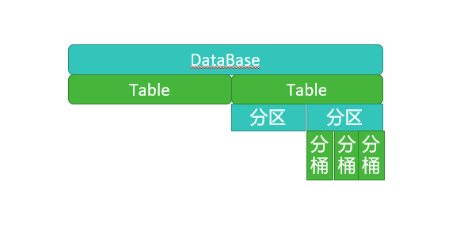

# 4. HQL DDL命令

> 参考：<https://cwiki.apache.org/confluence/display/Hive/LanguageManual+DDL>

DDL(data definition language): 主要的命令有 `CREATE`、`ALTER`、`DROP` 等。

DDL 主要是用在定义、修改数据库对象的结构或数据类型。



## 4.1 数据库操作

Hive 有一个默认的数据库 default，在操作 HQL 时，如果不明确的指定要使用哪个库，则使用默认数据库;

Hive 的数据库名、表名均不区分大小写; 名字不能使用数字开头; 不能使用关键字，尽量不使用特殊符号;

创建数据库语法

```sql
CREATE (DATABASE|SCHEMA) [IF NOT EXISTS] database_name
  [COMMENT database_comment]
  [LOCATION hdfs_path]
  [MANAGEDLOCATION hdfs_path]
  [WITH DBPROPERTIES (property_name=property_value, ...)];
```

```sql
-- 创建数据库，在HDFS上存储路径为 /user/hive/warehouse/*.db 
hive (default)> create database mydb;
hive (default)> dfs -ls /user/hive/warehouse;

-- 避免数据库已经存在时报错，使用 if not exists 进行判断【标准写法】 
hive (default)> create database if not exists mydb;

-- 创建数据库。添加备注，指定数据库在存放位置
hive (default)> create database if not exists mydb2 comment 'this is mydb2' location '/user/hive/mydb2.db';
```

查看数据库

```sql
-- 查看所有数据库 
show database;

-- 查看数据库信息
hive (default)> desc database mydb2;
OK
db_name comment location        owner_name      owner_type      parameters
mydb2   this is mydb2   hdfs://linux121:9000/user/hive/mydb2.db root    USER    
Time taken: 0.03 seconds, Fetched: 1 row(s)

desc database extended mydb2; 
describe database extended mydb2;
```

使用数据库

```sql
use mydb;
```

删除数据库

```sql
-- 删除一个空数据库
drop database databasename;
-- 如果数据库不为空，使用 cascade 强制删除 
drop database databasename cascade;
```

## 4.2 建表语法

```sql
create [external] table [IF NOT EXISTS] table_name
    [(colName colType [comment 'comment'], ...)]
    [comment table_comment]
    [partition by (colName colType [comment col_comment], ...)]
    [clustered BY (colName, colName, ...)
    [sorted by (col_name [ASC|DESC], ...)] into num_buckets buckets]
    [row format row_format]
    [stored as file_format]
    [LOCATION hdfs_path]
    [TBLPROPERTIES (property_name=property_value, ...)]
    [AS select_statement];

CREATE [TEMPORARY] [EXTERNAL] TABLE [IF NOT EXISTS]
    [db_name.]table_name
    LIKE existing_table_or_view_name
    [LOCATION hdfs_path];
```

1. `CREATE TABLE`

按给定名称创建表，如果表已经存在则抛出异常。可使用 `IF NOT EXISTS` 规避。

2. `EXTERNAL` 关键字

添加关键字，表示创建外部表，否则创建的是内部表(管理表)。

区别：删除内部表时，数据和表的定义同时被删除; 删除外部表时，仅仅删除了表的定义，数据保留; 在生产环境中，多使用外部表;

3. `comment` 表的注释
4. `partition by` 对表中数据进行分区，指定表的分区字段
5. `clustered by` 创建分桶表，指定分桶字段
6. `sorted by` 对桶中的一个或多个列排序，较少使用
7. 存储子句

```sql
ROW FORMAT DELIMITED
    [FIELDS TERMINATED BY char]
    [COLLECTION ITEMS TERMINATED BY char]
    [MAP KEYS TERMINATED BY char]
    [LINES TERMINATED BY char] | SERDE serde_name
    [WITH SERDEPROPERTIES (property_name=property_value, property_name=property_value, ...)]
```

建表时可指定 SERDE。如果没有指定 `ROW FORMAT` 或者 `ROW FORMAT DELIMITED`，将会使用默认的 SERDE。

建表时还需要为表指定列，在指定列的同时也会指定自定义的 SERDE。Hive通过 SerDe 确定表的具体的列的数据。

> SERDE 是 Serialize/Deserialize 的简称， hive使用Serde进行行对象的序列与反序列化。

8. stored as SEQUENCEFILE|TEXTFILE|RCFILE

如果文件数据是纯文本，可以使用 `STORED AS TEXTFILE`(默认);如果数据需要压缩，使用 `STORED AS SEQUENCEFILE`(二进制序列文件)。

9. `LOCATION` 表在HDFS上的存放位置
10. `TBLPROPERTIES` 定义表的属性
11. `AS` 后面可以接查询语句，表示根据后面的查询结果创建表
12. `LIKE` 后面接表名，允许用户复制现有的表结构，但是不复制数据

> 既要表的结构又要表的数据使用 `AS` 关键字，只要原表的结构使用 `LIKE` 关键字。

## 4.3 内部表&外部表

在创建表的时候，可指定表的类型。表有两种类型，分别是内部表(管理表)、外部表。

- 默认情况下，创建内部表。如果要创建外部表，需要使用关键字 `external`
- 在删除内部表时，表的定义(元数据)和数据同时被删除
- 在删除外部表时，仅删除表的定义，数据被保留
- 在生产环境中，多使用外部表

### 4.3.1 内部表

t1.dat 文件内容

```text
2;zhangsan;book,TV,code;beijing:chaoyang,shagnhai:pudong
3;lishi;book,code;nanjing:jiangning,taiwan:taibei
4;wangwu;music,book;heilongjiang:haerbin
```

创建表 SQL

```sql
-- 创建内部表
create table t1(
    id int,
    name string,
    hobby array<string>,
    addr map<string, string>
) 
row format delimited
fields terminated by ";"
collection items terminated by ","
map keys terminated by ":";
```

```shell
# -----------------------
# -- 使用测试
# -----------------------

# 显示表的定义，显示的信息较少
hive (mydb)> desc t1;
OK
col_name        data_type       comment
id                      int                                         
name                    string                                      
hobby                   array<string>                               
addr                    map<string,string>                          
Time taken: 0.143 seconds, Fetched: 4 row(s)


# 显示表的定义，显示的信息多，格式友好
desc formatted t1;

# 加载数据
hive (mydb)> load data local inpath '/home/hadoop/data/t1.dat' into table t1;
Loading data to table mydb.t1
OK
Time taken: 1.059 seconds


# 查询数据
hive (mydb)> select * from t1;
OK
t1.id   t1.name t1.hobby        t1.addr
2       zhangsan        ["book","TV","code"]    {"beijing":"chaoyang","shagnhai":"pudong"}
3       lishi   ["book","code"] {"nanjing":"jiangning","taiwan":"taibei"}
4       wangwu  ["music","book"]        {"heilongjiang":"haerbin"}
Time taken: 2.74 seconds, Fetched: 3 row(s)


# 查询数据文件
hive (mydb)> dfs -ls /user/hive/warehouse/mydb.db/t1;
Found 1 items
-rwxrwxrwx   3 root supergroup        148 2022-02-16 10:27 /user/hive/warehouse/mydb.db/t1/t1.dat

# 还可以使用 cat 命令查看数据文件
hive (mydb)> dfs -cat /user/hive/warehouse/mydb.db/t1/t1.dat;

# 删除表。表和数据同时被删除
hive (mydb)> drop table t1;
OK
Time taken: 0.31 seconds

# 再次查询数据文件，已经被删除
hive (mydb)> show tables;
OK
tab_name
Time taken: 0.044 seconds

hive (mydb)> dfs -ls /user/hive/warehouse/mydb.db;
```

### 4.3.2 外部表

```sql
-- 创建外部表
create external table t2(
    id int,
    name string,
    hobby array<string>,
    addr  map<string, string>
)
row format delimited
fields terminated by ";"
collection items terminated by ","
map keys terminated by ":";

----------------------
-- 使用测试
----------------------

-- 显示表的定义
desc formatted t2;

-- 加载数据
load data local inpath '/home/hadoop/data/t1.dat' into table t2;

-- 查询数据
select * from t2;

-- 删除表。表删除了，目录仍然存在
drop table t2;
```

```shell
# 再次查询数据文件，仍然存在
hive (mydb)> dfs -ls /user/hive/warehouse/mydb.db;
Found 1 items
drwxrwxrwx   - root supergroup          0 2022-02-16 10:34 /user/hive/warehouse/mydb.db/t2
hive (mydb)> dfs -ls /user/hive/warehouse/mydb.db/t2;
Found 1 items
-rwxrwxrwx   3 root supergroup        148 2022-02-16 10:34 /user/hive/warehouse/mydb.db/t2/t1.dat
```

### 4.3.3 内部表与外部表的转换

```sql
-- 创建内部表，加载数据，并检查数据文件和表的定义
create table t1(
    id int,
    name string,
    hobby array<string>,
    addr  map<string, string>
)
row format delimited
fields terminated by ";"
collection items terminated by ","
map keys terminated by ":";

load data local inpath '/home/hadoop/data/t1.dat' into table t1;

dfs -ls /user/hive/warehouse/mydb.db/t1;

desc formatted t1;

-- 内部表转外部表
alter table t1 set tblproperties('EXTERNAL'='TRUE');

-- 查询表信息，是否转换成功
desc formatted t1;

-- 外部表转内部表。(EXTERNAL 大写，false 不区分大小)
alter table t1 set tblproperties('EXTERNAL'='FALSE');

-- 查询表信息，是否转换成功
desc formatted t1;
```

**小结**

建表时

- 如果不指定 `external` 关键字，创建的是内部表;
- 指定 `external` 关键字，创建的是外部表;

删表时

- 删除外部表时，仅删除表的定义，表的数据不受影响
- 删除内部表时，表的数据和定义同时被删除

外部表的使用场景

- 想保留数据时使用。生产多用外部表。

## 4.4 分区表

Hive在执行查询时，一般会扫描整个表的数据。由于表的数据量大，全表扫描消耗时间长、效率低。

而有时候，查询只需要扫描表中的一部分数据即可，Hive 引入了分区表的概念，将表的数据存储在不同的子目录中，每一个子目录对应一个分区。
只查询部分分区数据时，可避免全表扫描，提高查询效率。

> 在实际中，通常根据时间、地区等信息进行分区。

分区表创建与数据加载

```sql
-- 创建表
create table if not exists t3(
    id      int
   ,name    string
   ,hobby   array<string>
   ,addr    map<String,string>
)
partitioned by (dt string)
row format delimited
fields terminated by ';'
collection items terminated by ','
map keys terminated by ':';

-- 加载数据。
load data local inpath "/home/hadoop/data/t1.dat" into table t3 partition(dt="2022-02-01");
load data local inpath "/home/hadoop/data/t1.dat" into table t3 partition(dt="2022-02-02");
```

> 备注: 分区字段不是表中已经存在的数据，可以将分区字段看成伪列。

```shell
hive (mydb)> dfs -ls /user/hive/warehouse/mydb.db/t3;
Found 2 items
drwxrwxrwx   - root supergroup          0 2022-02-16 14:01 /user/hive/warehouse/mydb.db/t3/dt=2022-02-01
drwxrwxrwx   - root supergroup          0 2022-02-16 14:01 /user/hive/warehouse/mydb.db/t3/dt=2022-02-02
# 在此处记录了分区信息
```

查看分区

```shell
hive (mydb)> show partitions t3;
OK
partition
dt=2022-02-01
dt=2022-02-02
Time taken: 0.171 seconds, Fetched: 2 row(s)
```

新增分区并设置数据

```sql
-- 增加一个分区，不加载数据
alter table t3 add partition(dt='2022-02-03');

-- 增加多个分区，不加载数据
alter table t3 add partition(dt='2022-02-04') partition(dt='2022-02-05');
```

```shell
# 增加多个分区。准备数据
hive (mydb)> dfs -cp /user/hive/warehouse/mydb.db/t3/dt=2022-02-01 /user/hive/warehouse/mydb.db/t3/dt=2022-02-06;
hive (mydb)> dfs -cp /user/hive/warehouse/mydb.db/t3/dt=2022-02-01 /user/hive/warehouse/mydb.db/t3/dt=2022-02-07;

# 增加多个分区。加载数据
hive (mydb)> alter table t3 add partition(dt='2022-02-06') location '/user/hive/warehouse/mydb.db/t3/dt=2022-02-06'
    partition(dt='2022-02-07') location'/user/hive/warehouse/mydb.db/t3/dt=2022-02-07';

# 查询数据
hive (mydb)> select * from t3;
```

修改分区的hdfs路径

```sql
alter table t3 partition(dt='2022-02-06') set location '/user/hive/warehouse/t3/dt=2022-02-07';
```

删除分区

```sql
-- 可以删除一个或多个分区，用逗号隔开
alter table t3 drop partition(dt='2022-02-06'), partition(dt='2022-02-07');
```

## 4.5 分桶表

当单个的分区或者表的数据量过大，分区不能更细粒度的划分数据，就需要使用分桶技术将数据划分成更细的粒度。

将数据按照指定的字段进行分成多个桶中去，即将数据按照字段进行划分，数据按照字段划分到多个文件当中去。

分桶的原理:

- MR中: `key.hashCode` % `reduceTask`
- Hive中: `分桶字段.hashCode` % `分桶个数`

```text
-- 测试数据(注意垃圾Windows系统与Linux系统的分隔符不一致)
1       java    90
2       c       78
3       python  91
4       hadoop  80
```

```sql
-- 创建分桶表
create table course
(
    id    int,
    name  string,
    score int
)
clustered by (id) into 3 buckets
row format delimited fields terminated by "\t";

-- 创建普通表
create table course_common(
    id int,
    name string,
    score int
)
row format delimited fields terminated by "\t";

-- 普通表加载数据
load data local inpath '/home/hadoop/data/course.dat' into table course_common;

-- 通过 insert ... select ... 给桶表加载数据
insert into table course select * from course_common;

```

观察分桶数据。数据按照: `(分区字段.hashCode) % (分桶数)` 进行分区

```shell
hive (mydb)> dfs -ls /user/hive/warehouse/mydb.db/course;
Found 3 items
-rwxrwxrwx   3 root supergroup         12 2022-02-16 14:52 /user/hive/warehouse/mydb.db/course/000000_0
-rwxrwxrwx   3 root supergroup         22 2022-02-16 14:52 /user/hive/warehouse/mydb.db/course/000001_0
-rwxrwxrwx   3 root supergroup          7 2022-02-16 14:52 /user/hive/warehouse/mydb.db/course/000002_0

hive (mydb)> dfs -cat /user/hive/warehouse/mydb.db/course/000000_0;
3       python  91

hive (mydb)> dfs -cat /user/hive/warehouse/mydb.db/course/000001_0;
4       hadoop  80
1       java    90

hive (mydb)> dfs -cat /user/hive/warehouse/mydb.db/course/000002_0;
2       c       78
```

备注:

- 分桶规则: `分桶字段.hashCode` % `分桶数`
- 分桶表加载数据时，使用 `insert... select ...` 方式进行

> 网上有资料说要使用分区表需要设置 `hive.enforce.bucketing=true`，那是Hive 1.x 以前的版本; Hive 2.x 中，删除了该参数，始终可以分桶;

## 4.6 修改表 & 删除表

```sql
-- 修改表名。rename
alter table course_common rename to course_common1;
-- 修改列名。change column 
alter table course_common1 change column id cid int;
-- 修改字段类型。change column
alter table course_common1 change column cid cid string;

-- The following columns have types incompatible with the existing columns in their respective positions
-- 修改字段数据类型时，要满足数据类型转换的要求。如int可以转为string，但是string不能转为int

-- 增加字段。add columns
alter table course_common1 add columns (common string);

-- 删除字段:replace columns
-- 这里仅仅只是在元数据中删除了字段，并没有改动hdfs上的数据文件
alter table course_common1 replace columns(id string, cname string, score int);

-- 删除表
drop table course_common1;
```

HQL DDL命令小结:

- 主要对象: 数据库、表
- 表的分类:
    - 内部表。删除表时，同时删除元数据和表数据
    - 外部表。删除表时，仅删除元数据，保留表中数据;生产环境多使用外部表
    - 分区表。按照分区字段将表中的数据放置在不同的目录中，提高SQL查询的性能
    - 分桶表。按照分桶字段，将表中数据分开。 分桶规则：`分桶字段.hashCode % 分桶数`
- 主要命令: `create`、`alter`、`drop`
