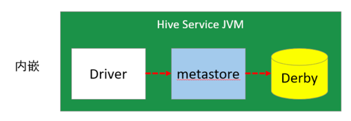
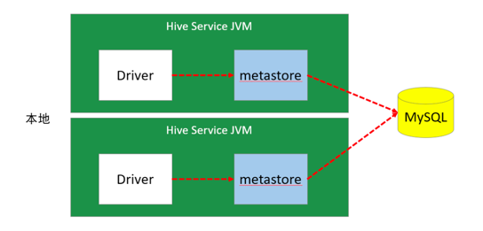
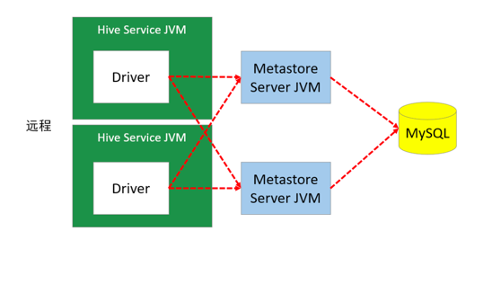
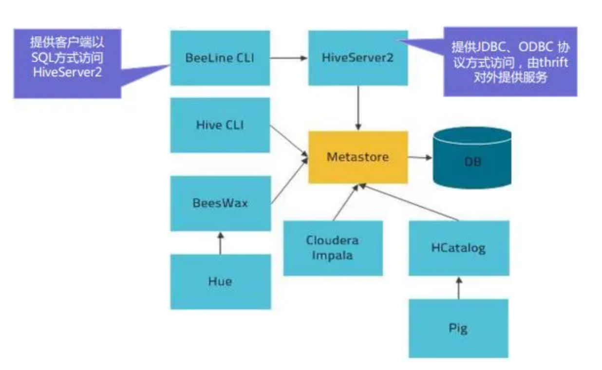
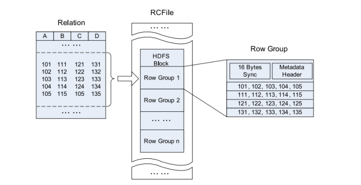
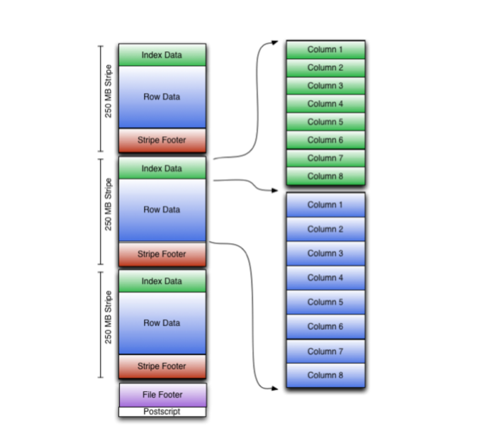
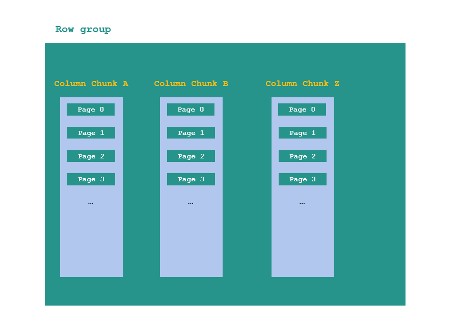

# Hive 进阶

## 第九部分 元数据管理与存储

### 第 1 节 Metastore

在Hive的具体使用中，首先面临的问题便是如何定义表结构信息，跟结构化的数据映射成功。

所谓的映射指的是一种对应关系。在Hive中需要描述清楚表跟文件之间的映射关系、列和字段之间的关系等等信息。这些描述映射关系的数据的称之为Hive的元数据。
该数据十分重要，因为只有通过查询它才可以确定用户编写sql和最终操作文件之间的关系。

*Metadata* 即元数据。元数据包含用Hive创建的database、table、表的字段等元信息。元数据存储在关系型数据库中。如hive内置的Derby、第三方如MySQL等。

*Metastore* 即元数据服务，是Hive用来*管理库表元数据的一个服务*。有了它，上层的服务不用再跟裸的文件数据打交道，而是可以基于结构化的库表信息构建计算框架。

通过metastore服务将Hive的元数据暴露出去，而不是需要通过对Hive元数据库mysql的访问才能拿到Hive的元数据信息; 

metastore服务实际上就是一种thrift服务，通过它用户可以获取到Hive元数据，并且通过thrift获取元数据的方式，屏蔽了数据库访问需要驱动、url、用户名、密码等细节。

> Thrift 是一种跨语言的服务。

#### metastore三种配置方式 

##### 1.内嵌模式

> Hive 默认方式

内嵌模式使用的是内嵌的Derby数据库来存储元数据，也不需要额外起Metastore服务。

数据库和Metastore服务都嵌入在主Hive Server进程中。这个是默认的，配置简单，但是一次只能一个客户端连接，适用于用来实验，不适用于生产环境。



- 优点: 配置简单，解压hive安装包 `bin/hive` 启动即可使用; 
- 缺点: 不同路径启动hive，每一个hive拥有一套自己的元数据，无法共享。

##### 2.本地模式

本地模式采用外部数据库来存储元数据，目前支持的数据库有: MySQL、Postgres、Oracle、MS SQL Server。教学中实际采用的是MySQL。

本地模式不需要单独起metastore服务，用的是跟Hive在同一个进程里的 metastore 服务。也就是说当启动一个hive 服务时，其内部会启动一个metastore服务。

Hive根据 `hive.metastore.uris` 参数值来判断，如果为空，则为本地模式。



- 缺点: 每启动一次hive服务，都内置启动了一个metastore; 在 `hive-site.xml` 中暴露数据库的连接信息;
- 优点: 配置较简单，本地模式下hive的配置中指定mysql的相关信息即可。 

##### 3.远程模式

远程模式下，需要单独起metastore服务，然后每个客户端都在配置文件里配置连接到该metastore服务。

远程模式的metastore服务和hive运行在不同的进程里。

> 在生产环境中，建议用远程模式来配置 Hive Metastore。



在这种模式下，其他依赖Hive的软件都可以通过Metastore访问Hive。

此时需要配置 `hive.metastore.uris` 参数来指定 metastore 服务运行的机器ip和端口，并且需要单独手动启动metastore服务。

metastore服务可以配置多个节点上，避免单节点故障导致整个集群的hive client不可用。同时hive client配置多个metastore地址，会自动选择可用节点。

#### metastore内嵌模式配置

```shell
# 在 linux121 测试

# 1、下载软件解压缩 
# 此处直接从 123 节点拷贝
# 先进入 linux123
cd /opt/zmn/software/
scp apache-hive-2.3.7-bin.tar.gz linux121:$PWD
# 回到 linux121
tar zxvf apache-hive-2.3.7-bin.tar.gz -C ../servers/
cd ../servers/
mv apache-hive-2.3.7-bin/ hive-2.3.7/

# 2、设置环境变量，并使之生效
vi /etc/profile
# Hive_HOME
export HIVE_HOME=/opt/zmn/servers/hive-2.3.7
export PATH=$PATH:$HIVE_HOME/bin

source /etc/profile
# 3、初始化数据库
schematool -dbType derby -initSchema
# 4、进入hive命令行
hive
# 5、再打开一个hive命令行，发现可以进入命令行，但是执行命令会卡住
FAILED: SemanticException org.apache.hadoop.hive.ql.metadata.HiveException: java.lang.RuntimeException: Unable to instantiate org.apache.hadoop.hive.ql.metadata.SessionHiveMetaStoreClient
```

#### metastore远程模式配置 

配置规划:

| 节点       | metastore | client |
|----------|-----------|--------|
| linux121 | √         |        |
| linux122 |           | √      |
| linux123 | √         |        |


配置步骤:

1. 将 linux123 的 hive 安装文件拷贝到 linux121、linux122 

```shell
# linux123
cd /opt/zmn/servers
scp -r hive-2.3.7/ linux121:$PWD
scp -r hive-2.3.7/ linux122:$PWD

# 拷贝 profile
cd /etc/
scp profile linux121:$PWD
scp profile linux122:$PWD
# 让各个节点生效

yum install -y lsof
```

2. 在 linux121、linux123上分别启动 metastore 服务

```shell
# 启动 metastore 服务
nohup hive --service metastore &
# 查询9083端口(metastore服务占用的端口) 
lsof -i:9083
# 安装lsof
yum install lsof
```

3. 修改 linux122 上 `hive-site.xml`。删除配置文件中:MySQL的配置、连接数据库的用户名、口令等信息;增加连接metastore的配置:

```xml
<!-- hive metastore 服务地址 --> 
<property>
    <name>hive.metastore.uris</name>
    <value>thrift://linux121:9083,thrift://linux123:9083</value>
</property>
```

4. 启动hive。此时client端无需实例化hive的metastore，启动速度会加快。

```shell
# 分别在linux121、linux121上执行以下命令，查看连接情况 
lsof -i:9083
```

5. 高可用测试。

关闭已连接的metastore服务，发现hive连到另一个节点的服务上，仍然能够正常使用。

### 第 2 节 HiveServer2

HiveServer2是一个服务端接口，使远程客户端可以执行对Hive的查询并返回结果。

> MetaStore 是访问元数据的服务; HiveServer2 是执行 Hive 查询语句返回结果的服务。

目前基于Thrift RPC的实现是HiveServer的改进版本，并支持多客户端并发和身份验证，启动hiveServer2服务后，就可以使用jdbc、odbc、thrift 的方式连接。

> Thrift是一种接口描述语言和二进制通讯协议，它被用来定义和创建跨语言的服务。
> 它被当作一个远程过程调用（RPC）框架来使用，是由Facebook为"大规模跨语言服务开发"而开发的。



HiveServer2（HS2）是一种允许客户端对Hive执行查询的服务。

HiveServer2是HiveServer1的后续版本。HS2支持多客户端并发和身份验证，旨在为JDBC、ODBC等开放API客户端提供更好的支持。

HS2包括基于Thrift的Hive服务（TCP或HTTP）和用于Web UI 的Jetty Web服务器。


#### HiveServer2作用

- 为Hive提供了一种允许客户端远程访问的服务
- 基于Thrift协议，支持跨平台，跨编程语言对Hive访问
- 允许远程访问Hive

#### HiveServer2配置

配置规划

| 节点       | HiveServer2 | client(beeline) |
|----------|-------------|-----------------|
| linux121 |             |                 |
| linux122 |             | √               |
| linux123 | √           |                 |

配置步骤

1. 修改集群上的 `etc/hadoop/core-site.xml`，增加以下内容

```shell
# 先停止 HDFS
stop-dfs.sh
```

```xml
<configuration>
    <!-- HiveServer2 连不上10000；hadoop为安装用户 -->
    <!-- root用户可以代理所有主机上的所有用户 -->
    <property>
        <name>hadoop.proxyuser.root.hosts</name>
        <value>*</value>
    </property>
    <property>
        <name>hadoop.proxyuser.root.groups</name>
        <value>*</value>
    </property>
    <property>
        <name>hadoop.proxyuser.hadoop.hosts</name>
        <value>*</value>
    </property>
    <property>
        <name>hadoop.proxyuser.hadoop.groups</name>
        <value>*</value>
    </property>
</configuration>
```

2. 修改集群上的 `etc/hadoop/hdfs-site.xml` 增加以下内容

```xml
<!-- HiveServer2 连不上10000；启用 webhdfs 服务 -->
<property>
    <name>dfs.webhdfs.enabled</name>
    <value>true</value>
</property>
```

```shell
# 将前面修改的两个文件发送到整个集群 (linux121)
scp hdfs-site.xml linux122:$PWD
scp hdfs-site.xml linux123:$PWD

scp core-site.xml linux122:$PWD
scp core-site.xml linux123:$PWD

# 重启 HDFS
start-dfs.sh
```

3. 启动linux123上的 HiveServer2 服务

```shell
# 启动 hiveserver2 服务
nohup hiveserver2 &

# 检查 hiveserver2 端口
lsof -i:10000

# 从2.0开始，HiveServer2提供了WebUI
# 还可以使用浏览器检查hiveserver2的启动情况。http://linux123:10002/
```

4. 启动linux122节点上的 Beeline

> Beeline 是从 Hive 0.11 版本引入的，是 Hive 新的命令行客户端工具。
> Hive客户端工具后续将使用Beeline替代Hive命令行工具 ，并且后续版本也会废弃掉 Hive 客户端工具。

```shell
# 进入 beeline 命令行
cd $HIVE_HOME/bin
./beeline

# 连接 HiveServer2
beeline> !connect jdbc:hive2://linux123:10000
Connecting to jdbc:hive2://linux123:10000
Enter username for jdbc:hive2://linux123:10000: 
Enter password for jdbc:hive2://linux123:10000: 
Connected to: Apache Hive (version 2.3.7)
Driver: Hive JDBC (version 2.3.7)
Transaction isolation: TRANSACTION_REPEATABLE_READ

0: jdbc:hive2://linux123:10000> show databases;
+----------------+
| database_name  |
+----------------+
| default        |
| mydb           |
| test1          |
+----------------+
3 rows selected (2.461 seconds)

0: jdbc:hive2://linux123:10000> use mydb;

0: jdbc:hive2://linux123:10000> show tables;

0: jdbc:hive2://linux123:10000> select * from emp;

0: jdbc:hive2://linux123:10000> create table tabtest1 (c1 int, c2 string);

# BeeLine 直接连接 mysql
0: jdbc:hive2://linux123:10000> !connect jdbc:mysql://linux123:3306
Connecting to jdbc:mysql://linux123:3306
Enter username for jdbc:mysql://linux123:3306: hive
Enter password for jdbc:mysql://linux123:3306: ********

# beeline 帮助信息
!help
# 退出 beeline 命令行
!quit
```

### 第 3 节 HCatalog

HCatalog 提供了一个*统一的元数据服务*，允许不同的工具如 Pig、MapReduce 等通过 HCatalog 直接访问存储在 HDFS 上的底层文件。

HCatalog 是用来访问 Metastore 的 Hive 子项目，它的存在给了整个Hadoop生态环境一个统一的定义。

HCatalog 使用了 Hive 的元数据存储，这样就使得像 MapReduce 这样的第三方应用可以直接从 Hive 的数据仓库中读写数据。
同时，HCatalog 还支持用户在 MapReduce 程序中只读取需要的表分区和字段，而不需要读取整个表，即提供一种逻辑上的视图来读取数据，而不仅仅是从物理文件的维度。

HCatalog 提供了一个称为 `hcat` 的命令行工具。这个工具和 Hive 的命令行工具类似，两者最大的不同就是 `hcat` 只接受不会产生 MapReduce 任务的命令(主要是DDL命令)。

```shell
# 进入 hcat 所在目录。$HIVE_HOME/hcatalog/bin
cd $HIVE_HOME/hcatalog/bin

# 执行命令，创建表
./hcat -e "create table default.test1(id string, name string, age int)"

# 长命令可写入文件，使用 -f 选项执行
./hcat -f createtable.txt

# 查看元数据
./hcat -e "use mydb; show tables"

# 查看表结构
./hcat -e "desc mydb.emp"

# 删除表
./hcat -e "drop table default.test1"
```

### 第 4 节 数据存储格式

Hive支持的存储数的格式主要有：`TEXTFILE`（默认格式）、`SEQUENCEFILE`、 `RCFILE`、`ORCFILE`、`PARQUET`。

- `TEXTFILE` 为默认格式，建表时没有指定文件格式，则使用 `TEXTFILE`，导入数据时会直接把数据文件拷贝到 HDFS 上不进行处理；
- `SEQUENCEFILE`、 `RCFILE`、`ORCFILE` 格式的表不能直接从本地文件导入数据，数据要先导入到 `TEXTFILE` 格式的表中， 然后再从表中用 INSERT 导入 `SEQUENCEFILE`、 `RCFILE`、`ORCFILE` 表中。

#### 行存储与列存储

行式存储下一张表的数据都是放在一起的，列式存储下数据被分开保存了。

##### 行式存储

- 优点：数据被保存在一起，insert和update更加容易
- 缺点：选择（selection）时即使只涉及某几列，所有数据也都会被读取

##### 列式存储

- 优点：查询时只有涉及到的列会被读取，效率高
- 缺点：选中的列要重新组装，insert/update比较麻烦

> `TEXTFILE`、`SEQUENCEFILE`的存储格式是基于行存储的；`ORC`和`PARQUET`是基于列式存储的。

#### TextFile

Hive默认的数据存储格式，数据不做压缩，磁盘开销大，数据解析开销大。

可结合 Gzip、Bzip2 使用(系统自动检查，执行查询时自动解压)，但使用这种方式，Hive 不会对数据进行切分，从而无法对数据进行并行操作。

```sql
-- 在 beeline 客户端执行(linux122)
create table if not exists uaction_text
(
    userid       string,
    itemid       string,
    behaviortype int,
    geohash      string,
    itemcategory string,
    time         string
) row format delimited fields terminated by ','
stored as textfile;

load data local inpath '/home/hadoop/data/uaction.dat' overwrite into table uaction_text;
```

> 注意：文件要放置在 HiveServer2 所在节点上。(linux123)

#### SEQUENCEFILE

SequenceFile是Hadoop API提供的一种二进制文件格式，其具有使用方便、可分割、可压缩的特点。

> 行存储、二进制、可压缩

SequenceFile支持三种压缩选择：none，record，block。

> Record压缩率低，一般建议使用BLOCK压缩。

#### RCFile

RCFile全称Record Columnar File，列式记录文件，是一种类似于SequenceFile的键值对数据文件。RCFile结合列存储和行存储的优缺点，是基于行列混合存储的RCFile。

RCFile遵循的"*先水平划分，再垂直划分*"的设计理念。先将数据按行水平划分为行组，这样一行的数据就可以保证存储在同一个集群节点；然后再对行进行垂直划分。



- 一张表可以包含多个HDFS block
- 每个block中，以行组(row group)为单位存储其中的数据
- 行组(row group)又由三个部分组成
  - 用于分隔两个row group的16字节的标志区
  - 存储row group元数据信息的header
  - 实际数据区，表中的实际数据以列为单位进行存储

> 使用已经较少了，更多的使用升级版：ORCFile

#### ORCFile

ORC File，它的全名是Optimized Row Columnar (ORC) file，其实就是对RCFile做了一些优化，在 Hive 0.11 中引入的存储格式。
这种文件格式可以提供一种高效的方法来存储Hive数据。它的设计目标是来克服Hive其他格式的缺陷。运用ORC File可以提高Hive的读、写以及处理数据的性能。

ORC文件结构由三部分组成：

1. 文件脚注(file footer 图中紫色部分)

包含了文件中 stripe 的列表，每个stripe行数，以及每个列的数据类型。还包括每个列的最大、最小值、行计数、求和等信息。

2. postscript (图中最下白色部分)

压缩参数和压缩大小相关信息

3. 条带(stripe)

ORC文件存储数据的地方。在默认情况下，一个stripe的大小为250MB

Stripe 由三部分组成：

- Index Data：一个轻量级的index，默认是每隔1W行做一个索引。包括该条带的一些统计信息，以及数据在stripe中的位置索引信息
- Rows Data：存放实际的数据。先取部分行，然后对这些行按列进行存储。对每个列进行了编码，分成多个stream来存储
- Stripe Footer：存放stripe的元数据信息



##### ORCFile 的索引

ORC在每个文件中提供了3个级别的索引：文件级、条带级、行组级。

借助ORC提供的索引信息能加快数据查找和读取效率，规避大部分不满足条件的查询条件的文件和数据块。

使用ORC可以避免磁盘和网络IO的浪费，提升程序效率，提升整个集群的工作负载。

事务表必须使用 ORC 格式。

```sql
create table if not exists uaction_orc
(
  userid       string,
  itemid       string,
  behaviortype int,
  geohash      string,
  itemcategory string,
  time         string
) stored as orc;

insert overwrite table uaction_orc select * from uaction_text;
```

> 如果报错: `Permission denied: user=anonymous, access=EXECUTE, inode="/tmp/hadoop-yarn":root:supergroup:drwx------`
> 
> 执行命令：`hadoop fs -chmod -R 777 /tmp/hadoop-yarn`

#### Parquet

Apache Parquet是Hadoop生态圈中一种新型列式存储格式，它可以兼容Hadoop生态圈中大多数计算框架(Mapreduce、Spark等)，被多种查询引擎支持（Hive、Impala、Drill等），与语言和平台无关。

Parquet 文件是以二进制方式存储的，不能直接读取的，文件中包括实际数据和元数据，Parquet格式文件是自解析的。

一个文件由多个行组(row group)和元数据(footer)构成。



Row group

- 写入数据时的最大缓存单元
- MR任务的最小并发单元
- 一般大小在50MB-1GB之间

Column chunk

- 存储当前Row group内的某一列数据
- 最小的IO并发单元

Page

- 压缩、读数据的最小单元
- 获得单条数据时最小的读取数据单元
- 大小一般在8KB-1MB之间，越大压缩效率越高

Footer

- 数据Schema信息
- 每个Row group的元信息：偏移量、大小
- 每个Column chunk的元信息：每个列的编码格式、首页偏移量、首索引页偏移量、个数、大小等信息

```sql
create table if not exists uaction_parquet
(
  userid       string,
  itemid       string,
  behaviortype int,
  geohash      string,
  itemcategory string,
  time         string
) stored as parquet;

insert overwrite table uaction_parquet select * from uaction_text;
```

#### 文件存储格式对比测试

1. 给 linux123 分配合适的资源。2core；2048M内存
2. 适当减小文件的数据量（现有数据约800W，根据自己的实际选择处理100-300W条数据均可）

```shell
# 检查文件行数
wc -l uaction.dat

# 取部分数据
# 前10w
head -n 100000 uaction.dat > uaction1.dat
# 后 10w
tail -n 100000 uaction.dat > uaction2.dat
# 随便取一个就可以了
```

文件压缩比

```shell
hdfs dfs -ls /user/hive/warehouse/mydb.db/ua*;

# 数据行数10w
678551  /user/hive/warehouse/mydb.db/uaction_orc/000000_0
1148165 /user/hive/warehouse/mydb.db/uaction_parquet/000000_0
4511665 /user/hive/warehouse/mydb.db/uaction_text/uaction1.dat
```

> 文件压缩性能：ORC > Parquet > text 执行查询

```sql
SELECT COUNT(*) FROM uaction_text;
select count(*) from uaction_orc;
SELECT COUNT(*) FROM uaction_parquet;

# 数据10w行
# text : 1.421 seconds
# orc: 0.174 seconds
# parquet : 0.18 seconds
```

> 查询性能： orc 与 parquet类似 > txt

在生产环境中，Hive表的数据格式使用最多的有三种：TextFile、ORCFile、Parquet。

- TextFile 文件更多的是作为跳板来使用(即方便将数据转为其他格式)
- 有update、delete和事务性操作的需求，通常选择ORCFile
- 没有事务性要求，希望支持Impala、Spark，建议选择Parquet

## 第十部分 Hive调优策略

Hive作为大数据领域常用的数据仓库组件，在设计和开发阶段需要注意效率。

影响Hive效率的不仅仅是数据量过大；数据倾斜、数据冗余、job或I/O过多、MapReduce分配不合理等因素都对Hive的效率有影响。

对Hive的调优既包含对HiveQL语句本身的优化，也包含Hive配置项和MR方面的调整。

从以下三个方面展开：

- 架构优化
- 参数优化
- SQL优化


