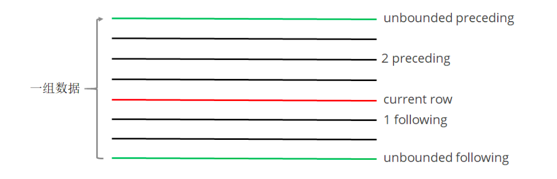

## 第六部分 HQL DQL命令【重点】

> DQL (Data Query Language) 数据查询语言

select语法:

```sql
SELECT [ALL | DISTINCT] select_expr, select_expr, ...
FROM table_reference
[WHERE where_condition]
[GROUP BY col_list]
[ORDER BY col_list]
[CLUSTER BY col_list | [DISTRIBUTE BY col_list] [SORT BY col_list]]
[LIMIT [offset,] rows]
```

SQL语句书写注意事项:

- SQL语句对大小写不敏感
- SQL语句可以写一行(简单SQL)也可以写多行(复杂SQL)
- 关键字不能缩写，也不能分行
- 各子句一般要分行
- 使用缩进格式，提高SQL语句的可读性(重要)

创建表，加载数据

测试数据 `/home/hadoop/data/emp.dat`

```text
7369,SMITH,CLERK,7902,2010-12-17,800,,20
7499,ALLEN,SALESMAN,7698,2011-02-20,1600,300,30
7521,WARD,SALESMAN,7698,2011-02-22,1250,500,30
7566,JONES,MANAGER,7839,2011-04-02,2975,,20
7654,MARTIN,SALESMAN,7698,2011-09-28,1250,1400,30
7698,BLAKE,MANAGER,7839,2011-05-01,2850,,30
7782,CLARK,MANAGER,7839,2011-06-09,2450,,10
7788,SCOTT,ANALYST,7566,2017-07-13,3000,,20
7839,KING,PRESIDENT,,2011-11-07,5000,,10
7844,TURNER,SALESMAN,7698,2011-09-08,1500,0,30
7876,ADAMS,CLERK,7788,2017-07-13,1100,,20
7900,JAMES,CLERK,7698,2011-12-03,950,,30
7902,FORD,ANALYST,7566,2011-12-03,3000,,20
7934,MILLER,CLERK,7782,2012-01-23,1300,,10
```

```sql
-- 建表并加载数据
CREATE TABLE emp (
    empno int,
    ename string,
    job string,
    mgr int,
    hiredate DATE,
    sal int,
    comm int,
    deptno int
)row format delimited fields terminated by ",";

-- 加载数据
LOAD DATA LOCAL INPATH '/home/hadoop/data/emp.dat' INTO TABLE emp;
```

### 第 1 节 基本查询

```shell
# 省略from子句的查询
hive (mydb)> select 8*888;
OK
_c0
7104
Time taken: 0.132 seconds, Fetched: 1 row(s)

hive (mydb)> select current_date;
OK
_c0
2022-02-16
Time taken: 0.111 seconds, Fetched: 1 row(s)


# 使用列别名
hive (mydb)> select 8*888 product;
OK
product
7104
Time taken: 0.121 seconds, Fetched: 1 row(s)

hive (mydb)> select current_date as currdate;
OK
currdate
2022-02-16
Time taken: 0.1 seconds, Fetched: 1 row(s)
```

```sql
-- 全表查询
select * from emp;

-- 选择特定列查询
select ename, sal, comm from emp;

-- 使用函数
select count(*) from emp;
-- count(colname) 按字段进行count，不统计column为NULL的数据

select sum(sal) from emp;
select max(sal) from emp;
select min(sal) from emp;
select avg(sal) from emp;

-- 使用limit子句限制返回的行数
select * from emp limit 3;
```

### 第 2 节 where子句 

WHERE子句紧随FROM子句，使用WHERE子句，过滤不满足条件的数据;

*WHERE 子句中不能使用列的别名*

```sql
select * from emp where sal > 2000;
```

WHERE 子句中会涉及到较多的比较运算和逻辑运算;

#### 比较运算符

> 官方文档: https://cwiki.apache.org/confluence/display/Hive/LanguageManual+UDF

| 比较运算符                          | 描述                                                                                                                                   |
|--------------------------------|--------------------------------------------------------------------------------------------------------------------------------------|
| `=、==、<=>`                     | 等于                                                                                                                                   |
| `<>、!=`                        | 不等于                                                                                                                                  |
| `<、<=、 >、>=`                   | 大于等于、小于等于                                                                                                                            |
| `is [not] null`                | 如果A等于NULL，则返回TRUE，反之返回FALSE。使用NOT关键字结果相反。                                                                                            |
| `in (value1, value2, ... ...)` | 匹配列表中的值                                                                                                                              |
| `LIKE`                         | 简单正则表达式，也称通配符模式。'x%' 表示必须以字母 'x' 开 头;'%x'表示必须以字母'x'结尾;'%x%'表示包含有字母'x'，可以位于字符串任意位置。使用NOT关键字结果相反。<br/>% 代表匹配零个或多个字符(任意个字符);_ 代表匹配一个字符。 |
| `[NOT] BETWEEN ... AND ...`    | 范围的判断，使用NOT关键字结果相反。                                                                                                                  |
| `RLIKE、 REGEXP`                | 基于java的正则表达式，匹配返回TRUE，反之返回FALSE。匹配使用的是JDK中的正则表达式接口实现的，因为正则也依据其中的规则。例如，正则表达式必须和整个字符串A相匹配，而不是只需与其字符串匹配。                                |
    
> 备注: 通常情况下NULL参与运算，返回值为NULL; `NULL<=>NULL` 的结果为true

> 不能使用 `!= null`, 只能使用 `is null`

####逻辑运算符

就是我们所熟悉的: and、or、not

```sql
-- 比较运算符，null参与运算
select null=null;   -- NULL
select null==null;  -- NULL
select null<=>null; -- true 相当于 is null

-- 使用 is null 判空
select * from emp where comm is null;
-- 不能使用 `!= null`, 只能使用 `is null`

--使用in
select * from emp where deptno in (20, 30);

-- 使用 between ... and ...
select * from emp where sal between 1000 and 2000;

-- 使用 like
select ename, sal from emp where ename like '%L%';

-- 使用 rlike。正则表达式，名字以A或S开头
select ename, sal from emp where ename rlike '^(A|S).*';
```

### 第 3 节 group by子句

GROUP BY语句通常与聚组函数一起使用，按照一个或多个列对数据进行分组，对每个组进行聚合操作。

```sql
-- 计算emp表每个部门的平均工资
SELECT deptno, AVG(sal) FROM emp GROUP BY deptno;

-- 计算emp每个部门中每个岗位的最高薪水
SELECT deptno, job, MAX(sal) FROM emp GROUP BY deptno, job;
```

- WHERE 子句针对表中的数据发挥作用; *HAVING 针对查询结果(聚组以后的结果)发挥作用*
- WHERE 子句不能有分组函数; HAVING 子句可以有分组函数
- HAVING 只用于 GROUP BY 分组统计之后

```sql
-- 求每个部门的平均薪水大于2000的部门 
SELECT deptno, AVG(sal)
FROM emp
GROUP BY deptno
HAVING AVG(sal) > 2000;
```

### 第 4 节 表连接

Hive支持通常SQL的`JOIN`语句。默认情况下，*仅支持等值连接*，不支持非等值连接。

JOIN 语句中经常会使用表的别名。使用别名可以简化SQL语句的编写，使用表名前缀可以提高SQL的解析效率。 

连接查询操作分为两大类: 内连接和外连接，而外连接可进一步细分为三种类型:

1. 内连接: `[inner] join`
2. 外连接 (`outer join`)
   - 左外连接。 `left [outer] join`，左表的数据全部显示 
   - 右外连接。 `right [outer] join`，右表的数据全部显示 
   - 全外连接。 `full [outer] join`，两张表的数据都显示

> 个人觉得：左外连接可以理解成左边是主表，右边的表是用于完善左表的数据的补充。

#### 多表连接

连接 n 张表，至少需要 n-1 个连接条件。

例如: 连接四张表，至少需要三个连接条件。

多表连接查询，查询老师对应的课程，以及对应的分数，对应的学生:

```sql
SELECT *
FROM techer t 
    LEFT JOIN course c ON t.t_id = c.t_id
    LEFT JOIN score  s ON s.c_id = c.c_id
    LEFT JOIN student stu ON s.s_id = stu.s_id;
```

Hive总是按照从左到右的顺序执行，Hive会对每对 `JOIN` 连接对象启动一个 MapReduce 任务。

上面的例子中会首先启动一个 MapReduce job 对表 t 和表 c 进行连接操作; 然后再启动一个 MapReduce job 将第一个 MapReduce job 的输出和表 s 进行连接操作; 然后再继续直到全部操作;

#### 笛卡尔积

满足以下条件将会产生笛卡尔集:

- 没有连接条件
- 连接条件无效
- 所有表中的所有行互相连接

如果表A、B分别有M、N条数据，其笛卡尔积的结果将有 M*N 条数据; 默认情况下 Hive 不支持笛卡尔积运算;

```sql
SET hive.strict.checks.cartesian.product=false;

SELECT * FROM u1, u2;
```

### 第 5 节 排序子句【重点】

#### 全局排序(order by)

ORDER BY 子句出现在 SELECT 语句的结尾;

ORDER BY 子句对最终的结果进行排序; 

默认使用升序(ASC);可以使用DESC，跟在字段名之后表示降序; 

*ORDER BY 执行全局排序，只有一个 Reduce;*(因此如果数据量过大，就不适用)

```sql
-- 普通排序
SELECT * FROM emp ORDER BY deptno;

-- 按别名排序
SELECT empno, ename, job, mgr, sal + nvl(comm, 0) salcomm, deptno
FROM emp
ORDER BY salcomm DESC;

-- 多列排序
SELECT empno, ename, job, mgr, sal + nvl(comm, 0) salcomm, deptno
FROM emp
ORDER BY deptno, salcomm DESC;

-- 排序字段要出现在SELECT子句中。以下语句无法执行(因为SELECT子句中缺少deptno):
SELECT empno, ename, job, mgr, sal + nvl(comm, 0) salcomm
FROM emp
ORDER BY deptno, salcomm DESC;
-- FAILED: SemanticException [Error 10004]: Line 3:9 Invalid table alias or column reference 'deptno': (possible column names are: empno, ename, job, mgr, salcomm)
```

#### 每个MR内部排序(sort by)

对于大规模数据而言 ORDER BY 效率低; 

在很多业务场景，我们并不需要全局有序的数据，此时可以使用sort by;

sort by为每个reduce产生一个排序文件，在reduce内部进行排序，得到局部有序的结果;

```sql
-- 设置reduce个数
set mapreduce.job.reduces=2;
-- 按照工资降序查看员工信息
SELECT * FROM emp SORT BY sal DESC;
-- 将查询结果导入到文件中(按照工资降序)。生成两个输出文件，每个文件内部数据 按工资降序排列
INSERT overwrite local directory '/home/hadoop/output/sortsal' SELECT * FROM emp SORT BY sal DESC;
```

> ORDER BY 全局排序; SORT BY 在Reduce内部局部排序。

#### 分区排序(distribute by)

DISTRIBUTE BY 将特定的行发送到特定的reducer中，便于后继的聚合与排序操作; 

DISTRIBUTE BY 类似于MR中的分区操作，可以结合sort by操作，使分区数据有序; 

DISTRIBUTE BY 要写在 sort by 之前;

```sql
-- 启动2个reducer task;
-- 先按 deptno 分区，在分区内按 sal+comm 排序 
set mapreduce.job.reduces=2;
-- 将结果输出到文件，观察输出结果
insert overwrite local directory '/home/hadoop/output/distBy' 
SELECT empno, ename, job, deptno, sal + nvl(comm, 0) salcomm
FROM emp
DISTRIBUTE BY deptno
SORT BY salcomm desc;
-- 上例中，数据被分到了同一区，看不出分区的结果。
-- 因为10,20,30 这几个值 % 2(分区数) 都等于0，所以数据都进入了 0 号分区

-- 将数据分到3个区中，每个分区都有数据
set mapreduce.job.reduces=3;
insert overwrite local directory '/home/hadoop/output/distBy1'
SELECT empno, ename, job, deptno, sal + nvl(comm, 0) salcomm
FROM emp
DISTRIBUTE BY deptno
SORT BY salcomm DESC;
```

> DISTRIBUTE BY 相当于 MR 当中指定 Partitioner, SORT BY 相当于 MR 当中指定 GroupingComparator

#### Cluster By
 
当 `DISTRIBUTE BY` 与 `SORT BY` 是同一个字段时，可使用 CLUSTER BY 简化语法; 

> 也就是根据同一字段分区并排序，排序规则只能是升序。

限制：CLUSTER BY 只能是升序，不能指定排序规则;

> 个人实测：此处的升序也不是业务意义上的升序，而是 `字段值 % 分区数` 的值得升序。这可能也是为什么只能升序的原因吧。

```sql
-- 语法上是等价的
SELECT * FROM emp DISTRIBUTE BY deptno SORT BY deptno;
SELECT * FROM emp CLUSTER BY deptno;
```

**排序小结**

- ORDER BY 执行全局排序，效率低。*生产环境中慎用*
- SORT BY 使数据局部有序(在reduce内部有序)
- DISTRIBUTE BY 按照指定的条件将数据分组，常与 SORT BY 联用，使数据局部有序 
- CLUSTER BY 当 DISTRIBUTE BY 与 SORT BY 是同一个字段时，可使用 CLUSTER BY 简化语法

## 第七部分 函数

> Hive内置函数: <https://cwiki.apache.org/confluence/display/Hive/LanguageManual+UDF#LanguageManualUDF-Built-inFunctions>

### 第 1 节 系统内置函数

#### 查看系统函数

```sql
-- 查看系统自带函数 
show functions;

-- 显示自带函数的用法
desc function upper;
desc function extended upper;
```

#### 日期函数【重要】

```sql
-- 当前日期
select current_date;
select unix_timestamp();
-- unix_timestamp(void) is deprecated. Use current_timestamp instead.
-- 建议使用current_timestamp，有没有括号都可以 
select current_timestamp;

-- 时间戳转日期
select from_unixtime(1645067197);
select from_unixtime(1645067197, 'yyyyMMdd');
select from_unixtime(1645067197, 'yyyy-MM-dd HH:mm:ss');

-- 日期转时间戳
select unix_timestamp('2022-02-17 11:06:37');

-- 计算时间差
-- 149
select datediff('2020-04-18','2019-11-21');
-- -149
select datediff('2019-11-21', '2020-04-18');

-- 查询当月第几天
select dayofmonth(current_date);
-- 计算月末:
select last_day(current_date);
-- 当月第1天:
-- date_sub(start_date, num_days) - Returns the date that is num_days before start_date.
select date_sub(current_date, dayofmonth(current_date)-1);
-- 下个月第1天:
-- add_months(start_date, num_months) - Returns the date that is num_months after start_date.
select add_months(date_sub(current_date, dayofmonth(current_date)-1), 1);

-- 字符串转时间(字符串必须为:yyyy-MM-dd格式) 
select to_date('2020-01-01');
select to_date('2020-01-01 12:12:12');

-- 日期、时间戳、字符串类型格式化输出标准时间格式
select date_format(current_timestamp(), 'yyyy-MM-dd HH:mm:ss');
select date_format(current_date(), 'yyyyMMdd');
select date_format('2020-06-01', 'yyyy-MM-dd HH:mm:ss');

-- 计算emp表中，每个人的工龄
select *, round(datediff(current_date, hiredate)/365,1) workingyears from emp;
```

#### 字符串函数

```sql
-- 转小写。lower
select lower("HELLO WORLD");

-- 转大写。upper
select lower(ename), ename from emp;

-- 求字符串长度。length
select length(ename), ename from emp;

-- 字符串拼接。 concat 或 ||
select empno || " " ||ename idname from emp;
select concat(empno, " " ,ename) idname from emp;

-- 指定分隔符。concat_ws(separator, [string | array(string)]+)
SELECT concat_ws('.', 'www', array('zmn', 'com'));
select concat_ws(" ", ename, job) from emp;

-- 求子串。substr
SELECT substr('www.zmn.com', 5);
SELECT substr('www.zmn.com', -5);
SELECT substr('www.zmn.com', 5, 5);

-- 字符串切分。split，注意 '.' 要转义
select split("www.zmn.com", "\\.");
```

#### 数学函数

```sql
-- 四舍五入。round
select round(314.15926); 
select round(314.15926, 2); -- 314.16
select round(314.15926, -2); -- 300

-- 向上取整。ceil
select ceil(3.1415926); -- 4
-- 向下取整。floor
select floor(3.1415926); -- 3
-- 其他数学函数包括:绝对值、平方、开方、对数运算、三角运算等
```

#### 条件函数【重要】

条件函数主要有：if, case when, coalesce, isnull/isnotnull, nvl, nullif 等等

```sql
-- if (boolean testCondition, T valueTrue, T valueFalseOrNull)
select sal, if (sal<1500, 1, if (sal < 3000, 2, 3)) from emp;

-- CASE WHEN a THEN b [WHEN c THEN d]* [ELSE e] END
-- 将emp表的员工工资等级分类:0-1500、1500-3000、3000以上
select sal, if (sal<=1500, 1, if (sal <= 3000, 2, 3)) from emp;

-- CASE WHEN a THEN b [WHEN c THEN d]* [ELSE e] END 
-- 复杂条件用 case when 更直观
select sal, case when sal<=1500 then 1
                 when sal<=3000 then 2
                 else 3 end sallevel from emp;

-- 以下语句等价
select ename, deptno,
       case deptno when 10 then 'accounting'
                   when 20 then 'research'
                   when 30 then 'sales'
                   else 'unknown' end deptname
from emp;

select ename, deptno,
       case when deptno=10 then 'accounting'
            when deptno=20 then 'research'
            when deptno=30 then 'sales'
            else 'unknown' end deptname
from emp;


-- COALESCE(T v1, T v2, ...)。
-- 返回参数中的第一个非空值; 如果所有值都为NULL，那么返回NULL
select sal, coalesce(comm, 0) from emp;

-- isnull(a) isnotnull(a)
select * from emp where isnull(comm);
select * from emp where isnotnull(comm);

-- nvl(T value, T default_value) 空值转换函数
select empno, ename, job, mgr, hiredate, deptno, sal + nvl(comm,0) sumsal
from emp;

-- nullif(x, y) 相等为空，否则为 x
-- nullif(a1, a2) - shorthand for: case when a1 = a2 then null else a1
SELECT nullif("b", "b"), nullif("b", "a");
```

#### UDTF函数【重要】

> UDTF : User Defined Table-Generating Functions。

用户定义表生成函数，特点是：*"一行输入，多行输出"*。

```shell
# explode，炸裂函数
# 就是将一行中复杂的 array 或者 map 结构拆分成多行 
hive (default)> select explode(array('A','B','C')) as col;
OK
col
A
B
C
Time taken: 0.179 seconds, Fetched: 3 row(s)

hive (default)> select explode(map('a', 8, 'b', 88, 'c', 888));
OK
key     value
a       8
b       88
c       888
Time taken: 0.185 seconds, Fetched: 3 row(s)
```

```sql

-- UDTF's are not supported outside the SELECT clause, nor nested in expressions
-- SELECT pageid, explode(adid_list) AS myCol... is not supported   -- 不能有其他列
-- SELECT explode(explode(adid_list)) AS myCol... is not supported  -- 不支持嵌套

-- lateral view 常与 表生成函数explode结合使用

-- lateral view 语法:
-- lateralView: LATERAL VIEW udtf(expression) tableAlias AS columnAlias (',' columnAlias)*
-- fromClause: FROM baseTable (lateralView)*

-- lateral view 的基本使用 
with t1 as (
    select 'OK' cola, split('www.zmn.cn', '\\.') colb
)
select cola, colc from t1 
    lateral view explode(colb) t2 as colc;

OK
cola    colc
OK      www
OK      zmn
OK      cn
Time taken: 0.176 seconds, Fetched: 3 row(s)
```

炸裂函数测试案例：

```text
# 数据
1   1,2,3
2   2,3
3   1,2

# 展示为如下形式
1   1
1   2
1   3
2   2
2   3
3   1
3   2
```

```shell
# 建表加载数据
hive (mydb)> create table tab1(id int, tags string) row format delimited fields terminated by '\t';
OK
Time taken: 0.881 seconds

hive (mydb)> load data local inpath '/home/hadoop/data/tab1.dat' into table tab1;
Loading data to table mydb.tab1
OK
Time taken: 0.774 seconds

hive (mydb)> select * from tab1;
OK
tab1.id tab1.tags
1       1,2,3
2       2,3
3       1,2
Time taken: 2.228 seconds, Fetched: 3 row(s)

hive (mydb)> select id, tag from tab1 lateral view explode(split(tags, ",")) t1 as tag;
OK
id      tag
1       1
1       2
1       3
2       2
2       3
3       1
3       2
Time taken: 0.102 seconds, Fetched: 7 row(s)
```

测试案例2：

```text
# 数据准备
lisi|Chinese:90,Math:80,English:70
wangwu|Chinese:88,Math:90,English:96
maliu|Chinese:99,Math:65,English:60
```

```sql
-- 创建表
create table studscore(
    name  string,
    score map<String,string>
) row format delimited
fields terminated by '|'
collection items terminated by ','
map keys terminated by ':';

-- 加载数据
load data local inpath '/home/hadoop/data/score.dat' overwrite into table studscore;
```

```shell
# 需求：找到每个学员的最好成绩
# 第一步，使用 explode 函数将map结构拆分为多行。(此处的 as 后面两个字段一定要加括号，否则 hive 认为 mark 是表中的字段)
hive (mydb)> select explode(score) as (subject, mark) from studscore;
OK
subject mark
Chinese 90
Math    80
English 70
Chinese 88
Math    90
English 96
Chinese 99
Math    65
English 60
Time taken: 0.641 seconds, Fetched: 9 row(s)

# 但是这里缺少了学员姓名，加上学员姓名后出错。下面的语句有是错的
hive (mydb)> select name, explode(score) as (subject, mark) from studscore;
FAILED: SemanticException 1:41 AS clause has an invalid number of aliases. Error encountered near token 'mark'

# 第二步：explode常与 lateral view 函数联用，这两个函数结合在一起能关联其他字段
hive (mydb)> select name, subject, mark from studscore lateral view explode(score) t1 as subject, mark;
OK
name    subject mark
lisi    Chinese 90
lisi    Math    80
lisi    English 70
wangwu  Chinese 88
wangwu  Math    90
wangwu  English 96
maliu   Chinese 99
maliu   Math    65
maliu   English 60
Time taken: 0.092 seconds, Fetched: 9 row(s)

# 第三步：找到每个学员的最好成绩
select name, max(mark) maxScore from (
  select name, subject, mark from studscore lateral view explode(score) t1 as subject, mark
) t2 group by name;

# 如下 SQL 功能和上面的相同
with tmp as (select name, subject, mark from studscore lateral view explode(score) t1 as subject, mark)
select name, max(mark) maxScore from tmp group by name;
```

**小结**

- 将一行数据转换成多行数据，可以用于转换array和map类型的数据; 
- lateral view 与 explode 联用，解决 UDTF 不能添加额外列的问题

### 第 2 节 窗口函数【重要】

窗口函数又名开窗函数，属于分析函数的一种。用于解决复杂报表统计需求的功能强大的函数，很多场景都需要用到。

窗口函数用于计算基于组的某种聚合值，它和聚合函数的不同之处是: *窗口函数每个组返回多行，而聚合函数每个组只返回一行*。

窗口函数指定了分析函数工作的数据窗口大小，这个数据窗口大小可能会随着行的变化而变化。

#### over 关键字

使用窗口函数之前一般要要通过 `over()` 进行开窗

```sql
-- 查询emp表工资总和
select sum(sal) from emp;

-- 不使用窗口函数，有语法错误
select ename, sal, sum(sal) salsum from emp;
-- FAILED: SemanticException [Error 10025]: Line 1:7 Expression not in GROUP BY key 'ename'

-- 使用窗口函数，查询员工姓名、薪水、薪水总和
select ename, sal, sum(sal) over() salsum  from emp;
-- 求每个人的薪水占总薪水的比例
select ename, sal, sum(sal) over() salsum, concat(round(sal / sum(sal) over() *100, 1) || '%') ratiosal from emp;
```

> 注意: 窗口函数是针对每一行数据的; 如果over中没有参数，默认的是全部结果集;

#### partition by 子句 

在over窗口中进行分区，对某一列进行分区统计，窗口的大小就是分区的大小

```shell
# 查询员工姓名、薪水、部门薪水总和
hive (mydb)> select ename, sal, sum(sal) over(partition by deptno) salsum from emp;
OK
ename   sal     salsum
MILLER  1300    8750
KING    5000    8750
CLARK   2450    8750
ADAMS   1100    10875
SCOTT   3000    10875
SMITH   800     10875
JONES   2975    10875
FORD    3000    10875
TURNER  1500    9400
ALLEN   1600    9400
BLAKE   2850    9400
MARTIN  1250    9400
WARD    1250    9400
JAMES   950     9400
Time taken: 1.477 seconds, Fetched: 14 row(s)
```

#### order by 子句

order by 子句对输入的数据进行排序

```shell
# 增加了order by子句; 此处的 sum 计算的是：从分组的第一行到当前行求和(注意并列情况)
hive (mydb)> select ename, sal, deptno, sum(sal) over(partition by deptno order by sal) salsum from emp;
OK
ename   sal     deptno  salsum
MILLER  1300    10      1300
CLARK   2450    10      3750
KING    5000    10      8750
SMITH   800     20      800
ADAMS   1100    20      1900
JONES   2975    20      4875
SCOTT   3000    20      10875
FORD    3000    20      10875
JAMES   950     30      950
MARTIN  1250    30      3450
WARD    1250    30      3450
TURNER  1500    30      4950
ALLEN   1600    30      6550
BLAKE   2850    30      9400
Time taken: 1.454 seconds, Fetched: 14 row(s)
```

#### Window子句

```sql
rows between ... and ...
```

如果要对窗口的结果做更细粒度的划分，使用window子句，有如下的几个选项:

- unbounded preceding: 组内第一行数据 
- n preceding: 组内当前行的前n行数据 
- current row: 当前行数据
- n following: 组内当前行的后n行数据 
- unbounded following: 组内最后一行数据



```sql
-- rows between ... and ... 子句 
-- 下面两语句等价。
-- 按照部门分组，按照姓名排序。组内，第一行到当前行的和 
select ename, sal, deptno, sum(sal) over(partition by deptno order by ename) from emp;

select ename, sal, deptno,
       sum(sal) over(partition by deptno order by ename
                     rows between unbounded preceding and current row)
from emp;

-- 组内，第一行到最后一行的和
select ename, sal, deptno,
       sum(sal) over(partition by deptno order by ename
           rows between unbounded preceding and unbounded following)
from emp;

-- 组内，前一行、当前行、后一行的和 (当前行及其前后，共三行)
select ename, sal, deptno,
       sum(sal) over(partition by deptno order by ename
                     rows between 1 preceding and 1 following)
from emp;
```

#### 排名函数

排名都是从1开始，生成数据项在分组中的排名。

> 非常常用，通常用于求解 Top N 的问题。

排名方式有三种：

- `row_number()` 排名顺序增加不会重复; 如1、2、3、4、... ...
- `RANK()` 排名相等会在名次中留下空位; 如1、2、2、4、5、... ... 
- `DENSE_RANK()` 排名相等会在名次中不会留下空位; 如1、2、2、3、4、... ...

效果示例如下：

| Val | row_number() | rank() | dense_rank() |
|-----|:------------:|:------:|:------------:|
| 100 |      1       |   1    |      1       |
| 100 |      2       |   1    |      1       |
| 100 |      3       |   1    |      1       |
| 99  |      4       |   4    |      2       |
| 98  |      5       |   5    |      3       |
| 98  |      6       |   5    |      3       |
| 97  |      7       |   7    |      4       |

测试案例：

准备数据

```text
class1 s01 100
class1 s03 100
class1 s05 100
class1 s07 99
class1 s09 98
class1 s02 98
class1 s04 97
class2 s21 100
class2 s24 99
class2 s27 99
class2 s22 98
class2 s25 98
class2 s28 97
class2 s26 96
```

```sql
-- 创建表加载数据
create table t2(
  cname string,
  sname string,
  score int
) row format delimited fields terminated by ' ';

load data local inpath '/home/hadoop/data/t2.dat' into table t2;

-- 按照班级，使用3种方式对成绩进行排名
select cname, sname, score, 
       row_number() over(partition by cname order by score desc) rank1,
       rank() over(partition by cname order by score desc) rank2,
       dense_rank() over(partition by cname order by score desc) rank3
       from t2;

-- 求每个班级前3名的学员
-- 前3名的定义是什么? (这其实是业务问题)
-- 假设使用 dense_rank
select cname, sname, score, rank from (
    select cname, sname, score,
                  dense_rank() over(partition by cname order by score desc) rank
    from t2
) tmp where rank <= 3;
```

#### 序列函数

- `lag` 返回当前数据行的上一行数据 
- `lead` 返回当前数据行的下一行数据 
- `first_value` 数据分组内排序后，截止到当前行，第一个值 
- `last_value` 数据分组内排序后，截止到当前行，最后一个值 
- `ntile` 将分组排序后的数据按照顺序切分成n片，返回当前切片值(当前行所在的切片数)

测试案例

```text
# 准备数据 userpv.dat
cookie1,2019-04-10,1
cookie1,2019-04-11,5
cookie1,2019-04-12,7
cookie1,2019-04-13,3
cookie1,2019-04-14,2
cookie1,2019-04-15,4
cookie1,2019-04-16,4
cookie2,2019-04-10,2
cookie2,2019-04-11,3
cookie2,2019-04-12,5
cookie2,2019-04-13,6
cookie2,2019-04-14,3
cookie2,2019-04-15,9
cookie2,2019-04-16,7
```

```sql
-- 创建表并加载数据
create table userpv(
  cid string,
  ctime date,
  pv int
)
row format delimited fields terminated by ",";

load data local inpath '/home/hadoop/data/userpv.dat' into table userpv;
```

```shell
# lag。返回当前数据行的上一行数据
# lead。功能上与lag类似, 返回当前数据行的下一行数据
select cid, ctime, pv, 
  lag(pv) over(partition by cid order by ctime) lagpv, 
  lead(pv) over(partition by cid order by ctime) leadgpv
from userpv;
# lag/lead 第二个参数可以指定 下移/上移 的行数

OK
cid     ctime   pv      lagpv   leadgpv
cookie1 2019-04-10      1       NULL    5
cookie1 2019-04-11      5       1       7
cookie1 2019-04-12      7       5       3
cookie1 2019-04-13      3       7       2
cookie1 2019-04-14      2       3       4
cookie1 2019-04-15      4       2       4
cookie1 2019-04-16      4       4       NULL
cookie2 2019-04-10      2       NULL    3
cookie2 2019-04-11      3       2       5
cookie2 2019-04-12      5       3       6
cookie2 2019-04-13      6       5       3
cookie2 2019-04-14      3       6       9
cookie2 2019-04-15      9       3       7
cookie2 2019-04-16      7       9       NULL


# first_value / last_value
select cid, ctime, pv, 
  first_value(pv) over(partition by cid order by ctime) firstpv, 
  last_value(pv) over(partition by cid order by ctime) lastpv
from userpv;

OK
cid     ctime   pv      firstpv lastpv
cookie1 2019-04-10      1       1       1
cookie1 2019-04-11      5       1       5
cookie1 2019-04-12      7       1       7
cookie1 2019-04-13      3       1       3
cookie1 2019-04-14      2       1       2
cookie1 2019-04-15      4       1       4
cookie1 2019-04-16      4       1       4
cookie2 2019-04-10      2       2       2
cookie2 2019-04-11      3       2       3
cookie2 2019-04-12      5       2       5
cookie2 2019-04-13      6       2       6
cookie2 2019-04-14      3       2       3
cookie2 2019-04-15      9       2       9
cookie2 2019-04-16      7       2       7


# ntile。按照cid进行分组，每组数据分成2份
select cid, ctime, pv, 
  ntile(2) over(partition by cid order by ctime) ntile
from userpv;

OK
cid     ctime   pv      ntile
cookie1 2019-04-10      1       1
cookie1 2019-04-11      5       1
cookie1 2019-04-12      7       1
cookie1 2019-04-13      3       1
cookie1 2019-04-14      2       2
cookie1 2019-04-15      4       2
cookie1 2019-04-16      4       2
cookie2 2019-04-10      2       1
cookie2 2019-04-11      3       1
cookie2 2019-04-12      5       1
cookie2 2019-04-13      6       1
cookie2 2019-04-14      3       2
cookie2 2019-04-15      9       2
cookie2 2019-04-16      7       2
```

#### SQL面试题

1. 连续7天登录的用户

```text
# 数据准备
# 数据。uid dt status(1 正常登录，0 异常)
1 2019-07-11 1
1 2019-07-12 1
1 2019-07-13 1
1 2019-07-14 1
1 2019-07-15 1
1 2019-07-16 1
1 2019-07-17 1
1 2019-07-18 1
2 2019-07-11 1
2 2019-07-12 1
2 2019-07-13 0
2 2019-07-14 1
2 2019-07-15 1
2 2019-07-16 0
2 2019-07-17 1
2 2019-07-18 0
3 2019-07-11 1
3 2019-07-12 1
3 2019-07-13 1
3 2019-07-14 0
3 2019-07-15 1
3 2019-07-16 1
3 2019-07-17 1
3 2019-07-18 1
```

```sql
-- 建表导入数据
-- 建表语句
create table ulogin(
  uid int,
  dt date,
  status int
)
row format delimited fields terminated by ' ';
-- 加载数据
load data local inpath '/home/hadoop/data/ulogin.dat' into table ulogin;
```

> 此处求解的核心思路是：利用 `row_number()` 的自增特性。
> 
> 求解的是连续数据，`row_number()` 肯定是连续的，但是符合条件的原数据不一定是连续的。两相比较，就得出了连续的数据。

```sql
-- 连续值的求解，面试中常见的问题。这也是同一类，基本都可按照以下思路进行
-- 1、使用 row_number 在组内给数据编号(rownum)
-- 2、某个值 - rownum = gid，得到结果可以作为后面分组计算的依据
-- 3、根据求得的gid，作为分组条件，求最终结果

select uid, dt,
       date_sub(dt, row_number() over (partition by uid order by dt)) gid
from ulogin where status=1;

-- OK
-- uid     dt      gid
-- 1       2019-07-11      2019-07-10
-- 1       2019-07-12      2019-07-10
-- 1       2019-07-13      2019-07-10
-- 1       2019-07-14      2019-07-10
-- 1       2019-07-15      2019-07-10
-- 1       2019-07-16      2019-07-10
-- 1       2019-07-17      2019-07-10
-- 1       2019-07-18      2019-07-10
-- 2       2019-07-11      2019-07-10
-- 2       2019-07-12      2019-07-10
-- 2       2019-07-14      2019-07-11
-- 2       2019-07-15      2019-07-11
-- 2       2019-07-17      2019-07-12

select uid, count(*) logincount
from (select uid, dt,
             date_sub(dt, row_number() over (partition by uid order by dt)) gid
      from ulogin where status=1) temp
group by uid, gid
having logincount>=7;
```


2. 编写sql语句实现每班前三名，分数一样并列，同时求出前三名按名次排序的分差

```text
# 数据。sid class score
1 1901 90
2 1901 90
3 1901 83
4 1901 60
5 1902 66
6 1902 23
7 1902 99
8 1902 67
9 1902 87
```

```sql
-- 建表导入数据
-- 建表语句
create table stu(
  sno int,
  class string,
  score int
)row format delimited fields terminated by ' ';
-- 加载数据
load data local inpath '/home/hadoop/data/stu.dat' into table stu;
```

> 核心思路：求 Top 使用 `rank()`, 求前后差值使用 `lag/lead`

```sql
-- 求解思路：
-- 1、上排名函数，分数一样并列，所以用 dense_rank
-- 2、将上一行数据下移，相减即得到分数差
-- 3、处理 NULL

-- step1
select sno, class, score, dense_rank() over(partition by class order by score desc) rank from stu;
-- step2
select sno, class, score, dense_rank() over(partition by class order by score desc) rank,
        score - lag(score) over(partition by class order by score desc) as lagscore
from stu;
-- step3
select class, score, dense_rank() over(partition by class order by score desc) rank,
        nvl(score - lag(score) over(partition by class order by score desc), 0) as lagscore
from stu;
-- step4
with tmp as (
    select sno, class, score,
           dense_rank() over (partition by class order by score desc) as rank
    from stu
)
select class, score, rank,
       nvl(score - lag(score) over (partition by class order by score desc), 0) lagscore
from tmp
where rank<=3;
```

3、行列互转

```text
# 数据：id course
1 java
1 hadoop
1 hive
1 hbase
2 java
2 hive
2 spark
2 flink
3 java
3 hadoop
3 hive
3 kafka

# 目标格式
id      java    hadoop  hive    hbase   spark   flink   kafka
1       1       1       1       1       0       0       0
2       1       0       1       0       1       1       0
3       1       1       1       0       0       0       1
```

```sql
# 建表加载数据
create table rowline1(
  id string,
  course string
)row format delimited fields terminated by ' ';

load data local inpath '/home/hadoop/data/data1.dat' into table rowline1;
```

```sql
-- 行转列
-- 使用case when；group by + sum
select id,
       sum(case when course="java" then 1 else 0 end) as java,
       sum(case when course="hadoop" then 1 else 0 end) as hadoop,
       sum(case when course="hive" then 1 else 0 end) as hive,
       sum(case when course="hbase" then 1 else 0 end) as hbase,
       sum(case when course="spark" then 1 else 0 end) as spark,
       sum(case when course="flink" then 1 else 0 end) as flink,
       sum(case when course="kafka" then 1 else 0 end) as kafka
from rowline1
group by id;
```

```text
# 数据。id1 id2 flag
a b 2
a b 1
a b 3
c d 6
c d 8
c d 8

# 目标数据格式
id1 id2 flag
a   b   2|1|3
c   d   6|8
```

```sql
-- 创建表 & 加载数据
create table row2line(
    id string,
    tag string,
    flag int
) row format delimited fields terminated by ' ';

load data local inpath '/home/hadoop/data/data2.dat' into table row2line;
```

```sql
-- 1.分组将数据聚拢
-- 2.将数据连接在一起

-- step1
select id, tag, collect_set(flag) from row2line group by id, tag;
-- collect_set 数据去重 (collect_list 数据不去重)
-- id      tag     _c2
-- a       b       [2,1,3]
-- c       d       [6,8]

-- step2
-- 下面的语句会报错，因为 concat_ws 只能操作 string
select id, tag, concat_ws("|", collect_set(flag)) from row2line group by id, tag;
-- FAILED: SemanticException [Error 10016]: Line 1:31 Argument type mismatch 'flag': Argument 2 of function CONCAT_WS must be "string or array<string>", but "array<int>" was found.

select id, tag, concat_ws("|", collect_set(cast(flag as string))) from row2line group by id, tag;
```

小结：三类典型问题 —— 连续值求解、Top n问题、行列互转

### 第 3 节 自定义函数

当 Hive 提供的内置函数无法满足实际的业务处理需要时，可以考虑使用用户自定义函数进行扩展。

用户自定义函数分为以下三类:

- UDF(User Defined Function) 用户自定义函数，一进一出; 类似于：`current_date` 等
- UDAF(User Defined Aggregation Function) 用户自定义聚集函数，多进一出; 类似于: `count/max/min`
- UDTF(User Defined Table-Generating Functions) 用户自定义表生成函数，一进多出; 类似于: `explode`

UDF开发:

- 继承 `org.apache.hadoop.hive.ql.exec.UDF` 
- 需要实现evaluate函数; evaluate函数支持重载 
- UDF必须要有返回类型，可以返回null，但是返回类型不能为void

UDF开发步骤

- 创建maven java 工程，添加依赖 
- 开发java类继承UDF，实现evaluate方法 
- 将项目打包上传服务器
- 添加开发的jar包 
- 设置函数与自定义函数关联 
- 使用自定义函数

**测试案例**

需求: 扩展系统 nvl 函数功能, 如果 `nvl()` 函数的第一个参数是空串或者空白也返回第二个参数。

1. 创建maven java 工程，添加依赖

```xml
<!-- pom.xml 文件 --> 
<dependencies>
    <dependency>
        <groupId>org.apache.hive</groupId>
        <artifactId>hive-exec</artifactId>
        <version>2.3.7</version>
    </dependency>
</dependencies>
```

2. 开发java类继承UDF，实现evaluate 方法

```java
public class nvl extends UDF {
    public Text evaluate(final Text t, final Text x) {
        if (t == null || t.toString().trim().length()==0) {
            return x;
        }
        return t; 
    }
}
```

3. 将项目打包上传服务器 

```shell
mv hive-udf-test-1.0-SNAPSHOT.jar hiveudf.jar
```

4. 添加开发的jar包(在Hive命令行中)

```shell
hive (mydb)> add jar /root/hiveudf.jar;
Added [/root/hiveudf.jar] to class path
Added resources: [/root/hiveudf.jar]
```

5. 创建临时函数。指定类名一定要完整的路径，即包名加类名

```shell
hive (mydb)> create temporary function mynvl as "com.zmn.hive.Nvl";
OK
Time taken: 0.016 seconds
```

6. 执行查询

```sql
-- 基本功能还有
select mynvl(comm, 0) from mydb.emp;
-- 测试扩充的功能
select mynvl("", "OK");
select mynvl(" ", "OK");
```

7、退出Hive命令行，再进入Hive命令行。执行步骤6的测试，发现函数失效。 

> 备注: 创建临时函数每次进入Hive命令行时，都必须执行以下语句，很不方便

```shell
add jar /root/hiveudf.jar;

create temporary function mynvl as "com.zmn.hive.Nvl";
```

创建永久函数:

1、将jar上传HDFS

```shell
hdfs dfs -mkdir jar/
hdfs dfs -put hiveudf.jar jar/
```

2、在Hive命令行中创建永久函数

```sql
hive (mydb)> create function mynvl1 as 'com.zmn.hive.Nvl' using jar 'hdfs:/user/root/jar/hiveudf.jar';
Added [/tmp/e46f2f98-0820-4bb3-98ef-49707da29194_resources/hiveudf.jar] to class path
Added resources: [hdfs:/user/root/jar/hiveudf.jar]
OK
Time taken: 0.467 seconds

-- 查询所有的函数，发现 mynvl1 在列表中 
show functions;
```

3、退出Hive，再进入，执行测试

```sql
-- 基本功能还有
select mynvl1(comm, 0) from emp;
-- 测试扩充的功能
select mynvl1("", "OK"); 
select mynvl1(" ", "OK");
```

4、删除永久函数，并检查

```sql
drop function mynvl1; 
show functions;
```

## 第八部分 HQL DML命令 

数据操纵语言DML(Data Manipulation Language)，DML主要有三种形式: 插入(INSERT)、删除(DELETE)、更新(UPDATE)。 

事务(transaction)是一组单元化操作，这些操作要么都执行，要么都不执行，是一个不可分割的工作单元。 

事务具有的四个要素:原子性(Atomicity)、一致性(Consistency)、隔离性(Isolation)、持久性(Durability)，这四个基本要素通常称为ACID特性。

- 原子性：一个事务是一个不可再分割的工作单位，事务中的所有操作要么都发生，要么都不发生。 
- 一致性：事务的一致性是指事务的执行不能破坏数据库数据的完整性和一致性，一个事务在执行之前和执行之后，数据库都必须处于一致性状态。 
- 隔离性：在并发环境中，并发的事务是相互隔离的，一个事务的执行不能被其他事务干扰。即不同的事务并发操纵相同的数据时，每个事务都有各自完整的数据空间，即一个事务内部的操作及使用的数据对其他并发事务是隔离的，并发执行的各个事务之间不能互相干扰。 
- 持久性：事务一旦提交，它对数据库中数据的改变就应该是永久性的。

### 第 1 节 Hive事务

Hive从 0.14 版本开始支持事务和行级更新，但缺省是不支持的，需要一些附加的配置。要想支持行级insert、update、delete，需要配置Hive支持事务。 

Hive事务的限制:

- Hive提供行级别的ACID语义
- BEGIN、COMMIT、ROLLBACK 暂时不支持，所有操作自动提交
- 目前只支持 ORC 的文件格式
- 默认事务是关闭的，需要设置开启
- 要是使用事务特性，表必须是分桶的
- 只能使用内部表
- 如果一个表用于ACID写入(INSERT、UPDATE、DELETE)，必须在表中设置表属性: `transactional=true`
- 必须使用事务管理器 `org.apache.hadoop.hive.ql.lockmgr.DbTxnManager`
- 目前支持快照级别的隔离。就是当一次数据查询时，会提供一个数据一致性的快照
- `LOAD DATA` 语句目前在事务表中暂时不支持

HDFS 是不支持文件的修改;并且当有数据追加到文件，HDFS不对读数据的用户提供一致性保证。

为了在HDFS上支持数据的更新:

- 表和分区的数据都被存在基本文件中(base files) 
- 新的记录和更新，删除都存在增量文件中(delta files) 
- 一个事务操作创建一系列的增量文件 
- 在读取的时候，将基础文件和修改，删除合并，最后返回给查询

### 第 2 节 Hive 事务操作示例

```sql
-- 开启事务
-- 这些参数也可以设置在hive-site.xml中
SET hive.support.concurrency = true;
-- Hive 0.x and 1.x only
SET hive.enforce.bucketing = true; -- 允许分桶. 2.x 默认允许分桶，这个参数已经没有了
SET hive.exec.dynamic.partition.mode = nonstrict; -- 打开动态分区
SET hive.txn.manager = org.apache.hadoop.hive.ql.lockmgr.DbTxnManager; -- 设置事务管理器
```

```sql
-- 创建表用于更新的事务表。满足条件：内部表、ORC格式、分桶、设置表属性
create table zxz_data(
    name string,
    nid int,
    phone string,
    ntime date
)clustered by(nid) into 5 buckets
stored as orc
tblproperties('transactional'='true');

-- 创建临时表，用于向分桶表插入数据
create table temp1(
    name string,
    nid int,
    phone string,
    ntime date
) row format delimited
fields terminated by ",";
```

```text
# 数据
name1,1,010-83596208,2020-01-01
name2,2,027-63277201,2020-01-02
name3,3,010-83596208,2020-01-03
name4,4,010-83596208,2020-01-04
name5,5,010-83596208,2020-01-05
```

```sql
-- 向临时表加载数据；向事务表中加载数据
load data local inpath '/home/hadoop/data/zxz_data.txt' overwrite into table temp1;

insert into table zxz_data select * from temp1;

-- 检查数据和文件
select * from zxz_data;

-- 查看数据文件
dfs -ls /user/hive/warehouse/mydb.db/zxz_data;
dfs -ls /user/hive/warehouse/mydb.db/zxz_data/delta_0000001_0000001_0000;

-- DML 操作
delete from zxz_data where nid = 3;

-- 查看数据文件
dfs -ls /user/hive/warehouse/mydb.db/zxz_data;

insert into zxz_data values ("name3", 3, "010-83596208", current_date); -- 不支持
insert into zxz_data values ("name3", 3, "010-83596208", "2020-06-01"); -- 执行
insert into zxz_data select "name3", 3, "010-83596208", current_date;

-- 查看数据文件
dfs -ls /user/hive/warehouse/mydb.db/zxz_data;
-- 可以发现增加了数据文件

-- 批量插入
insert into zxz_data values
("name6", 6, "010-83596208", "2020-06-02"),
("name7", 7, "010-83596208", "2020-06-03"),
("name8", 9, "010-83596208", "2020-06-05"),
("name9", 8, "010-83596208", "2020-06-06");

-- 查看数据文件，可以发现又增加了一批数据文件
dfs -ls /user/hive/warehouse/mydb.db/zxz_data;

-- 修改数据
update zxz_data set name=concat(name, "00") where nid>3;

-- 查看数据文件
dfs -ls /user/hive/warehouse/mydb.db/zxz_data;

-- 分桶字段不能修改，下面的语句不能执行
-- FAILED: SemanticException [Error 10302]: Updating values of bucketing columns is not supported.  Column nid.
update zxz_data set nid = nid + 1;
```

小结：Hive支持行级事务(意味着允许对数据进行修改,但是总的来说,条件严格。不建议在生产环境中使用)


