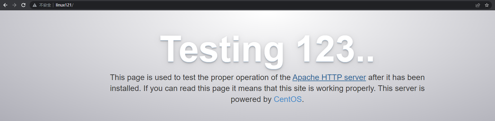
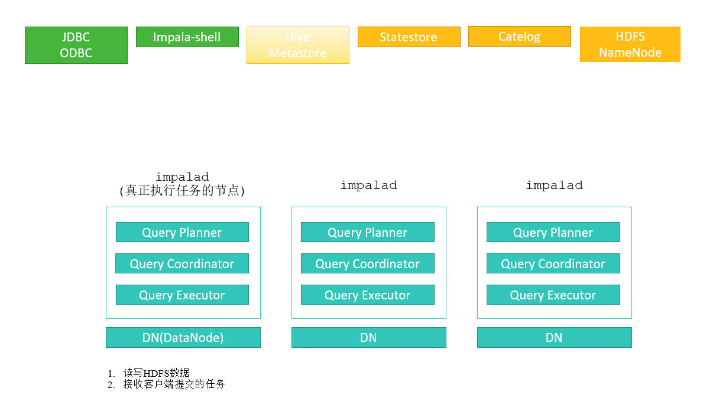
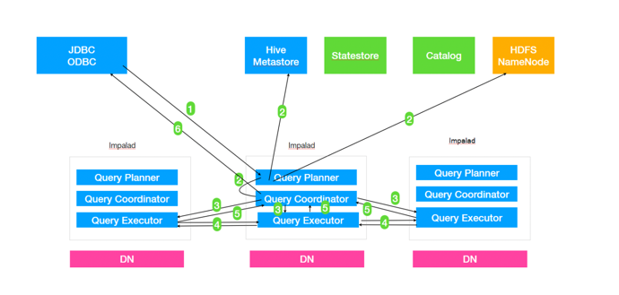
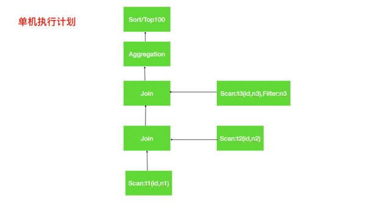
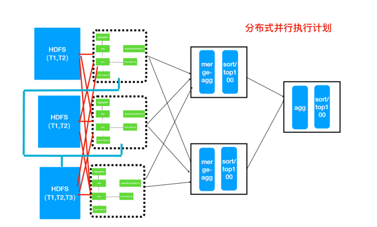
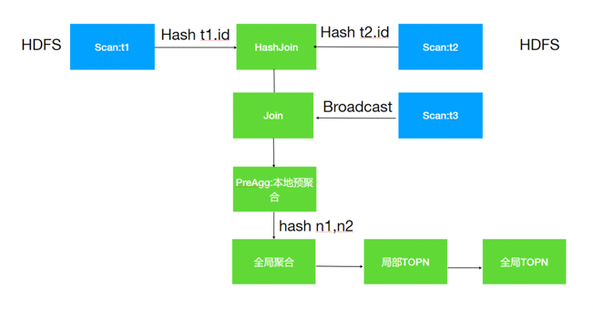

# Impala

> 交互式查询工具

## 第 1 部分 Impala概述 

### 1.1 Impala是什么

Impala是Cloudera提供的一款开源的针对HDFS和HBASE中的PB级别数据进行*交互式实时查询*的工具(Impala 速度快)。

Impala是参照⾕歌的新三篇论⽂当中的Dremel实现⽽来，其中旧三篇论文分别是 (BigTable，GFS，MapReduce)分别对应
我们即将学的HBase和已经学过的HDFS以及MapReduce。

Impala最大卖点和最大特点就是**快速**，Impala中⽂翻译是⾼角羚⽺。

### 1.2 Impala优势

回顾前⾯⼤数据课程路线其实就是⼀个⼤数据从业者⾯对的⼤数据相关技术发展的过程。

技术发展以及更新换代的原因就是⽼的技术架构遇到新的问题，有些问题可以通过不断优化代码优化设计得以解决，有⼀些问题就不再是简简单单修改代码就能解决，需要从框架本身架构设计上改变，以⾄于需要推倒重建。

在⼤数据领域主要解决的问题是数据的存储和分析，但是其实⼀个完整的⼤数据分析任务，如果细分会有⾮常多具体的场景，⾮常多的环节；并没有⼀个类似Java Web的Spring框架实现⼤⼀统的局⾯。

⽐如我们按照阶段划分⼀个⼤数据开发任务，会有：数据采集(⽇志⽂件/关系型数据库中)，数据清洗(数据格式整理，脏数据过滤等)，
数据预处理(为了后续分析所做的⼯作)，数据分析：离线处理(T+1分析)，实时处理(数据到来即分析)，数据可视化，机器学习，深度学习等。

⾯对如此众多的阶段再加上⼤数据天⽣的⼤数据量问题没有任何⼀个框架可以完美cover以上每个阶段。所以⼤数据领域有⾮常多框架，每个框架都有最适合⾃⼰的具体场景。
⽐如：HDFS负责⼤数据量存储，MapReduce（Hive）负责⼤数据量的分析计算。

#### Impala的诞⽣

之前学习的Hive以及MR适合离线批处理，但是对交互式查询的场景⽆能为⼒(要求快速响应)，所以为了解决查询速度的问题，Cloudera公司依据Google的Dremel开发了Impala。

Impala抛弃了MapReduce，使⽤了类似于传统的**MPP数据库技术**，⼤⼤提⾼了查询的速度。

#### MPP是什么？

MPP (Massively Parallel Processing)，就是⼤规模并⾏处理，在MPP集群中，每个节点资源都是独⽴享有(也就是有独⽴的磁盘和内存)，
每个节点通过⽹络互相连接，彼此协同计算，作为整体提供数据服务。

简单来说，MPP是将任务并⾏的分散到多个服务器和节点上，在每个节点上计算完成后，将各⾃部分的结果汇总在⼀起得到最终的结果。

对于MPP架构的软件来说聚合操作，⽐如计算某张表的总条数，则先进⾏局部聚合(每个节点并⾏计算)，然后把局部汇总结果进⾏全局聚合(与Hadoop相似)。

#### Impala与Hive对⽐

##### Impala的技术优势

- Impala没有采取MapReduce作为计算引擎。

> MR 慢的原因：1.Shuffle阶段的IO, 2.Shuffle阶段默认对key分区排序

MR是⾮常好的分布式并⾏计算框架，但MR引擎更多的是⾯向批处理模式，⽽不是⾯向交互式的SQL执⾏。

与Hive相⽐：Impala把整个查询任务转为⼀棵执⾏计划树，⽽不是⼀连串的MR任务，在分发执⾏计划后，Impala使⽤拉取的⽅式获取上个阶段的执⾏结果，
把结果数据按执⾏树流式传递汇集，减少的了把中间结果写⼊磁盘的步骤，再从磁盘读取数据的开销。

Impala使⽤服务的⽅式避免了每次执⾏查询都需要启动的开销，即相⽐Hive没了MR启动时间。

> 简单讲有两个优势：1.避免数据落磁盘, 2.处理进程无需每次启动, 3.Impala默认不会对数据进行排序

- 使⽤LLVM(C++编写的编译器)产⽣运⾏代码，可以针对特定查询⽣成特定代码。
- 优秀的IO调度，Impala⽀持直接数据块读取和本地代码计算。
- 选择适合的数据存储格式可以得到最好的性能（Impala⽀持多种存储格式）。
- 尽可能使⽤内存，中间结果不写磁盘，及时通过⽹络以stream的⽅式传递数据。

##### Impala与Hive对⽐分析

查询过程

- Hive：在Hive中，每个查询都有⼀个"冷启动"的常⻅问题。（map,reduce每次都要启动关闭，申请资源，释放资源...）
- Impala：Impala避免了任何可能的启动开销，这是⼀种本地查询语⾔。 因为要始终处理查询，所以Impala守护程序进程总是在集群启动之后就准备就绪。
  守护进程在集群启动之后可以接收查询任务并执⾏查询任务。

中间结果

- Hive：Hive通过MR引擎实现所有中间结果，中间结果需要落盘，这对降低数据处理速度有不利影响。
- Impala：在执⾏程序之间(即守护进程之间)使⽤流的⽅式传输中间结果，避免数据落盘。尽可能使⽤内存避免磁盘开销。

交互查询

- Hive：对于交互式计算，Hive不是理想的选择。
- Impala：对于交互式计算，Impala⾮常适合。(数据量级PB级)

计算引擎

- Hive：是基于批处理的Hadoop MapReduce
- Impala：更像是MPP数据库技术

容错

- Hive：Hive是容错的（通过MR&Yarn实现）
- Impala：Impala没有容错，由于良好的查询性能，Impala遇到错误会重新执⾏⼀次查询

查询速度

- Impala：Impala⽐Hive快3-90倍。

##### Impala优势总结

1. Impala最⼤优点就是查询速度快(在⼀定数据量下)；
2. 速度快的原因：避免了MR引擎的弊端，采⽤了MPP数据库技术，

### 1.3 Impala的缺点

1. Impala属于MPP架构，只能做到百节点级，⼀般并发查询个数达到20左右时，整个系统的吞吐已经达到满负荷状态，再扩容节点也提升不了吞吐量，处理数据量在PB级别最佳。
2. 资源不能通过YARN统⼀资源管理调度，所以Hadoop集群⽆法实现Impala、Spark、Hive等组件的动态资源共享。

### 1.4 适⽤场景

- Hive: 复杂的批处理查询任务，数据转换任务，对实时性要求不⾼同时数据量⼜很⼤的场景。
- Impala：实时数据分析，与Hive配合使⽤,对Hive的结果数据集进⾏实时分析。Impala不能完全取代Hive，Impala可以直接处理Hive表中的数据。

## 第 2 部分 Impala 安装与⼊⻔案例

### 2.1 集群准备

#### 2.1.1 安装Hadoop,Hive

Impala的安装需要提前装好Hadoop，Hive这两个框架，

> HDFS: Impala 数据存储在 HDFS; Hive: Impala 直接使用 Hive 元数据管理数据。

Hive需要在所有的Impala安装的节点上⾯都要有，因为Impala需要引⽤Hive的依赖包

Hadoop的框架需要⽀持C程序访问接⼝，查看下图，如果有该路径有 `.so` 结尾⽂件，就证明⽀持C

```shell
ll /opt/zmn/servers/hadoop-2.9.2/lib/native/
total 5020
drwxr-xr-x. 2 root root      94 Dec 18 17:43 examples
-rw-r--r--. 1 root root 1440164 Dec 18 17:43 libhadoop.a
-rw-r--r--. 1 root root 1632592 Dec 18 17:43 libhadooppipes.a
lrwxrwxrwx. 1 root root      18 Dec 18 17:34 libhadoop.so -> libhadoop.so.1.0.0
-rwxr-xr-x. 1 root root  842132 Dec 18 17:43 libhadoop.so.1.0.0
-rw-r--r--. 1 root root  476106 Dec 18 17:43 libhadooputils.a
-rw-r--r--. 1 root root  454188 Dec 18 17:43 libhdfs.a
lrwxrwxrwx. 1 root root      16 Dec 18 17:34 libhdfs.so -> libhdfs.so.0.0.0
-rwxr-xr-x. 1 root root  284815 Dec 18 17:43 libhdfs.so.0.0.0
```

#### 2.1.2 准备Impala的所有依赖包

Cloudera公司对于Impala的安装只提供了rpm包没有提供tar包；所以我们选择使⽤Cloudera的rpm包进⾏Impala的安装。
但是另外⼀个问题，Impala的rpm包依赖⾮常多的其他的rpm包，我们可以⼀个个的将依赖找出来，但是这种⽅式实在是浪费时间。

Linux系统中对于rpm包的依赖管理提供了⼀个⾮常好的管理⼯具叫做Yum,类似于Java⼯程中的包管理⼯具Maven,Maven可以⾃动搜寻指定Jar所需的其它依赖并⾃动下载来。
Yum同理可以⾮常⽅便的让我们进⾏rpm包的安装，⽆需关心当前rpm所需的依赖。但是与Maven下载其它依赖需要到中央仓库⼀样，
Yum下载依赖所需的源也是在放置在国外服务器并且其中没有安装Impala所需要的rpm包，
所以默认的这种Yum源可能下载依赖失败。所以我们可以⾃⼰指定Yum去哪⾥下载所需依赖。

rpm⽅式安装: 需要⾃⼰管理rpm包的依赖关系，⾮常麻烦；解决依赖关系使⽤yum；默认Yum源没有Impala的rpm安装包，
所以我们⾃⼰准备好所有的Impala安装所需的rpm包，制作Yum本地源，配置Yum命令去到我们准备的Yun源中下载Impala的rpm包进⾏安装。

##### 具体制作步骤

Yum源是Centos当中下载软件rpm包的地址，因此通过制作本地Yum源并指定Yum命令使⽤本地Yum源。
为了使Yum命令(本机，跨⽹络节点)可以通过⽹络访问到本地源，我们使⽤Httpd这种静态资源服务器来开放我们下载所有的rpm包。

1. Linux121安装Httpd服务器

```shell
# yum⽅式安装httpd服务器
yum install httpd -y
# 启动httpd服务器
systemctl start httpd
# 验证httpd⼯作是否正常,默认端⼝是80，可以省略
http://linux121
```



2. 新建⼀个测试⻚⾯
   
httpd默认存放⻚⾯路径: `/var/www/html/`

新建⼀个⻚⾯test.html

```html
<!doctype html>
<html lang="en">
<head>
  <meta charset="UTF-8">
  <meta name="viewport"
        content="width=device-width, user-scalable=no, initial-scale=1.0, maximum-scale=1.0, minimum-scale=1.0">
  <meta http-equiv="X-UA-Compatible" content="ie=edge">
  <title>Document</title>
</head>
<body>
<div>This is a httpd page !!</div>
</body>
</html>
```

访问: <http://linux121/test.html>


3. 下载Impala安装所需rpm包
   
Impala所需安装包需要到Cloudera提供的地址下载：<https://archive.cloudera.com/p/cdh5/repo-as-tarball/5.7.6/cdh5.7.6-centos7.tar.gz>

> 下载需要登录账户，GG

注意：该tar.gz包是包含了Cloudera所提供的⼏乎所有rpm包，但是为了⽅便我们不再去梳理其中依赖关系，全部下载来，整个⽂件⽐较⼤，有3.8G。
选择⼀个磁盘空间够的节点，后续还要把压缩包解压所以磁盘空间要剩余10G以上。

移动该安装包到 `/opt/zmn/software`

解压缩: `tar -zxvf cdh5.7.6-centos7.tar.gz`

4. 使⽤Httpd盛放依赖包
   
创建软链接到 `/var/www/html` 下

```shell
ln -s /opt/zmn/software/cdh/5.7.6 /var/www/html/cdh57
```

验证: <http://linux121/cdh57/>


如果提示403 forbidden

```shell
vim /etc/selinux/config

# 将SELINUX=enforcing改为SELINUX=disabled
# 修改之后要记得重启机器！！之前修改过可以不⽤修改！！
```

5. 修改Yum源配置⽂件

```shell
cd /etc/yum.repos.d

#创建⼀个新的配置⽂件
vim local.repo

#添加如下内容
[local]
name=local
baseurl=http://linux121/cdh57/
gpgcheck=0
enabled=1
```

- `[local]`: server id, 唯一标志
- `name`: 对当前源的描述
- `baseurl`: 访问当前源的地址信息
- `gpgcheck`: 1/0, gpg校验
- `enabled`: 1/0, 是否使⽤当前源

6. 分发local.repo⽂件到其它节点

```shell
rsync-script local.repo
```

### 2.2 安装Impala

#### 2.2.1 集群规划

| 服务名称               | linux121 | linux122 | linux123 |
|--------------------|:--------:|:--------:|:--------:|
| impala-catalogd    |          |          |    ✔     |
| impala-statestored |          |          |    ✔     |
| impala-server      |    ✔     |    ✔     |    ✔     |

Impala⻆⾊

| 角色                   | 描述                                                                   | 进程名           |
|----------------------|----------------------------------------------------------------------|---------------|
| `impala-server`      | 这个进程是Impala真正⼯作的进程，官⽅建议把 impala-server 安装在 datanode 节点，更靠近数据(方便短路读取) | `impalad`     |
| `impala-statestored` | 健康监控⻆⾊，主要监控 impala-server, 当 impala-server 出现异常时告知给其它 impala-server  | `statestored` |
| `impala-catalogd`    | 管理和维护元数据(Hive)、impala更新操作等；把 impala-server 更新的元数据通知给其它 impala-server | `catalogd`    |

> 官⽅建议 `statestored` 与 `catalog` 安装在同⼀节点上！！(因为底层会有一些依赖)

#### 2.2.2 具体安装步骤

Linux123

```shell
yum install impala -y
yum install impala-server -y
yum install impala-state-store -y
yum install impala-catalog -y
yum install impala-shell -y
```

Linux121与Linux122

```shell
yum install impala-server -y
yum install impala-shell -y
```

##### 配置Impala

1. 修改 `[linux123]/opt/zmn/servers/hive-2.3.7/conf/hive-site.xml`

```xml
<configuration>
    <!--指定metastore地址，之前添加过可以不⽤添加 -->
    <property>
        <name>hive.metastore.uris</name>
        <value>thrift://linux121:9083,thrift://linux123:9083</value>
    </property>
    <property>
        <name>hive.metastore.client.socket.timeout</name>
        <value>3600</value>
    </property>
</configuration>
```

2. 分发Hive安装包到集群节点

```shell
rsync -r /opt/zmn/servers/hive-2.3.7/ linux122:/opt/zmn/servers/
rsync -r /opt/zmn/servers/hive-2.3.7/ linux121:/opt/zmn/servers/
```

> 如果前面已经有 Hive 的服务的话，此时只需要复制配置文件即可。

```shell
cd /opt/zmn/servers/hive-2.3.7/conf/

# 复制文件
scp hive-site.xml linux121:$PWD
scp hive-site.xml linux122:$PWD
```

3. Linux123启动metastore服务

```shell
nohup hive --service metastore &
```

> metastore 可以在 linux121 上也起一份

启动 `hiveserver2` 服务

```shell
nohup hive --service hiveserver2 &
```

4. 修改HDFS集群 `hdfs-site.xml`，配置HDFS集群的短路读取

什么是短路读取？

在HDFS中通过DataNode来读取数据。但是，当客户端向DataNode请求读取⽂件时，DataNode就会从磁盘读取该⽂件并通过TCP socket将数据发送到客户端。

所谓"短路"是指Client客户端直接读取⽂件。很明显，这种情况只在客户端与数据放在同⼀地点（译者注：同⼀主机）时才有可能发⽣。短路读对于许多应⽤程序会带来重⼤的性能提升。

短路读取：就是Client与DataNode属于同⼀节点，⽆需再经过⽹络传输数据，直接本地读取。

要配置短路本地读，需要验证本机Hadoop是否有 `libhadoop.so`;

进⼊⼀下⽬录：`cd /opt/zmn/servers/hadoop-2.9.2/lib/native`

短路读取配置步骤

- 创建短路读取本地中转站

```shell
# 所有节点创建⼀下⽬录
mkdir -p /var/lib/hadoop-hdfs
```

- 修改hdfs-site.xml

```xml
<configuration>
    <!-- 添加如下内容 -->
    <!-- 打开短路读取开关 -->
    <!-- 打开短路读取配置-->
    <property>
        <name>dfs.client.read.shortcircuit</name>
        <value>true</value>
    </property>
    <!--这是⼀个UNIX域套接字的路径，将⽤于DataNode和本地HDFS客户机之间的通信 -->
    <property>
        <name>dfs.domain.socket.path</name>
        <value>/var/lib/hadoop-hdfs/dn_socket</value>
    </property>
    <!--block存储元数据信息开发开关 -->
    <property>
        <name>dfs.datanode.hdfs-blocks-metadata.enabled</name>
        <value>true</value>
    </property>
    <property>
        <name>dfs.client.file-block-storage-locations.timeout</name>
        <value>30000</value>
    </property>
</configuration>
```

注：分发到集群其它节点，然后重启Hadoop集群。

```shell
cd /opt/zmn/servers/hadoop-2.9.2/etc/hadoop/

# 复制文件
scp hdfs-site.xml linux122:$PWD
scp hdfs-site.xml linux123:$PWD
```

```shell
#停⽌集群
stop-dfs.sh
stop-yarn.sh
#启动集群
start-dfs.sh
start-yarn.sh
```

5. Impala具体配置

**引⽤HDFS，Hive配置**

使⽤Yum⽅式安装Impala，默认的Impala配置⽂件⽬录为 `/etc/impala/conf`，使⽤Impala要依赖Hadoop，Hive框架，所以需要把Hdfs,Hive的配置⽂件告知Impala。

执⾏以下命令把Hdfs，Hive的配置⽂件软链接到 `/etc/impala/conf` 下

```shell
ln -s /opt/zmn/servers/hadoop-2.9.2/etc/hadoop/core-site.xml /etc/impala/conf/core-site.xml
ln -s /opt/zmn/servers/hadoop-2.9.2/etc/hadoop/hdfs-site.xml /etc/impala/conf/hdfs-site.xml
ln -s /opt/zmn/servers/hive-2.3.7/conf/hive-site.xml /etc/impala/conf/hive-site.xml
```

> 注：所有节点都要执⾏此命令！

```shell
# 验证命令
cd /etc/impala/conf
ll
```

**Impala⾃身配置**

所有节点更改Impala默认配置⽂件以及添加mysql的驱动包

```shell
vim /etc/default/impala

# 更新如下内容
IMPALA_CATALOG_SERVICE_HOST=linux123
IMPALA_STATE_STORE_HOST=linux123
```

所有节点创建mysql的驱动包的软链接

```shell
#创建节点
mkdir -p /usr/share/java
ln -s /opt/zmn/servers/hive-2.3.7/lib/mysql-connector-java-5.1.46.jar /usr/share/java/mysql-connector-java.jar
```

修改 `bigtop` 的 `java_home` 路径

```shell
# 所有节点都需要修改
vim /etc/default/bigtop-utils

export JAVA_HOME=/opt/zmn/servers/jdk1.8.0_231
```

> 注意：Apache Bigtop 是⼀个针对基础设施⼯程师和数据科学家的开源项⽬，旨在全⾯打包、测试和配置领先的开源⼤数据组件/项⽬。Impala项⽬中使⽤到了此软件。

**启动Impala**

```shell
#linux123启动如下⻆⾊
service impala-state-store start
service impala-catalog start
service impala-server start
#其余节点启动如下⻆⾊
service impala-server start
```

验证 Impala 启动结果

```shell
ps -ef | grep impala
```

浏览器Web界⾯验证

- 访问 `Impalad` 的管理界⾯: <http://linux123:25000/>
- 访问 `statestored` 的管理界⾯: <http://linux123:25010/>

> 注意：启动之后所有关于Impala的⽇志默认都在 `/var/log/impala` 这个路径下，Linux123机器上⾯应该有三个进程，
> Linux121与Linux122机器上⾯只有⼀个进程，如果进程个数不对，去对应⽬录下查看报错⽇志.

**消除Impala影响**

由于使⽤Yum命令安装Impala，我们选择使⽤yum⾃动进⾏Impala依赖的安装和处理，所以本次安装默认会把Impala依赖的所有框架都会安装，⽐如Hadoop,Hive,Mysql等，
为了保证我们⾃⼰安装的Hadoop等使⽤正常，我们需要删除掉Impala默认安装的其它框架

```shell
# 使⽤which命令 查找hadoop,hive等会发现，命令⽂件是/usr/bin/hadoop ⽽⾮我们⾃⼰安装的路径，需要把这些删除掉,所有节点都要执⾏
rm -rf /usr/bin/hadoop
rm -rf /usr/bin/hdfs
rm -rf /usr/bin/hive
rm -rf /usr/bin/beeline
rm -rf /usr/bin/hiveserver2

# 重新⽣效环境变量
source /etc/profile
```

`jps` 时出现没有名字的进程或者 process information unavailable

解决⽅式: `rm -rf /tmp/hsperfdata_impala`

### 2.3 Impala⼊⻔案例

使⽤Yum⽅式安装Impala后，`impala-shell` 可以全局使⽤；进⼊impala-shell命令⾏

impala-shell进⼊到impala的交互窗⼝

```text
[root@linux123 ~]# impala-shell
Starting Impala Shell without Kerberos authentication
Connected to linux123:21000
Server version: impalad version 2.5.0-cdh5.7.6 RELEASE (build ecbba4f4e6d5eec6c33c1e02412621b8b9c71b6a)
***********************************************************************************
Welcome to the Impala shell. Copyright (c) 2015 Cloudera, Inc. All rights reserved.
(Impala Shell v2.5.0-cdh5.7.6 (ecbba4f) built on Tue Feb 21 14:54:50 PST 2017)

You can run a single query from the command line using the '-q' option.
***********************************************************************************
[linux123:21000] >  show databases;
Query: show databases
+------------------+----------------------------------------------+
| name             | comment                                      |
+------------------+----------------------------------------------+
| _impala_builtins | System database for Impala builtin functions |
| default          | Default Hive database                        |
+------------------+----------------------------------------------+
Fetched 2 row(s) in 0.22s
[linux123:21000] > 

```

如果想要使⽤Impala ,需要将数据加载到Impala中，如何加载数据到Impala中呢？

- 使⽤Impala的外部表，这种适⽤于已经有数据⽂件，只需将数据⽂件拷⻉到HDFS上，创建⼀张Impala外部表，将外部表的存储位置指向数据⽂件的位置即可。（类似Hive）
- 通过Insert⽅式插⼊数据，适⽤于我们没有数据⽂件的场景。

#### 入门使用

1. 准备数据⽂件 `[linux123/root/impala_data]user.csv`

```text
392456197008193000,张三,20,0
267456198006210000,李四,25,1
892456199007203000,王五,24,1
492456198712198000,赵六,26,2
392456197008193000,张三,20,0
392456197008193000,张三,20,0
```

2. 创建HDFS存放数据的路径

```shell
# linux123
hadoop fs -mkdir -p /user/impala/t1
#上传本地user.csv到hdfs /user/impala/table1
hadoop fs -put user.csv /user/impala/t1
```

3. 创建表

```shell
#进⼊impala-shell
impala-shell
```

```sql
use default;
-- 表如果存在则删除
drop table if exists t1;
-- 执⾏创建
create external table t1(id string,name string,age int,gender int) row format delimited fields terminated by ',' location '/user/impala/t1';
-- WARNINGS: Impala does not have READ_WRITE access to path 'hdfs://linux121:9000/user/impala'
-- 可以通过关闭集群权限校验的方式解决
```

4. 查询数据

```text
[linux122:21000] > select * from t1;
Query: select * from t1
+--------------------+------+-----+--------+
| id                 | name | age | gender |
+--------------------+------+-----+--------+
| 392456197008193000 | 张三 | 20  | 0      |
| 267456198006210000 | 李四 | 25  | 1      |
| 892456199007203000 | 王五 | 24  | 1      |
| 492456198712198000 | 赵六 | 26  | 2      |
| 392456197008193000 | 张三 | 20  | 0      |
| 392456197008193000 | 张三 | 20  | 0      |
+--------------------+------+-----+--------+
Fetched 6 row(s) in 5.90s
```

5. 创建t2表

```sql
-- 创建⼀个内部表
create table t2(id string,name string,age int,gender int) row format delimited fields terminated by ',';
-- 查看表结构
desc t1;
desc formatted t2;
```

6. 插⼊数据到t2并验证结果

```sql
-- 插入数据
insert overwrite table t2 select * from t1 where gender = 0;
-- 验证数据
select * from t2;
```

#### 更新元数据

使⽤Beeline连接Hive查看Hive中的数据，发现通过Impala创建的表，导⼊的数据都可以被Hive感知到。

⼩结：

1. 上⾯案例中Impala的数据⽂件我们准备的是以逗号分隔的⽂本⽂件，实际上，Impala可以⽀持RCFile,SequenceFile,Parquet等多种⽂件格式。
2. Impala与Hive元数据的关系？

> Hive对元数据的更新操作不能被Impala感知到；
>
> Impala对元数据的更新操作可以被Hive感知到。

Impala同步Hive元数据命令：⼿动执⾏invalidate metadata，（后续详细讲解）

Impala是通过Hive的metastore服务来访问和操作Hive的元数据，但是Hive对表进⾏创建删除修改等操作，Impala是⽆法⾃动识别到Hive中元数据的变更情况的，
如果想让Impala识别到Hive元数据的变化，进⼊impala-shell之后⾸先要做的操作就是执⾏ `invalidate metadata;`, 
该命令会将所有的Impala的元数据失效并重新从元数据库同步元数据信息。后⾯详细讲解元数据更新命令。

3. Impala操作HDFS使⽤的是Impala⽤户，所以为了避免权限问题，我们可以选择关闭权限校验

在hdfs-site.xml中添加如下配置：

```xml
<configuration>
    <!--关闭hdfs权限校验 -->
    <property>
        <name>dfs.permissions.enabled</name>
        <value>false</value>
    </property>
</configuration>
```

## 第 3 部分 Impala的架构原理 

### 第 1 节 Impala的组件

Impala是⼀个分布式、⼤规模并⾏处理(MPP)数据库引擎，它包括多个进程。

> Impala与Hive类似，不是数据库⽽是数据分析⼯具。

```shell
#在linux123执⾏
ps -ef | grep impala

impala     2305      1  0 14:32 ?        00:00:15 /usr/lib/impala/sbin/statestored -log_dir=/var/log/impala -state_store_port=24000
impala     2400      1  0 14:32 ?        00:00:16 /usr/lib/impala/sbin/catalogd -log_dir=/var/log/impala
impala     2484      1  0 14:32 ?        00:00:17 /usr/lib/impala/sbin/impalad -log_dir=/var/log/impala -catalog_service_host=linux123 -state_store_port=24000 -use_statestore -state_store_host=linux123 -be_port=22000
```



#### impalad

⻆⾊名称为 Impala Daemon, 是在每个节点上运⾏的进程，是Impala的核⼼组件，进程名是 `Impalad`;

作⽤: 负责读写数据⽂件，接收来⾃Impala-shell，JDBC,ODBC等的查询请求，与集群其它Impalad分布式并⾏完成查询任务，并将查询结果返回给中⼼协调者。

为了保证Impalad进程了解其它Impalad的健康状况，Impalad进程会⼀直与statestore保持通信。

Impalad服务由三个模块组成：Query Planner(生成查询计划)、Query Coordinator(查询协调器)和Query Executor(执行引擎)。
前两个模块组成前端，负责接收SQL查询请求，解析SQL并转换成执⾏计划，交由后端执⾏，

#### statestored

statestore监控集群中Impalad的健康状况，并将集群健康信息同步给Impalad

statestore进程名为 `statestored`

#### catalogd

Impala执⾏的SQL语句引发元数据发⽣变化时，catalog服务负责把这些元数据的变化同步给其它Impalad进程(⽇志验证,监控statestore进程⽇志)

catalog服务对应进程名称是 `catalogd`

由于⼀个集群需要⼀个 `catalogd` 以及⼀个 `statestored` 进程，⽽且 `catalogd` 进程所有请求都是经过 `statestored` 进程发送，
所以官⽅建议让 `statestored` 进程与 `catalogd` 进程安排同个节点。

> 某个 impalad 进程更新原数据之后，catelogd 负责把这个更新同步给其他 impalad。
> 
> 为什么 hive 更新元数据 impala 感知不到呢? 集群启动时拉取元数据同步给 impalad 进程, 后续只有手动执行了 `invalidate metadata` 命令
> 或者 `refresh` 命令才会再次拉取元数据。

### 第 2 节 Impala的查询



1. Client提交任务
   
Client发送⼀个SQL查询请求到任意⼀个Impalad节点，会返回⼀个queryId⽤于之后的客户端操作。

> 以 impala-shell 作为客户端来讲, 在哪个节点启动 impala-shell, 就会将请求发送到哪个节点的 impalad
 
2. ⽣成单机和分布式执⾏计划【重要】
   
SQL提交到Impalad节点之后，进程中的Analyser会依次执⾏SQL的词法分析、语法分析、语义分析等操作；

然后从MySQL元数据库中获取元数据，从HDFS的名称节点中获取数据地址，以得到存储这个查询相关数据的所有数据节点;

解析完成之后会生成两个计划：单机执行计划和分布式并行执行计划。

- 单机执⾏计划： 根据上⼀步对SQL语句的分析，由Planner先⽣成单机的执⾏计划，该执⾏计划是由PlanNode组成的⼀棵树，这个过程中也会执⾏⼀些SQL优化，例如Join顺序改变、谓词下推等。
- 分布式并⾏执行计划：将单机执⾏计划转换成分布式并⾏物理执⾏计划，物理执⾏计划由⼀个个的Fragment组成，Fragment之间有数据依赖关系，处理过程中需要在原有的执⾏计划之上加⼊⼀些ExchangeNode和DataStreamSink信息等。

> Fragment： sql⽣成的分布式执⾏计划的⼀个⼦任务；
>
> DataStreamSink：传输当前的Fragment, 输出数据到不同的节点

3. 任务调度和分发

Coordinator将Fragment(⼦任务)根据数据分区信息发配到不同的Impalad节点上执⾏。Impalad节点接收到执⾏Fragment请求交由Executor执⾏。

4. Fragment之间的数据依赖

每⼀个Fragment的执⾏输出通过DataStreamSink发送到下⼀个Fragment，Fragment运⾏过程中不断向coordinator节点汇报当前运⾏状态。

5. 结果汇总

查询的SQL通常情况下需要有⼀个单独的Fragment⽤于结果的汇总，它只在Coordinator节点运⾏，将多个节点的最终执⾏结果汇总，转换成ResultSet信息。

6. 获取结果

客户端调⽤获取ResultSet的接⼝，读取查询结果。

#### 查询计划详解示例

以⼀个SQL例⼦来展示查询计划

```sql
-- SQL语句
select t1.n1,
       t2.n2,
       count(1) as c
from t1
       join t2 on t1.id = t2.id
       join t3 on t1.id = t3.id
where t3.n3 between 'a' and 'f'
group by t1.n1, t2.n2
order by c desc limit 100;
```

##### QueryPlanner⽣成单机的执⾏计划



分析上⾯的单机执⾏计划:

1. 第⼀步先去扫描t1表中需要的数据，如果数据⽂件存储是列式存储我们可以便利的扫描到所需的列id,n1;
2. 接着需要与t2表进⾏Join操作，扫描t2表与t1表类似获取到所需数据列id,n2;
3. t1与t2表进⾏关联，关联之后再与t3表进⾏关联，这⾥Impala会使⽤谓词下推扫描t3表只取join所需数据；
4. 对group by进⾏相应的aggregation操作，
5. 最终是排序取出指定数量的数据返回。

##### 分布式并⾏执⾏计划

所谓的分布式并⾏化执⾏计划就是在单机执⾏计划基础之上结合数据分布式存储的特点，按照任务的计算要求把单机执⾏计划拆分为多段⼦任务，每个⼦任务都是可以并⾏执⾏的。
上⾯的单机执⾏计划转为分布式并⾏执⾏计划如下图所示：



分布式并⾏执⾏计划流程图



分布式执⾏计划中涉及到多表的Join, Impala会根据表的⼤⼩来决定Join的⽅式，主要有两种：分别是HashJoin与Broadcast Join

上⾯分布式执⾏计划中可以看出T1,T2表⼤⼀些，⽽T3表⼩⼀些，
所以对于T1与T2的Join Impala选择使⽤Hash Join, 对于T3表选择使⽤Broadcast⽅式，直接把T3表⼴播到需要Join的节点上。

分布式并⾏计划流程

1. T1和T2使⽤Hash join，此时需要按照id的值分别将T1和T2分散到不同的Impalad进程，id相同的数据会散列到相同的Impalad进程进行join，这样每⼀个Join之后是全部数据的⼀部分
2. T1与T2Join之后的结果数据再与T3表进⾏Join, 此时T3表采⽤Broadcast⽅式把⾃⼰全部数据(id列)⼴播到需要的Impala节点上
3. T1,T2,T3 Join之后再根据Group by执⾏本地的预聚合，每⼀个节点的预聚合结果只是最终结果的⼀部分（不同的节点可能存在相同的group by的值），需要再进⾏⼀次全局的聚合。
4. 全局的聚合同样需要并⾏。根据聚合列(n1, n2)进⾏Hash分散到不同的节点执⾏Merge运算（其实仍然是⼀次聚合运算），⼀般情况下为了较少数据的⽹络传输， Impala会选择之前本地聚合节点做全局聚合⼯作。
5. 通过全局聚合之后，相同的key只存在于⼀个节点，然后对于每⼀个节点进⾏排序和TopN计算，最终将每⼀个全局聚合节点的结果返回给Coordinator进⾏合并、排序、limit计算，返回结果给⽤户.

> 其中，前面的 4 步都可以并行执行。

## 第 4 部分 Impala的使⽤

Impala的核⼼开发语⾔是sql语句，Impala有shell命令⾏窗⼝，以及JDBC等⽅式来接收sql语句执⾏，对于复杂类型分析可以使⽤C++或者Java来编写UDF函数。

Impala的sql语法是⾼度集成了Apache Hive的sql语法，Impala⽀持Hive⽀持的数据类型以及部分Hive的内置函数。

需要注意的⼏点：

1. Impala与Hive类似它们的重点都是查询，所以像Update,delete等具有更新性质的操作最好不要使⽤这种⼯具，对于删除数据的操作可以通过`Drop Table`,`Alter Table Drop Partition`来实现，更新可以尝试使⽤`Insert overwrite`⽅式
2. 通常使⽤Impala的⽅式是数据⽂件存储在Hdfs⽂件系统，借助于Impala的表定义来查询和管理Hdfs上的数据⽂件；
3. Impala的使⽤⼤多数与Hive相同，⽐如Impala同样⽀持内外部表，以及分区等，可以借鉴参考Hive的使⽤。

### 第 1 节 Impala-shell命令参数

#### 1.1 impala-shell外部命令

所谓的外部命令指的是不需要进⼊到 impala-shell 交互命令⾏当中即可执⾏的命令参数。

impala-shell 后⾯执⾏的时候可以带很多参数。你可以在启动 `impala-shell` 时设置，⽤于修改命令执⾏环境。

`impala-shell –h` 可以帮助我们查看帮助⼿册。

⽐如⼏个常⻅的：

- `impala-shell –r` 刷新impala元数据，与建⽴连接后执⾏ REFRESH 语句效果相同(元数据发⽣变化的时候)
- `impala-shell –f ⽂件路径` 执⾏指定的sql查询⽂件
- `impala-shell –i` 指定连接运⾏ impalad 守护进程的主机。默认端⼝是 21000。你可以连接到集群中运⾏ `impalad` 的任意主机。
- `impala-shell –o` 保存执⾏结果到⽂件当中去

> 展示Impala默认⽀持的内置函数需要进⼊Impala默认系统数据库中执⾏

```shell
use _impala_builtins;
show functions;
```

> 在其它数据库下⽆法查看！！

#### 1.2 impala-shell内部命令

所谓内部命令是指，进⼊impala-shell命令⾏之后可以执⾏的语法。

- `help;` 查看帮助信息

```text
[linux123:21000] > help;

Documented commands (type help <topic>):
========================================
compute   exit     history  quit    shell  unset   version
connect   explain  insert   select  show   use     with   
describe  help     profile  set     tip    values

Undocumented commands:
======================
alter  create  desc  drop  load  summary

[linux123:21000] > help quit;
Quit the Impala shell
[linux123:21000] > help alter;
*** No help on alter
```

- `connect hostname;` 连接到指定机器的 `Impalad`
- `refresh dbname.tablename` 增量刷新，刷新某⼀张表的元数据，主要⽤于刷新hive当中数据表⾥⾯的数据改变的情况
- `invalidate metadata` 全量刷新，性能消耗较⼤，主要⽤于hive当中新建数据库或者数据库表的时候来进⾏刷新
- `quit/exit` 从Impala shell中退出
- `explain` ⽤于查看sql语句的执⾏计划。(`set explain_level=3;` 值可以设置成 0,1,2,3 等⼏个值，其中3级别是最⾼的，可以打印出最全的信息)

```text
[linux123:21000] > explain select * from t1;
Query: explain select * from t1
+------------------------------------------------------------------------------------+
| Explain String                                                                     |
+------------------------------------------------------------------------------------+
| Estimated Per-Host Requirements: Memory=32.00MB VCores=1                           |
| WARNING: The following tables are missing relevant table and/or column statistics. |
| default.t1                                                                         |
|                                                                                    |
| 01:EXCHANGE [UNPARTITIONED]                                                        |
| |                                                                                  |
| 00:SCAN HDFS [default.t1]                                                          |
|    partitions=1/1 files=1 size=185B                                                |
+------------------------------------------------------------------------------------+
Fetched 8 row(s) in 0.01s
```

- `profile` 在执⾏sql语句之后执⾏，可以打印出更加详细的执⾏步骤，主要⽤于查询结果的查看，集群的调优等。

> `expalin`: 可以不真正执⾏任务，只是展示任务的执⾏计划；
>
> `profile`: 需要任务执⾏完成后调⽤，可以从更底层以及更详细的层⾯来观察我们运⾏ `impala` 的任务，进⾏调优。

### 第 2 节 Impala sql语法

#### 2.1 数据库特定语句

##### 1. 创建数据库

`CREATE DATABASE` 语句⽤于在Impala中创建新数据库。

```sql
CREATE DATABASE IF NOT EXISTS database_name;
```

这⾥，`IF NOT EXISTS` 是⼀个可选的⼦句。如果我们使⽤此⼦句，则只有在没有具有相同名称的现有数据库时，才会创建具有给定名称的数据库。

默认就会在hive的数仓路径下创建新的数据库名⽂件夹: `/user/hive/warehouse/zmn_test.db`

##### 2. 删除数据库

Impala的 `DROP DATABASE` 语句⽤于从Impala中删除数据库。 在删除数据库之前，建议从中删除所有表。

如果使⽤级联删除，Impala会在删除指定数据库中的表之前删除它。

```sql
drop database sample cascade;
```

#### 2.2 表特定语句

##### 1. CREATE TABLE 语句
   
`CREATE TABLE` 语句⽤于在Impala中的所需数据库中创建新表。需要指定表名字并定义其列和每列的数据类型。

impala⽀持的数据类型和hive类似.

```sql
CREATE TABLE IF NOT EXISTS database_name.table_name ( column1 data_type, column2 data_type, column3 data_type, ……… columnN data_type);
CREATE TABLE IF NOT EXISTS mydb.student(name STRING, age INT, contact INT );
```

> 默认建表的数据存储路径跟hive⼀致。也可以在建表的时候通过location指定具体路径。

##### 2. INSERT 语句

Impala的INSERT语句有两个⼦句: into和overwrite。

into⽤于插⼊新记录数据，overwrite⽤于覆盖已有的记录。

```sql
INSERT INTO table_name (column1, column2, column3,...columnN) VALUES (value1, value2, value3,...valueN);
INSERT INTO table_name VALUES (value1, value2, value2);
```

> `column1，column2，... columnN` 是要插⼊数据的表中的列的名称。还可以添加值⽽不指定列名，但是，需要确保值的顺序与表中的列的顺序相同。

```sql
create table employee
(
  Id      INT,
  name    STRING,
  age     INT,
  address STRING,
  salary  BIGINT
);
insert into employee
VALUES (1, 'Ramesh', 32, 'Ahmedabad', 20000);
insert into employee
values (2, 'Khilan', 25, 'Delhi', 15000);
Insert into employee
values (3, 'kaushik', 23, 'Kota', 30000);
Insert into employee
values (4, 'Chaitali', 25, 'Mumbai', 35000);
Insert into employee
values (5, 'Hardik', 27, 'Bhopal', 40000);
Insert into employee
values (6, 'Komal', 22, 'MP', 32000);
```


overwrite 覆盖⼦句覆盖表当中全部记录。 覆盖的记录将从表中永久删除。

```sql
INSERT OVERWRITE employee VALUES (1, 'Ram', 26, 'Vishakhapatnam', 37000 );
```

##### 3. SELECT 语句

Impala 的SELECT语句⽤于从数据库查询数据，此查询以表的形式返回数据。

##### 4. DESCRIBE 语句

Impala中的describe语句⽤于提供表的描述。此语句的结果包含有关表的信息，例如列名称及其数据类型。

```sql
DESCRIBE table_name;
-- 可以简写成：
DESC table_name;
-- 同样支持更加详细的数据
describe formatted table_name;
```

##### 5. ALTER TABLE
   
Impala中的Alter table语句⽤于对给定表执⾏更改。使⽤此语句，我们可以添加，删除或修改现有表中的列，也可以重命名它们。

> 参考 Hive。不建议在 impala 中实现表结构定义和修改。

##### 6. DELETE、TRUNCATE TABLE
   
Impala `DROP TABLE` 语句⽤于删除Impala中的现有表。此语句还会删除内部表的底层HDFS⽂件。
   
> 注意：使⽤此命令时必须⼩⼼，因为删除表后，表中可⽤的所有信息也将永远丢失。

```sql
DROP TABLE database_name.table_name;
```

Impala的 `TRUNCATE TABLE` 语句⽤于从现有表中删除所有记录。保留表结构。

使⽤DROP TABLE命令会删除⼀个完整的表，它会从数据库中删除完整的表结构，如果希望存储数据，将需要重新创建此表。

```sql
TRUNCATE TABLE table_name;
```

**Impala对复杂数据类型的⽀持**

对于Text存储格式中的复杂类型不⽀持，复杂类型要使⽤ `parquet` 格式。

##### 7. view视图

视图仅仅是存储在数据库中具有关联名称的Impala查询语⾔的语句。 它是以预定义的SQL查询形式的表的组合。

视图可以包含表的所有⾏或选定的⾏。

```sql
CREATE VIEW IF NOT EXISTS view_name AS SELECT statement
```

创建视图view、查询视图view

```sql
CREATE VIEW IF NOT EXISTS employee_view AS SELECT name, age FROM employee;
-- 查看视图是否创建成功
show tables;
-- 视图创建成功后，会在数据表列表中显示 employee_view

-- 查看视图数据
select * from employee_view;
```

修改视图

```sql
ALTER VIEW database_name.view_name AS Select语句
```

删除视图

```sql
DROP VIEW database_name.view_name;
```

##### 8. ORDER BY⼦句

Impala `ORDER BY` ⼦句⽤于根据⼀个或多个列以升序或降序对数据进⾏排序。 

默认情况下，⼀些数据库按升序对查询结果进⾏排序。

```sql
SELECT * FROM table_name ORDER BY col_name
 [ASC|DESC] [NULLS FIRST|NULLS LAST]
```

可以使⽤关键字ASC或DESC分别按升序或降序排列表中的数据。

如果我们使⽤ `NULLS FIRST`，表中的所有空值都排列在顶⾏; 如果我们使⽤ `NULLS LAST`，包含空值的⾏将最后排列。

##### 9. GROUP BY⼦句

Impala `GROUP BY`⼦句与`SELECT`语句协作使⽤，以将相同的数据排列到组中。

```sql
select name, sum(salary) from employee group by name;
```

##### 10. HAVING⼦句
    
容易与WHERE过滤进⾏混淆，如何区分?

- WHERE: 过滤的数据是原始数据，表中本来就存在的数据；
- HAVING: 过滤的是查询结果数据；

按年龄对表进⾏分组，并选择每个组的最⼤⼯资，并显示⼤于20000的⼯资

```sql
SELECT MAX(salary) FROM employee GROUP BY age HAVING max(salary) > 20000;
```

##### 11. LIMIT、OFFSET

Impala中的LIMIT⼦句⽤于将结果集的⾏数限制为所需的数，即查询的结果集不包含超过指定限制的记录。

⼀般来说，SELECT查询的resultset中的⾏从0开始。使⽤offset⼦句，我们可以决定从哪⾥考虑输出。

```sql
SELECT * FROM employee ORDER BY salary LIMIT 2 OFFSET 2;
```

> 使⽤offset关键字要求结果数据必须是排序之后的！！

### 第 3 节 Impala导⼊数据

#### 1. INSERT INTO VALUES

这种⽅式⾮常类似于RDBMS的数据插⼊⽅式。

```sql
CREATE TABLE t_test2(id int,name string);
INSERT INTO TABLE t_test2 values(1, "zhangsan");
```

#### 2. INSERT INTO SELECT

插⼊⼀张表的数据来⾃于后⾯的select查询语句返回的结果。

#### 3. CREATE TABLE AS SELECT
   
建表的字段个数、类型、数据来⾃于后续的select查询语句。
   
`load data` ⽅式，这种⽅式不建议在Impala中使⽤，先使⽤ `load data` ⽅式把数据加载到Hive表中，然后使⽤以上⽅式插⼊Impala表中。

## 第 5 部分 Impala的JDBC⽅式查询

在实际⼯作当中，因为impala的查询⽐较快，所以可能有会使⽤到impala来做数据库查询的情况，我们可以通过java代码来进⾏操作impala的查询

1. 导⼊jar包

```xml
<dependencies>
  <!-- https://mvnrepository.com/artifact/org.apache.hadoop/hadoopcommon -->
  <dependency>
    <groupId>org.apache.hadoop</groupId>
    <artifactId>hadoop-common</artifactId>
    <version>2.9.2</version>
  </dependency>
  <!-- https://mvnrepository.com/artifact/org.apache.hive/hive-common -->
  <dependency>
    <groupId>org.apache.hive</groupId>
    <artifactId>hive-common</artifactId>
    <version>2.3.7</version>
  </dependency>
  <!-- https://mvnrepository.com/artifact/org.apache.hive/hive-metastore-->
  <dependency>
    <groupId>org.apache.hive</groupId>
    <artifactId>hive-metastore</artifactId>
    <version>2.3.7</version>
  </dependency>
  <!-- https://mvnrepository.com/artifact/org.apache.hive/hive-service -->
  <dependency>
    <groupId>org.apache.hive</groupId>
    <artifactId>hive-service</artifactId>
    <version>2.3.7</version>
  </dependency>
  <!-- https://mvnrepository.com/artifact/org.apache.hive/hive-jdbc -->
  <dependency>
    <groupId>org.apache.hive</groupId>
    <artifactId>hive-jdbc</artifactId>
    <version>2.3.7</version>
  </dependency>
  <!-- https://mvnrepository.com/artifact/org.apache.hive/hive-exec -->
  <dependency>
    <groupId>org.apache.hive</groupId>
    <artifactId>hive-exec</artifactId>
    <version>2.3.7</version>
  </dependency>
</dependencies>
```

2. Java编码

```java
public class ImpalaTest {
  public static void main(String[] args) throws Exception {
    //定义连接impala的驱动和连接url
    String driver = "org.apache.hive.jdbc.HiveDriver";
    String driverUrl = "jdbc:hive2://linux122:21050/default;auth=noSasl";
    //查询的sql语句
    String querySql = "select * from t1";
    //获取连接
    Class.forName(driver);
    //通过Drivermanager获取连接
    final Connection connection = DriverManager.getConnection(driverUrl);
    final PreparedStatement ps = connection.prepareStatement(querySql);
    //执⾏查询
    final ResultSet resultSet = ps.executeQuery();
    //解析返回结果
    //获取到每条数据的列数
    final int columnCount = resultSet.getMetaData().getColumnCount();
    //遍历结果集
    while (resultSet.next()) {
      for (int i = 1; i <= columnCount; i++) {
        final String string = resultSet.getString(i);
        System.out.print(string + "\t");
      }
      System.out.println();
    }
    //关闭资源
    ps.close();
    connection.close();
  }
}
```

> 既然可以用 JDBC，其实用 MyBatis 也是一样的。

## 第 6 部分 Impala进阶

### 第 1 节 Impala的负载均衡

Impala主要有三个组件，分别是`statestore`，`catalog`和`impalad`，对于Impalad节点，每⼀个节点都可以接收客户端的查询请求，
并且对于连接到该Impalad的查询还要作为 Coordinator 节点（需要消耗⼀定的内存和CPU）存在，
为了保证每⼀个节点的资源开销的平衡需要对于集群中的Impalad节点做⼀下负载均衡.

- Cloudera官⽅推荐的代理⽅案: HAProxy
- DNS做负载均衡

DNS做负载均衡⽅案是最简单的，但是性能⼀般，所以这⾥我们按照官⽅的建议使⽤HAProxy实现负载均衡

> ⽣产中应该选择⼀个⾮ Impalad 节点作为HAProxy的安装节点

#### HAProxy⽅案

安装haproxy

```shell
# 此处安装在 linux123 上
yum install haproxy -y
```

修改配置⽂件

```shell
vim /etc/haproxy/haproxy.cfg
```

具体配置内容

> 注释掉 defaults 模块的如下内容

```text
    # option http-server-close
    # option forwardfor       except 127.0.0.0/8
    # option                  redispatch

    # timeout connect         10s
    # timeout client          1m
    # timeout server          1m
```

> 在 defaults 模块下方添加如下内容

```text
listen status #定义管理界⾯
    bind    0.0.0.0:1080 #管理界⾯访问IP和端⼝
    mode    http #管理界⾯所使⽤的协议
    option  httplog
    maxconn 5000 #最⼤连接数
    stats   refresh 30s #30秒⾃动刷新
    stats   uri /stats

listen impalashell
    bind    0.0.0.0:25003 #ha作为proxy所绑定的IP和端⼝
    mode    tcp #以4层⽅式代理，重要
    option  tcplog
    balance roundrobin #调度算法 'leastconn' 最少连接数分配，或者 'roundrobin'，轮询分
    server  impalashell_1 linux121:21000 check
    server  impalashell_2 linux122:21000 check
    server  impalashell_3 linux123:21000 check

listen impalajdbc
    bind    0.0.0.0:25004 #ha作为proxy所绑定的IP和端⼝
    mode    tcp #以4层⽅式代理，重要
    option  tcplog
    balance roundrobin #调度算法 'leastconn' 最少连接数分配，或者 'roundrobin'，轮询分
    server  impalajdbc_1 linux121:21050 check
    server  impalajdbc_2 linux122:21050 check
    server  impalajdbc_3 linux122:21050 check
```

启动

```shell
# 开启
service haproxy start
# 关闭
service haproxy stop
# 重启
service haproxy restart
```

使⽤

Impala-shell访问⽅式

```shell
impala-shell -i linux123:25003
```

使⽤起来⼗分⽅便，区别仅仅相当于是修改了⼀个ip地址和端⼝⽽已，其余不变。

```text
jdbc:hive2://linux123:25004/default;auth=noSasl
```

> Impala集群在操作过程中尽量多给内存，如果内存不能满⾜使⽤要求，Impala的执⾏很可能会报错！！

> 实测此处的 HAProxy 配置文件并不能成功启动...

### 第 2 节 Impala优化

cloudera官⽹上的Impala⽂档，原名为《Impala Performance Guidelines and Best Practices》。

主要介绍了为了提升impala性能应该考虑的⼀些事情，结合实际考虑：

#### 基本优化策略

- ⽂件格式

对于⼤数据量来说，`Parquet` ⽂件格式是最佳的

- 避免⼩⽂件

`INSERT ... VALUES` 会产⽣⼤量⼩⽂件，避免使⽤

- 合理分区粒度

利⽤分区可以在查询的时候忽略掉⽆⽤数据，提⾼查询效率，通常建议分区数量在3万以下
(太多的分区也会造成元数据管理的性能下降)

- 分区列数据类型最好是整数类型

分区列可以使⽤string类型，因为分区列的值最后都是作为HDFS⽬录使⽤，如果分区列使⽤整数类型可以降低内存消耗

- 获取表的统计指标

在追求性能或者⼤数据量查询的时候，要先获取所需要的表的统计指标
(如:执⾏ `COMPUTE STATS` )

- 减少传输客户端数据量

聚合(如count、sum、max 等)

过滤(如 WHERE )

limit限制返回条数

返回结果不要使⽤美化格式进⾏展示(在通过impala-shell展示结果时，添加这些可选参数: `-B`、 `--output_delimiter`)

- 在执⾏之前使⽤EXPLAIN来查看逻辑规划，分析执⾏逻辑

- Impala join⾃动的优化⼿段就是通过使⽤ `COMPUTE STATS` 来收集参与Join的每张表的统计信息，然后由Impala根据表的⼤⼩、列的唯⼀值数⽬等来⾃动优化查询。
  为了更加精确地获取每张表的统计信息，每次表的数据变更时(如执⾏Insert,add partition,drop partition等)最好都要执⾏⼀遍 `COMPUTE STATS` 获取到准确的表统计信息。


