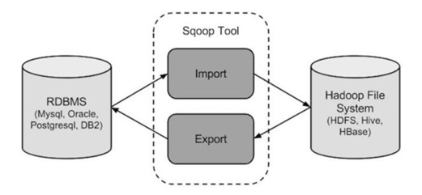

# Sqoop

> 数据迁移工具

## 第一部分 Sqoop概述

Sqoop是一款开源的工具，主要用于在Hadoop(Hive)与传统的数据库(mysql、postgresql等)间进行数据的传递。
可以将关系型数据库(MySQL,Oracle,Postgres等)中的数据导入到HDFS中，也可以将HDFS的数据导进到关系型数据库中。

> Import: RDBMS -> Hadoop; Export: Hadoop -> RDBMS;
> 
> 站在大数据管理平台的角度

Sqoop项目开始于2009年，最早是作为Hadoop的一个第三方模块存在，后来为了让使用者能够快速部署，也为了让开发人员能够更快速的迭代开发，Sqoop独立成为一个 Apache 项目。



将导入或导出命令转换为 MapReduce 程序来实现。翻译出的 MapReduce ，主要是对 `inputformat` 和 `outputformat` 进行定制。

## 第二部分 安装配置

> Sqoop官网: <http://sqoop.apache.org/>
> 
> 下载地址: <http://archive.apache.org/dist/sqoop/>


1. 下载、上传并解压

将下载的安装包 `sqoop-1.4.7.bin__hadoop-2.6.0.tar.gz` 上传到虚拟机中; 解压缩软件包;

```shell
tar zxvf sqoop-1.4.7.bin__hadoop-2.6.0.tar.gz

mv sqoop-1.4.7.bin__hadoop-2.6.0/ ../servers/sqoop-1.4.7/
```

2. 增加环境变量，并使其生效

```shell
vi /etc/profile
# 增加以下内容
export SQOOP_HOME=/opt/zmn/servers/sqoop-1.4.7 
export PATH=$PATH:$SQOOP_HOME/bin

source /etc/profile
```

3. 创建、修改配置文件

```shell
# 配置文件位置 $SQOOP_HOME/conf; 要修改的配置文件为 sqoop-env.sh 
cp sqoop-env-template.sh sqoop-env.sh
vi sqoop-env.sh

# 在文件最后增加以下内容
export HADOOP_COMMON_HOME=/opt/zmn/servers/hadoop-2.9.2 
export HADOOP_MAPRED_HOME=/opt/zmn/servers/hadoop-2.9.2 
export HIVE_HOME=/opt/zmn/servers/hive-2.3.7
```

4. 拷贝JDBC驱动程序

```shell
# 拷贝jdbc驱动到sqoop的lib目录下(备注:建立软链接也可以)
ln -s /opt/zmn/servers/hive-2.3.7/lib/mysql-connector-java-5.1.46.jar /opt/zmn/servers/sqoop-1.4.7/lib/
```


5. 拷贝 jar

将 $HIVE_HOME/lib 下的 hive-common-2.3.7.jar，拷贝到 $SQOOP_HOME/lib 目录下。

> 如不拷贝，当MySQL往Hive导数据的时候将会出现错误: `ClassNotFoundException: org.apache.hadoop.hive.conf.HiveConf`

```shell
# 硬拷贝 和 建立软链接都可以，选择一个执行即可。下面是硬拷贝
cp $HIVE_HOME/lib/hive-common-2.3.7.jar $SQOOP_HOME/lib/

# 建立软链接
ln -s /opt/zmn/servers/hive-2.3.7/lib/hive-common-2.3.7.jar /opt/zmn/servers/sqoop-1.4.7/lib/hive-common-2.3.7.jar
```

将 $HADOOP_HOME/share/hadoop/tools/lib/json-20170516.jar 拷贝到 $SQOOP_HOME/lib/ 目录下;
否则在创建sqoop job时会报: `java.lang.NoClassDefFoundError: org/json/JSONObject`

```shell
cp $HADOOP_HOME/share/hadoop/tools/lib/json-20170516.jar $SQOOP_HOME/lib/
```

6. 安装验证

```shell
sqoop version

# 测试Sqoop是否能够成功连接数据库
sqoop list-databases --connect jdbc:mysql://linux123:3306/?useSSL=false --username hive --password 12345678
```

## 第三部分 应用案例

在Sqoop中

- 导入: 是指从关系型数据库向大数据集群(HDFS、HIVE、HBASE)传输数据; 使用 `import` 关键字;
- 导出: 是指从大数据集群向关系型数据库传输数据; 使用 `export` 关键字;

准备测试数据脚本

```sql
-- 用于在 Mysql 中生成测试数据
CREATE DATABASE sqoop;
use sqoop;
CREATE TABLE sqoop.goodtbl
(
 gname        varchar(50),
 serialNumber int,
 price        int,
 stock_number int,
 create_time  date
);

ALTER TABLE goodtbl ADD PRIMARY KEY (serialNumber);

DROP FUNCTION IF EXISTS `rand_string`;
DROP PROCEDURE IF EXISTS `batchInsertTestData`;

-- 替换语句默认的执行符号，将;替换成 //
DELIMITER //
CREATE FUNCTION `rand_string`(n INT) RETURNS VARCHAR(255) CHARSET 'utf8'
BEGIN
    DECLARE char_str varchar(200) DEFAULT '0123456789ABCDEFGHIJKLMNOPQRSTUVWXYZ';
    DECLARE return_str varchar(255) DEFAULT '';
    DECLARE i INT DEFAULT 0;
    WHILE i < n
        DO
            SET return_str = concat(return_str, substring(char_str, FLOOR(1 + RAND() * 36), 1));
            SET i = i + 1;
END WHILE;
RETURN return_str;
END
//

-- 第一个参数表示:序号从几开始;第二个参数表示:插入多少条记录
CREATE PROCEDURE `batchInsertTestData`(m INT, n INT)
BEGIN
    DECLARE i INT DEFAULT 0;
    WHILE i < n
        DO
            insert into goodtbl (gname, serialNumber, price, stock_number, create_time)
            values (rand_string(6), i + m, ROUND(RAND() * 100), FLOOR(RAND() * 100), now());
            SET i = i + 1;
END WHILE;
END
//

delimiter ;

call batchInsertTestData(10, 200);
```

> 以下案例需要启动:HDFS、YARN、MySQL 对应的服务;

### 第 1 节 导入数据

#### 1.1.MySQL 到 HDFS

##### 1. 导入全部数据

```shell
# MySQL => HDFS
sqoop import \
  --connect jdbc:mysql://linux123:3306/sqoop \
  --username hive \
  --password 12345678 \
  --table goodtbl \
  --target-dir /root/zmn \
  --delete-target-dir \
  --num-mappers 1 \
  --fields-terminated-by "\t"
```

备注:

- `target-dir`: 将数据导入 HDFS 的路径;
- `delete-target-dir`: 如果目标文件夹在 HDFS 上已经存在，那么再次运行就会报错。可以使用 `--delete-target-dir` 来先删除目录。也可以使用 `append` 参数，表示追加数据;
- `num-mappers`: 启动多少个Map Task; 默认启动4个Map Task; 也可以写成 `-m 1`
- `fields-terminated-by`: HDFS文件中数据的分隔符;

##### 2. 导入查询数据

```shell
sqoop import \
  --connect jdbc:mysql://linux123:3306/sqoop \
  --username hive \
  --password 12345678 \
  --target-dir /root/zmn/2 \
  --append \
  -m 1 \
  --fields-terminated-by "\t" \
  --query 'select gname, serialNumber, price, stock_number, create_time from goodtbl where price > 88 and $CONDITIONS;'
```

> 此处使用了 `--append` 参数，多次执行会追加数据

备注:

- 查询语句的where子句中必须包含 `'$CONDITIONS'` 
- 如果query后使用的是双引号，则 `$CONDITIONS` 前必须加转义符，防止shell识别为自己的变量

##### 3. 导入指定的列

```shell
sqoop import \
  --connect jdbc:mysql://linux123:3306/sqoop \
  --username hive \
  --password 12345678 \
  --target-dir /root/zmn/3 \
  --delete-target-dir \
  --num-mappers 1 \
  --fields-terminated-by "\t" \
  --columns gname,serialNumber,price \
  --table goodtbl
```

> 备注: columns中如果涉及到多列，用逗号分隔，**不能添加空格**

##### 4. 导入查询数据(使用关键字)

```shell
sqoop import \
  --connect jdbc:mysql://linux123:3306/sqoop \
  --username hive \
  --password 12345678 \
  --target-dir /root/zmn/4 \
  --delete-target-dir \
  -m 1 \
  --fields-terminated-by "\t" \
  --table goodtbl \
  --where "price>=68"
```

##### 5. 启动多个Map Task导入数据

> 在 `goodtbl` 中增加数据: `call batchInsertTestData(300, 100000);`

```shell
sqoop import \
  --connect jdbc:mysql://linux123:3306/sqoop \
  --username hive \
  --password 12345678 \
  --target-dir /root/zmn/5 \
  --delete-target-dir \
  --fields-terminated-by "\t" \
  --table goodtbl \
  --split-by serialNumber

# 给 goodtbl 表增加主键
alter table goodtbl add primary key(serialNumber);
```

备注:

使用多个 Map Task 进行数据导入时，sqoop 要对每个Task的数据进行分区 

- 如果 MySQL 中的表有主键，指定 Map Task 的个数就行
- 如果 MySQL 中的表没有主键，要使用 split-by 指定分区字段
- 如果分区字段是字符类型，使用 sqoop 命令的时候要添加: `-Dorg.apache.sqoop.splitter.allow_text_splitter=true`


查询语句的where子句中的 `'$CONDITIONS'`，也是为了做数据分区使用的，即使只有1个Map Task

#### 1.2.MySQL 到 Hive

在 hive 中创建表:

```sql
CREATE TABLE mydb.goodtbl
(
    gname string,
    serialNumber int,
    price        int,
    stock_number int,
    create_time  date
) row format delimited fields terminated by "\t";
```

```shell
sqoop import \
  --connect jdbc:mysql://linux123:3306/sqoop \
  --username hive \
  --password 12345678 \
  --table goodtbl \
  -m 1 \
  --hive-import \
  --hive-table mydb.goodtbl \
  --hive-overwrite \
  --fields-terminated-by "\t" 
```

参数说明:

- `hive-import` 必须参数，指定导入hive 
- `hive-database` Hive库名(缺省值default)
- `hive-table` Hive表名
- `fields-terminated-by` Hive字段分隔符 
- `hive-overwrite` 覆盖中已经存在的数据
- `create-hive-table` 创建好 hive 表，但是表可能存在错误。*不建议使用这个参数，建议提前建好表*

### 第 2 节 导出数据 

Hive/HDFS到RDBMS

> 备注: MySQL表需要提前创建

```sql
# 提前创建表
CREATE TABLE sqoop.goodtbl2
(
    gname        varchar(50),
    serialNumber int,
    price        int,
    stock_number int,
    create_time  date
);
```

```shell
# 执行导出
sqoop export \
  --connect jdbc:mysql://linux123:3306/sqoop \
  --username hive \
  --password 12345678 \
  --table goodtbl2 \
  --num-mappers 1 \
  --export-dir /user/hive/warehouse/mydb.db/goodtbl \
  --input-fields-terminated-by "\t"
```

### 第 3 节 增量数据导入

变化数据捕获(CDC)

前面都是执行的全量数据导入。如果数据量很小，则采取完全源数据抽取; 如果源数据量很大，则需要抽取发生变化的数据，这种数据抽取模式叫做变化数据捕获，简称 CDC(Change Data Capture)。

CDC大体分为两种: 侵入式和非侵入式。侵入式指CDC操作会给源系统带来性能影响，只要CDC操作以任何一种方式对源数据库执行了SQL操作，就认为是侵入式的。

常用的4种CDC方法是(前三种是侵入式的):

1. 基于时间戳的CDC。

抽取过程可以根据某些属性列来判断哪些数据是增量的，最常见的属性列有以下两种:

- 时间戳: 最好有两个列，一个插入时间戳，表示何时创建，一个更新时间戳，表示最后一次更新的时间;
- 序列: 大多数数据库都提供自增功能，表中的列定义成自增的，很容易地根据该列识别新插入的数据;

时间戳的CDC是最简单且常用的，但是有如下缺点:

- 不能记录删除记录的操作
- 无法识别多次更新
- 不具有实时能力

2. 基于触发器的CDC

当执行INSERT、UPDATE、DELETE 这些SQL语句时，激活数据库里的触发器，使用触发器可捕获变更的数据，并把数据保存在中间临时表里。
然后这些变更数据再从临时表取出。

> 大多数场合下，不允许向操作型数据库里添加触发器，且这种方法会降低系统性能，基本不会被采用;

3. 基于快照的CDC。

可以通过比较源表和快照表来获得数据变化。基于快照的CDC可以检测到插入、更新和删除的数据，这是相对于基于时间戳的CDC方案的优点。其缺点是需要大量存储空间来保存快照;

4. 基于日志的CDC。

最复杂的和没有侵入性的CDC方法是基于日志的方式。数据库会把每个插入、更新、删除操作记录到日志里。解析日志文件，就可以获取相关信息。
每个关系型数据库日志格式不一致，没有通用的产品。

> 阿里巴巴的canal可以完成MySQL日志文件解析。

> Sqoop 实现的是基于时间戳的CDC。

增量导入数据分为两种方式: 

- 基于递增列的增量数据导入(Append方式)
- 基于时间列的数据增量导入(LastModified方式) 

#### Append方式案例

1. 准备初始数据

```sql
-- 删除 MySQL 表中的全部数据 
truncate table sqoop.goodtbl;
-- 删除 Hive 表中的全部数据 
truncate table mydb.goodtbl;
-- 向MySQL的表中插入100条数据
call batchInsertTestData(1, 100);
```

2. 将数据导入Hive

```shell
sqoop import \
  --connect jdbc:mysql://linux123:3306/sqoop \
  --username hive --password 12345678 \
  --table goodtbl \
  --hive-import \
  --hive-table mydb.goodtbl \
  --fields-terminated-by "\t" \
  --incremental append \
  --check-column serialNumber \
  --last-value 0 \
  -m 1
```

参数说明:

- `check-column` 用来指定一些列(即可以指定多个列)，这些列在增量导入时用来检查这些数据是否作为增量数据进行导入，和关系型数据库中的自增字段及时间戳类似。这些被指定的列的类型不能使任意字符类型，如char、varchar等类型都不可以
- `last-value` 指定上一次导入中检查列指定字段最大值

3. 检查hive表中是否有数据，有多少条数据
4. 再向MySQL中加入1000条数据，编号从200开始

```sql
call batchInsertTestData(200, 1000);
```

5. 再次执行增量导入，将数据从 MySQL 导入 Hive 中; 此时要将 `last-value` 改为 `100`

```shell
sqoop import \
  --connect jdbc:mysql://linux123:3306/sqoop \
  --username hive --password 12345678 \
  --table goodtbl \
  --incremental append \
  --hive-import \
  --fields-terminated-by "\t" \
  --hive-table mydb.goodtbl \
  --check-column serialNumber \
  --last-value 100 \
  -m 1
```

6. 再检查hive表中是否有数据，有多少条数据

### 第 4 节 执行 job 

执行数据增量导入有两种实现方式:

1. 每次手工配置last-value，手工调度
2. 使用job，给定初始last-value，定时任务每天定时调度。

> 很明显方式2更简便 

1. 创建口令文件

```shell
echo -n "12345678" > sqoopPWD.pwd
hdfs dfs -mkdir -p /sqoop/pwd
hdfs dfs -put sqoopPWD.pwd /sqoop/pwd
hdfs dfs -chmod 400 /sqoop/pwd/sqoopPWD.pwd

# 可以在 sqoop 的 job 中增加: --password-file /sqoop/pwd/sqoopPWD.pwd
```

2. 创建 sqoop job

```shell
# 创建 sqoop job
sqoop job --create myjob1 -- import \
  --connect jdbc:mysql://linux123:3306/sqoop?useSSL=false \
  --username hive \
  --password-file /sqoop/pwd/sqoopPWD.pwd \
  --table goodtbl \
  --incremental append \
  --hive-import \
  --hive-table mydb.goodtbl \
  --check-column serialNumber \
  --last-value 0 \
  -m 1

# 查看已创建的job 
sqoop job --list
# 查看job详细运行时参数 
sqoop job --show myjob1
# 执行job
sqoop job --exec myjob1
# 删除job
sqoop job --delete myjob1
```

3. 执行job

```shell
sqoop job -exec myjob1
```

4. 查看数据

**实现原理**

因为job执行完成后，会把当前check-column的最大值记录到meta中，下次再调起时把此值赋给last-value。

缺省情况下元数据保存在 `~/.sqoop/`

其中，`metastore.db.script` 文件记录了对last-value的更新操作:

```shell
cat metastore.db.script | grep incremental.last.value
```

## 第四部分 常用命令及参数 

### 第 1 节 常用命令

| 序号  | 命令                 | 类                   | 说明                                                                                                  |
|-----|--------------------|---------------------|-----------------------------------------------------------------------------------------------------|
| 1   | import             | ImportTool          | 将数据导入到集群                                                                                            |
| 2   | export             | ExportTool          | 将集群数据导出                                                                                             |
 | 3   | codegen            | CodeGenTool         | 获取数据库中某张表数据生成 Java并打包Jar                                                                            |
| 4   | create-hive-table  | CreateHiveTableTool | 创建Hive表                                                                                             |
| 5   | eval               | EvalSqlTool         | 查看SQL执行结果                                                                                           |
| 6   | import- all-tables | ImportAllTablesTool | 导入某个数据库下所有表到HDFS中                                                                                   |
| 7   | job                | JobTool             | 用来生成一个sqoop的任务，生成后，该任务并不执行，除非使用命令执行该任务。                                                             |
| 8   | list-databases     | ListDatabasesTool   | 列出所有数据库名                                                                                            |
| 9   | list-tables        | ListTablesTool      | 列出某个数据库下所有表                                                                                         |
| 10  | merge              | MergeTool           | 将HDFS中不同目录下面的数据合 在一起，并存放在指定的目录中                                                                     |
| 11  | metastore          | MetastoreTool       | 记录sqoop job的元数据信息， 如果不启动metastore实例，则 默认的元数据存储目录为: ~/.sqoop，如果要更改存储目 录，可以在配置文件sqoop- site.xml中进行更改。 |
| 12  | help               | HelpTool            | 打印sqoop帮助信息                                                                                         |
| 13  | version            | VersionTool         | 打印sqoop版本信息                                                                                         |

### 第 2 节 常用参数 

> 所谓公用参数，就是大多数命令都支持的参数。 


