# Zookeeper

## 1. Zookeeper简介

### 1.1 Zookeeper是什什么?

Zookeeper 是⼀个分布式协调服务的开源框架。 

主要⽤来解决分布式集群中应⽤系统的一致性问题， 例如怎样避免同时操作同一数据造成脏读的问题。

分布式系统中数据存在⼀致性的问题!!

ZooKeeper 本质上是一个分布式的小文件存储系统。提供基于类似于文件系统的目录树方式的数据存储，并且可以对树中的节点进行有效管理。

ZooKeeper 提供给客户端**监控**存储在zk内部数据的功能，从⽽而可以达到基于数据的集群管理。 
诸如: 统一命名服务(dubbo)、分布式配置管理(solr的配置集中管理)、分布式消息队列(sub/pub)、分布式锁、分布式协调等功能。

### 1.2 zookeeper的架构组成

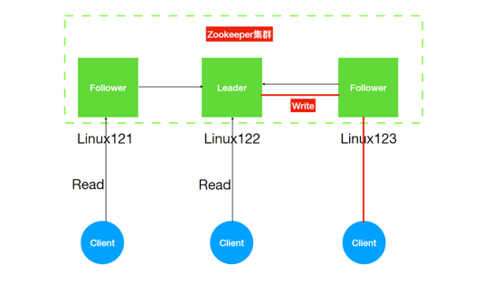

#### Leader

Zookeeper 集群⼯作的核⼼⻆⾊

- 集群内部各个服务器的调度者。
- 事务请求(写操作)的唯⼀调度和处理者，保证集群事务处理的顺序性；对于 create，setData， delete 等有写操作的请求，
  则需要统⼀转发给leader处理， leader需要决定编号、执⾏操作，这个过程称为⼀个事务。

#### Follower

- 处理客户端⾮事务(读操作)请求，
- 转发事务请求给 Leader；
- 参与集群 Leader 选举投票 2n-1 台可以做集群投票。
- 此外，针对访问量⽐较⼤的 zookeeper 集群，还可新增观察者⻆⾊。

#### Observer

- 观察者⻆⾊，观察 Zookeeper 集群的最新状态变化并将这些状态同步过来，其对于⾮事务请求可以进⾏独⽴处理，对于事务请求，则会转发给Leader服务器进⾏处理。

- 不会参与任何形式的投票只提供⾮事务服务，通常⽤于在不影响集群事务处理能⼒的前提下提升集群的⾮事务处理能⼒。增加了集群增加并发的读请求。

> ZK也是Master/slave架构，但是与之前不同的是zk集群中的Leader不是指定⽽来，⽽是通过选举产⽣。

### 1.3 Zookeeper 的特点

1. Zookeeper：⼀个领导者(leader:⽼⼤)，多个跟随者(follower:⼩弟)组成的集群。
2. Leader负责进⾏投票的发起和决议，更新系统状态(内部原理)
3. Follower⽤于接收客户请求并向客户端返回结果，在选举Leader过程中参与投票
4. 集群中只要有**半数**以上节点存活，Zookeeper集群就能正常服务。
5. 全局数据⼀致：每个server保存⼀份相同的数据副本，Client⽆论连接到哪个server，数据都是⼀致的。
6. 更新请求**顺序**进⾏(内部原理)
7. 数据更新原⼦性，⼀次数据更新要么成功，要么失败。

## 2. Zookeeper环境搭建

### 2.1 Zookeeper的搭建⽅式

Zookeeper安装⽅式有三种，单机模式和集群模式以及伪集群模式。

- 单机模式：Zookeeper只运⾏在⼀台服务器上，适合测试环境；
- 伪集群模式：就是在⼀台服务器上运⾏多个 Zookeeper 实例；
- 集群模式：Zookeeper运⾏于⼀个集群上，适合⽣产环境，这个计算机集群被称为⼀个"集合体"

### 2.2 Zookeeper集群搭建

#### 下载

⾸先我们下载稳定版本的zookeeper <http://zookeeper.apache.org/releases.html>

#### 上传

下载完成后，将zookeeper压缩包 zookeeper-3.4.14.tar.gz 上传到linux系统 `/opt/zmn/software`

#### 解压压缩包

```shell
# linux121
tar -zxvf zookeeper-3.4.14.tar.gz -C ../servers/
```

#### 修改配置⽂件创建data与log⽬录

```shell
#创建zk存储数据⽬录
mkdir -p /opt/zmn/servers/zookeeper-3.4.14/data
#创建zk⽇志⽂件⽬录
mkdir -p /opt/zmn/servers/zookeeper-3.4.14/data/logs
#修改zk配置⽂件
cd /opt/zmn/servers/zookeeper-3.4.14/conf

#⽂件改名
mv zoo_sample.cfg zoo.cfg

vim zoo.cfg

#更新datadir
dataDir=/opt/zmn/servers/zookeeper-3.4.14/data
#增加logdir
dataLogDir=/opt/zmn/servers/zookeeper-3.4.14/data/logs
#增加集群配置
##server.服务器ID=服务器IP地址：服务器之间通信端⼝：服务器之间投票选举端⼝
server.1=linux121:2888:3888
server.2=linux122:2888:3888
server.3=linux123:2888:3888
#打开注释
#ZK提供了⾃动清理事务⽇志和快照⽂件的功能，这个参数指定了清理频率，单位是⼩时
autopurge.purgeInterval=1
```

#### 添加myid配置

在zookeeper的 data ⽬录下创建⼀个 myid ⽂件，内容为1，这个⽂件就是记录每个服务器的ID

```shell
cd /opt/zmn/servers/zookeeper-3.4.14/data
echo 1 > myid
```

#### 安装包分发并修改myid的值

```shell
rsync-script /opt/zmn/servers/zookeeper-3.4.14

# 修改myid值 linux122
echo 2 > /opt/zmn/servers/zookeeper-3.4.14/data/myid
# 修改myid值 linux123
echo 3 > /opt/zmn/servers/zookeeper-3.4.14/data/myid
```

#### 启动和查看

```shell
# 启动命令(三个节点都要执⾏)
/opt/zmn/servers/zookeeper-3.4.14/bin/zkServer.sh start
# 查看zk启动情况
/opt/zmn/servers/zookeeper-3.4.14/bin/zkServer.sh status
```

集群启动停⽌脚本

```shell
# linux: /root/shells
vim zk.sh

#!/bin/sh
echo "start zookeeper server..."
if(($#==0));then
echo "no params";
exit;
fi
hosts="linux121 linux122 linux123"

for host in $hosts
do
ssh $host "source /etc/profile; /opt/zmn/servers/zookeeper-3.4.14/bin/zkServer.sh $1"
done
```

## 3. Zookeeper数据结构与监听机制

在ZooKeeper中，数据信息被保存在⼀个个数据节点上，这些节点被称为 **ZNode**。

ZNode 是 Zookeeper 中最⼩数据单位，在 ZNode 下⾯⼜可以再挂 ZNode，这样⼀层层下去就形成了⼀个层次化命名空间 ZNode 树，我们称为 ZNode Tree，它采⽤了类似⽂件系统的层级树状结构进⾏管理。
⻅下图示例：

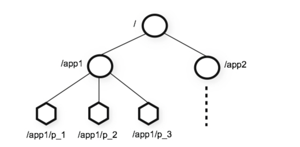

在 Zookeeper 中，每⼀个数据节点都是⼀个 ZNode，上图根⽬录下有两个节点，分别是：app1 和 app2，
其中 app1 下⾯⼜有三个⼦节点,所有ZNode按层次化进⾏组织，形成这么⼀颗树。

ZNode的节点路径标识⽅式和Unix⽂件系统路径⾮常相似，都是由⼀系列使⽤斜杠(/)进⾏分割的路径表示，开发⼈员可以向这个节点写⼊数据，也可以在这个节点下⾯创建⼦节点。

### 3.1 ZNode 的类型

Zookeeper的 ZNode tree是由⼀系列数据节点组成的，那接下来，我们就对数据节点做详细讲解。

Zookeeper 节点类型可以分为三⼤类：

- 持久性节点(Persistent)
- 临时性节点(Ephemeral)
- 顺序性节点(Sequential)

在开发中在创建节点的时候通过组合可以⽣成以下四种节点类型：持久节点、持久顺序节点、临时节点、临时顺序节点。

不同类型的节点则会有不同的⽣命周期

- 持久节点：是Zookeeper中最常⻅的⼀种节点类型，所谓持久节点，就是指节点被创建后会⼀直存在服务器，直到删除操作主动清除。
- 持久顺序节点：就是有顺序的持久节点，节点特性和持久节点是⼀样的，只是额外特性表现在顺序上。顺序特性实质是在创建节点的时候，会在节点名后⾯加上⼀个数字后缀，来表示其顺序。
- 临时节点：就是会被⾃动清理掉的节点，它的⽣命周期和客户端会话绑在⼀起，客户端会话结束，节点会被删除掉。与持久性节点不同的是，临时节点不能创建⼦节点。
- 临时顺序节点：就是有顺序的临时节点，和持久顺序节点相同，在其创建的时候会在名字后⾯加上数字后缀。


#### 事务ID

⾸先，事务是对物理和抽象的应⽤状态上的操作集合。往往在现在的概念中，狭义上的事务通常指的是数据库事务，
⼀般包含了⼀系列对数据库有序的读写操作，这些数据库事务具有所谓的ACID特性，即原⼦性(Atomic)、⼀致性(Consistency)、隔离性(Isolation)和持久性(Durability)。

⽽在ZooKeeper中，事务是指能够改变ZooKeeper服务器状态的操作，我们也称之为事务操作或更新操作，⼀般包括数据节点创建与删除、数据节点内容更新等操作。
对于每⼀个事务请求，ZooKeeper都会为其分配⼀个全局唯⼀的事务ID，⽤ ZXID 来表示，通常是⼀个 64 位的数字。每⼀个 ZXID 对应⼀次更新操作，
从这些ZXID中可以间接地识别出ZooKeeper处理这些更新操作请求的全局顺序。

> zk中的事务指的是对zk服务器状态改变的操作(create,update data,更新子节点)；zk对这些事务操作都会编号，这个编号是⾃增⻓的被称为ZXID。

### 3.2 ZNode 的状态信息

```shell
# 使⽤ bin/zkCli.sh 连接到zk集群
[zk: localhost:2181(CONNECTED) 0] get /zookeeper

cZxid = 0x0
ctime = Thu Jan 01 08:00:00 CST 1970
mZxid = 0x0
mtime = Thu Jan 01 08:00:00 CST 1970
pZxid = 0x0
cversion = -1
dataVersion = 0
aclVersion = 0
ephemeralOwner = 0x0
dataLength = 0
numChildren = 1
```

整个 ZNode 节点内容包括两部分：节点数据内容和节点状态信息。数据内容是空，其他的属于状态信息。

那么这些状态信息都有什么含义呢？

| 属性             | 描述                                                         |
|----------------|------------------------------------------------------------|
| cZxid          | 就是 Create ZXID，表示节点被创建时的事务ID。                              |
| ctime          | 就是 Create Time，表示节点创建时间。                                   |
| mZxid          | 就是 Modified ZXID，表示节点最后⼀次被修改时的事务ID。                        |
| mtime          | 就是 Modified Time，表示节点最后⼀次被修改的时间。                           |
| pZxid          | 表示该节点的⼦节点列表最后⼀次被修改时的事务 ID。只有⼦节点列表变更才会更新 pZxid，⼦节点内容变更不会更新。 |
| cversion       | 表示⼦节点的版本号。                                                 |
| dataVersion    | 表示内容版本号。                                                   |
| aclVersion     | 标识acl版本                                                    |
| ephemeralOwner | 表示创建该临时节点时的会话 sessionID，如果是持久性节点那么值为 0                     |
| dataLength     | 表示数据⻓度。                                                    |
| numChildren    | 表示直系⼦节点数。                                                  |

### 3.3 Watcher 机制

Zookeeper使⽤Watcher机制实现分布式数据的发布/订阅功能。

⼀个典型的发布/订阅模型系统定义了⼀种⼀对多的订阅关系，能够让多个订阅者同时监听某⼀个主题对象，当这个主题对象⾃身状态变化时，会通知所有订阅者，使它们能够做出相应的处理。

在 ZooKeeper 中，引⼊了 Watcher 机制来实现这种分布式的通知功能。ZooKeeper 允许客户端向服务端注册⼀个 Watcher 监听，
当服务端的⼀些指定事件触发了这个 Watcher，那么Zk就会向指定客户端发送⼀个事件通知来实现分布式的通知功能。

整个Watcher注册与通知过程如图所示。

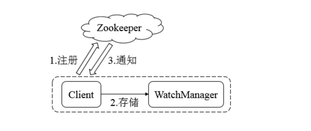

Zookeeper的Watcher机制主要包括客户端线程、客户端WatcherManager、Zookeeper服务器三部分。

具体⼯作流程为：

1. 客户端在向Zookeeper服务器注册的同时，会将Watcher对象存储在客户端的WatcherManager当中
2. 当Zookeeper服务器触发Watcher事件后，会向客户端发送通知
3. 客户端线程从WatcherManager中取出对应的Watcher对象来执⾏回调逻辑

## 4. Zookeeper的基本使⽤

### 4.1 ZooKeeper命令⾏操作

现在已经搭建起了⼀个能够正常运⾏的zookeeper服务了，所以接下来，就是来借助客户端来对zookeeper的数据节点进⾏操作。

⾸先，进⼊到zookeeper的bin⽬录之后，通过zkClient进⼊zookeeper客户端命令⾏

```shell
# ./zkcli.sh 连接本地的zookeeper服务器
./zkCli.sh -server ip:port(2181) 连接指定的服务器
```

连接成功之后，系统会输出Zookeeper的相关环境及配置信息等信息。输⼊help之后，屏幕会输出可⽤的Zookeeper命令，如下所示

```shell
[zk: localhost:2181(CONNECTED) 0] help
ZooKeeper -server host:port cmd args
        stat path [watch]
        set path data [version]
        ls path [watch]
        delquota [-n|-b] path
        ls2 path [watch]
        setAcl path acl
        setquota -n|-b val path
        history 
        redo cmdno
        printwatches on|off
        delete path [version]
        sync path
        listquota path
        rmr path
        get path [watch]
        create [-s] [-e] path data acl
        addauth scheme auth
        quit 
        getAcl path
        close 
        connect host:port
```

#### 创建节点

使⽤ create 命令，可以创建⼀个Zookeeper节点， 语法：

```shell
create [-s][-e] path data
# 其中，-s或-e分别指定节点特性，顺序或临时节点，若不指定，则创建持久节点
```

1. 创建顺序节点

使⽤ `create -s /zk-test 123` 命令创建zk-test顺序节点

```shell
[zk: localhost:2181(CONNECTED) 1] create -s /zk-test 123
Created /zk-test0000000000
```

执⾏完后，就在根节点下创建了⼀个叫做 `/zk-test` 的节点，该节点内容就是123，同时可以看到创建的zk-test节点后⾯添加了⼀串数字以示区别。

2. 创建临时节点

使⽤ `create -e /zk-temp 123` 命令创建zk-temp临时节

```shell
[zk: localhost:2181(CONNECTED) 2] create -e /zk-temp 123
Created /zk-temp
```

临时节点在客户端会话结束后，就会⾃动删除，下⾯使⽤quit命令退出客户端，再次使⽤客户端连接服务端，
并使⽤ `ls /` 命令查看根⽬录下的节点，可以看到根⽬录下已经不存在 `zk-temp` 临时节点了。

3. 创建永久节点

使⽤ `create /zk-permanent 123` 命令创建 `zk-permanent` 永久节点，可以看到永久节点不同于顺序节点，不会⾃动在后⾯添加⼀串数字

```shell
[zk: localhost:2181(CONNECTED) 3] create /zk-permanent 123
Created /zk-permanent
```

#### 读取节点

与读取相关的命令有 `ls` 命令和 `get` 命令

`ls` 命令可以列出Zookeeper指定节点下的所有⼦节点，但只能查看指定节点下的第⼀级的所有⼦节点；

```shell
ls path
# 其中，path表示的是指定数据节点的节点路径
```

`get` 命令可以获取Zookeeper指定节点的数据内容和属性信息。

```shell
get path
```

若获取根节点下⾯的所有⼦节点，使⽤ `ls /` 命令即可

若想获取 `/zk-permanent` 的数据内容和属性，可使⽤如下命令：`get /zk-permanent`

```shell
[zk: localhost:2181(CONNECTED) 1] get /zk-permanent
123
cZxid = 0x200000005
ctime = Wed Mar 02 09:37:10 CST 2022
mZxid = 0x200000005
mtime = Wed Mar 02 09:37:10 CST 2022
pZxid = 0x200000005
cversion = 0
dataVersion = 0
aclVersion = 0
ephemeralOwner = 0x0
dataLength = 3
numChildren = 0
```

从上⾯的输出信息中，我们可以看到，第⼀⾏是节点 `/zk-permanent` 的数据内容，其他⼏⾏则是创建该节点的事务ID(cZxid)、
最后⼀次更新该节点的事务ID(mZxid)和最后⼀次更新该节点的时间(mtime)等属性信息

#### 更新节点

使⽤set命令，可以更新指定节点的数据内容，⽤法如下

```shell
set path data
```

其中，`data` 就是要更新的新内容。

version 表示数据版本，在zookeeper中，节点的数据是有版本概念的，这个参数⽤于指定本次更新操作是基于Znode的哪⼀个数据版本进⾏的，
例如将 `/zk-permanent` 节点的数据更新为456，可以使⽤如下命令：`set /zk-permanent 456`

```shell
[zk: localhost:2181(CONNECTED) 2] set /zk-permanent 456
cZxid = 0x200000005
ctime = Wed Mar 02 09:37:10 CST 2022
mZxid = 0x200000008
mtime = Wed Mar 02 09:46:34 CST 2022
pZxid = 0x200000005
cversion = 0
dataVersion = 1
aclVersion = 0
ephemeralOwner = 0x0
dataLength = 3
numChildren = 0
[zk: localhost:2181(CONNECTED) 3] get /zk-permanent
456
cZxid = 0x200000005
ctime = Wed Mar 02 09:37:10 CST 2022
mZxid = 0x200000008
mtime = Wed Mar 02 09:46:34 CST 2022
pZxid = 0x200000005
cversion = 0
dataVersion = 1
aclVersion = 0
ephemeralOwner = 0x0
dataLength = 3
numChildren = 0
```

现在dataVersion已经变为1了，表示进⾏了更新

#### 删除节点

使⽤ `delete` 命令可以删除Zookeeper上的指定节点，⽤法如下

```shell
delete path
```

其中version也是表示数据版本，使⽤ `delete /zk-permanent` 命令即可删除 `/zk-permanent` 节点

可以看到，已经成功删除 `/zk-permanent` 节点。

> 值得注意的是，若删除节点存在⼦节点，那么⽆法删除该节点，必须先删除⼦节点，再删除⽗节点。

### 4.2 Zookeeper-开源客户端

ZkClient是Github上⼀个开源的zookeeper客户端，在Zookeeper原⽣API接⼝之上进⾏了包装，是⼀个更易⽤的Zookeeper客户端。
同时，zkClient在内部还实现了诸如Session超时重连、Watcher反复注册等功能。

接下来，还是从创建会话、创建节点、读取数据、更新数据、删除节点等⽅⾯来介绍如何使⽤zkClient这个zookeeper客户端

1. 创建项目，并添加依赖

```xml
<dependencies>
    <dependency>
        <groupId>org.apache.zookeeper</groupId>
        <artifactId>zookeeper</artifactId>
        <version>3.4.14</version>
    </dependency>
    <dependency>
        <groupId>com.101tec</groupId>
        <artifactId>zkclient</artifactId>
        <version>0.2</version>
    </dependency>
</dependencies>
```

2. 创建会话

使⽤ZkClient可以轻松的创建会话，连接到服务端。

```java
public class CreateSession {
    public static void main(String[] args) {
        ZkClient zkClient = new ZkClient("127.0.0.1:2181");
        System.out.println("ZooKeeper client created.");
    }
}
```

2. 创建节点
   
ZkClient提供了递归创建节点的接⼝，即其帮助开发者先完成⽗节点的创建，再创建⼦节点。

```java
public class CreateNodeSample {

  public static void main(String[] args) {
    // 先获取 zkclient 对象。client 与 zk 集群的通讯端口是：2181
    ZkClient zkClient = new ZkClient("linux121:2181");
    System.out.println("zkClient is ready ...");
    // 1.创建节点
    // createParents的值设置为true，可以递归创建节点
    zkClient.createPersistent("/zmn-client/zmn-c1", true);
    System.out.println("path is created.");
  }
  
}
```

> ZkClient通过设置createParents参数为true可以递归的先创建⽗节点，再创建⼦节点。

3. 删除节点

ZkClient提供了递归删除节点的接⼝，即其帮助开发者先删除所有⼦节点(存在)，再删除⽗节点。

4. 监听节点变化

```java
public class GetChildChange {
    public static void main(String[] args) throws InterruptedException {
        // 获取 zkclient 对象
        ZkClient zkClient = new ZkClient("linux121:2181");
        // 使用 zkclient 对象监听指定目录(监听一个不存在的目录: /zmn-client)，指定监听到通知之后的逻辑
        zkClient.subscribeChildChanges("/zmn-client",
                // 接收到通知后的逻辑
                (parentPath, currentChildren) -> {
                    // 打印节点信息
                    System.out.println(parentPath + " children changes, current children: " + currentChildren);
                });

        // 使用 zkclient 创建和删除节点，验证监听器运行
        zkClient.createPersistent("/zmn-client");
        Thread.sleep(1000); // 方便观察结果数据
        zkClient.createPersistent("/zmn-client/c1");
        Thread.sleep(1000); // 方便观察结果数据
        zkClient.delete("/zmn-client/c1");
        Thread.sleep(1000); // 方便观察结果数据
        zkClient.delete("/zmn-client");
        Thread.sleep(Integer.MAX_VALUE);
    }
}
```

- 监听器可以对不存在的目录进行监听
- 被监听⽬录下的⼦节点发⽣改变，可以接收到通知，通知中携带的数据有⼦节点列表
- 被监听⽬录本身的创建和删除也会被监听到

5. 获取数据(节点是否存在、更新、删除)

```java
public class GetDataChange {

    public static void main(String[] args) throws InterruptedException {
        // 获取 zkclient 数据对象
        ZkClient zkClient = new ZkClient("linux121:2181");
        // 设置自定义的序列化类型
        zkClient.setZkSerializer(new ZkStrSerializer());
        // 判断节点是否存在，不存在则创建并赋值
        boolean exists = zkClient.exists("/zmn-client");
        if (!exists) {
            zkClient.createEphemeral("/zmn-client", 123);
        }
        // 注册节点的数据改变监听器，接收监听后的处理逻辑
        zkClient.subscribeDataChanges("/zmn-client", new IZkDataListener() {
            @Override
            public void handleDataChange(String dataPath, Object data) throws Exception {
                // 定义接收通知之后的处理逻辑
                System.out.println(dataPath + " data is: " + data);
            }
            @Override
            public void handleDataDeleted(String dataPath) throws Exception {
                // 数据删除(节点删除)逻辑
                System.out.println(dataPath + " is deleted.");
            }
        });
        // 更新节点数据, 删除节点验证监听器
        Object data = zkClient.readData("/zmn-client");
        System.out.println(data);
        zkClient.writeData("/zmn-client", "new data");
        Thread.sleep(1000);
        zkClient.deleteRecursive("/zmn-client");
        Thread.sleep(Integer.MAX_VALUE);
    }
}
```

## 5. Zookeeper内部原理

### 5.1 Leader选举

#### 选举机制

- 半数机制：集群中半数以上机器存活，集群可⽤。(所以Zookeeper适合安装**奇数**台服务器)
- Zookeeper虽然在配置⽂件中并没有指定Master和Slave。但是，Zookeeper⼯作时，是有⼀个节点为Leader，其它为Follower，Leader是通过内部的选举机制产⽣的。

集群⾸次启动

假设有五台服务器组成的Zookeeper集群，它们的id从1-5，同时它们都是最新启动的，也就是没有历史数据，在存放数据量这⼀点上，都是⼀样的。
假设这些服务器依序启动，来看看会发⽣什么?

#### Zookeeper的选举机制

1. 服务器1启动，此时只有它⼀台服务器启动了，它发出去的报⽂没有任何响应，所以它的选举状态⼀直是LOOKING状态。
2. 服务器2启动，它与最开始启动的服务器1进⾏通信，互相交换⾃⼰的选举结果，由于两者都没有历史数据，所以id值较⼤的服务器2胜出，但是由于没有达到超过半数以上的服务器都同意选举它(这个例⼦中的半数以上是3)，所以服务器1、2还是继续保持LOOKING状态。

> 每个服务器都会投票给自己，但是此时 server2 的 ID 更大，server1 会改投 server2

3. 服务器3启动，根据前⾯的理论分析，服务器3成为服务器1、2、3中的⽼⼤，⽽与上⾯不同的是，此时有三台服务器选举了它，所以它成为了这次选举的Leader。
4. 服务器4启动，根据前⾯的分析，理论上服务器4应该是服务器1、2、3、4中最⼤的，但是由于前⾯已经有半数以上的服务器选举了服务器3，所以它只能接收当⼩弟的命了。
5. 服务器5启动，同4⼀样成为 follower。

集群⾮⾸次启动

每个节点在选举时都会参考⾃身节点的zxid值(事务ID)；优先选择zxid值⼤的节点称为Leader!!

### 5.2 ZAB⼀致性协议

#### 1. 分布式数据⼀致性问题

为什么会出现分布式数据⼀致性问题?

- 将数据复制到分布式部署的多台机器中，可以消除单点故障，防⽌系统由于某台(些)机器宕机导致的不可⽤。

- 通过负载均衡技术，能够让分布在不同地⽅的数据副本全都对外提供服务。有效提⾼系统性能。

在分布式系统中引⼊数据复制机制后，多台数据节点之间由于⽹络等原因很容易产⽣数据不⼀致的情况。

举例: 当客户端Client1将系统中的⼀个值K1由V1更新为V2，但是客户端Client2读取的是⼀个还没有同步更新的副本，K1的值依然是V1,这就导致了数据的不⼀致性。
其中，常⻅的就是主从数据库之间的复制延时问题。

#### 2. ZAB协议

ZK就是分布式⼀致性问题的⼯业解决⽅案，paxos是其底层理论算法(晦涩难懂著名)，其中zab，raft和众多开源算法是对paxos的⼯业级实现。
ZK没有完全采⽤paxos算法，⽽是使⽤了⼀种称为Zookeeper Atomic Broadcast(ZAB，Zookeeper原⼦消息⼴播协议)的协议作为其数据⼀致性的核⼼算法。

ZAB协议

*ZAB 协议是为分布式协调服务 Zookeeper 专⻔设计的⼀种⽀持崩溃恢复和原⼦⼴播协议。*

主备模式保证⼀致性

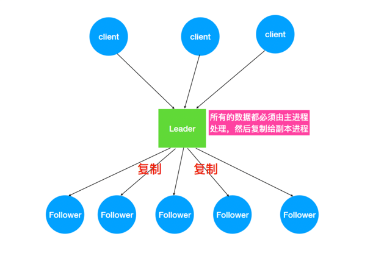

ZK怎么处理集群中的数据？所有客户端写⼊数据都是写⼊Leader中，然后由 Leader 复制到Follower 中。
ZAB会将服务器数据的状态变更以事务(Proposal)的形式⼴播到所有的副本进程上，ZAB协议能够保证事务操作拥有⼀个全局唯一的变更序号(ZXID)。

**⼴播消息**

ZAB 协议的消息⼴播过程类似于⼆阶段提交过程。对于客户端发送的写请求，全部由 Leader 接收，Leader 将请求封装成⼀个事务 Proposal(提议)，
将其发送给所有 Follower ，如果收到超过半数反馈ACK，则执⾏ Commit 操作(先提交⾃⼰，再发送 Commit 给所有 Follower)。

1. 发送Proposal到Follower

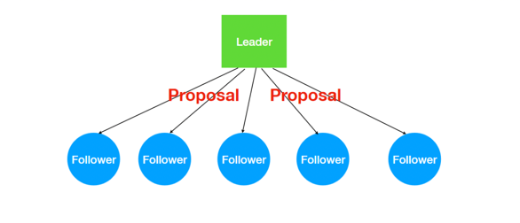

2. Leader接收Follower的ACK

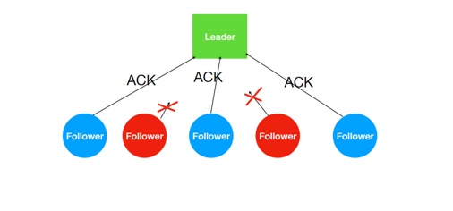

3. 超过半数ACK则Commit

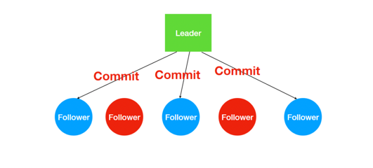

> 不能正常反馈的Follower恢复正常后会进⼊数据同步阶段，最终与Leader保持⼀致！！

**细节**

Leader接收到Client请求之后，会将这个请求封装成⼀个事务，并给这个事务分配⼀个全局递增的唯⼀ ID，称为事务ID(ZXID)，
ZAB 协议要求保证事务的顺序，因此必须将每⼀个事务按照 ZXID进⾏先后排序然后处理。

ZK集群为了保证任何事务操作能够有序的顺序执⾏，只能是 Leader 服务器接受写请求，即使是 Follower 服务器接受到客户端的请求，也会转发到 Leader 服务器进⾏处理。

> zk提供的应该属于是最终⼀致性的标准。
> 
> zk所有节点接收写请求之后可以在⼀定时间内保证所有节点都能看到该条数据！！

**Leader 崩溃问题**

Leader宕机后，ZK集群⽆法正常⼯作，ZAB协议提供了⼀个⾼效且可靠的leader选举算法。

Leader宕机后，被选举的新Leader需要解决的问题

- ZAB 协议确保那些已经在 Leader 提交的事务, 最终会被所有服务器提交。
- ZAB 协议确保丢弃那些只在 Leader 提出/复制，但没有被其他服务器提交的事务。

基于上⾯的⽬的，ZAB协议设计了⼀个选举算法：能够确保已经被Leader提交的事务被集群接受，丢弃还没有提交的事务。
这个选举算法的关键点：保证选举出的新Leader拥有集群中所有节点最⼤编号(ZXID)的事务!!

## 6. Zookeeper应⽤实践

ZooKeeper是⼀个典型的发布/订阅模式的分布式数据管理与协调框架，我们可以使⽤它来进⾏分布式数据的发布与订阅。
另⼀⽅⾯，通过对ZooKeeper中丰富的数据节点类型进⾏交叉使⽤，配合Watcher事件通知机制，可以⾮常⽅便地构建⼀系列分布式应⽤中都会涉及的核⼼功能，
如数据发布/订阅、命名服务、集群管理、Master选举、分布式锁和分布式队列等。那接下来就针对这些典型的分布式应⽤场景来做下介绍

Zookeeper的两⼤特性：

1. 客户端如果对Zookeeper的数据节点注册Watcher监听，那么当该数据节点的内容或是其⼦节点列表发⽣变更时，Zookeeper服务器就会向订阅的客户端发送变更通知。
2. 对在Zookeeper上创建的临时节点，⼀旦客户端与服务器之间的会话失效，那么临时节点也会被⾃动删除

利⽤其两⼤特性，可以实现集群机器存活监控系统，若监控系统在 `/clusterServers` 节点上注册⼀个Watcher监听，那么但凡进⾏动态添加机器的操作，
就会在 `/clusterServers` 节点下创建⼀个临时节点：`/clusterServers/[Hostname]`，这样，监控系统就能够实时监测机器的变动情况。

### 6.1 服务器动态上下线监听

分布式系统中，主节点会有多台，主节点可能因为任何原因出现宕机或者下线，⽽任意⼀台客户端都要能实时感知到主节点服务器的上下线。

思路分析：

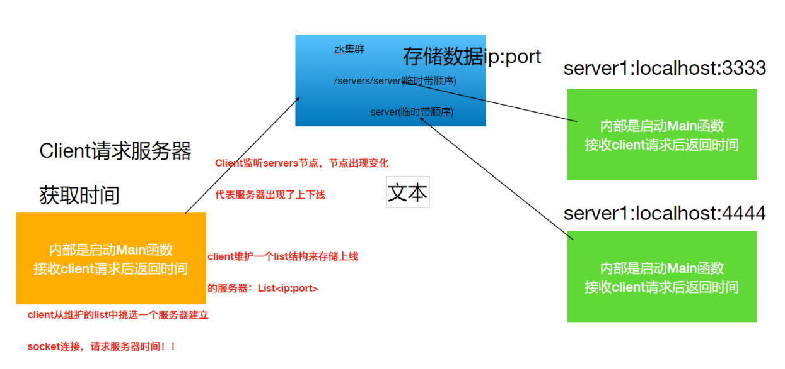

服务端

```java
public class Server {

    // 获取 ZkClient
    ZkClient zkClient = null;
    private void connectZk() {
        zkClient =  new ZkClient("linux121:2181,linux122:2181");
        // 创建服务端建立临时节点的目录
        if (!zkClient.exists("/servers")) {
            zkClient.createPersistent("/servers");
        }
    }

    // 在ZNode节点保存Server相关信息
    private void saveServerInfo(String ip, String port) {
        zkClient.createEphemeralSequential("/servers/server", ip + ":" + port);
        System.out.println(" ===> Server: " + ip + ":" + port + ", 向 ZK 保存信息成功, 成功上线可以接受 Client 查询");
    }

    public static void main(String[] args) {
        // 准备两个服务端启动上线(此处使用多线程模拟，一个线程代表一个服务器)
        Server server = new Server();
        server.connectZk();
        server.saveServerInfo(args[0], args[1]);
        // 提供时间服务的线程没有启动. 创建一个线程类，可以接受 socket 请求
        new TimeService(Integer.parseInt(args[1])).start();
    }
}
```

```java
public class TimeService extends Thread {

    private final int port;

    public TimeService(int port) {
        this.port = port;
    }

    @Override
    public void run() {
        // 通过 socket 与 Client 交流，启动 ServerSocket 监听请求
        try {
            // 指定监听的端口
            ServerSocket serverSocket = new ServerSocket(port);
            // 保证服务端一直运行
            while (true) {
                Socket socket = serverSocket.accept();
                // 获取 Client 发送的内容, 不关心 Client 发送的内容, Server 直接发送时间值
                socket.getOutputStream().write(new Date().toString().getBytes(StandardCharsets.UTF_8));
            }
        } catch (IOException e) {
            e.printStackTrace();
        }
    }
}
```

客户端

```java
public class Client {

    // 获取 ZkClient
    ZkClient zkClient = null;
    // 维护一个 Server 信息集合
    ArrayList<String> infoList = new ArrayList<>();
    private void connectZk() {
        zkClient = new ZkClient("linux121:2181,linux122:2181");
        // 首次获取服务器信息(获取所有子节点)
        List<String> children = zkClient.getChildren("/servers");
        for (String child : children) {
            // 存储着 ip:port
            Object data = zkClient.readData("/servers/" + child);
            infoList.add(String.valueOf(data));
        }

        // 对 /servers 目录进行监听
        zkClient.subscribeChildChanges("/servers", (parentPath, currentChildren) -> {
            // 接收到通知，说明节点发生了变化，需要更新 infoList 集合中的数据
            ArrayList<String> list = new ArrayList<>();
            // 遍历更新过后的所有节点信息
            for (String child : currentChildren) {
                Object data = zkClient.readData("/servers" + child);
                list.add(String.valueOf(data));
            }
            // 最新数据覆盖老数据
            infoList = list;
            System.out.println("接收到通知，最新的服务器信息为：" + infoList);
        });
    }

    // 发送时间查询的请求
    private void sendRequest() throws IOException {
        // 目标服务器地址
        Random random = new Random();
        int i = random.nextInt(infoList.size());
        String server = infoList.get(i);
        String[] arr = server.split(":");

        // 建立 socket 连接
        Socket socket = new Socket(arr[0], Integer.parseInt(arr[1]));
        OutputStream outputStream = socket.getOutputStream();
        InputStream inputStream = socket.getInputStream();

        // 发送数据
        outputStream.write("query time".getBytes(StandardCharsets.UTF_8));
        outputStream.flush();

        // 接收返回结果
        byte[] bytes = new byte[1024];
        inputStream.read(bytes);
        System.out.println("client 接收到 server" + server + " 返回结果：" + new String(bytes));

        // 释放资源
        inputStream.close();
        outputStream.close();
        socket.close();
    }

    public static void main(String[] args) throws IOException, InterruptedException {
        Client client = new Client();
        client.connectZk();     // 监听
        while (true) {
            client.sendRequest();
            // 每隔几秒发送一次请求
            Thread.sleep(2000);
        }
    }
}
```

> 此处思想理解就好，示例代码其实是有问题的，`infoList` 的更新并不安全。

### 6.2 分布式锁

#### 1. 什么是锁
   
在单机程序中，当存在多个线程可以同时改变某个变量(可变共享变量)时，为了保证线程安全(不出现脏数据)就需要对变量或代码块做同步，
使其在修改这种变量时能够串⾏执⾏，消除并发修改变量。

对变量或者堆代码块做同步本质上就是加锁。⽬的就是实现多个线程在⼀个时刻同⼀个代码块只能有⼀个线程可执⾏。

#### 2. 分布式锁

分布式的环境中会不会出现脏数据的情况呢？类似单机程序中线程安全的问题。观察下⾯的例⼦

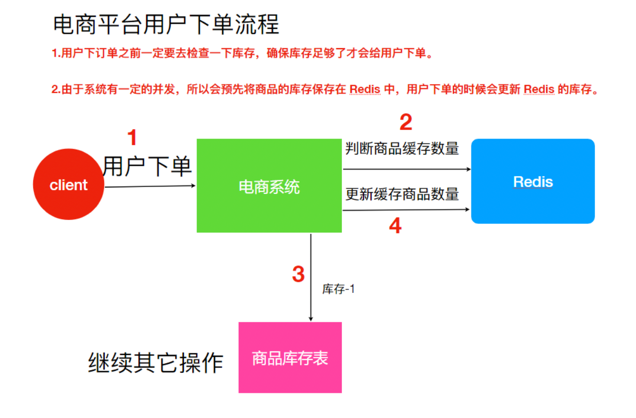

上⾯的设计是存在线程安全问题。

**问题**

假设Redis ⾥⾯的某个商品库存为 1；此时两个⽤户同时下单，其中⼀个下单请求执⾏到第 3 步，更新数据库的库存为 0，但是第 4 步还没有执⾏。
⽽另外⼀个⽤户下单执⾏到了第 2 步，发现库存还是 1，就继续执⾏第 3 步。但是商品库存已经为0，所以如果数据库没有限制就会出现超卖的问题。

**解决⽅法**

⽤锁把 2、3、4 步锁住，让他们执⾏完之后，另⼀个线程才能进来执⾏。

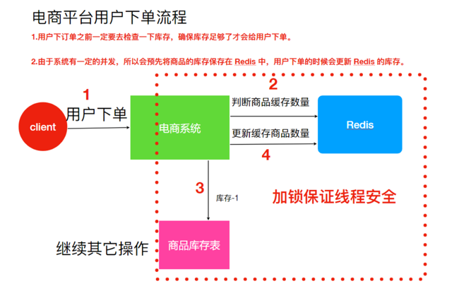

公司业务发展迅速，系统应对并发不断提⾼，解决⽅案是要增加⼀台机器，结果会出现更⼤的问题

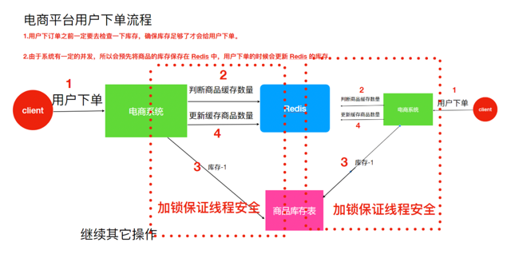

假设有两个下单请求同时到来，分别由两个机器执⾏，那么这两个请求是可以同时执⾏了，依然存在超卖的问题。

因为如图所示系统是运⾏在两个不同的 JVM ⾥⾯，不同的机器上，增加的锁只对⾃⼰当前 JVM ⾥⾯的线程有效，对于其他 JVM 的线程是⽆效的。
所以现在已经不是线程安全问题。需要保证两台机器加的锁是同⼀个锁，此时分布式锁就能解决该问题。

分布式锁的作⽤：在整个系统提供⼀个全局、唯⼀的锁，在分布式系统中每个系统在进⾏相关操作的时候需要获取到该锁，才能执⾏相应操作。

#### 3. zk实现分布式锁

利⽤Zookeeper可以创建临时带序号节点的特性来实现⼀个分布式锁。

实现思路

- 锁就是zk指定⽬录下序号最⼩的临时序列节点，多个系统的多个线程都要在此⽬录下创建临时的顺序节点，因为Zk会为我们保证节点的顺序性，所以可以利⽤节点的顺序进⾏锁的判断。

- 每个线程都是先创建临时顺序节点，然后获取当前⽬录下最⼩的节点(序号)，判断最⼩节点是不是当前节点，如果是那么获取锁成功，如果不是那么获取锁失败。

- 获取锁失败的线程获取当前节点上⼀个临时顺序节点，并对对此节点进⾏监听，当该节点删除的时候(上⼀个线程执⾏结束删除或者是掉线zk删除临时节点)这个线程会获取到通知，代表获取到了锁。

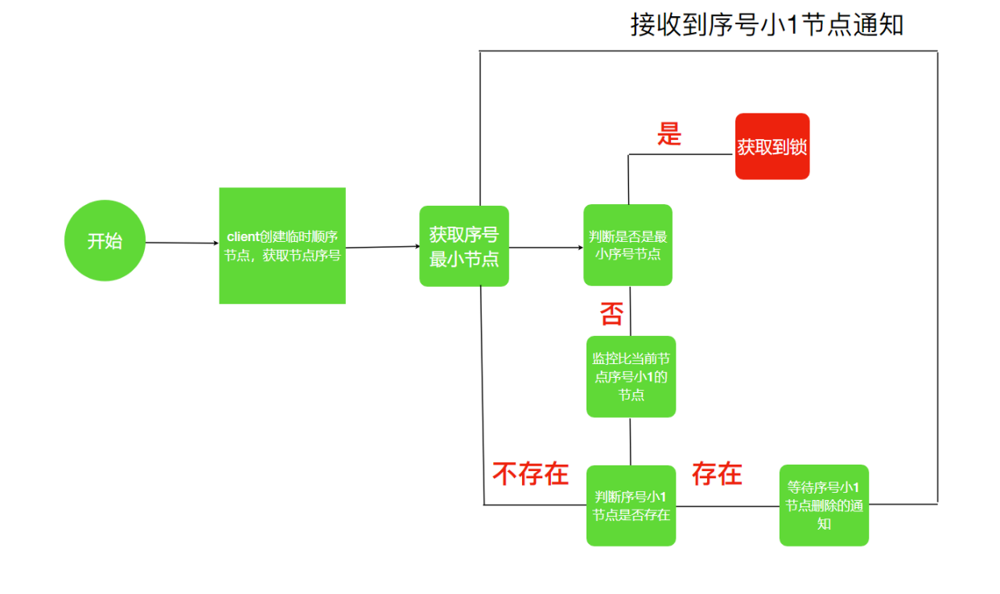

**代码实现**

测试主类

```java{7,17,24}
public class DisLockTest {

    public static void main(String[] args) {
        // 使用 10 个线程模拟分布式环境
        //使⽤10个线程模拟分布式环境
        for (int i = 0; i < 10; i++) {
            new Thread(new DisLockRunnable()).start();//启动线程
        }
    }

    static class DisLockRunnable implements Runnable {

        @Override
        public void run() {
            // 每个线程具体的任务(任务就是抢锁)
            DisClient client = new DisClient();
            client.getDisLock();    // 获取锁
            // 模拟获取线程的业务处理
            try {
                Thread.sleep(2000);
            } catch (InterruptedException e) {
                e.printStackTrace();
            }
            client.deleteLock();    // 释放锁
        }
    }

}
```

锁实现

```java{14,82,93}
public class DisClient {

    // 1.去 ZK 中创建临时顺序节点, 并获取到序号
    // 2.判断自己创建的节点的序号是否是当前节点最小序号; 如果是, 则获取锁, 并执行相关操作, 最后释放锁;
    // 3.如果不是最小节点, 需要等待前一个序号的节点被删除, 然后再次判断当前节点是否是最小节点

    // 获取 ZKClient
    private final ZkClient zkClient = new ZkClient("linux121:2181,linux122:2181");

    // 初始化 ZK 的分布式锁根节点
    String lockRootPath = "/distribute";

    public DisClient() {
        synchronized (DisClient.class) {
            if (!zkClient.exists(lockRootPath)) {
                zkClient.createPersistent(lockRootPath);
            }
        }
    }

    // 把抢锁过程分为两步: 1.创建节点,比较序号; 2.等待锁
    // 完整获取锁方法
    public void getDisLock() {
        // 首先调用 tryGetLock
        if (tryGetLock()) {
            // 说明获取到锁
            System.out.println(Thread.currentThread().getName() + " ==> get lock");
        } else {
            // 没有获取到锁
            System.out.println(Thread.currentThread().getName() + " ==> get lock failed, waiting ... ");
            waitForLock();
            // 递归获取锁
            getDisLock();
        }
    }

    String lockPath = "/distribute/"; // 在此路径下创建的临时顺序节点, 节点名称直接就是序列号(可以理解为子节点前缀为 "")
    String currentNodePath; // 当前节点路径
    String beforeNodePath;  // 前一个节点路径

    // 尝试获取锁.
    public boolean tryGetLock() {

        // 创建临时顺序节点
        if (null == currentNodePath || "".equals(currentNodePath)) {
            currentNodePath = zkClient.createEphemeralSequential(lockPath, "lock");
        }
        // 获取当前路径下所有节点数据, 并找出最小序号
        List<String> children = zkClient.getChildren(lockRootPath);
        Collections.sort(children);
        String minNode = children.get(0);
        // 判断自己创建节点是否与最小节点一致
        if (currentNodePath.equals(lockPath + minNode)) {
            // 当前线程创建的就是序号最小节点
            return true;
        } else {
            // 最小节点不是自己创建的
            // 监控当前节点序号的前一个节点
            int i = Collections.binarySearch(children, currentNodePath.substring(lockPath.length()));
            String lastNode = children.get(i - 1);
            beforeNodePath = lockPath + lastNode;
        }
        return false;
    }

    CountDownLatch countDownLatch = null; // 线程同步计数器. 数值变为 0, 线程唤醒.

    // 等待之前节点释放锁
    // 如何判断锁被释放? 需要唤醒线程, 继续尝试 tryGetLock
    public void waitForLock() {

        // 监控前一个节点
        IZkDataListener listener = new IZkDataListener() {
            @Override
            public void handleDataChange(String dataPath, Object data) throws Exception {
            }

            // 数据删除
            @Override
            public void handleDataDeleted(String dataPath) throws Exception {
                // 提醒当前线程再次获取锁
                countDownLatch.countDown(); // 每执行一次, 值 -1
            }
        };
        zkClient.subscribeDataChanges(beforeNodePath, listener);

        // 在监听的通知没来之前,该线程应该是等待状态
        // 先判断一次上一个节点是否还存在
        if (zkClient.exists(beforeNodePath)) {
            // 开始等待
            countDownLatch = new CountDownLatch(1);
            try {
                countDownLatch.await(); // 阻塞. 如果 accountDownLatch 由 1 变成 0, 唤醒线程
            } catch (InterruptedException e) {
                e.printStackTrace();
            }
        } else {
            // 解除监听
            zkClient.unsubscribeDataChanges(beforeNodePath, listener);
        }
    }

    // 释放锁
    public void deleteLock() {
        if (zkClient != null) {
            zkClient.delete(currentNodePath);
            zkClient.close();
        }
    }
}
```

> 分布式锁的实现可以是 Redis、Zookeeper，相对来说⽣产环境如果使⽤分布式锁可以考虑使⽤Redis实现⽽⾮Zk。

## 7. Hadoop HA

### 7.1 HA 概述

1. 所谓HA(High Available)，即⾼可⽤(7*24⼩时不中断服务)。
2. 实现⾼可⽤最关键的策略是消除单点故障。Hadoop-HA严格来说应该分成各个组件的HA机制：HDFS的HA 和 YARN的HA。
3. Hadoop2.0之前，在HDFS集群中NameNode存在单点故障(SPOF)
4. NameNode主要在以下两个⽅⾯影响HDFS集群
   
- NameNode机器发⽣意外，如宕机，集群将⽆法使⽤，直到管理员重启
- NameNode机器需要升级，包括软件、硬件升级，此时集群也将⽆法使⽤
  
HDFS HA 功能通过配置 Active/Standby 两个NameNodes实现在集群中对NameNode的热备来解决上述问题。
如果出现故障，如机器崩溃或机器需要升级维护，这时可通过此种⽅式将NameNode很快的切换到另外⼀台机器。

### 7.2 HDFS-HA ⼯作机制

> 通过双NameNode消除单点故障(Active/Standby)

#### 2.1 HDFS-HA⼯作要点

1. 元数据管理⽅式需要改变
   
- 内存中各⾃保存⼀份元数据；
- Edits⽇志只有Active状态的NameNode节点可以做写操作；
- 两个 NameNode 都可以读取Edits；
- 共享的Edits放在⼀个共享存储中管理(qjournal和NFS两个主流实现)

2. 需要⼀个状态管理功能模块
   
实现了⼀个zkfailover，常驻在每⼀个 NameNode 所在的节点，每⼀个 zkfailover 负责监控⾃⼰所在 NameNode 节点，
利⽤zk进⾏状态标识，当需要进⾏状态切换时，由zkfailover来负责切换，切换时需要防⽌ brain split(脑裂)现象的发⽣(集群中出现两个Active状态的NameNode)

3. 必须保证两个NameNode之间能够SSH⽆密码登录
4. 隔离(Fence)，即同⼀时刻仅仅有⼀个NameNode对外提供服务

#### 2.2 HDFS-HA⼯作机制

配置部署HDFS-HA进⾏⾃动故障转移。⾃动故障转移为HDFS部署增加了两个新组件：ZooKeeper和ZKFailoverController(ZKFC)进程，
ZooKeeper是维护少量协调数据，通知客户端这些数据的改变和监视客户端故障的⾼可⽤服务。HA的⾃动故障转移依赖于ZooKeeper的以下功能：

- 故障检测

集群中的每个NameNode在ZooKeeper中维护了⼀个临时会话，如果机器崩溃，ZooKeeper中的会话将终⽌，
ZooKeeper通知另⼀个NameNode需要触发故障转移。

- 现役NameNode选择

ZooKeeper提供了⼀个简单的机制⽤于唯⼀的选择⼀个节点为active状态。如果⽬前现役 NameNode 崩溃，
另⼀个节点可能从ZooKeeper获得特殊的排外锁以表明它应该成为现役 NameNode。

ZKFC 是⾃动故障转移中的另⼀个新组件，是ZooKeeper的客户端，也监视和管理NameNode的状态。每个运⾏NameNode的主机也运⾏了⼀个ZKFC进程，ZKFC负责：

- 健康监测

ZKFC使⽤⼀个健康检查命令定期地ping与之在相同主机的NameNode，只要该NameNode及时地回复健康状态，ZKFC认为该节点是健康的。
如果该节点崩溃，冻结或进⼊不健康状态，健康监测器标识该节点为⾮健康的。

- ZooKeeper会话管理

当本地NameNode是健康的，ZKFC保持⼀个在ZooKeeper中打开的会话。如果本地NameNode处于active状态，ZKFC 也保持⼀个特殊的 ZNode 锁，
该锁使⽤了ZooKeeper对短暂节点的⽀持，如果会话终⽌，锁节点将⾃动删除。

- 基于ZooKeeper的选择

如果本地NameNode是健康的，且ZKFC发现没有其它的节点当前持有 ZNode 锁，它将为⾃⼰获取该锁。
如果成功，则它已经赢得了选择，并负责运⾏故障转移进程以使它的本地NameNode为Active。
故障转移进程与前⾯描述的⼿动故障转移相似，⾸先如果必要保护之前的现役 NameNode，然后本地NameNode转换为Active状态。

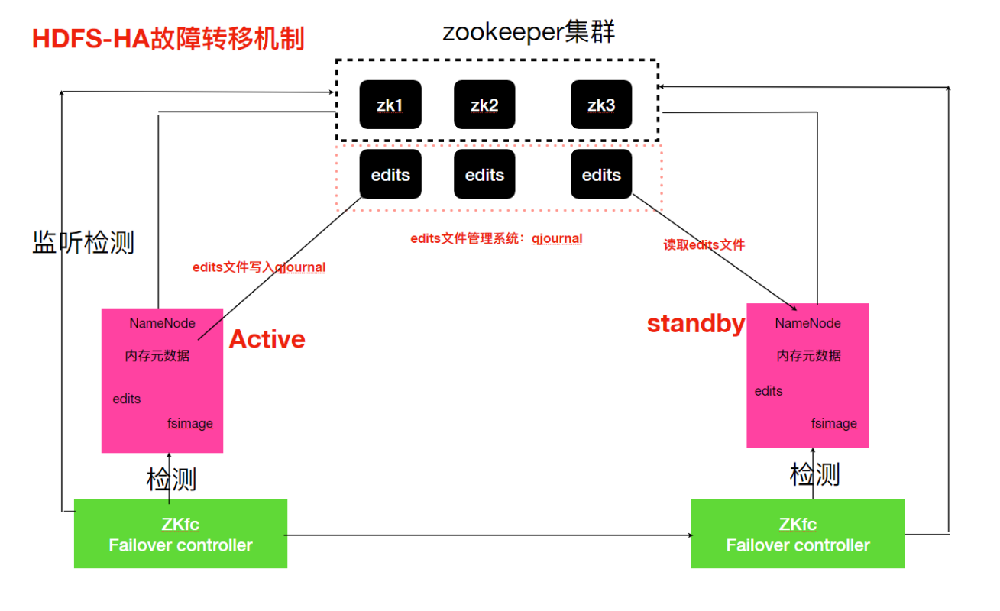

### 7.3 HDFS-HA集群配置

<https://hadoop.apache.org/docs/stable/hadoop-project-dist/hadoop-hdfs/HDFSHighAvailabilityWithQJM.html>

#### 3.1 环境准备

1. 修改IP
2. 修改主机名及主机名和IP地址的映射
3. 关闭防⽕墙
4. ssh免密登录
5. 安装JDK，配置环境变量等

#### 3.2 集群规划

| 机器       | NameNode | JournalNode | DataNode | ZK  | ResourceManager | NodeManager |
|----------|:--------:|:-----------:|:--------:|:---:|:---------------:|:-----------:|
| linux121 |    ✔     |      ✔      |    ✔     |  ✔  |                 |      ✔      |
| linux122 |    ✔     |      ✔      |    ✔     |  ✔  |        ✔        |      ✔      |
| linux123 |          |      ✔      |    ✔     |  ✔  |                 |      ✔      |

#### 3.3 启动Zookeeper集群

启动zookeeper集群

```shell
zk.sh start
```

查看状态

```shell
zk.sh status
```

#### 3.4 配置HDFS-HA集群

1. 停⽌原先HDFS集群

```shell
stop-dfs.sh
```

2. 在所有节点，/opt/zmn/servers ⽬录下创建⼀个ha⽂件夹

```shell
mkdir /opt/zmn/servers/ha
```

3. 将 /opt/zmn/servers/ ⽬录下的 hadoop-2.9.2 拷⻉到ha⽬录下

```shell
cd /opt/zmn/servers/
cp -r hadoop-2.9.2 ha
```

4. 删除原集群data⽬录

```shell
rm -rf /opt/zmn/servers/ha/hadoop-2.9.2/data
```

5. 配置hdfs-site.xml

```xml{4,8}
<configuration>
  <property>
    <name>dfs.nameservices</name>
    <value>zmncluster</value>
  </property>
  <property>
    <name>dfs.ha.namenodes.zmncluster</name>
    <value>nn1,nn2</value>
  </property>
  <property>
    <name>dfs.namenode.rpc-address.zmncluster.nn1</name>
    <value>linux121:9000</value>
  </property>
  <property>
    <name>dfs.namenode.rpc-address.zmncluster.nn2</name>
    <value>linux122:9000</value>
  </property>
  <property>
    <name>dfs.namenode.http-address.zmncluster.nn1</name>
    <value>linux121:50070</value>
  </property>
  <property>
    <name>dfs.namenode.http-address.zmncluster.nn2</name>
    <value>linux122:50070</value>
  </property>
  <property>
    <name>dfs.namenode.shared.edits.dir</name>
    <value>qjournal://linux121:8485;linux122:8485;linux123:8485/zmn</value>
  </property>

  <!-- 故障自动切换提供者类 -->
  <property>
    <name>dfs.client.failover.proxy.provider.zmncluster</name>
    <value>org.apache.hadoop.hdfs.server.namenode.ha.ConfiguredFailoverProxyProvider</value>
  </property>
  <!-- 隔离机制 -->
  <property>
    <name>dfs.ha.fencing.methods</name>
    <value>sshfence</value>
  </property>
  <property>
    <name>dfs.ha.fencing.ssh.private-key-files</name>
    <value>/root/.ssh/id_rsa</value>
  </property>
  <property>
    <name>dfs.journalnode.edits.dir</name>
    <value>/opt/journalnode</value>
  </property>
  <property>
    <name>dfs.ha.automatic-failover.enabled</name>
    <value>true</value>
  </property>
</configuration>
```

6. 配置core-site.xml

```xml
<configuration>
  <property>
    <name>fs.defaultFS</name>
    <value>hdfs://zmncluster</value>
  </property>
  <property>
    <name>hadoop.tmp.dir</name>
    <value>/opt/zmn/servers/ha/hadoop-2.9.2/data/tmp</value>
  </property>
  <property>
    <name>ha.zookeeper.quorum</name>
    <value>linux121:2181,linux122:2181,linux123:2181</value>
  </property>
</configuration>
```

7. 拷⻉配置好的hadoop环境到其他节点

```shell
rsync-script /opt/zmn/servers/ha/hadoop-2.9.2/
```

#### 3.5 启动HDFS-HA集群

1. 在各个JournalNode节点上，输⼊以下命令启动journalnode服务(去往HA安装⽬录，不要使⽤环境变量中命令)

```shell
/opt/zmn/servers/ha/hadoop-2.9.2/sbin/hadoop-daemon.sh start journalnode
```

2. 在 `[nn1]` (linux121)上，对其进⾏格式化，并启动

```shell
/opt/zmn/servers/ha/hadoop-2.9.2/bin/hdfs namenode -format
/opt/zmn/servers/ha/hadoop-2.9.2/sbin/hadoop-daemon.sh start namenode
```

3. 在 `[nn2]` (linux122)上，同步 `nn1` 的元数据信息

```shell
/opt/zmn/servers/ha/hadoop-2.9.2/bin/hdfs namenode -bootstrapStandby
```

4. 在 `[nn1]` (linux121)上初始化zkfc

```shell
/opt/zmn/servers/ha/hadoop-2.9.2/bin/hdfs zkfc -formatZK
```

5. 在 `[nn1]` (linux121)上，启动集群

```shell
/opt/zmn/servers/ha/hadoop-2.9.2/sbin/start-dfs.sh
```

6. 验证
   
将Active NameNode进程 kill

```shell
kill -9 namenode的进程id
```

### 7.4 YARN-HA配置

#### 4.1 YARN-HA⼯作机制

1. 官⽅⽂档

<https://hadoop.apache.org/docs/stable/hadoop-yarn/hadoop-yarn-site/ResourceManagerHA.html>

2. YARN-HA⼯作机制，如图所示


#### 4.2 配置YARN-HA集群

1. 环境准备

- 修改IP
- 修改主机名及主机名和IP地址的映射
- 关闭防⽕墙
- ssh免密登录
- 安装JDK，配置环境变量等
- 配置Zookeeper集群

2. 规划集群

ResourceManager 在 linux122, linux123 各一台

3. 具体配置

yarn-site.xml

```xml
<configuration>
  <property>
    <name>yarn.nodemanager.aux-services</name>
    <value>mapreduce_shuffle</value>
  </property>
  <!--启⽤resourcemanager ha-->
  <property>
    <name>yarn.resourcemanager.ha.enabled</name>
    <value>true</value>
  </property>
  <!--声明两台resourcemanager的地址-->
  <property>
    <name>yarn.resourcemanager.cluster-id</name>
    <value>cluster-yarn</value>
  </property>
  <property>
    <name>yarn.resourcemanager.ha.rm-ids</name>
    <value>rm1,rm2</value>
  </property>
  <property>
    <name>yarn.resourcemanager.hostname.rm1</name>
    <value>linux122</value>
  </property>
  <property>
    <name>yarn.resourcemanager.hostname.rm2</name>
    <value>linux123</value>
  </property>
  <!--指定zookeeper集群的地址-->
  <property>
    <name>yarn.resourcemanager.zk-address</name>
    <value>linux121:2181,linux122:2181,linux123:2181</value>
  </property>
  <!--启⽤⾃动恢复-->
  <property>
    <name>yarn.resourcemanager.recovery.enabled</name>
    <value>true</value>
  </property>
  <!--指定resourcemanager的状态信息存储在zookeeper集群-->
  <property>
    <name>yarn.resourcemanager.store.class</name>
    <value>org.apache.hadoop.yarn.server.resourcemanager.recovery.ZKRMStateStore</value>
  </property>
</configuration>
```

同步更新其他节点的配置信息

```shell
rsync-script yarn-site.xml
```

启动hdfs

```shell
# 在 linux123 上面启动
/opt/zmn/servers/ha/hadoop-2.9.2/sbin/start-yarn.sh
# 在 linux122 上还需要再次启动
/opt/zmn/servers/ha/hadoop-2.9.2/sbin/yarn-daemon.sh start resourcemanager
```

> 访问 linux122:8088 会自动跳转到 linux123:8088

