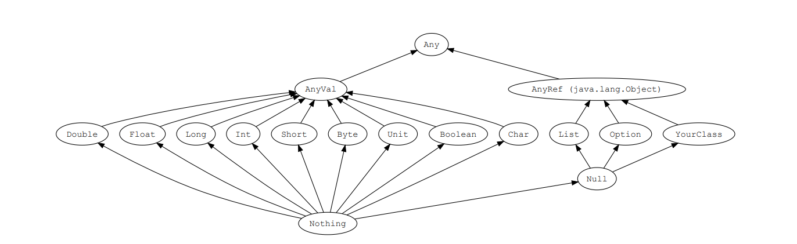

# Scala编程

## 第一部分 Scala 基础

### 第1节 Scala语言概况

#### 1.1 Scala语言起源

马丁·奥德斯基（Martin Odersky）是编译器及编程的狂热爱好者。

主流JVM的Javac编译器就是马丁·奥德斯基编写出来的，JDK5.0、JDK8.0的编译器就是他写的。

长时间的编程之后，他希望发明一种语言，能够让写程序这样的基础工作变得高效，简单。

当接触到Java语言后，对Java这门语言产生了极大的兴趣，所以决定将函数式编程语言的特点融合到 Java 中，由此发明了Scala。

#### 1.2 Scala语言特点

Scala是一门以 JVM 为运行环境并将面向对象和函数式编程的最佳特性结合在一起的静态类型编程语言。

Scala源代码会被编译成Java字节码，然后运行于JVM之上，并可以调用现有的Java类库，实现两种语言的无缝互操作的。

- 面向对象

Scala是一种面向对象的语言。

Scala中的每个值都是一个对象，包括基本数据类型（即布尔值、数字等）在内，连函数也是对象。

- 函数式编程

Scala也是一种函数式语言，其函数也能当成值来使用。

Scala中支持高阶函数，允许嵌套多层函数，并支持柯里化。

Scala提供了模式匹配，可以匹配各种情况，比如变量的类型、集合的元素、有值或无值。

- 静态类型

Scala具备类型系统，通过编译时检查，保证代码的安全性和一致性。

- 并发性

Scala使用Actor作为其并发模型，Actor是类似线程的实体。

Actor可以复用线程，因此可以在程序中使用数百万个Actor，而线程只能创建数千个。

#### 1.3 为什么要学Scala

优雅：这是框架设计师第一个要考虑的问题，框架的用户是应用开发程序员，API是否优雅直接影响用户体验。

简洁：Scala语言表达能力强，一行代码抵得上Java多行，开发速度快。

融合大数据生态圈：Hadoop现在是大数据事实标准，(Kafka, Spark源码都是用Scala编写的，Spark, Flink 都支持使用Scala进行开发)

> Spark并不是要取代Hadoop，而是要完善Hadoop生态。

### 第2节 环境准备

Scala官网：<https://www.scala-lang.org/>

#### 2.1 Windows下环境配置

访问Scala官网下载Scala 2.11.8安装包，下载地址：<https://www.scala-lang.org/download/2.11.8.html>

下载 `scala-2.11.8.msi` 后，点击下一步就可以了（自动配置上环境变量）。

也可以下载 scala-2.11.8.zip，解压后配置上环境变量就可以了。

> 备注：安装Scala之前，Windows系统需要安装JDK。

```shell
scala -version
```

#### 2.2 IDEA环境配置

IDEA是 Java 的集成开发环境，要支持Scala开发，需要安装Scala插件；

HelloWorld

```scala{}
object HelloScala {

  def main(args: Array[String]): Unit = {
    println("Hello world!")
  }

}
```

#### 2.3 Scala的REPL

在命令行输入 `Scala` 可启动Scala REPL。

REPL 是一个交互式解析器环境，R(read)、E(evaluate) 、P（print）、L（loop）输入值，交互式解析器会读取输入内容并对它求值，再打印结果，并重复此过程。

### 第3节 基础语法

基础语法规则：

区分大小写 - Scala语言对大小写敏感；

类名 - 对于所有的类名的第一个字母要大写。如果需要使用几个单词来构成一个类名，每个单词的第一个字母要大写；比如: `ListDemo`

方法名 - 所有方法名的第一个字母用小写。如果需要使用几个单词来构成方法名，除第一个单词外每个词的第一个字母应大写(小驼峰)；比如：`getResult`

程序文件名 - Scala程序文件的后缀名是 `.scala`，程序文件的名称可以不与对象名称完全匹配。这点与Java有所区别。

> 备注：建议遵循 Java 的惯例，程序文件名称与对象名称匹配；

`main()` 方法 - Scala程序从 `main()` 方法开始处理，这是每一个Scala程序的入口点。`main()`定义在 `object` 中；

> object 相当于 Java 中的单例对象

标识符 - 所有Scala组件都需要名称，用于对象、类、变量和方法的名称称为标识符。

> 关键字不能用作标识符，标识符**区分大小写**；标识符以字母或下划线开头，后面可以有更多的字母、数字或下划线；`$` 字符是Scala中的保留关键字，不能在标识符中使用；

注释 - Scala使用了与Java相同的单行和多行注释；

换行符 - Scala语句可以用分号作为一行的结束，语句末尾的分号通常可以省略，但是如果一行里有多个语句那么分号是必须的。

小结：Scala的基础语法与Java比较类似，但是仍然有三点不一样的地方：

1. 在Scala中换行符是可以省略的
2. Scala中 `main` 方法定义在 `object` 中
3. Scala中程序文件名可以不与对象名称相匹配，但是建议仍然遵循Java的规范，二者最好匹配

### 第4节 常用类型与字面量

| 数据类型    | 描述                                                          |
|---------|-------------------------------------------------------------|
| Byte    | 8位有符号补码整数。数值区间为 -128 到 127                                  |
| Short   | 16位有符号补码整数。数值区间为 -32768 到 32767                             |
| Int     | 32位有符号补码整数。数值区间为 -2147483648 到 2147483647                   |
| Long    | 64位有符号补码整数。数值区间为 -9223372036854775808 到 9223372036854775807 |
| Float   | 32 位, IEEE 754标准的单精度浮点数                                     |
| Double  | 64 位 IEEE 754标准的双精度浮点数                                      |
| Char    | 16位无符号Unicode字符, 区间值为 U+0000 到 U+FFFF                       |
| String  | 字符序列                                                        |
| Boolean | true或false                                                  |
| Unit    | 表示无值，相当于Java中的 `void`，用于不返回任何结果的方法的返回类型。Unit写成 `()`         |
| Null    | 通常写成 `null`                                                 |
| Nothing | Nothing 类型在 Scala 类层级的最低端，它是任何其他类型的子类型                      |
| Any     | Any 是 Scala 中所有类的超类                                         |
| AnyRef  | AnyRef 是 Scala 中所有**引用类**的超类                                |


Scala和Java一样，有8种数值类型 Byte、Short、Int、Long、Float、Double、Char、Boolean 类型；和 Java 不同的是，这些类型都是类，有自己的属性和方法。

> Scala并不刻意的区分基本类型和引用类型。

String 直接引用 `java.lang.String` 中的类型，String 在需要时能**隐式转换**为 `StringOps` ，因此不需要任何额外的转换，String 就可以使用 `StringOps` 中的方法。

每一种数据类型都有对应的Rich类型，如RichInt、RichChar等，为基本类型提供了更多的有用操作。

测试: 

```shell
scala> 1.max(10)
res0: Int = 10
```

- `res0`: 系统生成的变量
- `Int`: 数据类型为 `Int`
- `1.max(10)`: 将 `1` 隐式转换为 `RickInt` 类型, 然后调用 `RichInt` 的 `max()` 方法

类型转换测试:

```shell
scala> 1.min(10)
res1: Int = 1

scala> 1.to(10)
res2: scala.collection.immutable.Range.Inclusive = Range(1, 2, 3, 4, 5, 6, 7, 8, 9, 10)

scala> 1.until(10)
res3: scala.collection.immutable.Range = Range(1, 2, 3, 4, 5, 6, 7, 8, 9)
```

> 上面还可以简写为: `1 min(10)`, `1 to(10)`


整数字面量

> 整数字面量有两种形式，十进制与十六进制(0X/0x开头)

```shell
# 十六进制整数字面量
scala> val a = 0xa
a: Int = 10

scala> val a = 0X00FF
a: Int = 255

scala> val magic = 0xcafe
magic: Int = 51966

# 十进制整数字面量
scala> val dec1 = 255
dec1: Int = 255

scala> val dec1 = 31
dec1: Int = 31

# Long类型整数字面量
scala> val magic = 0xcafeL
magic: Long = 51966

scala> val long1 = 255L
long1: Long = 255

# Short 或 Byte 类型，需要明确声明，否则编译器会推断为Int类型
scala> val little:Short = 32767
little: Short = 32767

scala> val littler:Byte = 127
littler: Byte = 127

# 小数默认为 Double
scala> val nums=3.1415
nums: Double = 3.1415

scala> val nums2=3.1415f
nums2: Float = 3.1415

# 支持科学计数
scala> val nums=3.1415926e1
nums: Double = 31.415926

scala> val little=3.1415926e1F
little: Float = 31.415926
```

字符字面量

```shell
scala> val a = 'A'
a: Char = A

# 用字符的Unicode码来表示。Unicode码前128个字符就是ASCII码
scala> val b = '\u0042'
b: Char = B

# 转义字符
scala> val mark = '\'
<console>:1: error: unclosed character literal
val mark = '\'
           ^

scala> val mark = '\\'
mark: Char = \

# 字符串字面量
scala> val str = "Hello Scala"
str: String = Hello Scala
```

### 第5节 类层次结构

Scala中，所有的类，包括值类型和引用类型，都最终继承自一个统一的根类型 `Any`。

Scala中定义了以下三个底层类：Any, AnyRef和AnyVal

- Any 是所有类型共同的根类型，Any是AnyRef和AnyVal的超类
- AnyRef 是所有引用类型的超类
- AnyVal 是所有值类型的超类



上图中有三个类型需要注意：

Null 是所有引用类型的子类型

> Null类只有一个实例对象 `null`。 
> 
> null可以赋值给任意引用类型，但是不能赋值给值类型。

Nothing 位于Scala类继承关系的底部，它是其他所有其他类型的子类型

> Nothing对泛型结构有用 。比如，空列表Nil的类型就是 `List[Nothing]`
> 
> Nothing 可以给出非正常终止的信号。比如，可以使用 Nothing 处理异常

Unit类型用来标识过程，过程就是没有返回值的方法，Unit类似于Java里的 `void`。

> Unit只有一个实例 `()`。

使用测试:

```shell
# null 不能赋值给值类型
scala> val i: Int = null
<console>:11: error: an expression of type Null is ineligible for implicit conversion
       val i: Int = null
                    ^
# 可以正常赋值给引用类型
scala> val str: String = null
str: String = null

# 使用 Nothing 处理异常
scala> val flag = false
flag: Boolean = false

scala> val thing: Int = if (flag) 42 else throw new Exception("ERROR!")
java.lang.Exception: ERROR!
  ... 32 elided

# Unit类型只有一个实例()，该实例没有实际意义
scala> val a = ()
a: Unit = ()
```

### 第6节 值与变量&自动类型推断

Scala中的声明变量可以使用以下两种方式：

- `val`: 值(value)，用 `val` 定义的变量，值是不可变的
- `var`: 变量(variable)，用 `var` 定义的变量，值是可变的

在Scala中，鼓励使用val。大多数程序并不需要那么多的var变量。

声明变量时，可以不指定变量的数据类型，编译器会根据赋值内容自动推断当前变量的数据类型。

> 备注：简单数据类型可以省略，对于复杂的数据类型建议明确声明；

声明变量时，可以将多个变量放在一起声明。

```shell
# val定义的变量不可更改，变量的类型编译器可以进行自动类型推断
scala> val name = "john"
name: String = john

scala> name = "jack"
<console>:12: error: reassignment to val
       name = "jack"
            ^

scala> val age = 20
age: Int = 20           

# 必要时可以指定数据类型
scala> var name: String = null
name: String = null

# 可以将多个值或变量放在一起声明
scala> val x, y = 100;
x: Int = 100
y: Int = 100

scala> var name, message: String = null
name: String = null
message: String = null
```

### 第7节 操作符

Scala的算术操作符、位操作符与 Java 中的效果是一样的。

> 需要特别注意一点：Scala中的操作符都是方法

```text
a + b 等价于 a.+(b)
1 to 10 等价于 1.to(10)
```

> 书写时推荐使用：`a + b`、`1 to 10` 这种代码风格。

Scala 没有提供 `++`、`--` 操作符，但是可以使用 `+=`、`-=`

```shell
scala> var num = 1
num: Int = 1

scala> num ++
<console>:13: error: value ++ is not a member of Int
       num ++
           ^

scala> num --
<console>:13: error: value -- is not a member of Int
       num --
           ^

```

### 第8节 块表达式和赋值语句

`{}` 块包含一系列表达式，其结果也是一个表达式，块中最后一个表达式的值就是块的值。

赋值语句返回Unit类型，代表没有值；

```scala{}
object BlockDemo {
  def main(args: Array[String]): Unit = {
    val x1 = 1
    val y1 = 2
    val x2 = 3
    val y2 = 4
    val distance = {
      val dx = x2 - x1
      val dy = y2 - y1
      math.sqrt(dx * dx + dy * dy) // 此处的值将会是整个块的值
    }
    println(distance)
  }
}
```

```text
# 赋值语句的值是Unit类型，不要把它们串接在一起。x的值是什么?
var y = 0
val x = y = 1 // => ()
```

### 第9节 输入和输出

通过 `readLine` 从控制台读取一行输入。

如果要读取数字、Boolean或者字符，可以用 `readInt`、`readDouble`、`readByte`、`readShort`、 `readLong`、`readFloat`、`readBoolean` 或者 `readChar`。

`print`、`println`、`printf` 可以将结果输出到屏幕；

```scala{}
object ReadLineAndPrintDemo {
  def main(args: Array[String]): Unit = {
    print("Input your name :")
    val name = scala.io.StdIn.readLine()
    print("Input your age: ")
    val age = scala.io.StdIn.readInt()
    println("Hello " + name + ", age is : " + age)
    printf("Hello :%s, age is : %d", name, age)   // printf 是一个带有 C 语言风格的格式化字符串函数
    println()
    println(s"Hello $name, age is : $age")
  }
}
```

```text
Input your name :john
Input your age: 18
Hello john, age is : 18
Hello :john, age is : 18
Hello john, age is : 18
```

### 第10节 字符串插值器

Scala 提供了三种字符串插值器：

- s 插值器，对内嵌的每个表达式求值，对求值结果调用 `toString`，替换掉字面量中的那些表达式
- f 插值器，它除了拥有s插值器的功能外，还能进行格式化输出，在变量后用 `%` 指定输出格式，使用 `java.util.Formatter` 中给出的语法
- raw 插值器，按照字符串原样进行输出

```scala{}
object InterpolatorDemo {
  def main(args: Array[String]): Unit = {
    // s 插值器
    // 可以通过 $ 获取变量个表达式的值
    val subject = "scala"
    val msg = s"Hello $subject"
    println(msg)    // => Hello scala

    val array: Array[Int] = (1 to 10).toArray
    val str = s"arr.length=${array.length}"
    println(str)    // => arr.length=10

    println(s"${10 * 9}")   // => 90


    // f 插值器
    // 可以用 % 指定输出格式
    val year = 2022
    val month = 3
    val day = 5
    println(s"$year-$month-$day")         // => 2022-3-5
    // 期望格式 yyyy-MM-dd, 不足两位用 0 填充
    println(f"$year-$month%02d-$day%02d") // => 2022-03-05


    // row 插值器
    // 将字符串按原样输出
    println("a\nb\tc")      // => 输出结果被转义
    println(raw"a\nb\tc")   // => a\nb\tc
    println("""a\nb\tc""")  // => a\nb\tc // 使用三对双引号, 也可以实现 raw 插值表达式同样的效果
  }
}
```

### 第11节 对象相等性

Java 中可以 `==` 来比较基本类型和引用类型：

- 对基本类型而言，比较的是值的相等性
- 对引用类型而言，比较的是引用相等性，即两个变量是否指向JVM堆上的同个对象

Scala中，要，可以使用 `==` 或 `!=`

- `==` 或 `!=` 可以比较两个基础类型的对象是否相等

- `==` 或 `!=` 可以比较同一类型的两个对象

- `==` 或 `!=` 还可以比较不同类型的两个对象

```scala{}
object ObjectCompareDemo {

  def main(args: Array[String]): Unit = {
    println(1 == 1) // true
    println(1 != 2) // true
    println(1 == 2) // false

    val flag = List(1, 2, 3) == List(4, 5, 6)
    println(flag) // false

    println(List(1, 2, 3) != Array(1, 2, 3)) // true

    // 比较不同类型的对象
    println(2 == 2.0) // true
    println(List(1, 2, 3) == "Scala") // false
  }

}
```

## 第二部分 控制结构和函数

### 第1节 if 表达式

Scala 中 `if` 表达式有返回值。

如果 `if` 和 `else` 的返回值类型不一样，那么就返回两个返回值类型公共的父类。

```scala{}
object IfDemo {
  def main(args: Array[String]): Unit = {
    val num = 20

    // 在 Scala 中， if ... else ... 语句是有返回值的，将 if/else 中最后一行语句作为返回值
    if (num > 20) "jack" else "john"

    // 多分支 if 语句
    if (num < 20)
      0
    else if (num == 20)
      1
    else
      -1

    // 因为 if ... else ... 语句有返回值，可以直接将 if ... else ... 语句赋值给一个变量
    val name = if (num > 20) "jack" else "john"
    // if ... else ... 语句返回值不需要加 return 关键字

    // 如果 if ... else ... 语句中，两者的返回值类型不一样，Scala 会自动推断出两者的公共父类型，然后将公共父类型作为表达式的返回值类型
    val name2: Any = if (num == 20) "tom" else 100

    // 如果 if ... else ... 语句中缺少了 else 语句块，那么默认的 else 的返回值就是 Unit
    // Unit 用 () 表示，类似于 Java 中的 void 关键字
    val name3 = if (num > 20) "jack"
    val name4 = if (num > 20) "jack" else () // 此两行语句等价
  }
}
```

### 第2节 for 表达式

Scala 中，`for` 循环语法结构: `for (i <- 表达式/集合)`，让变量 `i` 遍历 `<-` 右边的表达式/集合的所有值。

Scala 为 `for` 循环提供了很多的特性，这些特性被称之为 for守卫式 或 for推导式。

```scala{}
/**
 * Scala 中拥有与 Java 相同的 while 和 do ... while 循环，
 * 但是没有与 Java 中 for 循环相对应的语法结构，Scala 中的 for 语法结构如下：
 * for (i <- 表达式/集合)； 通过 i 去遍历 <- 右边的表达式或集合的所有值
 * 注意：循环变量 i 前面没有 val/var 修饰，这个循环变量的类型是右边表达式或集合的元素的类型；循环变量的作用域一直持续到循环结束
 */
object ForDemo {

  def main(args: Array[String]): Unit = {

    for (i <- 1 to 10) { // 使用 to 实现两端闭合的访问区间： [1, 10]
      println(s"i = $i")
    }

    for (i <- 1 until 10) { // 使用 until 实现左闭右开的访问区间: [1, 10)
      println(s"i = $i")
    }

    // 双重循环，相当于 Java 中的嵌套循环，条件之间用 ; 分割
    for (i <- 1 to 3; j <- 1 to 5) {
      println(i * j)
    }

    // 循环中使用变量
    for (i <- 1 to 3; j = 4 - i) {
      println(i * j)
    }

    // for 循环中的守卫式. 就是在 for 循环中添加了 if 条件语句
    for (i <- 1 to 10; j <- 1 to 10 if i == j) { // 注意 if 前面没有 ; 分号
      println(s"i * j = $i * $j = ${i * j}")
    }

    // for 循环中的推导式，就是在 for 循环中使用了关键字 yield 接收返回结果
    val result = for (i <- 1 to 5) yield i % 2
    result.foreach(println(_))
    // 如果 for 循环的循环体是以 yield 开始，此循环会构造出一个集合，每次迭代生成集合中的一个值
    // 可以使用变量接收这个产生的新集合

    // for 循环经典乘法表实现
    for (i <- 1 to 9; j <- 1 to i) {
      print(s"$j * $i = ${i * j} \t")
      if (i == j) println()
    }

    // for 循环中使用大括号
    for {
      i <- 1 to 3
      from = 4 - i
      j <- from to 3
    } println(s"i=$i, j=$j")

    // 遍历字符串
    val msg = "spark scala"
    for (ele <- msg) print(ele)

  }

}
```

### 第3节 while 表达式

Scala提供了与 Java 类似的 `while` 和 `do...while` 循环。

while语句的本身没有任何返回值类型，即while语句的返回结果是Unit类型的 `() `。 

Scala内置控制结构特地去掉了 `break` 和 `continue`。特殊情况下如果需要终止循环，可以有以下三种方式:

- 使用Boolean类型的控制变量
- 使用return关键字 
- 使用breakable 和 break，需要导入 `scala.util.control.Breaks` 包

```scala{}
import scala.util.control.Breaks._ // _ 表示导入 Breaks 包下的所有

object WhileDemo {

  def main(args: Array[String]): Unit = {

    // while 循环
    var num = 1
    while (num < 10) {
      println(s"num = $num")
      num += 1
    }

    // do ... while 循环
    var num2 = 1
    do {
      println(s"num2 = $num2")
      num2 += 1
    } while (num2 < 10)

    // 使用 boolean 类型的变量终止循环
    var num3 = 1
    var flag = true
    while (flag) {
      println(s"num3 = $num3")
      num3 += 1
      if (num3 == 5) flag = false
    }

    // 使用 return 关键字终止循环
    for (i <- 1 to 10) {
      if (i == 5) return    // 注意: return 将会终止方法运行, 也就是说如果要测试后面的内容, 需要注释掉这个测试案例
      println(s"i = $i")
    }

    // 使用 breakable 和 break 终止循环, 需要导入 scala.util.control.Breaks 包
    var res = 0
    breakable {
      for (i <- 1 until(10)) {
        if (i == 5) break()
        res += i
      }
    }
    println(s"res = $res")
    
  }

}
```

### 第4节 函数

函数体中最后一句为返回值的话，可以将 `return` 去掉; 如果一个函数体只有一句代码，大括号可以去掉;

如果一个函数没有返回值，其返回类型为 `Unit`, 并且 `=` 号可以去掉，这样的函数被称为*过程*; 

可以不声明函数的返回类型，返回类型可通过自动类型推断来完成，但递归函数的返回类型必须声明; 

> 备注: 建议明确声明函数的返回值，即使为Unit

```scala{}
object FunctionDemo {

  // 定于函数的语法结构： def 函数名(参数列表): 返回值类型 = {函数体}
  // 函数体中最后一条语句的返回值作为整个函数的返回值，返回值不需要使用 return 关键字
  def add(num1: Int, num2: Int): Int = { 
    // 函数的返回值类型可以省略，
    // Scala 会自动根据最后一条语句的返回值类型推断出函数的返回值类型。
    // 如果是递归函数，则必须声明函数返回值类型
    num1 + num2
  }

  // 使用递归函数计算阶乘
  def factorial(num: Int): Long = {
    if (num <= 1)
      1
    else
      num * factorial(num - 1)
  }
  
  // 思考：为什么递归函数必须要声明返回值类型？
  // 个人觉得是因为如果没有返回值就默认代表返回值为 Unit；
  // 而在上述的例子当中 Unit 与 数字相乘显然是错误的。
  // 其次，自动类型推断是通过函数最后一行代码的返回值推断出来的，
  // 而递归函数在最后一行还没来得及推断出来，就又被调用了，显然编译器就无从得知返回值类型了。
  
  // 另外：<<代码大全2>>中作者很明确地指出:
  // 用递归来求解阶乘或者斐波那契数列的教材式讲解方法是很傻的

  // 通过递归函数实现一个菲波那切数列： 1,1,2,3,5,8
  def fibonacci(n: Int): Long = {
    if (n == 1 || n == 2) {
      1
    } else {
      fibonacci(n - 1) + fibonacci(n - 2)
    }
  }

  // 如果函数没有返回值，则返回值类型为 Unit，类似于 Java 中的 void，并且后面的等号也可以省略
  // 在 Scala 中，没有返回值的函数称为过程
  def getSum(x: Int, y: Int) {
    println(x + y)
  }

  // 函数中的参数可以有默认值，称为默认参数
  def add2(x: Int = 10, y: Int = 20): Unit = {
    println(x + y)
  }

  // 变长参数：参数类型的右边会加上 *
  def addSum(nums: Int*): Int = {
    nums.sum
  }
  // 变长参数只能有一个，而且只能出现在参数列表的尾部
  // 在 Spark 的源码中，变长参数非常常见

  def main(args: Array[String]): Unit = {
    println(add(1, 2))
    println("计算阶乘：" + factorial(4))
    println("菲波那切数列：" + fibonacci(6))
    add2() // 调用函数时，使用参数的默认值
    add2(30, 40) // 调用函数时，给参数重新赋值
    add2(y = 60, x = 70) // 调用函数时，使用带名参数的方式传递，可以不按照函数定义的参数顺序来传递值

    println(addSum(1))
    println(addSum(1, 2, 3)) // 变长参数的参数长度不固定
    println(addSum(1 to 10: _*)) // 使用 parameter: _* 的形式告诉编译器：这个参数被当成参数序列来处理
  }
}
```

### 第5节 懒值

当 `val` 被声明为lazy时(var不能声明为lazy)，它的初始化将被推迟，直到首次对此取值，适用于初始化开销较大的场景。

```scala{10}
object LazyDemo {

  def main(args: Array[String]): Unit = {
    // 在 Scala 中提供了 lazy 的特性。
    // 如果将一个变量声明为 lazy，那么只有第一次使用变量时，变量对应的表达式才会发生计算。
    // 这种特性对于特别耗时的计算操作特别有用。
    // 比如：初始化开销较大的场景，对文件进行 I/O，进行网络 IO 的操作等。

    // val file1 = scala.io.Source.fromFile("src/test.scala") 
    // 文件实际不存在 // => src/test.scala (No such file or directory)

    lazy val file2 = scala.io.Source.fromFile("src/test.scala") // 不会发生任何异常
    println("OK!")  // 正常输出
    file2.getLines().size // => src/test.scala (No such file or directory)
  }
}
```

### 第6节 文件操作 

导入 `scala.io.Source` 后，可引用 Source 中的方法读取文本文件的内容

```scala{19,29,38}
object FileDemo {

  def main(args: Array[String]): Unit = {

    // I/O 操作是一门编程语言的重要内容，
    // 相较于Java语言中的I/O，Scala的I/O类的数量较少，最常用的是 Source 类。
    // 在 Scala 中更多的是调用 Java 中的 I/O 类或者
    // 通过对 Java 中的 I/O 进行相应的封装来实现 I/O 操作。

    readTextFile()
    println("==========")
    readNetSource()
    println("==========")
    writeTextFile()

  }

  // 读取文本文件
  def readTextFile(): Unit = {
    val file = Source.fromFile("/Users/faustine/Code/test.txt")
    val lines: Iterator[String] = file.getLines() // 获取文件内容
    for (line <- lines) {
      println(line)
    }
    file.close() // 关闭文件
  }

  // 读取网络资源
  def readNetSource(): Unit = {
    val source: BufferedSource = Source.fromURL("https://www.baidu.com")
    val message = source.mkString
    println(message)
    source.close() // 关闭 source
  }

  // 写入文本文件
  // Scala 中没有内置对写入文件的支持，需要使用 java.io.PrintWriter 来实现
  def writeTextFile(): Unit = {
    val writer = new PrintWriter("/Users/faustine/Code/test.txt")
    for (i <- 1 to 10) {
      // 写入文件内容
      writer.println(s"i = $i")
      writer.flush() // 刷新 PrintWriter 流的缓冲区
    }
    writer.close() // 关闭写入流
  }

}
```

> 如果要将文件内容转数组，直接调用 `toArray`。

> Scala 没有内建的对写入文件的支持。要写入文本文件，可使用 `java.io.PrintWriter`

## 第三部分 数组和元组

### 第1节 数组定义 

数组几乎是所有语言中最基础的数据结构。数组可索引、类型一致、长度不变。

```scala{}
/**
 * 在 Scala 中数组分为定长数组和变长数组。
 * 定长数组：Array, 长度是不变的。
 * 变长数组: ArrayBuffer, 长度是可变的。[相当于Java中的 ArrayList]。
 * 使用变长数组需要导入包 scala.collection.mutable.ArrayBuffer
 */
object ArrayDemo {

  def main(args: Array[String]): Unit = {

    println("================ 定长数组 ================")
    // 定义长度为10的整形数组，初始值为 0
    val nums = new Array[Int](10)
    // 定义长度为10的字符串数组，初始值为null
    val strs = new Array[String](10)
    // 访问数组元素，索引从0开始，使用 () 访问
    println(strs(0))

    // 定义数组时省略了关键字 new, Scala 会进行自动类型推断
    val arrays: Array[Int] = Array(1, 2, 3, 4)
    val arrays2: Array[Nothing] = Array()
    println(arrays.length) // 输出数组长度

    // 通过 toArray 快速生成数组，一般用于测试
    val numList: Array[Int] = (1 to 10).toArray
  }
}
```

### 第2节 变长数组

长度按需要变换的数组ArrayBuffer。

Scala 中很多数组类型都有可变、不可变两个版本，推荐使用不可变的数组类型，使用可变数组类型时需要显示声明; 

使用 ArrayBuffer 时，需要导包 `import scala.collection.mutable.ArrayBuffer`;

```scala{}
object ArrayDemo {

  def main(args: Array[String]): Unit = {
    println("================ 变长数组 ================")
    // 定义一个空的 Int 类型的变长数组
    val numsBuffer = ArrayBuffer[Int]() // 注意: 最后的 () 不能省略

    // 通过 += 在变长数组的尾部添加一个或多个元素
    numsBuffer += 1
    numsBuffer += (2, 3, 4, 5) // 过时
    // 通过 ++= 在尾部添加集合
    numsBuffer ++= Array(6, 7, 8)
    // 打印所有元素
    numsBuffer.foreach(println(_))
    println("--------------------")

    // 通过 -= --= 对变长数组进行删减
    numsBuffer -= 8
    numsBuffer --= Array(6, 7)
    numsBuffer.foreach(println(_))
    println("--------------------")

    // 使用 append 追加一个或多个元素
    numsBuffer.append(1)
    numsBuffer.append(2, 3, 4) // 过时
    numsBuffer.foreach(println(_))
    println("--------------------")

    // 通过 insert 在某个索引之前插入元素
    numsBuffer.insert(2, 10)
    numsBuffer.foreach(println(_))
    println("--------------------")

    // 移除元素
    // trimEnd 移除最后的 n 个元素
    numsBuffer.dropRightInPlace(3)
    // dropInPlace 移除开头的 n 个元素
    numsBuffer.dropInPlace(2)
    numsBuffer.foreach(println(_))
    println("--------------------")

    // 通过 remove 从某索引处移除一个或多个元素
    numsBuffer.remove(3)
    numsBuffer.remove(2, 2)
    numsBuffer.foreach(println(_))
    println("--------------------")

  }
}
```

### 第3节 数组操作

数组转换

```scala{}
// toArray: 变长数组转换为定长数组
val numArr: Array[Int] = numsBuffer.toArray
// toBuffer: 定长数组转换为变长数组
val arrBuffer: mutable.Buffer[Int] = arrays.toBuffer
```

数组遍历

```scala{}
println("================ 数组遍历 ================")
// 使用 until 进行数组遍历
for (i <- 0 until(arrays.length)) {
  println(arrays(i))
}
// 使用 to 进行数组遍历
for (i <- 0 to arrays.length - 1) {
  println(arrays(i))
}
// 使用增强 for 循环的方式进行遍历
for (ele <- arrays) {
  println(ele)
}
// 使用 foreach 进行数组遍历
arrays.foreach(println(_)) // _: 占位符，表示数组中的每一个元素
```

> 注意：until 和 to 都不在推荐使用了，可以使用 `arrays.indices` 来替换。

### 第4节 常见算法 

在Scala中对数组进行转换非常简单方便，这些转换动作不会修改原始数组，而是产生一个全新的数组。

任务: 将数组中偶数元素加倍，奇数元素丢弃

```scala{}
object OperatorDemo {

  def main(args: Array[String]): Unit = {
    // 将数组中的偶数加倍，奇数丢弃
    val nums = (1 to 10).toArray
    val result = for (ele <- nums if ele % 2 == 0) yield ele * 2
    val result2 = for (ele <- nums) yield if (ele % 2 == 0) ele * 2

    result.foreach(println(_))
    println("-----------------")
    result2.foreach(println(_))
    println("-----------------")

    // 使用 scala 中的高阶函数实现
    nums.filter(_ % 2 == 0).map(_ * 2).foreach(println(_))
    println("-----------------")

    println(nums.head) // 第一个元素
    println(nums.last) // 最后一个元素
    println(nums.tail.toBuffer) // 第一个元素之外的其他元素[结果是集合]
    println(nums.init.toBuffer) // 最后一个元素之外的其他元素[结果是集合] toBuffer 是为了方便观察

    println(nums.sum) // 求和
    println(nums.max) // 最大值
    println(nums.min) // 最小值
    println("-----------------")

    val num2 = Array(2, 1, 4, 3)
    println(num2.sorted.toBuffer) // 排序(升序)
    println(num2.product) // 元素相乘
    println("-----------------")

    val num3 = Array(1, 2, 3, 4, 3, 2, 1)
    println(num3.map(_ * 2).toBuffer) // 元素乘以2
    println(num3.reduce(_ + _)) // 逐个元素相加
    println(num3.distinct.toBuffer) // 去重
    println(num3.length) // 数组长度
    println(num3.size) // 数组长度 (底层其实还是使用的 length)
    println(num3.indices.toBuffer) // 每个元素的索引

    // 使用 mkString 进行输出 (比 toBuffer 更加优雅)
    println(num3.mkString(" & ")) // 指定分割符
    println(num3.mkString("<", " & ", ">")) // 指定前缀，分割符，后缀

    // count() 计数，() 内必须有条件
    println(num3.count(_ > 2)) // 大于 2 的元素的个数
    println(num3.count(_ % 2 == 0)) // 偶数的个数

    // filter 过滤出符合条件的数据; filterNot 过滤出不符合条件的数据
    println(num3.filter(_ > 2).toBuffer)
    println(nums.filterNot(_ % 2 == 0).toBuffer) // 计数

    // take
    println(num3.take(3).toBuffer) // 提取前 n 个元素 => ArrayBuffer(1, 2, 3)
    println(num3.takeRight(4).toBuffer) // 提取后 n 个元素 => ArrayBuffer(4, 3, 2, 1)
    println(num3.takeWhile(_ < 4).toBuffer) // 从左向右进行提取，提取出符合条件的元素，如果条件不成立，就终止提取。 => ArrayBuffer(1, 2, 3)

    // drop (操作的元素的位置和take类似)
    println(num3.drop(3).toBuffer) // ArrayBuffer(4, 3, 2, 1)
    println(num3.dropRight(3).toBuffer) // ArrayBuffer(1, 2, 3, 4)
    println(num3.dropWhile(_ < 4).toBuffer) // ArrayBuffer(4, 3, 2, 1)

    // 数组切分
    val tuple = num3.splitAt(3) // 以前三个元素为界，切分数组
    println(tuple._1.toBuffer + " " + tuple._2.toBuffer) // => ArrayBuffer(1, 2, 3) ArrayBuffer(4, 3, 2, 1)
    println(num3.slice(2, 5).toBuffer) // 取 [2, 5) 的元素 => ArrayBuffer(3, 4, 3)

    println("------------------")
    val arr1 = Array("A", "B", "C")
    val arr2 = Array(1, 2, 3, 4)

    val z1 = arr1.zip(arr2) // 拉链操作: 当两个数组长度不一样时，截取相同的长度
    println(z1.toBuffer) // => ArrayBuffer((A,1), (B,2), (C,3))
    val z2 = arr1.zipAll(arr2, "*", -1) // 拉链操作，当 arr1 长度不够时用 * 填充，arr2 不够时用 -1 填充
    println(z2.toBuffer) // ArrayBuffer((A,1), (B,2), (C,3), (*,4))
    val z3 = arr2.zipAll(arr1, "*", -1)
    println(z3.toBuffer) // ArrayBuffer((1,A), (2,B), (3,C), (4,-1))
    val z4 = arr1.zipWithIndex // 用数组索引进行填充
    println(z4.toBuffer) // ArrayBuffer((A,0), (B,1), (C,2))

    // 通过 unzip 进行拆分数组的操作
    val (l1, l2) = z4.unzip
    println(l1.toBuffer) // ArrayBuffer(A, B, C)
    println(l2.toBuffer) // ArrayBuffer(0, 1, 2)

    val (l3, l4, l5) = Array((1, "one", '1'), (2, "two", '2'), (3, "three", '3')).unzip3
    println(l3.toBuffer) // ArrayBuffer(1, 2, 3)
    println(l4.toBuffer) // ArrayBuffer(one, two, three)
    println(l5.toBuffer) // ArrayBuffer(1, 2, 3)

    // 数组的操作符 :+ +: ++
    // :+ 用于在数组的尾部追加元素; +: 用于在数组头部插入元素; ++ 用于连接两个集合(可以是数组也可以是列表)
    // + 在后表示添加在后面，+ 在前面表示在前面添加
    val nums1 = (1 to 4).toArray
    val nums2 = (3 to 8).toArray

    val nums3 = 10 +: nums1 // ArrayBuffer(10, 1, 2, 3, 4)
    val nums4 = nums2 :+ 9 // ArrayBuffer(3, 4, 5, 6, 7, 8, 9)
    val nums5 = nums1 ++ nums2 // ArrayBuffer(1, 2, 3, 4, 3, 4, 5, 6, 7, 8)

    // 排序操作
    val sortNum = Array(1, 3, 5, 2, 7, 8, 6, 9)
    println(sortNum.sorted.toBuffer) // 升序排列
    println(sortNum.sorted.reverse.toBuffer) // 降序排列
    println(sortNum.sortWith(_ > _).toBuffer) // 降序排列(> 大的排前面)
    println(sortNum.sortWith(_ < _).toBuffer) // 升序排列(< 小的排前面)
    
  }

}
```

### 第5节 多维数组 

通过 Array 的 `ofDim` 方法来定义一个多维的数组，多少行，多少列，都是自己说了算。

```scala{}
// 定义一个3行4列的二维数组
val dim = Array.ofDim[Double](3, 4)
dim(1)(1) = 12.5
for (i <- 0 to 2; j <- 0 to 3) {
  print(dim(i)(j) + " \t")
  if (j == 3) println()
}
```

### 第6节 元组及操作

Tuple，元组。 Map是键值对的集合, 对偶是元组的最简单形态; 

元组是不同类型的值的集合，元组中的元素可以是不同的数据类型，元组在Scala中的应用非常广泛。

```scala{}
/**
 * Tuple 元组，可以存放数据类型不同的元素。
 * 元组的索引从 1 开始; 元组在 Scala 中应用非常广泛，在 Spark 的源码中会见到很多元组。
 * 在 Scala 中已经预定义了22个Tuple(1 ~ 22), Tuple22 中最多只能有22个元素。
 */
object TupleDemo {

  def main(args: Array[String]): Unit = {
    // 定义一个元组
    val tuple = (1, 2.5, "spark", 'a', true)
    val tuple2 = (1, 1.2, "scala", 'b')
    println(tuple == tuple2) // 判断相等性 // false
    println(tuple._3) // 取第三个元素 // spark

    // 从元组中接收数据
    val (t1, t2, t3, t4), t5 = tuple2
    println(s"$t1 $t2 $t3 $t4") // 1 1.2 scala b
    println(t5) // (1,1.2,scala,b)
    val (b1, _, b2, _), b5 = tuple2
    println(s"$b1 $b2") // 1 scala

    // 遍历元组
    for (t <- tuple.productIterator) {
      println(t)
    }
    tuple.productIterator.foreach(println(_))
    
  }

}
```


