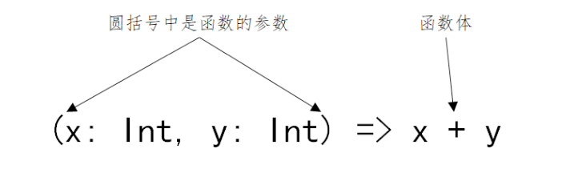
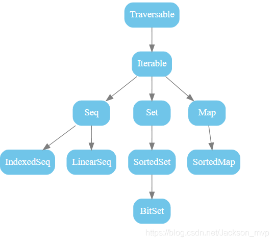
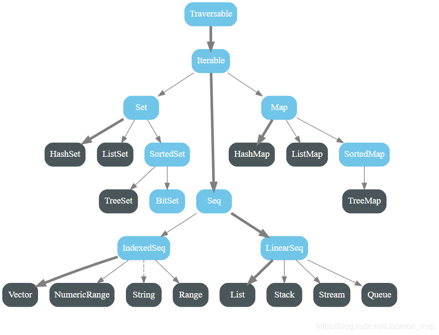
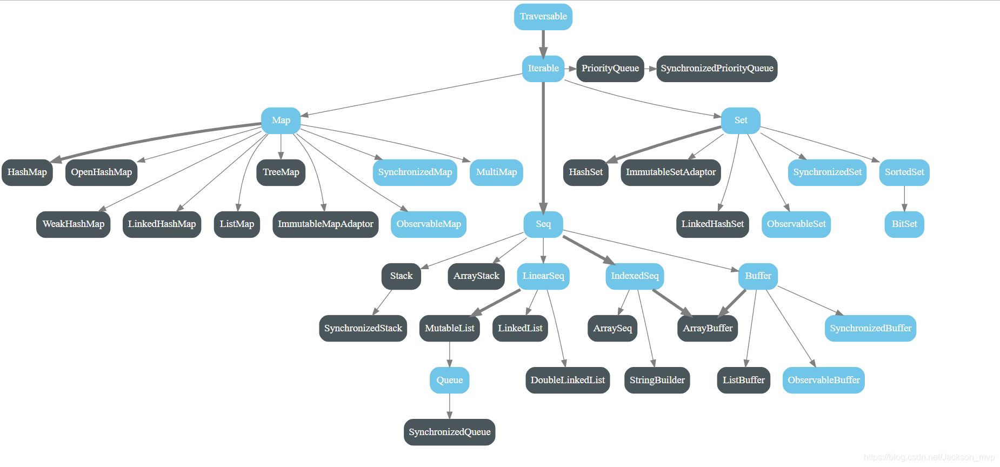
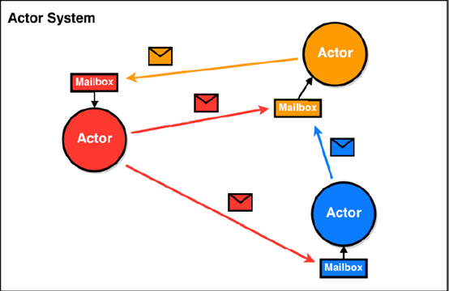

# Scala编程

## 第七部分 模式匹配和样例类

### 第1节 模式匹配

Scala没有Java中的 `switch ... case`，它有一个更加强大的模式匹配机制，可以应用到很多场合。

Scala的模式匹配可以匹配各种情况，比如变量的类型、集合的元素、有值或无值。

模式匹配的基本语法结构：`变量 match { case 值 => 代码 }`

模式匹配 `match ... case` 中，只要有一个 `case` 分支满足并处理了，就不会继续判断下一个case分支了，不需要使用 `break` 语句。
这点与Java不同，Java的 `switch case` 需要用 `break` 阻止。如果值为下划线，则代表不满足以上所有情况的时候如何处理。

模式匹配 `match case` 最基本的应用，就是对变量的值进行模式匹配。match是表达式，与if表达式一样，是有返回值的。

除此之外，Scala 还提供了样例类，对模式匹配进行了优化，可以快速进行匹配。

### 第2节 字符和字符串匹配

```scala{}
def main(args: Array[String]): Unit = {
  // 对字符进行模式匹配
  val char = '='
  char match {
    case '+' => println("加号")
    case '-' => println("减号")
    case '*' => println("乘号")
    case '/' => println("除号")
    case _ => println("不是运算符")
  }
}

def main(args: Array[String]): Unit = {
  // 对字符串进行模式匹配
  val content = Array("hadoop", "spark", "flink")
  val project = content(Random.nextInt(content.length))
  project match {
    case "hadoop" => println("大数据计算框架")
    case "spark" => println("大数据内存框架")
    case "flink" => println("大数据实时框架")
    case _ => println("啥也不是")
  }
}
```

### 第3节 守卫式匹配

所谓守卫就是添加if语句

```scala{8}
object MatchDemo {
  def main(args: Array[String]): Unit = {
    // 守卫式匹配 (就是添加了 if 判断)
    val char2 = '*'
    val num = char2 match {
      case '+' => 1
      case '-' => 2
      case _ if (char2.equals('*')) => 3
      case _ => 4
    }
    println(num)
  }
}
```

### 第4节 匹配类型

Scala的模式匹配还有一个强大的功能，它可以直接匹配类型，而不是值。这一点是Java的 `switch ... case` 做不到的。

匹配类型的语法：`case 变量: 类型 => 代码`，而不是匹配值的 `case 值 => 代码` 这种语法。

```scala{}
// 匹配类型
def typeMatch(x: Any): Unit = {
  x match {
    case x: String => println("是一个字符串类型")
    case x: Int => println("是一个整形")
    case x: Boolean if !x => println("是一个 false 的 Boolean 类型")
    case x: Array[Int] => println("是一个整形数组")
    case _ => println("啥也不是")
  }
}
```

### 第5节 匹配数组、元组、集合

```scala{}
object MatchCollection {
  def main(args: Array[String]): Unit = {
    val arr = Array(1, 3, 5, 7, 9)
    // 对 Array 数组进行模式匹配，分别匹配：
    // 带有指定个数元素的数组、带有指定元素的数组、以某元素开头的数组
    arr match {
      case Array(1, x, y) => println(x + " " + y) // 数组有三个元素
      case Array(1) => println("only 1 ...") // 数组只包含 1
      case Array(1, _*) => println("Start with 1") // 数组以 1 开头
      case _ => println("啥也不是")
    }

    // 对 List 列表进行模式匹配
    val list = List(3, 4)
    // 匹配三种情况：带有指定个数元素的列表、带有指定元素的列表、以某元素开头的列表
    list match {
      case x :: y :: Nil => println(s"$x $y") // Nil 表示一个空List, :: 起连接作用，表示将元素添加到某个列表中。=> 匹配有两个元素的集合。
      case 2 :: Nil => println("only 2 ...") // 2 添加到空列表。=> 即：匹配只有元素2的List集合
      case 1 :: tail => println("Start with 1") // tail 表示返回除第一个元素之外的其他元素的列表 => 即：匹配以数字1开头的集合
      case _ => println("啥也不是")
    }

    // 对元组进行匹配
    val tuple = (2, 3, 4)
    tuple match {
      case (1, x, y) => println(s"$x $y")// 以 1 开头，包含三个元素的元组
      case (_, z, 5) => println(z) // 以 5 结尾，包含三个元素的元组
      case _ => println("啥也不是")
    }
  }
}
```

### 第6节 样例类

`case class` 样例类是Scala中特殊的类。当声明样例类时，以下事情会自动发生：

- 主构造函数接收的参数通常不需要显式使用 `var` 或 `val` 修饰，Scala会自动使用 `val` 修饰(意味着值不能改变，只有 getter 方法)
- 自动为样例类定义了伴生对象，并提供 `apply` 方法，不用 `new` 关键字就能够构造出相应的对象
- 将生成`toString`、`equals`、`hashCode`和`copy`方法，除非显示的给出这些方法的定义
- 继承了 `Product` 和 `Serializable` 这两个特质，也就是说**样例类**可序列化和可应用Product的方法

`case class` 是多例的，后面要跟构造参数，`case object`是单例的。

此外，`case class` 样例类中可以添加方法和字段，并且可用于模式匹配。

```scala{}
class Amount

// 样例类中主构造器的参数默认用 val 来修饰
// 样例类中自动生成 apply 方法
case class Dollar(value: Double) extends Amount

case class Currency(value: Double, unit: String) extends Amount

case object Nothing extends Amount

object CaseClassDemo {

  def judgeIdentity(amt: Amount): Unit = {
    amt match {
      case Dollar(value) => println(value)
      case Currency(value, unit) => println(s"$value $unit")
      case Nothing => println("nothing")
    }
  }

  def main(args: Array[String]): Unit = {
    judgeIdentity(Dollar(10.0))
    judgeIdentity(Currency(20.0, "100"))
    judgeIdentity(Nothing)
  }
}
```

### 第7节 Option与模式匹配

Scala Option选项类型用来表示一个值是可选的，有值或无值。

`Option[T]` 是一个类型为 `T` 的可选值的容器，可以通过 `get()` 函数获取 `Option` 的值。
如果值存在，`Option[T]` 就是一个 `Some`。如果不存在，`Option[T]` 就是对象 None。

Option通常与模式匹配结合使用，用于判断某个变量是有值还是无值。

```scala{}
object OptionDemo {

  val grades = Map("jack" -> 90, "tom" -> 80, "jerry" -> 60)

  def getGrade(name: String): Unit = {
    val grade: Option[Int] = grades.get(name)
    grade match {
      case Some(grande) => println("成绩是：" + grande)
      case None => println("无此人成绩！")
    }
  }

  def main(args: Array[String]): Unit = {
    getGrade("jack")
    getGrade("wong")
  }
}
```

## 第八部分 函数及抽象化

### 第1节 函数字面量及函数的定义

Scala中函数为头等公民，不仅可以定义一个函数然后调用它，还可以写一个未命名的函数字面量，
然后可以把它当成一个值传递到其它函数或是赋值给其它变量。

*函数字面量*体现了函数式编程的核心理念。字面量包括整数字面量、浮点数字面量、布尔型字面量、
字符字面量、字符串字面量、符号字面量、函数字面量等。

什么是函数字面量呢?

在函数式编程中，函数是“头等公民”，可以像任何其他数据类型一样被传递和操作。
函数的使用方式和其他数据类型的使用方式完全一致，可以像定义变量那样去定义一个函数，
函数也会和其他变量一样，有类型有值; 就像变量的“类型”和“值”是分开的两个概念一样，
函数的“类型”和“值”也成为两个分开的概念; *函数的“值”，就是“函数字面量”*。

```shell
scala> def add1(x:Int): Int= {x+1} 
add1: (x: Int)Int
# 函数的类型为: (Int) => Int
# 输入参数列表只有一个, 括号可以省略，简写为: Int => Int

scala> def add2(x: Int, y: Int): Int = { x + y } 
add2: (x: Int, y: Int)Int
# 函数的类型为: (Int, Int) => Int

scala> def add3(x: Int, y: Int, z: Int): Int = { x + y + z } 
add3: (x: Int, y: Int, z: Int)Int
# 函数的类型为: (Int, Int, Int) => Int

scala> def add4(x: Int, y: Int, z: Int): (Int, Int) = { (x + y, y + z) } 
add4: (x: Int, y: Int, z: Int)(Int, Int)
# 函数的类型为: (Int, Int, Int) => (Int, Int)
```

`函数类型:(输入参数类型列表) => (输出参数类型列表)` 

只有一个参数时，小括号可省略; 函数体中只有1行语句时，大括号可以省略;

把函数定义中的类型声明部分去除，剩下的就是函数的“值”，即函数字面量:



- 对 add1 而言函数的值为: `(x) => x + 1`
- 对 add2 而言函数的值为: `(x, y) => x + y`
- 对 add3 而言函数的值为: `(x, y, z) => x + y + z`
- 对 add4 而言函数的值为: `(x, y, z) => (x+y, y+z)`


在Scala中我们这样定义变量: `val 变量名: 类型 = 值`

我们可以用完全相同的方式定义函数: `val 函数名: 函数类型 = 函数字面量`

```scala{}
val add1: Int => Int = (x) => x + 1
val add2: (Int, Int) => Int = (x, y) => x + y
val add3: (Int, Int, Int) => Int = (x, y, z) => x + y + z
val add4: (Int, Int, Int) => (Int, Int) = (x, y, z) => (x + y, y + z)
```

在Scala中有自动类型推断，所以可以省略变量的类型 `val 变量名 = 值`。 

同样函数也可以这样: `val 函数名 = 函数字面量`

```scala
val add1 = (x: Int) => x + 1
val add2 = (x: Int, y: Int) => x + y
val add3 = (x: Int, y: Int, z: Int) => x + y + z
val add4 = (x: Int, y: Int, z: Int) => (x + y, y + z)
```

> 备注: 要让编译器进行自动类型推断，要告诉编译器足够的信息，所以添加了 `x` 的类型信息。

函数的定义:

```scala{}
val 函数名: (参数类型1，参数类型2) => (返回类型) = 函数字面量 
val 函数名 = 函数字面量 函数字面量:(参数1:类型1，参数2:类型2) => 函数体
val 函数名 = (参数1:类型1，参数2:类型2) => 函数体
```

### 第2节 函数与方法的区别

```shell
scala> def addm(x: Int, y: Int): Int = x + y
addm: (x: Int, y: Int)Int

scala> val addf = (x: Int, y: Int) => x + y
addf: (Int, Int) => Int = <function2>
```

严格的说: 使用 `val` 定义的是函数(function)，使用 `def` 定义的是方法(method)。

二者在语义上的区别很小，在绝大多数情况下都可以不去理会它们之间的区别，但是有时候有必要了解它们之间的不同。

Scala中的方法与函数有以下区别:

- Scala 中的方法与 Java 的类似，方法是组成类的一部分
- Scala 中的函数则是一个完整的对象。Scala 中用 22 个特质(从 Function1 到 Function22)抽象出了函数的概念
- Scala 中用 `val` 语句定义函数，`def` 语句定义方法

```scala{}
// 下面用三种方式定义了函数，其中第二种方式最常见
val adder1: (Int, Int) => Int = (x, y) => x + y 
val adder2 = (x: Int, y: Int) => x + y

// Function2是特质，不能直接new
// new Function2[Int,Int,Int]{ ... } 
// 其实是定义并实例化一个实现了 Function2 特质的类的对象
val adder3 = new Function2[Int, Int, Int]{
  def apply(x: Int, y: Int): Int = { 
    x + y
  } 
}
```

> 第二种最为常见

- 方法不能作为单独的表达式而存在，而函数可以;
- 函数必须要有参数列表，而方法可以没有参数列表;
- 方法名是方法调用，而函数名只是代表函数对象本身;
- 在需要函数的地方，如果传递一个方法，会自动把方法转换为函数

```shell
# 方法不能作为单独的表达式而存在，而函数可以 
scala> def addm(x: Int, y: Int): Int = x + y
addm: (x: Int, y: Int)Int

scala> val addf = (x: Int, y: Int) => x + y
addf: (Int, Int) => Int = <function2>

scala> addm
<console>:13: error: missing argument list for method addm

scala> addf
res8: (Int, Int) => Int = <function2>

# 函数必须要有参数列表，而方法可以没有参数列表 
scala> def m1 = "This is zmn"
m1: String

# 函数必须有参数列表
scala> val f1 = () => "This is zmn" 
f1: () => String = <function0>

# 方法名是方法调用
scala> m1
res16: String = This is zmn

# 函数名代表函数对象本身
scala> f1
res17: () => String = <function0>

# 这才代表函数调用
scala> f1()
res18: String = This is zmn

# 需要函数的地方，可以传递一个方法，方法会自动转化为函数
scala> val list = (1 to 10).toList
list: List[Int] = List(1, 2, 3, 4, 5, 6, 7, 8, 9, 10)

scala> def double(x: Int) = x * x
double: (x: Int)Int

scala> list.map(double(_))
res20: List[Int] = List(1, 4, 9, 16, 25, 36, 49, 64, 81, 100)
```

手动将方法转换为函数:

```shell
# 注意: 方法名与下划线之间有一个空格 
scala> def f1 = double _
f1: Int => Int

scala> f1
res21: Int => Int = <function1>
```

写程序的时候是定义方法、还是定义函数? 

一般情况下，不对二者做区分，认为都是函数，更多的时候使用 `def` 定义函数。

### 第3节 匿名函数与占位符

函数没有名字就是匿名函数;

匿名函数，又被称为 Lambda 表达式。 

Lambda表达式的形式如下: `(参数名1: 类型1, 参数名2: 类型2, ... ...) => 函数体`

```shell
# 定义匿名函数
scala> (x: Int) => x + 1
res0: Int => Int = <function1>

# 函数没有名字，在集成开发环境中是无法被调用的 
scala> res0(10)
res1: Int = 11

scala> val list = (1 to 10).toList
lst: List[Int] = List(1, 2, 3, 4, 5, 6, 7, 8, 9, 10)

# 将匿名函数作为参数传递给另一个函数 
scala> list.map((x: Int) => x + 1)
res2: List[Int] = List(2, 3, 4, 5, 6, 7, 8, 9, 10, 11)

# x一定是Int类型，这里可以省略
scala> list.map((x) => x + 1)
res3: List[Int] = List(2, 3, 4, 5, 6, 7, 8, 9, 10, 11)

# 只有一个参数，小括号可以省略
scala> list.map(x => x + 1)
res4: List[Int] = List(2, 3, 4, 5, 6, 7, 8, 9, 10, 11)

# 使用占位符简化函数字面量
scala> list.map(_ + 1)
res5: List[Int] = List(2, 3, 4, 5, 6, 7, 8, 9, 10, 11)

# 实现将List中的每个元素*2 + 1，但是出错了
scala> list.map(_ + _ + 1)
<console>:13: error: missing parameter type for expanded function ((x$1, x$2) => x$1.$plus(x$2).$plus(1))
# 两个下划线代表的是两个参数，而不是一个参数的重复应用

# 这样是可行的
scala> list.map(2 * _ + 1)

# 通过reduce这个高阶函数，将list列表中的元素相加求和 
scala> list.reduce((x,y) => x + y)
res0: Int = 55

# 使用占位符简化函数字面量
# 第一个下划线代表第一个参数，第二个下划线代表第二个参数 
scala> list.reduce(_ + _)
res1: Int = 55
```

多个下划线指代多个参数，而不是单个参数的重复运用

第一个下划线代表第一个参数 
第二个下划线代表第二个参数 
第三个下划线代表第三个参数，以此类推...

### 第4节 高阶函数 

高阶函数: 接收一个或多个函数作为输入, 或输出一个函数。

函数的参数可以是变量，而函数又可以赋值给变量，由于函数和变量地位一样，所以函数参数也可以是函数;

常用的高阶函数: `map`、`reduce`、`flatMap`、`foreach`、`filter`、`count` ... ... (接收函数作为参数)

```scala{}
object HighFunction {
  def main(args: Array[String]): Unit = {

    // 接收一个或多个函数作为输入的高阶函数
    val func = n => "*" * n
    (1 to 5).map(func(_)).foreach(println(_))
    println("-----------------------------------")

    // 输出一个函数的高阶函数
    val urlBuilder = (ssl: Boolean, domain: String) => {
        val schema: String = if (ssl) "https://" else "http"
        // 输出一个匿名函数
        (endPoint: String, query: String) => s"$schema$domain/$endPoint?$query"
      }
    val domainName = "www.zmn.cn"

    def getUrl = urlBuilder(true, domainName)

    val endPoint = "show"
    val query = "id=1"
    val url: String = getUrl(endPoint, query)
    println(url)
  }
}
```

### 第5节 闭包 

闭包是一种函数，一种比较特殊的函数，它和普通的函数有很大区别:

```scala{}
// 普通的函数
val addMore1 = (x: Int) => x + 10 

// 外部变量，也称为自由变量
var more = 10

// 闭包
val addMore2 = (x: Int) => x + more

// 调用addMore1函数
println(addMore1(5)) // 15

// 每次addMore2函数被调用时，都会去捕获外部的自由变量 
println(addMore2(10)) // 20

// 如果外部自由变量改变，addMore2 的结果也会随之发生变化
more = 100
println(addMore2(10)) // 110

more = 1000
println(addMore2(10)) // 1010
```

**闭包是在其上下文中引用了自由变量的函数;**

闭包引用到函数外面定义的变量，定义这个函数的过程就是将这个自由变量捕获而构成的一个封闭的函数，
也可理解为"*把函数外部的一个自由变量关闭进来*"。

何为闭包? 需满足下面三个条件:

1. 闭包是一个**函数**
2. 函数必须要**有返回值**
3. **返回值依赖声明在函数外部的一个或多个变量**，用Java的话说，就是返回值和定义的全局变量有关

### 第6节 柯里化

函数编程中，**接收多个参数的函数都可以转化为接收单个参数的函数**，这个转化过程就叫柯里化(Currying)。

Scala中，柯里化函数的定义形式和普通函数类似，区别在于柯里化函数拥有多组参数列表，每组参数用小括号括起来。

Scala API中很多函数都是柯里化的形式。

```shell
# 使用普通的方式
scala> def add1(x: Int, y: Int) = x + y

# 使用闭包的方式，将其中一个函数作为返回值 
scala> def add2(x: Int) = (y:Int) => x + y

# 使用柯里化的方式
scala> def add(x: Int)(y: Int) = x + y

#调用柯里化函数add
scala> add(1)(2)
res1: Int = 3 
# add(1)(2)实际上第一次调用使用参数x，返回一个函数类型的值，第二次使用参数y调用这个函数类型的值。

# 实际上最先演变成这样的函数:def add(x: Int) = (y:Int) => x + y 
# 在这个函数中，接收一个x为参数，返回一个匿名函数，这个匿名函数的定义是:接收一个Int型参数y，函数体是x+y。
# 调用过程如下:
scala> val result=add(1)
result: Int => Int = <function1>

scala> val sum=result(2)
sum: Int = 3

scala> sum
res0: Int = 3
```

### 第7节 部分应用函数

部分应用函数(Partial Applied Function)也叫偏应用函数，与偏函数从名称上看非常接近，
但二者之间却有天壤之别。

部分应用函数是指缺少部分(甚至全部)参数的函数。

如果一个函数有n个参数, 而为其提供少于n个参数, 那就得到了一个部分应用函数。

```scala{}
// 定义一个函数
def add(x:Int, y:Int, z:Int) = x+y+z

// 得到一个偏应用函数 // Int不能省略
def addX = add(1, _:Int, _:Int) 
addX(2,3) // 1 + 2 + 3 = 6
addX(3,4) // 1 + 3 + 4 = 8

def addXAndY = add(10, 100, _:Int)
addXAndY(1) // 10 + 100 + 1 = 111

def addZ = add(_:Int, _:Int, 10)
addZ(1,2) // 1 + 2 + 10 = 13

// 省略了全部的参数，下面两个等价。第二个更常用 
def add1 = add(_: Int, _: Int, _: Int) 
def add2 = add _
```

### 第8节 偏函数

偏函数(Partial Function)之所以"偏"，原因在于它们并不处理所有可能的输入，
而只处理那些能与至少一个 `case` 语句匹配的输入;

在偏函数中只能使用 `case` 语句，整个函数必须用大括号包围。
这与普通的函数字面量不同，普通的函数字面量可以使用大括号，也可以用小括号; 
被包裹在大括号中的**一组case语句是一个偏函数**，是一个并非对所有输入值都有定义的函数;

Scala中的Partial Function是一个 `trait`，其类型为 `PartialFunction[A,B]`，
表示: 接收一个类型为A的参数，返回一个类型为B的结果。

```scala{}
// 1、2、3有对应的输出值，其它输入打印 Other 
val pf: PartialFunction[Int, String] = {
  case 1 => "One"
  case 2 => "Two"
  case 3 => "Three"
  case _=> "Other"
}

pf(1) // 返回: One 
pf(2) // 返回: Two 
pf(5) // 返回: Other
```

需求: 过滤List中的String类型的元素，并将Int类型的元素加1。通过偏函数实现上述需求。

```scala{}
object PartialFunctionDemo {
  def main(args: Array[String]): Unit = {
    val partialFunction = new PartialFunction[Any, Int] {
      // [Any, Int] 表示偏函数接收的数据类型是 Any, 返回的数据类型是 Int

      // 如果返回true 就调用 apply 方法; 否则就过滤掉
      override def isDefinedAt(x: Any): Boolean = {
        println(x)
        x.isInstanceOf[Int]
      }

      // 对传入的整数值 +1 并返回
      override def apply(v1: Any): Int = {
        println(v1.toString)
        v1.asInstanceOf[Int] + 1
      }
    }

    val list = List(10, "hadoop", 20, "spark", 30, "flink")
    list.collect(partialFunction).foreach(println(_))

    // 实际简单多了
    list.collect{case x: Int => x+1}.foreach(println)
  }
}
```

## 第九部分 集合

主要内容: 

1. Scala中的可变和不可变集合
2. 集合的三大类: Seq、Set、Map
3. 集合的常用算子
4. Scala与Java之间的集合转换

### 第1节 可变和不可变集合 

根据容器中元素的组织方式和操作方式，可以分为有序和无序、可变和不可变等不同的容器类别;

- *不可变集合*指集合内的元素一旦初始化完成就不可再进行更改，任何对集合的改变都将生成一个新的集合;

- *可变集合*提供了改变集合内元素的方法;

Scala同时支持可变集合和不可变集合，主要下面两个包: 

- `scala.collection.mutable`: 定义了可变集合的特质和具体实现类
- `scala.collection.immutable`: 定义了不可变集合的特质和具体实现类 

对于几乎所有的集合类，Scala都同时提供了可变和不可变的版本。

**Scala优先采用不可变集合**，不可变集合元素不可更改，可以安全的并发访问。 

Scala集合有三大类: Seq(序列)、Set(集)、Map(映射); 所有的集合都扩展自 `Iterable` 特质。



immutable 不可变集合框架



mutable 可变集合框架



小结:

- String 属于 `IndexedSeq` 
- `Queue` 队列和 `Stack` 堆这两个经典的数据结构属于 `LinearSeq` 
- `Map` 体系下有一个 `SortedMap`，说明Scala中的Map是可以支持排序的 
- `mutable` 可变集合中 `Seq` 中的 `Buffer` 下有 `ListBuffer`，它相当于可变的List列表
- `List` 列表属于 `Seq` 中的 `LinearSeq`

### 第2节 Seq

Seq代表按照一定顺序排列的元素序列; 

该序列是一种特别的可迭代集合，包含可重复的元素;

元素的顺序是确定的，每个元素对应一个索引值; 

Seq提供了两个重要的子特质:

- IndexedSeq: 提供了快速随机访问元素的功能，它通过索引来查找和定位的 
- LinearSeq: 提供了访问head、tail的功能，它是线型的，有头部和尾部的概念，通过遍历来查找。

> LinearSeq 应该类似于链表

#### 2.1 List

List代表元素顺序固定的不可变的链表，它是Seq的子类，在Scala编程中经常使用。

List是函数式编程语言中典型的数据结构，与数组类似，可索引、存放类型相同的元素。 

List一旦被定义，其值就不能改变。

List列表有头部和尾部的概念，可以分别使用 `head` 和 `tail` 方法来获取:

- `head` 返回的是列表第一个元素的值 
- `tail` 返回的是除第一个元素外的其它元素构成的新列表

> 这体现出列表具有递归的链表结构。

Scala定义了一个空列表对象 `Nil`，定义为 `List[Nothing]`

借助 Nil 可将多个元素用操作符 `::` 添加到列表头部，常用来初始化列表;

操作符 `:::` 用于拼接两个列表;

```scala{}
object ListDemo {
  def main(args: Array[String]): Unit = {
    // Nil 表示一个空的列表
    // :: 操作符表示向集合中添加元素，他是从右往左运算的，所以集合对象一定要放在最右边
    val list1 = 1 :: 2 :: 3 :: 4 :: Nil

    val list2 = 5 :: 6 :: 7 :: 8 :: Nil

    // ::: 操作符进行拼接，不用使用 :: 进行列表的拼接
    val list3 = list1 ::: list2

    //返回第一个元素
    println(list3.head) // 1
    //返回除第一个元素外的其它元素构成的新列表
    println(list3.tail) // List(2, 3, 4, 5, 6, 7, 8)
    //返回除最后一个元素外的其它元素构成的新列表
    println(list3.init) // List(1, 2, 3, 4, 5, 6, 7)
    //返回最后一个元素
    println(list3.last) // 8
  }
}
```

列表递归的结构，便于编写递归的算法:

```scala{9-13}
object ListDemo {
  def main(args: Array[String]): Unit = {
    val list4 = List(4, 2, 6, 1, 7, 9)
    println(quickSort(list4)) // List(1, 2, 4, 6, 7, 9)
  }
  def quickSort(list: List[Int]): List[Int] = {
    list match {
      case Nil => Nil
      case head :: tail =>
        // 通过 partition 将 tail 分为两部分
        // 小于 head 的元素放入 less 中，大于 head 的元素放入 greater 中
        val (less, greater) = tail.partition(_ < head)
        quickSort(less) ::: head :: quickSort(greater)
    }
  }
}
```

#### 2.2 Queue

队列Queue是一个先进先出的结构。

队列是一个有序列表，在底层可以用数组或链表来实现。

*先进先出*的原则就是: 先存入的数据，要先取出，后存入的数据后取出。

在Scala中，有 `scala.collection.mutable.Queue` 和 `scala.collection.immutable.Queue`，
一般来说，我们使用的是 `scala.collection.mutable.Queue` (可变队列)

```scala{}
object QueueDemo {

  def main(args: Array[String]): Unit = {
    // 创建一个可变队列
    val queue1 = new mutable.Queue[Int]()
    println(queue1) // Queue()

    // 向队列中添加元素
    queue1 += 1
    // 向队列中添加 List 列表
    queue1 ++= List(2, 3, 4)
    println(queue1) // Queue(1, 2, 3, 4)

    // 按照进入队列的顺序，删除队列中的元素
    // 返回队列中的第一个元素，并从队列中删除这个元素
    val dequeue: Int = queue1.dequeue()
    println(dequeue) // 1
    println(queue1) // Queue(2, 3, 4)

    // 再向队列中添加元素
    queue1.enqueue(5, 6, 7)
    println(queue1) // Queue(2, 3, 4, 5, 6, 7)

    // 获取第一个和最后一个元素
    println(queue1.head) // 2
    println(queue1.last) // 7
  }

}
```

### 第3节 Set

Set(集合)是没有重复元素的对象集合，Set中的元素是唯一的; 

Set分为可变的和不可变的集合;

默认情况下，使用的是不可变集合(引用 `scala.collection.immutable.Set`); 

使用可变集合，需要引用 `scala.collection.mutable.Set` 包;

```scala{}
object SetDemo {
  def main(args: Array[String]): Unit = {
    // 创建一个 Set 集合
    val set = Set(1, 2, 3, 4, 5, 6)
    set.drop(1)
    println(set) // HashSet(5, 1, 6, 2, 3, 4) 没有发生任何改变

    // 创建一个可变的 Set
    val mutableSet = mutable.Set(3, 4, 5)
    // 对可变 Set 进行增加/删除元素操作
    mutableSet.add(7)
    println(mutableSet) // HashSet(3, 4, 5, 7)

    mutableSet.remove(7)
    println(mutableSet) // HashSet(3, 4, 5)

    // 通过 +=/-= 进行增加/删除元素操作
    mutableSet += 8
    mutableSet -= 3
    println(mutableSet) // HashSet(8, 4, 5)

    // 对 Set 集合求交集 &, intersect
    println(mutable.Set(1, 2, 3) & mutable.Set(2, 3, 4)) //HashSet(2, 3)
    println(mutable.Set(1, 2, 3).intersect(mutable.Set(2, 3, 4))) //HashSet(2, 3)

    // 对 Set 集合求并集 ++, |, union
    println(mutable.Set(1, 2, 3) ++ mutable.Set(2, 3, 4)) // HashSet(1, 2, 3, 4)
    println(mutable.Set(1, 2, 3) | mutable.Set(2, 3, 4)) // HashSet(1, 2, 3, 4)
    println(mutable.Set(1, 2, 3).union(mutable.Set(2, 3, 4))) // HashSet(1, 2, 3, 4)

    // 对 Set 集合求差集 --, &~, diff
    println(mutable.Set(1, 2, 3) -- mutable.Set(2, 3, 4)) // HashSet(1)
    // 求差集就相当于把 Set1 中与 Set2 相同的元素删除，所得到的集合
    println(mutable.Set(1, 2, 3) &~ mutable.Set(2, 3, 4)) // HashSet(1)
    println(mutable.Set(1, 2, 3).diff(mutable.Set(2, 3, 4))) // HashSet(1)
  }
}
```

### 第4节 Map

Map(映射)是一系列键值对的容器; 

Scala 提供了可变的和不可变的两种版本的Map，分别定义在包 `scala.collection.mutable` 
和 `scala.collection.immutable` 包里; 

默认情况下，Scala中使用不可变的 `Map`; 

如果要使用可变Map，必须导入 `scala.collection.mutable.Map`; 

> 在Map中，键的值是唯一的，可以根据键来对值进行快速的检索。

```scala{}
// 可使用两种方式定义Map
// Map缺省是不可变的，值不能更改
val a = Map("a" -> 1, "b" -> 2, "c" -> 3)
val a = Map(("a", 1),("b", 2),("c", 3)) 
a.keys
a.values

// 获取Map中的值: 
a("a")

// 访问不存在的key时，会抛出异常。Java.util.NoSuchElementException: key not found: x
a("x")

// 使用get方法，返回一个Option对象，要么是Some(键对应的值)，要么是None
a.get("a")

// 获取键对应的值，如果键不存在返回给定的值(这里是0)
a.getOrElse("a", 0)

// 更新Map中的值(要使用可变的Map)
val b = scala.collection.mutable.Map("a" -> 1, "b" -> 2, "c" -> 3) 
b("a") = 2

// 增加了一个新元素 
b("d") = 4

// 用 + 添加新的元素;用 – 删除元素 
b += ("e" -> 1, "f" -> 2)
b -= "a"

// 增加元素
val b = Map("a" -> 1, "b" -> 2, "c" -> 3) 
val c = b + ("a" -> 10, "b" -> 20)

// 通过包含键值对的二元组创建Map集合
val a = Map(("a", 1),("b", 2),("c", 3))

// 逐个访问 value
for(v <- a.values) println(v)

// key 和 value 做了交换
val b = for((k,v) <- a) yield (v,k)

// 下面才是具有scala风格的写法，推荐 
a.map(x=>(x._2, x._1))

// 拉链操作创建Map
val a = Array(1,2,3)
val b = Array("a","b","c")
//c: Array[(Int, String)]
val c = a.zip(b)
//c: scala.collection.immutable.Map[Int,String] 
val c = a.zip(b).toMap
```

测试：

```scala{}
object MapDemo {
  def main(args: Array[String]): Unit = {
    // 使用两种方式定义Map
    val map1 = Map("a" -> 1, "b" -> 2)
    val map2 = Map(("a", 1), ("b", 2))

    map1.keys.foreach(println(_))
    map1.values.foreach(println(_))

    println(map1("b")) // 2

    // 如果访问不存在的 key 值，会抛出异常
    // println(map1("c")) // key not found: c

    // 也可以通过 get 方法获取与 key 对应的 value 的值
    // get 方法会返回一个 Option 对象, 要么是 Some (有值), 要么是 None (无值)
    val num: Option[Int] = map1.get("a")
    num match {
      case None => println("None")
      case Some(x) => println(x)
    }

    // 获取 key 所对应的 value 值; 如果 key 不存在，则返回指定的值。
    val num2: Int = map1.getOrElse("a", 0)
    println(num2) // 1

    // 创建一个可变的 Map
    val map3 = scala.collection.mutable.Map("a" -> 1, "b" -> 2)
    println(map3) // HashMap(a -> 1, b -> 2)
    map3("a") = 10
    println(map3) // HashMap(a -> 10, b -> 2)

    // 增加一个元素
    map3("c") = 3
    println(map3) // HashMap(a -> 10, b -> 2, c -> 3)

    // 通过 += 添加元素；通过 -= 删除元素
    map3 += ("d" -> 4, "f" -> 5)
    println(map3) // HashMap(a -> 10, b -> 2, c -> 3, d -> 4, f -> 5)
    map3 -= "d"
    println(map3) // HashMap(a -> 10, b -> 2, c -> 3, f -> 5)

    // 将 key,value 的值互换
    val map4: mutable.Map[Int, String] = for ((k, v) <- map3) yield (v, k)
    println(map4) // HashMap(2 -> b, 3 -> c, 5 -> f, 10 -> a)
    // 推荐使用的互换方式 // x._2 => value, x._1 => key
    map3.map(x => (x._2, x._1)).foreach(println(_))

    // 通过拉链操作创建Map
    val a = Array(1, 2, 3)
    val b = Array("a", "b", "c")
    val c: Array[(Int, String)] = a.zip(b)
    val map5: Map[Int, String] = a.zip(b).toMap
    println(map5) // Map(1 -> a, 2 -> b, 3 -> c)
  }
}
```

### 第5节 集合常用算子

#### 5.1 map、foreach & mapValues

集合对象都有 foreach、map 算子。 

两个算子的共同点在于: 都是用于遍历集合对象，并对每一项执行指定的方法; 

两个算子的差异点在于:

- `foreach` 无返回值(准确说返回 `void`)，用于遍历集合 
- `map` 返回集合对象，用于将一个集合转换成另一个集合

```scala{}
// 使用 foreach 打印集合元素
val numlist = (1 to 10).toList 
numlist.foreach(elem=>print(elem+" ")) 
numlist.foreach(print _) 
numlist.foreach(print)

// 使用 map 对集合进行转换 
numlist.map(_ > 2) 
numlist.map(_ * 2)
```

操作 Map 集合时，`mapValues` 用于遍历 `value`，是map操作的一种简化形式;

```scala{}
// Range(20, 0, -2)用给定的步长值设定一个范围，从开始到结束(不包含)。
// Map(20 -> 0, 18 -> 1, 16 -> 2, ..., 4 -> 8, 2 -> 9)
val map = Range(20, 0, -2).zipWithIndex.toMap
// 将map集合中的value值+100
map.map(elem => (elem._1, elem._2 + 100)) 
map.map{case (k, v) => (k, v+100)}
// mapValues的表达最简洁 
map.mapValues(_ + 100)
```

#### 5.2 flatten & flatMap

`flatten` 的作用是把嵌套的结构展开，把结果放到一个集合中;

在 `flatMap` 中传入一个函数，该函数对每个输入都返回一个集合(而不是一个元素)，
最后把生成的多个集合"拍扁"成为一个集合;

```shell
scala> val lst1 = List(List(1,2), List(3,4))
lst1: List[List[Int]] = List(List(1, 2), List(3, 4))

scala> lst1.flatten
res5: List[Int] = List(1, 2, 3, 4)

# flatten 把一个字符串的集合展开为一个字符集合，因为字符串本身就是字符的集合 
scala> val lst4 = List("Java", "hadoop")
lst4: List[String] = List(Java, hadoop)

scala> lst4.flatten
res8: List[Char] = List(J, a, v, a, h, a, d, o, o, p)

# flatten 有效的处理 Some 和 None 组成的集合。
# 它可以展开Some元素形成一个新的集合，同时去掉 None元素
scala> val x = Array(Some(1), None, Some(3), None)
x: Array[Option[Int]] = Array(Some(1), None, Some(3), None)

# 方法很多，flatten最简单
scala> x.flatten
res9: Array[Int] = Array(1, 3)

scala> x.collect{case Some(i) => i}
res10: Array[Int] = Array(1, 3)

scala> x.filter(!_.isEmpty).map(_.get)
res11: Array[Int] = Array(1, 3)
```

```scala{}
// 下面两条语句等价
val lst = List(List(1,2,5,6),List(3,4))

// 将 lst 中每个元素乘2，最后作为一个集合返回 
// 此时 flatMap = flatten + map 
// List(1,2,5,6,3,4)
lst.flatten.map(_*2)
lst.flatMap((x: List[Int]) => x.map(_*2))
lst.flatMap(_.map(_*2))

// 将字符串数组按空格切分，转换为单词数组
val lines = Array("Apache Spark has an advanced DAG execution engine", "Spark offers over 80 high-level operators")

// 下面两条语句效果等价
// map 算子产生的结果:Array(Array(Apache, Spark, has, an, advanced, DAG, execution, engine), Array(Spark, offers, over, 80, high-level, operators))
// flatten 算子产生的结果:Array(Apache, Spark, has, an, advanced, DAG, execution, engine, Spark, offers, over, 80, high-level, operators)
lines.map(_.split(" ")).flatten
// 此时 flatMap = map + flatten
lines.flatMap(_.split(" "))
```

> 备注: `flatMap = flatten + map` 或 `flatMap = map + flatten`

#### 5.3 collect

`collect` 通过执行一个并行计算(偏函数)，得到一个新的数组对象

```scala{}
object CollectDemo { 
  //通过下面的偏函数，把chars数组的小写a转换为大写的A 
  val fun: PartialFunction[Char, Char] = {
    case 'a' => 'A'
    case x => x 
  }
  
  def main(args: Array[String]): Unit = {
    val chars = Array('a', 'b', 'c')
    val newchars = chars.collect(fun)
    println("newchars:" + newchars.mkString(","))
  } 
}
```

#### 5.4 reduce

`reduce` 可以对集合当中的元素进行归约操作;

还有 `reduceLeft` 和 `reduceRight`。`reduceLeft` 从左向右归约，`reduceRight` 从右向左归约;

```scala{}
val lst1 = (1 to 10).toList
lst1.reduce(_+_)

// 为什么这里能出现两个占位符? 
lst1.reduce(_+_)

// 我们说过一个占位符代表一个参数，那么两个占位符就代表两个参数。根据这个思路改写等价的语句 
// x类似于buffer，缓存每次操作的数据; y每次操作传递新的集合元素
lst1.reduce((x, y) => x + y)

// 利用reduce操作，查找 lst1 中的最大值 
lst1.reduce((x,y) => if (x>y) x else y)

// reduceLeft、reduceRight 
lst1.reduceLeft((x,y) => if (x>y) x else y) 
lst1.reduceRight((x,y) => if (x>y) x else y)
```

#### 5.5 sorted sortwith & sortby

Scala中对于集合的排序有三种方法: `sorted`、`sortBy`、`sortWith`

```scala{}
object SortDemo {
  def main(args: Array[String]): Unit = {
    val list = List(1, 9, 3, 8, 5, 6)
    //sorted方法对一个集合进行自然排序
    //sorted源码:def sorted[B >: A](implicit ord: Ordering[B]): Repr 
    // 源码中有两点值得注意的地方:
    // 1.sorted方法中有个隐式参数ord: Ordering。
    // 2.sorted方法真正排序的逻辑是调用的java.util.Arrays.sort
    val numSort: List[Int] = list.sorted
    println(numSort)
    //sortBy源码:def sortBy[B](f: A => B)(implicit ord: Ordering[B]): Repr = sorted(ord on f) 
    // sortBy最后调用的sorted方法 
    println(list.sortBy(x => x).reverse)
    //sortWith源码:def sortWith(lt: (A, A) => Boolean): Repr = sorted(Ordering fromLessThan lt)
    print(list.sortWith(_ > _))
  }
}
```

### 第6节 与Java集合的转换

使用 `scala.collection.JavaConverters` 与Java集合交互。

它有一系列的隐式转换，添加了 `asJava` 和 `asScala` 的转换方法。

```scala{}
import scala.collection.JavaConverters._
val list: Java.util.List[Int] = List(1,2,3,4).asJava
val buffer: scala.collection.mutable.Buffer[Int] = list.asScala
```

## 第十部分 隐式机制

主要内容: 

1. 隐式转换
2. 隐式转换函数
3. 隐式参数和隐式值

### 第1节 隐式转换

隐式转换和隐式参数是Scala中两个非常强大的功能，利用隐式转换和隐式参数，可以提供类库，
对类库的使用者隐匿掉具体的细节。 

Scala会根据隐式转换函数的签名，在程序中使用到隐式转换函数接收的参数类型定义的对象时，
会自动将其传入隐式转换函数，转换为另外一种类型的对象并返回，这就是"隐式转换"。

- 首先得有一个隐式转换函数 
- 使用到隐式转换函数接收的参数类型定义的对象 
- Scala自动传入隐式转换函数，并完成对象的类型转换

隐式转换需要使用 `implicit` 关键字。

使用Scala的隐式转换有一定的限制:

- `implicit` 关键字只能用来修饰方法、变量、参数
- 隐式转换的函数只在当前范围内才有效。如果隐式转换不在当前范围内定义，那么必须通过 `import` 语句将其导入

> Spark源码中有大量的隐式转换和隐式参数，因此必须掌握隐式机制。

### 第2节 隐式转换函数

Scala的隐式转换最核心的就是定义隐式转换函数，即 `implicit conversion function`。 

定义的隐式转换函数，只要在编写的程序内引入，就会被Scala自动使用。 

隐式转换函数由Scala自动调用，通常建议将隐式转换函数的名称命名为 `one2one` 的形式。

示例1: 下面代码中定义了一个隐式函数

```scala{}
class Num{}

class RichNum(num: Num) {
  def rich(): Unit = {
    println("Hello implicit!")
  }
}

object ImplicitDemo {

  // 定义一个隐式转换函数
  // 命名要符合 one2one 的格式
  implicit def num2RichNum(num: Num): RichNum = {
    new RichNum(num)
  }

  def main(args: Array[String]): Unit = {
    val num = new Num
    // num 类型的对象没有 rich() 方法
    // 但是 Scala 编译器会查找当前范围内是否有隐式转换函数
    // 如果有就将其转换成 RichNum 类型，这样就可以访问 rich() 方法了
    num.rich()
  }
}
```

> 个人理解：所谓隐式转换就类似于 Java 中的自动拆箱装箱

示例2: 导入隐式函数

```scala{}
package test.implicitdemo
object Int2String {
  implicit def int2String(num: Int):String = num.toString
}
```

下面代码中调用了 `String` 类型的 `length` 方法，Int类型本身没有length方法，
但是在可用范围内定义了可以把 `Int` 转换为 `String` 的隐式函数 `int2String`，
因此函数编译通过并运行出正确的结果。

> 此示例中隐式函数的定义必须定义在使用之前，否则编译报错。

```scala{1,4}
import test.implicitdemo.Int2String._
object ImplicitTest {
  def main(args: Array[String]): Unit = {
    println(20.length)
  }
}
```

通过 `import test.implicitdemo.Int2String._`，将 `Int2StringTest` 内部的成员
导入到相应的作用域内，否则无法调用隐式函数。

要实现隐式转换，只要在程序可见的范围内定义隐式转换函数即可，Scala会自动使用隐式转换函数。

隐式转换函数与普通函数的语法区别就是，要以 `implicit` 开头，而且最好要**定义函数返回类型**。

隐式转换案例: 特殊售票窗口(只接受特殊人群买票，比如学生、老人等)，其他人不能在特殊售票窗口买票。

```scala{}
// var 修饰的主构造函数变量可以修改，拥有 getter 和 setter 方法
class SpecialPerson(var name: String)

class Older(var name: String)

class Student(var name: String)

class Worker(var name: String)

object ImplicitDemoTwo {

  def buySpecialTickWindow(person: SpecialPerson): Unit = {
    if (person != null) {
      println(person.name + " got a special tick")
    } else {
      println("No way!")
    }
  }

  // 定义隐式转换函数
  implicit def any2Special(any: Any): SpecialPerson = {
    any match {
      case any: Older => new SpecialPerson(any.name)
      case any: Student => new SpecialPerson(any.name)
      case _ => null
    }
  }

  def main(args: Array[String]): Unit = {
    val student = new Student("Jack")
    val older = new Older("Tom")
    val worker = new Worker("John")

    buySpecialTickWindow(student) // Jack got a special tick
    buySpecialTickWindow(older) // Tom got a special tick
    buySpecialTickWindow(worker) // No way!
  }
}
```

### 第3节 隐式参数和隐式值

在函数定义的时候，支持在最后一组参数中使用 `implicit`，表明这是一组隐式参数。
在调用该函数的时候，可以不用传递隐式参数，而编译器会自动寻找一个 `implicit` 标记过的合适的值作为参数。 

Scala编译器会在两个范围内查找:

- 当前作用域内可见的 `val` 或 `var` 定义隐式变量
- 隐式参数类型的伴生对象内的隐式值

```scala{}
object Doubly {
  // 在print函数中定义一个隐式参数fmt
  def print(num: Double)(implicit fmt: String): Unit = {
    println(fmt format (num))
  }
  
  def main(args: Array[String]): Unit = {
    // 此时调用print函数需要为第二个隐式参数赋值 
    print(3.12)("%.1f")
    
    // 定义一个隐式变量
    implicit val printFmt="%.3f" 
    // 当调用print函数时没有给第二个隐式参数赋值， 
    // 那么Scala会在当前作用域内寻找可见的val或var定义的隐式变量，一旦找到就会应用 
    print(3.12)
  } 
}
```

> 关于隐式机制，自己开发中较少这样写；但是 Spark 源码中有大量的应用，要求理解并能看懂 Spark 源码即可。

## 第十一部分 扩展部分

### 第1节 类型参数

Scala的类型参数与Java的泛型是一样的，可以在集合、类、函数中定义类型参数，从而保证程序更好的健壮性。

#### 1.1 泛型类

泛型类，顾名思义，其实就是在类的声明中定义一些泛型类型，然后在类内部的字段或者方法，就可以
使用这些泛型类型。

使用泛型类，通常是需要对类中的某些成员，比如某些字段和方法中的参数或变量进行统一的类型限制，
这样可以保证程序更好的健壮性和稳定性。

如果不使用泛型进行统一的类型限制，那么在后期程序运行过程中难免会出现问题，比如传入了不希望
的类型导致程序出问题。

在使用泛型类的时候，比如创建泛型类的对象，只需将类型参数替换为实际的类型即可。

Scala自动推断泛型类型特性: 直接给使用泛型类型的字段赋值时，Scala会自动进行类型推断。 

泛型类的定义如下:

```scala{}
// 定义一个泛型类
class Stack[T1, T2, T3](name: T1) {
  var age: T2 = _
  var address: T3 = _

  def getInfo(): Unit = {
    println(s"$name,$age,$address")
  }
}
```

使用上述的泛型类，只需要使用具体的类型代替类型参数即可。

```scala{}
object GenericityDemo {
  def main(args: Array[String]): Unit = {
    // 创建泛型类对象
    val stack = new Stack[String, Int, String]("john")
    stack.age = 20
    stack.address = "SF"
    stack.getInfo()
  }
}
```

#### 1.2 泛型函数

泛型函数，与泛型类类似，可以给某个函数在声明时指定泛型类型，然后在函数体内，多个变量或者返回值之间，
就可以使用泛型类型进行声明，从而对某个特殊的变量，或者多个变量，进行强制性的类型限制。

与泛型类一样，你可以通过给使用了泛型类型的变量传递值来让 Scala 自动推断泛型的实际类型，
也可以在调用函数时，手动指定泛型类型。

案例: 卡片售卖机，可以指定卡片的内容，内容可以是 `String` 类型或 `Int` 类型

```scala{}
object GenericityFunction {
  def getCard[T](content: T) = {
    content match {
      case content: Int => s"card:$content is Int "
      case content: String => s"card:$content is String"
      case _ => s"card:$content"
    } 
  }
  
  def main(args: Array[String]): Unit = {
    println(getCard[String]("hello"))
    println(getCard(1001))
  } 
}
```

#### 1.3 协变和逆变

Scala的协变和逆变是非常有特色的，完全解决了Java中的泛型的一大缺憾!

举例来说，Java中，如果有 `Professional` 是 `Master` 的子类，那么 `Card[Professionnal]` 
是不是 `Card[Master]` 的子类? 答案是:不是。因此对于开发程序造成了很多的麻烦。

而Scala中，只要灵活使用协变和逆变，就可以解决Java泛型的问题。 

协变定义形式如: `trait List[+T] {}`

当类型S是类型A的子类型时，则 `List[S]` 也可以认为是 `List[A}` 的子类型，
即 `List[S]` 可以泛化为 `List[A]`，也就是被参数化，类型的泛化方向与参数类型的方向是一致的，
所以称为协变(covariance)。

逆变定义形式如: `trait List[-T] {}` 当类型S是类型A的子类型，则 `Queue[A]` 反过来
可以认为是 `Queue[S}` 的子类型，也就是被参数化类型的泛化方向与参数类型的方向是相反的，
所以称为逆变(contravariance)。

小结: 如果A是B的子类，那么在协变中，`List[A]` 就是 `List[B]` 的子类;
在逆变中，`List[A]` 就是 `List[B]` 的父类。

> 重要：`[+T]` 协变表示 `T` 及其子类；`[-T]` 逆变便是 `T` 及其父类。

协变案例: 只有大师以及大师级别以下的名片都可以进入会场

```scala{}
// 大师
class Master

// 专家 (子)
class Professor extends Master

// 讲师
class Teacher

// 定义协变
class Card[+T]

object ConversionDemo {

  def enterMeet(card: Card[Master]): Unit ={
    // 只有 Card[Master] 及其子类，才能进入
    println("Welcome!")
  }

  def main(args: Array[String]): Unit = {
    val master = new Card[Master]
    val pro = new Card[Professor]
    val teach = new Card[Teacher]

    enterMeet(master)
    enterMeet(pro)
    // enterMeet(teach) //此处就会报错 
  }
}
```

### 第2节 Akka

Akka是Java虚拟机平台上构建高并发、分布式和容错应用的**工具包**和运行时。

Akka用Scala语言编写，同时提供了Scala和Java的开发接口。 

Akka处理并发的方法基于Actor模型，Actor之间通信的唯一机制就是消息传递。

#### Actor

Scala的Actor类似于Java中的多线程编程。

但是不同的是，Scala的Actor提供的模型与多线程有所不同。Scala的Actor尽可能地避免锁和共享状态，
从而避免了多线程并发时出现资源争用的情况，进而提升多线程编程的性能。

Actor可以看作是一个个独立的实体，Actor之间可以通过交换消息的方式进行通信，每个Actor都有自己的
收件箱(Mailbox)。

一个Actor收到其他Actor的信息后，根据需要作出各种相应。消息的类型可以是任意的，消息的内容也可以是任意的。



#### ActorSystem

在Akka中，`ActorSystem` 是一个重量级的结构。

它需要分配多个线程，所以在实际应用中，`ActorSystem` 通常是一个单例对象，我们可以使用这个
`ActorSystem`创建很多Actor。

Akka案例: 创建一个maven项目，在项目的pom文件中增加如下依赖:

```xml
<properties>
    <maven.compiler.source>8</maven.compiler.source>
    <maven.compiler.target>8</maven.compiler.target>
    <encoding>UTF-8</encoding>
    <scala.version>2.12.3</scala.version>
    <scala.compat.version>2.11</scala.compat.version>
    <akka.version>2.4.17</akka.version>
</properties>
```

```xml
<dependencies>
    <!-- 添加akka的actor依赖 -->
    <dependency>
        <groupId>org.scala-lang</groupId>
        <artifactId>scala-actors</artifactId>
        <version>2.11.8</version>
    </dependency>
    <!-- https://mvnrepository.com/artifact/com.typesafe.akka/akka-actor -->
    <dependency>
        <groupId>com.typesafe.akka</groupId>
        <artifactId>akka-actor_2.11</artifactId>
        <version>2.3.16</version>
    </dependency>
    <!-- 添加akka的actor依赖 -->
    <dependency>
        <groupId>com.typesafe.akka</groupId>
        <artifactId>akka-actor_${scala.compat.version}</artifactId>
        <version>${akka.version}</version>
    </dependency>
    <!-- 多进程之间的Actor通信 -->
    <!-- https://mvnrepository.com/artifact/com.typesafe.akka/akka-remote -->
    <dependency>
        <groupId>com.typesafe.akka</groupId>
        <artifactId>akka-remote_${scala.compat.version}</artifactId>
        <version>${akka.version}</version>
    </dependency>
</dependencies>
```

```scala{}
import akka.actor.{Actor, ActorSystem, Props}
import scala.io.StdIn

class HelloActor extends Actor {
  // 接收消息并处理
  override def receive: Receive = {
    case "吃了吗" => println("吃过了") 
    case "吃的啥" => println("北京卤煮") 
    case "拜拜" => {
      //关闭自己 
      context.stop(self) 
      // 关闭ActorSystem 
      context.system.terminate()
    }
  }
}

object HelloActor {
  //创建线程池对象MyFactor，myFactory为线程池的名称
  private val MyFactory = ActorSystem("myFactory")
  
  // 通过MyFactory.actorOf方法来创建一个actor;
  // 第一个参数传递自定义的HelloActor类，第二个参数是给actor起个名字
  private val helloActorRef = MyFactory.actorOf(Props[HelloActor], "helloActor")
  
  def main(args: Array[String]): Unit = {
    var flag = true
    while (flag) {
      print("请输入想发送的消息:")
      val consoleLine: String = StdIn.readLine()
      // 通过!来发送消息
      helloActorRef ! consoleLine
      if (consoleLine.equals("拜拜")) {
        flag = false
        println("程序即将结束!")
      }
      // 休眠100毫秒
      Thread.sleep(100)
    }
  }
}
```

> 下面的案例 ARM 架构的 macOS 启动会报错

```scala{}
class HelloActor extends Actor {

  // 接收消息并进行处理
  override def receive: Receive = {
    case "ate?" => println("ate")
    case "what?" => println("cake")
    case "bye" => {
      // 关闭自己
      context.stop(self)
      // 关闭 ActorSystem
      context.system.terminate()
    }
  }

}

object HelloActor {

  // 通过 ActorSystem 创建线程池对象 myFactory
  private val myFactory = ActorSystem("myFactory")
  // 通过 myFactory.actorOf 创建一个 Actor
  private val helloActorRef = myFactory.actorOf(Props[HelloActor], "helloActor")

  def main(args: Array[String]): Unit = {
    var flag = true
    while (flag) {
      print("Input message: ")
      val consoleLine = StdIn.readLine()
      // ! 的作用就是发送消息
      helloActorRef ! consoleLine
      if (consoleLine.equals("bye")) {
        flag = false
        println("Program terminating ...")
      }
      // 让程序休眠 100 ms
      Thread.sleep(100)
    }
  }
}
```