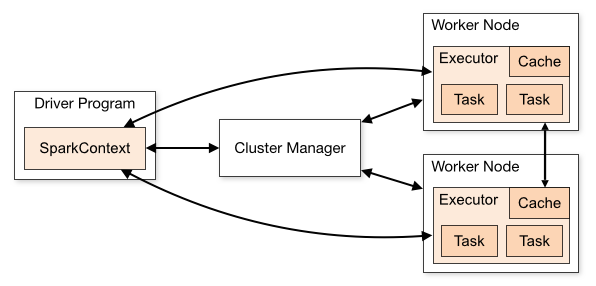

# Spark Core

> 大数据高速计算引擎

MapReduce、Spark、Flink（实时） => 3代计算引擎；昨天、今天、未来

MapReduce、Spark：类MR的处理引擎；底层原理非常相似；数据分区、map task、reduce task、shuffle

## 第1节 Spark概述

### 1.1 什么是Spark

Spark 是当今大数据领域最活跃、最热门、最高效的大数据通用计算引擎

2009年诞生于美国加州大学伯克利分校AMP 实验室

2010年通过BSD许可协议开源发布

2013年捐赠给Apache软件基金会并切换开源协议到切换许可协议至 Apache2.0

2014年2月，Spark 成为 Apache 的顶级项目

2014年11月, Spark的母公司Databricks团队使用Spark刷新数据排序世界记录

Spark 成功构建起了一体化、多元化的大数据处理体系。在任何规模的数据计算中，Spark 在性能和扩展性上都更具优势

Spark 是一个快速、通用的计算引擎。

Spark的特点：

- 速度快。

与 MapReduce 相比，Spark基于内存的运算要快100倍以上，基于硬盘的运算也要快10倍以上。
Spark实现了高效的DAG执行引擎，可以通过基于内存来高效处理数据流；

- 使用简单。

Spark支持 Scala、Java、Python、R的API，还支持超过80种高级算法，使用户可以快速构建不同的应用。
而且Spark支持交互式的Python和Scala的shell，可以非常方便地在这些shell中使用Spark集群来验证解决问题的方法；

- 通用。

Spark提供了统一的解决方案。Spark可以用于批处理、交互式查询(Spark SQL)、实时流处理(Spark Streaming)、
机器学习(Spark MLlib)和图计算(GraphX)。这些不同类型的处理都可以在同一个应用中无缝使用。

> Spark统一的解决方案非常具有吸引力，企业想用统一的平台去处理遇到的问题，减少开发和维护的人力成本和部署平台的物力成本；


- 兼容好。

Spark可以非常方便地与其他的开源产品进行融合。Spark可以使用YARN、Mesos作为它的资源管理和调度器；
可以处理所有Hadoop支持的数据，包括HDFS、HBase和Cassandra等。这对于已经部署Hadoop集群的用户特别重要，
因为不需要做任何数据迁移就可以使用Spark的强大处理能力。

Spark也可以不依赖于第三方的资源管理和调度器，它实现了Standalone作为其内置的资源管理和调度框架，
这样进一步降低了Spark的使用门槛，使得所有人都可以非常容易地部署和使用Spark。
此外，Spark还提供了在EC2上部署Standalone的Spark集群的工具。

### 1.2 Spark 与 Hadoop

从狭义的角度上看：Hadoop是一个分布式框架，由存储、资源调度、计算三部分组成；

Spark是一个分布式计算引擎，由 Scala 语言编写的计算框架，基于内存的快速、通用、可扩展的大数据分析引擎；

从广义的角度上看，Spark是Hadoop生态中不可或缺的一部分；


MapReduce的不足：

- 表达能力有限
- 磁盘IO开销大
- 延迟高(任务之间的衔接有IO开销; 在前一个任务执行完成之前，后一个任务无法开始。难以胜任复杂的、多阶段计算任务)


Spark在借鉴MapReduce优点的同时，很好地解决了MapReduce所面临的问题。

| 内容     | MapReduce                   | Spark                          |
|--------|-----------------------------|--------------------------------|
| 数据存储结构 | 磁盘HDFS文件系统的split            | 使用内存构建弹性分布式数据集RDD对数据进行运算和cache |
| 编程范式   | Map + Reduce, 仅提供两个操作，表达力欠缺 | 提供了丰富的操作，使数据处理逻辑的代码非常简短        |
| 数据流转   | 计算中间结果落到磁盘，IO及序列化、反序列化代价大   | 计算中间结果在内存中，维护存取速度比磁盘高几个数量级     |
| Task启动 | Task以进程的方式维护，需要数秒时间才能启动任务   | Task以线程的方式维护对于小数据集读取能够达到亚秒级的延迟 |

> 备注：Spark的计算模式也属于MapReduce；Spark框架是对MR框架的优化；


在实际应用中，大数据应用主要包括以下三种类型：

- 批量处理(离线处理)：通常时间跨度在数十分钟到数小时之间
- 交互式查询：通常时间跨度在数十秒到数分钟之间
- 流处理(实时处理)：通常时间跨度在数百毫秒到数秒之间

当同时存在以上三种场景时，传统的Hadoop框架需要同时部署三种不同的软件。 
如： MapReduce/Hive 或 Impala / Storm

这样做难免会带来一些问题：

- 不同场景之间输入输出数据无法做到无缝共享，通常需要进行数据格式的转换
- 不同的软件需要不同的开发和维护团队，带来了较高的使用成本
- 比较难以对同一个集群中的各个系统进行统一的资源协调和分配

Spark所提供的生态系统足以应对上述三种场景，即同时支持批处理、交互式查询和流数据处理：

- Spark的设计遵循"一个软件栈满足不同应用场景"的理念(all in one)，逐渐形成了一套完整的生态系统
- 既能够提供内存计算框架，也可以支持SQL即席查询、实时流式计算、机器学习和图计算等
- Spark可以部署在资源管理器YARN之上，提供一站式的大数据解决方案


Spark 为什么比 MapReduce 快?

1. Spark积极使用内存。

MR框架中一个 Job 包括一个 map 阶段（一个或多个map task） 和一个 reduce 阶段（一个或多个 reduce Task）。
如果业务处理逻辑复杂，此时需要将多个 job 组合起来；然而前一个job的计算结果必须写到HDFS，才能交给后一个job。
这样一个复杂的运算，在MR框架中会发生很多次写入、读取操作；**Spark**框架可以把多个map reduce task组合在一起连续执行，
*中间的计算结果不需要落地*；

- 复杂的MR任务：mr + mr + mr + mr +mr ...

- 复杂的Spark任务：mr -> mr -> mr ......

2. 多进程模型(MR) vs 多线程模型(Spark)。

MR框架中的的Map Task和Reduce Task是进程级别的，而Spark Task是基于线程模型的。

MR框架中的 map task、reduce task都是 jvm 进程，每次启动都需要重新申请资源，消耗了不必要的时间。
Spark则是通过复用线程池中的线程来减少启动、关闭task所需要的系统开销。

### 1.3 系统架构

Spark运行架构包括：Cluster Manager, Worker Node, Driver, Executor.

- Cluster Manager 是集群资源的管理者, Spark支持3种集群部署模式：Standalone、Yarn、Mesos；
- Worker Node 工作节点，管理本地资源；
- Driver Program 运行应用的 `main()` 方法并且创建了 SparkContext。由Cluster Manager分配资源，SparkContext 发送 Task 到 Executor 上执行；
- Executor：在工作节点上运行，执行 Driver 发送的 Task，并向 Driver 汇报计算结果；




### 1.4 Spark集群部署模式

Spark支持3种集群部署模式：Standalone、Yarn、Mesos；

#### 1. Standalone模式

独立模式，自带完整的服务，可单独部署到一个集群中，无需依赖任何其他资源管理系统。
从一定程度上说，该模式是其他两种的基础

- Cluster Manager：Master
- Worker Node：Worker

仅支持粗粒度的资源分配方式

#### 2. Spark On Yarn模式

Yarn拥有强大的社区支持，且逐步已经成为大数据集群资源管理系统的标准

> 在国内生产环境中运用最广泛的部署模式

Spark on yarn 的支持两种模式：

- yarn-cluster：适用于生产环境
- yarn-client：适用于交互、调试，希望立即看到app的输出
- Cluster Manager：ResourceManager
- Worker Node：NodeManager

仅支持粗粒度的资源分配方式

#### 3. Spark On Mesos模式

> 官方推荐的模式。

Spark开发之初就考虑到支持Mesos

Spark运行在Mesos上会比运行在YARN上更加灵活，更加自然

- Cluster Manager：Mesos Master
- Worker Node：Mesos Slave

支持粗粒度、细粒度的资源分配方式


**粗粒度模式**(Coarse-grained Mode)：每个应用程序的运行环境由一个Driver和若干个Executor组成，
其中，每个Executor占用若干资源，内部可运行多个Task。
应用程序的各个任务正式运行之前，需要将运行环境中的资源全部申请好，且运行过程中要*一直占用*这些资源，
即使不用，最后程序运行结束后，回收这些资源。

**细粒度模式**(Fine-grained Mode)：鉴于粗粒度模式会造成大量资源浪费，
Spark On Mesos还提供了另外一种调度模式：细粒度模式，这种模式类似于现在的云计算，
核心思想是*按需分配*。

三种集群部署模式如何选择：

- 生产环境中选择Yarn (国内使用最广的模式)
- Spark的初学者：Standalone，简单
- 开发测试环境，可选择Standalone
- 数据量不太大、应用不是太复杂，建议可以从Standalone模式开始
- mesos不会涉及到

### 1.5 相关术语

<http://spark.apache.org/docs/latest/cluster-overview.html>

- Application

用户提交的spark应用程序，由集群中的一个 Driver 和许多 executor 组成

- Application jar

一个包含spark应用程序的jar，jar不应该包含 Spark 或 Hadoop 的 jar，这些jar应该在运行时添加

- Driver program

运行应用程序的 `main()` 方法，并创建 `SparkContext`(Spark应用程序)

> Driver program 可以简单的理解为用户开发的 Spark 程序。

- Cluster manager

管理集群资源的服务，如 standalone，Mesos，Yarn

- Deploy mode

区分 driver 进程在何处运行。在 Cluster 模式下，在集群内部运行 Driver；在 Client 模式下，
Driver 在集群外部运行。

- Worker node

运行应用程序的工作节点

- Executor

运行应用程序 Task 和保存数据，每个应用程序都有自己的 executors，并且各个executor相互独立

- Task

executors应用程序的最小运行单元

- Job

在用户程序中，每次调用Action函数都会产生一个新的job，也就是说每个 Action 生成一个job

- Stage

一个 job 被分解为多个 stage，每个 stage 是一系列 Task 的集合


## 第2节 Spark安装配置

### 2.1 Spark安装

官网地址: <http://spark.apache.org/> 

文档地址: <http://spark.apache.org/docs/latest/>

下载地址: <http://spark.apache.org/downloads.html>

下载Spark安装包

下载地址: <https://archive.apache.org/dist/spark/>

> 备注:不用安装scala

#### 安装步骤

1. 下载软件解压缩，移动到指定位置

```shell
cd /opt/zmn/software/

tar zxvf spark-2.4.5-bin-without-hadoop-scala-2.12.tgz

mv spark-2.4.5-bin-without-hadoop-scala-2.12/ ../servers/spark-2.4.5/

# bin 目录下的 *.cmd 是 windows 系统的，没用可以删掉
cd /opt/zmn/servers/spark-2.4.5/bin
rm -rf *.cmd
```

2. 设置环境变量，并使之生效

```shell
vi /etc/profile

# SPARK_HOME
export SPARK_HOME=/opt/zmn/servers/spark-2.4.5
export PATH=$PATH:$SPARK_HOME/bin:$SPARK_HOME/sbin

source /etc/profile
```

3. 修改配置

文件位置: `$SPARK_HOME/conf` 

修改文件: slaves、spark-defaults.conf、spark-env.sh、log4j.properties

```shell
cp log4j.properties.template log4j.properties
cp slaves.template slaves

linux121
linux122
linux123
```

```shell
cp spark-defaults.conf.template spark-defaults.conf

spark.master                     spark://linux121:7077
spark.eventLog.enabled           true
spark.eventLog.dir               hdfs://linux121:9000/spark-eventlog
spark.serializer                 org.apache.spark.serializer.KryoSerializer
spark.driver.memory              512m
```

创建 HDFS 目录: `hdfs dfs -mkdir /spark-eventlog`

参数说明

| 参数                     | 含义                    |
|------------------------|-----------------------|
| spark.master           | 定义master节点，缺省端口号 7077 |
| spark.eventLog.enabled | 开启eventLog            |
| spark.eventLog.dir     | eventLog的存放位置         |
| spark.serializer       | 一个高效的序列化器             |
| spark.driver.memory    | 定义driver内存的大小(缺省1G)   |


```shell
cp spark-env.sh.template spark-env.sh

export JAVA_HOME=/opt/zmn/servers/jdk1.8.0_231
export HADOOP_HOME=/opt/zmn/servers/hadoop-2.9.2
export HADOOP_CONF_DIR=/opt/zmn/servers/hadoop-2.9.2/etc/hadoop
export SPARK_DIST_CLASSPATH=$(/opt/zmn/servers/hadoop-2.9.2/bin/hadoop classpath)
export SPARK_MASTER_HOST=linux121
export SPARK_MASTER_PORT=7077
```

> 这里使用的是 `spark-2.4.5-bin-without-hadoop`，所以要将 Hadoop 相关 jars 的位置告诉Spark

4. 将Spark软件分发到集群; 修改其他节点上的环境变量

```shell
cd /opt/zmn/servers/

scp -r spark-2.4.5/ linux122:$PWD
scp -r spark-2.4.5/ linux123:$PWD

# 更加推荐如下命令
rsync-script /opt/zmn/servers/spark-2.4.5
rsync-script /etc/profile
```

5. 启动集群

```shell
cd $SPARK_HOME/sbin

./start-all.sh
```

分别在linux121、linux122、linux123上执行 `jps`，可以发现: 

| Server   | Role          |
|----------|---------------|
| linux121 | Master、Worker |
| linux122 | Worker        |
| linux123 | Worker        |

此时 Spark 运行在 Standalone 模式下。

在浏览器中输入: <http://linux121:8080/> 可以看见如下 Spark 的 Web 界面:


---

注意事项：

在 `$HADOOP_HOME/sbin` 及 `$SPARK_HOME/sbin` 下都有 `start-all.sh` 和 `stop-all.sh` 文件

```shell
# 查看重复情况
whereis start-all.sh
```

在输入 `start-all.sh`/`stop-all.sh` 命令时，谁的搜索路径在前面就先执行谁，此时会产生冲突。

解决方案: 

- 删除一组 `start-all.sh`/`stop-all.sh` 命令，让另外一组命令生效。
- 将其中一组命令重命名。如: 将 `$HADOOP_HOME/sbin` 路径下的命令重命名为: `start-all-hadoop.sh`/`stop-all-hadoop.sh`
- 将其中一个框架的 sbin 路径不放在 PATH 中。

> 建议使用第二种

```shell
cd $HADOOP_HOME/sbin
mv start-all.sh start-all-hadoop.sh
mv stop-all.sh stop-all-hadoop.sh
```

6. 集群测试

```shell
run-example SparkPi 10

spark-shell
# HDFS 文件
scala> val lines = sc.textFile("/wcinput/wc.txt")
# lines: org.apache.spark.rdd.RDD[String] = /wcinput/wc.txt MapPartitionsRDD[1] at textFile at <console>:24

scala> lines.flatMap(_.split(" ")).map((_, 1)).reduceByKey(_+_).collect().foreach(println)
# (mapreduce,3)                                                                   
# (yarn,2)
# (zmn,3)
# (hadoop,2)
# (hdfs,1)
```

> Spark集群是否一定依赖 HDFS? 不是的，除非用到了 HDFS。

Apache Spark 支持多种部署模式。最简单的就是单机本地模式(Spark所有进程都运行在一台机器的JVM中)、
伪分布式模式(在一台机器中模拟集群运行，相关的进程在同一台机器上)。分布式模式包括:Standalone、Yarn、Mesos。

Apache Spark支持多种部署模式: 

- 本地模式: 最简单的运行模式，Spark所有进程都运行在一台机器的 JVM 中
- 伪分布式模式: 在一台机器中模拟集群运行，相关的进程在同一台机器上(用的非常少)
- 分布式模式: 包括:Standalone、Yarn、Mesos
    - Standalone: 使用Spark自带的资源调度框架 
    - Yarn: 使用 Yarn 资源调度框架 
    - Mesos: 使用 Mesos 资源调度框架

### 2.2 本地模式

> 使用较多。

本地模式部署在单机，主要用于测试或实验; 最简单的运行模式，所有进程都运行在一台机器的 JVM 中; 

本地模式用单机的多个线程来模拟Spark分布式计算，通常用来验证开发出来的应用程序逻辑上有没有问题;

这种模式非常简单，只需要把Spark的安装包解压后，改一些常用的配置即可使用。
不用启动Spark的Master、Worker守护进程，也不用启动Hadoop的服务(除非用到HDFS)。

- `local`: 在本地启动一个线程来运行作业; 
- `local[N]`: 启动了N个线程; 
- `local[*]`: 使用了系统中所有的核;
- `local[N,M]`: 第一个参数表示用到核的个数; 第二个参数表示容许作业失败的次数

> 前面几种模式没有指定 `M` 参数，其默认值都是1;

#### 测试案例

1. 关闭相关服务

```shell
# 停止 HDFS
stop-dfs.sh 
# 停止 Spark
stop-all.sh
```

2. 启动 Spark 本地运行模式

```shell
spark-shell --master local
```

> 备注: 此时可能有错误。主要原因是配置了日志聚合(即是用来了hdfs，但hdfs服务关闭了)，关闭该选项即可

```text
# spark-defaults.conf 文件中，注释以下两行:
spark.eventLog.enabled           true
spark.eventLog.dir               hdfs://linux121:9000/spark-eventlog
```

3. 使用 jps 检查，发现一个 SparkSubmit 进程

这个 `SparkSubmit` 进程又当爹、又当妈。既是客户提交任务的Client进程、又是Spark的driver程序、
还充当着Spark执行Task的Executor角色。

4. 执行简单的测试程序

```shell
scala> val lines = sc.textFile("file:///root/a.txt") 
scala> lines.count
```

### 2.3 伪分布式

伪分布式模式: 在一台机器中模拟集群运行，相关的进程在同一台机器上;

> 备注:不用启动集群资源管理服务;

`local-cluster[N,cores,memory]`

- N模拟集群的 Slave(或worker)节点个数 
- cores模拟集群中各个Slave节点上的内核数 
- memory模拟集群的各个Slave节点上的内存大小

> 备注: 参数之间没有空格，memory不能加单位

#### 测试案例

1. 启动 Spark 伪分布式模式

```shell
spark-shell --master local-cluster[4,2,1024]
```

2. 使用 jps 检查，发现1个 `SparkSubmit` 进程和4个 `CoarseGrainedExecutorBackend` 进程

- `SparkSubmit` 依然充当全能角色，又是 `Client` 进程，又是 `Driver` 程序，还有资源管理的作用。
- 4个 `CoarseGrainedExecutorBackend`，用来并发执行程序的进程。

3. 执行简单的测试程序

```shell
# 提交一个计算任务
spark-submit --master local-cluster[4,2,1024] --class org.apache.spark.examples.SparkPi \
  $SPARK_HOME/examples/jars/spark-examples_2.12-2.4.5.jar 10
```

注意事项:

- `local-cluster[4,2,1024]`，参数不要给太大，资源不够 
- 这种模式少用，有Bug。SPARK-32236

### 2.4 集群模式-Standalone模式

> 参考: <http://spark.apache.org/docs/latest/spark-standalone.html>

- 分布式部署才能真正体现分布式计算的价值
- 与单机运行的模式不同，这里必须先启动Spark的Master和Worker守护进程;关闭 yarn 对应的服务
- 不用启动Hadoop服务，除非要使用HDFS的服务

使用jps检查，可以发现:

- linux121: Master、Worker 
- linux122: Worker 
- linux123: Worker

使用浏览器查看(<http://linux121:8080/>)


#### 2.4.1 Standalone 配置

启动/停止的脚本

- Master: `sbin/start-master.sh`/`sbin/stop-master.sh` 
- 所有的 Worker: `sbin/start-slaves.sh`/`sbin/stop-slaves.sh`(最好在主节点执行)
- Worker: `sbin/start-slave.sh`/`sbin/stop-slave.sh` 
- All: `sbin/start-all.sh`/`sbin/stop-all.sh`

> 备注: `./sbin/start-slave.sh [options]`: 启动节点上的worker进程，调试中较为常用

------------------------------------------------------------------

**修改Spark硬件资源**

> 如果不想给 Spark 分配所有的资源，可以适当改小

在 `spark-env.sh` 中定义:

- `SPARK_WORKER_CORES`

Total number of cores to allow Spark applications to use on the machine 
(default: all available cores).

- `SPARK_WORKER_MEMORY`

Total amount of memory to allow Spark applications to use on the machine, 
e.g. 1000m, 2g (default: total memory minus 1 GiB); note that each application's 
individual memory is configured using its spark.executor.memory property.

测试在 `spark-env.sh` 中增加参数，分发到集群，重启服务:

```shell
export SPARK_WORKER_CORES=10
export SPARK_WORKER_MEMORY=20g
```

> 注意：在浏览器中观察集群状态，测试完成后将以上两个参数分别改为2、2g，重启服务。

#### 2.4.2 运行模式(cluster/client)

> 最大的区别: Driver运行在哪里? 

> client是缺省的模式，能看见返回结果，适合调试; cluster与此相反;

- Client模式(缺省): Driver运行在提交任务的Client，此时可以在Client模式下，看见应用的返回结果，
适合交互、调试

- Cluster模式: Driver运行在Spark集群中，看不见程序的返回结果，合适生产环境

##### 测试1(Client模式)

```shell
spark-submit --class org.apache.spark.examples.SparkPi \
  $SPARK_HOME/examples/jars/spark-examples_2.12-2.4.5.jar 1000
```

再次使用 `jps` 检查集群中的进程:

- `Master` 进程做为cluster manager，管理集群资源
- `Worker` 管理节点资源
- `SparkSubmit` 作为Client端，运行 Driver 程序。Spark Application执行完成, 进程终止
- `CoarseGrainedExecutorBackend` 运行在Worker上，用来并发执行应用程序

##### 测试2(Cluster模式)

```shell
spark-submit --class org.apache.spark.examples.SparkPi \
  --deploy-mode cluster \
  $SPARK_HOME/examples/jars/spark-examples_2.12-2.4.5.jar 1000
```

- `SparkSubmit` 进程会在应用程序提交给集群之后就退出
- `DriverWrapper` 进程会占用 Worker 进程的一个core(缺省分配1个core，1G内存)
- `Master` 会在集群中选择一个 Worker 进程生成一个子进程 `DriverWrapper` 来启动 Driver 程序
- `Worker` 节点上会启动 `CoarseGrainedExecutorBackend`
- 应用程序的结果，会在执行 Driver 程序的节点的 stdout 中输出，而不是打印在屏幕上

在启动 DriverWrapper 的节点上(不一定在主节点上)，进入 `$SPARK_HOME/work/`，可以看见类似 
`driver-20220326204811-0000` 的目录，这个就是 driver 运行时的日志文件，进入该目录，会发现:

- jar 文件，这就是移动的计算 
- stderr 运行日志文件
- stdout 输出结果文件

#### 2.4.3 History Server

```text
# spark-defaults.conf
# history server
spark.eventLog.enabled           true
spark.eventLog.dir               hdfs://linux121:9000/spark-eventlog
spark.eventLog.compress          true

# spark-env.sh
export SPARK_HISTORY_OPTS="-Dspark.history.ui.port=18080 -Dspark.history.retainedApplications=50 -Dspark.history.fs.logDirectory=hdfs://linux121:9000/spark-eventlog"
```

`spark.history.retainedApplications`: 设置缓存Cache中保存的应用程序历史记录的个数(默认50)，
如果超过这个值，旧的将被删除;

缓存文件数不表示实际显示的文件总数。只是表示不在缓存中的文件可能需要从硬盘读取，速度稍有差别。

> 前提条件: 启动 HDFS 服务(日志写到HDFS)

启动 `historyserver`，使用 jps 检查，可以看见 HistoryServer 进程。
如果看不见该进程，请检查对应的日志。

```shell
$SPARK_HOME/sbin/start-history-server.sh
```

Web端地址: <http://linux121:18080/>

#### 2.4.4 高可用配置

Spark Standalone 集群是 Master-Slaves 架构的集群模式，和大部分的 Master-Slaves 结构集群一样，
存着Master单点故障的问题。如何解决这个问题，Spark提供了两种方案:

1. 基于zookeeper的Standby Master，适用于生产模式。将 Spark 集群连接到 Zookeeper，
利用 Zookeeper 提供的选举和状态保存的功能，一个 Master 处于 Active 状态，其他 Master 处于Standby状态;

保证在ZK中的元数据主要是集群的信息，包括:Worker，Driver和Application以及 Executors的信息;

如果Active的Master挂掉了，通过选举产生新的 Active 的 Master，然后执行状态恢复，
整个恢复过程可能需要1~2分钟;

2. 基于文件系统的单点恢复(Single-Node Recovery with Local File System)，
主要用于开发或者测试环境。将 Spark Application 和 Worker 的注册信息保存在文件中，
一旦Master发生故障，就可以重新启动Master进程，将系统恢复到之前的状态


##### 配置步骤

1. 安装ZooKeeper，并启动

2. 修改 `spark-env.sh` 文件，并分发到集群中

```shell
# 注释以下两行!!!
# export SPARK_MASTER_HOST=linux121
# export SPARK_MASTER_PORT=7077

# 添加以下内容
export SPARK_DAEMON_JAVA_OPTS="-Dspark.deploy.recoveryMode=ZOOKEEPER -Dspark.deploy.zookeeper.url=linux121,linux122,linux123 -Dspark.deploy.zookeeper.dir=/spark"
```

备注:

- `spark.deploy.recoveryMode`: 可选值 Zookeeper、FileSystem、None
- `spark.deploy.zookeeper.url`: Zookeeper的URL，`主机名:端口号`(缺省2181)
- `spark.deploy.zookeeper.dir`: 保存集群元数据信息的地址，在ZooKeeper中保存该信息

3. 启动 Spark 集群(linux121)

```shell
$SPARK_HOME/sbin/start-all.sh
```

浏览器输入: <http://linux121:8080/>，刚开始 Master 的状态是 `STANDBY`，
稍等一会变为 `RECOVERING`，最终是 `ALIVE`。

4. 在 linux122 上启动master

```shell
$SPARK_HOME/sbin/start-master.sh
```

进入浏览器输入: <http://linux122:8080/>，此时 Master 的状态为 `STANDBY`。

5. 杀掉 linux121 上 Master 进程，再观察 linux122 上 Master 状态，
由 STANDBY => RECOVERING => ALIVE

小结:

- 配置每个 Worker 的core、memory 
- 运行模式: cluster、client; client缺省模式，有返回结果，适合调试;cluster 与此相反
- History server
- 高可用(ZK、Local File;在ZK中记录集群的状态)

### 2.5 集群模式-Yarn模式

> 参考 <http://spark.apache.org/docs/latest/running-on-yarn.html>

需要启动的服务: hdfs服务、yarn服务

需要关闭 Standalone 对应的服务(即集群中的Master、Worker进程)，一山不容二虎!

在Yarn模式中，Spark应用程序有两种运行模式:

- `yarn-client` Driver程序运行在客户端，适用于交互、调试，希望立即看到app的输出
- `yarn-cluster` Driver程序运行在由RM启动的 AppMaster中，适用于生产环境

二者的主要区别: Driver在哪里?

#### 配置步骤

1. 关闭 Standalone 模式下对应的服务; 开启 hdfs、yarn、HistoryServer 服务

2. 修改 yarn-site.xml 配置

在 `$HADOOP_HOME/etc/hadoop/yarn-site.xml` 中增加，分发到集群，重启 yarn 服务

```xml
<configuration>
  <property>
    <name>yarn.nodemanager.pmem-check-enabled</name>
    <value>false</value>
  </property>
  <property>
    <name>yarn.nodemanager.vmem-check-enabled</name>
    <value>false</value>
  </property>
</configuration>
```

参数说明:

- `yarn.nodemanager.pmem-check-enabled` 是否启动一个线程检查每个任务正使用的物理内存量，
如果任务超出分配值，则直接将其杀掉，默认是true 

- `yarn.nodemanager.vmem-check-enabled` 是否启动一个线程检查每个任务正使用的虚拟内存量，
如果任务超出分配值，则直接将其杀掉，默认是true

3. 修改配置，分发到集群

```shell
# spark-env.sh 中这一项必须要有
export HADOOP_CONF_DIR=/opt/zmn/servers/hadoop-2.9.2/etc/hadoop

# spark-default.conf(以下是优化)
# 与 hadoop historyserver集成
spark.yarn.historyServer.address linux121:18080

# 添加(以下是优化)
spark.yarn.jars         hdfs:///spark-yarn/jars/*.jar

# 将 $SPARK_HOME/jars 下的jar包上传到hdfs
hdfs dfs -mkdir -p /spark-yarn/jars/
cd $SPARK_HOME/jars
hdfs dfs -put * /spark-yarn/jars/
```

4. 测试

```shell
# client
spark-submit --master yarn \
  --deploy-mode client \
  --class org.apache.spark.examples.SparkPi \
  $SPARK_HOME/examples/jars/spark-examples_2.12-2.4.5.jar 2000
```

在提交App节点上可以看见: `SparkSubmit`、`CoarseGrainedExecutorBackend`

在集群的其他节点上可以看见: `CoarseGrainedExecutorBackend` 

在提交App节点上可以看见: 程序计算的结果(即可以看见计算返回的结果)

```shell
# cluster
spark-submit --master yarn \
  --deploy-mode cluster \
  --class org.apache.spark.examples.SparkPi \
  $SPARK_HOME/examples/jars/spark-examples_2.12-2.4.5.jar 2000
```

在提交App节点上可以看见: `SparkSubmit` 

在集群的其他节点上可以看见: `CoarseGrainedExecutorBackend`、`ApplicationMaster`(Driver运行在此)

在提交App节点上看不见最终的结果

#### 整合HistoryServer服务

> 前提: Hadoop的 HDFS、Yarn、HistoryServer 正常; Spark HistoryServer 服务正常; 

- Hadoop: JobHistoryServer 
- Spark: HistoryServer

将这两个服务整合到一起去

```shell
spark-submit \
  --class org.apache.spark.examples.SparkPi \
  --master yarn \
  --deploy-mode client \
  $SPARK_HOME/examples/jars/spark-examples_2.12-2.4.5.jar 20
```

1. 修改 spark-defaults.conf，并分发到集群

```shell
# 修改 spark-defaults.conf
spark.master              spark://linux121:7077
spark.eventLog.enabled    true
spark.eventLog.dir        hdfs://linux121:9000/spark-eventlog
spark.serializer          org.apache.spark.serializer.KryoSerializer
spark.driver.memory       512m

# 新增
spark.yarn.historyServer.address  linux121:18080
spark.history.ui.port             18080
```

2. 重启/启动 spark 历史服务

```shell
stop-history-server.sh 
start-history-server.sh
```

3. 提交任务

```shell
spark-submit \
  --class org.apache.spark.examples.SparkPi \
  --master yarn \
  --deploy-mode client \
  $SPARK_HOME/examples/jars/spark-examples_2.12-2.4.5.jar 100
```

4、Web页面查看日志

备注:

1. 在课程学习的过程中，大多数情况使用Standalone模式或者local模式 
2. 建议不使用HA; 更多关注的Spark开发

### 2.6 开发环境IDEA搭建

> 前提: 安装scala插件;能读写HDFS文件

pom.xml

```xml{}
<?xml version="1.0" encoding="UTF-8"?>
<project xmlns="http://maven.apache.org/POM/4.0.0"
         xmlns:xsi="http://www.w3.org/2001/XMLSchema-instance"
         xsi:schemaLocation="http://maven.apache.org/POM/4.0.0 http://maven.apache.org/xsd/maven-4.0.0.xsd">
  <modelVersion>4.0.0</modelVersion>

  <groupId>com.zmn</groupId>
  <artifactId>spark-test-101</artifactId>
  <version>1.0-SNAPSHOT</version>

  <properties>
    <maven.compiler.source>1.8</maven.compiler.source>
    <maven.compiler.target>1.8</maven.compiler.target>
    <scala.version>2.12.10</scala.version>
    <spark.version>2.4.5</spark.version>
    <hadoop.version>2.9.2</hadoop.version>
    <encoding>UTF-8</encoding>
  </properties>

  <dependencies>
    <dependency>
      <groupId>org.scala-lang</groupId>
      <artifactId>scala-library</artifactId>
      <version>${scala.version}</version>
    </dependency>
    <dependency>
      <groupId>org.apache.spark</groupId>
      <artifactId>spark-core_2.12</artifactId>
      <version>${spark.version}</version>
    </dependency>
  </dependencies>

  <build>
    <pluginManagement>
      <plugins>
        <!-- 编译scala的插件 -->
        <plugin>
          <groupId>net.alchim31.maven</groupId>
          <artifactId>scala-maven-plugin</artifactId>
          <version>3.2.2</version>
        </plugin>
        <!-- 编译java的插件 -->
        <plugin>
          <groupId>org.apache.maven.plugins</groupId>
          <artifactId>maven-compiler-plugin</artifactId>
          <version>3.5.1</version>
        </plugin>
      </plugins>
    </pluginManagement>
    <plugins>
      <plugin>
        <groupId>net.alchim31.maven</groupId>
        <artifactId>scala-maven-plugin</artifactId>
        <executions>
          <execution>
            <id>scala-compile-first</id>
            <phase>process-resources</phase>
            <goals>
              <goal>add-source</goal>
              <goal>compile</goal>
            </goals>
          </execution>
          <execution>
            <id>scala-test-compile</id>
            <phase>process-test-resources</phase>
            <goals>
              <goal>testCompile</goal>
            </goals>
          </execution>
        </executions>
      </plugin>
      <plugin>
        <groupId>org.apache.maven.plugins</groupId>
        <artifactId>maven-compiler-plugin</artifactId>
        <executions>
          <execution>
            <phase>compile</phase>
            <goals>
              <goal>compile</goal>
            </goals>
          </execution>
        </executions>
      </plugin>
      <!-- 打jar插件 -->
      <plugin>
        <groupId>org.apache.maven.plugins</groupId>
        <artifactId>maven-shade-plugin</artifactId>
        <version>2.4.3</version>
        <executions>
          <execution>
            <phase>package</phase>
            <goals>
              <goal>shade</goal>
            </goals>
            <configuration>
              <filters>
                <filter>
                  <artifact>*:*</artifact>
                  <excludes>
                    <exclude>META-INF/*.SF</exclude>
                    <exclude>META-INF/*.DSA</exclude>
                    <exclude>META-INF/*.RSA</exclude>
                  </excludes>
                </filter>
              </filters>
            </configuration>
          </execution>
        </executions>
      </plugin>
    </plugins>
  </build>
</project>
```


```scala{}
object WordCount {
  def main(args: Array[String]): Unit = {
    val conf = new SparkConf().setMaster("local").setAppName("WordCount")
    val sc = new SparkContext(conf)

    // 使用本地文件
    // val lines: RDD[String] = sc.textFile("data/wc.dat")

    // 使用 HDFS 文件 // 可以不需要配置文件
    // val lines: RDD[String] = sc.textFile("hdfs://linux121:9000/wcinput/wc.txt")

    // 使用 HDFS 文件 // 需要在 resource 中配置 core-site.xml
    val lines: RDD[String] = sc.textFile("/wcinput/wc.txt")


    lines.flatMap(_.split(" ")).map((_, 1)).reduceByKey(_ + _).collect().foreach(println)

    // 执行完成后可以在此停顿，观察 Web 界面，查看执行流程
    Thread.sleep(10000)

    sc.stop()
  }
}
```


