# Spark Core

## 第3节 RDD编程

### 3.1 什么是RDD

RDD是 Spark 的基石，是实现 Spark 数据处理的核心抽象。

RDD 是一个抽象类，它代表一个不可变、可分区、里面的元素可并行计算的集合。

RDD(Resilient Distributed Dataset 弹性分布式数据集)是 Spark 中的核心概念，
它是一个容错、可以并行执行的分布式数据集。

```scala
/**
 * Internally, each RDD is characterized by five main properties:
 *
 *  - A list of partitions
 *  - A function for computing each split
 *  - A list of dependencies on other RDDs
 *  - Optionally, a Partitioner for key-value RDDs (e.g. to say that the RDD is hash-partitioned)
 *  - Optionally, a list of preferred locations to compute each split on (e.g. block locations for
 *    an HDFS file)
 */
```

RDD包含5个特征:

1. 一个分区的列表
2. 一个计算函数compute，对每个分区进行计算
3. 对其他RDDs的依赖(宽依赖、窄依赖)列表
4. 对key-value RDDs来说，存在一个分区器(Partitioner)【可选的】
5. 对每个分区有一个优先位置的列表【可选的】

说明：

- 一组分片(Partition)，即数据集的基本组成单位。

对于RDD来说，每个分片都会被一个计算任务处理，并决定并行计算的粒度。用户可以在创建RDD时指定RDD的分片个数，
如果没有指定，那么就会采用默认值; 

- 一个对分区数据进行计算的函数。

Spark中RDD的计算是以分片为单位的，每个RDD都会实现 compute 函数以达到该目的。
compute函数会对迭代器进行组合，不需要保存每次计算的结果; 

> 一个分区对应一个计算任务。

- RDD之间存在依赖关系。

RDD的每次转换都会生成一个新的RDD，RDD之间形成类似于流水线一样的前后依赖关系(lineage)。
在部分分区数据丢失时， Spark可以通过这个依赖关系重新计算丢失的分区数据，而不是对RDD的所有分区进行重新计算;

- 对于 key-value 的RDD而言，可能存在分区器(Partitioner)。

Spark 实现了两种类型的分片函数，一个是基于哈希的HashPartitioner，另外一个是基于范围的RangePartitioner。
只有 key-value 的RDD，才可能有Partitioner，非key-value的RDD的 Partitioner 的值是None。
Partitioner函数决定了RDD本身的分片数量，也决定了parent RDD Shuffle输出时的分片数量;

- 一个列表，存储存储每个Partition的优先位置(preferred location)。

对于一个HDFS文件来说，这个列表保存的就是每个Partition所在的块的位置。按照*"移动计算不移动数据"*的理念，
Spark在任务调度的时候，会尽可能地将计算任务分配到其所要处理数据块的存储位置。

### 3.2 RDD的特点

1、分区

RDD逻辑上是分区的，每个分区的数据是**抽象存在**的，计算的时候会通过一个 compute 函数得到每个分区的数据。
如果RDD是通过已有的文件系统构建，则 compute函数是读取指定文件系统中的数据，如果RDD是通过其他RDD转换而来，
则compute函数是执行转换逻辑将其他RDD的数据进行转换。

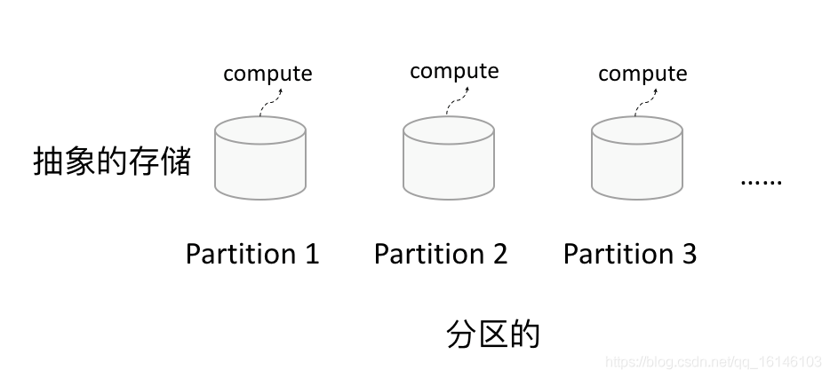

2、只读 

RDD是只读的，要想改变RDD中的数据，只能在现有的RDD基础上创建新的RDD;

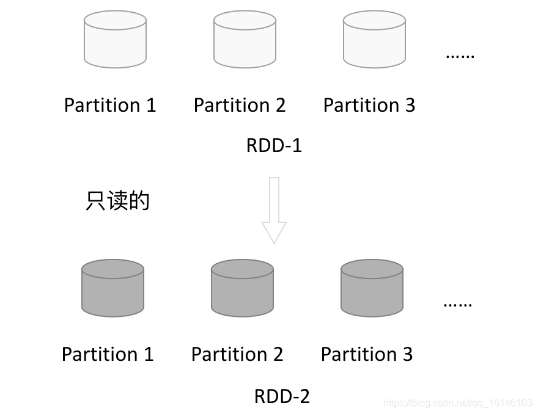

一个RDD转换为另一个RDD，通过丰富的操作算子(map、filter、union、join、 reduceByKey...)
实现，不再像MR那样只能写map和reduce了。

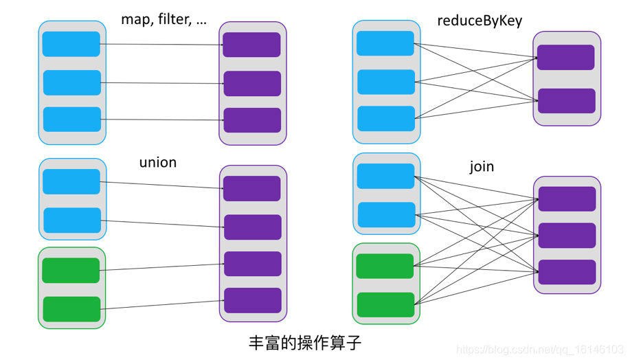

RDD的操作算子包括两类:

- Transformation 用来对RDD进行转化，延迟执行(Lazy); 
- Action 用来触发RDD的计算; 得到相关计算结果或者将RDD保存的文件系统中;

> 个人感觉： Transformation 相当于 Java 中的过程流; Action 相当于 Java 中的终结流。

3、依赖 

RDDs通过操作算子进行转换，转换得到的新RDD包含了从其他RDDs衍生所必需的信息，
RDDs之间维护着这种血缘关系(lineage)，也称之为依赖。

依赖包括两种:

- 窄依赖：RDDs之间分区是一一对应的(1:1 或 n:1) 
- 宽依赖：子RDD每个分区与父RDD的每个分区都有关，是多对多的关系(即 `n:m`)。【有shuffle发生】

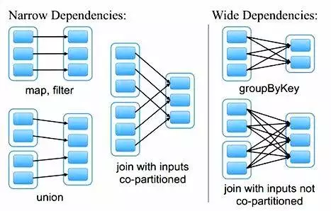

4、缓存

可以控制存储级别(内存、磁盘等)来进行缓存。

如果在应用程序中多次使用同一个RDD，可以将该RDD缓存起来，该RDD只有在第一次计算的时候会根据血缘关系得到分区的数据，
在后续其他地方用到该RDD的时候，会直接从缓存处取而不用再根据血缘关系计算，这样就加速后期的重用。

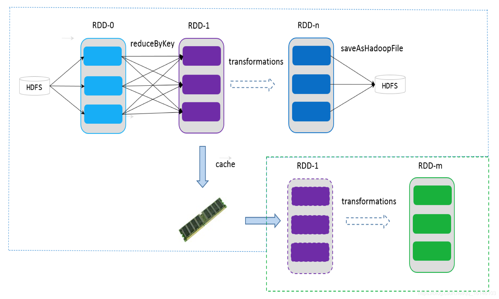

5、checkpoint 

虽然RDD的血缘关系天然地可以实现容错，当RDD的某个分区数据失败或丢失，可以通过血缘关系重建。

但是于长时间迭代型应用来说，随着迭代的进行，RDDs之间的血缘关系会越来越长，
一旦在后续迭代过程中出错，则需要通过非常长的血缘关系去重建，势必影响性能。

RDD支持 checkpoint 将数据保存到持久化的存储中，这样就可以切断之前的血缘关系，
因为checkpoint后的RDD不需要知道它的父RDDs了，它可以从 checkpoint 处拿到数据。

### 3.3 Spark编程模型

#### 逻辑模型

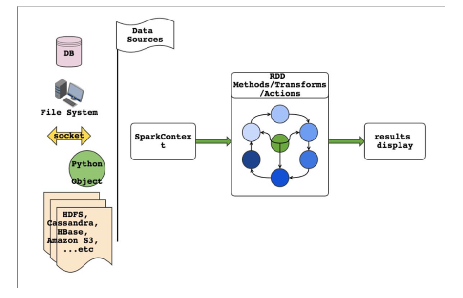

说明：

- RDD表示数据对象 
- 通过对象上的方法调用来对RDD进行转换
- 最终显示结果或将结果输出到外部数据源 
- RDD转换算子称为Transformation是Lazy的(延迟执行) 
- 只有遇到Action算子，才会执行RDD的转换操作

-----------------------------------------------------

#### 物理模型

要使用Spark，需要编写 Driver 程序，它被提交到集群运行

- Driver中定义了一个或多个 RDD ，并调用 RDD 上的各种算子
- Worker则执行RDD分区计算任务

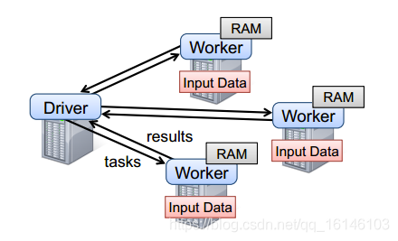

### 3.4 RDD的创建

1、SparkContext

`SparkContext` 是编写Spark程序用到的第一个类，是Spark的主要入口点，它负责和整个集群的交互;

```scala
/**
 * Main entry point for Spark functionality. A SparkContext represents the connection to a Spark
 * cluster, and can be used to create RDDs, accumulators and broadcast variables on that cluster.
 *
 * Only one SparkContext may be active per JVM.  You must `stop()` the active SparkContext before
 * creating a new one.  This limitation may eventually be removed; see SPARK-2243 for more details.
 *
 * @param config a Spark Config object describing the application configuration. Any settings in
 *   this config overrides the default configs as well as system properties.
 */
```

如把Spark集群当作服务端，那么Driver就是客户端，SparkContext 是客户端的核心;

SparkContext是Spark的对外接口，负责向调用者提供 Spark 的各种功能; 

SparkContext用于连接Spark集群、创建RDD、累加器、广播变量;

--------------------------------------------------------------------

在 spark-shell 中 SparkContext 已经创建好了，可直接使用; 

编写Spark Driver程序第一件事就是: 创建SparkContext;

```text{2}
Spark context Web UI available at http://linux121:4040
Spark context available as 'sc' (master = spark://linux121:7077, app id = app-20220327170814-0000).
Spark session available as 'spark'.
Welcome to
      ____              __
     / __/__  ___ _____/ /__
    _\ \/ _ \/ _ `/ __/  '_/
   /___/ .__/\_,_/_/ /_/\_\   version 2.4.5
      /_/
         
Using Scala version 2.12.10 (Java HotSpot(TM) 64-Bit Server VM, Java 1.8.0_231)
Type in expressions to have them evaluated.
Type :help for more information.

scala> 
```

> 建议: 使用Standalone模式或本地模式学习RDD的各种算子; 不需要HA; 不需要IDEA

2、从集合创建RDD

从集合中创建RDD，主要用于测试。Spark 提供了以下函数: `parallelize`、 `makeRDD`、`range`

```scala{}
val rdd1 = sc.parallelize(Array(1,2,3,4,5))
val rdd2 = sc.parallelize(1 to 100)

// 检查 RDD 分区数 
rdd2.getNumPartitions
rdd2.partitions.length

// 创建 RDD，并指定分区数
val rdd2 = sc.parallelize(1 to 100, 10) // 分区数为 10
rdd2.getNumPartitions
val rdd3 = sc.makeRDD(List(1,2,3,4,5), 10) // 分区数为 10
rdd3.getNumPartitions
val rdd4 = sc.makeRDD(1 to 100, 10)
rdd4.getNumPartitions
val rdd5 = sc.range(1, 100, 3) // 3 是步长
rdd5.getNumPartitions // => 6
val rdd6 = sc.range(1, 100, 2, 10) // 2 是步长，10 是分区数
rdd6.getNumPartitions
val rdd7 = sc.range(1, 100, numSlices = 10) // 通过显式参数的方式指定分区数，这样可以省略步长
rdd7.getNumPartitions
```

> 备注: `rdd.collect` 方法在生产环境中不要使用，会造成Driver OOM

3、从文件系统创建RDD

用 `textFile()` 方法来从文件系统中加载数据创建RDD。
方法将文件的 URI 作为参数， 这个URI可以是:

- 本地文件系统 (使用本地文件系统要注意: 该文件是不是在所有的节点存在【在Standalone模式下】) 
- 分布式文件系统HDFS的地址
- Amazon S3 的地址

```scala{}
// 从本地文件系统加载数据
val lines = sc.textFile("file:///root/data/wc.txt")
// 从分布式文件系统加载数据
val lines = sc.textFile("hdfs://linux121:9000/user/root/data/uaction.dat")
val lines = sc.textFile("/user/root/data/uaction.dat")
val lines = sc.textFile("data/uaction.dat")
```

4、从RDD创建RDD

本质是将一个RDD转换为另一个RDD。

> 详细信息参见 3.5 Transformation

### 3.5 Transformation【重要】

RDD的操作算子分为两类:

- Transformation 用来对RDD进行转化，这个操作时*延迟执行*的(或者说是 Lazy 的);
- Action 用来触发RDD的计算; 得到相关计算结果或者将结果保存的外部系统中;

- Transformation: 返回一个新的RDD 
- Action: 返回结果int、double、集合(不会返回新的RDD)

> 要很准确区分Transformation、Action

每一次 Transformation 操作都会产生新的RDD，供给下一个“转换”使用;

转换得到的RDD是惰性求值的。也就是说，整个转换过程只是记录了转换的轨迹，并不会发生真正的计算，
只有遇到 Action 操作时，才会发生真正的计算，开始从血缘关系(lineage)源头开始，进行物理的转换操作;

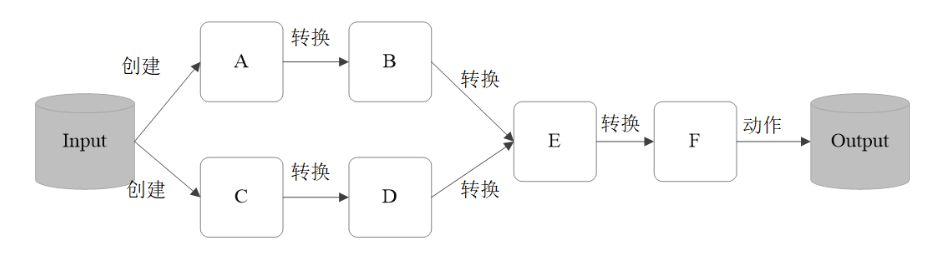

常见的 Transformation 算子: 

> 官方文档: <http://spark.apache.org/docs/latest/rdd-programming-guide.html#transformations>

#### 常见转换算子1

- `map(func)`: 对数据集中的每个元素都使用func，然后返回一个新的RDD
- `filter(func)`: 对数据集中的每个元素都使用func，然后返回一个包含使func为true的元素构成的RDD
- `flatMap(func)`: 与 `map` 类似，每个输入元素被映射为0或多个输出元素
- `mapPartitions(func)`: 和 `map` 很像，但是 `map` 是将func作用在每个元素上，而 `mapPartitions` 是func作用在整个分区上。

> 假设一个RDD有N个元素，M个分区(N >> M)，那么map的函数将被调用N次，而mapPartitions中的函数仅被调用M次，一次处理一个分区中的所有元素

- `mapPartitionsWithIndex(func)`: 与 `mapPartitions` 类似，多了分区索引值信息 

全部都是窄依赖

> 窄依赖简单讲就是*分区数不变*、*中间没有 Shuffle* 操作。

```scala{}
val rdd1 = sc.parallelize(1 to 10)
val rdd2 = rdd1.map(_*2)
val rdd3 = rdd2.filter(_ % 3 == 0)

// 以上都是 Transformation 操作，没有被执行。
// 如何证明这些操作按预期执行，此时需要引入Action算子
rdd2.collect
rdd3.collect
// collect 是Action算子，触发Job的执行，将RDD的全部元素从 Executor 搜集到 Driver 端。
// 生产环境中禁用

// flatMap 使用案例
val rdd4 = sc.textFile("data/wc.txt")
rdd4.collect // 文件中每一行就是此处一个元素
rdd4.flatMap(_.split(" ")).collect // 按照空格切分，返回的元素是单词

// RDD 是分区，rdd4有几个区，每个分区有哪些元素
rdd4.getNumPartitions
rdd4.partitions.length

val rdd1 = sc.makeRDD(1 to 20)

rdd1.mapPartitions(iter => Iterator(iter.toArray.mkString(":"))).collect
// Array(1:2:3, 4:5:6, 7:8:9:10, 11:12:13, 14:15:16, 17:18:19:20)

rdd1.mapPartitions{iter =>
  Iterator(s"${iter.toList}")
}.collect
// Array(List(1, 2, 3), List(4, 5, 6), List(7, 8, 9, 10), List(11, 12, 13), 
//        List(14, 15, 16), List(17, 18, 19, 20))

rdd1.mapPartitions{iter =>
  Iterator(s"${iter.toArray.mkString("-")}")
}.collect
// Array(1-2-3, 4-5-6, 7-8-9-10, 11-12-13, 14-15-16, 17-18-19-20)

// 第一个参数是分区编号
rdd1.mapPartitionsWithIndex{(idx, iter) =>
  Iterator(s"$idx:${iter.toArray.mkString("-")}")
}.collect
// Array(0:1-2-3, 1:4-5-6, 2:7-8-9-10, 3:11-12-13, 4:14-15-16, 5:17-18-19-20)

// 每个元素 * 2
val rdd5 = rdd1.mapPartitions(iter => iter.map(_*2))
rdd5.collect
```

**map 与 mapPartitions 的区别**

- `map`: 每次处理一条数据 
- `mapPartitions`: 每次处理一个分区的数据，分区的数据处理完成后，数据才能释放，资源不足时容易导致OOM 

最佳实践: 当内存资源充足时，建议使用 `mapPartitions`，以提高处理效率

#### 常见转换算子2

- `groupBy(func)`: 按照传入函数的返回值进行分组。将key相同的值放入一个迭代器 
- `glom()`: 将每一个分区形成一个数组，形成新的RDD类型 `RDD[Array[T]]`
- `sample(withReplacement, fraction, seed)`: 采样算子。以指定的随机种子(`seed`)随机抽样出数量为 `fraction` 的数据，`withReplacement`表示是抽出的数据是否放回，`true`为有放回的抽样，`false`为无放回的抽样
- `distinct([numTasks]))`: 对RDD元素去重后，返回一个新的RDD。可传入 `numTasks` 参数改变RDD分区数
- `coalesce(numPartitions)`: 缩减分区数，无shuffle 
- `repartition(numPartitions)`: 增加或减少分区数，有shuffle
- `sortBy(func, [ascending], [numTasks])`: 使用 func 对数据进行处理，对处理后的结果进行排序

宽依赖的算子(shuffle): `groupBy`、`distinct`、`repartition`、`sortBy`

```scala{}
// 将 RDD 中的元素按照3的余数分组
val rdd = sc.parallelize(1 to 10)
val group = rdd.groupBy(_ % 3)
group.collect
// Array[(Int, Iterable[Int])] = Array(
//    (0,CompactBuffer(9, 3, 6)), (1,CompactBuffer(7, 4, 10, 1)), 
//    (2,CompactBuffer(5, 2, 8)))

val rdd = sc.parallelize(1 to 10)
val rdd2 = rdd.glom
rdd2.collect
// Array(Array(1), Array(2, 3), Array(4, 5), Array(6), Array(7, 8), Array(9, 10))

// 将 RDD 中的元素每10个元素分组
val rdd = sc.parallelize(1 to 101)
rdd.glom.map(_.sliding(10, 10).toArray).collect
// sliding 是Scala中的方法, 用于切分数组
// 第一个参数是切分后的数组的长度
// 第二个参数是每个List的第一个元素相对于上一个List的第一个元素移动的步数

// 对数据采样。fraction采样的百分比，近似数 
// 第一个参数：是否放回采样; 如果放回，则样本有概率会重复；
// 第二个参数：采集的百分比(概数，不一定特别准确)；
// 第三个参数：如果写了相同的数，多次采样的样本都是一样的，不写就每次采样的样本都不一样
// 有放回的采样，使用固定的种子 
rdd.sample(true, 0.2, 2).collect
// 无放回的采样，使用固定的种子
rdd.sample(false, 0.2, 2).collect
// 有放回的采样，不设置种子
rdd.sample(false, 0.2).collect

// 使用场景：在部分数据上做测试

// 数据去重
val random = scala.util.Random
val arr = (1 to 20).map(x => random.nextInt(10))
val rdd = sc.makeRDD(arr)
rdd.distinct.collect

// RDD重分区
// 数据准备
val rdd1 = sc.range(1, 10000, numSlices=10)
val rdd2 = rdd1.filter(_%2==0)
rdd2.getNumPartitions

// 减少分区数;都生效了
val rdd3 = rdd2.repartition(5)
rdd3.getNumPartitions

val rdd4 = rdd2.coalesce(5)
rdd4.getNumPartitions

// 增加分区数
val rdd5 = rdd2.repartition(20)
rdd5.getNumPartitions

// 增加分区数，这样使用没有效果
val rdd6 = rdd2.coalesce(20)
rdd6.getNumPartitions

// 增加分区数的正确用法
val rdd6 = rdd2.coalesce(20, true) 
// 等于是将默认的参数 shuffle 设置为 true 就可以增加分区数了; 因为增加分区 shuffle 不可避免
rdd6.getNumPartitions

// RDD元素排序
val random = scala.util.Random
val arr = (1 to 20).map(x => random.nextInt(10))
val rdd = sc.makeRDD(arr)
rdd.collect

// 数据全局有序，默认升序
rdd.sortBy(x=>x).collect
// 降序
rdd.sortBy(x=>x,false).collect
```

**coalesce 与 repartition 的区别**

- coalesce: 一般用于减少分区数(此时无shuffle)
- repartition: 增大或减少分区数; 有shuffle

#### 常见转换算子3

RDD之间的交、并、差算子，分别如下:

- `intersection(otherRDD)`
- `union(otherRDD)`
- `subtract (otherRDD)`

-----------------------------------------------------------------------

- `cartesian(otherRDD)`: 笛卡尔积(RDD1中每个元素和RDD2中每个元素发生关系)
- `zip(otherRDD)`: 将两个RDD组合成 key-value 形式的RDD，默认两个RDD的 partition 
  数量以及元素数量都相同，否则会抛出异常。 

宽依赖的算子(shuffle): `intersection`、`subtract`

```scala{}
val rdd1 = sc.range(1, 21)
val rdd2 = sc.range(10, 31)

rdd1.intersection(rdd2).sortBy(x => x).collect
// 元素求并集，不去重
rdd1.union(rdd2).sortBy(x => x).collect
// 差集有方向 (rdd1 和 rdd2 位置换了以后结果不一样)
rdd1.subtract(rdd2).sortBy(x => x).collect

// 检查分区数
rdd1.intersection(rdd2).getNumPartitions // 6
rdd1.union(rdd2).getNumPartitions // 12
rdd1.subtract(rdd2).getNumPartitions // 6

// 笛卡尔积
val rdd1 = sc.range(1, 5)
val rdd2 = sc.range(6, 10)
rdd1.cartesian(rdd2).collect
// Array((1,6), (1,7), (1,8), (1,9), (2,6), (2,7), (2,8), (2,9),
// (3,6), (3,7), (3,8), (3,9), (4,6), (4,7), (4,8), (4,9))

// 检查分区数
rdd1.cartesian(rdd2).getNumPartitions // 36

// 拉链操作
rdd1.zip(rdd2).collect // Array((1,6), (2,7), (3,8), (4,9))
rdd1.zip(rdd2).getNumPartitions // 6

// zip操作要求:两个RDD的partition数量以及元素数量都相同，否则会抛出异常
val rdd2 = sc.range(6, 20)
rdd1.zip(rdd2).collect
// Can only zip RDDs with same number of elements in each partition
```

备注:

1. `union`是窄依赖。(得到的RDD分区数为:两个RDD分区数之和)

2. `cartesian` 是窄依赖

- 得到RDD的元素个数为: 两个RDD元素个数的乘积
- 得到RDD的分区数为: 两个RDD分区数的乘积
- 使用该操作会导致数据膨胀，慎用！！

### 3.6 Action

Action 用来触发RDD的计算，得到相关计算结果;

> Action触发Job。一个Spark程序(Driver程序)包含了多少 Action 算子，那么就有多少Job;

> 典型的Action算子: `collect`/`count`

> `collect()` => `sc.runJob()` => ... => `dagScheduler.runJob()` => 触发了Job

> 要求: 能快速准确的区分 Transformation 和 Action

收集：`collect()`/`collectAsMap()`

统计： `stats`/`count`/`mean`/`stdev`/`max`/`min`

聚合：`reduce(func)`/`fold(func)`/`aggregate(func)`

-----------------------------------------

- `first()`: Return the first element in this RDD

- `take(n)`: T ake the first num elements of the RDD 

- `top(n)`: 按照默认(降序)或者指定的排序规则，返回前num个元素。 

- `takeSample(withReplacement, num, [seed])`: 返回采样的数据

- `foreach(func)`/`foreachPartition(func)`: 与map、mapPartitions类似，区别是 foreach 是 Action

保存RDD中的数据： `saveAsTextFile(path)`/`saveAsSequenceFile(path)`/`saveAsObjectFile(path)`

-----------------------------------------

```scala{}
// 返回统计信息。仅能作用 RDD[Double] 类型上调用
val rdd1 = sc.range(1, 101)
rdd1.stats
//  (count: 100, mean: 50.500000, stdev: 28.866070, max: 100.000000, min: 1.000000)

val rdd2 = sc.range(1, 101)

// 不能调用 // 为什么不能调用？因为 stats 统计信息 RDD 中的元素时单个而且是数字，
// zip 之后的 RDD 中的元素是 (key, value) 结构的。
rdd1.zip(rdd2).stats

// count在各种类型的RDD上，均能调用
rdd1.zip(rdd2).count // 100

// 聚合操作
val rdd = sc.makeRDD(1 to 10, 2)
rdd.reduce(_+_) // 55
rdd.fold(0)(_+_) // 55
rdd.fold(1)(_+_) // 58
// 为什么是 58？ 此处有两个分区，每个分区局部汇总 +1 = 2; 全局汇总再 +1 总共是 +3，所以结果58
// 如果此处有八个分区结果就是 局部汇总 +1*8 再全局汇总 + 1 = 55 +9 = 64

rdd.fold(0)((x, y) => {
  println(s"x=$x, y=$y")
  x+y 
})
// x=0, y=15
// x=15, y=40

rdd.fold(1)((x, y) => {
  println(s"x=$x, y=$y")
  x+y
})
// x=1, y=41
// x=42, y=16

// fold 局部汇总和全局汇总的方法都是一样
// aggregate 可以分别定制局部汇总方法和局部汇总方法

// 第一个参数: 初始值；第二个参数：局部汇总方法；第三个参数：全局汇总方法
rdd.aggregate(0)(_+_, _+_)
rdd.aggregate(1)(_+_, _+_)
rdd.aggregate(1)(
  (a, b) => {
    println(s"a=$a, b=$b")
    a+b 
  },
  (x, y) => {
    println(s"x=$x, y=$y")
    x+y
  }
)

// first/take(n)/top(n): 获取RDD中的元素。多用于测试 
rdd.first
rdd.take(10)
rdd.top(10) // 排序后取Top10，如果 RDD 的元素是对象，需要自定义比较方式

// 采样并返回结果 
rdd.takeSample(false, 5) // 第二个参数表示返回多少个元素

// 保存文件到指定路径(rdd有多少分区，就保存为多少文件，保存文件时注意小文件问题)
rdd.saveAsTextFile("data/t1")
```

> fold() 执行图解：
>
> 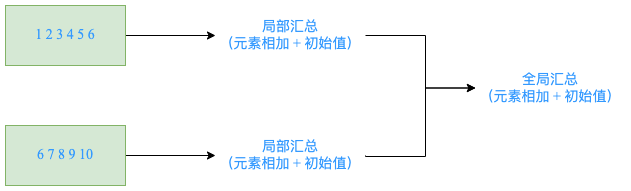

### 3.7 Key-Value RDD操作

RDD整体上分为 Value 类型和 Key-Value 类型。

前面介绍的是 Value 类型的RDD的操作，实际使用更多的是 key-value 类型的 RDD，也称为 PairRDD。

> Key-Value 类型的RDD更为常用。

Value 类型RDD的操作基本集中在 `RDD.scala` 中;

key-value 类型的RDD操作集中在 `PairRDDFunctions.scala` 中;

前面介绍的大多数算子对 Pair RDD 都是有效的。Pair RDD还有属于自己的 Transformation、Action 算子;

#### 3.7.1 创建Pair RDD

```scala{}
val arr = (1 to 10).toArray
val arr1 = arr.map(x => (x, x*10, x*100))
// rdd1 不是 Pair RDD
val rdd1 = sc.makeRDD(arr1) // 元素时元组的RDD

// rdd2 是 Pair RDD
val arr2 = arr.map(x => (x, (x*10, x*100)))
val rdd2 = sc.makeRDD(arr2)
```

#### 3.7.2 Transformation操作

1、(类似) map 操作

`mapValues`/`flatMapValues`/`keys`/`values`，这些操作都可以使用 map 操作实现，是简化操作。

```scala{}
val a = sc.parallelize(List((1,2),(3,4),(5,6)))

// 使用 mapValues 更简洁
val b = a.mapValues(x => 1 to x)
b.collect // Array((1,Range 1 to 2), (3,Range 1 to 4), (5,Range 1 to 6))

// 可使用map实现同样的操作
val b = a.map(x => (x._1, 1 to x._2))
b.collect // Array((1,Range 1 to 2), (3,Range 1 to 4), (5,Range 1 to 6))

val b = a.map{ case (k, v) => (k, 1 to v)}
b.collect // Array((1,Range 1 to 2), (3,Range 1 to 4), (5,Range 1 to 6))

// flatMapValues 将 value 的值压平
val c = a.flatMapValues(x => 1 to x)
c.collect // Array((1,1), (1,2), (3,1), (3,2), (3,3), (3,4), (5,1), (5,2), (5,3), (5,4), (5,5), (5,6))

val c = a.mapValues(x => 1 to x).flatMap{case (k, v) => v.map(x => (k, x))}
c.collect // Array((1,1), (1,2), (3,1), (3,2), (3,3), (3,4), (5,1), (5,2), (5,3), (5,4), (5,5), (5,6))

c.keys.collect // Array(1, 1, 3, 3, 3, 3, 5, 5, 5, 5, 5, 5)
c.values.collect // Array(1, 2, 1, 2, 3, 4, 1, 2, 3, 4, 5, 6)

c.map{case (k, v) => k}.collect
c.map{case (k, _) => k}.collect
c.map{case (_, v) => v}.collect
```

2、聚合操作【重要、难点】

> `PariRDD(k, v)` 使用范围广

聚合: `groupByKey`/`reduceByKey`/`foldByKey`/`aggregateByKey`

`combineByKey(OLD)`/`combineByKeyWithClassTag(NEW)` => 底层实现

`subtractByKey`: 类似于subtract，删掉 RDD 中键与 other RDD 中的键相同的元素

小案例: 

给定一组数据: `("spark", 12), ("hadoop", 26), ("hadoop", 23), ("spark", 15),
("scala", 26), ("spark", 25), ("spark", 23), ("hadoop", 16), ("scala", 24), 
("spark", 16)`， 键值对的key表示图书名称，value表示某天图书销量。
计算每个键对应的平均值，也就是计算每种图书的每天平均销量。

```scala{}
val rdd = sc.makeRDD(Array(("spark", 12), ("hadoop", 26), ("hadoop", 23), 
  ("spark", 15), ("scala", 26), ("spark", 25), ("spark", 23), ("hadoop", 16), 
  ("scala", 24), ("spark", 16)))

// groupByKey
rdd.groupByKey().collect 
// Array((scala,CompactBuffer(26, 24)), (hadoop,CompactBuffer(26, 23, 16)), (spark,CompactBuffer(12, 25, 15, 16, 23)))
// CompactBuffer 是 Spark 自定义的数据结构

// 下面三个语句效果相同
rdd.groupByKey().map(x => (x._1, x._2.sum.toDouble/x._2.size)).collect
// Array((scala,25.0), (hadoop,21.666666666666668), (spark,18.2))
rdd.groupByKey().map{case (k, v) => (k, v.sum.toDouble/v.size)}.collect
rdd.groupByKey.mapValues(v => v.sum.toDouble/v.size).collect

// reduceByKey
rdd.mapValues((_, 1)) // Array[(String, (Int, Int))]
  .reduceByKey((x, y)=> (x._1 + y._1, x._2 + y._2)) // (注意：此时x,y都是元组) 元组中第一个数求和，第二个数计数
  .mapValues(x => (x._1.toDouble / x._2)) // 此时 x 的数据类型是元组
  .collect()

// foldByKey => 可以定义初值(在第一个括号内)
rdd.mapValues((_, 1)).foldByKey((0, 0))((x, y) => {(x._1+y._1, x._2+y._2)}).mapValues(x=>x._1.toDouble/x._2).collect

// aggregateByKey
// aggregateByKey => 定义初值 + 分区内的聚合函数 + 分区间的聚合函数 
rdd.mapValues((_, 1))
  .aggregateByKey((0,0))( // 定义初值
    (x, y) => (x._1 + y._1, x._2 + y._2), // 分区内的聚合函数
    (a, b) => (a._1 + b._1, a._2 + b._2) // 分区间的聚合函数
  ).mapValues(x=>x._1.toDouble / x._2).collect

// 初值(元组)与RDD元素类型(Int)可以不一致
rdd.aggregateByKey((0, 0))(
  (x, y) => {println(s"x=$x, y=$y"); (x._1 + y, x._2 + 1)}, // 注意：此时的 y 是 Int，而不是元组
  (a, b) => {println(s"a=$a, b=$b"); (a._1 + b._1, a._2 + b._2)}
).mapValues(x => x._1.toDouble / x._2).collect

// 分区内的合并与分区间的合并，可以采用不同的方式; 这种方式是低效的! 
rdd.aggregateByKey(scala.collection.mutable.ArrayBuffer[Int]())(
  (x, y) => {x.append(y); x},
  (a, b) => {a ++ b} // 两个 buffer 相加使用 ++
).mapValues(v => v.sum.toDouble/v.size).collect

// combineByKey(理解就行) 
rdd.combineByKey(
  (x: Int) => {println(s"x=$x"); (x,1)},
  (x: (Int, Int), y: Int) => {println(s"x=$x, y=$y"); (x._1+y, x._2+1)},
  (a: (Int, Int), b: (Int, Int)) => {
    println(s"a=$a, b=$b");
    (a._1+b._1, a._2+b._2)
  }
).mapValues(x => x._1.toDouble/x._2).collect

// subtractByKey 减去相同的key
val rdd1 = sc.makeRDD(Array(("spark", 12), ("hadoop", 26), 
  ("hadoop", 23), ("spark", 15)))
val rdd2 = sc.makeRDD(Array(("spark", 100), ("hadoop", 300)))
rdd1.subtractByKey(rdd2).collect() // Array()

// subtractByKey
val rdd = sc.makeRDD(Array(("a",1), ("b",2), ("c",3), ("a",5), ("d",5)))
val other = sc.makeRDD(Array(("a",10), ("b",20), ("c",30)))
rdd.subtractByKey(other).collect() // Array((d,5))
```

--------------------------------------------------------------------------------

这么多聚合方法，用哪个呢？

结论: 效率相等用最熟悉的方法; `groupByKey` 在一般情况下效率低，尽量少用

> 初学: 最重要的是考虑如何实现; 如果使用了 `groupByKey`，寻找替换的算子实现;

--------------------------------------------------------------------------------

为什么 `GroupByKey` 效率低呢 ？

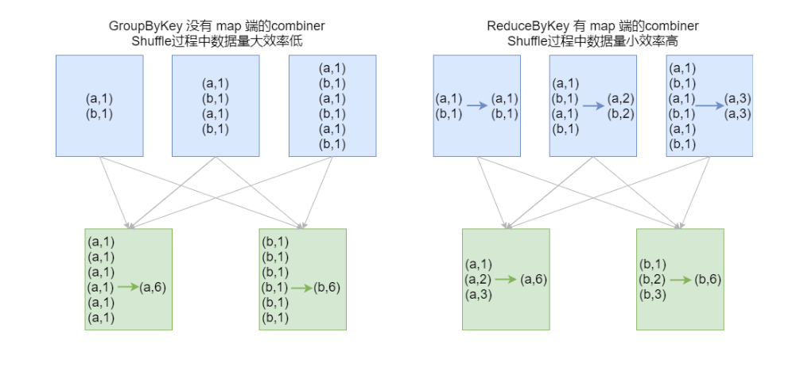

groupByKey Shuffle过程中传输的数据量大，效率低

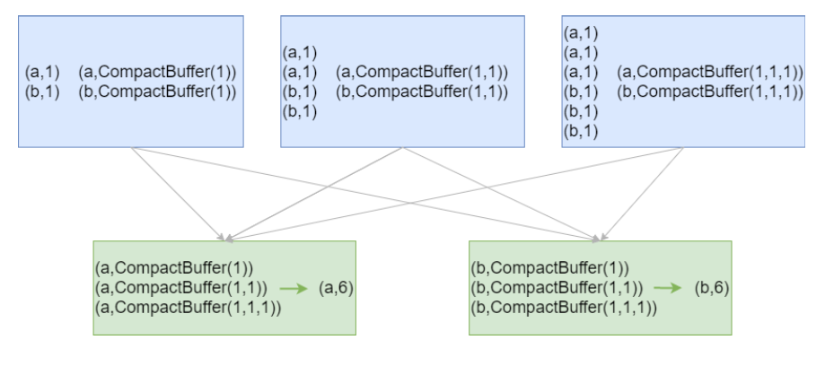

> 个人理解：有些情况 Shuffle 不可避免，那么可以尽量减少 Shuffle 的数据量，来提高效率。

3、排序操作

- `sortByKey`: `sortByKey` 函数作用于PairRDD，对Key进行排序。

在 `org.apache.spark.rdd.OrderedRDDFunctions` 中实现:

```scala{}
val a = sc.parallelize(List("zmn", "iteblog", "com", "397090770", "test"))
val b = sc.parallelize (1 to a.count.toInt)
val c = a.zip(b)
c.sortByKey().collect // Array((397090770,4), (com,3), (iteblog,2), (test,5), (zmn,1))
c.sortByKey(false).collect // 默认使用升序排序，false 表示使用降序排序
```

4、join操作

`cogroup`/`join`/`leftOuterJoin`/`rightOuterJoin`/`fullOuterJoin`

`join` 源码如下：

```scala{}
/**
 * Return an RDD containing all pairs of elements with matching keys in `this` and `other`. Each
 * pair of elements will be returned as a (k, (v1, v2)) tuple, where (k, v1) is in `this` and
 * (k, v2) is in `other`. Uses the given Partitioner to partition the output RDD.
 */
def join[W](other: RDD[(K, W)], partitioner: Partitioner): RDD[(K, (V, W))] = self.withScope {
  this.cogroup(other, partitioner).flatMapValues( pair =>
    for (v <- pair._1.iterator; w <- pair._2.iterator) yield (v, w)
  )
}
```

```scala{}
val rdd1 = sc.makeRDD(Array((1,"Spark"), (2,"Hadoop"), (3,"Kylin"), (4,"Flink")))
val rdd2 = sc.makeRDD(Array((3,"李四"), (4,"王五"), (5,"赵六"), (6,"冯七")))

// 聚集两个 RDD (类似于全外连接)
val rdd3 = rdd1.cogroup(rdd2)
rdd3.collect.foreach(println)
// (6,(CompactBuffer(),CompactBuffer(冯七)))
// (1,(CompactBuffer(Spark),CompactBuffer()))
// (2,(CompactBuffer(Hadoop),CompactBuffer()))
// (3,(CompactBuffer(Kylin),CompactBuffer(李四)))
// (4,(CompactBuffer(Flink),CompactBuffer(王五)))
// (5,(CompactBuffer(),CompactBuffer(赵六)))

rdd3.filter{case (_, (v1, v2)) => v1.nonEmpty & v2.nonEmpty}.collect

// 仿照源码实现join操作
rdd3.flatMapValues( pair => for (v <- pair._1.iterator; w <- pair._2.iterator) yield (v, w))

val rdd1 = sc.makeRDD(Array(("1","Spark"),("2","Hadoop"),("3","Scala"),("4","Java")))
val rdd2 = sc.makeRDD(Array(("3","20K"),("4","18K"),("5","25K"),("6","10K")))

rdd1.join(rdd2).collect //Array((3,(Kylin,李四)), (4,(Flink,王五)))

rdd1.leftOuterJoin(rdd2).collect 
// Array[(Int, (String, Option[String]))] = Array(
// (1,(Spark,None)), (2,(Hadoop,None)), (3,(Kylin,Some(李四))), (4,(Flink,Some(王五))))

rdd1.rightOuterJoin(rdd2).collect
// Array((6,(None,冯七)), (3,(Some(Kylin),李四)), (4,(Some(Flink),王五)), (5,(None,赵六)))

rdd1.fullOuterJoin(rdd2).collect
// Array((6,(None,Some(冯七))), (1,(Some(Spark),None)), (2,(Some(Hadoop),None)), 
// (3,(Some(Kylin),Some(李四))), (4,(Some(Flink),Some(王, (5,(None,Some(赵六))))
```

#### 3.7.3 Action操作

`collectAsMap`/`countByKey`/`lookup(key)`

countByKey源码:

```scala{}
/**
 * Count the number of elements for each key, collecting the results to a local Map.
 *
 * @note This method should only be used if the resulting map is expected to be small, as
 * the whole thing is loaded into the driver's memory.
 * To handle very large results, consider using rdd.mapValues(_ => 1L).reduceByKey(_ + _), which
 * returns an RDD[T, Long] instead of a map.
 */
def countByKey(): Map[K, Long] = self.withScope {
  self.mapValues(_ => 1L).reduceByKey(_ + _).collect().toMap
}
```

lookup(key): 高效的查找方法，只查找对应分区的数据(如果RDD有分区器的话)

```scala{}
val rdd1 = sc.makeRDD(Array(("1","Spark"),("2","Hadoop"), ("3","Scala"),("1","Java")))
val rdd2 = sc.makeRDD(Array(("3","20K"),("4","18K"), ("5","25K"),("6","10K")))
rdd1.lookup("1") // WrappedArray(Spark, Java)
rdd2.lookup("3") // WrappedArray(20K)
```

### 3.8 输入与输出

#### 3.8.1 文件输入与输出

1、文本文件

数据读取: `textFile(String)`。可指定单个文件，支持通配符。

这样对于大量的小文件读取效率并不高，应该使用 `wholeTextFiles`

```scala{}
def wholeTextFiles(
    path: String,
    minPartitions: Int = defaultMinPartitions): RDD[(String, String)] = withScope {
  
}
```

返回值 `RDD[(String, String)]`，其中Key是文件的名称，Value是文件的内容 

数据保存: `saveAsTextFile(String)`。指定的输出目录。

2、csv文件

读取 CSV(Comma-Separated Values)/TSV(Tab-Separated Values) 数据和读取 JSON 数据相似，
都需要先把文件当作普通文本文件来读取数据，然后通过将每一行进行解析实现对CSV的读取。

CSV/TSV 数据的输出也是需要将结构化RDD通过相关的库转换成字符串RDD，然后使用 Spark 的文本文件 API 写出去。

3、json文件

如果 JSON 文件中每一行就是一个JSON记录，那么可以通过将JSON文件当做文本文件来读取，
然后利用相关的JSON库对每一条数据进行JSON解析。 

JSON数据的输出主要是通过在输出之前将由结构化数据组成的 RDD 转为字符串RDD，然后使用 Spark 的文本文件 API 写出去。

> json文件的处理使用 SparkSQL 最为简洁。

4、SequenceFile

SequenceFile文件是Hadoop用来存储二进制形式的key-value对而设计的一种平面文件(Flat File)。

Spark 有专门用来读取 SequenceFile 的接口。在 SparkContext 中，可以调用: `sequenceFile[keyClass, valueClass]`;

调用 `saveAsSequenceFile(path)` 保存PairRDD，系统将键和值能够自动转为 Writable 类型。

5、对象文件

对象文件是将对象序列化后保存的文件，采用Java的序列化机制。

通过 `objectFile[k,v](path)` 接收一个路径，读取对象文件，返回对应的 RDD， 
也可以通过调用 `saveAsObjectFile()` 实现对对象文件的输出。因为是序列化所以要指定类型。

#### 3.8.2 JDBC

> 详见综合案例

### 3.9 算子综合应用案例 

#### 1、WordCount - scala

```scala{}
object ScalaWordCount {
  def main(args: Array[String]): Unit = {
    // 1.创建 SparkContext
    // val conf = new SparkConf().setMaster("local[*]").setAppName("ScalaWordCount")
    // 打包运行时，setMaster() 也可以删除，在任务提交时指定运行方式
    val conf = new SparkConf().setAppName("ScalaWordCount")
    val sc = new SparkContext(conf)
    // 设置日志隔离级别
    sc.setLogLevel("WARN")

    // 2.读文件(本地文件方式)
    // val lines: RDD[String] = sc.textFile("file:////data/wc.dat")
    // [集群运行时，文件路径可以作为参数]
    val lines: RDD[String] = sc.textFile(args(0))
    // 3.RDD转换
    val words: RDD[String] = lines.flatMap(line => line.split("\\s+"))
    val wordsMap: RDD[(String, Int)] = words.map(x => (x, 1))
    val result: RDD[(String, Int)] = wordsMap.reduceByKey(_ + _)
    // 4.输出
    result.foreach(println)
    // 5.关闭 SparkContext
    sc.stop()
    // 6.打包，使用 Spark-Submit 提交集群运行
  }
}
```

```shell
# 提交本地执行命令
spark-submit --master local[*] --class com.zmn.spark.core.ScalaWordCount \
  original-spark-test-101-1.0-SNAPSHOT.jar /wcinput/*
# 提交 yarn 执行
spark-submit --master yarn --class com.zmn.spark.core.ScalaWordCount \
  original-spark-test-101-1.0-SNAPSHOT.jar /wcinput/*
```

#### 2、WordCount - java

Spark提供了: Scala、Java、Python、R语言的API; 

对 Scala 和 Java 语言的支持最好;

```java
public class JavaWordCount {
    public static void main(String[] args) {
        // 1.创建 SparkContext
        SparkConf conf = new SparkConf().setAppName("JavaWordCount").setMaster("local[*]");
        JavaSparkContext jsc = new JavaSparkContext(conf);
        jsc.setLogLevel("WARN"); // 设置日志隔离级别
        // 2.生成 RDD
        JavaRDD<String> lines = jsc.textFile("file:////data/wc.dat");
        // 3.RDD转换
        JavaRDD<String> words = lines.flatMap(line -> Arrays.stream(line.split("\\s+")).iterator());
        JavaPairRDD<String, Integer> wordMap = words.mapToPair(word -> new Tuple2<>(word, 1));
        JavaPairRDD<String, Integer> result = wordMap.reduceByKey(Integer::sum);
        // 4.输出结果
        result.foreach(ele -> System.out.println(ele)); // 注意：此处不支持方法引用
        // 5.关闭 SparkContext
        jsc.close();
    }
}
```

- Spark入口点: `JavaSparkContext` 
- Value-RDD: `JavaRDD`
- key-value RDD: `JavaPairRDD`

JavaRDD 和 JavaPairRDD转换:

- JavaRDD => JavaPairRDD: 通过 `mapToPair` 函数
- JavaPairRDD => JavaRDD: 通过 `map` 函数转换

> 慎用 Java 方法引用。

#### 3、计算圆周率

> 蒙特卡洛法：
> 
> 设圆的面积为 pi, 正方形的面积为 4; 一共射击的次数为 N, 射击落在单位元的次数为 n
> 
> `4 / pi = N /n`   =>  `pi = 4 * n / N`

```scala{}
object SparkPi {
  def main(args: Array[String]): Unit = {
    // 1.创建 SparkContext
    val conf = new SparkConf().setMaster("local[*]")
      .setAppName(this.getClass.getSimpleName.init)
    val sc = new SparkContext(conf)
    sc.setLogLevel("WARN")

    // 分区数
    val slice: Int = if (args.length > 0) args(0).toInt else 10

    val N = 10000000
    // 2.生成RDD
    // 3.RDD转换
    val n: Double = sc.makeRDD(1 to N, numSlices = slice)
      .map(_ => {
        val (x, y) = (random, random)
        if (x * x + y * y <= 1) 1 else 0
      }).sum()
    // 4.输出
    val pi = 4.0 * n / N
    println(s"pi = $pi")

    // 5.关闭 SparkContext
    sc.stop()
  }
}
```

#### 4、广告数据统计

数据格式:

| 时间点         | 省份         | 城市     | 用户       | 广告     |
|-------------|------------|--------|----------|--------|
| `timestamp` | `province` | `city` | `userid` | `adid` |

需求: 

1. 统计每一个省份点击TOP3的广告ID 
2. 统计每一个省份每一个小时的TOP3广告ID

```scala{}
object AdStat {
  def main(args: Array[String]): Unit = {
    // 1.创建 SparkContext
    val conf = new SparkConf().setMaster("local[*]").setAppName(this.getClass.getSimpleName.init)
    val sc = new SparkContext(conf)
    sc.setLogLevel("WARN")
    // 2.生成RDD
    val lines: RDD[String] = sc.textFile(
      "file:////Users/faustine/Code/IdeaProjects/gitee/spark-test/data/advert.log")

    // 3.RDD转换
    // 1. 统计每一个省份点击TOP3的广告ID
    val top = 3

    val stat1: RDD[(String, String)] = lines.map { line =>
      val fields: Array[String] = line.split("\\s+")
      (fields(1), fields(4))
    }

    stat1.map{case (province, adId) => ((province, adId), 1)}
      .reduceByKey(_ + _)
      .map{case ((province, addId), count) => (province, (addId, count))}
      .groupByKey()
      .mapValues(buf => buf.toList.sortWith(_._2 > _._2).take(top).map(_._1).mkString(":"))
      .collect()
      .foreach(println)

    // 2. 统计每一个省份每一个小时的TOP3广告ID
    lines.map{line =>
      val fields: Array[String] = line.split("\\s+")
      ((getHour(fields(0)), fields(1), fields(4)), 1)
    }.reduceByKey(_ + _)
      .map{case ((hour, province, adId), count) => ((province, hour), (adId, count))}
      .groupByKey()
      .mapValues(buf => buf.toList.sortWith(_._2 > _._2).take(top).map(_._1).mkString(":"))
      .collect()
      .foreach(println)

    // 4.输出
    // 5.关闭 SparkContext
    sc.stop()
  }

  def getHour(str: String): Int = {
    val dt = new DateTime(str.toLong)
    dt.getHourOfDay
  }
}
```


在Java 8出现前的很长时间内成为Java中日期时间处理的事实标准，用来弥补JDK的不足。

Joda 类具有不可变性，它们的实例无法被修改。(不可变类的一个优点就是它们是线程安全的)

```xml
<dependency>
    <groupId>joda-time</groupId>
    <artifactId>joda-time</artifactId>
    <version>2.9.7</version>
</dependency>
```

> 在 Spark Core 程序中使用时间日期类型时，不要使用 Java 8 以前的时间日期类型， 线程不安全。

#### 5、找共同好友

原始数据:

```text
100, 200 300 400 500 600
200, 100 300 400
300, 100 200 400 500
400, 100 200 300
500, 100 300
600, 100
```

> 第一列表示用户，后面的表示该用户的好友

要求:

1. 查找两两用户的共同好友
2. 最后的结果按前两个id号有序排序

```scala{}
object FindFriends {
  def main(args: Array[String]): Unit = {
    // 1.创建 SparkContext
    val conf = new SparkConf().setMaster("local[*]").setAppName(this.getClass.getSimpleName.init)
    val sc = new SparkContext(conf)
    sc.setLogLevel("WARN")

    val lines: RDD[String] = sc.textFile("file:////Users/faustine/Code/IdeaProjects/gitee/spark-test/data/fields.dat")

    val friendsRDD: RDD[(String, Array[String])] = lines.map { line =>
      val fields: Array[String] = line.split(",")
      val userId: String = fields(0).trim
      val friends: Array[String] = fields(1).trim.split("\\s+")
      (userId, friends)
    }

    // 方法一：核心思想就是利用笛卡尔积求两两的好友，然后去除多余的数据
    friendsRDD.cartesian(friendsRDD)
      //.filter(x => x._1._1 < x._2._1)
      .filter { case ((id1, _), (id2, _)) => id1 > id2 }
      .map { case ((id1, friends1), (id2, friends2)) =>
        ((id1, id2), friends1.toSet & friends2.toSet)
      }
      .filter(x => x._2.nonEmpty)
      .sortByKey()
      .collect()
      .foreach(println)

    println("------------------------------------------------")

    // 方法二：消除笛卡尔积 (更高效)
    // 核心思想：将数据变形，找到两两的好友，再做数据的合并
    friendsRDD.flatMapValues(friends => friends.combinations(2))
      // key和value位置交换;变换数据类型
      //.map(x => (x._2.mkString("&"), Set(x._1)))
      // 这种写法可视化更强
      .map{ case (k, v) => (v.mkString("&"), Set(k)) }
      .reduceByKey(_ | _)
      .sortByKey()
      .collect()
      .foreach(println)

    // 5.关闭 SparkContext
    sc.stop()
  }
}
```

> `combinations(n)`: 求 n 个元素的组合

#### 6、Super WordCount

要求: 将单词全部转换为小写，去除标点符号(难)，去除停用词(难); 
最后按照 count 值降序保存到文件，同时将全部结果保存到MySQL(难);
标点符号和停用词可以自定义。

停用词: 语言中包含很多功能词。与其他词相比，功能词没有什么实际含义。
最普遍的功能词是限定词(the、a、an、that、those)，介词(on、in、to、from、 over等)、代词、数量词等。

`Array[(String, Int)]` => scala jdbc => MySQL

##### 基本功能实现

```scala{}
object SuperWordCount {
  def main(args: Array[String]): Unit = {
    // 1.创建 SparkContext
    val conf = new SparkConf().setMaster("local[*]").setAppName(this.getClass.getSimpleName.init)
    val sc = new SparkContext(conf)
    sc.setLogLevel("WARN")

    // RDD转换
    val lines = sc.textFile("file:////Users/faustine/Code/IdeaProjects/gitee/spark-test/data/swc.dat")
    // 停用词表
    val stopWords = ("in on to from by a an the is are were was i we you " +
      "your he his some any of as can it each").split("\\s+")
    val punctuation = """[\\)\\.,:;'!\\?]"""

    lines.flatMap(_.split("\\s+"))
      .map(_.toLowerCase)
      // 替换标点符号
      .map(_.replaceAll(punctuation, ""))
      // 过滤停用词
      .filter(word => !stopWords.contains(word) && word.trim.nonEmpty)
      .map((_, 1))
      .reduceByKey(_ + _)
      // 根据 value排序，降序
      .sortBy(_._2, ascending = false)
      .collect()
      .foreach(println)

    // 5.关闭 SparkContext
    sc.stop()
  }
}
```

##### Scala JDBC 编程

添加依赖

```xml
<dependency>
    <groupId>mysql</groupId>
    <artifactId>mysql-connector-java</artifactId>
    <version>5.1.44</version>
</dependency>
```

```scala{}
object JdbcDemo {
  def main(args: Array[String]): Unit = {
    // 定义结果集
    val str = "hadoop spark java scala hbase hive sqoop hue tez atlas datax grinffin zk kafka"
    val result: Array[(String, Int)] = str .split("\\s+").zipWithIndex
    // 定义参数
    val url = "jdbc:mysql://linux123:3306/ebiz?useUnicode=true&characterEncoding=utf-8&useSSL=false"
    val username = "hive"
    val password = "12345678"

    // JDBC 保存数据
    var conn: Connection = null
    var stmt: PreparedStatement = null
    val sql = "insert into wordcount values (?, ?)"

    try {
      conn = DriverManager.getConnection(url, username, password)
      stmt = conn.prepareStatement(sql)
      result.foreach{ case (k, v) =>
        stmt.setString(1, k)
        stmt.setInt(2, v)
        stmt.executeUpdate()
      }
    } catch {
      case e: Exception => e.printStackTrace()
    } finally {
      if (stmt != null) stmt.close()
      if (conn != null) conn.close()
    }
  }
}
```

##### 最终实现

```scala{}
object SuperWordCountJdbc {

  // 停用词表
  private val stopWords = ("in on to from by a an the is are were was i we you " +
    "your he his some any of as can it each").split("\\s+")

  private val punctuation = """[\\)\\.,:;'!\\?]"""

  // 定义参数
  private val url = "jdbc:mysql://linux123:3306/ebiz?useUnicode=true&characterEncoding=utf-8&useSSL=false"
  private val username = "hive"
  private val password = "12345678"

  def main(args: Array[String]): Unit = {
    // 1.创建 SparkContext
    val conf = new SparkConf().setMaster("local[*]").setAppName(this.getClass.getSimpleName.init)
    val sc = new SparkContext(conf)
    sc.setLogLevel("WARN")

    // RDD转换
    val lines = sc.textFile("file:////Users/faustine/Code/IdeaProjects/gitee/spark-test/data/swc.dat")

    val resultRDD: RDD[(String, Int)] = lines.flatMap(_.split("\\s+"))
      .map(_.toLowerCase)
      // 替换标点符号
      .map(_.replaceAll(punctuation, ""))
      // 过滤停用词
      .filter(word => !stopWords.contains(word) && word.trim.nonEmpty)
      .map((_, 1))
      .reduceByKey(_ + _)
      // 根据 value排序，降序
      .sortBy(_._2, ascending = false)

    // 结果输出
    resultRDD.saveAsTextFile("file:////Users/faustine/Code/IdeaProjects/gitee/spark-test/data/superwc")
    // 输出到数据库
    resultRDD.foreachPartition(saveAsMysql)
    // 5.关闭 SparkContext
    sc.stop()
  }

  def saveAsMysql(iter: Iterator[(String, Int)]): Unit = {
      var conn: Connection = null
      var stmt: PreparedStatement = null
      val sql = "insert into wordcount values (?, ?)"

      try {
        conn = DriverManager.getConnection(url, username, password)
        stmt = conn.prepareStatement(sql)
        iter.foreach { case (k, v) =>
          stmt.setString(1, k)
          stmt.setInt(2, v)
          stmt.executeUpdate()
        }
      } catch {
        case e: Exception => e.printStackTrace()
      } finally {
        if (stmt != null) stmt.close()
        if (conn != null) conn.close()
      }
  }
}
```

备注:

SparkSQL有方便的读写MySQL的方法，给参数直接调用即可; 
但以上掌握以上方法非常有必要，因为SparkSQL不是支持所有的类型的数据库


