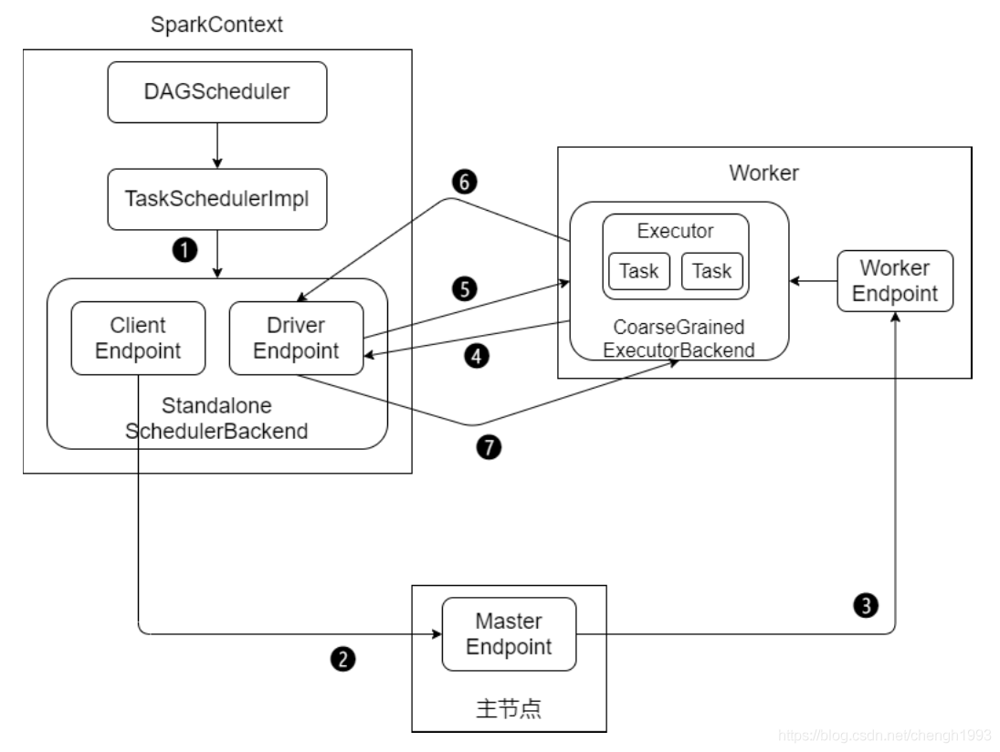
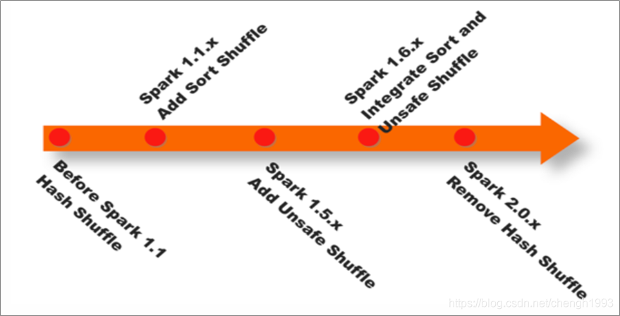

# Spark Core

## 第4节 RDD编程高阶

> <https://blog.csdn.net/chengh1993/article/details/114239397>

### 4.1 序列化

在实际开发中会自定义一些对RDD的操作，此时需要注意的是:

初始化工作是在Driver端进行的，实际运行程序是在Executor端进行的，这就涉及到了进程通信，是需要序列化的。 

> 可以简单的认为 `SparkContext` 代表Driver。

```scala{}
class MyClass1(x: Int) {
  val num: Int = x
}

case class MyClass2(num: Int)

class MyClass3(x: Int) extends Serializable {
  val num: Int = x
}

object SerializableDemo {
  def main(args: Array[String]): Unit = {
    // 初始化
    val conf = new SparkConf().setAppName(this.getClass.getCanonicalName.init).setMaster("local[*]")
    val sc = new SparkContext(conf)
    sc.setLogLevel("WARN")

    val o1 = new MyClass1(8)
    // println(s"o1.num = ${o1.num}")

    val rdd1 = sc.makeRDD(1 to 20)
    // 方法
    def add1(x: Int) = x + 100
    // 函数
    val add2 = add1 _

    // 函数、方法都具备序列化和反序列化的能力
    // rdd1.map(add1(_)).foreach(println)
    // println("-----------------------")
    // rdd1.map(add2(_)).foreach(println)

    val object1 = new MyClass1(20)
    // 下面的不能序列化, 因为object1是自定义class
    // rdd1.map(x => object1.num + x).foreach(println) // Task not serializable

    // 解决方案一：使用case class, scala 提供了序列化和反序列化方法
    val object2 = MyClass2(20)
    rdd1.map(x => object2.num + x).foreach(println)
    println("--------------------------")

    // 解决方案二：MyClass3 实现 Serializable 接口
    val object3 = new MyClass3(20)
    rdd1.map(x => object3.num + x).foreach(println)
    println("--------------------------")

    // 解决方案三: 延迟创建
    lazy val object4 = new MyClass1(20)
    rdd1.map(x => object4.num + x).foreach(println)

    sc.stop()
  }
}
```

备注:

- 如果在方法、函数的定义中引用了不可序列化的对象，也会导致任务不能序列化
- 延迟创建的解决方案较为简单，适用性广

### 4.2 RDD依赖关系

RDD只支持粗粒度转换，即在大量记录上执行的单个操作。将创建RDD的一系列Lineage(血统)记录下来，
以便恢复丢失的分区。

RDD的Lineage会记录RDD的元数据信息和转换行为，当该RDD的部分分区数据丢失时，
可根据这些信息来重新运算和恢复丢失的数据分区。


RDD和它依赖的父RDD(s)的关系有两种不同的类型，即窄依赖(narrow dependency)和宽依赖(wide dependency)。

依赖有2个作用: 一是用来解决数据容错;二是用来划分stage。

- 窄依赖: 1:1 或 n:1
- 宽依赖: n:m; *意味着有shuffle*

> 要能够准确、迅速的区分哪些算子是宽依赖; (记住宽依赖，其他都是窄依赖)

> 速记心得：宽依赖的算子都很有特点，主要有两类：`join` 系列, 和 `xxByKey` 系列


> 宽依赖只有 `ShuffleDependency` 一种实现，而窄依赖有多种实现。

--------------------------------------------------------------------------------

DAG(Directed Acyclic Graph) 有向无环图。

原始的RDD通过一系列的转换就就形成了DAG，根据RDD之间的依赖关系的不同，将DAG划分成不同的Stage:

- 对于窄依赖，partition 的转换处理在Stage中完成计算 
- 对于宽依赖，由于有Shuffle的存在，只能在 parent RDD处理完成后，才能开始接下来的计算
- 宽依赖是划分Stage的依据


RDD任务切分中间分为: Driver program、Job、Stage(TaskSet)和Task

- Driver program: 初始化一个SparkContext即生成一个Spark应用 
- Job: 一个Action算子就会生成一个Job
- Stage: 根据RDD之间的依赖关系的不同将Job划分成不同的Stage，遇到一个宽依赖则划分一个Stage
- Task: Stage是一个TaskSet，将Stage划分的结果发送到不同的 Executor 执行即为一个Task

Task是Spark中任务调度的最小单位; 每个Stage包含许多Task，这些Task执行的计算逻辑相同的，
计算的数据不同。

> 注意: `Driver program` -> `Job` -> `Stage` -> `Task` 每一层都是1对n的关系。

```scala{}
// 窄依赖
val rdd1 = sc.parallelize(1 to 10, 1)
val rdd2 = sc.parallelize(11 to 20, 1)
val rdd3 = rdd1.union(rdd2)
rdd3.dependencies.size
// res0: Int = 2
 
rdd3.dependencies
// res1: Seq[org.apache.spark.Dependency[_]] = ArrayBuffer(org.apache.spark.RangeDependency@52a3a9ef, org.apache.spark.RangeDependency@25d77b18)
// 两个窄依赖
 
// 打印rdd1的数据
rdd3.dependencies(0).rdd.collect
// res2: Array[_] = Array(1, 2, 3, 4, 5, 6, 7, 8, 9, 10)                           
 
// 打印rdd2的数据
rdd3.dependencies(1).rdd.collect
//res3: Array[_] = Array(11, 12, 13, 14, 15, 16, 17, 18, 19, 20)
 
// 宽依赖
val random = new scala.util.Random
val arr = (1 to 100).map(idx => random.nextInt(100))
val rdd1 = sc.makeRDD(arr).map((_, 1))
val rdd2 = rdd1.reduceByKey(_ + _)
// rdd2: org.apache.spark.rdd.RDD[(Int, Int)] = ShuffledRDD[5] at reduceByKey at <console>:25
 
// 观察依赖
rdd2.dependencies
//res4: Seq[org.apache.spark.Dependency[_]] = List(org.apache.spark.ShuffleDependency@4c14904e)
 
rdd2.dependencies(0).rdd.collect
// res5: Array[_] = Array((76,1), (54,1), (92,1), (...
 
rdd2.dependencies(0).rdd.dependencies(0).rdd.collect
// res6: Array[_] = Array(76, 54, 92, 55, 8, 74, 86, ...
```

#### 再谈WordCount

```scala{}
val rdd1 = sc.textFile("/wcinput/wc.txt")
// rdd1: org.apache.spark.rdd.RDD[String] = /wcinput/wc.txt MapPartitionsRDD[1] at textFile at <console>:24
val rdd2 = rdd1.flatMap(_.split("\\s+"))
// rdd2: org.apache.spark.rdd.RDD[String] = MapPartitionsRDD[2] at flatMap at <console>:25
val rdd3 = rdd2.map((_, 1))
// rdd3: org.apache.spark.rdd.RDD[(String, Int)] = MapPartitionsRDD[3] at map at <console>:25
val rdd4 = rdd3.reduceByKey(_ + _)
// rdd4: org.apache.spark.rdd.RDD[(String, Int)] = ShuffledRDD[4] at reduceByKey at <console>:25
val rdd5 = rdd4.sortByKey()
// rdd5: org.apache.spark.rdd.RDD[(String, Int)] = ShuffledRDD[7] at sortByKey at <console>:25
rdd5.count
// res0: Long = 6


// 查看RDD的血缘关系
rdd1.toDebugString
// res1: String =
// (2) /wcinput/wc.txt MapPartitionsRDD[1] at textFile at <console>:24 []
//  |  /wcinput/wc.txt HadoopRDD[0] at textFile at <console>:24 []
 
rdd5.toDebugString
// res2: String =
// (2) ShuffledRDD[7] at sortByKey at <console>:25 []
// +-(2) ShuffledRDD[4] at reduceByKey at <console>:25 []
//    +-(2) MapPartitionsRDD[3] at map at <console>:25 []
//       |  MapPartitionsRDD[2] at flatMap at <console>:25 []
//       |  /wcinput/wc.txt MapPartitionsRDD[1] at textFile at <console>:24 []
//       |  /wcinput/wc.txt HadoopRDD[0] at textFile at <console>:24 []


// 查看依赖
rdd1.dependencies
// res3: Seq[org.apache.spark.Dependency[_]] = List(org.apache.spark.OneToOneDependency@55ec9270)
rdd1.dependencies(0).rdd
// res4: org.apache.spark.rdd.RDD[_] = /wcinput/wc.txt HadoopRDD[0] at textFile at <console>:24
 
rdd5.dependencies
// res5: Seq[org.apache.spark.Dependency[_]] = List(org.apache.spark.ShuffleDependency@6c9de8a9)
rdd5.dependencies(0).rdd
// res6: org.apache.spark.rdd.RDD[_] = ShuffledRDD[4] at reduceByKey at <console>:25
 
// 查看最佳计算的优先位置
val hadoopRDD = rdd1.dependencies(0).rdd
// hadoopRDD: org.apache.spark.rdd.RDD[_] = /wcinput/wc.txt HadoopRDD[0] at textFile at <console>:24
hadoopRDD.preferredLocations(hadoopRDD.partitions(0))
// res7: Seq[String] = ArraySeq(linux123, linux121, linux122)
```

```shell
# 使用 hdfs 命令检查文件情况
hdfs fsck /wcinput/wc.txt -files -blocks -locations
```

问题：上面的 `WordCount` 中一共几个 `job`，几个 `Stage`，几个 `Task`？


本例中整个过程分为1个job，3个Stage；6个Task。


> 为什么这里显示有2个job? 参见RDD分区器。

### 4.3 RDD持久化/缓存

*涉及到的算子: `persist`、`cache`、`unpersist`; 都是 Transformation*

缓存是将计算结果写入不同的介质，用户定义可定义存储级别(存储级别定义了缓存存储的介质，
目前支持内存、堆外内存、磁盘); 

通过缓存，Spark避免了RDD上的重复计算，能够极大地提升计算速度;

RDD持久化或缓存，是Spark最重要的特征之一。可以说，缓存是Spark构建迭代式算法和快速交互式查询的关键因素;

Spark速度非常快的原因之一，就是在内存中持久化(或缓存)一个数据集。当持久化一个RDD后，
每一个节点都将把计算的分片结果保存在内存中，并在对此数据集(或者衍生出的数据集)进行的其他动作(Action)中重用。
这使得后续的动作变得更加迅速;

使用 `persist()` 方法对一个RDD标记为持久化。之所以说“标记为持久化”，是因为出现 `persist()` 语句的地方，
并不会马上计算生成RDD并把它持久化，而是要等到遇到第一个行动操作触发真正计算以后，才会把计算结果进行持久化;


通过 `persist()` 或 `cache()` 方法可以标记一个要被持久化的RDD，持久化被触发，
RDD 将会被保留在计算节点的内存中并重用;

什么时候缓存数据，需要对空间和速度进行权衡。一般情况下，如果多个动作需要用到某个 RDD，
而它的计算代价又很高，那么就应该把这个 RDD 缓存起来;

*缓存有可能丢失，或者存储于内存的数据由于内存不足而被删除。* RDD的缓存的容错机制保证了
即使缓存丢失也能保证计算的正确执行。通过基于RDD的一系列的转换，丢失的数据会被重算。
RDD的各个Partition是相对独立的，因此只需要计算丢失的部分即可，并不需要重算全部Partition。

--------------------------------------------------------------------------------

`persist()` 的参数可以指定持久化级别参数; 

使用 `cache()` 方法时，会调用 `persist(MEMORY_ONLY)`，即:

```scala{}
cache() == persist(StorageLevel.Memeory_ONLY)
```

> 也就是说 `cache()` 不过是 `persist()` 的简写。

使用 `unpersist()` 方法手动地把持久化的RDD从缓存中移除;

```scala{}
/**
 * Persist this RDD with the default storage level (`MEMORY_ONLY`).
 */
def cache(): JavaDoubleRDD = fromRDD(srdd.cache())
/**
 * Set this RDD's storage level to persist its values across operations after the first time
 * it is computed. Can only be called once on each RDD.
 */
def persist(newLevel: StorageLevel): JavaDoubleRDD = fromRDD(srdd.persist(newLevel))
```


| 存储级别                | 描述                                                                     |
|---------------------|------------------------------------------------------------------------|
| MEMORY_ONLY         | 将RDD 作为反序列化的对象存储JVM 中。如果 RDD不能被内存装下，一些分区将不会被缓存， 并且在需要的时候被重新计算。 默认的缓存级别 |
| MEMORY_AND_DISK     | 将RDD 作为反序列化的的对象存储在JVM 中。如 果RDD不能被与内存装下，超出的分区将被保存 在硬盘上，并且在需要时被读取        |
| MEMORY_ONLY_SER     | 将RDD 作为序列化的的对象进行存储(每一分区 一个字节数组)。 通常来说，这比将对象反序列 化的空间利用率更高，读取时会比较占用CPU   |
| MEMORY_AND_DISK_SER | 与MEMORY_ONLY_SER 相似，但是把超出内存的 分区将存储在硬盘上而不是在每次需要的时候重 新计算                 |
| DISK_ONLY           | 只将RDD 分区存储在硬盘上                                                         |
| DISK_ONLY_2等带2的     | 与上述的存储级别一样，但是将每一个分区都复制到集群的两个结点上                                        |

> `cache RDD` 以分区为单位; 程序执行完毕后，系统会清理 `cache` 数据;

```scala{}
val list = List("Hadoop","Spark","Hive")
val rdd = sc.parallelize(list)
 
// 调用persist(MEMORY_ONLY)
// 但语句执行到这里，并不会缓存rdd，因为这时rdd还没有被计算生成
rdd.cache()
 
// 第一次Action操作，触发一次真正从头到尾的计算
// 这时才会执行上面的rdd.cache()，将rdd放到缓存中
rdd.count()
 
// 第二次Action操作，不需要触发从头到尾的计算
// 只需要重复使用上面缓存中的rdd
rdd.collect().mkString(",")
```


> 被缓存的RDD在DAG图中有一个绿色的圆点。

### 4.4 RDD容错机制Checkpoint

*涉及到的算子: `checkpoint` ; 也是 Transformation* 

Spark中对于数据的保存除了持久化操作之外，还提供了检查点的机制;

*检查点本质是通过将RDD写入高可靠的磁盘，主要目的是为了容错。* 

检查点通过将数据写入到HDFS文件系统实现了RDD的检查点功能。

Lineage过长会造成容错成本过高，这样就不如在中间阶段做检查点容错，如果之后有节点出现问题而丢失分区，
从做检查点的RDD开始重做 Lineage，就会减少开销。

`cache` 和 `checkpoint` 是有显著区别的，缓存把 RDD 计算出来然后放在内存中，但是 RDD 的依赖链不能丢掉，
当某个点某个 `executor` 宕了，上面 `cache` 的RDD就会丢掉，需要通过依赖链重放计算。
不同的是，`checkpoint` 是把 RDD 保存在 HDFS 中，是多副本可靠存储，此时依赖链可以丢掉，所以斩断了依赖链。

以下场景适合使用检查点机制:

1. DAG中的Lineage过长，如果重算，则开销太大
2. 在宽依赖上做 Checkpoint 获得的收益更大

> 与cache类似 checkpoint 也是 lazy 的。

```scala{}
val rdd1 = sc.parallelize(1 to 100000)
 
// 设置检查点目录, 最好设置到 hdfs 上
sc.setCheckpointDir("/tmp/checkpoint")
val rdd2 = rdd1.map(_ * 2)
rdd2.checkpoint
 
// checkpoint 也是 lazy 操作
rdd2.isCheckpointed // false
 
// checkpoint之前的rdd依赖关系
rdd2.dependencies(0).rdd
rdd2.dependencies(0).rdd.collect
 
// 执行一次action，触发checkpoint的执行 (此时找不到 rdd1 的依赖了，依赖关系已经被斩断了)
rdd2.count
rdd2.isCheckpointed // true
 
// 再次查看RDD的依赖关系。可以看到checkpoint后，RDD的lineage被截断，变成从checkpointRDD开始
rdd2.dependencies(0).rdd
rdd2.dependencies(0).rdd.collect
 
//查看RDD所依赖的checkpoint文件
rdd2.getCheckpointFile
```

> 备注: checkpoint 的文件作业执行完毕后不会被删除

### 4.5 RDD的分区

> `spark.default.parallelism`: (默认的并发数) = 2 

当配置文件 `spark-default.conf` 中没有显示地配置，则按照如下规则取值:

1、本地模式(取决于核数)

```shell
spark-shell --master local[N] spark.default.parallelism = N 
spark-shell --master local spark.default.parallelism = 1
```

2、伪分布式(x为本机上启动的executor数，y为每个executor使用的core数，z为每个executor使用的内存)

```shell
spark-shell --master local-cluster[x,y,z] spark.default.parallelism = x * y
```

3、分布式模式(yarn & standalone)

```shell
spark.default.parallelism = max(应用程序持有executor的core总数, 2)
```

> total number of cores on all executor nodes or 2, whichever is larger

经过上面的规则，就能确定了 `spark.default.parallelism` 的默认值(配置文件 
`spark-default.conf` 中没有显示的配置。如果配置了，则 `spark.default.parallelism = 配置的值`)

--------------------------------------------------------------------------------

`SparkContext` 初始化时，同时会生成两个参数，由上面得到的 `spark.default.parallelism` 推导出这两个参数的值

```scala{}
// 从集合中创建RDD的分区数
sc.defaultParallelism = spark.default.parallelism
// 从文件中创建RDD的分区数
sc.defaultMinPartitions = min(spark.default.parallelism, 2)
```

以上参数确定后，就可以计算 RDD 的分区数了。

```scala{}
/**
 * Default min number of partitions for Hadoop RDDs when not given by user
 * Notice that we use math.min so the "defaultMinPartitions" cannot be higher than 2.
 * The reasons for this are discussed in https://github.com/mesos/spark/pull/718
 */
def defaultMinPartitions: Int = math.min(defaultParallelism, 2)
```

--------------------------------------------------------------------------------

#### 创建 RDD 的几种方式

1、通过集合创建

```scala{}
// 如果创建RDD时没有指定分区数，则rdd的分区数 = sc.defaultParallelism 
val rdd = sc.parallelize(1 to 100)
rdd.getNumPartitions
```

> 备注: 简单的说RDD分区数等于cores总数

2、通过textFile创建

```scala{}
val rdd = sc.textFile("data/start0721.big.log") 
rdd.getNumPartitions
```

如果没有指定分区数:

- 本地文件。`rdd的分区数 = max(本地文件分片数, sc.defaultMinPartitions)`
- HDFS文件。 `rdd的分区数 = max(hdfs文件 block 数, sc.defaultMinPartitions)`

备注:

- `本地文件分片数 = 本地文件大小 / 32M`
- 如果读取的是HDFS文件，同时指定的分区数 < hdfs文件的block数，指定的数不生效。

### 4.6 RDD分区器

> Optionally, a Partitioner for key-value RDDs (e.g. to say that the RDD is hash-partitioned)

*只有Key-Value类型的RDD才可能有分区器，Value类型的RDD分区器的值是 None。*

--------------------------------------------------------------------------------

以下RDD分别是否有分区器，是什么类型的分区器?

```scala{}
val rdd1 = sc.textFile("/wcinput/wc.txt")
rdd1.partitioner // None

val rdd2 = rdd1.flatMap(_.split("\\s+"))
rdd2.partitioner // None

val rdd3 = rdd2.map((_, 1))
rdd3.partitioner // None

val rdd4 = rdd3.reduceByKey(_ + _)
rdd4.partitioner // Some(org.apache.spark.HashPartitioner@2)

val rdd5 = rdd4.sortByKey()
rdd5.partitioner // Some(org.apache.spark.RangePartitioner@e44e9b0e)
```

--------------------------------------------------------------------------------

**分区器的作用及分类**

在 `PairRDD(key,value)` 中，很多操作都是基于key的，系统会按照key对数据进行重组，如 `groupByKey`;

数据重组需要规则，最常见的就是基于 Hash 的分区，此外还有一种复杂的基于抽样 Range 分区方法;


#### HashPartitioner

最简单、最常用，也是默认提供的分区器。

对于给定的key，计算其hashCode，并除以分区的个数取余，如果余数小于0，则用 `余数+分区的个数`，
最后返回的值就是这个key所属的分区ID。该分区方法可以保证key相同的数据出现在同一个分区中。

用户可通过 `partitionBy` 主动使用分区器，通过 `partitions` 参数指定想要分区的数量。

```scala{}
val rdd1 = sc.makeRDD(1 to 100).map((_, 1))
rdd1.getNumPartitions // 6

// 仅仅是将数据大致平均分成了若干份; rdd并没有分区器
rdd1.glom.collect.foreach(x => println(x.toBuffer))
rdd1.partitioner // None

// 主动使用 HashPartitioner
val rdd2 = rdd1.partitionBy(new org.apache.spark.HashPartitioner(10))
rdd2.glom.collect.foreach(x => println(x.toBuffer))

// 主动使用 HashPartitioner
val rdd3 = rdd1.partitionBy(new org.apache.spark.RangePartitioner(10, rdd1))
rdd3.glom.collect.foreach(x => println(x.toBuffer))
```

> 大多数时候我们都是被动使用的分区器。

Spark的很多算子都可以设置 HashPartitioner 的值


#### RangePartitioner

简单的说就是将一定范围内的数映射到某一个分区内。

在实现中，分界的算法尤为重要，用到了水塘抽样算法。

`sortByKey` 会使用 RangePartitioner。


现在的问题: 在执行分区之前其实并不知道数据的分布情况，如果想知道数据分区就需要对数据进行采样;

Spark 中 RangePartitioner 在对数据采样的过程中使用了**水塘采样算法**。

> 水塘采样: 从包含n个项目的集合S中选取k个样本，其中n为一很大或未知的数量，尤其适用于不能把所有n个项目都存放到主内存的情况; 

在采样的过程中执行了 `collect()` 操作，引发了Action操作。

> 也就是说，非常严格来讲，并不是所有的 Transformation 都不会触发 Action。

#### 自定义分区器

Spark允许用户通过自定义的Partitioner对象，灵活的来控制RDD的分区方式。

实现自定义分区器按以下规则分区:

```text
分区0 < 100
100 <= 分区1 < 200 
200 <= 分区2 < 300 
300 <= 分区3 < 400 
... ...
900 <= 分区9 < 1000
```

```scala{}
class MyPartitioner(n: Int) extends Partitioner{
  // 有多少个分区数
  override def numPartitions: Int = {
    n
  }

  // 给定 key，如何分区
  override def getPartition(key: Any): Int = {
    val k: Int = key.toString.toInt
    k / 100
  }
}

object UserDefinePartitioner {
  def main(args: Array[String]): Unit = {
    // 1.创建 SparkContext
    val conf = new SparkConf().setMaster("local[*]").setAppName(this.getClass.getSimpleName.init)
    val sc = new SparkContext(conf)
    sc.setLogLevel("WARN")
    // 业务逻辑
    val random: Random.type = scala.util.Random
    val arr: immutable.IndexedSeq[Int] = (1 to 100).map(_ => random.nextInt(1000))
    val rdd1: RDD[(Int, Int)] = sc.makeRDD(arr).map((_, 1))
    rdd1.glom().collect().foreach(x => println(x.toBuffer))

    println("--------------------------------------------")

    val rdd2: RDD[(Int, Int)] = rdd1.partitionBy(new MyPartitioner(11))
    rdd2.glom().collect().foreach(x => println(x.toBuffer))

    // 5.关闭 SparkContext
    sc.stop()
  }
}
```

### 4.7 广播变量

有时候需要在多个任务之间共享变量，或者在任务(Task)和Driver Program之间*共享变量*。
为了满足这种需求，Spark提供了两种类型的变量: 

- 广播变量(broadcast variables)
- 累加器(accumulators) 

**广播变量、累加器主要作用是为了优化Spark程序**。

广播变量将变量在节点的 Executor 之间进行共享(由Driver广播出去); 

广播变量用来高效分发较大的对象。向所有工作节点(Executor)发送一个较大的只读值，以供一个或多个操作使用。

使用广播变量的过程如下:

- 对一个类型 T 的对象调用 `SparkContext.broadcast` 创建出一个 `Broadcast[T]` 对象。 
任何可序列化的类型都可以这么实现(在 Driver 端)

- 通过 `value` 属性访问该对象的值(在 Executor 中) 
- 变量值会被发到各个 Executor 一次，作为只读值处理。


广播变量的优化：

1. 整个 Executor 共享一份
2. 传输的时候要做压缩 (注意需要序列化和反序列化)
3. 使用 BT 传输协议

> BT 传输协议：简单讲主要有两点，一是会将数据按块切分，二是并不是所有的数据块都找 Driver 要。

广播变量的相关参数

| 参数                        | 含义          | 默认值  |
|---------------------------|-------------|------|
| spark.broadcast.blockSize | 对广播变量分块的块大小 | 4m   |
| spark.broadcast.checksum  | 数据检验        | true |
| spark.broadcast.compress  | 是否压缩        | true |

#### 广播变量的运用(Map Side Join)

普通的Join操作


Map Side Join


```scala{}
object JoinDemo {
  def main(args: Array[String]): Unit = {
    val conf = new SparkConf().setMaster("local[*]").setAppName(this.getClass.getCanonicalName.init)
    val sc = new SparkContext(conf)
    // 设置本地文件切分大小(本地文件默认切块大小 32m)
    sc.hadoopConfiguration.setLong("fs.local.block.size", 128 * 1024 * 1024)

    // map task：数据准备 (此处将配置文件更名为 core-site.xml.bak 让其失效，从而读本地文件)
    val productRDD: RDD[(String, String)] = sc.textFile("data/product_info.txt")
      .map { line =>
        val fields = line.split(";")
        (fields(0), line)
      }

    val orderRDD: RDD[(String, String)] = sc.textFile("data/orderinfo.txt", 8)
      .map { line =>
        val fields = line.split(";")
        (fields(2), line)
      }

    // join有shuffle操作
    val resultRDD: RDD[(String, (String, String))] = productRDD.join(orderRDD)

    println(resultRDD.count())

    Thread.sleep(1000000)

    sc.stop()
  }
}
```


执行时间21s，shuffle read 450M (CPU: i7-8750H)

```scala{16,26-30}
object MapSideJoin {
  def main(args: Array[String]): Unit = {
    val conf = new SparkConf().setMaster("local[*]").setAppName(this.getClass.getCanonicalName.init)
    val sc = new SparkContext(conf)
    // 设置本地文件切分大小
    sc.hadoopConfiguration.setLong("fs.local.block.size", 128 * 1024 * 1024)

    // map task：数据准备
    val productMap: collection.Map[String, String] = sc.textFile("data/product_info.txt")
      .map { line =>
        val fields = line.split(";")
        (fields(0), line)
      }.collectAsMap()

    // 广播商品信息
    val productBC: Broadcast[collection.Map[String, String]] = sc.broadcast(productMap)

    val orderRDD: RDD[(String, String)] = sc.textFile("data/orderinfo.txt", 8)
      .map { line =>
        val fields = line.split(";")
        (fields(2), line)
      }

    // 完成 map side join 操作
    // RDD[(String, (String, String))]: (pid, (productInfo, orderInfo))
    val resultRDD: RDD[(String, (String, String))] = orderRDD.map { case (pid, orderInfo) =>
      val prodMap: collection.Map[String, String] = productBC.value
      val productInfo: String = prodMap.getOrElse(pid, null)
      (pid, (productInfo, orderInfo))
    }

    println(resultRDD.count())

    Thread.sleep(1000000)

    sc.stop()
  }
}
```

执行时间5s，没有shuffle (CPU: i7-8750H)


### 4.8 累加器

累加器的作用: 可以实现一个变量在不同的 Executor 端能保持状态的累加; 

累计器在 Driver 端定义、读取; 在 Executor 中完成累加;

累加器也是 lazy 的，需要 Action 触发; Action触发一次，执行一次，触发多次，执行多次;

累加器一个比较经典的应用场景是用来在 Spark Streaming 应用中记录某些事件的数量;

```scala{}
val data = sc.makeRDD(Seq("hadoop map reduce", "spark mllib"))
 
// 方式1
val count1 = data.flatMap(line => line.split("\\s+")).map(word => 1).reduce(_ + _)
println(count1)

// 方式2。错误的方式, 下面的打印的是driver端的acc 仍然是0
var acc = 0
data.flatMap(line => line.split("\\s+")).foreach(word => acc += 1)
println(acc)
 
// 在Driver中定义变量，每个运行的Task会得到这些变量的一份新的副本，
// 但在Task中更新这些副本的值不会影响Driver中对应变量的值
```

Spark内置了三种类型的累加器，分别是: 

- `LongAccumulator` 用来累加整数型 
- `DoubleAccumulator` 用来累加浮点型 
- `CollectionAccumulator` 用来累加集合元素

```scala{7}
val data = sc.makeRDD("hadoop spark hive hbase java scala hello world spark scala java hive".split("\\s+"))
 
val acc1 = sc.longAccumulator("totalNum1")
val acc2 = sc.doubleAccumulator("totalNum2")
val acc3 = sc.collectionAccumulator[String]("allWords")
 
// 因为count和collect触发了两次 Action, 下面的统计会执行两次
val rdd = data.map { word =>
    acc1.add(word.length)
    acc2.add(word.length)
    acc3.add(word)
    word
}
 
rdd.count
rdd.collect
 
println(acc1.value)
println(acc2.value)
println(acc3.value)
```

> 要非常注意，一不小心就容易执行两次 Action，从而让累加的结果出乎我们的意料。

### 4.9 TopN的优化

```scala{37-43}
object TopN {
  def main(args: Array[String]): Unit = {
    // 1.创建 SparkContext
    val conf = new SparkConf().setMaster("local[*]").setAppName(this.getClass.getSimpleName.init)
    val sc = new SparkContext(conf)
    sc.setLogLevel("WARN")

    val N = 9

    // 生成数据
    val random = scala.util.Random
    val scores: immutable.IndexedSeq[String] = (1 to 50).flatMap { idx =>
      (1 to 2000).map { _ =>
        f"group$idx%2d,${random.nextInt(100000)}"
      }
    }

    // scores.foreach(println)

    val scoreRDD: RDD[(String, Int)] = sc.makeRDD(scores).map { line =>
      val fields: Array[String] = line.split(",")
      (fields(0), fields(1).toInt)
    }
    scoreRDD.cache()

    // TopN 的实现
    // groupByKey 的实现：需要将每个分区的每个 Group 的全部数据做 Shuffle
    scoreRDD.groupByKey()
      .mapValues(buf => buf.toList.sorted.takeRight(N).reverse)
      .sortByKey()
      .collect()
      .foreach(println)

    println("-------------------------------")

    // TopN 的优化
    scoreRDD.aggregateByKey(List[Int]())(
      (lst, score) => (lst :+ score).sorted.takeRight(N),// 分区内取 TopN
      (lst1, lst2) => (lst1 ++ lst2).sorted.takeRight(N)
    ).mapValues(buf => buf.reverse)
      .sortByKey(ascending = false)
      .collect()
      .foreach(println)

    // 5.关闭 SparkContext
    sc.stop()
  }
}
```

> 使用 `aggregateByKey` 替换 `groupByKey`, 核心思想就是：如果 Shuffle 不可避免，
> 可以减少 Shuffle 的数据量来提高性能。

## 第5节 Spark原理初探 

### 5.1 Standalone模式作业提交

Standalone 模式下有四个重要组成部分，分别是:

- Driver: 用户编写的 Spark 应用程序就运行在 Driver 上，由Driver 进程执行 
- Master: 主要负责资源的调度和分配，并进行集群的监控等职责 
- Worker: Worker 运行在集群中的一台服务器上。负责管理该节点上的资源，负责启动启动节点上的 Executor
- Executor: 一个 Worker 上可以运行多个 Executor，Executor通过启动多个线程(task)对 RDD 的分区进行并行计算

SparkContext 中的三大组件:

- DAGScheduler: 负责将DAG划分成若干个Stage
- TaskScheduler: 将DAGScheduler提交的Stage(TaskSet)进行优先级排序，再将 task 发送到 Executor
- SchedulerBackend: 定义了许多与Executor事件相关的处理，包括: 新的 executor 注册进来的时候记录executor的信息，
增加全局的资源量(核数); executor 更新状态，若任务完成的话，回收core; 其他停止executor、remove executor等事件


Standalone模式下作业提交步骤: 

1. 启动应用程序，完成SparkContext的初始化 
2. Driver向Master注册，申请资源 
3. Master检查集群资源状况。若集群资源满足，通知Worker启动Executor 
4. Executor启动后向Driver注册(称为反向注册) 
5. Driver完成DAG的解析，得到Tasks，然后向Executor发送Task 
6. Executor 向Driver汇总任务的执行情况 
7. 应用程序执行完毕，回收资源



### 5.2 Shuffle原理

Shuffle的本意是洗牌，目的是为了把牌弄乱。

Spark、Hadoop中的shuffle可不是为了把数据弄乱，而是为了将随机排列的数据转换成具有一定规则的数据。

Shuffle 是MapReduce计算框架中的一个特殊的阶段，介于 Map 和 Reduce 之间。
当Map的输出结果要被Reduce使用时，输出结果需要按key排列，并且分发到 Reducer 上去，这个过程就是shuffle。

Shuffle 涉及到了本地磁盘(非HDFS)的读写和网络的传输，大多数Spark作业的性能主要就是消耗在了shuffle环节。
因此Shuffle性能的高低直接影响到了整个程序的运行效率。

在Spark Shuffle的实现上，经历了Hash Shuffle、Sort Shuffle、Unsafe Shuffle三阶段:

- Spark 0.8 及以前 Hash Based Shuffle
- Spark 0.8.1 为Hash Based Shuffle引入File Consolidation机制 Spark 0.9 引入ExternalAppendOnlyMap
- Spark 1.1 引入Sort Based Shuffle，但默认仍为Hash Based Shuffle
- Spark 1.2 默认的Shuffle方式改为Sort Based Shuffle 
- Spark 1.4 引入Tungsten-Sort Based Shuffle(可以使用堆外内存)
- Spark 1.6 Tungsten-sort并入Sort Based Shuffle 
- Spark 2.0 Hash Based Shuffle退出历史舞台

简单的说:

- Spark 1.1 以前是Hash Shuffle
- Spark 1.1 引入了Sort Shuffle(此时和 MR 的 Shuffle 已经非常相似了)
- Spark 1.6 将Tungsten-sort并入Sort Shuffle 
- Spark 2.0 Hash Shuffle退出历史舞台



#### 1、Hash Base Shuffle V1

每个Shuffle Map Task需要为每个下游的Task创建一个单独的文件

Shuffle过程中会生成海量的小文件。同时打开过多文件、低效的随机IO


#### 2、Hash Base Shuffle V2

Hash Base Shuffle V2 核心思想: 允许不同的task复用同一批磁盘文件，有效将多个 task的磁盘文件进行一定程度上的合并，
从而大幅度减少磁盘文件的数量，进而提升 shuffle write 的性能。一定程度上解决了Hash V1中的问题，但不彻底。


Hash Shuffle 规避了排序，提高了性能; 总的来说在Hash Shuffle过程中生成海量的小文件
(Hash Base Shuffle V2生成海量小文件的问题得到了一定程度的缓解)。

#### 3、Sort Base Shuffle

Sort Base Shuffle大大减少了shuffle过程中产生的文件数，提高Shuffle的效率;


> Spark Shuffle 与 Hadoop Shuffle 从目的、意义、功能上看是类似的，实现(细节)上有区别。

### 5.3 RDD编程优化

#### 5.3.1 RDD复用

避免创建重复的RDD。在开发过程中要注意: 对于同一份数据，只应该创建一个 RDD，不要创建多个RDD来代表同一份数据。

#### 5.3.2 RDD缓存/持久化

当多次对同一个RDD执行算子操作时，每一次都会对这个RDD以之前的父RDD重新计算一次，这种情况是必须要避免的，
对同一个RDD的重复计算是对资源的极大浪费 

对多次使用的RDD进行持久化，通过持久化将公共RDD的数据缓存到内存/磁盘中，之后对于公共RDD的计算都会从内存/磁盘中直接获取RDD数据 

RDD的持久化是可以进行序列化的，当内存无法将RDD的数据完整的进行存放的时候，可以考虑使用序列化的方式减小数据体积，将数据完整存储在内存中

#### 5.3.3 巧用 filter 

尽可能早的执行filter操作，过滤无用数据

在filter过滤掉较多数据后，使用 `coalesce` 对数据进行重分区 

#### 5.3.4 使用高性能算子

1. 避免使用 `groupByKey`，根据场景选择使用高性能的聚合算子 `reduceByKey`、 `aggregateByKey`
2. `coalesce`、`repartition`，在可能的情况下优先选择没有shuffle的操作(`coalesce`)
3. `foreachPartition` 优化输出操作
4. `map`、`mapPartitions`，选择合理的选择算子 `mapPartitions` 性能更好(作用于数据分区上)，但数据量大时容易导致OOM
5. 用 `repartitionAndSortWithinPartitions` 替代 `repartition + sort` 操作(将两次 Shuffle 减少为一次)
6. 合理使用 `cache`、`persist`、`checkpoint`，选择合理的数据存储级别 
7. `filter` 的使用
8. 减少对数据源的扫描(算法复杂了)

#### 5.3.5 设置合理的并行度

Spark作业中的并行度指各个stage的task的数量 

设置合理的并行度，让并行度与资源相匹配。简单来说就是在资源允许的前提下，并行度要设置的尽可能大，
达到可以充分利用集群资源。合理的设置并行度，可以提升整个Spark作业的性能和运行速度。

#### 5.3.6 广播大变量

默认情况下，task中的算子中如果使用了外部变量，每个task都会获取一份变量的复本，
这会造多余的网络传输和内存消耗 

使用广播变量，只会在每个Executor保存一个副本，Executor的所有task共用此广播变量，
这样就节约了网络及内存资源

