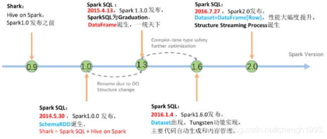
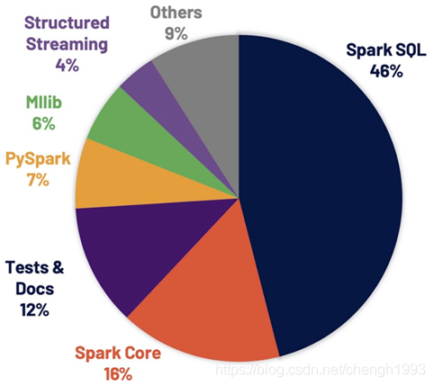
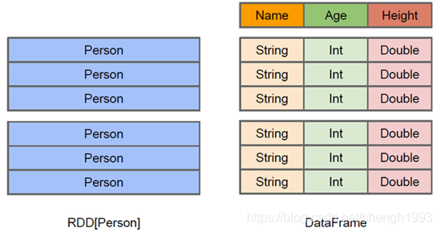
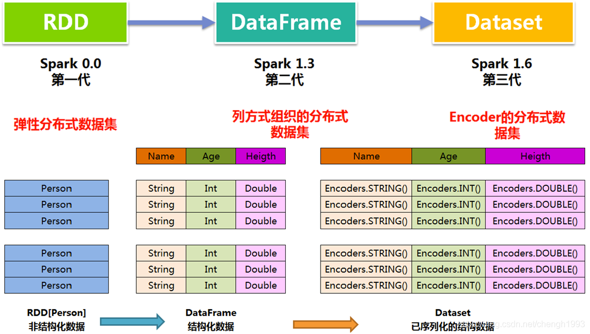

# Spark SQL概述

Hive的诞生，主要是因为开发MapReduce程序对 Java 要求比较高，为了让他们能够操作HDFS上的数据，推出了Hive。

Hive与RDBMS的SQL模型比较类似，容易掌握。 Hive的主要缺陷在于它的底层是基于MapReduce的，执行比较慢。

在 Spark 0.x 版的时候推出了Shark，Shark与Hive是紧密关联的，Shark底层很多东西还是依赖于Hive，
修改了内存管理、物理计划、执行三个模块，底层使用Spark的基于内存的计算模型，性能上比Hive提升了很多倍。

Shark 更多是对 Hive 的改造，替换了Hive的物理执行引擎，提高了执行速度。但Shark继承了大量的Hive代码，因此给优化和维护带来了大量的麻烦。

在 Spark 1.x 的时候Shark被淘汰。在2014年7月1日的Spark Summit 上， Databricks宣布终止对Shark的开发，将重点放到 Spark SQL 上。



Shark终止以后，产生了两个分支:

- Hive on Spark

hive社区的，源码在hive中

- Spark SQL(Spark on Hive)

Spark社区，源码在Spark中，支持多种数据源，多种优化技术，扩展性好很多

--------------------------------------------------------------------------------

Apache Spark 3.0.0解决超过3400个Jira问题被解决，这些问题在Spark各个核心组件中分布情况如下图:



## 1. Spark SQL特点

Spark SQL自从面世以来不仅接过了 Shark 的接力棒，为spark用户提供高性能的SQL on hadoop的解决方案，
还为spark带来了通用的高效的，多元一体的结构化的数据处理能力。


Spark SQL的优势:

- 写更少的代码 
- 读更少的数据(SparkSQL的表数据在内存中存储不使用原生态的JVM对象存储方式，而是采用内存列存储)
- 提供更好的性能(字节码生成技术、SQL优化)

## 2. Spark SQL数据抽象

SparkSQL提供了两个新的抽象，分别是DataFrame和DataSet;

同样的数据都给到这三个数据结构，经过系统的计算逻辑，都得到相同的结果，不同是它们的执行效率和执行方式;

> 一般 SparkSQL 效率较高

在后期的Spark版本中，DataSet 会逐步取代 RDD 和 DataFrame 成为唯一的API接口。

### 2.1 DataFrame

DataFrame的前身是SchemaRDD。Spark1.3更名为DataFrame。不继承RDD，自己实现了RDD的大部分功能。 

与RDD类似，DataFrame也是一个分布式数据集:

- DataFrame可以看做分布式 Row 对象的集合，提供了由列组成的详细模式信息，使其可以得到优化。
- DataFrame 不仅有比RDD更多的算子，还可以进行执行计划的优化
- DataFrame 更像传统数据库的二维表格，除了数据以外，还记录数据的结构信息，即 `schema`
- DataFrame 也支持嵌套数据类型(`struct`、`array` 和 `map`)
- DataFrame API提供的是一套高层的关系操作，比函数式的RDD API要更加友 好，门槛更低 
- Dataframe 的劣势在于在编译期缺少类型安全检查，导致运行时出错



### 2.2 DataSet

DataSet是在Spark1.6中添加的新的接口;

与RDD相比，保存了更多的描述信息，概念上等同于关系型数据库中的二维表;

与DataFrame相比，保存了类型信息，是强类型的，提供了编译时类型检查;

调用Dataset的方法先会生成逻辑计划，然后Spark的优化器进行优化，最终生成物理计划，然后提交到集群中运行。

DataSet 包含了 DataFrame 的功能，在 Spark2.0 中两者得到了统一: DataFrame 表示为 `DataSet[Row]`，即DataSet的子集。

```scala
type DataFrame = Dateset[Row]
```

> `type` 关键字相当于定义同义词，表示 `DataFrame` 和 `Dataset[Row]` 是一个意思。




### 2.3 Row & Schema

> `DataFrame = RDD[Row] + Schema`;
> 
> DataFrame 的前身是 SchemaRDD 

Row是一个泛化的无类型 JVM object

```scala
import org.apache.spark.sql.Row
val row1 = Row(1,"abc", 1.2)
// Row 的访问方法
row1(0) // Any = 1
row1(1) // Any = abc
row1(2) // Any = 1.2

row1.getInt(0) // Int = 1
row1.getString(1)
row1.getDouble(2)

row1.getAs[Int](0) // Int = 1
row1.getAs[String](1)
row1.getAs[Double](2)
```

DataFrame(即带有Schema信息的RDD)，Spark通过Schema就能够读懂数据。

--------------------------------------------------------------------------------

什么是 Schema?

DataFrame中提供了详细的数据结构信息，从而使得SparkSQL可以清楚地知道该数据集中包含哪些列，
每列的名称和类型各是什么，*DataFrame中的数据结构信息，即为schema*。

```scala
import org.apache.spark.sql.types._
val schema = (new StructType).
add("id", "int", false).
add("name", "string", false).
add("height", "double", false)
```

> `add("列名", "数据类型", 是否允许为空)`

> 创建和使用方式参考源码: `StructType.scala`

```scala
// 多种方式定义schema，其核心是StructType
import org.apache.spark.sql.types._
 
// 来自官方帮助文档
val schema1 = StructType( StructField("name", StringType, false) ::
StructField("age", IntegerType, false) ::
StructField("height", IntegerType, false) :: Nil)

val schema2 = StructType( Seq(StructField("name", StringType, false),
StructField("age", IntegerType, false),
StructField("height", IntegerType, false)))

val schema3 = StructType( List(StructField("name", StringType, false),
StructField("age", IntegerType, false),
StructField("height", IntegerType, false)))
 
// 来自源码
val schema4 = (new StructType).
add(StructField("name", StringType, false)).
add(StructField("age", IntegerType, false)).
add(StructField("height", IntegerType, false))

val schema5 = (new StructType).
add("name", StringType, true, "comment1").
add("age", IntegerType, false, "comment2").
add("height", IntegerType, true, "comment3")
```

### 2.4 三者的共性

1. RDD、DataFrame、Dataset都是 Spark 平台下的分布式弹性数据集，为处理海量数据提供便利 
2. 三者都有许多相同的概念，如分区、持久化、容错等; 有许多共同的函数，如 `map`、`filter`，`sortBy` 等
3. 三者都有惰性机制，只有在遇到 Action 算子时，才会开始真正的计算
4. 对 `DataFrame` 和 `Dataset` 进行的许多操作都需要这个包的支持: `import spark.implicits._`

### 2.5 三者的区别

- `DataFrame(DataFrame = RDD[Row] + Schema)`

1、与RDD和Dataset不同，DataFrame每一行的类型固定为Row，只有通过解析才能获取各个字段的值
2、DataFrame与Dataset均支持 SparkSQL 的操作

- `Dataset(Dataset = RDD[case class].toDS)`

1、Dataset和DataFrame拥有完全相同的成员函数，区别只是每一行的数据类型不同;
2、DataFrame 定义为 `Dataset[Row]`。每一行的类型是Row，每一行究竟有哪些字段，各个字段又是什么类型都无从得知，只能用前面提到的 `getAS` 方法或者模式匹配拿出特定字段;
3、Dataset 每一行的类型都是一个 `case class`，在自定义了 `case class` 之后可以很自由的获得每一行的信息;

## 3. 数据类型

<http://spark.apache.org/docs/latest/sql-ref-datatypes.html>

| Data type              | 	Value type in Scala	                                                                                                     | API to access or create a data type                                                                                   |
|------------------------|---------------------------------------------------------------------------------------------------------------------------|-----------------------------------------------------------------------------------------------------------------------|
| ByteType	              | Byte	                                                                                                                     | ByteType                                                                                                              |
| ShortType	             | Short	                                                                                                                    | ShortType                                                                                                             |
| IntegerType	           | Int	                                                                                                                      | IntegerType                                                                                                           |
| LongType	              | Long	                                                                                                                     | LongType                                                                                                              |
| FloatType	             | Float	                                                                                                                    | FloatType                                                                                                             |
| DoubleType	            | Double	                                                                                                                   | DoubleType                                                                                                            |
| DecimalType	           | java.math.BigDecimal	                                                                                                     | DecimalType                                                                                                           |
| StringType	            | String	                                                                                                                   | StringType                                                                                                            |
| BinaryType	            | `Array[Byte]`	                                                                                                            | BinaryType                                                                                                            |
| BooleanType	           | Boolean	                                                                                                                  | BooleanType                                                                                                           |
| TimestampType	         | java.sql.Timestamp	                                                                                                       | TimestampType                                                                                                         |
| DateType	              | java.sql.Date	                                                                                                            | DateType                                                                                                              |
| YearMonthIntervalType	 | java.time.Period	                                                                                                         | YearMonthIntervalType                                                                                                 |
| DayTimeIntervalType	   | java.time.Duration	                                                                                                       | DayTimeIntervalType                                                                                                   |
| ArrayType	             | scala.collection.Seq	                                                                                                     | `ArrayType(elementType, [containsNull])` <br/> Note: The default value of containsNull is true.                       |
| MapType	               | scala.collection.Map	                                                                                                     | `MapType(keyType, valueType, [valueContainsNull])` <br/> Note: The default value of valueContainsNull is true.        |
| StructType	            | org.apache.spark.sql.Row	                                                                                                 | StructType(fields) Note: fields is a Seq of StructFields. <br/>  Also, two fields with the same name are not allowed. |
| StructField	           | The value type in Scala of the data type of this field(For example, Int for a StructField with the data type IntegerType) | 	`StructField(name, dataType, [nullable])` <br/> Note: The default value of nullable is true.                         |
