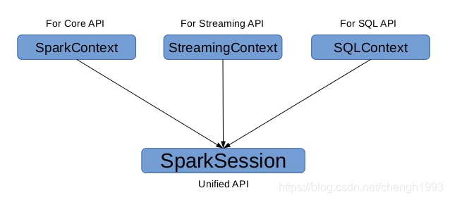
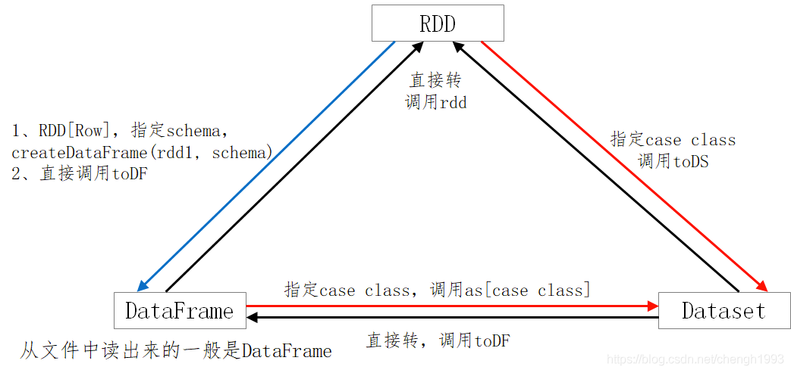

# Spark SQL编程

官方文档: <http://spark.apache.org/docs/latest/sql-getting-started.html>

## 1. SparkSession

在 Spark 2.0 之前:

- SQLContext 是创建 DataFrame 和执行 SQL 的入口
- HiveContext 通过Hive sql语句操作Hive数据，兼 Hive 操作，HiveContext 继承自 SQLContext



在 Spark 2.0 之后:

将这些入口点统一到了 SparkSession，SparkSession 封装了 SqlContext 及 HiveContext;

- 实现了 SQLContext 及 HiveContext 所有功能; 
- 通过 SparkSession 可以获取到 SparkContext;

```scala
import org.apache.spark.sql.SparkSession

val spark = SparkSession
  .builder()
  .appName("Spark SQL basic example")
  .config("spark.some.config.option", "some-value")
  .getOrCreate()

// For implicit conversions like converting RDDs to DataFrames
import spark.implicits._
```

```xml
<dependency>
    <groupId>org.apache.spark</groupId>
    <artifactId>spark-sql_2.12</artifactId>
    <version>${spark.version}</version>
</dependency>
```

## 2. DataFrame & Dataset 的创建

> 不要刻意区分: DF、DS。

> DF 是一种特殊的 DS; `ds.transformation => df`

### 2.1 由 Range 生成 Dataset

```scala
val numDS = spark.range(5, 100, 5) // 5 ~ 100, 步长为 5
// orderBy 转换操作; desc: function; show:Action 
numDS.orderBy(desc("id")).show(5)

// 显示schema信息
numDS.printSchema
// root
//  |-- id: long (nullable = false)

// 统计信息
numDS.describe().show
// +-------+------------------+
// |summary|                id|
// +-------+------------------+
// |  count|                19|
// |   mean|              50.0|
// | stddev|28.136571693556885|
// |    min|                 5|
// |    max|                95|
// +-------+------------------+

// 使用RDD执行同样的操作
numDS.rdd.map(_.toInt).stats
// org.apache.spark.util.StatCounter = (count: 19, mean: 50.000000, stdev: 27.386128, max: 95.000000, min: 5.000000)

// 检查分区数
numDS.rdd.getNumPartitions
// Int = 6
```

### 2.2 由集合生成 Dataset 

```scala
Dataset = RDD[case class]
```

```scala
case class Person(name:String, age:Int, height:Int)

// 注意 Seq 中元素的类型
val seq1 = Seq(Person("Jack", 28, 184), Person("Tom", 10, 144), Person("Andy", 16, 165))
val ds1 = spark.createDataset(seq1)

// 显示schema信息
ds1.printSchema
// root
//  |-- name: string (nullable = true)
//  |-- age: integer (nullable = false)
//  |-- height: integer (nullable = false)

ds1.show
// +----+---+------+
// |name|age|height|
// +----+---+------+
// |Jack| 28|   184|
// | Tom| 10|   144|
// |Andy| 16|   165|
// +----+---+------+

val seq2 = Seq(("Jack", 28, 184), ("Tom", 10, 144), ("Andy", 16, 165))
val ds2 = spark.createDataset(seq2)
ds2.show
// +----+---+---+
// |  _1| _2| _3|
// +----+---+---+
// |Jack| 28|184|
// | Tom| 10|144|
// |Andy| 16|165|
// +----+---+---+
```

### 2.3 由集合生成 DataFrame

```scala
DataFrame = RDD[Row] + Schema
```

```scala
val lst = List(("Jack", 28, 184), ("Tom", 10, 144), ("Andy", 16, 165))
val df1 = spark.createDataFrame(lst)
  // 改单个字段名时简便
  .withColumnRenamed("_1", "name1")
  .withColumnRenamed("_2", "age1")
  .withColumnRenamed("_3", "height1")

df1.orderBy("age1").show(10)

// desc是函数，在IDEA中使用是需要导包
import org.apache.spark.sql.functions._
df1.orderBy(desc("age1")).show(10)

// 修改整个DF的列名
val df2 = spark.createDataFrame(lst).toDF("name", "age", "height")
```

> 如果给单个列改名第一种方式更方便; 如果给所有列重命名第二种方式更方便。

### 2.4 RDD 转成 DataFrame

```scala
DataFrame = RDD[Row] + Schema
```

```scala
import org.apache.spark.sql.Row
import org.apache.spark.sql.types._

val arr = Array(("Jack", 28, 184), ("Tom", 10, 144), ("Andy", 16, 165))

val rdd1 = sc.makeRDD(arr).map(f => Row(f._1, f._2, f._3))
val schema = StructType(StructField("name", StringType, false) :: 
  StructField("age", IntegerType, false) :: 
  StructField("height", IntegerType, false) :: Nil)

val schema1 = (new StructType)
  .add("name", "string", false)
  .add("age", "int", false)
  .add("height", "int", false)

// RDD => DataFrame，要指明schema
val rddToDF = spark.createDataFrame(rdd1, schema)
rddToDF.orderBy(desc("name")).show(false)
// 上面的show(flase) 表示,字段过长时不做截断
```

```scala
import org.apache.spark.sql.Row
import org.apache.spark.sql.types._
 
val arr1 = Array(("Jack", 28, null), ("Tom", 10, 144), ("Andy", 16, 165))
val rdd1 = sc.makeRDD(arr1).map(f => Row(f._1, f._2, f._3))
val structType = StructType(StructField("name", StringType, false) ::
                 StructField("age", IntegerType, false) ::
                 StructField("height", IntegerType, false) :: Nil)
// false 说明字段不能为空

val schema1 = structType
val df1 = spark.createDataFrame(rdd1, schema1)
 
// 下一句执行报错(因为有空字段)
df1.show
// Error while encoding: java.lang.RuntimeException: The 2th field 'height' of input row cannot be null.

// true 允许该字段为空，语句可以正常执行
val schema2 = StructType( StructField("name", StringType, false) ::
              StructField("age", IntegerType, false) ::
              StructField("height", IntegerType, true) :: Nil)
 
val df2 = spark.createDataFrame(rdd1, schema2)
df2.show
// +----+---+------+                                                               
// |name|age|height|
// +----+---+------+
// |Jack| 28|  null|
// | Tom| 10|   144|
// |Andy| 16|   165|
// +----+---+------+
 
// 下面的包 IDEA 中需要，spark-shell 中不需要
import spark.implicits._
val arr2 = Array(("Jack", 28, 150), ("Tom", 10, 144), ("Andy", 16, 165))
val rddToDF = sc.makeRDD(arr2).toDF("name", "age", "height")
```

```scala
case class Person(name:String, age:Int, height:Int)
val arr2 = Array(("Jack", 28, 150), ("Tom", 10, 144), ("Andy", 16, 165))
val rdd2: RDD[Person] = spark.sparkContext.makeRDD(arr2).map(f => Person(f._1, f._2, f._3))

val ds2 = rdd2.toDS()  // 反射推断，spark 通过反射从 case class 的定义得到类名
val df2 = rdd2.toDF()  // 反射推断

ds2.printSchema
df2.printSchema

ds2.orderBy(desc("name")).show(10)
df2.orderBy(desc("name")).show(10)
```

### 2.5. RDD转Dataset

```scala
// 注意 DS 和 DF 的特征
Dataset = RDD[case class]
DataFrame = RDD[Row] + Schema
```

```scala
val ds3 = spark.createDataset(rdd2)
ds3.show(10)
```

### 2.6. 从文件创建 DateFrame (以 csv 文件为例)

```scala
object CsvDemo {
  def main(args: Array[String]): Unit = {
    val spark = SparkSession
      .builder()
      .appName("Demo01")
      .master("local[*]")
      .getOrCreate()

    val sc: SparkContext = spark.sparkContext
    sc.setLogLevel("WARN")

    // 从文件创建 DF
    val df1: DataFrame = spark.read.csv("data/sql/people1.csv")
    df1.printSchema()
    df1.show()

    val df2: DataFrame = spark.read.csv("data/sql/people2.csv")
    df2.printSchema()
    df2.show()

    // 定义参数
    val df3: DataFrame = spark.read
      .options(Map(
        ("header", "true"),
        ("inferschema", "true") // 简单类型可以使用，复杂的类型不一定对
      ))
      .csv("data/sql/people1.csv")
    df3.printSchema()
    df3.show()

    // 自定义 schema (@since 2.3.0)
    val schema = "name string, age int, job string"
    val df4: DataFrame = spark.read
      .option("header", "true")
      .option("delimiter", ";")
      .schema(schema)
      .csv("data/sql/people2.csv")
    df4.printSchema()
    df4.show()

    spark.close()
  }
}
```

## 3. 三者的转换



SparkSQL提供了一个领域特定语言(DSL)以方便操作结构化数据。

> 核心思想还是SQL; 仅仅是一个语法的问题。

## 4. Action操作

- 与RDD类似的操作 

`show`、`collect`、`collectAsList`、`head`、`first`、`count`、`take`、`takeAsList`、`reduce`

- 与结构相关

`printSchema`、`explain`、`columns`、`dtypes`、`col`

--------------------------------------------------------------------------------

测试案例

```text
EMPNO,ENAME,JOB,MGR,HIREDATE,SAL,COMM,DEPTNO
7369,SMITH,CLERK,7902,2001-01-02 22:12:13,800,,20
7499,ALLEN,SALESMAN,7698,2002-01-02 22:12:13,1600,300,30
7521,WARD,SALESMAN,7698,2003-01-02 22:12:13,1250,500,30
7566,JONES,MANAGER,7839,2004-01-02 22:12:13,2975,,20
7654,MARTIN,SALESMAN,7698,2005-01-02 22:12:13,1250,1400,30 
7698,BLAKE,MANAGER,7839,2005-04-02 22:12:13,2850,,30
7782,CLARK,MANAGER,7839,2006-03-02 22:12:13,2450,,10
7788,SCOTT,ANALYST,7566,2007-03-02 22:12:13,3000,,20
7839,KING,PRESIDENT,,2006-03-02 22:12:13,5000,,10
7844,TURNER,SALESMAN,7698,2009-07-02 22:12:13,1500,0,30 
7876,ADAMS,CLERK,7788,2010-05-02 22:12:13,1100,,20
7900,JAMES,CLERK,7698,2011-06-02 22:12:13,950,,30
7902,FORD,ANALYST,7566,2011-07-02 22:12:13,3000,,20
7934,MILLER,CLERK,7782,2012-11-02 22:12:13,1300,,10
```

```scala
// 处理了文件头，得到了字段名称
// 使用自动类型推断，基本得到了合理的值 
val df: DataFrame = spark.read
  .option("header", "true")
  .option("inferschema", "true")
  .csv("data/sql/emp.dat")
```

```scala
df.count
// 缺省显示20行
df.union(df).show()
// 显示2行
df.show(2)
// 不截断字符
df.toJSON.show(false)
// 显示10行，不截断字符
df.toJSON.show(10, false) 
spark.catalog.listFunctions.show(10000, false)

// collect返回的是数组, Array[org.apache.spark.sql.Row] 
val c1 = df.collect()
// collectAsList返回的是List, List[org.apache.spark.sql.Row] 
val c2 = df.collectAsList()
// 返回 org.apache.spark.sql.Row 
val h1 = df.head()
val f1 = df.first()
// 返回 Array[org.apache.spark.sql.Row]，长度为3 
val h2 = df.head(3)
val f2 = df.take(3)

// 返回 List[org.apache.spark.sql.Row]，长度为2 
val t2 = df.takeAsList(2)
```

```scala
// 结构属性 
df1.columns       // 查看列名
df1.dtypes        // 查看列名和类型
df1.explain()     // 参看执行计划
df1.col("name")   // 获取某个列
df1.printSchema   // 常用
```

## 5. Transformation 操作

```sql
select * from tab where ... group by ... having... order by...
```

分类：

- RDD类似的操作 
- 持久化/缓存与 `checkpoint`
- `select`
- `where`
- `group by` / 聚合
- `order by`
- `join`
- 集合操作
- 空值操作(函数)
- 函数

### 5.1 与 RDD 类似的操作

`map`、`filter`、`flatMap`、`mapPartitions`、`sample`、`randomSplit`、
`limit`、`distinct`、`dropDuplicates`、`describe`

```scala
df.map(row => row.getAs[Int](0)).show

// randomSplit(与 RDD 类似，将 DF、DS 按给定参数分成多份)
val Array(dfx, dfy, dfz) = df.randomSplit(Array(0.5, 0.6, 0.7))
println(dfx.count) // 4
println(dfy.count) // 8
println(dfz.count) // 2

// 取10行数据生成新的 DataSet
val df2 = df.limit(10)
println(df2.count) // 10
// distinct，去重
val df3 = df.union(df)
println(df3.distinct.count) // 14

// dropDuplicates，按列值去重
df2.dropDuplicates.show
df2.dropDuplicates("mgr", "deptno").show
df2.dropDuplicates("mgr").show
df2.dropDuplicates("deptno").show

// 返回全部列的统计(count、mean、stddev、min、max)
df.describe().show

// 返回指定列的统计
df.describe("sal").show
df.describe("sal", "comm").show
```

### 5.2 存储相关

`cacheTable`、`persist`、`checkpoint`、`unpersist`、`cache`

> 备注: `Dataset` 默认的存储级别是 `MEMORY_AND_DISK`

```scala
import org.apache.spark.storage.StorageLevel

spark.sparkContext.setCheckpointDir("hdfs://linux121:9000/checkpoint")
df1.show()
df1.checkpoint()
df1.cache()
df1.persist(StorageLevel.MEMORY_ONLY)
df1.count()
df1.unpersist(true)

df1.createOrReplaceTempView("t1")
spark.catalog.cacheTable("t1")
spark.catalog.uncacheTable("t1")
```

### 5.3 select 相关

列的多种表示、select、selectExpr 

`drop`、`withColumn`、`withColumnRenamed`、`cast(内置函数)`

```scala
// 方便测试，在此使用 spark-shell
// 如果要在 spark-shell 上面输入多行代码，将 . 放在行尾，表示该行代码仍未结束
val df1 = spark.read.
  option("header", "true").
  option("inferschema", "true").
  csv("/data/emp.dat")
```

```scala
// 列的多种表示方法。使用""、$""、'、col()、ds("")

// 注意:不要混用; 必要时使用 spark.implicitis._; 并非每个表示在所有的地方都有效

df1.select($"ename", $"hiredate", $"sal").show
df1.select("ename", "hiredate", "sal").show
df1.select('ename, 'hiredate, 'sal).show // ' symbol , 表示对后面的内容转义
df1.select(col("ename"), col("hiredate"), col("sal")).show
df1.select(df1("ename"), df1("hiredate"), df1("sal")).show

// 下面的写法无效，其他列的表示法有效
df1.select("ename", "hiredate", "sal"+100).show
df1.select("ename", "hiredate", "sal+100").show

// 这样写才符合语法
df1.select($"ename", $"hiredate", $"sal"+100).show
df1.select('ename, 'hiredate, 'sal+100).show

// 因此综合比较之下，建议使用 $ 的方式

// 可使用expr表达式(expr里面只能使用引号)
df1.select(expr("comm+100"), expr("sal+100"), expr("ename")).show
df1.selectExpr("ename as name").show // 重命名
df1.selectExpr("power(sal, 2)", "sal").show // sal 进行平方计算
df1.selectExpr("round(sal, -3) as newsal", "sal", "ename").show
```

```scala
// drop、withColumn、 withColumnRenamed、casting

// drop 删除一个或多个列，得到新的DF
df1.drop("mgr")
df1.drop("empno", "mgr")

// withColumn，修改列值
val df2 = df1.withColumn("sal", $"sal"+1000).show
df2.show

// withColumnRenamed，更改列名
df1.withColumnRenamed("sal", "newsal").show

// 备注:drop、withColumn、withColumnRenamed返回的是DF 

// cast，类型转换
df1.selectExpr("cast(empno as string)").printSchema

import org.apache.spark.sql.types._
df1.select('empno.cast(StringType)).printSchema
```

### 5.4 where 相关 

`where` == `filter`

```scala
// where操作
df1.filter("sal>1000").show 
df1.filter("sal>1000 and job=='MANAGER'").show

// filter操作
df1.where("sal>1000").show
df1.where("sal>1000 and job=='MANAGER'").show
```

### 5.5 groupBy 相关

`groupBy`、`agg`、`max`、`min`、`avg`、`sum`、`count`(后面5个为内置函数)

> 使用内置函数时，需要导入包： `import org.apache.spark.sql.functions._`

```scala
// groupBy、max、min、mean、sum、count(与df1.count不同)
df1.groupBy("Job").sum("sal").show
df1.groupBy("Job").max("sal").show
df1.groupBy("Job").min("sal").show
df1.groupBy("Job").avg("sal").show
df1.groupBy("Job").count.show

// 类似having子句
df1.groupBy("Job").avg("sal").where("avg(sal) > 2000").show
df1.groupBy("Job").avg("sal").where($"avg(sal)" > 2000).show

// 如果需要统计多个指标，需要使用 agg

// agg
df1.groupBy("Job").agg("sal"->"max", "sal"->"min", "sal"->"avg", "sal"->"sum", "sal"->"count").show
df1.groupBy("deptno").agg("sal"->"max", "sal"->"min", "sal"->"avg", "sal"->"sum", "sal"->"count").show

// 这种方式更好理解
df1.groupBy("Job").agg(max("sal"), min("sal"), avg("sal"), sum("sal"), count("sal")).show

// 给列取别名 // min(sal) 列取别名为 => min1, 其他列不变
df1.groupBy("Job").agg(max("sal"), min("sal"), avg("sal"), sum("sal"), count("sal")).withColumnRenamed("min(sal)", "min1").show

// 给列取别名，最简便
df1.groupBy("Job").agg(max("sal").as("max1"), min("sal").as("min2"), avg("sal").as("avg3"), sum("sal").as("sum4"), count("sal").as("count5")).show
```

### 5.6 orderBy 相关

`orderBy` == `sort`

```scala
// orderBy
df1.orderBy("sal").show
df1.orderBy($"sal").show
df1.orderBy($"sal".asc).show // 指定排序方式为升序

// 降序 
df1.orderBy(-$"sal").show
df1.orderBy('sal).show
df1.orderBy(col("sal")).show
df1.orderBy(df1("sal")).show

df1.orderBy($"sal".desc).show
df1.orderBy(-'sal).show
df1.orderBy(-'deptno, -'sal).show

// sort，以下语句等价
df1.sort("sal").show
df1.sort($"sal").show
df1.sort($"sal".asc).show
df1.sort('sal).show
df1.sort(col("sal")).show
df1.sort(df1("sal")).show

df1.sort($"sal".desc).show
df1.sort(-'sal).show
df1.sort(-'deptno, -'sal).show
```

### 5.7 join 相关

```scala
// 1、笛卡尔积 
df1.crossJoin(df1).count

// 2、等值连接(单字段)(连接字段empno，仅显示了一次) 
df1.join(df1, "empno").count

// 3、等值连接(多字段)(连接字段empno、ename，仅显示了一次) 
df1.join(df1, Seq("empno", "ename")).show

// 定义第一个数据集
case class StudentAge(sno: Int, name: String, age: Int)
val lst = List(StudentAge(1,"Alice", 18), StudentAge(2,"Andy", 19), StudentAge(3,"Bob", 17), StudentAge(4,"Justin", 21), StudentAge(5,"Cindy", 20))
val ds1 = spark.createDataset(lst)
ds1.show()
// 定义第二个数据集
case class StudentHeight(sname: String, height: Int)
val rdd = sc.makeRDD(List(StudentHeight("Alice", 160), StudentHeight("Andy", 159), StudentHeight("Bob", 170), StudentHeight("Cindy", 165), StudentHeight("Rose", 160))) 
val ds2 = rdd.toDS

// 备注: 不能使用双引号(此处用的是 $"")，而且这里是 ===
// 连接字段名不一致，两个都显示了
ds1.join(ds2, $"name"===$"sname").show
ds1.join(ds2, 'name==='sname).show

ds1.join(ds2, ds1("name") === ds2("sname")).show
ds1.join(ds2, ds1("sname") === ds2("sname"), "inner").show

// 多种连接方式
ds1.join(ds2, $"name" === $"sname").show // 默认连接方式为内连接
ds1.join(ds2, $"name" === $"sname", "inner").show

ds1.join(ds2, $"name" === $"sname", "left").show
ds1.join(ds2, $"name" === $"sname", "left_outer").show

ds1.join(ds2, $"name" === $"sname", "right").show
ds1.join(ds2, $"name" === $"sname", "right_outer").show

ds1.join(ds2, $"name" === $"sname", "outer").show
ds1.join(ds2, $"name" === $"sname", "full").show
ds1.join(ds2, $"name" === $"sname", "full_outer").show
```

> 备注: DS在 `join` 操作之后变成了DF

### 5.8 集合相关

`union==unionAll(过期)`、`intersect`、`except`

```scala
// union、unionAll、intersect、except。集合的交、并、差
val ds3 = ds1.select("name")
val ds4 = ds2.select("sname")

// union 求并集，不去重 
ds3.union(ds4).show
// unionAll、union 等价; unionAll过期方法，不建议使用
ds3.unionAll(ds4).show
// intersect 求交 
ds3.intersect(ds4).show
// except 求差(ds3 - ds4)
ds3.except(ds4).show
```

### 5.9 空值处理

`na.fill`、`na.drop`

```scala
// NaN (Not a Number)
math.sqrt(-1.0) // Double = NaN
math.sqrt(-1.0).isNaN() // Boolean = true
df1.show

// 删除所有有空值的行(任意列是控制都删除)
df1.na.drop.show

// 删除指定列是空值的行
df1.na.drop(Array("mgr")).show

// 对全部列填充;对指定单列填充;对指定多列填充
df1.na.fill(1000).show
df1.na.fill(1000, Array("comm")).show
df1.na.fill(Map("mgr"->2000, "comm"->1000)).show

// 对指定列的值进行替换
df1.na.replace("comm" :: "deptno" :: Nil, Map(0 -> 100, 10 -> 100)).show

// 查询空值列或非空值列。isNull、isNotNull为内置函数
df1.filter("comm is null").show
df1.filter($"comm".isNull).show
df1.filter(col("comm").isNull).show

df1.filter("comm is not null").show
df1.filter(col("comm").isNotNull).show
```

### 5.10 窗口函数

> 一般情况下窗口函数不用 DSL 处理，直接用 SQL 更方便 

> 参考源码 `Window.scala`、`WindowSpec.scala`(主要)

```scala
import org.apache.spark.sql.expressions.Window

val w1 = Window.partitionBy("cookieid").orderBy("createtime")
val w2 = Window.partitionBy("cookieid").orderBy("pv")
val w3 = w1.rowsBetween(Window.unboundedPreceding, Window.currentRow) // 第一行到当前行
val w4 = w1.rowsBetween(-1, 1) // 前一行到后一行

// 聚组函数【用分析函数的数据集】 
df.select($"cookieid", $"pv", sum("pv").over(w1).alias("pv1")).show
df.select($"cookieid", $"pv", sum("pv").over(w3).alias("pv1")).show
df.select($"cookieid", $"pv", sum("pv").over(w4).as("pv1")).show

// 排名
df.select($"cookieid", $"pv", rank().over(w2).alias("rank")).show
df.select($"cookieid", $"pv", dense_rank().over(w2).alias("denserank")).show
df.select($"cookieid", $"pv", row_number().over(w2).alias("rownumber")).show

// lag、lead
df.select($"cookieid", $"pv", lag("pv", 2).over(w2).alias("rownumber")).show
df.select($"cookieid", $"pv", lag("pv", -2).over(w2).alias("rownumber")).show
```

### 5.11 内建函数

<http://spark.apache.org/docs/latest/api/sql/index.html>

## 6. SQL语句

> 总体而言: SparkSQL 与 HQL 兼容; 与 HQL 相比，SparkSQL 更简洁。

`createTempView`、`createOrReplaceTempView`、`spark.sql("SQL")`

```text
# 数据(uid tags)
1 1,2,3
2 2,3
3 1,2
# 编写 SQL 实现如下结果
1 1
1 2
1 3
2 2
2 3
3 1
3 2
```

```scala{34}
case class Info(id: String, tags: String)

object SqlDemo {
  def main(args: Array[String]): Unit = {
    val spark: SparkSession = SparkSession.builder()
      .appName(this.getClass.getSimpleName)
      .master("local[*]")
      .getOrCreate()

    spark.sparkContext.setLogLevel("WARN")

    import spark.implicits._
    // 准备数据
    val arr: Array[String] = Array("1 1,2,3", "2 2,3", "3 1,2")
    val rdd: RDD[Info] = spark.sparkContext.makeRDD(arr)
      .map { line =>
        val fields: Array[String] = line.split("\\s+")
        Info(fields(0), fields(1))
      }
    val ds: Dataset[Info] = spark.createDataset(rdd)
    ds.createOrReplaceTempView("t1")

    // 用 SQL 处理 - HQL
    spark.sql(
      """
        | select id, tag
        | from t1
        | lateral view explode(split(tags, ",")) t2 as tag
        |""".stripMargin).show()

    // 用 SQL 处理 - SparkSQL
    spark.sql(
      """
        | select id, explode(split(tags, ",")) tag
        | from t1
        |""".stripMargin).show()

    spark.close()
  }
}
```

> 踩坑：报错 `找不到形参 Encoder[xx] 的隐式项`，检查是否是因为手动导入的 `import spark.implicits._` 被删除了。

## 7. 输入与输出

SparkSQL内建支持的数据源包括: `Parquet`、`JSON`、`CSV`、`Avro`、`Images`、`BinaryFiles(Spark 3.0)`。

> 其中Parquet是默认的数据源。

```scala
// 内部使用
DataFrameReader.format(args).option("key", "value").schema(args).load()

// 开发API
SparkSession.read
```

> 可用的Option选项参见: <https://spark.apache.org/docs/2.4.5/api/java/org/apache/spark/sql/DataFrameReader.html>
  
```scala
val df1 = spark.read.format("parquet").load("data/users.parquet")

// Use Parquet; you can omit format("parquet") if you wish as it's the default
// parquet 是默认格式，可以省略 format 参数
val df2 = spark.read.load("data/users.parquet")

// Use CSV
val df3 = spark.read.format("csv")
  .option("inferSchema", "true")
  .option("header", "true")
  .load("data/people1.csv")

// Use JSON
val df4 = spark.read.format("json")
  .load("data/emp.json")
```

```scala
// 内部使用
DataFrameWriter.format(args).option(args).bucketBy(args).partitionBy(args).save(path)
// 开发API
DataFrame.write
```

### 7.1 Parquet 文件

```scala
// 读取 (除了前面介绍的方法，还可以使用 SparkSQL 的方式直接读取)
spark.sql(
  """
    |CREATE OR REPLACE TEMPORARY VIEW users
    |USING parquet
    |OPTIONS (path "data/users.parquet")
    |""".stripMargin
)

spark.sql("select * from users").show

// 写出
df.write.format("parquet")
  .mode("overwrite")
  .option("compression", "snappy")
  .save("data/parquet")
```

### 7.2 json 文件

```scala
val fileJson = "data/emp.json"
val df6 = spark.read.format("json").load(fileJson)
spark.sql(
  """
    |CREATE OR REPLACE TEMPORARY VIEW emp
    |USING json
    |options(path "data/emp.json")
    |""".stripMargin)

spark.sql("SELECT * FROM emp").show()

spark.sql("SELECT * FROM emp").write
  .format("json")
  .mode("overwrite")
  .save("data/json")
```

### 7.3 CSV文件

```scala
// CSV
val fileCSV = "data/sql/people1.csv"
val df = spark.read.format("csv")
  .option("header", "true")
  .option("inferschema", "true")
  .load(fileCSV)

// 使用 SQL 直接加载
spark.sql(
  """
    |create or replace temporary view people
    |using csv
    |options (path "data/sql/people1.csv", header "true", inferschema "true")
    |""".stripMargin)

// 写出数据
spark.sql("select * from people")
  .write
  .format("csv")
  .mode("overwrite")
  .save("data/csv")
```

### 7.4 JDBC

SparkSQL还支持使用JDBC的方式连接到外部数据源

```scala
val jdbcDF = spark.read.format("jdbc")
  .option("url", "jdbc:mysql://linux123:3306/zmn_test?useSSL=false")//&useUnicode=true
  .option("driver", "com.mysql.jdbc.Driver")
  .option("dbtable", "product_info")
  .option("user", "hive")
  .option("password", "12345678")
  .load()

jdbcDF.show()

jdbcDF.write.format("jdbc")
  .option("url", "jdbc:mysql://linux123:3306/zmn_test?useSSL=false&characterEncoding=utf8")
  .option("user", "hive")
  .option("password", "12345678")
  .option("driver", "com.mysql.jdbc.Driver")
  .option("dbtable", "product_info_back")
  .mode("append")
  .save
```

> 备注: 如果有中文注意表的字符集，否则会有乱码

**保存模式**

- `SaveMode.ErrorIfExists`：(默认)若表存在，则会直接报异常，数据不能存入数据库
- `SaveMode.Append`: 若表存在，则追加在该表中; 若该表不存在，则会先创建表，再插入数据
- `SaveMode.Overwrite`: 先将已有的表及其数据全都删除，再重新创建该表，最后插入新的数据
- `SaveMode.Ignore`: 若表不存在，则创建表并存入数据; 若表存在，直接跳过数据的存储，不会报错

```sql
-- 创建表
create table product_info_back as select * from product_info;
-- 检查表的字符集
show create table product_info_back;
show create table product_info;
-- 修改表的字符集
alter table product_info_back convert to character set utf8;
```

## 8. UDF & UDAF

- UDF(User Defined Function)，自定义函数。

函数的输入、输出都是一条数据记录，类似于 Spark SQL 中普通的数学或字符串函数。实现上看就是普通的 Scala 函数;

- UDAF(User Defined Aggregation Funcation)，用户自定义聚合函数。

函数本身作用于数据集合，能够在聚合操作的基础上进行自定义操作(多条数据输入，一条数据输出); 类似于在 `group by` 之后使用的 `sum`、`avg` 等函数;


### 8.1 UDF

用 Scala 编写的 UDF 与普通的 Scala 函数几乎没有任何区别，唯一需要多执行的一个步骤是要在 `SQLContext` 注册它。

```scala
def len(bookTitle: String):Int = bookTitle.length
spark.udf.register("len", len _)

val booksWithLongTitle = spark.sql("select title, author from books where len(title) > 10")
```

编写的UDF可以放到SQL语句的 `fields` 部分，也可以作为 `where`、`groupBy` 或者 `having` 子句的一部分。
也可以在使用UDF时，传入常量而非表的列名。稍稍修改一下前面的函数，让长度 10 作为函数的参数传入:

```scala
def lengthLongerThan(bookTitle: String, length: Int): Boolean = bookTitle.length > length
spark.udf.register("longLength", lengthLongerThan _)

val booksWithLongTitle = spark.sql("select title, author from books where longLength(title, 10)")
```

若使用 DataFrame 的 API，则以字符串的形式将UDF传入:

```scala
val booksWithLongTitle = dataFrame.filter("longLength(title, 10)")
```

DataFrame 的 API 也可以接收 Column 对象，可以用 `$` 符号来包裹一个字符串表示一个 `Column`。

`$` 是定义在 `SQLImplicits` 对象中的一个隐式转换。此时，UDF的定义也不相同，不能直接定义Scala函数，
而是要用定义在 `org.apache.spark.sql.functions` 中的 `udf` 方法来接收一个函数。这种方式无需register:

```scala
import org.apache.spark.sql.functions._

val longLength = udf((bookTitle: String, length: Int) => bookTitle.length > length)

import spark.implicits._
val booksWithLongTitle = dataFrame.filter(longLength($"title", lit(10)))
```

#### 测试案例

```scala
object UDF {
  def main(args: Array[String]): Unit = {
    val spark: SparkSession = SparkSession.builder()
      .appName(this.getClass.getSimpleName)
      .master("local[*]")
      .getOrCreate()

    spark.sparkContext.setLogLevel("WARN")

    import spark.implicits._

    val data = List(
      ("Scala", "author1"), ("Spark", "author2"),
      ("Hadoop", "author3"), ("Hive", "author4"),
      ("Strom", "author5"), ("Kafka", "author6"),
    )
    val df: DataFrame = data.toDF("title", "author")
    df.createTempView("books")

    // 定义 Scala 函数并注册
    def len1(str: String): Int = str.length
    spark.udf.register("len1", len1 _)
    // 使用 UDF (select/where 子句)
    spark.sql("select title, author, len1(title) as titleLength from books").show
    spark.sql("select title, author from books where len1(title) > 5").show

    // DSL
    df.filter("len1(title) > 5").show
    // 如果要在 DSL 语法中使用 $ 符号包裹字符串表示一个Column，需要用 udf 方法来接收函数。这种函数无需注册。
    import org.apache.spark.sql.functions._
    val len2: UserDefinedFunction = udf(len1 _) // 方法转函数
    df.select($"title", $"author", len2($"title")).show
    df.filter(len2($"title") > 5).show

    // 不使用 UDF
    df.map{case Row(title: String, author: String) => (title, author, title.length)}.show

    spark.close()
  }
}
```

### 8.2 UDAF

数据如下

```text
id, name, sales, discount, state, saleDate
1, "Widget Co",       1000.00,    0.00,    "AZ", "2019-01-01"
2, "Acme Widgets",    2000.00,    500.00,  "CA", "2019-02-01"
3, "Widgetry",        1000.00,    200.00,  "CA", "2020-01-11"
4, "Widgets R Us",    2000.00,    0.0,     "CA", "2020-02-19"
5, "Ye Olde Widgete", 3000.00,    0.0,     "MA", "2020-02-28"
```

最后要得到的结果为:

`(2020年的合计值 – 2019年的合计值) / 2019年的合计值`
`(6000 - 3000) / 3000 = 1`

执行以下SQL得到最终的结果: `select userFunc(sales, saleDate) from table1;`;
即计算逻辑在 `userFunc` 中实现

--------------------------------------------------------------------------------

普通的 UDF 不支持数据的聚合运算。如当要对销售数据执行年度同比计算，就需要对当年和上一年的销量分别求和，
然后再利用公式进行计算。此时需要使用 UDAF。

Spark 为所有的 UDAF 定义了一个父类 `UserDefinedAggregateFunction` 。要继承这个类，需要实现父类的几个抽象方法:

| 方法            | 说明                                                                                                                                   |
|---------------|--------------------------------------------------------------------------------------------------------------------------------------|
| inputSchema   | 用于定义与 DataFrame 列有关的输入样式                                                                                                             |
| bufferSchema  | 用于定义存储聚合运算时产生的中间数据结果的 Schema                                                                                                         |
| dataType      | 标明了 UDAF 函数的返回值类型                                                                                                                    |
| deterministic | 是一个布尔值，用以标记针对给定的一组输入，UDAF 是否总是生成相同的结果                                                                                                |
| initialize    | 对聚合运算中间结果的初始化                                                                                                                        |
| update        | 函数的第一个参数为 `bufferSchema` 中两个 `Field` 的索引，默认以0开始; UDAF的核心计算都发生在update函数中;update函数的第二个参数input: Row对应的并非DataFrame的行，而是被inputSchema投影了的行 |
| merge         | 函数负责合并两个聚合运算的 Buffer，再将其存储到 MutableAggregationBuffer 中                                                                               |
| evaluate      | 函数完成对聚合 Buffer 值的运算，得到最终的结果                                                                                                          |

#### 8.2.1 UDAF(类型不安全)

```scala
class TypeUnsafeUDAF extends UserDefinedAggregateFunction {

  // 定义输入的数据类型
  override def inputSchema: StructType = new StructType()
    .add("sales", DoubleType).add("saleDate", StringType)

  // 定义数据缓存的类型
  override def bufferSchema: StructType = new StructType()
    .add("year2019", DoubleType).add("year2020", DoubleType)

  // 最终返回结果的类型
  override def dataType: DataType = DoubleType

  // 对于相同的结果是否有相同的输出
  override def deterministic: Boolean = true

  // 数据缓存的初始化
  override def initialize(buffer: MutableAggregationBuffer): Unit = {
    buffer.update(0, 0.0) // year2019
    buffer.update(1, 0.0) // year2020
  }

  // 分区内数据合并
  override def update(buffer: MutableAggregationBuffer, input: Row): Unit = {
    // 取出销售量和销售日期
    val sales: Double = input.getAs[Double](0)
    val saleYear: String = input.getAs[String](1).take(4)

    saleYear match {
      case "2019" => buffer(0) = buffer.getAs[Double](0) + sales
      case "2020" => buffer(1) = buffer.getAs[Double](1) + sales
      case _ => println("Error!")
    }
  }

  // 分区间数据合并
  override def merge(buffer1: MutableAggregationBuffer, buffer2: Row): Unit = {
    buffer1(0) = buffer1.getAs[Double](0) + buffer2.getAs[Double](0)
    buffer1(1) = buffer1.getAs[Double](1) + buffer2.getAs[Double](1)
  }

  // 计算最终的结果
  override def evaluate(buffer: Row): Double = {
    // (2020年的合计值 – 2019年的合计值) / 2019年的合计值
    if (math.abs(buffer.getAs[Double](0)) < 0.000000001) 0.0 // 预防 /zero
    else (buffer.getAs[Double](1) - buffer.getAs[Double](0)) / buffer.getAs[Double](0)
  }
}

object TypeUnsafeUDAFTest {
  def main(args: Array[String]): Unit = {
    Logger.getLogger("org").setLevel(Level.WARN)
    val spark = SparkSession.builder()
      .appName(s"${this.getClass.getCanonicalName}")
      .master("local[*]")
      .getOrCreate()

    val sales = Seq(
      (1, "Widget Co", 1000.00, 0.00, "AZ", "2019-01-02"),
      (2, "Acme Widgets", 2000.00, 500.00, "CA", "2019-02-01"),
      (3, "Widgetry", 1000.00, 200.00, "CA", "2020-01-11"),
      (4, "Widgets R Us", 2000.00, 0.0, "CA", "2020-02-19"),
      (5, "Ye Olde Widgete", 3000.00, 0.0, "MA", "2020-02-28"))

    val salesDF = spark.createDataFrame(sales).toDF(
      "id", "name", "sales", "discount", "state", "saleDate")
    salesDF.createTempView("sales")

    // 使用自定义 UDAF
    val userFunc = new TypeUnsafeUDAF
    spark.udf.register("userFunc", userFunc)

    spark.sql("select userFunc(sales, saleDate) as rate from sales").show()

    spark.stop()
  }
}
```

#### 8.2.2 UDAF(类型安全)

类型安全的 UDAF 需要继承的类为 `Aggregator`, 需要实现的方法说明如下：

```scala
class TypeSafeUDAF extends Aggregator{

  // 定义初值
  override def zero: Nothing = ???

  // 分区内数据合并
  override def reduce(b: Nothing, a: Any): Nothing = ???

  // 分区间数据合并
  override def merge(b1: Nothing, b2: Nothing): Nothing = ???

  // 计算最终结果
  override def finish(reduction: Nothing): Nothing = ???

  // 定义编码器
  override def bufferEncoder: Encoder[Nothing] = ???

  override def outputEncoder: Encoder[Nothing] = ???
}
```

完整测试案例

```scala
// 整行数据
case class Sales(id: Int, name1: String, sales: Double, discount: Double, name2: String, stime: String)

// 中间缓存数据
case class SalesBuffer(var sales2019: Double, var sales2020: Double) // var 这个值是可变的

class TypeSafeUDAF extends Aggregator[Sales, SalesBuffer, Double] {

  // 定义初值
  override def zero: SalesBuffer = SalesBuffer(0.0, 0.0)

  // 分区内数据合并
  override def reduce(buffer: SalesBuffer, input: Sales): SalesBuffer = {
    val sales: Double = input.sales
    val year: String = input.stime.take(4)
    year match {
      case "2019" => buffer.sales2019 += sales
      case "2020" => buffer.sales2020 += sales
      case _ => println("Error!")
    }
    buffer
  }

  // 分区间数据合并
  override def merge(b1: SalesBuffer, b2: SalesBuffer): SalesBuffer = {
    SalesBuffer(b1.sales2019 + b2.sales2019, b2.sales2020 + b2.sales2020)
  }

  // 计算最终结果
  override def finish(reduction: SalesBuffer): Double = {
    if (math.abs(reduction.sales2019) < 0.00000001) 0.0
    else (reduction.sales2020 - reduction.sales2019) / reduction.sales2019
  }

  // 定义编码器 「编码器写法基本固定」
  override def bufferEncoder: Encoder[SalesBuffer] = Encoders.product

  override def outputEncoder: Encoder[Double] = Encoders.scalaDouble
}

object TypeSafeUDAFTest {
  def main(args: Array[String]): Unit = {
    Logger.getLogger("org").setLevel(Level.WARN)
    val spark: SparkSession = SparkSession.builder()
      .appName(s"${this.getClass.getCanonicalName}")
      .master("local[*]")
      .getOrCreate()

    // 注意此处的数据类型不再是元组
    val sales = Seq(
      Sales(1, "Widget Co", 1000.00, 0.00, "AZ", "2019-01-02"),
      Sales(2, "Acme Widgets", 2000.00, 500.00, "CA", "2019-02-01"),
      Sales(3, "Widgetry", 1000.00, 200.00, "CA", "2020-01-11"),
      Sales(4, "Widgets R Us", 2000.00, 0.0, "CA", "2020-02-19"),
      Sales(5, "Ye Olde Widgete", 3000.00, 0.0, "MA", "2020-02-28"))

    import spark.implicits._
    val ds = spark.createDataset(sales)
    ds.show

    // 将最终结果转换成一个「列」
    val rate: TypedColumn[Sales, Double] = new TypeSafeUDAF().toColumn.name("rate")
    ds.select(rate).show()

    spark.stop()
  }
}
```

> 注意：类型安全的 UDAF 目前仅适用于 DSL。

> 此处还需注意生成 DS 的 `Seq` 的数据类型，要与 `Aggregator` 声明的数据类型一致，否则会报错。

## 9. 访问Hive

在 pom 文件中增加依赖:

```xml
<dependency>
    <groupId>org.apache.spark</groupId>
    <artifactId>spark-hive_2.12</artifactId>
    <version>${spark.version}</version>
</dependency>
```

在 resources 目录中增加 `hive-site.xml` 文件，在文件中增加内容:

```xml
<configuration>
    <property>
        <name>hive.metastore.uris</name>
        <value>thrift://linux123:9083</value>
    </property>
</configuration>
```

> 备注: 最好使用 metastore service 连接 Hive; 使用直连 metastore 的方式时，SparkSQL 程序会修改 Hive 的版本信息;

默认Spark使用 Hive 1.2.1 进行编译，包含对应的serde, udf, udaf等。
