# Spark SQL 原理

## 1. SparkSQL 中的 join

数据分析中将两个数据集进行 Join 操作是很常见的场景。

在 Spark 的物理计划阶段，Spark 的 Join Selection 类会根据 Join hints 策略、Join 表的大小、
Join 是等值 Join 还是不等值以及参与 Join 的 key 是否可以排序等条件来选择最终的 Join 策略，
最后 Spark 会利用选择好的 Join 策略执行最终的计算。

当前 Spark 一共支持五种 Join 策略:

- **Broadcast hash join (BHJ)**
- Shuffle hash join(SHJ)
- **Shuffle sort merge join (SMJ)**
- Shuffle-and-replicate nested loop join，又称笛卡尔积(Cartesian product join)
- Broadcast nested loop join (BNLJ)

其中 BHJ 和 SMJ 这两种 Join 策略是我们运行 Spark 作业最常见的。

JoinSelection 会先根据 Join 的 Key 为等值 Join 来选择 Broadcast hash join、Shuffle hash join 
以 及 Shuffle sort merge join 中的一个; 如果 Join 的 Key 为不等值 Join 或者没有指定 Join 条件，
则会选择 Broadcast nested loop join 或 Shuffle-and-replicate nested loop join。

不同的 Join 策略在执行上效率差别很大，了解每种 Join 策略的执行过程和适用条件是很有必要的。


### 1.1 Broadcast Hash Join

Broadcast Hash Join 的实现是将小表的数据广播到 Spark 所有的 Executor 端，
这个广播过程和我们自己去广播数据没什么区别:

- 利用 `collect` 算子将小表的数据从 `Executor` 端拉到 `Driver` 端
- 在 `Driver` 端调用 `sparkContext.broadcast` 广播到所有 `Executor` 端
- 在 `Executor` 端使用广播的数据与大表进行 `Join` 操作(实际上是执行map操作)

这种 Join 策略避免了 Shuffle 操作。*一般而言，Broadcast Hash Join 会比其他 Join 策略执行的要快。*

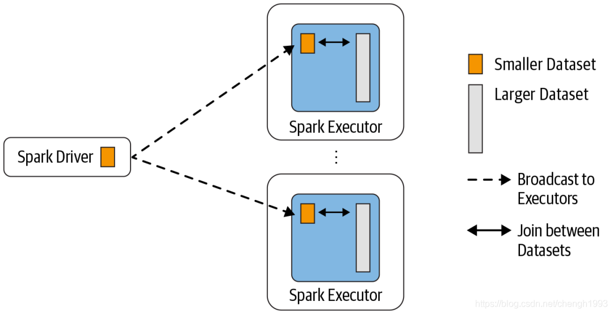

使用这种 Join 策略必须满足以下条件:

- 小表的数据必须很小，可以通过 `spark.sql.autoBroadcastJoinThreshold` 参数来配置，默认是 10MB
- 如果内存比较大，可以将阈值适当加大
- 将 `spark.sql.autoBroadcastJoinThreshold` 参数设置为 -1，可以关闭这种连接( Join )方式
- 只能用于等值 Join，不要求参与 Join 的 keys 可排序

### 1.2 Shuffle Hash Join

当表中的数据比较大，又不适合使用广播，这个时候就可以考虑使用 Shuffle Hash Join。

Shuffle Hash Join 同样是在大表和小表进行 Join 的时候选择的一种策略。
它的计算思想是: 把大表和小表按照相同的分区算法和分区数进行分区(根据参与 Join 的 keys 进行分区)，
这样就保证了 hash 值一样的数据都分发到同一个分区中，然后在同一个 Executor 中，
两张表 hash 值一样的分区就可以在本地进行 hash Join 了。在进行 Join 之前，还会对小表的分区构建 Hash Map。

*Shuffle hash join 利用了分治思想，把大问题拆解成小问题去解决。*

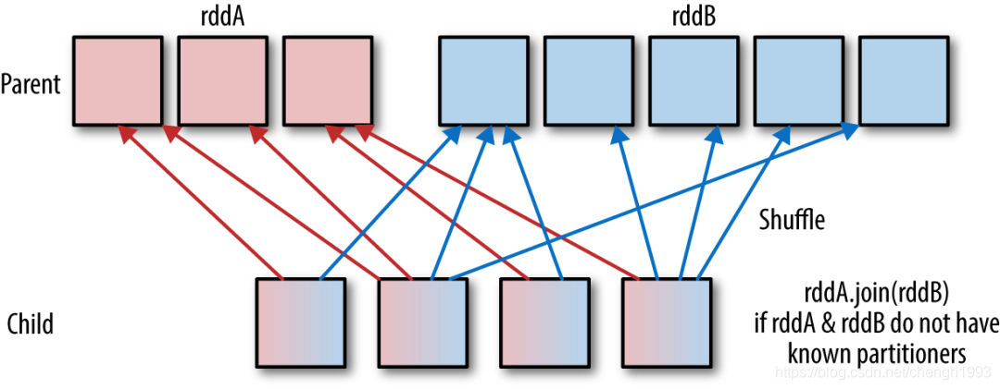

要启用 Shuffle Hash Join 必须满足以下条件:

- 仅支持等值 Join，不要求参与 Join 的 Keys 可排序 
- `spark.sql.join.preferSortMergeJoin` 参数必须设置为 false，参数是从 Spark 2.0.0 版本引入的，默认值为 true，也就是默认情况下选择 Sort Merge Join 
- 小表的大小(`plan.stats.sizeInBytes`)必须小于 `spark.sql.autoBroadcastJoinThreshold * spark.sql.shuffle.partitions(默认值 200)`
- 而且小表大小(`stats.sizeInBytes)`的三倍必须小于等于大表的大小(`stats.sizeInBytes`)，也就是 `a.stats.sizeInBytes * 3 < = b.stats.sizeInBytes`

### 1.3 Shuffle Sort Merge Join

前面两种 Join 策略对表的大小都有条件的，如果参与 Join 的表都很大，这时候就得考虑用 Shuffle Sort Merge Join 了。

Shuffle Sort Merge Join 的实现思想:

- 将两张表按照 join key 进行shuffle，保证join key值相同的记录会被分在相应的分区
- 对每个分区内的数据进行排序
- 排序后再对相应的分区内的记录进行连接

无论分区有多大，Sort Merge Join都不用把一侧的数据全部加载到内存中，而是即用即丢;因为两个序列都有序。
从头遍历，碰到key相同的就输出，如果不同，左边小就继续取左边，反之取右边。从而大大提高了大数据量下sql join的稳定性。

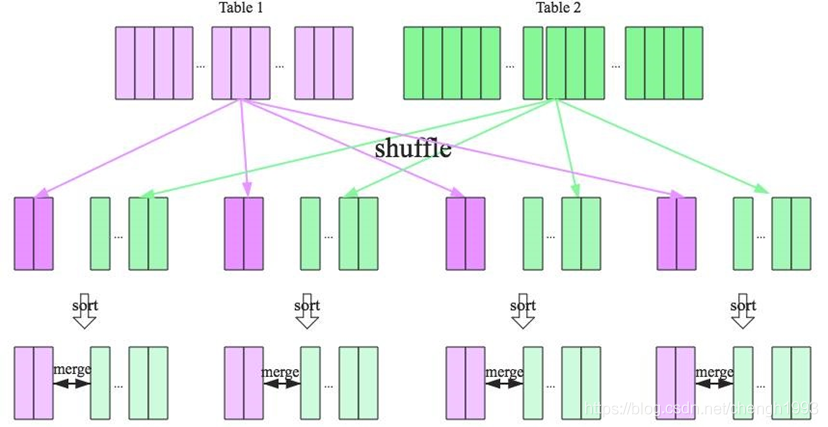

要启用 Shuffle Sort Merge Join 必须满足条件: 仅支持等值 Join，并且要求参与 Join 的 Keys 可排序

### 1.4 Cartesian product join

如果 Spark 中两张参与 Join 的表没指定连接条件，那么会产生 Cartesian product join，
这个 Join 得到的结果其实就是两张表行数的乘积。 

### 1.5 Broadcast nested loop join

可以把 Broadcast nested loop join 的执行看做下面的计算:

```scala
for record_1 in relation_1:
  for record_2 in relation_2:
    # join condition is executed
```

可以看出 Broadcast nested loop join 在某些情况会对某张表重复扫描多次，效率非常低下。
从名字可以看出，这种 join 会根据相关条件对小表进行广播，以减少表的扫描次数。

Broadcast nested loop join 支持等值和不等值 Join，支持所有的 Join 类型。

## 2. SQL解析过程

Spark SQL 可以说是 Spark 中的精华部分。原来基于 RDD 构建大数据计算任务，重心在向 DataSet 转移，
原来基于 RDD 写的代码也在迁移。使用 Spark SQL 编码好处 是非常大的，尤其是在性能方面，有很大提升。

Spark SQL 中各种内嵌的性能优化比 写 RDD 遵守各种最佳实践更靠谱的，尤其对新手来说。
如先 filter 操作再 map 操作，Spark SQL 中会自动进行谓词下推; Spark SQL中会自动使用
broadcast join 来广播小表，把 shuffle join 转化为 map join 等等。

Spark SQL对SQL语句的处理和关系型数据库类似，即词法/语法解析、绑定、优化、执行。
Spark SQL会先将SQL语句解析成一棵树，然后使用规则(Rule)对Tree进行绑定、优化等处理过程。

Spark SQL由Core、Catalyst、Hive、Hive-ThriftServer四部分构成:

- Core: 负责处理数据的输入和输出，如获取数据，查询结果输出成DataFrame等 
- Catalyst: 负责处理整个查询过程，包括解析、绑定、优化等
- Hive: 负责对Hive数据进行处理
- Hive-ThriftServer: 主要用于对Hive的访问

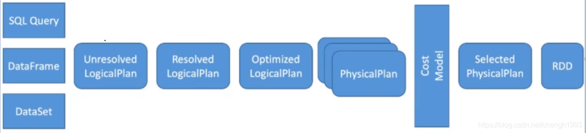

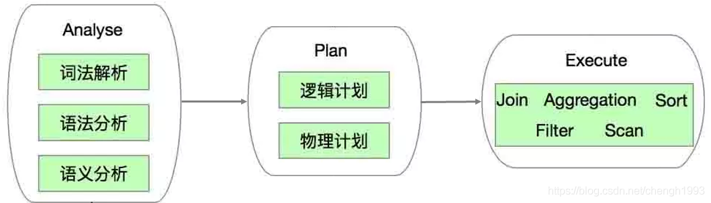

Spark SQL 的代码复杂度是问题的本质复杂度带来的，Spark SQL中的 Catalyst 框架大部分逻辑是在一个 Tree 类型的数据结构上做各种折腾，
基于 Scala 来实现还是很优雅的，Scala 的偏函数和强大的 Case 正则匹配，让整个代码看起来非常优雅。

SparkSession 是编写 Spark 应用代码的入口，启动一个 `spark-shell` 会提供给你一个创建 `SparkSession`，
这个对象是整个 `Spark` 应用的起始点。以下是 `SparkSession` 的一些重要的变量和方法:


| 类                               | 功能                                                       |
|---------------------------------|----------------------------------------------------------|
| `catalog`                       | 通过对这个类可以操作元数据，对数据库、表、函数进行增删改查，内部使用 SessionCatalog 完成具体操作 |
| `table`                         | 把一个 table 或 view 包装为一个 DataFrame 进行后续操作                  |
| `emptyDataset`/`emptyDataFrame` | 创建空的 Dataset 或 DataFrame                                 |
| `sql`                           | 执行 sql，返回一个 DataFrame                                    |
| `read` 或 `readStream`           | 获取数据读取器，读取各种格式的数据                                        |
| **`sessionState`**              | 维护了当前 session 使用的所有状态数据; 还包括 SQL 解析器、分析器、优化器等            |

测试代码如下：

```scala
object Plan {
  def main(args: Array[String]): Unit = {
    val spark = SparkSession
      .builder()
      .appName("Plan")
      .master("local[*]")
      .getOrCreate()
    spark.sparkContext.setLogLevel("warn")

    import spark.implicits._
    Seq((0, "zhansan", 10),
      (1, "lisi", 11),
      (2, "wangwu", 12)).toDF("id", "name",
      "age").createOrReplaceTempView("stu")

    Seq((0, "chinese", 80), (0, "math", 100), (0, "english", 98),
      (1, "chinese", 86), (1, "math", 97), (1, "english", 90),
      (2, "chinese", 90), (2, "math", 94), (2, "english", 88)
    ).toDF("id", "subject",
      "score").createOrReplaceTempView("score")

    val df: DataFrame = spark.sql(
      """
        |select sum(v), name
        |from (select stu.id, 100 + 10 + score.score as v, name
        |       from stu join score
        |       where stu.id = score.id and stu.age >= 11) tmp
        |group by name
        |""".stripMargin)
    df.show()

    // 打印执行计划
    println(df.queryExecution)
    println(df.queryExecution.optimizedPlan)
    spark.close()
  }
}
```

`queryExecution` 就是整个执行计划的执行引擎，里面有执行过程中各个中间过程变量，整个执行流程如下:

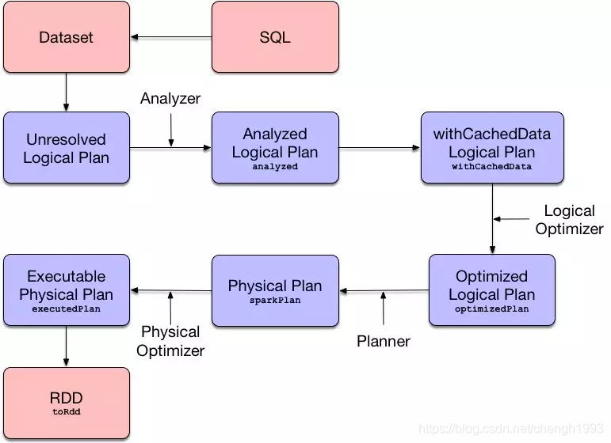

上面例子中的 SQL 语句经过 Parser 解析后就会变成一个抽象语法树，对应解析后的逻辑计划 AST 为:

```
== Parsed Logical Plan ==
'Aggregate ['name], [unresolvedalias('sum('v), None), 'name]
+- 'SubqueryAlias `tmp`
   +- 'Project ['stu.id, ((100 + 10) + 'score.score) AS v#26, 'name]
      +- 'Filter (('stu.id = 'score.id) && ('stu.age >= 11))
         +- 'Join Inner
            :- 'UnresolvedRelation `stu`
            +- 'UnresolvedRelation `score`
```

> 最下面的最新执行。

- `Aggregate ['name]` 对 `name` 做聚合；`[unresolvedalias('sum('v), None), 'name]` 没有做解析，并且使用的是 symbol 表示列名
- `'SubqueryAlias tmp` 子查询
- `Project` 执行计划中，代表投影。(有些时候也叫 `Projection`)

> 关系型数据库中三种最基本的操作：选、投、连

- 选：只选中部分*行*数据
- 连：根据 key 将数据行进行连接
- 投：只需要部分*列*的数据

> 个人感想：其实上面的执行计划中第三行就是投、第四行就是选、第五行就是连。可以这样理解吧？

**基本 AST 示意图**

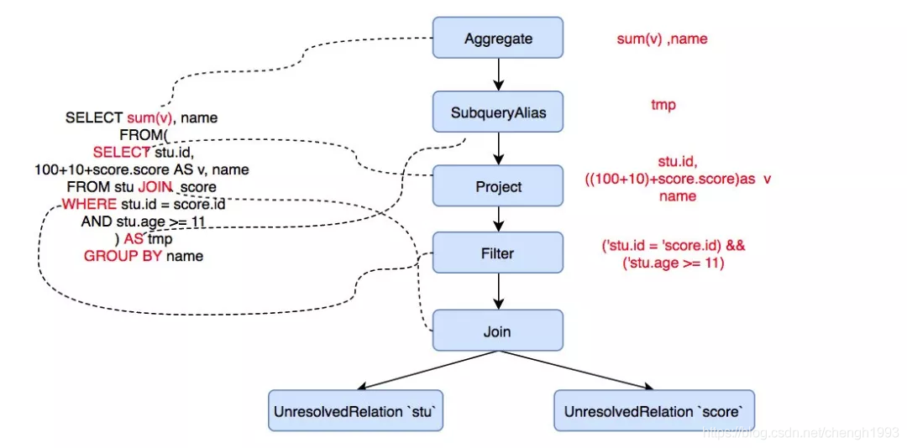

其中过滤条件变为了 Filter 节点，这个节点是 UnaryNode(一元节点) 类型，只有一个孩子。

两个表中的数据变为了 UnresolvedRelation 节点，节点类型为 LeafNode，即叶子节点，
JOIN 操作为节点，这个是一个 BinaryNode 节点，有两个孩子。

以上节点都是 LogicalPlan (逻辑执行计划)类型的，可以理解为进行各种操作的 Operator，SparkSQL 对各种操作定义了各种 Operator。

> 表格...

| name	                                                                                                        | description                                                               |
|--------------------------------------------------------------------------------------------------------------|---------------------------------------------------------------------------|
| `Project(projectList:Seq[NameExpression],child:LogicalPlan)`	                                                | Select语句输出操作，其中projectList作为输出对象，每一个都为一个Expression，可能是Star或者复杂的Expression |
| `Filter(condition:Expression,child:LogicalPlan)`                                                             | 根据condition对child输入的Rows进行过滤                                              |
| `Join(left:LogicalPlan,right:LogicalPlan, joinType:JoinType,condition[Expression])`                          | 	left 和right的输出结果进行join操作                                                 |
| `Intersect(left:LogicalPlan,right:LogicalPlan)`                                                              | 	left和right两个Plan输出的rows进行取交集运算                                           |
| `Except(left:LogicalPlan,right:LogicalPlan)`                                                                 | 	left计算结果中剔除right中的计算结果                                                   |
| `Union(children:Seq[LogicalPlan])`                                                                           | 	将一组Childs的计算结果进行Union联合                                                  |
| `Sort(order:Seq[SortORder],global:Boolean,child:LogicalPlan)`                                                | 	对child的输出进行sort排序                                                        |
| `Repartition (numPartitions:Int,shuffle:Boolean,child:LogicalPlan)`                                          | 	对child输出的数据进行重新分区操作                                                      |
| `InsertIntoTable (table:LogicalPlan,child:LogicalPlan, ……)`                                                  | 	将child输出的rows输出到talbe中                                                   |
| `Distinct (child:LogicalPlan)`                                                                               | 	对child输出的rows去重操作                                                        |
| `GlobalLimit(limitExpr:Expression,child:LogicalPlan)`	                                                       | 对child输出的数据进行limit限制                                                      |
| `Sample(child：LogicalPlan，……)`                                                                               | 	根据参数，从child输出的rows进行一定的比例取样                                              |
| `Aggerate (groupingExpressions:Seq[Expression] aggerateExpressions:Seq[NamedExpression], child:LogicalPlan)` | 	对child输出的row进行 aggregate 操作。比如 groupby                                   |

这些 `Operator` 组成的抽象语法树就是整个 `Catalyst` 优化的基础，`Catalyst` 优化器会在这个树上面进行各种折腾，把树上面的节点挪来挪去来进行优化。

--------------------------------------------------------------------------------

经过 Parser 有了抽象语法树，但是并不知道 score，sum 这些东西是啥，所以就需要 analyzer 来定位。

analyzer 会把 AST 上所有 Unresolved 的东西都转变为 resolved 状态，SparkSQL 有很多 resolve 规则:

- `ResolverRelations` 解析表(列)的基本类型等信息 
- `ResolveFunctions` 解析出来函数的基本信息 
- `ResolveReferences` 解析引用，通常是解析列名

```
== Analyzed Logical Plan ==
sum(v): bigint, name: string
Aggregate [name#8], [sum(cast(v#26 as bigint)) AS sum(v)#28L, name#8]
+- SubqueryAlias `tmp`
   +- Project [id#7, ((100 + 10) + score#22) AS v#26, name#8]
      +- Filter ((id#7 = id#20) && (age#9 >= 11))
         +- Join Inner
            :- SubqueryAlias `stu`
            :  +- Project [_1#3 AS id#7, _2#4 AS name#8, _3#5 AS age#9]
            :     +- LocalRelation [_1#3, _2#4, _3#5]
            +- SubqueryAlias `score`
               +- Project [_1#16 AS id#20, _2#17 AS subject#21, _3#18 AS score#22]
                  +- LocalRelation [_1#16, _2#17, _3#18]
```

**分析后的执行计划示意图**

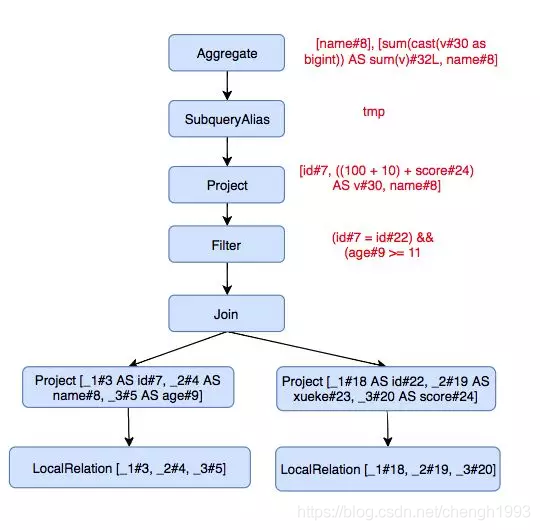

--------------------------------------------------------------------------------

下面要进行逻辑优化了，常见的逻辑优化有:

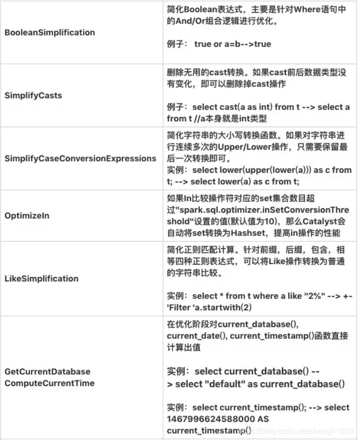

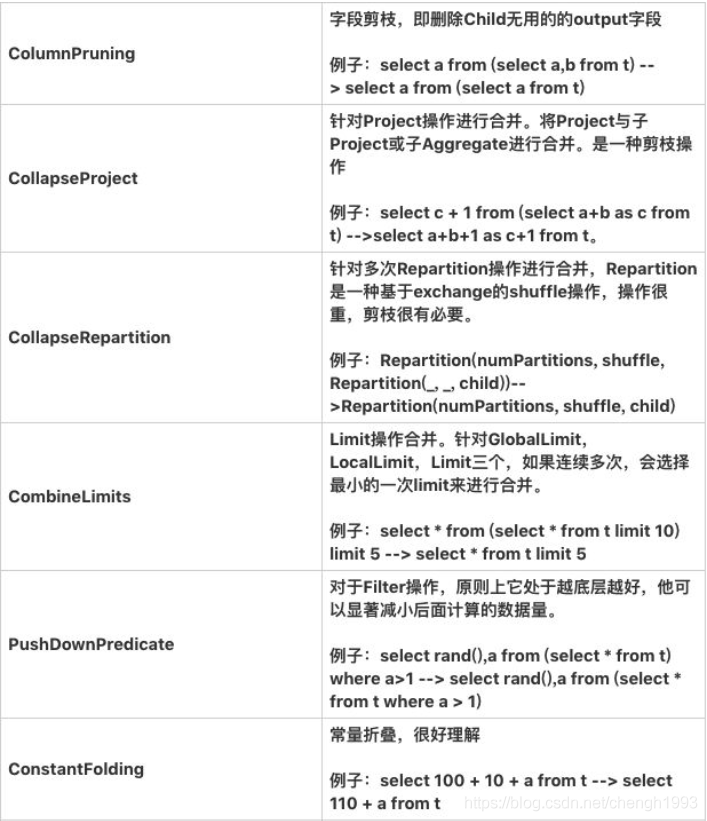

```
== Optimized Logical Plan ==
Aggregate [name#8], [sum(cast(v#26 as bigint)) AS sum(v)#28L, name#8]
+- Project [(110 + score#22) AS v#26, name#8]
   +- Join Inner, (id#7 = id#20)
      :- LocalRelation [id#7, name#8]
      +- LocalRelation [id#20, score#22]
```

这里用到的优化有: 谓词下推(Push Down Predicate)、常量折叠(Constant Folding)、字段裁剪(Columning Pruning)

> 别被这些高级的词吓住了！谓词下推举例：先 Filter 再 Join; 常量折叠举例：把 100 + 10 先计算好的 110；字段裁剪举例：扔掉最终用不到的列.

**优化后的逻辑执行计划示意图**

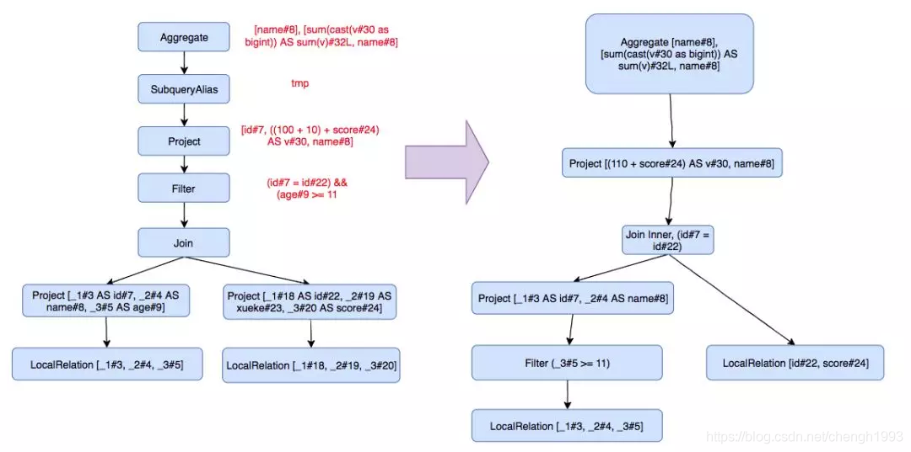

--------------------------------------------------------------------------------

做完逻辑优化，还需要先转换为物理执行计划，将逻辑上可行的执行计划变为 Spark 可以真正执行的计划:

**物理计划示意图**

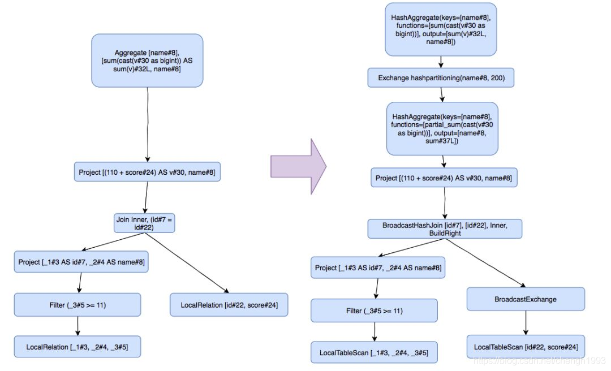

SparkSQL 把逻辑节点转换为了相应的物理节点， 比如 Join 算子，Spark 根据不同场景为该算子制定了不同的算法策略。

```
== Physical Plan ==
*(2) HashAggregate(keys=[name#8], functions=[sum(cast(v#26 as bigint))], output=[sum(v)#28L, name#8])
+- Exchange hashpartitioning(name#8, 200)
   +- *(1) HashAggregate(keys=[name#8], functions=[partial_sum(cast(v#26 as bigint))], output=[name#8, sum#38L])
      +- *(1) Project [(110 + score#22) AS v#26, name#8]
         +- *(1) BroadcastHashJoin [id#7], [id#20], Inner, BuildLeft
            :- BroadcastExchange HashedRelationBroadcastMode(List(cast(input[0, int, false] as bigint)))
            :  +- LocalTableScan [id#7, name#8]
            +- LocalTableScan [id#20, score#22]
```

数据在一个一个的 plan 中流转，然后每个 plan 里面表达式都会对数据进行处理，就相当于经过了一个个小函数的调用处理，
这里面有大量的函数调用开销。

是不是可以把这些小函数内联一下，当成一个大函数，WholeStageCodegen 就是干这事的。

可以看到最终执行计划每个节点前面有个 * 号，说明整段代码生成被启用，
Project、BroadcastHashJoin、HashAggregate 这一段都启用了整段代码生成，级联为一个大函数。
