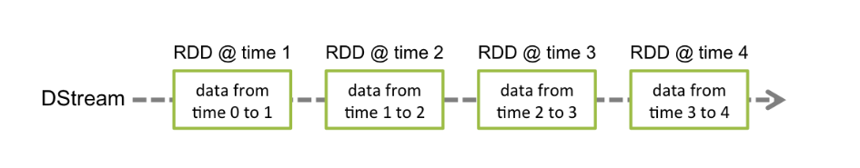

# Spark Streaming

随着大数据技术的不断发展，人们对于大数据的实时性处理要求也在不断提高，传统的 MapReduce 等批处理框架在某些特定领域，
例如实时用户推荐、用户行为分析这些应用场景上逐渐不能满足人们对实时性的需求，因此诞生了一批如 S3、Samza、Storm、Flink 等流式分析、实时计算框架。

Spark 由于其内部优秀的调度机制、快速的分布式计算能力，能够以极快的速度进行迭代计算。
正是由于具有这样的优势，Spark 能够在某些程度上进行实时处理，Spark Streaming 正是构建在此之上的流式框架。

## 1. Spark Streaming概述


### 1.1 什么是 Spark Streaming

Spark Streaming 类似于 Apache Storm(来一条数据处理一条，延迟低，响应快，吞吐量小)，用于流式数据的处理;

Spark Streaming 具有吞吐量大和容错能力强等特点;

Spark Streaming 支持的数据输入源很多，例如: Kafka(最重要的数据源)、 Flume、Twitter 和 TCP 套接字等;

数据输入后可用高度抽象的 API，如: `map`、`reduce`、`join`、`window` 等进行运算; 处理结果能保存在很多地方，如 HDFS、数据库等;

Spark Streaming 能与 MLlib 以及 Graphx 融合。


Spark Streaming 与 Spark 基于 RDD 的概念比较类似;

**Spark Streaming 使用离散化流(Discretized Stream)作为抽象表示，称为 DStream。**

DStream 是随时间推移而收到的数据的序列。在内部，每个时间区间收到的数据都作为 RDD 存在，DStream 是由这些 RDD 所组成的序列。


DStream 可以从各种输入源创建，比如 Flume、Kafka 或者 HDFS。

创建出来的 DStream 支持两种操作:

- 转化操作：会生成一个新的DStream 
- 输出操作(output operation)：把数据写入外部系统中

DStream 提供了许多与 RDD 所支持的操作相类似的操作支持，还增加了与时间相关的新操作，比如滑动窗口。

### 1.2 Spark Streaming 架构

Spark Streaming 使用 **mini-batch** 的架构，**把流式计算当作一系列连续的小规模批处理来对待。**

Spark Streaming 从各种输入源中读取数据，并把数据分组为小的批次。新的批次按均匀的时间间隔创建出来。

在每个时间区间开始的时候，一个新的批次就创建出来，在该区间内收到的数据都会被添加到这个批次中。在时间区间结束时，批次停止增长。

时间区间的大小是由批次间隔这个参数决定的。批次间隔一般设在 500 毫秒到几秒之间，由开发者配置。

每个输入批次都形成一个 RDD，以 Spark 作业的方式处理并生成其他的 RDD。 处理的结果可以以批处理的方式传给外部系统。


Spark Streaming 的编程抽象是离散化流，也就是DStream。它是一个 RDD 序列， 每个 RDD 代表数据流中一个时间片内的数据。



应用于 DStream 上的转换操作都会转换为底层 RDD 上的操作。如对行 DStream 中的每个 RDD 应用 `flatMap` 操作以生成单词 DStream 的 RDD。


这些底层的 RDD 转换是由 Spark 引擎完成的。DStream 操作隐藏了大部分这些细节，为开发人员提供了更高级别的 API 以方便使用。

--------------------------------------------------------------------------------

Spark Streaming 为每个输入源启动对应的接收器。接收器运行在 Executor 中，从输入源收集数据并保存为 RDD。

默认情况下接收到数据后会复制到另一个 Executor 中，进行容错;

Driver 中的 `StreamingContext` 会周期性地运行 Spark 作业来处理这些数据。


**SparkStreaming运行流程:**

1. 客户端提交 Spark Streaming 作业后启动 Driver，Driver 启动 Receiver，Receiver 接收数据源的数据
2. 每个作业包含多个 Executor，每个 Executor 以线程的方式运行 task，Spark Streaming 至少包含一个 receiver task(一般情况下)
3. Receiver 接收数据后生成 Block，并把 BlockId 汇报给 Driver，然后备份到另外一个 Executor 上
4. ReceiverTracker 维护 Receiver 汇报的 BlockId
5. Driver 定时启动 JobGenerator，根据 DStream 的关系生成逻辑 RDD，然后创建 JobSet，交给 JobScheduler
6. JobScheduler 负责调度 JobSet，交给 DAGScheduler，DAGScheduler 根据逻辑 RDD，生成相应的Stages，每个 stage 包含一到多个 Task，将 TaskSet 提交给 TaskSchedule
7. TaskScheduler 负责把 Task 调度到 Executor 上，并维护 Task 的运行状态

### 1.3 Spark Streaming 优缺点

与传统流式框架相比，Spark Streaming 最大的不同点在于它对待数据是粗粒度的处理方式，即一次处理一小批数据，
而其他框架往往采用细粒度的处理模式，即依次处理一条数据。

Spark Streaming 这样的设计实现既为其带来了显而易见的优点，又引入了不可避免的缺点。

#### 优点

- Spark Streaming 内部的实现和调度方式高度依赖 Spark 的 DAG 调度器和 RDD，这就决定了 Spark Streaming 的设计初衷必须是粗粒度方式的。同时，由于 Spark 内部调度器足够快速和高效，可以快速地处理小批量数据，这就获得准实时的特性
- Spark Streaming 的粗粒度执行方式使其确保「处理且仅处理一次」的特性 (EOS)，同时也可以更方便地实现容错恢复机制
- 由于 Spark Streaming 的 DStream 本质是 RDD 在流式数据上的抽象，因此基于 RDD 的各种操作也有相应的基于 DStream 的版本，这样就大大降低了用户对于新框架的学习成本，在了解 Spark 的情况下用户将很容易使用 Spark Streaming
- 由于 DStream 是在 RDD 上的抽象，那么也就更容易与 RDD 进行交互操作，在需要将流式数据和批处理数据结合进行分析的情况下，将会变得非常方便

#### 缺点

Spark Streaming 的粗粒度处理方式也造成了不可避免的延迟。在细粒度处理方式下，理想情况下每一条记录都会被实时处理，
而在 Spark Streaming 中，数据需要汇总到一定的量后再一次性处理，这就增加了数据处理的延迟，这种延迟是由框架的设计引入的，并不是由网络或其他情况造成的。

### 1.4 Structured Streaming

Spark Streaming 计算逻辑是把数据按时间划分为 DStream，存在以下问题:

- 框架自身只能根据 Batch Time 单元进行数据处理，很难处理基于 event time(即时间戳)的数据，很难处理延迟，乱序的数据
- 流式和批量处理的 API 不完全一致，两种使用场景中，程序代码还是需要一定的转换
- 端到端的数据容错保障逻辑需要用户自己构建，难以处理增量更新和持久化存储等一致性问题

基于以上问题，提出了下一代 Structure Streaming。将数据源映射为一张无界长度的表，通过表的计算，输出结果映射为另一张表。

以结构化的方式去操作流式数据，简化了实时计算过程，同时还复用了 Catalyst 引擎来优化 SQL 操作。此外还能支持增量计算和基于 event time 的计算。

## 2. DStream 基础数据源

基础数据源包括:文件数据流、socket数据流、RDD队列流; 这些数据源主要用于测试。


引入依赖：

```xml
<dependency>
  <groupId>org.apache.spark</groupId>
  <artifactId>spark-streaming_2.12</artifactId>
  <version>${spark.version}</version>
</dependency>
```

### 2.1 文件数据流

通过 `textFileStream(directory)` 方法进行读取 HDFS 兼容的文件系统文件

Spark Streaming 将会监控 directory 目录，并不断处理移动进来的文件

- 不支持嵌套目录
- 文件需要有相同的数据格式
- 文件进入 directory 的方式需要通过移动或者重命名来实现
- 一旦文件移动进目录，则不能再修改，即便修改了也不会读取新数据
- 文件流不需要接收器(receiver)，不需要单独分配CPU核

```scala
import org.apache.log4j.{Level, Logger}
import org.apache.spark.SparkConf
import org.apache.spark.streaming.{Seconds, StreamingContext}
 
object FileDStream {
  def main(args: Array[String]): Unit = {
    Logger.getLogger("org").setLevel(Level.ERROR)
    val conf = new SparkConf()
      .setAppName(this.getClass.getCanonicalName)
      .setMaster("local[*]")
    // 创建StreamingContext
    // StreamingContext是所有流功能函数的主要访问点，这里使用多个执行线程和 2 秒的批次间隔来创建本地的StreamingContext
    // 时间间隔为2秒,即2秒一个批次
    val ssc = new StreamingContext(conf, Seconds(5))
    // 这里采用本地文件，也可以采用HDFS文件
    val lines = ssc.textFileStream("data/log/")
    val words = lines.flatMap(_.split("\\s+"))
    val wordCounts = words.map(x => (x, 1)).reduceByKey(_ + _)
    // 打印单位时间所获得的计数值
    wordCounts.print()
    ssc.start()
    ssc.awaitTermination()
  }
}
```

### 2.2 Socket数据流

Spark Streaming 可以通过 Socket 端口监听并接收数据，然后进行相应处理;

新开一个命令窗口，启动 nc 程序:

```shell
nc -lk 9999
# yum install nc
```

随后可以在 nc 窗口中随意输入一些单词，监听窗口会自动获得单词数据流信息，在监听窗口每隔 x 秒就会打印出词频统计信息，可以在屏幕上出现结果。

> 备注:使用 `local[*]`，可能存在问题。 
>
> 如果给虚拟机配置的cpu数为1，使用 `local[*]` 也只会启动一个线程，该线程用于 receiver task，此时没有资源处理接收达到的数据。
>【现象:程序正常执行，不会打印时间戳，屏幕上也不会有其他有效信息】


### 2.3 RDD队列流


## 3. DStream转换操作


## 4. DStream输出操作


## 5. 与Kafka整合
