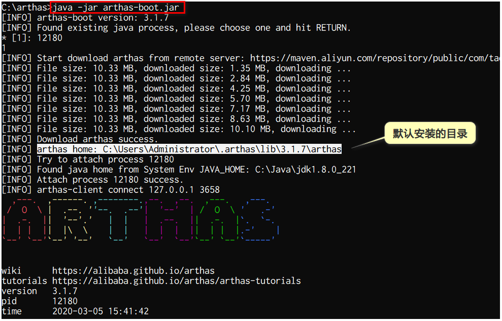
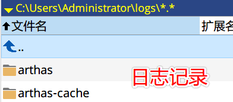
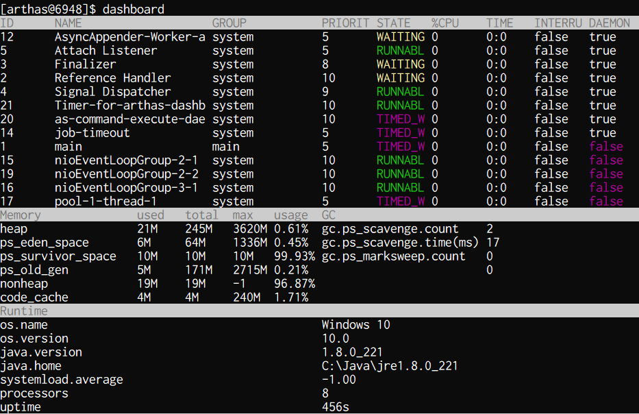
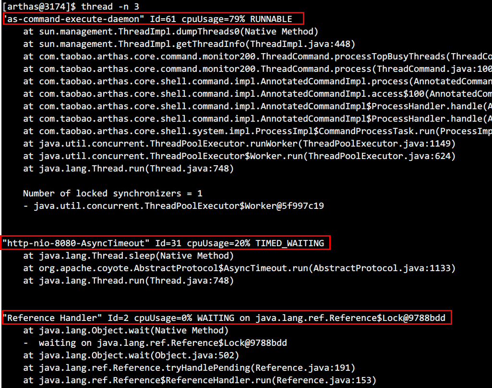
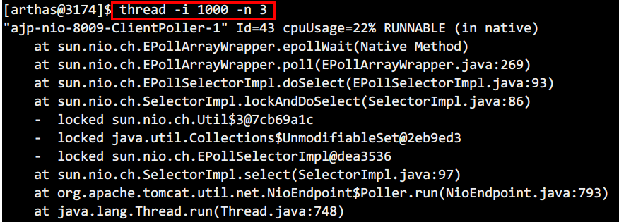
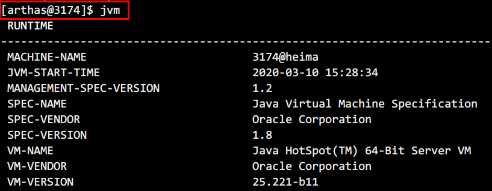
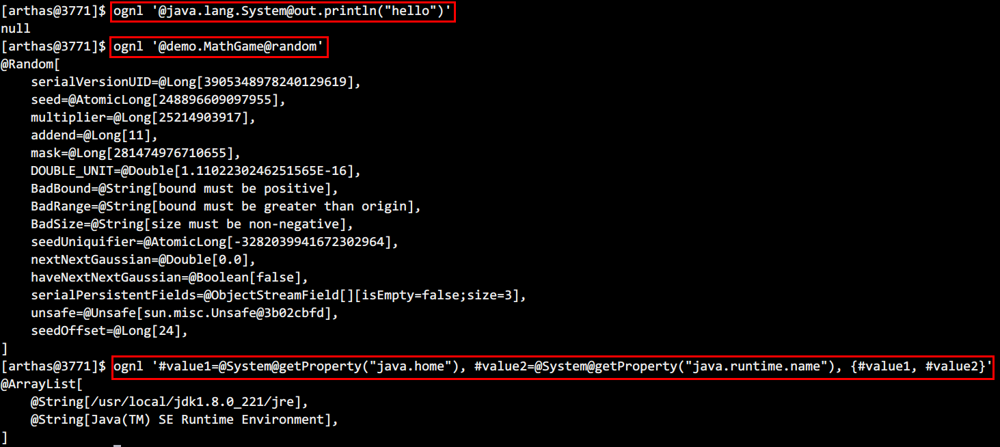

# Arthas基础篇

## 概述

### Arthas(阿尔萨斯)能为你做什么？


`Arthas` 是Alibaba开源的Java诊断工具，深受开发者喜爱。

当你遇到以下类似问题而束手无策时，`Arthas`可以帮助你解决：

1. 这个类从哪个 jar 包加载的？为什么会报各种类相关的 Exception？
2. 我改的代码为什么没有执行到？难道是我没 commit？分支搞错了？
3. 遇到问题无法在线上 debug，难道只能通过加日志再重新发布吗？
4. 线上遇到某个用户的数据处理有问题，但线上同样无法 debug，线下无法重现！
5. 是否有一个全局视角来查看系统的运行状况？
6. 有什么办法可以监控到JVM的实时运行状态？
7. 怎么快速定位应用的热点，生成火焰图？

### 运行环境要求

`Arthas` 支持JDK 6+，支持Linux/Mac/Windows，采用命令行交互模式，同时提供丰富的 `Tab` 自动补全功能，进一步方便进行问题的定位和诊断。

## 快速安装

下载 `arthas-boot.jar`，然后用`java -jar`的方式启动：

### 命令

```shell
curl -O https://alibaba.github.io/arthas/arthas-boot.jar
java -jar arthas-boot.jar
```

> 注：在运行第2条命令之前，先运行一个java进程在内存中，不然会出现找不到java进程的错误。

打印帮助信息

```shell
java -jar arthas-boot.jar -h
```

如果下载速度比较慢，可以使用aliyun的镜像：

```shell
java -jar arthas-boot.jar --repo-mirror aliyun --use-http
```

### Windows下安装

1. 在 `c:\` 下创建目录 `arthas`，在windows命令窗口下，使用curl命令下载阿里服务器上的jar包，大小108k

   

2. 使用java启动 `arthas-boot.jar`，来安装arthas，大小约10M。运行此命令会发现java进程，输入1按回车。
   则自动从远程主机上下载arthas到本地目录.

   

3. 查看安装好的目录

   ```shell
   C:\Users\Administrator\.arthas\lib\3.1.7\arthas\
   ```

    

**小结**

1. 下载 `arthas-boot.jar` 包
2. 执行 `arthas-boo.jar` 包，前提是必须要有java进程在运行。
   第一次执行这个jar包，会自动从服务器上下载arthas，大小是11M

### 从Maven仓库下载全量包

如果下载速度比较慢，可以尝试用阿里云的镜像仓库: <https://maven.aliyun.com/>

#### 步骤

1. 比如要下载 `3.1.7` 版本，下载的url是：

<https://maven.aliyun.com/repository/public/com/taobao/arthas/arthas-packaging/3.1.7/arthas-packaging-3.1.7-bin.zip>


2. 解压后，在文件夹里有 `arthas-boot.jar`，直接用 `java -jar` 的方式启动：

```shell
java -jar arthas-boot.jar
```

> 注：如果是Linux，可以使用以下命令解压到指定的 `arthas` 目录

```shell
unzip -d arthas arthas-packaging-3.1.7-bin.zip
```

 

**小结**

1. 在Linux下在线安装的方式与在Windows下的安装相同
2. 如果要使用离线的安装方式，先下载完成的zip到本地，再解压到任意的目录即可

### 卸载

#### 在 Linux/Unix/Mac 平台

删除下面文件：

```shell
rm -rf ~/.arthas/
rm -rf ~/logs/arthas
```

#### Windows平台

直接删除user home下面的 `.arthas` 和 `logs/arthas` 目录

1. 安装主目录

   

2. 日志记录目录

   

**小结**

因为jar包是绿色，要卸载的话，直接删除2个目录

```text
.arthas安装目录
logs的日志记录目录
```

## 快速入门：attach一个进程

目标：通过案例快速入门

1. 执行一个jar包
2. 通过 `arthas` 来attach粘附

步骤: 

1. 准备代码

以下是一个简单的Java程序，每隔一秒生成一个随机数，再执行质因数分解，并打印出分解结果。
代码的内容不用理会这不是现在关注的点。

```java
package demo;

import java.util.ArrayList;
import java.util.List;
import java.util.Random;
import java.util.concurrent.TimeUnit;

public class MathGame {
    private static Random random = new Random();
		
    //用于统计生成的不合法变量的个数
    public int illegalArgumentCount = 0;

    public static void main(String[] args) throws InterruptedException {
        MathGame game = new MathGame();
        //死循环，每过1秒调用1次下面的方法(不是开启一个线程)
        while (true) {
            game.run();
            TimeUnit.SECONDS.sleep(1);
        }
    }

    //分解质因数
    public void run() throws InterruptedException {
        try {
            //随机生成一个整数，有可能正，有可能负
            int number = random.nextInt()/10000;
            //调用方法进行质因数分解
            List<Integer> primeFactors = primeFactors(number);
            //打印结果
            print(number, primeFactors);
        } catch (Exception e) {
            System.out.println(String.format("illegalArgumentCount:%3d, ", illegalArgumentCount) + e.getMessage());
        }
    }
    
    //打印质因数分解的结果
    public static void print(int number, List<Integer> primeFactors) {
        StringBuffer sb = new StringBuffer(number + "=");
        for (int factor : primeFactors) {
            sb.append(factor).append('*');
        }
        if (sb.charAt(sb.length() - 1) == '*') {
            sb.deleteCharAt(sb.length() - 1);
        }
        System.out.println(sb);
    }

    //计算number的质因数分解
    public List<Integer> primeFactors(int number) {
        //如果小于2，则抛出异常，并且计数加1
        if (number < 2) {
            illegalArgumentCount++;
            throw new IllegalArgumentException("number is: " + number + ", need >= 2");
        }
			 //用于保存每个质数
        List<Integer> result = new ArrayList<Integer>();
        //分解过程，从2开始看能不能整除
        int i = 2;
        while (i <= number) {  //如果i大于number就退出循环
            //能整除，则i为一个因数，number为整除的结果再继续从2开始除
            if (number % i == 0) {
                result.add(i);
                number = number / i;
                i = 2;
            } else {
                i++;  //否则i++
            }
        }

        return result;
    }
}
```

2. 启动Demo

命令

```shell
# 下载已经打包好的arthas-demo.jar
curl -O https://alibaba.github.io/arthas/arthas-demo.jar

在命令行下执行
java -jar arthas-demo.jar
```

效果

  

3. 启动arthas

因为 `arthas-demo.jar` 进程打开了一个窗口，所以另开一个命令窗口执行 `arthas-boot.jar`

选择要粘附的进程：`arthas-demo.jar`

 

如果粘附成功，在 `arthas-demo.jar` 那个窗口中会出现日志记录的信息，记录在 `c:\Users\Administrator\logs` 目录下


如果端口号被占用，也可以通过以下命令换成另一个端口号执行

```shell
java -jar arthas-boot.jar --telnet-port 9998 --http-port -1
```

4. 通过浏览器连接arthas

Arthas目前支持Web Console，用户在 `attach` 成功之后，可以直接访问：<http://127.0.0.1:3658/>。

可以填入IP，远程连接其它机器上的arthas。


默认情况下，arthas只 listen 127.0.0.1，所以如果想从远程连接，则可以使用 `--target-ip`参数指定listen的IP

**小结**

1. 启动被诊断进程
2. 启动 `arthas-boot.jar`，粘贴上面的进程
3. 不但可以通过命令行的方式来操作arthas也可以通过浏览器来访问arthas

## 快速入门：常用命令接触

**目标**

1. dashboard仪表板
2. 通过thread命令来获取到 `arthas-demo` 进程的 `Main Class`
3. 通过 `jad` 来反编译 `Main Class`
4. watch

### 1. dashboard仪表板

输入dashboard(仪表板)，按`回车/enter`，会展示当前进程的信息，按`ctrl+c`可以中断执行。

注：输入前面部分字母，按tab可以自动补全命令

1. 第一部分是显示JVM中运行的所有线程：所在线程组，优先级，线程的状态，CPU的占用率，是否是后台进程等
2. 第二部分显示的JVM内存的使用情况
3. 第三部分是操作系统的一些信息和Java版本号



### 2. 通过thread命令来获取到`arthas-demo`进程的Main Class

获取到arthas-demo进程的Main Class

`thread 1`会打印线程ID 1的栈，通常是main函数的线程。


### 3. 通过jad来反编译Main Class

```shell
jad demo.MathGame
```

 

### 4. watch监视

通过watch命令来查看`demo.MathGame#primeFactors`函数的返回值：

```shell
$ watch demo.MathGame primeFactors returnObj
```


### 5. 退出arthas

如果只是退出当前的连接，可以用`quit`或者`exit`命令。Attach到目标进程上的arthas还会继续运行，端口会保持开放，下次连接时可以直接连接上。

如果想完全退出arthas，可以执行`stop`命令。

**小结**

1. 如何启动arthas?

```shell
java -jar arthas-boot.jar
```

2. 说说以下命令的作用

| 命令                    | 功能                   |
|-----------------------|----------------------|
| `dashboard`           | 显示JVM中内存的情况，JVM中环境信息 |
| `thread`              | 显示当前进程所有线程信息         |
| `jad`                 | 反编译指定的类或方法           |
| `watch`               | 监视某个方法的执行情况，监视了返回值   |
| `quit`，`exit`, `stop` | 退出或停止arthas          |

## 基础命令之一

目标:

1. help
2. cat
3. grep
4. pwd
5. cls

### help

作用: 查看命令帮助信息

效果: 


### cat

作用: 打印文件内容，和linux里的cat命令类似

> 如果没有写路径，则显示当前目录下的文件

效果: 


### grep

作用: 匹配查找，和linux里的grep命令类似，但它只能用于管道命令

#### 语法

| 参数列表         | 作用                 |
|--------------|--------------------|
| `-n`         | 显示行号               |
| `-i`         | 忽略大小写查找            |
| `-m 行数`      | 最大显示行数，要与查询字符串一起使用 |
| `-e "正则表达式"` | 使用正则表达式查找          |

#### 举例

```shell
# 只显示包含java字符串的行系统属性
sysprop | grep java
```

 

```shell
# 显示包含java字符串的行和行号的系统属性
sysprop | grep java -n
```

 

```shell
# 显示包含system字符串的10行信息
thread | grep system -m 10
```


```shell
# 使用正则表达式，显示包含2个o字符的线程信息
thread | grep -e "o+"
```


### pwd

作用: 返回当前的工作目录，和linux命令类似

> pwd: Print Work Directory 打印当前工作目录

效果:


### cls

作用: 清空当前屏幕区域

### 小结

| 基础命令 | 作用 |
| -------- | ---- |
|          |      |
|          |      |
|          |      |
|          |      |
|          |      |

## 基础命令之二

目标:

1. session
2. reset
3. version
4. quit
5. stop
6. keymap

### session

作用: 查看当前会话的信息

效果:


### reset

作用: 重置增强类，将被 Arthas 增强过的类全部还原，Arthas 服务端关闭时会重置所有增强过的类

#### 语法

```shell
# 还原指定类
reset Test

# 还原所有以List结尾的类
reset *List

# 还原所有的类
reset
```

效果:

 

### version

作用: 输出当前目标 Java 进程所加载的 Arthas 版本号

效果: 


### history

作用: 打印命令历史

效果: 


### quit

作用: 退出当前 Arthas 客户端，其他 Arthas 客户端不受影响

### stop

作用: 关闭 Arthas 服务端，所有 Arthas 客户端全部退出

效果: 


### keymap

作用: Arthas 快捷键列表及自定义快捷键

效果: 

 

#### Arthas 命令行快捷键

| 快捷键说明              | 命令说明             |
|--------------------|------------------|
| `ctrl + a`         | 跳到行首             |
| `ctrl + e`         | 跳到行尾             |
| `ctrl + f`         | 向前移动一个单词         |
| `ctrl + b`         | 向后移动一个单词         |
| `键盘左方向键`           | 光标向前移动一个字符       |
| `键盘右方向键`           | 光标向后移动一个字符       |
| `键盘下方向键`           | 下翻显示下一个命令        |
| `键盘上方向键`           | 上翻显示上一个命令        |
| `ctrl + h`         | 向后删除一个字符         |
| `ctrl + shift + /` | 向后删除一个字符         |
| `ctrl + u`         | 撤销上一个命令，相当于清空当前行 |
| `ctrl + d`         | 删除当前光标所在字符       |
| `ctrl + k`         | 删除当前光标到行尾的所有字符   |
| `ctrl + i`         | 自动补全，相当于敲`TAB`   |
| `ctrl + j`         | 结束当前行，相当于敲回车     |
| `ctrl + m`         | 结束当前行，相当于敲回车     |

- 任何时候 `tab` 键，会根据当前的输入给出提示
- 命令后敲 `-` 或 `--` ，然后按 `tab` 键，可以展示出此命令具体的选项

### 后台异步命令相关快捷键

- `ctrl + c`: 终止当前命令
- `ctrl + z`: 挂起当前命令，后续可以 bg/fg 重新支持此命令，或 kill 掉
- `ctrl + a`: 回到行首
- `ctrl + e`: 回到行尾

**小结**

| 命令        | 说明                       |
|-----------|--------------------------|
| `session` | 显示当前会话的信息：进程的ID，会话ID     |
| `reset`   | 重置类的增强，服务器关闭的时候会自动重置所有的类 |
| `version` | 显示arthas版本号              |
| `quit`    | 退出当前会话，不会影响其它的会话         |
| `stop`    | 退出arthas服务器，所有的会话都停止     |
| `keymap`  | 获取快捷键                    |

## jvm相关命令之一

目标:

1. dashboard 仪表板
2. thread 线程相关
3. jvm 虚拟机相关
4. sysprop 系统属性相关

### dashboard

作用: 显示当前系统的实时数据面板，按 `q` 或 `ctrl+c` 退出

效果:


#### 数据说明

- ID: Java级别的线程ID，注意这个ID不能跟jstack中的nativeID一一对应
- NAME: 线程名
- GROUP: 线程组名
- PRIORITY: 线程优先级, 1~10之间的数字，越大表示优先级越高
- STATE: 线程的状态
- CPU%: 线程消耗的cpu占比，采样100ms，将所有线程在这100ms内的cpu使用量求和，再算出每个线程的cpu使用占比。
- TIME: 线程运行总时间，数据格式为`分：秒`
- INTERRUPTED: 线程当前的中断位状态
- DAEMON: 是否是daemon线程

### thread线程相关

作用: 查看当前 JVM 的线程堆栈信息

参数说明:

| 参数名称           | 参数说明                 |
|----------------|----------------------|
| `数字`           | 线程id                 |
| `[n:]`         | 指定最忙的前N个线程并打印堆栈      |
| `[b]`          | 找出当前阻塞其他线程的线程        |
| `[i \<value>]` | 指定cpu占比统计的采样间隔，单位为毫秒 |

举例:

```shell
# 展示当前最忙的前3个线程并打印堆栈
thread -n 3
```



```shell
# 当没有参数时，显示所有线程的信息
thread
```

```shell
# 显示1号线程的运行堆栈
thread 1
```


```
找出当前阻塞其他线程的线程，有时候我们发现应用卡住了， 通常是由于某个线程拿住了某个锁， 并且其他线程都在等待这把锁造成的。 为了排查这类问题， arthas提供了thread -b， 一键找出那个罪魁祸首。
thread -b
```


```shell
# 指定采样时间间隔，每过1000毫秒采样，显示最占时间的3个线程
thread -i 1000 -n 3
```



```shell
# 查看处于等待状态的线程
thread --state WAITING
```


### jvm

作用: 查看当前 JVM 的信息

效果:



#### THREAD相关

- COUNT: JVM当前活跃的线程数
- DAEMON-COUNT: JVM当前活跃的守护线程数
- PEAK-COUNT: 从JVM启动开始曾经活着的最大线程数
- STARTED-COUNT: 从JVM启动开始总共启动过的线程次数
- DEADLOCK-COUNT: JVM当前死锁的线程数

#### 文件描述符相关

- `MAX-FILE-DESCRIPTOR-COUNT`：JVM进程最大可以打开的文件描述符数
- `OPEN-FILE-DESCRIPTOR-COUNT`：JVM当前打开的文件描述符数

### sysprop

作用: 查看和修改JVM的系统属性

举例:

```shell
# 查看所有属性
sysprop

# 查看单个属性，支持通过tab补全
sysprop java.version
```


```shell
# 修改单个属性
sysprop user.country
user.country=US

sysprop user.country CN
Successfully changed the system property.
user.country=CN
```


**小结**

| jvm相关命令     | 说明                 |
|-------------|--------------------|
| `dashboard` | 显示线程，内存，GC，系统环境等信息 |
| `thread`    | 显示线程信息             |
| `jvm`       | 与JVM相关的信息          |
| `sysprop`   | 显示系统属性信息，也可以修改某个属性 |


## jvm相关命令之二

目标:

1. `sysenv`
2. `vmoption`
3. `getstatic`
4. `ognl`

### sysenv

作用: 查看当前JVM的环境属性(`System Environment Variables`)

举例

```shell
# 查看所有环境变量
sysenv

# 查看单个环境变量
sysenv USER
```

效果:


### vmoption

作用: 查看，更新VM诊断相关的参数

举例:

```shell
# 查看所有的选项
vmoption

# 查看指定的选项
vmoption PrintGCDetails
```


```shell
# 更新指定的选项
vmoption PrintGCDetails true
```

 

### getstatic

作用: 通过 `getstatic` 命令可以方便的查看类的静态属性

语法: 

```shell
getstatic 类名 属性名
```

举例

```shell
# 显示demo.MathGame类中静态属性random
getstatic demo.MathGame random
```

  

### ognl

作用: 执行ognl表达式，这是从3.0.5版本新增的功能

> OGNL语法: <http://commons.apache.org/proper/commons-ognl/language-guide.html>


#### 参数说明

| 参数名称      | 参数说明                                                |
|-----------|-----------------------------------------------------|
| `express` | 执行的表达式                                              |
| `[c:]`    | 执行表达式的 ClassLoader 的 hashcode，默认值是SystemClassLoader |
| `[x]`     | 结果对象的展开层次，默认值1                                      |

举例

```shell
# 调用静态函数
ognl '@java.lang.System@out.println("hello")'

# 获取静态类的静态字段
ognl '@demo.MathGame@random'

# 执行多行表达式，赋值给临时变量，返回一个List
ognl '#value1=@System@getProperty("java.home"), #value2=@System@getProperty("java.runtime.name"), {#value1, #value2}'
```

效果:



**小结**

| jvm相关命令     | 说明            |
|-------------|---------------|
| `sysenv`    | 查看JVM环境变量的值   |
| `vmoption`  | 查看JVM中选项，可以修改 |
| `getstatic` | 获取静态成员变量      |
| `ognl`      | 执行一个ognl表达式   |

## class/classloader相关命令之一

目标:

1. sc: Search Class
2. sm: Search Method

### sc

作用: 查看JVM已加载的类信息. 

“Search-Class” 的简写，这个命令能搜索出所有已经加载到 JVM 中的 Class 信息。

sc 默认开启了子类匹配功能，也就是说所有当前类的子类也会被搜索出来，想要精确的匹配，
请打开 `options disable-sub-class true` 开关

#### 参数说明

| 参数名称             | 参数说明                                                                                                             |
|------------------|------------------------------------------------------------------------------------------------------------------|
| `class-pattern`  | 类名表达式匹配，支持全限定名，如 `com.taobao.test.AAA`，也支持 `com/taobao/test/AAA` 这样的格式，这样，我们从异常堆栈里面把类名拷贝过来的时候，不需要在手动把`/`替换为`.`啦。 |
| `method-pattern` | 方法名表达式匹配                                                                                                         |
| `[d]`            | 输出当前类的详细信息，包括这个类所加载的原始文件来源、类的声明、加载的ClassLoader等详细信息。 如果一个类被多个ClassLoader所加载，则会出现多次                               |
| `[E]`            | 开启正则表达式匹配，默认为通配符匹配                                                                                               |
| `[f]`            | 输出当前类的成员变量信息（需要配合参数-d一起使用）                                                                                       |

举例：

```shell
# 模糊搜索，demo包下所有的类
sc demo.*

# 打印类的详细信息
sc -d demo.MathGame
```

 

```shell
# 打印出类的Field信息
sc -df demo.MathGame
```

 

### sm

作用: 查看已加载类的方法信息

“Search-Method” 的简写，这个命令能搜索出所有已经加载了 Class 信息的方法信息。

`sm` 命令只能看到由当前类所声明 (declaring) 的方法，父类则无法看到。

#### 参数说明

| 参数名称             | 参数说明               |
|------------------|--------------------|
| `class-pattern`  | 类名表达式匹配            |
| `method-pattern` | 方法名表达式匹配           |
| `[d]`            | 展示每个方法的详细信息        |
| `[E]`            | 开启正则表达式匹配，默认为通配符匹配 |

#### 举例

```shell
# 显示String类加载的方法
sm java.lang.String
```

 

```shell
# 显示String中的toString方法详细信息
sm -d java.lang.String toString
```

 

**小结**

| 与类相关的命令 | 说明                      |
|---------|-------------------------|
| `sc`    | Search Class 显示类相关的信息   |
| `sm`    | Search Method 显示方法相关的信息 |

## class/classloader相关命令之二

目标:

1. jad 把字节码文件反编译成源代码
2. mc 在内存中把源代码编译成字节码文件
3. redefine 把新生成的字节码文件在内存中执行

### jad

作用: 反编译指定已加载类源码

> `jad` 命令将 JVM 中实际运行的 class 的 byte code 反编译成 java 代码，便于你理解业务逻辑；
>
> 在 Arthas Console 上，反编译出来的源码是带语法高亮的，阅读更方便
>
> 当然，反编译出来的 java 代码可能会存在语法错误，但不影响你进行阅读理解

#### 参数说明

| 参数名称        | 参数说明                             |
| --------------- | ------------------------------------ |
| *class-pattern* | 类名表达式匹配                       |
| [E]             | 开启正则表达式匹配，默认为通配符匹配 |

举例:

```shell
# 编译java.lang.String
jad java.lang.String
```

```shell
# 反编绎时只显示源代码，默认情况下，反编译结果里会带有ClassLoader信息，
# 通过--source-only选项，可以只打印源代码。方便和 mc/redefine 命令结合使用。
jad --source-only demo.MathGame
```

 

```shell
# 反编译指定的函数
jad demo.MathGame main
```

 

### mc

作用: Memory Compiler/内存编译器，编译 `.java` 文件生成 `.class`

举例

```shell
# 在内存中编译Hello.java为Hello.class
mc /root/Hello.java

# 可以通过-d命令指定输出目录
mc -d /root/bbb /root/Hello.java
```

效果: 

 

### redefine

作用: 加载外部的`.class`文件，redefine到JVM里

> 注意， redefine后的原来的类不能恢复，redefine有可能失败（比如增加了新的field）。

> `reset`命令对`redefine`的类无效。如果想重置，需要`redefine`原始的字节码。

> `redefine`命令和`jad`/`watch`/`trace`/`monitor`/`tt`等命令会冲突。
> 执行完`redefine`之后，如果再执行上面提到的命令，则会把`redefine`的字节码重置。

#### redefine的限制

- 不允许新增加field/method
- 正在跑的函数，没有退出不能生效，比如下面新增加的`System.out.println`，只有`run()`函数里的会生效

```java
public class MathGame {

    public static void main(String[] args) throws InterruptedException {
        MathGame game = new MathGame();
        while (true) {
            game.run();
            TimeUnit.SECONDS.sleep(1);
            // 这个不生效，因为代码一直跑在 while里
            System.out.println("in loop");
        }
    }

    public void run() throws InterruptedException {
        // 这个生效，因为run()函数每次都可以完整结束
        System.out.println("call run()");
        try {
            int number = random.nextInt();
            List<Integer> primeFactors = primeFactors(number);
            print(number, primeFactors);
        } catch (Exception e) {
            System.out.println(String.format("illegalArgumentCount:%3d, ", illegalArgumentCount) + e.getMessage());
        }
    }
	
}
```

### 案例：结合 jad/mc 命令使用

#### 步骤

1. 使用jad反编译demo.MathGame输出到/root/MathGame.java

```shell
jad --source-only demo.MathGame > /root/MathGame.java
```

2. 按上面的代码编辑完毕以后，使用mc内存中对新的代码编译

```shell
mc /root/MathGame.java -d /root
```

3. 使用redefine命令加载新的字节码

```shell
redefine /root/demo/MathGame.class
```

#### 结果

 

 

**小结**

| 类相关的命令     | 说明                 |
|------------|--------------------|
| `jad`      | 反编译字节码文件得到java的源代码 |
| `mc`       | 在内存中将源代码编译成字节码     |
| `redefine` | 将字节码文件重新加载到内存中执行   |

## 学习总结

### 1. 安装arthas的方法

既可以安装在windows下也可以安装在Linux

1. 在线安装

```shell
curl -O https://alibaba.github.io/arthas/arthas-boot.jar
java -jar arthas-boot.jar
```

2. 离线安装

将从maven仓库中下载的zip包直接解压就可以使用

3. 卸载方式

直接删除2个文件夹：`.arthas` 和 `logs`

### 2. 基础命令

| 基础命令      | 功能                                   |
|-----------|--------------------------------------|
| `help`    | 显示所有arthas命令，每个命令都可以使用-h的参数，显示它的参数信息 |
| `cat`     | 显示文本文件内容                             |
| `grep`    | 对内容进行过滤，只显示关心的行                      |
| `pwd`     | 显示当前的工作路径                            |
| `cls`     | 清除屏幕                                 |
| `session` | 显示当前连接的会话ID                          |
| `reset`   | 重置arthas增强的类                         |
| `version` | 显示当前arthas的版本号                       |
| `quit`    | 退出当前的会话                              |
| `stop`    | 结束arthas服务器，退出所有的会话                  |
| `keymap`  | 显示所有的快捷键                             |

### 3. jvm相关命令

| jvm相关命令     | 说明                              |
|-------------|---------------------------------|
| `dashboard` | 仪表板，可以显示：线程，内存，堆栈，GC，Runtime等信息 |
| `thread`    | 显示线程的堆栈                         |
| `jvm`       | 显示java虚拟机信息                     |
| `sysprop`   | 显示jvm中系统属性，也可以修改某个属性            |
| `sysenv`    | 显示jvm中系统环境变量配置信息                |
| `vmoption`  | 显示jvm中选项信息                      |
| `getstatic` | 获取类中静态成员变量                      |
| `ognl`      | 执行一条ognl表达式，对象图导航语言             |

### 4. class和classloader相关命令

| 类，类加载相关的命令 | 说明                        |
|------------|---------------------------|
| `sc`       | Search Class 查看运行中的类信息    |
| `sm`       | Search Method 查看类中方法的信息   |
| `jad`      | 反编译字节码为源代码                |
| `mc`       | Memory Compile 将源代码编译成字节码 |
| `redefine` | 将编译好的字节码文件加载到jvm中运行       |

   