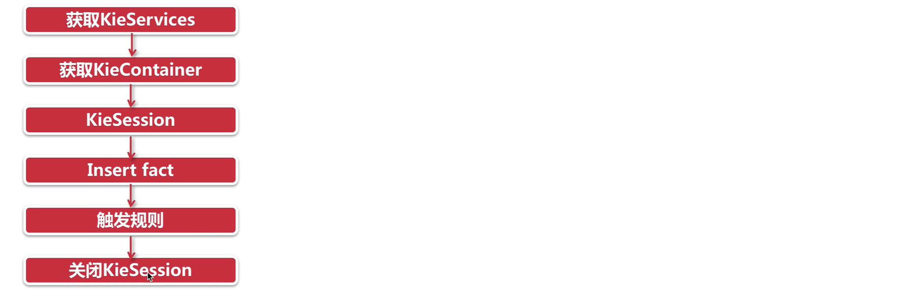

# Drools 入门篇

> 规则引擎

注意：SpringBoot版本和Drools版本直接的兼容问题。

Maven仓库：

Drools：<https://mvnrepository.com/artifact/org.kie/kie-spring>

SpringBoot： <https://mvnrepository.com/artifact/org.springframework.boot/spring-boot>

## 1. 问题引出

现有一个在线申请信用卡的业务场景，用户需要录入个人信息，如下图所示：


通过上图可以看到，用户录入的个人信息包括姓名、性别、年龄、学历、电话、所在公司、职位、月收入、是否有房、是否有车、是否有信用卡等。录入完成后点击申请按钮提交即可。

用户提交申请后，需要在系统的服务端进行**用户信息合法性检查**(是否有资格申请信用卡)，只有通过合法性检查的用户才可以成功申请到信用卡(注意：不同用户有可能申请到的信用卡额度不同)。

检查用户信息合法性的规则如下：

| 规则编号 | 名称            | 描述                                                |
|:-----|:--------------|:--------------------------------------------------|
| 1    | 检查学历与薪水1      | 如果申请人既没房也没车，同时学历为大专以下，并且月薪少于5000，那么不通过            |
| 2    | 检查学历与薪水2      | 如果申请人既没房也没车，同时学历为大专或本科，并且月薪少于3000，那么不通过           |
| 3    | 检查学历与薪水3      | 如果申请人既没房也没车，同时学历为本科以上，并且月薪少于2000，同时之前没有信用卡的，那么不通过 |
| 4    | 检查申请人已有的信用卡数量 | 如果申请人现有的信用卡数量大于10，那么不通过                           |

用户信息合法性检查通过后，还需要根据如下**信用卡发放规则**确定用户所办信用卡的额度：

| 规则编号 | 名称  | 描述                                                  |
|:-----|:----|:----------------------------------------------------|
| 1    | 规则1 | 如果申请人有房有车，或者月收入在20000以上，那么发放的信用卡额度为15000            |
| 2    | 规则2 | 如果申请人没房没车，但月收入在10000~20000之间，那么发放的信用卡额度为6000        |
| 3    | 规则3 | 如果申请人没房没车，月收入在10000以下，那么发放的信用卡额度为3000               |
| 4    | 规则4 | 如果申请人有房没车或者没房但有车，月收入在10000以下，那么发放的信用卡额度为5000        |
| 5    | 规则5 | 如果申请人有房没车或者是没房但有车，月收入在10000~20000之间，那么发放的信用卡额度为8000 |

思考：如何实现上面的业务逻辑呢？

我们最容易想到的就是使用分支判断(if else)来实现，例如通过如下代码来检查用户信息合法性:

```java{6,13,20,28}
//此处为伪代码

//检查用户信息合法性，返回true表示检查通过，返回false表示检查不通过
public boolean checkUser(User user){
    //如果申请人既没房也没车，同时学历为大专以下，并且月薪少于5000，那么不通过
    if(user.getHouse() == null 
       && user.getcar() == null 
       && user.getEducation().equals("大专以下") 
       && user.getSalary < 5000){
        return false;
    }
    //如果申请人既没房也没车，同时学历为大专或本科，并且月薪少于3000，那么不通过
    else if(user.getHouse() == null 
       && user.getcar() == null 
       && user.getEducation().equals("大专或本科") 
       && user.getSalary < 3000){
        return false;
    }
    //如果申请人既没房也没车，同时学历为本科以上，并且月薪少于2000，同时之前没有信用卡的，那么不通过
    else if(user.getHouse() == null 
       && user.getcar() == null 
       && user.getEducation().equals("本科以上") 
       && user.getSalary < 2000 
       && user.getHasCreditCard() == false){
        return false;
    }
    //如果申请人现有的信用卡数量大于10，那么不通过
    else if(user.getCreditCardCount() > 10){
        return false;
    }
    return true;
}
```


如果用户信息合法性检查通过后，还需要通过如下代码确定用户所办信用卡的额度：

```java{6,11,18,24,29}
//此处为伪代码

//根据用户输入信息确定信用卡额度
public Integer determineCreditCardLimit(User user){
    //如果申请人有房有车，或者月收入在20000以上，那么发放的信用卡额度为15000
    if((user.getHouse() != null && user.getcar() != null) 
       || user.getSalary() > 20000){
        return 15000;
    }
    //如果申请人没房没车，并且月收入在10000到20000之间，那么发放的信用卡额度为6000
    else if(user.getHouse() == null 
       && user.getcar() == null
       && user.getSalary() > 10000 
       && user.getSalary() < 20000){
        return 6000;
    }
    //如果申请人没房没车，并且月收入在10000以下，那么发放的信用卡额度为3000
    else if(user.getHouse() == null 
       && user.getcar() == null
       && user.getSalary() < 10000){
        return 3000;
    }
    //如果申请人有房没车或者没房但有车，并且月收入在10000以下，那么发放的信用卡额度为5000
    else if((((user.getHouse() != null && user.getcar() == null) || (user.getHouse() == null && user.getcar() != null))
       && user.getSalary() < 10000){
        return 5000;
    }
    //如果申请人有房没车或者没房但有车，并且月收入在10000到20000之间，那么发放的信用卡额度为8000
    else if((((user.getHouse() != null && user.getcar() == null) || (user.getHouse() == null && user.getcar() != null))
       && (user.getSalary() > 10000 && user.getSalary() < 20000)){
        return 8000;
    }
}
```


通过上面的伪代码我们可以看到，我们的业务规则是通过Java代码的方式实现的。这种实现方式存在如下问题：

1. 硬编码实现业务规则难以维护

2. 硬编码实现业务规则难以应对变化

3. 业务规则发生变化需要修改代码，重启服务后才能生效


那么面对上面的业务场景，还有什么好的实现方式吗？

答案是: **规则引擎**。

## 2. 规则引擎概述

### 2.1 什么是规则引擎

**规则引擎**，全称为**业务规则管理系统**，英文名为BRMS(即Business Rule Management System)。
规则引擎的主要思想是将应用程序中的业务决策部分分离出来，并使用预定义的语义模块编写业务决策（业务规则），
由用户或开发者在需要时进行配置、管理。

需要注意的是规则引擎并不是一个具体的技术框架，而是指的一类系统，即业务规则管理系统。
目前市面上具体的规则引擎产品有：drools、VisualRules、iLog等。

规则引擎实现了将业务决策从应用程序代码中分离出来，接收数据输入，解释业务规则，并根据业务规则做出业务决策。
规则引擎其实就是一个*输入输出平台*。

上面的申请信用卡业务场景使用规则引擎后效果如下：


系统中引入规则引擎后，业务规则不再以程序代码的形式驻留在系统中，取而代之的是处理规则的规则引擎，
业务规则存储在规则库中，完全独立于程序。业务人员可以像管理数据一样对业务规则进行管理，
比如查询、添加、更新、统计、提交业务规则等。业务规则被加载到规则引擎中供应用系统调用。

### 2.2 使用规则引擎的优势

使用规则引擎的优势如下：

1. 业务规则与系统代码分离，实现业务规则的集中管理

2. 在不重启服务的情况下可随时对业务规则进行扩展和维护

3. 可以动态修改业务规则，从而快速响应需求变更

4. 规则引擎是相对独立的，只关心业务规则，使得业务分析人员也可以参与编辑、维护系统的业务规则

5. 减少了硬编码业务规则的成本和风险

6. 使用规则引擎提供的规则编辑工具，使复杂的业务规则实现变得的简单

### 2.3 规则引擎应用场景

对于一些存在比较复杂的业务规则并且业务规则会频繁变动的系统比较适合使用规则引擎，如下：

风险控制系统 ---- 风险贷款、风险评估

2. 反欺诈项目 ---- 银行贷款、征信验证

3. 决策平台系统 ---- 财务计算

4. 促销平台系统 ---- 满减、打折、加价购

### 2.4 Drools介绍

Drools 是一款由JBoss组织提供的基于Java语言开发的开源规则引擎，可以将复杂且多变的业务规则从硬编码中解放出来，
以规则脚本的形式存放在文件或特定的存储介质中(例如存放在数据库中)，使得业务规则的变更不需要修改项目代码、重启服务器就可以在线上环境立即生效。

drools官网地址：<https://drools.org/>

drools源码下载地址：<https://github.com/kiegroup/drools>

在项目中使用drools时，即可以单独使用也可以整合 Spring 使用。如果单独使用只需要导入如下maven坐标即可：

```xml
<dependency>
    <groupId>org.drools</groupId>
    <artifactId>drools-compiler</artifactId>
    <version>7.6.0.Final</version>
</dependency>
```


如果我们使用IDEA开发drools应用，IDEA中已经集成了drools插件。如果使用eclipse开发drools应用还需要单独安装drools插件。

drools API开发步骤如下：

## 3. Drools入门案例

本小节通过一个Drools入门案例来让大家初步了解Drools的使用方式、对Drools有一个整体概念。

### 3.1 业务场景说明

业务场景：消费者在图书商城购买图书，下单后需要在支付页面显示订单优惠后的价格。具体优惠规则如下：

| 规则编号 | 规则名称 | 描述                    |
|:-----|:-----|:----------------------|
| 1    | 规则一  | 所购图书总价在100元以下的没有优惠    |
| 2    | 规则二  | 所购图书总价在100到200元的优惠20元 |
| 3    | 规则三  | 所购图书总价在200到300元的优惠50元 |
| 4    | 规则四  | 所购图书总价在300元以上的优惠100元  |

现在需要根据上面的规则计算优惠后的价格。

### 3.2 开发实现

第一步：创建maven工程drools_quickstart并导入drools相关maven坐标

```xml
<dependencies>
  <dependency>
    <groupId>org.drools</groupId>
    <artifactId>drools-compiler</artifactId>
    <version>7.10.0.Final</version>
  </dependency>
  <dependency>
    <groupId>junit</groupId>
    <artifactId>junit</artifactId>
    <version>4.12</version>
  </dependency>
  <dependency>
    <groupId>org.projectlombok</groupId>
    <artifactId>lombok</artifactId>
    <version>1.18.20</version>
  </dependency>
</dependencies>
```

第二步：根据drools要求创建 `resources/META-INF/kmodule.xml` 配置文件

```xml
<?xml version="1.0" encoding="UTF-8" ?>
<kmodule xmlns="http://www.drools.org/xsd/kmodule">
  <!--
      name: 指定kbase的名称，可以任意，但是需要唯一
      packages: 指定规则文件的目录，需要根据实际情况填写，否则无法加载到规则文件
      default: 指定当前kbase是否为默认
  -->
  <kbase name="myKbase1" packages="rules" default="true">
    <!--
        name: 指定ksession名称，可以任意，但是需要唯一
        default: 指定当前session是否为默认
    -->
    <ksession name="ksession-rule" default="true"/>
  </kbase>
</kmodule>
```

> 注意：上面配置文件的名称和位置都是固定写法，不能更改

第三步：创建实体类Order

```java
package com.zmn.drools.entity;
@Data
public class Order {

  // 订单原始价格，即优惠前价格
  private Double originalPrice;

  // 订单真实价格，即优惠后价格
  private Double realPrice;

}
```

第四步：创建规则文件 `resources/rules/bookDiscount.drl`

```drools{1-4,7-13}
// 逻辑包，同一个包下的规则可以相互访问
package book.discount
// 引入 Order
import com.zmn.drools.entity.Order

// 规则一：所购图书总价在100元以下的没有优惠
rule "book_discount_1"
    when
        $order:Order(originalPrice < 100) // 模式匹配。到规则引擎中（工作内存）查找originalPrice<100的Order对象
    then
        $order.setRealPrice($order.getOriginalPrice());
        System.out.println("成功匹配到规则一：所购图书总价在100元以下的没有优惠");
end

// 规则二：所购图书总价在100到200元的优惠20元
rule "book_discount_2"
    when
        $order:Order(originalPrice < 200 && originalPrice >= 100)
    then
        $order.setRealPrice($order.getOriginalPrice() - 20);
        System.out.println("成功匹配到规则二：所购图书总价在100到200元的优惠20元");
end

// 规则三：所购图书总价在200到300元的优惠50元
rule "book_discount_3"
    when
        $order:Order(originalPrice <= 300 && originalPrice >= 200)
    then
        $order.setRealPrice($order.getOriginalPrice() - 50);
        System.out.println("成功匹配到规则三：所购图书总价在200到300元的优惠50元");
end

// 规则四：所购图书总价在300元以上的优惠100元
rule "book_discount_4"
    when
        $order:Order(originalPrice >= 300)
    then
        $order.setRealPrice($order.getOriginalPrice() - 100);
        System.out.println("成功匹配到规则四：所购图书总价在300元以上的优惠100元");
end
```

第五步：编写单元测试

```java
public class DroolsTest {

  @Test
  public void test101() {

    KieServices kieServices = KieServices.Factory.get();
    // 获得 Kie 容器
    KieContainer kieContainer = kieServices.newKieClasspathContainer();
    // 从 Kie 容器对象中获取会话对象
    KieSession session = kieContainer.newKieSession();
    // Fact对象
    Order order = new Order();

    // order.setOriginalPrice(50d);
    order.setOriginalPrice(500d);

    // 将事实对象插入到工作内存中
    session.insert(order);

    // 激活规则，由Drools框架自动进行规则匹配。
    // 如果规则匹配成功，则执行当前规则。
    session.fireAllRules();

    // 关闭会话
    session.dispose();

    // realPrice 是在规则文件中设置的
    System.out.println("优惠前原始价格：" + order.getOriginalPrice() + "，优惠后价格：" + order.getRealPrice());

  }

}
```

通过上面的入门案例我们可以发现，使用drools规则引擎主要工作就是编写规则文件，在规则文件中定义跟业务相关的业务规则，
例如本案例定义的就是图书优惠规则。规则定义好后就需要调用drools提供的API将数据提供给规则引擎进行规则模式匹配，
规则引擎会执行匹配成功的规则并将计算的结果返回给我们。

可能大家会有疑问，就是我们虽然没有在代码中编写规则的判断逻辑，但是我们还是在规则文件中编写了业务规则，这跟在代码中编写规则有什么本质的区别呢？

我们前面其实已经提到，使用规则引擎时业务规则可以做到**动态管理**。业务人员可以像管理数据一样对业务规则进行管理，
比如查询、添加、更新、统计、提交业务规则等。这样就可以做到在不重启服务的情况下调整业务规则。

### 3.3 小结

#### 3.3.1 规则引擎构成

drools规则引擎由以下三部分构成：

- Working Memory（工作内存）—— 用于存放事实(Fact)对象
- Rule Base（规则库）-- 用于存放编写的业务规则
- Inference Engine（推理引擎）

其中Inference Engine（推理引擎）又包括：

- Pattern Matcher（匹配器）—— 具体匹配哪一个规则，由这个完成
- Agenda(议程) —— 用于存放成功匹配的规则
- Execution Engine（执行引擎）

如下图所示：


#### 3.3.2 相关概念说明

**Working Memory**：工作内存，drools规则引擎会从Working Memory中获取数据并和规则文件中定义的规则进行模式匹配，
所以我们开发的应用程序只需要将我们的数据插入到Working Memory中即可，例如本案例中
我们调用 `kieSession.insert(order)` 就是将order对象插入到了工作内存中。

**Fact**：事实，是指在 drools 规则应用当中，将一个**普通的JavaBean插入到Working Memory后的对象**就是Fact对象，
例如本案例中的Order对象就属于Fact对象。Fact对象是我们的应用和规则引擎进行数据交互的桥梁或通道。

**Rule Base**：规则库，我们在规则文件中定义的规则都会被加载到规则库中。

**Pattern Matcher**：匹配器，将Rule Base中的所有规则与Working Memory中的Fact对象进行模式匹配，
匹配成功的规则将被激活并放入Agenda中。

**Agenda**：议程，用于存放通过匹配器进行模式匹配后被激活的规则。

**Execution Engine**：执行引擎，执行Agenda中被激活的规则。

#### 3.3.3 规则引擎执行过程


#### 3.3.4 KIE介绍

我们在操作Drools时经常使用的API以及它们之间的关系如下图：


通过上面的核心API可以发现，大部分类名都是以 `Kie` 开头。

**KIE 全称为Knowledge Is Everything**，即"*知识就是一切*"的缩写，是Jboss一系列项目的总称。
如下图所示，Kie的主要模块有 `OptaPlanner`、`Drools`、`UberFire`、`jBPM`。


通过上图可以看到，Drools是整个KIE项目中的一个组件，Drools中还包括一个 `Drools-WB` 的模块，它是一个可视化的规则编辑器。


