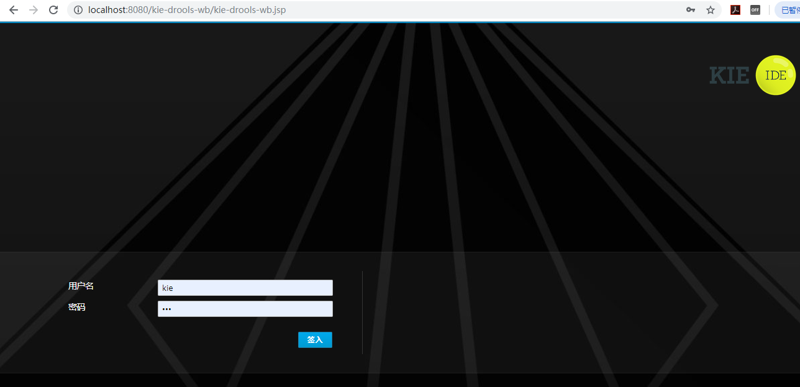

# Drools 高级篇

## 6. Drools高级语法

前面章节我们已经知道了一套完整的规则文件内容构成如下：

| 关键字           | 描述                               |
|:--------------|:---------------------------------|
| `package`     | 包名，只限于逻辑上的管理，同一个包名下的查询或者函数可以直接调用 |
| `import`      | 用于导入类或者静态方法                      |
| `global`      | 全局变量                             |
| `function`    | 自定义函数                            |
| `query`       | 查询                               |
| `rule... end` | 规则体                              |

本章节我们就来学习其中的几个关键字。

### 6.1 global全局变量

global关键字用于在规则文件中**定义全局变量**，它可以让应用程序的对象在规则文件中能够被访问。可以用来为规则文件提供数据或服务。

语法结构为：`global 对象类型 对象名称`

在使用global定义的全局变量时有两点需要注意：

1、如果对象类型为**包装类型**时，在一个规则中改变了 `global` 的值，那么**只针对当前规则有效**，对其他规则中的global不会有影响。

> 可以理解为它是当前规则代码中的 `global` 的副本，规则内部修改不会影响全局的使用。

2、如果对象类型为**集合类型或JavaBean**时，在一个规则中改变了 `global` 的值，对 Java 代码和所有规则都有效。

下面我们通过代码进行验证：

第一步：创建 JavaBean(UserService)类

```java
public class UserService {
    public void save() {
        System.out.println("UserService save() ...");
    }
}
```

第二步：编写规则文件 `/resources/rules/global.drl`

```drools{3-9}
// 当前规则文件用于测试 global 全局变量
package testglobal
// 定义一个包装类型的全局变量
global java.lang.Integer count
// 定义一个集合类型的全局变量
global java.util.List gList
// 定义一个 JavaBean 类型的全局变量
import com.zmn.drools.service.UserService
global UserService userService

rule "rule_global_1"
    when
    then
        count += 10;    // 对包装类型的全局变量的修改，只针对当前规则生效
        System.out.println("规则 rule_global_1 触发了...");
        System.out.println("全局变量计算之后的值为：" + count);
        // 修改集合类型的全局变量
        gList.add("zmn");
        System.out.println("全局变量 gList 的 size :" + gList.size());
        // 调用 JavaBean 的方法
        userService.save();
end

rule "rule_global_2"
    when
    then
        System.out.println("规则 rule_global_2 触发了...");
        System.out.println("全局变量的值为：" + count);
        // 集合类型的全局变量
        System.out.println("全局变量 gList 的 size :" + gList.size());
        // 调用 JavaBean 的方法
        userService.save();
end
```

第三步：编写单元测试

```java{13-17}
public class DroolsTest {
  // 测试 global 关键字
  @Test
  public void test108() {

    //设置日期格式
    System.setProperty("drools.dateformat","yyyy-MM-dd HH:mm");
    KieServices kieServices = KieServices.Factory.get();
    // 获得 Kie 容器
    KieContainer kieContainer = kieServices.newKieClasspathContainer();
    // 从 Kie 容器对象中获取会话对象
    KieSession session = kieContainer.newKieSession();
    // 设置全局变量。变量名称必须和 drl 文件中定义的全局变量名一致
    session.setGlobal("count", 5);
    List<String> list = new ArrayList<>();
    session.setGlobal("gList", list);
    session.setGlobal("userService", new UserService());
    // 只测试 global 全局变量相关的规则
    session.fireAllRules(new RuleNameStartsWithAgendaFilter("rule_global_"));
    System.out.println("Java程序中全局变量 gList 的 size 为：" + list.size()); // 位置需要在 `fireAllRules()` 方法之后
    // 关闭会话
    session.dispose();
  }
}
```

输出结果：

```text
规则 rule_global_1 触发了...
全局变量计算之后的值为：15
全局变量 gList 的 size :1
UserService save() ...
规则 rule_global_2 触发了...
全局变量的值为：5
全局变量 gList 的 size :1
UserService save() ...
Java程序中全局变量 gList 的 size 为：1
```

> 注意：后面的代码中定义了全局变量以后，前面的 `test` 都需要加，不然会出错。

### 6.2 query查询

`query` 查询提供了一种**查询working memory中符合约束条件的Fact对象**的简单方法。
它仅包含规则文件中的LHS部分，不用指定 `when` 和 `then` 部分并且以 `end` 结束。

具体语法结构如下：

```drools
query 查询的名称(可选参数)
    LHS
end
```

具体操作步骤：

第一步：编写规则文件 `/resources/rules/query.drl`

```drools{7-9,12-14}
// 当前规则文件用于测试 query 查询
package testquery
import com.zmn.drools.entity.Student

// 定义一个 query 查询
// 可以到工作内存中查找符合条件的 Fact 对象
query "query_1"
    $s:Student(age == 50)
end

// 定义一个带有查询参数的 query 查询
query "query_2" (String sname)
    $s:Student(age > 5 && name == sname) // Student 对象的 name 成员变量的值需要等于 sname
end
```

第二步：编写单元测试

```java{14-31}
public class DroolsTest {
  // 测试 query 查询
  @Test
  public void test109() {

    //设置日期格式
    System.setProperty("drools.dateformat", "yyyy-MM-dd HH:mm");
    KieServices kieServices = KieServices.Factory.get();
    // 获得 Kie 容器
    KieContainer kieContainer = kieServices.newKieClasspathContainer();
    // 从 Kie 容器对象中获取会话对象
    KieSession session = kieContainer.newKieSession();
    // 设置全局变量。// 阻止报错，略...
    // 添加测试数据
    session.insert(new Student(1, "John", 50));
    session.insert(new Student(2, "Jack", 50));
    // 根据名称调用规则文件中定义的查询
    QueryResults results = session.getQueryResults("query_1");
    System.out.println("符合条件1的 Fact 对象的个数：" + results.size());
    for (QueryResultsRow row : results) { // 遍历获取具体的 Fact 对象
      Student stu = (Student) row.get("$s"); // 此处的变量名是规则文件中的绑定的变量名
      System.out.println(stu);
    }

    // 调用带有参数的查询
    QueryResults results2 = session.getQueryResults("query_2", "Jack");
    System.out.println("符合条件2的 Fact 对象的个数：" + results2.size());
    for (QueryResultsRow row : results2) { // 遍历获取具体的 Fact 对象
      Student stu = (Student) row.get("$s"); // 此处的变量名是规则文件中的绑定的变量名
      System.out.println(stu);
    }

    // session.fireAllRules(); // 执行查询可以不匹配规则
    // 关闭会话
    session.dispose();
  }
}
```

输出结果：

```text
符合条件1的 Fact 对象的个数：2
Student(id=1, name=John, age=50)
Student(id=2, name=Jack, age=50)
符合条件2的 Fact 对象的个数：1
Student(id=2, name=Jack, age=50)
```

### 6.3 function函数

`function` 关键字用于在规则文件中定义函数，就相当于 Java 类中的方法。可以在规则体中调用定义的函数。
使用函数的好处是可以将业务逻辑集中放置在一个地方，根据需要可以对函数进行修改。

函数定义的语法结构如下：

```drools{}
function 返回值类型 函数名(可选参数){
    //逻辑代码
}
```

具体操作步骤：

第一步：编写规则文件 `/resources/rules/function.drl`

```drools{}6-8,16
// 当前规则文件用于测试 function
package testfunction
import com.zmn.drools.entity.Student

// 定义一个函数
function String sayHello(String name) {
    return "hello " + name;
}

// 定义一个规则，在规则中调用上面的函数
rule "rule_function_1"
    when
        $s:Student(age > 60)
    then
        // 调用定义的函数
        String ret = sayHello($s.getName());
        System.out.println("调用 sayHello 函数获得返回结果：" + ret);
end
```

第二步：编写单元测试

> 单元测试没有新内容，只是向 session 中注入测试对象即可

### 6.4 LHS加强

前面我们已经知道了，在规则体中的LHS部分是**介于 `when` 和 `then` 之间的部分**，主要用于模式匹配，只有匹配结果为true时，
才会触发RHS部分的执行。本章节我们会针对LHS部分学习几个新的用法。

#### 6.4.1 复合值限制 in/not in

复合值限制是指超过一种匹配值的限制条件，类似于SQL语句中的 `in` 关键字。

Drools规则体中的LHS部分可以使用 `in` 或者 `not in` 进行复合值的匹配。

具体语法结构：`Object(field in (比较值1,比较值2...))`

举例：

```drools
$s:Student(name in ("张三","李四","王五"))
$s:Student(name not in ("张三","李四","王五"))
```

#### 6.4.2 条件元素eval

`eval` 用于规则体的LHS部分，并返回一个 `Boolean` 类型的值。

语法结构：`eval(表达式)`

举例：

```drools
eval(true)
eval(false)
eval(1 == 1)
```

#### 6.4.3 条件元素not

`not` 用于判断 Working Memory 中是否存在某个 Fact 对象，如果不存在则返回true，如果存在则返回false。

语法结构： `not Object(可选属性约束)`

举例：

```drools
not Student()
not Student(age < 10)
```

#### 6.4.4 条件元素exists

`exists` 的作用与 `not` 相反，用于判断 Working Memory 中是否存在某个Fact对象，如果存在则返回true，不存在则返回false。

语法结构：`exists Object(可选属性约束)`

举例：

```drools
exists Student()
exists Student(age < 10 && name != null)
```

可能有人会有疑问，我们前面在LHS部分进行条件编写时，并没有使用 `exists` 也可以达到判断Working Memory中是否存在某个符合条件的Fact元素的目的，
那么我们使用exists还有什么意义？

两者的区别：当向Working Memory中加入多个满足条件的Fact对象时，使用了 `exists` 的规则执行一次，不使用 `exists` 的规则会执行多次。

例如：

规则文件(只有规则体)：

```drools{3,10}
rule "使用exists的规则"
    when
        exists Student()
    then
        System.out.println("规则：使用exists的规则触发");
end

rule "没有使用exists的规则"
    when
        Student()
    then
        System.out.println("规则：没有使用exists的规则触发");
end
```

Java代码：

```java
kieSession.insert(new Student());
kieSession.insert(new Student());
kieSession.fireAllRules();
```

上面第一个规则只会执行一次，因为Working Memory中存在两个满足条件的Fact对象，第二个规则会执行两次。

> 个人理解：也就是说加了 `exists` 关键字，规则引擎只回答一次有没有这个对象；不过不加 `exists` 关键字，工作内存中的每个对象都回来匹配一次。

#### 6.4.5 规则继承

规则之间可以使用 `extends` 关键字进行规则条件部分的继承，类似于 Java 类之间的继承。

例如：

```drools{8}
rule "rule_1"
    when
        Student(age > 10)
    then
        System.out.println("规则：rule_1触发");
end

rule "rule_2" extends "rule_1" //继承上面的规则
    when
        // 此处的条件虽然只写了一个，但是从上面的规则继承了一个条件，
        // 所以当前规则存在两个条件，即 Student(age < 20) 和 Student(age > 10)
        Student(age < 20) 
    then
        System.out.println("规则：rule_2触发");
end
```

### 6.5 RHS加强

RHS部分是规则体的重要组成部分，当LHS部分的条件匹配成功后，对应的RHS部分就会触发执行。一般在RHS部分中需要进行业务处理。

在RHS部分Drools为我们提供了一个内置对象，名称就是 `drools`。本小节我们来介绍几个drools对象提供的方法。

#### 6.5.1 halt

`halt()`方法的作用是**立即终止后面所有规则的执行**。

```drools{6}
package testhalt
rule "rule_halt_1"
    when
    then
        System.out.println("规则：rule_halt_1触发");
        drools.halt(); //立即终止后面所有规则执行
end

// 当前规则并不会触发，因为上面的规则调用了 halt 方法导致后面所有规则都不会执行
rule "rule_halt_2"
    when
    then
        System.out.println("规则：rule_halt_2触发");
end
```

#### 6.5.2 getWorkingMemory

`getWorkingMemory()`方法的作用是返回工作内存对象。

```drools{5}
package testgetWorkingMemory
rule "rule_getWorkingMemory"
    when
    then
        System.out.println(drools.getWorkingMemory());// 获得工作内存对象，本质上是一个 KieSession 对象
end
```

#### 6.5.3 getRule

`getRule()` 方法的作用是返回规则对象本身。

```drools{5}
package testgetRule
rule "rule_getRule"
    when
    then
        org.drools.core.definitions.rule.impl.RuleImpl rule = drools.getRule();
        // 前面讲到的属性，在此对象中基本都可以获取
        System.out.println(rule.getAutoFocus());
        System.out.println(rule.getId());
        System.out.println(rule.getDateEffective());
        System.out.println(rule.getDateExpires());
        System.out.println(rule);
end
```

### 6.6 规则文件编码规范（重要）

我们在进行drl类型的规则文件编写时尽量遵循如下规范：

- 所有的规则文件(`.drl`)应统一放在一个规定的文件夹中，如：`/rules`文件夹
- 书写的每个规则应尽量加上注释。注释要清晰明了，言简意赅。
- 同一类型的对象尽量放在一个规则文件中，如所有 `Student` 类型的对象尽量放在一个规则文件中
- 规则结果部分(RHS)尽量不要有条件语句，如 `if(...)`，尽量不要有复杂的逻辑和深层次的嵌套语句
- 每个规则最好都加上 `salience` 属性，明确执行顺序
- Drools默认 `dialec` t为Java，尽量避免使用 `dialect "mvel"`

## 7. Spring整合Drools

### 7.1 Spring简单整合Drools

在项目中使用Drools时往往会跟Spring整合来使用。具体整合步骤如下：

第一步：创建maven工程 `drools_spring` 并配置 `pom.xml`

```xml
<?xml version="1.0" encoding="UTF-8"?>
<project xmlns="http://maven.apache.org/POM/4.0.0"
         xmlns:xsi="http://www.w3.org/2001/XMLSchema-instance"
         xsi:schemaLocation="http://maven.apache.org/POM/4.0.0 http://maven.apache.org/xsd/maven-4.0.0.xsd">
  <modelVersion>4.0.0</modelVersion>

  <groupId>com.zmn</groupId>
  <artifactId>drools-spring</artifactId>
  <version>1.0-SNAPSHOT</version>

  <properties>
    <maven.compiler.source>8</maven.compiler.source>
    <maven.compiler.target>8</maven.compiler.target>
    <drools.version>7.10.0.Final</drools.version>
    <spring.version>5.0.5.RELEASE</spring.version>
  </properties>

  <dependencies>
    <dependency>
      <groupId>org.drools</groupId>
      <artifactId>drools-compiler</artifactId>
      <version>${drools.version}</version>
    </dependency>
    <dependency>
      <groupId>junit</groupId>
      <artifactId>junit</artifactId>
      <version>4.12</version>
    </dependency>
    <dependency>
      <groupId>org.kie</groupId>
      <artifactId>kie-spring</artifactId>
      <version>${drools.version}</version>
      <!--注意：此处必须排除传递过来的依赖，否则会跟我们自己导入的Spring jar包产生冲突-->
      <exclusions>
        <exclusion>
          <groupId>org.springframework</groupId>
          <artifactId>spring-tx</artifactId>
        </exclusion>
        <exclusion>
          <groupId>org.springframework</groupId>
          <artifactId>spring-beans</artifactId>
        </exclusion>
        <exclusion>
          <groupId>org.springframework</groupId>
          <artifactId>spring-core</artifactId>
        </exclusion>
        <exclusion>
          <groupId>org.springframework</groupId>
          <artifactId>spring-context</artifactId>
        </exclusion>
      </exclusions>
    </dependency>
    <dependency>
      <groupId>org.springframework</groupId>
      <artifactId>spring-context</artifactId>
      <version>${spring.version}</version>
    </dependency>
    <dependency>
      <groupId>org.springframework</groupId>
      <artifactId>spring-context-support</artifactId>
      <version>${spring.version}</version>
    </dependency>
    <dependency>
      <groupId>org.springframework</groupId>
      <artifactId>spring-test</artifactId>
      <version>${spring.version}</version>
    </dependency>
    <dependency>
      <groupId>org.springframework</groupId>
      <artifactId>spring-tx</artifactId>
      <version>${spring.version}</version>
    </dependency>
  </dependencies>
</project>
```

第二步：创建规则目录 `/resources/rules`，在rules目录中创建规则文件 `helloworld.drl`

```drools
package helloworld

rule "rule_helloworld"
    when
        eval(true)
    then
        System.out.println("规则：rule_helloworld触发...");
end
```

第三步：创建Spring配置文件 `/resources/spring.xml`

```xml
<?xml version="1.0" encoding="UTF-8"?>
<beans xmlns="http://www.springframework.org/schema/beans"
       xmlns:xsi="http://www.w3.org/2001/XMLSchema-instance"
       xmlns:kie="http://drools.org/schema/kie-spring"
       xsi:schemaLocation="http://www.springframework.org/schema/beans
                            http://www.springframework.org/schema/beans/spring-beans.xsd
                            http://drools.org/schema/kie-spring
                            http://drools.org/schema/kie-spring.xsd">
    <kie:kmodule id="kmodule">
        <kie:kbase name="kbase" packages="rules">
            <kie:ksession name="ksession"></kie:ksession>
        </kie:kbase>
    </kie:kmodule>
    <bean class="org.kie.spring.annotations.KModuleAnnotationPostProcessor"></bean>
</beans>
```

第四步：编写单元测试类

```java
@RunWith(SpringJUnit4ClassRunner.class)
@ContextConfiguration(locations = "classpath:spring.xml")
public class DroolSpringTest {

  //注入KieBase对象
  @KBase("kbase")
  private KieBase kieBase;

  @Test
  public void test1(){
    KieSession kieSession = kieBase.newKieSession();
    kieSession.fireAllRules();
    kieSession.dispose();
  }

  // 还可以直接注入 KieSession
  @KSession("ksession") // ksession 的名字要对应 spring.xml 配置文件中的 KieSession 中配置的名字
  private KieSession kSession;    // 但是不建议直接注入 session 对象

  @Test
  public void test2() {
    kSession.fireAllRules();
    kSession.dispose();
  }

}
```

### 7.2 Spring整合Drools+web

本小节我们来进行Drools和Spring Web的整合。具体操作步骤如下：

第一步：创建maven的war工程 `drools-spring-web` 并在pom.xml文件中导入相关maven坐标

```xml
<?xml version="1.0" encoding="UTF-8"?>
<project xmlns="http://maven.apache.org/POM/4.0.0"
         xmlns:xsi="http://www.w3.org/2001/XMLSchema-instance"
         xsi:schemaLocation="http://maven.apache.org/POM/4.0.0 http://maven.apache.org/xsd/maven-4.0.0.xsd">
  <modelVersion>4.0.0</modelVersion>

  <groupId>com.zmn</groupId>
  <artifactId>drools-spring-web</artifactId>
  <version>1.0-SNAPSHOT</version>
  <packaging>war</packaging>

  <properties>
    <project.build.sourceEncoding>UTF-8</project.build.sourceEncoding>
    <maven.compiler.source>8</maven.compiler.source>
    <maven.compiler.target>8</maven.compiler.target>
    <drools.version>7.10.0.Final</drools.version>
    <spring.version>5.0.5.RELEASE</spring.version>
  </properties>
  
  <dependencies>
    <dependency>
      <groupId>org.drools</groupId>
      <artifactId>drools-compiler</artifactId>
      <version>${drools.version}</version>
    </dependency>
    <dependency>
      <groupId>junit</groupId>
      <artifactId>junit</artifactId>
      <version>4.12</version>
    </dependency>
    <dependency>
      <groupId>org.kie</groupId>
      <artifactId>kie-spring</artifactId>
      <version>${drools.version}</version>
      <!--注意：此处必须排除传递过来的依赖，否则会跟我们自己导入的Spring jar包产生冲突-->
      <exclusions>
        <exclusion>
          <groupId>org.springframework</groupId>
          <artifactId>spring-tx</artifactId>
        </exclusion>
        <exclusion>
          <groupId>org.springframework</groupId>
          <artifactId>spring-beans</artifactId>
        </exclusion>
        <exclusion>
          <groupId>org.springframework</groupId>
          <artifactId>spring-core</artifactId>
        </exclusion>
        <exclusion>
          <groupId>org.springframework</groupId>
          <artifactId>spring-context</artifactId>
        </exclusion>
      </exclusions>
    </dependency>
    <dependency>
      <groupId>org.springframework</groupId>
      <artifactId>spring-context</artifactId>
      <version>${spring.version}</version>
    </dependency>
    <dependency>
      <groupId>org.springframework</groupId>
      <artifactId>spring-context-support</artifactId>
      <version>${spring.version}</version>
    </dependency>
    <dependency>
      <groupId>org.springframework</groupId>
      <artifactId>spring-test</artifactId>
      <version>${spring.version}</version>
    </dependency>
    <dependency>
      <groupId>org.springframework</groupId>
      <artifactId>spring-tx</artifactId>
      <version>${spring.version}</version>
    </dependency>
    <dependency>
      <groupId>org.springframework</groupId>
      <artifactId>spring-web</artifactId>
      <version>${spring.version}</version>
    </dependency>
    <dependency>
      <groupId>org.springframework</groupId>
      <artifactId>spring-webmvc</artifactId>
      <version>${spring.version}</version>
    </dependency>
  </dependencies>

  <build>
    <plugins>
      <plugin>
        <groupId>org.apache.tomcat.maven</groupId>
        <artifactId>tomcat7-maven-plugin</artifactId>
        <!--    自己加的版本号，不加的话，会报错  -->
        <version>2.2</version>
        <configuration>
          <!-- 指定端口 -->
          <port>8080</port>
          <!-- 请求路径 -->
          <path>/</path>
        </configuration>
      </plugin>
    </plugins>
  </build>

</project>
```

第二步：配置web.xml

```xml
<!DOCTYPE web-app PUBLIC
        "-//Sun Microsystems, Inc.//DTD Web Application 2.3//EN"
        "http://java.sun.com/dtd/web-app_2_3.dtd" >

<web-app>
  <display-name>Archetype Created Web Application</display-name>
  <servlet>
    <servlet-name>springmvc</servlet-name>
    <servlet-class>org.springframework.web.servlet.DispatcherServlet</servlet-class>
    <!-- 指定加载的配置文件 ，通过参数contextConfigLocation加载 -->
    <init-param>
      <param-name>contextConfigLocation</param-name>
      <param-value>classpath:springmvc.xml</param-value>
    </init-param>
    <load-on-startup>1</load-on-startup>
  </servlet>
  <servlet-mapping>
    <servlet-name>springmvc</servlet-name>
    <url-pattern>*.do</url-pattern>
  </servlet-mapping>
</web-app>
```

第三步：创建 `/resources/springmvc.xml` 文件

```xml
<?xml version="1.0" encoding="UTF-8"?>
<beans xmlns="http://www.springframework.org/schema/beans"
       xmlns:xsi="http://www.w3.org/2001/XMLSchema-instance"
       xmlns:context="http://www.springframework.org/schema/context"
       xmlns:mvc="http://www.springframework.org/schema/mvc"
       xmlns:kie="http://drools.org/schema/kie-spring"
       xsi:schemaLocation="http://www.springframework.org/schema/beans http://www.springframework.org/schema/beans/spring-beans.xsd
        http://drools.org/schema/kie-spring http://drools.org/schema/kie-spring.xsd
        http://www.springframework.org/schema/mvc http://www.springframework.org/schema/mvc/spring-mvc.xsd
        http://www.springframework.org/schema/context http://www.springframework.org/schema/context/spring-context.xsd">

  <kie:kmodule id="kmodule">
    <kie:kbase name="kbase" packages="rules">
      <kie:ksession name="ksession"></kie:ksession>
    </kie:kbase>
  </kie:kmodule>

  <bean class="org.kie.spring.annotations.KModuleAnnotationPostProcessor"/>

  <!--spring批量扫描-->
  <context:component-scan base-package="com.zmn"/>
  <context:annotation-config/>
  <!--springMVC注解驱动-->
  <mvc:annotation-driven/>
</beans>
```


第四步：创建规则文件 `/resources/rules/helloworld.drl`

```drools
package helloworld

rule "rule_helloworld"
    when
        eval(true)
    then
        System.out.println("规则：rule_helloworld触发...");
end
```

第五步：创建 `RuleService`

```java
@Service
public class RuleService {

  @KBase("kbase")
  private KieBase kieBase;

  public void rule() {
    KieSession kieSession = kieBase.newKieSession();
    kieSession.fireAllRules();
    kieSession.dispose();
  }

}
```

第六步：创建HelloController

```java
@RestController
@RequestMapping("/hello")
public class HelloController {

  @Autowired
  private RuleService ruleService;

  @RequestMapping("/rule")
  public String rule() {
    ruleService.rule();
    return "OK";
  }

}
```

访问：<http://localhost:8080/hello/rule.do>

然后查看控制台输出

### 7.3 Spring Boot整合Drools

目前在企业开发中Spring Boot已经成为主流，本小节我们来进行Spring Boot整合Drools。具体操作步骤：

第一步：创建maven工程drools_springboot并配置pom.xml

```xml
<?xml version="1.0" encoding="UTF-8"?>
<project xmlns="http://maven.apache.org/POM/4.0.0"
         xmlns:xsi="http://www.w3.org/2001/XMLSchema-instance"
         xsi:schemaLocation="http://maven.apache.org/POM/4.0.0 http://maven.apache.org/xsd/maven-4.0.0.xsd">
  <modelVersion>4.0.0</modelVersion>

  <parent>
    <groupId>org.springframework.boot</groupId>
    <artifactId>spring-boot-starters</artifactId>
    <version>2.0.6.RELEASE</version>
  </parent>

  <groupId>com.zmn</groupId>
  <artifactId>drools-spring-boot</artifactId>
  <version>1.0-SNAPSHOT</version>

  <properties>
    <maven.compiler.source>8</maven.compiler.source>
    <maven.compiler.target>8</maven.compiler.target>
  </properties>

  <dependencies>
    <dependency>
      <groupId>org.springframework.boot</groupId>
      <artifactId>spring-boot-starter-web</artifactId>
    </dependency>
    <dependency>
      <groupId>org.springframework.boot</groupId>
      <artifactId>spring-boot-starter-aop</artifactId>
    </dependency>
    <dependency>
      <groupId>org.springframework.boot</groupId>
      <artifactId>spring-boot-starter-test</artifactId>
    </dependency>
    <dependency>
      <groupId>commons-lang</groupId>
      <artifactId>commons-lang</artifactId>
      <version>2.6</version>
    </dependency>
    <!--drools规则引擎-->
    <dependency>
      <groupId>org.drools</groupId>
      <artifactId>drools-core</artifactId>
      <version>7.6.0.Final</version>
    </dependency>
    <dependency>
      <groupId>org.drools</groupId>
      <artifactId>drools-compiler</artifactId>
      <version>7.6.0.Final</version>
    </dependency>
    <dependency>
      <groupId>org.drools</groupId>
      <artifactId>drools-templates</artifactId>
      <version>7.6.0.Final</version>
    </dependency>
    <dependency>
      <groupId>org.kie</groupId>
      <artifactId>kie-api</artifactId>
      <version>7.6.0.Final</version>
    </dependency>
    <dependency>
      <groupId>org.kie</groupId>
      <artifactId>kie-spring</artifactId>
      <exclusions>
        <exclusion>
          <groupId>org.springframework</groupId>
          <artifactId>spring-tx</artifactId>
        </exclusion>
        <exclusion>
          <groupId>org.springframework</groupId>
          <artifactId>spring-beans</artifactId>
        </exclusion>
        <exclusion>
          <groupId>org.springframework</groupId>
          <artifactId>spring-core</artifactId>
        </exclusion>
        <exclusion>
          <groupId>org.springframework</groupId>
          <artifactId>spring-context</artifactId>
        </exclusion>
      </exclusions>
      <version>7.6.0.Final</version>
    </dependency>
  </dependencies>

  <build>
    <finalName>${project.artifactId}</finalName>
    <resources>
      <resource>
        <directory>src/main/java</directory>
        <includes>
          <include>**/*.xml</include>
        </includes>
        <filtering>false</filtering>
      </resource>
      <resource>
        <directory>src/main/resources</directory>
        <includes>
          <include>**/*.*</include>
        </includes>
        <filtering>false</filtering>
      </resource>
    </resources>
    <plugins>
      <plugin>
        <groupId>org.apache.maven.plugins</groupId>
        <artifactId>maven-compiler-plugin</artifactId>
        <version>2.3.2</version>
        <configuration>
          <source>1.8</source>
          <target>1.8</target>
        </configuration>
      </plugin>
    </plugins>
  </build>

</project>
```

第二步：创建 `/resources/application.yml` 文件

```yaml
server:
  port: 8080
spring:
  application:
    name: drools-spring-boot
```

第三步：创建规则文件 `/resources/rules/helloworld.drl`

```drools
package helloworld
rule "rule_helloworld"
    when
        eval(true)
    then
        System.out.println("规则：rule_helloworld 触发...");
end
```

第四步：编写配置类DroolsConfig

```java
@Configuration
public class DroolsConfig {

  //指定规则文件存放的目录
  private static final String RULES_PATH = "rules/";
  private final KieServices kieServices = KieServices.Factory.get();

  @Bean
  @ConditionalOnMissingBean
  public KieFileSystem kieFileSystem() throws IOException {// 创建文件系统
    KieFileSystem kieFileSystem = kieServices.newKieFileSystem();
    ResourcePatternResolver resourcePatternResolver = new PathMatchingResourcePatternResolver();
    Resource[] files = resourcePatternResolver.getResources("classpath*:" + RULES_PATH + "*.*");
    for (Resource file : files) {
      String path = String.format("%s%s", RULES_PATH, file.getFilename());
      kieFileSystem.write(ResourceFactory.newClassPathResource(path, "UTF-8"));
    }
    return kieFileSystem;
  }

  @Bean
  @ConditionalOnMissingBean
  public KieContainer kieContainer() throws IOException {// 创建容器对象
    KieRepository kieRepository = kieServices.getRepository();
    kieRepository.addKieModule(kieRepository::getDefaultReleaseId);
    KieBuilder kieBuilder = kieServices.newKieBuilder(kieFileSystem());
    kieBuilder.buildAll();
    return kieServices.newKieContainer(kieRepository.getDefaultReleaseId());
  }

  @Bean
  @ConditionalOnMissingBean
  public KieBase kieBase() throws IOException {
    return kieContainer().getKieBase();
  }

  @Bean
  @ConditionalOnMissingBean
  public KModuleBeanFactoryPostProcessor kiePostProcessor() {
    return new KModuleBeanFactoryPostProcessor();
  }

}
```

第五步：创建RuleService类

```java
@Service
public class RuleService {

    @Autowired // 直接使用 Spring 的注入注解即可，不需要使用 @KBase 注解了
    private KieBase kieBase;

    public void rule() {
        KieSession kieSession = kieBase.newKieSession();
        kieSession.fireAllRules();
        kieSession.dispose();
    }

}
```

第六步：创建HelloController类

```java
@RestController
@RequestMapping("/hello")
public class HelloController {

  @Autowired
  private RuleService ruleService;

  @RequestMapping("/rule")
  public String rule() {
    ruleService.rule();
    return "OK";
  }

}
```

第七步：创建启动类DroolsApplication

```java
@SpringBootApplication
public class DroolsApplication {

    public static void main(String[] args) {
        SpringApplication.run(DroolsApplication.class,args);
    }

}
```

第八步：启动服务，访问 <http://localhost:8080/hello/rule>

## 8. WorkBench

### 8.1 WorkBench简介

WorkBench是KIE组件中的元素，也称为KIE-WB，是Drools-WB与JBPM-WB的结合体。它是一个**可视化的规则编辑器**。

WorkBench其实就是一个war包，安装到tomcat中就可以运行。使用WorkBench可以在浏览器中创建数据对象、
创建规则文件、创建测试场景并将规则部署到maven仓库供其他应用使用。

下载地址：<https://download.jboss.org/drools/release/7.6.0.Final/kie-drools-wb-7.6.0.Final-tomcat8.war>

> 注意：下载的war包需要安装到tomcat8中。

### 8.2 安装方式

软件安装时经常会涉及到软件版本兼容性的问题，所以需要明确各个软件的使用版本。

本课程使用的软件环境如下：

- 操作系统：Windows 10 64位
- JDK版本：1.8
- maven版本：3.5.4
- Tomcat版本：8.5

具体安装步骤：

第一步：配置Tomcat的环境变量 `CATALINA_HOME`，对应的值为Tomcat安装目录

```shell
# Tomcat
export CATALINA_HOME=/opt/zmn/servers/tomcat
export PATH=$PATH:CATALINA_HOME/bin
```

第二步：在Tomcat的bin目录下创建 `setenv.bat` 文件，内容如下：

```
CATALINA_OPTS="-Xmx512M \
    -Djava.security.auth.login.config=$CATALINA_HOME/webapps/kie-drools-wb/WEB-INF/classes/login.config \
    -Dorg.jboss.logging.provider=jdk"
```

第三步：将下载的WorkBench的war包改名为 `kie-drools-wb.war` 并复制到Tomcat的webapps目录下

第四步：修改Tomcat下 `conf/tomcat-users.xml` 文件

```xml
<?xml version='1.0' encoding='utf-8'?>
<tomcat-users xmlns="http://tomcat.apache.org/xml"
              xmlns:xsi="http://www.w3.org/2001/XMLSchema-instance"
              xsi:schemaLocation="http://tomcat.apache.org/xml tomcat-users.xsd"
              version="1.0">
  <!--定义admin角色-->
  <role rolename="admin"/>
  <!--定义一个用户，用户名为kie，密码为kie，对应的角色为admin角色-->
  <user username="kie" password="kie" roles="admin"/>
</tomcat-users>
```

第五步：下载以下三个jar包并复制到Tomcat的lib目录下

```text
kie-tomcat-integration-7.10.0.Final.jar
javax.security.jacc-api-1.5.jar
slf4j-api-1.7.25.jar
```

第六步：修改Tomcat的 `conf/server.xml` 文件，添加Valve标签，内容为：

```xml
<Valve className="org.kie.integration.tomcat.JACCValve"/>
```

第七步：启动Tomcat并访问 <http://localhost:8080/kie-drools-wb>，可以看到WorkBench的登录页面。使用前面在 `tomcat-users.xml` 文件中定义的用户进行登录即可



登录成功后进入系统首页：


### 8.3 使用方式

#### 8.3.1 创建空间、项目

WorkBench中存在空间和项目的概念。我们在使用WorkBench时首先需要创建空间（Space），在空间中创建项目，在项目中创建数据对象、规则文件等。

##### 创建空间

第一步：登录WorkBench后进行系统首页，点击首页中的Design区域进入项目列表页面：


如果是第一次登录还没有创建项目则无法看到项目

第二步：点击左上角Spaces导航链接进入空间列表页面


第三步：点击右上角Add Space按钮弹出创建添加空间窗口


录入空间名称，点击Save按钮则完成空间的创建，如下图：


##### 创建项目

前面已经提到，我们在WorkBench中需要先创建空间，在空间中才能创建项目。上面我们已经创建了一个空间itheima，现在需要住此空间中创建项目。

第一步：点击itheima空间，进入此空间


可以看到当前空间中还没有项目

第二步：点击Add Project按钮弹出添加项目窗口


第三步：在添加项目窗口中录入项目名称（例如项目名称为pro1），点击Add按钮完成操作


可以看到在完成项目创建后，系统直接跳转到了项目页面。要查看当前itheima空间中的所有项目，可以点击左上角itheima链接：


#### 8.3.2 创建数据对象

数据对象其实就是JavaBean，一般都是在drl规则文件中使用进行规则匹配。

第一步：在itheima空间中点击pro1项目，进入此项目页面


第二步：点击Create New Asset按钮选择“数据对象”


第三步：在弹出的创建数据对象窗口中输入数据对象的名称，点击确定按钮完成操作


操作完成后可以看到如下：


第四步：点击“添加字段”按钮弹出新建字段窗口


第五步：在新建字段窗口中录入字段Id（其实就是属性名），选择类型，点击创建按钮完成操作


完成操作后可以看到刚才创建的字段：


可以点击添加字段按钮继续创建其他字段：


注意添加完字段后需要点击右上角保存按钮完成保存操作：


点击源代码按钮可以查看刚才创建的Person对象源码：


点击左上角pro1项目链接，可以看到当前pro1项目中已经创建的各种类型的对象：


#### 8.3.3 创建DRL规则文件

第一步：在pro1项目页面点击右上角Create New Asset按钮，选择“DRL文件”，弹出创建DRL文件窗口


第二步：在添加DRL文件窗口录入DRL文件名称，点击确定按钮完成操作


第三步：上面点击确定按钮完成创建DRL文件后，页面会跳转到编辑DRL文件页面


可以看到DRL规则文件页面分为两个部分：左侧为项目浏览视图、右侧为编辑区域，需要注意的是左侧默认展示的不是项目浏览视图，需要点击上面设置按钮，选择“资料库视图”和“显示为文件夹”，如下图所示：


第四步：在编辑DRL文件页面右侧区域进行DRL文件的编写，点击右上角保存按钮完成保存操作，点击检验按钮进行规则文件语法检查


点击左上角pro1项目回到项目页面，可以看到此项目下已经存在两个对象，即person.drl规则文件和Person类：


#### 8.3.4 创建测试场景

前面我们已经创建了Person数据对象和person规则文件，现在我们需要测试一下规则文件中的规则，可以通过创建测试场景来进行测试。

第一步：在项目页面点击Create New Asset按钮选择“测试场景”，弹出创建测试场景窗口


第二步：在弹出的创建测试场景窗口中录入测试场景的名称，点击确定完成操作


完成测试场景的创建后，页面会跳转到测试场景编辑页面，如下图：


第三步：因为我们编写的规则文件中需要从工作内存中获取Person对象进行规则匹配，所以在测试场景中需要准备Person对象给工作内存，点击“GIVEN”按钮弹出新建数据录入窗口，选择Person类，输入框中输入事实名称（名称任意），如下图


第四步：录入事实名称后点击后面的添加按钮，可以看到Person对象已经添加成功


第五步：我们给工作内存提供的Person对象还需要设置age属性的值，点击“添加字段”按钮弹出窗口，选择age属性


点击确定按钮后可以看到字段已经添加成功：


第六步：点击age属性后面的编辑按钮，弹出字段值窗口


第七步：在弹出的窗口中点击字面值按钮，重新回到测试场景页面，可以看到age后面出现输入框，可以为age属性设置值


设置好age属性的值后点击保存按钮保存测试场景

第八步：点击右上角“运行测试场景”按钮进行测试


测试成功后可以查看WorkBench部署的Tomcat控制台：


#### 8.3.5 设置KieBase和KieSession

第一步：在pro1项目页面点击右上角Settings按钮进入设置页面


第二步：在设置页面选择“知识库和会话”选项


第三步：在弹出的知识库和会话页面点击“添加”按钮进行设置


第四步：设置完成后点击右上角保存按钮完成设置操作，可以通过左侧浏览视图点击kmodule.xml，查看文件内容

注意：出不来的话，要刷新一下。


#### 8.3.6 编译、构建、部署

前面我们已经在WorkBench中创建了一个空间itheima，并且在此空间中创建了一个项目pro1，在此项目中创建了数据文件、规则文件和测试场景，如下图：


点击右上角“Compile”按钮可以对项目进行编译，点击“Bulid&Deploy”按钮进行构建和部署。

部署成功后可以在本地maven仓库中看到当前项目已经被打成jar包：


将上面的jar包进行解压，可以看到我们创建的数据对象Person和规则文件person以及kmodule.xml都已经打到jar包中了。

#### 8.3.7 在项目中使用部署的规则

前面我们已经在WorkBench中创建了pro1项目，并且在pro1项目中创建了数据文件、规则文件等。最后我们将此项目打成jar包部署到了maven仓库中。本小节就需要在外部项目中使用我们定义的规则。

第一步：在IDEA中创建一个maven项目并在pom.xml文件中导入相关坐标

```xml
<dependencies>
    <dependency>
        <groupId>org.drools</groupId>
        <artifactId>drools-compiler</artifactId>
        <version>7.10.0.Final</version>
    </dependency>
    <dependency>
        <groupId>junit</groupId>
        <artifactId>junit</artifactId>
        <version>4.12</version>
    </dependency>
    <dependency>
        <groupId>org.projectlombok</groupId>
        <artifactId>lombok</artifactId>
        <version>1.18.22</version>
    </dependency>
</dependencies>
```


第二步：在项目中创建一个数据对象 `Student`，需要和WorkBench中创建的 `Student` 数据对象的包名、类名完全相同，属性也需要对应。

```java
@Data
public class Student implements java.io.Serializable {

    static final long serialVersionUID = 1L;

    private java.lang.Integer id;

    private java.lang.String name;

    private int age;

    private java.lang.String address;
}
```

> 可以直接拷贝 WorkBench 中的数据对象的源代码。

第三步：编写单元测试，远程加载maven仓库中的jar包最终完成规则调用

```java
public class TestWB {

    @Test
    public void testWB() throws IOException {
        // 加载远程 maven 仓库中的 jar 包，因为我们的规则在 jar 包中

        //通过此URL可以访问到maven仓库中的jar包
        //URL地址构成：http://ip地址:Tomcat端口号/WorkBench工程名/maven2/坐标/版本号/xxx.jar
        String url = "http://localhost:8080/kie-drools-wb/maven2/com/myspace_1/myproject_1/1.0.0/myproject_1-1.0.0.jar";

        KieServices kieServices = KieServices.Factory.get();

        //通过Resource资源对象加载jar包
        UrlResource resource = (UrlResource) kieServices.getResources().newUrlResource(url);
        //通过Workbench提供的服务来访问maven仓库中的jar包资源，需要先进行Workbench的认证
        resource.setUsername("kie");
        resource.setPassword("kie");
        resource.setBasicAuthentication("enabled");
        // tomcat的webapps\kie-drools-wb\WEB-INF中的web.xml文件，发现filter-mapping中只匹配 /maven2/ ，并不是/maven2wb/，所以并不会登录.
        // 解决办法是删除 URL 路径中的 maven2wb 后面的 wb

        //将资源转换为输入流，通过此输入流可以读取jar包数据
        InputStream inputStream = resource.getInputStream();
        //创建仓库对象，仓库对象中保存Drools的规则信息
        KieRepository repository = kieServices.getRepository();
        //通过输入流读取maven仓库中的jar包数据，包装成KieModule模块添加到仓库中
        KieModule kieModule = repository.addKieModule(kieServices.getResources().newInputStreamResource(inputStream));
        //基于KieModule模块创建容器对象，从容器中可以获取session会话
        KieContainer kieContainer = kieServices.newKieContainer(kieModule.getReleaseId());
        KieSession session = kieContainer.newKieSession();

        Student person = new Student();
        person.setAge(10);
        person.setName("John");
        session.insert(person);

        session.fireAllRules();
        session.dispose();

    }

}
```

执行单元测试可以发现控制台已经输出了相关内容。通过WorkBench修改规则输出内容并发布，再次执行单元测试可以发现控制台输出的内容也发生了变化。

通过上面的案例可以发现，我们在 IDEA 中开发的项目中并没有编写规则文件，规则文件是我们通过WorkBench开发并安装部署到maven仓库中，
我们自己开发的项目只需要远程加载maven仓库中的jar包就可以完成规则的调用。

这种开发方式的好处是我们的应用可以和业务规则完全分离，同时通过WorkBench修改规则后我们的应用不需要任何修改就可以加载到最新的规则从而实现规则的动态变更。
