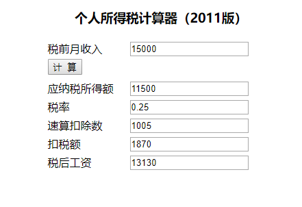
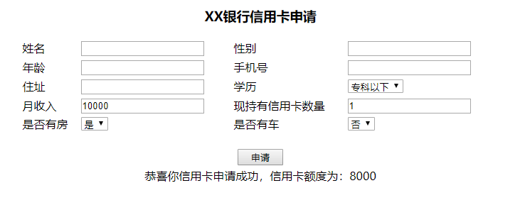
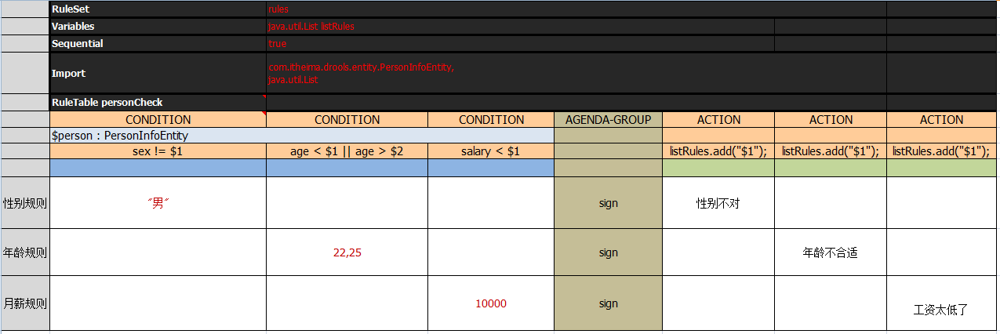
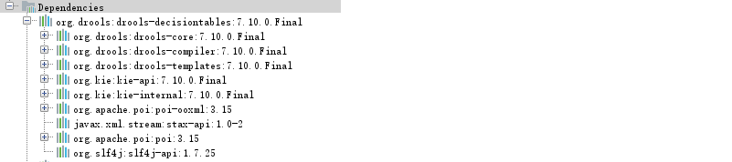
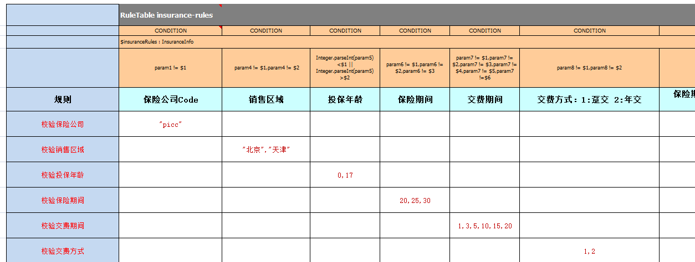

# Drools 实战篇

## 9. Drools实战

### 9.1 个人所得税计算器

本小节我们需要通过Drools规则引擎来根据规则计算个人所得税，最终页面效果如下：



#### 9.1.1 名词解释

税前月收入：即税前工资，指交纳个人所得税之前的总工资

应纳税所得额：指按照税法规定确定纳税人在一定期间所获得的所有应税收入减除在该纳税期间依法允许减除的各种支出后的余额

税率：是对征税对象的征收比例或征收额度

速算扣除数：指为解决超额累进税率分级计算税额的复杂技术问题，而预先计算出的一个数据，可以简化计算过程

扣税额：是指实际缴纳的税额

税后工资：是指扣完税后实际到手的工资收入

#### 9.1.2 计算规则

要实现个人所得税计算器，需要了解如下计算规则：（2011）

| 规则编号 | 名称                        | 描述                                |
|:-----|:--------------------------|:----------------------------------|
| 1    | 计算应纳税所得额                  | 应纳税所得额为税前工资减去3500                 |
| 2    | 设置税率，应纳税所得额<=1500         | 税率为0.03，速算扣除数为0                   |
| 3    | 设置税率，应纳税所得额在1500至4500之间   | 税率为0.1，速算扣除数为105                  |
| 4    | 设置税率，应纳税所得额在4500志9000之间   | 税率为0.2，速算扣除数为555                  |
| 5    | 设置税率，应纳税所得额在9000志35000之间  | 税率为0.25，速算扣除数为1005                |
| 6    | 设置税率，应纳税所得额在35000至55000之间 | 税率为0.3，速算扣除数为2755                 |
| 7    | 设置税率，应纳税所得额在55000至80000之间 | 税率为0.35，速算扣除数为5505                |
| 8    | 设置税率，应纳税所得额在80000以上       | 税率为0.45，速算扣除数为13505               |
| 9    | 计算税后工资                    | 扣税额=应纳税所得额*税率-速算扣除数 税后工资=税前工资-扣税额 |


计算案例：

```text
税前工资：10000
应缴纳所得税：10000-3500 = 6500
税率：0.2
速算扣除数：555

扣税额：6500 * 0.2 - 555 = 745

税后工资：10000 - 745 = 9255
```

#### 9.1.3 实现步骤

本实战案例我们基于Spring Boot整合Drools的方式来实现。

第一步：创建maven工程calculation并配置pom.xml文件

```xml
<?xml version="1.0" encoding="UTF-8"?>
<project xmlns="http://maven.apache.org/POM/4.0.0"
         xmlns:xsi="http://www.w3.org/2001/XMLSchema-instance"
         xsi:schemaLocation="http://maven.apache.org/POM/4.0.0 http://maven.apache.org/xsd/maven-4.0.0.xsd">
    <modelVersion>4.0.0</modelVersion>

    <parent>
        <groupId>org.springframework.boot</groupId>
        <artifactId>spring-boot-starters</artifactId>
        <version>2.0.6.RELEASE</version>
    </parent>

    <groupId>com.zmn</groupId>
    <artifactId>drools-action-calculation</artifactId>
    <version>1.0-SNAPSHOT</version>

    <properties>
        <maven.compiler.source>8</maven.compiler.source>
        <maven.compiler.target>8</maven.compiler.target>
    </properties>
    
    <dependencies>
        <dependency>
            <groupId>org.springframework.boot</groupId>
            <artifactId>spring-boot-starter-web</artifactId>
        </dependency>
        <dependency>
            <groupId>org.springframework.boot</groupId>
            <artifactId>spring-boot-starter-aop</artifactId>
        </dependency>
        <dependency>
            <groupId>org.springframework.boot</groupId>
            <artifactId>spring-boot-starter-test</artifactId>
        </dependency>
        <dependency>
            <groupId>commons-lang</groupId>
            <artifactId>commons-lang</artifactId>
            <version>2.6</version>
        </dependency>
        <dependency>
            <groupId>org.projectlombok</groupId>
            <artifactId>lombok</artifactId>
            <version>1.18.22</version>
        </dependency>
        <!--drools规则引擎-->
        <dependency>
            <groupId>org.drools</groupId>
            <artifactId>drools-core</artifactId>
            <version>7.6.0.Final</version>
        </dependency>
        <dependency>
            <groupId>org.drools</groupId>
            <artifactId>drools-compiler</artifactId>
            <version>7.6.0.Final</version>
        </dependency>
        <dependency>
            <groupId>org.drools</groupId>
            <artifactId>drools-templates</artifactId>
            <version>7.6.0.Final</version>
        </dependency>
        <dependency>
            <groupId>org.kie</groupId>
            <artifactId>kie-api</artifactId>
            <version>7.6.0.Final</version>
        </dependency>
        <dependency>
            <groupId>org.kie</groupId>
            <artifactId>kie-spring</artifactId>
            <exclusions>
                <exclusion>
                    <groupId>org.springframework</groupId>
                    <artifactId>spring-tx</artifactId>
                </exclusion>
                <exclusion>
                    <groupId>org.springframework</groupId>
                    <artifactId>spring-beans</artifactId>
                </exclusion>
                <exclusion>
                    <groupId>org.springframework</groupId>
                    <artifactId>spring-core</artifactId>
                </exclusion>
                <exclusion>
                    <groupId>org.springframework</groupId>
                    <artifactId>spring-context</artifactId>
                </exclusion>
            </exclusions>
            <version>7.6.0.Final</version>
        </dependency>
    </dependencies>

    <build>
        <finalName>${project.artifactId}</finalName>
        <resources>
            <resource>
                <directory>src/main/java</directory>
                <includes>
                    <include>**/*.xml</include>
                </includes>
                <filtering>false</filtering>
            </resource>
            <resource>
                <directory>src/main/resources</directory>
                <includes>
                    <include>**/*.*</include>
                </includes>
                <filtering>false</filtering>
            </resource>
        </resources>
        <plugins>
            <plugin>
                <groupId>org.apache.maven.plugins</groupId>
                <artifactId>maven-compiler-plugin</artifactId>
                <version>2.3.2</version>
                <configuration>
                    <source>1.8</source>
                    <target>1.8</target>
                </configuration>
            </plugin>
        </plugins>
    </build>

</project>
```

第二步：创建 `/resources/application.yml` 文件

```yml
server:
  port: 8080
spring:
  application:
    name: drools-action-calculation
```

第三步：编写配置类 `DroolsConfig`

```java{11}
@Configuration
public class DroolsConfig {

    //指定规则文件存放的目录
    private static final String RULES_PATH = "rules/";
    private final KieServices kieServices = KieServices.Factory.get();

    @Bean
    @ConditionalOnMissingBean
    public KieFileSystem kieFileSystem() throws IOException {// 创建文件系统
        System.setProperty("drools.dateformat","yyyy-MM-dd");// 指定时间格式
        KieFileSystem kieFileSystem = kieServices.newKieFileSystem();
        ResourcePatternResolver resourcePatternResolver = new PathMatchingResourcePatternResolver();
        Resource[] files = resourcePatternResolver.getResources("classpath*:" + RULES_PATH + "*.*");
        for (Resource file : files) {
            String path = String.format("%s%s", RULES_PATH, file.getFilename());
            kieFileSystem.write(ResourceFactory.newClassPathResource(path, "UTF-8"));
        }
        return kieFileSystem;
    }

    @Bean
    @ConditionalOnMissingBean
    public KieContainer kieContainer() throws IOException {// 创建容器对象
        KieRepository kieRepository = kieServices.getRepository();
        kieRepository.addKieModule(kieRepository::getDefaultReleaseId);
        KieBuilder kieBuilder = kieServices.newKieBuilder(kieFileSystem());
        kieBuilder.buildAll();
        return kieServices.newKieContainer(kieRepository.getDefaultReleaseId());
    }

    @Bean
    @ConditionalOnMissingBean
    public KieBase kieBase() throws IOException {
        return kieContainer().getKieBase();
    }

    @Bean
    @ConditionalOnMissingBean
    public KModuleBeanFactoryPostProcessor kiePostProcessor() {
        return new KModuleBeanFactoryPostProcessor();
    }

}
```

第四步：编写实体类 `Calculation`

```java
@Data
public class Calculation {
    //税前工资
    private double wage;
    //应纳税所得额
    private double wagemore;
    //税率
    private double cess;
    //速算扣除数
    private double preminus;
    //扣税额
    private double wageminus;
    //税后工资
    private double actualwage;
}
```

第五步：创建规则文件文件 `resources/rules/calculation.drl`

```drools{}
// 当前规则文件用于计算个人所得税
package calculation
import com.zmn.drools.entity.Calculation

// 当前规则文件中的规则，主要分为三类：
// 1.计算应纳税所得额 (1个)
// 2.设置税率和速算扣除数 (7个)
// 3.计算税后工资 (1个)

// 计算应纳税所得额
rule "计算应纳税所得额"
       salience 100 // 设置规则优先级
       date-effective "2011-09-01" // 设置规则生效时间
       no-loop true // 防止更新数据后，重新匹配导致死循环
    when
        $cal:Calculation(wage > 3500)
    then
        double wagemore = $cal.getWage() - 3500; // 计算应纳税所得额
        $cal.setWagemore(wagemore); // 设置应纳税所得额
        update($cal); // 更新应纳税所得额数据
end

// 设置税率和速算扣除数
rule "设置税率，应纳税所得额<=1500"
        salience 90 // 设置规则优先级
        no-loop true // 防止更新数据后，重新匹配导致死循环
        // 如果边界值设置得当，可以省略 agenda-group 分组
    when
        $cal:Calculation(wagemore <= 1500)
    then
        $cal.setCess(0.03); // 设置税率
        $cal.setPreminus(0); // 设置速算扣除数
        update($cal);
end

rule "设置税率，应纳税所得额在1500至4500之间"
        salience 90 // 设置规则优先级
        no-loop true // 防止更新数据后，重新匹配导致死循环
    when
        $cal:Calculation(wagemore <= 4500 && wagemore > 1500)
    then
        $cal.setCess(0.1); // 设置税率
        $cal.setPreminus(105); // 设置速算扣除数
        update($cal);
end

rule "设置税率，应纳税所得额在4500志9000之间"
        salience 90 // 设置规则优先级
        no-loop true // 防止更新数据后，重新匹配导致死循环
    when
        $cal:Calculation(wagemore <= 9000 && wagemore > 4500)
    then
        $cal.setCess(0.2); // 设置税率
        $cal.setPreminus(555); // 设置速算扣除数
        update($cal);
end

rule "设置税率，应纳税所得额在9000志35000之间"
        salience 90 // 设置规则优先级
        no-loop true // 防止更新数据后，重新匹配导致死循环
    when
        $cal:Calculation(wagemore <= 35000 && wagemore > 9000)
    then
        $cal.setCess(0.25); // 设置税率
        $cal.setPreminus(1005); // 设置速算扣除数
        update($cal);
end

rule "设置税率，应纳税所得额在35000至55000之间"
        salience 90 // 设置规则优先级
        no-loop true // 防止更新数据后，重新匹配导致死循环
    when
        $cal:Calculation(wagemore <= 55000 && wagemore > 35000)
    then
        $cal.setCess(0.3); // 设置税率
        $cal.setPreminus(2755); // 设置速算扣除数
        update($cal);
end

rule "设置税率，应纳税所得额在55000至80000之间"
        salience 90 // 设置规则优先级
        no-loop true // 防止更新数据后，重新匹配导致死循环
    when
        $cal:Calculation(wagemore <= 80000 && wagemore > 55000)
    then
        $cal.setCess(0.35); // 设置税率
        $cal.setPreminus(5505); // 设置速算扣除数
        update($cal);
end

rule "设置税率，应纳税所得额在80000以上"
        salience 90 // 设置规则优先级
        no-loop true // 防止更新数据后，重新匹配导致死循环
    when
        $cal:Calculation(wagemore > 80000)
    then
        $cal.setCess(0.45); // 设置税率
        $cal.setPreminus(13505); // 设置速算扣除数
        update($cal);
end

rule "计算税后工资"
        salience 80
    when
        $cal:Calculation(wage > 0 && wagemore > 0 && cess > 0)
    then
        double wageminus = $cal.getWagemore() * $cal.getCess() - $cal.getPreminus(); // 计算扣税额
        double actualwage = $cal.getWage() - wageminus; // 计算税后工资
        $cal.setWageminus(wageminus);
        $cal.setActualwage(actualwage);
        update($cal);
end
```

第六步：创建RuleService

```java
@Service
public class RuleService {

    @Autowired
    private KieBase kieBase;

    //个人所得税计算
    public Calculation calculate(Calculation calculation) {
        KieSession kieSession = kieBase.newKieSession();
        kieSession.insert(calculation);
        kieSession.fireAllRules();
        kieSession.dispose();
        return calculation;
    }

}
```

第七步：创建RuleController

```java
@RestController
@RequestMapping("/rule")
public class RuleController {

    @Autowired
    private RuleService ruleService;

    @RequestMapping("/calculate")
    public Calculation calculate(double wage){
        Calculation calculation = new Calculation();
        calculation.setWage(wage);
        calculation = ruleService.calculate(calculation);
        System.out.println(calculation);
        return calculation;
    }

}
```

第八步：创建启动类 `DroolsApplication`

```java
@SpringBootApplication
public class DroolsApplication {

    public static void main(String[] args) {
        SpringApplication.run(DroolsApplication.class);
    }

}
```

第九步：导入静态资源文件到 `resources/static` 目录下

### 9.2 信用卡申请

本小节我们需要通过Drools规则引擎来根据规则进行申请人的合法性检查，检查通过后再根据规则确定信用卡额度，最终页面效果如下：



#### 9.2.1 计算规则

合法性检查规则如下：

| 规则编号 | 名称            | 描述                                                |
|:-----|:--------------|:--------------------------------------------------|
| 1    | 检查学历与薪水1      | 如果申请人既没房也没车，同时学历为大专以下，并且月薪少于5000，那么不通过            |
| 2    | 检查学历与薪水2      | 如果申请人既没房也没车，同时学历为大专或本科，并且月薪少于3000，那么不通过           |
| 3    | 检查学历与薪水3      | 如果申请人既没房也没车，同时学历为本科以上，并且月薪少于2000，同时之前没有信用卡的，那么不通过 |
| 4    | 检查申请人已有的信用卡数量 | 如果申请人现有的信用卡数量大于10，那么不通过                           |

信用卡额度确定规则：

| 规则编号 | 名称  | 描述                                                  |
|:-----|:----|:----------------------------------------------------|
| 1    | 规则1 | 如果申请人有房有车，或者月收入在20000以上，那么发放的信用卡额度为15000            |
| 2    | 规则2 | 如果申请人没房没车，但月收入在10000~20000之间，那么发放的信用卡额度为6000        |
| 3    | 规则3 | 如果申请人没房没车，月收入在10000以下，那么发放的信用卡额度为3000               |
| 4    | 规则4 | 如果申请人有房没车或者没房但有车，月收入在10000以下，那么发放的信用卡额度为5000        |
| 5    | 规则5 | 如果申请人有房没车或者是没房但有车，月收入在10000~20000之间，那么发放的信用卡额度为8000 |

#### 9.2.2 实现步骤

第一步：创建maven工程 drools-action-card 并配置 `pom.xml` 文件

```xml
<?xml version="1.0" encoding="UTF-8"?>
<project xmlns="http://maven.apache.org/POM/4.0.0"
         xmlns:xsi="http://www.w3.org/2001/XMLSchema-instance"
         xsi:schemaLocation="http://maven.apache.org/POM/4.0.0 http://maven.apache.org/xsd/maven-4.0.0.xsd">
    <modelVersion>4.0.0</modelVersion>

    <parent>
        <groupId>org.springframework.boot</groupId>
        <artifactId>spring-boot-starters</artifactId>
        <version>2.0.6.RELEASE</version>
    </parent>

    <groupId>com.zmn</groupId>
    <artifactId>drools-action-card</artifactId>
    <version>1.0-SNAPSHOT</version>

    <properties>
        <maven.compiler.source>8</maven.compiler.source>
        <maven.compiler.target>8</maven.compiler.target>
    </properties>

    <dependencies>
        <dependency>
            <groupId>org.springframework.boot</groupId>
            <artifactId>spring-boot-starter-web</artifactId>
        </dependency>
        <dependency>
            <groupId>org.springframework.boot</groupId>
            <artifactId>spring-boot-starter-aop</artifactId>
        </dependency>
        <dependency>
            <groupId>org.springframework.boot</groupId>
            <artifactId>spring-boot-starter-test</artifactId>
        </dependency>
        <dependency>
            <groupId>commons-lang</groupId>
            <artifactId>commons-lang</artifactId>
            <version>2.6</version>
        </dependency>
        <dependency>
            <groupId>org.projectlombok</groupId>
            <artifactId>lombok</artifactId>
            <version>1.18.22</version>
        </dependency>

        <!--drools规则引擎-->
        <dependency>
            <groupId>org.drools</groupId>
            <artifactId>drools-core</artifactId>
            <version>7.6.0.Final</version>
        </dependency>
        <dependency>
            <groupId>org.drools</groupId>
            <artifactId>drools-compiler</artifactId>
            <version>7.6.0.Final</version>
        </dependency>
        <dependency>
            <groupId>org.drools</groupId>
            <artifactId>drools-templates</artifactId>
            <version>7.6.0.Final</version>
        </dependency>
        <dependency>
            <groupId>org.kie</groupId>
            <artifactId>kie-api</artifactId>
            <version>7.6.0.Final</version>
        </dependency>
        <dependency>
            <groupId>org.kie</groupId>
            <artifactId>kie-spring</artifactId>
            <exclusions>
                <exclusion>
                    <groupId>org.springframework</groupId>
                    <artifactId>spring-tx</artifactId>
                </exclusion>
                <exclusion>
                    <groupId>org.springframework</groupId>
                    <artifactId>spring-beans</artifactId>
                </exclusion>
                <exclusion>
                    <groupId>org.springframework</groupId>
                    <artifactId>spring-core</artifactId>
                </exclusion>
                <exclusion>
                    <groupId>org.springframework</groupId>
                    <artifactId>spring-context</artifactId>
                </exclusion>
            </exclusions>
            <version>7.6.0.Final</version>
        </dependency>
    </dependencies>
    <build>
        <finalName>${project.artifactId}</finalName>
        <resources>
            <resource>
                <directory>src/main/java</directory>
                <includes>
                    <include>**/*.xml</include>
                </includes>
                <filtering>false</filtering>
            </resource>
            <resource>
                <directory>src/main/resources</directory>
                <includes>
                    <include>**/*.*</include>
                </includes>
                <filtering>false</filtering>
            </resource>
        </resources>
        <plugins>
            <plugin>
                <groupId>org.apache.maven.plugins</groupId>
                <artifactId>maven-compiler-plugin</artifactId>
                <version>2.3.2</version>
                <configuration>
                    <source>1.8</source>
                    <target>1.8</target>
                </configuration>
            </plugin>
        </plugins>
    </build>

</project>
```

第二步：创建 `/resources/application.yml` 文件

```yml
server:
  port: 8080
spring:
  application:
    name: drools-action-card
```

第三步：编写配置类 `DroolsConfig`

```java
@Configuration
public class DroolsConfig {

    //指定规则文件存放的目录
    private static final String RULES_PATH = "rules/";
    private final KieServices kieServices = KieServices.Factory.get();

    @Bean
    @ConditionalOnMissingBean
    public KieFileSystem kieFileSystem() throws IOException {
        KieFileSystem kieFileSystem = kieServices.newKieFileSystem();
        ResourcePatternResolver resourcePatternResolver =
                new PathMatchingResourcePatternResolver();
        Resource[] files = resourcePatternResolver.getResources("classpath*:" + RULES_PATH + "*.*");
        for (Resource file : files) {
            String path = String.format("%s%s", RULES_PATH, file.getFilename());
            kieFileSystem.write(ResourceFactory.newClassPathResource(path, "UTF-8"));
        }
        return kieFileSystem;
    }

    @Bean
    @ConditionalOnMissingBean
    public KieContainer kieContainer() throws IOException {
        KieRepository kieRepository = kieServices.getRepository();
        kieRepository.addKieModule(kieRepository::getDefaultReleaseId);
        KieBuilder kieBuilder = kieServices.newKieBuilder(kieFileSystem());
        kieBuilder.buildAll();
        return kieServices.newKieContainer(kieRepository.getDefaultReleaseId());
    }

    @Bean
    @ConditionalOnMissingBean
    public KieBase kieBase() throws IOException {
        return kieContainer().getKieBase();
    }

    @Bean
    @ConditionalOnMissingBean
    public KModuleBeanFactoryPostProcessor kiePostProcessor() {
        return new KModuleBeanFactoryPostProcessor();
    }

}
```

第四步：编写实体类 `CreditCardApplyInfo`

```java
@Data
public class CreditCardApplyInfo {

    public static final String EDUCATION_1 = "专科以下";
    public static final String EDUCATION_2 = "专科";
    public static final String EDUCATION_3 = "本科";
    public static final String EDUCATION_4 = "本科以上";

    private String name;
    private String sex;
    private int age;
    private String education;
    private String telephone;
    private double monthlyIncome = 0;//月收入
    private String address;

    private boolean hasHouse = false;//是否有房
    private boolean hasCar = false;//是否有车
    private int hasCreditCardCount = 0;//现持有信用卡数量

    private boolean checkResult = true;//审核是否通过
    private double quota = 0;//额度

    @Override
    public String toString() {
        if(checkResult){
            return "审核通过，信用卡额度为：" + quota;
        }else {
            return "审核不通过";
        }
    }
}
```

第五步：创建规则文件 `resources/rules/creditCardApply.drl` 文件

```drools{}
package com.itheima.creditCardApply
import com.itheima.drools.entity.CreditCardApplyInfo

//合法性检查
rule "如果申请人既没房也没车，同时学历为大专以下，并且月薪少于5000，那么不通过"
    salience 10
    no-loop true
    when
        $c:CreditCardApplyInfo(hasCar == false &&
                                hasHouse == false &&
                                education == CreditCardApplyInfo.EDUCATION_1 &&
                                monthlyIncome < 5000)
    then
        $c.setCheckResult(false);
        drools.halt();
end
rule "如果申请人既没房也没车，同时学历为大专或本科，并且月薪少于3000，那么不通过"
    salience 10
    no-loop true
    when
        $c:CreditCardApplyInfo(hasCar == false &&
                                hasHouse == false &&
                                (education == CreditCardApplyInfo.EDUCATION_2  ||
                                education == CreditCardApplyInfo.EDUCATION_3) &&
                                monthlyIncome < 3000)
    then
        $c.setCheckResult(false);
        drools.halt();
end
rule "如果申请人既没房也没车，同时学历为本科以上，并且月薪少于2000，同时之前没有信用卡的，那么不通过"
    salience 10
    no-loop true
    when
        $c:CreditCardApplyInfo(hasCar == false &&
                                hasHouse == false &&
                                education == CreditCardApplyInfo.EDUCATION_4 &&
                                monthlyIncome < 2000 &&
                                hasCreditCardCount == 0)
    then
        $c.setCheckResult(false);
        drools.halt();
end
rule "如果申请人现有的信用卡数量大于10，那么不通过"
    salience 10
    no-loop true
    when
        $c:CreditCardApplyInfo(hasCreditCardCount > 10)
    then
        $c.setCheckResult(false);
        drools.halt();
end
//--------------------------------------------------------------------------
//确定额度
rule "如果申请人有房有车，或者月收入在20000以上，那么发放的信用卡额度为15000"
    salience 1
    no-loop true
    activation-group "quota_group"
    when
        $c:CreditCardApplyInfo(checkResult == true &&
                                ((hasHouse == true && hasCar == true) ||
                                (monthlyIncome > 20000)))
    then
        $c.setQuota(15000);
end
rule "如果申请人没房没车，但月收入在10000~20000之间，那么发放的信用卡额度为6000"
    salience 1
    no-loop true
    activation-group "quota_group"
    when
        $c:CreditCardApplyInfo(checkResult == true &&
                                hasHouse == false &&
                                hasCar == false &&
                                monthlyIncome >= 10000 &&
                                monthlyIncome <= 20000)
    then
        $c.setQuota(6000);
end
rule "如果申请人没房没车，月收入在10000以下，那么发放的信用卡额度为3000"
    salience 1
    no-loop true
    activation-group "quota_group"
    when
        $c:CreditCardApplyInfo(checkResult == true &&
                                        hasHouse == false &&
                                        hasCar == false &&
                                        monthlyIncome < 10000)
    then
        $c.setQuota(3000);
end
rule "如果申请人有房没车或者没房但有车，月收入在10000以下，那么发放的信用卡额度为5000"
    salience 1
    no-loop true
    activation-group "quota_group"
    when
        $c:CreditCardApplyInfo(checkResult == true &&
                                ((hasHouse == true && hasCar == false) ||
                                (hasHouse == false && hasCar == true)) &&
                                monthlyIncome < 10000)
    then
        $c.setQuota(5000);
end
rule "如果申请人有房没车或者是没房但有车，月收入在10000~20000之间，那么发放的信用卡额度为8000"
    salience 1
    no-loop true
    activation-group "quota_group"
    when
        $c:CreditCardApplyInfo(checkResult == true &&
                                ((hasHouse == true && hasCar == false) ||
                                (hasHouse == false && hasCar == true)) &&
                                monthlyIncome >= 10000 &&
                                monthlyIncome <= 20000)
    then
        $c.setQuota(8000);
end
```

第六步：创建 `RuleService`

```java
@Service
public class RuleService {

    @Autowired
    private KieBase kieBase;

    //调用Drools规则引擎实现信用卡申请
    public CreditCardApplyInfo creditCardApply(CreditCardApplyInfo creditCardApplyInfo) {
        KieSession session = kieBase.newKieSession();
        session.insert(creditCardApplyInfo);
        session.fireAllRules();
        session.dispose();
        return creditCardApplyInfo;
    }
    
}
```

第七步：创建 `RuleController`

```java
@RestController
@RequestMapping("/rule")
public class RuleController {

    @Autowired
    private RuleService ruleService;

    @RequestMapping("/creditCardApply")
    public CreditCardApplyInfo creditCardApply(@RequestBody CreditCardApplyInfo creditCardApplyInfo) {
        creditCardApplyInfo = ruleService.creditCardApply(creditCardApplyInfo);
        System.out.println(creditCardApplyInfo);
        return creditCardApplyInfo;
    }

}
```

第八步：创建启动类 `DroolsApplication`

```java
@SpringBootApplication
public class DroolsApplication {
    public static void main(String[] args) {
        SpringApplication.run(DroolsApplication.class);
    }
}
```

### 9.3 保险产品准入规则

#### 9.3.1 决策表

前面的课程中我们编写的规则文件都是 `drl` 形式的文件，Drools除了支持 `drl` 形式的文件外还支持 `xls` 格式的文件(即Excel文件)。
这种 `xls` 格式的文件通常称为决策表(decision table)。

决策表(decision table)是一个"精确而紧凑的"表示条件逻辑的方式，非常适合商业级别的规则。
决策表与现有的 `drl` 文件可以无缝替换。Drools提供了相应的API可以将 `xls` 文件编译为 `drl` 格式的字符串。

一个决策表的例子如下：



决策表语法：

| 关键字            | 说明                                                                         | 是否必须                                          |
|:---------------|:---------------------------------------------------------------------------|:----------------------------------------------|
| `RuleSet`      | 相当于drl文件中的 `package`                                                       | 必须，只能有一个。如果没有设置RuleSet对应的值则使用默认值 `rule_table` |
| `Sequential`   | 取值为Boolean类型。true表示规则按照表格自上到下的顺序执行，false表示乱序                               | 可选                                            |
| `Import`       | 相当于drl文件中的 `import`，如果引入多个类则类之间用逗号分隔                                       | 可选                                            |
| `Variables`    | 相当于drl文件中的 `global`，用于定义全局变量，如果有多个全局变量则中间用逗号分隔                             | 可选                                            |
| `RuleTable`    | 它指示了后面将会有一批rule，RuleTable的名称将会作为以后生成rule的前缀                                | 必须                                            |
| `CONDITION`    | 规则条件关键字，相当于drl文件中的 `when`。下面两行则表示 LHS 部分，第三行则为注释行，不计为规则部分，从第四行开始，每一行表示一条规则 | 每个规则表至少有一个                                    |
| `ACTION`       | 规则结果关键字，相当于drl文件中的 `then`                                                  | 每个规则表至少有一个                                    |
| `NO-LOOP`      | 相当于drl文件中的 `no-loop`                                                       | 可选                                            |
| `AGENDA-GROUP` | 相当于drl文件中的 `agenda-group`                                                  | 可选                                            |

在决策表中还经常使用到占位符，语法为 `$` 后面加数字，用于替换每条规则中设置的具体值。

> 如果一行条件有多条，编译后多个条件使用 `,` 分隔，他们是 `and` 关系。(`,`分隔可以代替 `and`)

上面的决策表例子转换为 `drl` 格式的规则文件内容如下：

```drools{}
package rules;

import com.zmn.drools.entity.PersonInfoEntity;
import java.util.List;

global java.util.List listRules;

rule "personCheck_10"
    salience 65535
    agenda-group "sign"
    when
        $person : PersonInfoEntity(sex != "男")
    then
        listRules.add("性别不对");
end

rule "personCheck_11"
    salience 65534
    agenda-group "sign"
    when
        $person : PersonInfoEntity(age < 22 || age > 25)
    then
        listRules.add("年龄不合适");
end

rule "personCheck_12"
    salience 65533
    agenda-group "sign"
    when
        $person : PersonInfoEntity(salary < 10000)
    then
        listRules.add("工资太低了");
end
```

要进行决策表相关操作，需要导入如下maven坐标：

```xml
<dependency>
    <groupId>org.drools</groupId>
    <artifactId>drools-decisiontables</artifactId>
    <version>7.10.0.Final</version>
</dependency>
```

通过下图可以发现，由于maven的依赖传递特性在导入 `drools-decisiontables` 坐标后，
`drools-core` 和 `drools-compiler` 等坐标也被传递了过来。



Drools提供的将 `xls` 文件编译为 `drl` 格式字符串的API如下：

```java{}
String realPath = "C:\\testRule.xls";//指定决策表xls文件的磁盘路径
File file = new File(realPath);
InputStream is = new FileInputStream(file);
SpreadsheetCompiler compiler = new SpreadsheetCompiler();
String drl = compiler.compile(is, InputType.XLS);
```

Drools还提供了基于 `drl` 格式字符串创建 `KieSession` 的API：

```java{}
KieHelper kieHelper = new KieHelper();
kieHelper.addContent(drl, ResourceType.DRL);
KieSession session = kieHelper.build().newKieSession();
```

基于决策表的入门案例：

第一步：创建maven工程 `drools_decision_table_demo` 并配置 `pom.xml` 文件

```xml
<dependencies>
    <dependency>
        <groupId>org.drools</groupId>
        <artifactId>drools-decisiontables</artifactId>
        <version>7.10.0.Final</version>
    </dependency>
    <dependency>
        <groupId>junit</groupId>
        <artifactId>junit</artifactId>
        <version>4.12</version>
    </dependency>
    <dependency>
        <groupId>org.projectlombok</groupId>
        <artifactId>lombok</artifactId>
        <version>1.18.22</version>
    </dependency>
</dependencies>
```

第二步：创建实体类 `PersonInfoEntity`

```java
@Data
public class PersonInfoEntity {
    private String sex;
    private int age;
    private double salary;
}
```

第三步：创建 `xls` 规则文件(可以直接使用资料中提供的 `testRule.xls` 文件)

第四步：创建单元测试

```java
public class DTTest {

    @Test
    public void test101() throws Exception {

        String realPath = "/Users/faustine/Downloads/test_files/testRule.xls";//指定决策表xls文件的磁盘路径
        File file = new File(realPath);
        InputStream is = new FileInputStream(file);
        SpreadsheetCompiler compiler = new SpreadsheetCompiler();
        String drl = compiler.compile(is, InputType.XLS);

        System.out.println(drl);

        // 通过 drl 字符串获取 kieSession
        KieHelper kieHelper = new KieHelper();
        kieHelper.addContent(drl, ResourceType.DRL);
        KieSession session = kieHelper.build().newKieSession();

        // 封装测试用例对象
        PersonInfoEntity personInfoEntity = new PersonInfoEntity();
        personInfoEntity.setSex("男");
        personInfoEntity.setAge(35);
        personInfoEntity.setSalary(1000);

        List<String> list = new ArrayList<>();
        session.setGlobal("listRules",list);

        session.insert(personInfoEntity);
        session.getAgenda().getAgendaGroup("sign").setFocus();
        session.fireAllRules();

        list.forEach(System.out::println);

        session.dispose(); // 关闭会话

    }

}
```

#### 9.3.2 规则介绍

各保险公司针对人身、财产推出了不同的保险产品，作为商业保险公司，筛选出符合公司利益最大化的客户是非常重要的，
即各保险产品的准入人群是不同的，也就是说保险公司会针对不同的人群特征，制定不同的产品缴费和赔付规则。

我们来看一下某保险产品准入规则的简化版，当不满足以下规则时，系统模块需要返回准入失败标识和失败原因

| 规则   | 说明                                            |
|------|-----------------------------------------------|
| 规则1  | 保险公司是：PICC                                    |
| 规则2  | 销售区域是：北京、天津                                   |
| 规则3  | 投保人年龄：0 ~ 17岁                                 |
| 规则4  | 保险期间是：20年、25年、30年                             |
| 规则5  | 缴费方式是：趸交（一次性交清）或年交                            |
| 规则6  | 保险期与交费期规则一：保险期间为20年期交费期间最长10年交且不能选择*趸交*       |
| 规则7  | 保险期与交费期规则二：保险期间为25年期交费期间最长15年交且不能选择*趸交*       |
| 规则8  | 保险期与交费期规则三：保险期间为30年期交费期间最长20年交且不能选择*趸交*       |
| 规则9  | 被保人要求：（投保年龄+保险期间）不得大于40周岁                     |
| 规则10 | 保险金额规则：投保时约定，最低为5万元，超过部分必须为1000元的整数倍          |
| 规则11 | 出单基本保额限额规则：线上出单基本保额限额62.5万元，超62.5万元需配合契调转线下出单 |

在本案例中规则文件是一个Excel文件，业务人员可以直接更改这个文件中指标的值，系统不需要做任何变更。

#### 9.3.3 实现步骤

本案例还是基于Spring Boot整合Drools的架构来实现。

第一步：创建maven工程 `drools-action-insurence` 并配置 `pom.xml` 文件

```xml
<?xml version="1.0" encoding="UTF-8"?>
<project xmlns="http://maven.apache.org/POM/4.0.0"
         xmlns:xsi="http://www.w3.org/2001/XMLSchema-instance"
         xsi:schemaLocation="http://maven.apache.org/POM/4.0.0 http://maven.apache.org/xsd/maven-4.0.0.xsd">
    <modelVersion>4.0.0</modelVersion>

    <parent>
        <groupId>org.springframework.boot</groupId>
        <artifactId>spring-boot-starters</artifactId>
        <version>2.0.6.RELEASE</version>
    </parent>

    <groupId>com.zmn</groupId>
    <artifactId>drools-action-insurence</artifactId>
    <version>1.0-SNAPSHOT</version>

    <properties>
        <maven.compiler.source>8</maven.compiler.source>
        <maven.compiler.target>8</maven.compiler.target>
    </properties>

    <dependencies>
        <dependency>
            <groupId>org.springframework.boot</groupId>
            <artifactId>spring-boot-starter-web</artifactId>
        </dependency>
        <dependency>
            <groupId>org.springframework.boot</groupId>
            <artifactId>spring-boot-starter-aop</artifactId>
        </dependency>
        <dependency>
            <groupId>org.springframework.boot</groupId>
            <artifactId>spring-boot-starter-test</artifactId>
        </dependency>
        <dependency>
            <groupId>commons-lang</groupId>
            <artifactId>commons-lang</artifactId>
            <version>2.6</version>
        </dependency>
        <dependency>
            <groupId>org.projectlombok</groupId>
            <artifactId>lombok</artifactId>
            <version>1.18.22</version>
        </dependency>
        <!--drools规则引擎-->
        <dependency>
            <groupId>org.drools</groupId>
            <artifactId>drools-core</artifactId>
            <version>7.6.0.Final</version>
        </dependency>
        <dependency>
            <groupId>org.drools</groupId>
            <artifactId>drools-compiler</artifactId>
            <version>7.6.0.Final</version>
        </dependency>
        <dependency>
            <groupId>org.drools</groupId>
            <artifactId>drools-templates</artifactId>
            <version>7.6.0.Final</version>
        </dependency>
        <dependency>
            <groupId>org.kie</groupId>
            <artifactId>kie-api</artifactId>
            <version>7.6.0.Final</version>
        </dependency>
        <dependency>
            <groupId>org.kie</groupId>
            <artifactId>kie-spring</artifactId>
            <exclusions>
                <exclusion>
                    <groupId>org.springframework</groupId>
                    <artifactId>spring-tx</artifactId>
                </exclusion>
                <exclusion>
                    <groupId>org.springframework</groupId>
                    <artifactId>spring-beans</artifactId>
                </exclusion>
                <exclusion>
                    <groupId>org.springframework</groupId>
                    <artifactId>spring-core</artifactId>
                </exclusion>
                <exclusion>
                    <groupId>org.springframework</groupId>
                    <artifactId>spring-context</artifactId>
                </exclusion>
            </exclusions>
            <version>7.6.0.Final</version>
        </dependency>
    </dependencies>

    <build>
        <finalName>${project.artifactId}</finalName>
        <resources>
            <resource>
                <directory>src/main/java</directory>
                <includes>
                    <include>**/*.xml</include>
                </includes>
                <filtering>false</filtering>
            </resource>
            <resource>
                <directory>src/main/resources</directory>
                <includes>
                    <include>**/*.*</include>
                </includes>
                <filtering>false</filtering>
            </resource>
        </resources>
        <plugins>
            <plugin>
                <groupId>org.apache.maven.plugins</groupId>
                <artifactId>maven-compiler-plugin</artifactId>
                <version>2.3.2</version>
                <configuration>
                    <source>1.8</source>
                    <target>1.8</target>
                </configuration>
            </plugin>
        </plugins>
    </build>

</project>
```

第二步：创建 `/resources/application.yml` 文件

```yaml
server:
  port: 8080
spring:
  application:
    name: drools-action-insurence
```

第三步：创建实体类 `InsuranceInfo`

```java
@Data
public class InsuranceInfo {
    private String param1;//保险公司
    private String param2;//方案代码
    private String param3;//渠道号
    private String param4;//销售区域
    private String param5;//投保年龄
    private String param6;//保险期间
    private String param7;//缴费期间
    private String param8;//缴费方式
    private String param9;//保障类型
    private String param10;//等待期
    private String param11;//犹豫期
    private String param12;//职业类型
    private String param13;//保额限制
    private String param14;//免赔额
    private String param15;//主险保额
    private String param16;//主险保费
    private String param17;//附加险保额
    private String param18;//附加险保费
    private String param19;//与投保人关系
    private String param20;//与被保人关系
    private String param21;//性别
    private String param22;//证件
    private String param23;//保费
    private String param24;//保额
}
```

第四步：创建决策表文件（也可以直接使用实战资料中提供的 `insuranceInfoCheck.xls` 文件）



第五步：封装工具类 `KieSessionUtils`

```java
public class KieSessionUtils {

    // 单例
    private KieSessionUtils() {
    }

    // 把xls文件解析为String
    public static String getDRL (String realPath) throws FileNotFoundException {
        File file = new File(realPath); // 例如：C:\\abc.xls
        InputStream is = new FileInputStream(file);
        SpreadsheetCompiler compiler = new SpreadsheetCompiler();
        String drl = compiler.compile(is, InputType.XLS);
        System.out.println(drl);
        return drl;
    }

    // 根据 drl 字符串构建 KieSession
    public static KieSession createKieSessionFromDRL(String drl) throws Exception{// drl 为含有内容的字符串
        KieHelper kieHelper = new KieHelper();
        kieHelper.addContent(drl, ResourceType.DRL);
        Results results = kieHelper.verify();
        if (results.hasMessages(Message.Level.WARNING, Message.Level.ERROR)) {
            List<Message> messages = results.getMessages(Message.Level.WARNING, Message.Level.ERROR);
            for (Message message : messages) {
                System.out.println("Error: "+message.getText());
            }
            // throw new IllegalStateException("Compilation errors were found. Check the logs.");
        }
        return kieHelper.build().newKieSession();
    }

    // 加载 XLS 文件并构建 KieSession
    public static KieSession getKieSessionFromXLS(String realPath) throws Exception {// realPath为Excel文件绝对路径
        return createKieSessionFromDRL(getDRL(realPath));
    }

}
```

第六步：创建 `RuleService` 类

```java
@Service
public class RuleService {

    public List<String> insuranceInfoCheck(InsuranceInfo insuranceInfo) throws Exception{

        KieSession session = KieSessionUtils.getKieSessionFromXLS("/Users/faustine/Downloads/test_files/insuranceInfoCheck.xls");
        session.getAgenda().getAgendaGroup("sign").setFocus();

        session.insert(insuranceInfo);

        List<String> listRules = new ArrayList<>();
        session.setGlobal("listRules", listRules);

        session.fireAllRules();

        return listRules;
    }

}
```

第七步：创建 `RuleController` 类

```java
@RestController
@RequestMapping("/rule")
public class RuleController {

    @Autowired
    private RuleService ruleService;

    @RequestMapping("/insuranceInfoCheck")
    public Map insuranceInfoCheck(){

        Map map = new HashMap();

        //模拟数据，实际应为页面传递过来
        InsuranceInfo insuranceInfo = new InsuranceInfo();
        insuranceInfo.setParam1("picc");
        insuranceInfo.setParam4("上海");
        insuranceInfo.setParam5("101");
        insuranceInfo.setParam6("12");
        insuranceInfo.setParam7("222");
        insuranceInfo.setParam8("1");
        insuranceInfo.setParam13("3");

        try {
            List<String> list = ruleService.insuranceInfoCheck(insuranceInfo);
            if(list != null && list.size() > 0){
                map.put("checkResult",false);
                map.put("msg","准入失败");
                map.put("detail",list);
            }else{
                map.put("checkResult",true);
                map.put("msg","准入成功");
            }
            return map;
        } catch (Exception e) {
            e.printStackTrace();
            map.put("checkResult",false);
            map.put("msg","未知错误");
            return map;
        }
    }

}
```

第八步：创建启动类 `DroolsInsuranceApplication`

```java
@SpringBootApplication
public class DroolsInsuranceApplication {

    public static void main(String[] args) {
        SpringApplication.run(DroolsInsuranceApplication.class);
    }

}
```

