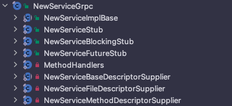

安装 Protocol Buffers 编译环境

下载地址：<https://github.com/protocolbuffers/protobuf>

配置环境变量：

```shell
# Protobuf
export PROTOCBUF_HOME=/opt/zmn/servers/protoc-21.2-osx-aarch_64
export PATH=$PATH:$PROTOCBUF_HOME/bin
```

测试命令：

```shell
protoc
```

生成代码详解


NewsProto 消息体的大类

- `NewsOrBuilder`/`NewsRequestOrBuilder`/`NewsResponseOrBuilder`  消息类与构造器接口
- `News`/`NewsRequest`/`NewsResponse`  具体的消息类实现



NewServiceGrpc gRPC 通信类的集合

- `XxxDescriptorSupplier`  gRPC 通信用的描述符文件 (元数据)
- `NewServiceBlockingStub`  同步通信客户端存根，产生阻塞；支持一元与服务端流数据通信
- `NewServiceFutureStub`  异步通信客户端存根，基于 Guava Future 实现，不支持流式处理
- `NewServiceStub`  异步通信客户端存根，支持双向流式传输
- `NewServiceImplBase`  服务器端的骨架类，继承这个类实现业务逻辑

> `XxxxStub` 这种的类都是供客户端使用的


## gRPC 通信模式

### 一元 RPC 通信模式

客户端向服务器发送单个请求并获得单个响应。

### 服务端流式 RPC 通信模式

从客户端发起一次请求，会产生从服务器的多次响应。

### 客户端流式 RPC 通信模式

从客户端发起不定次请求，产生从服务器的一次响应。

`requestObserver.onNext(request); ` => Server 端 `onNext()` => ... => `requestObserver.onCompleted()` => Server 端 `onCompleted()` => `responseObserver.onCompleted();`

### 双向流式 RPC 通信模式


