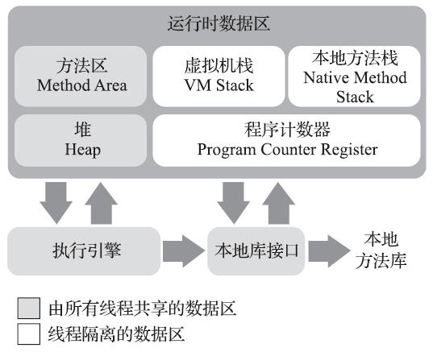
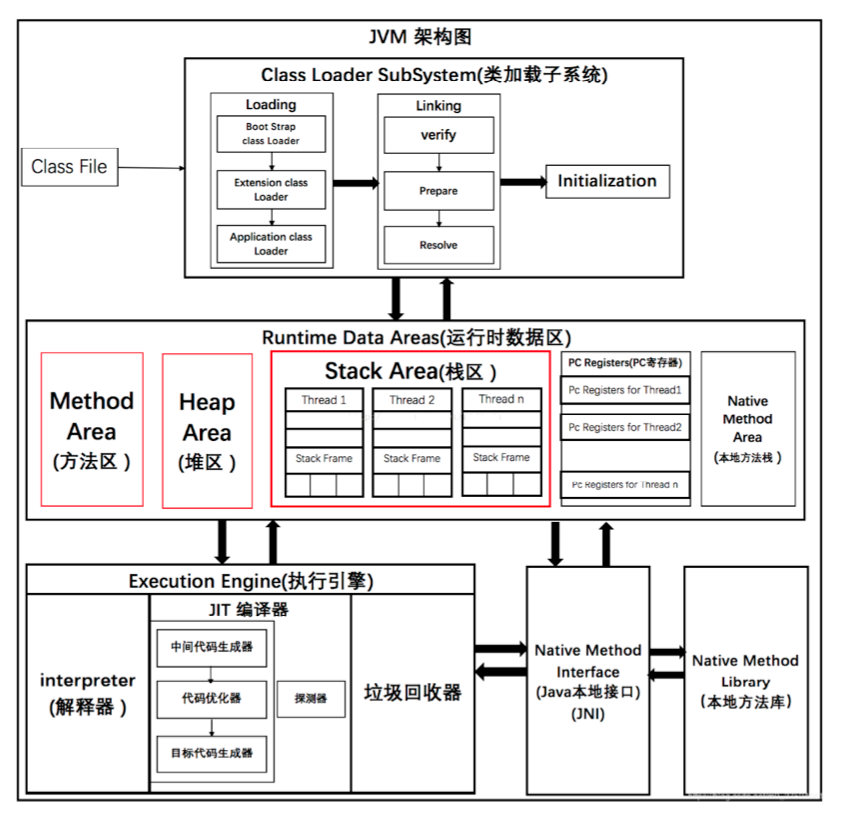
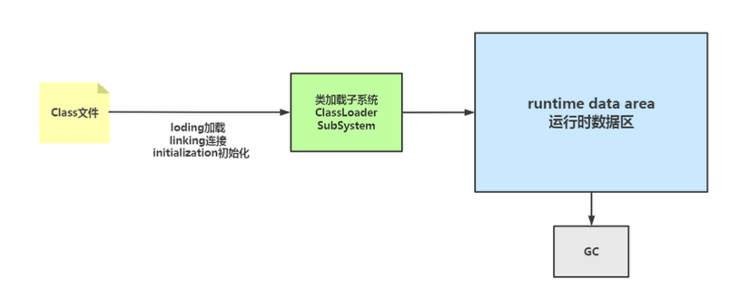
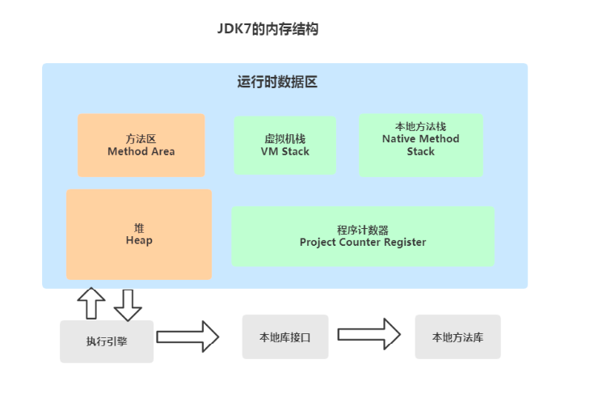
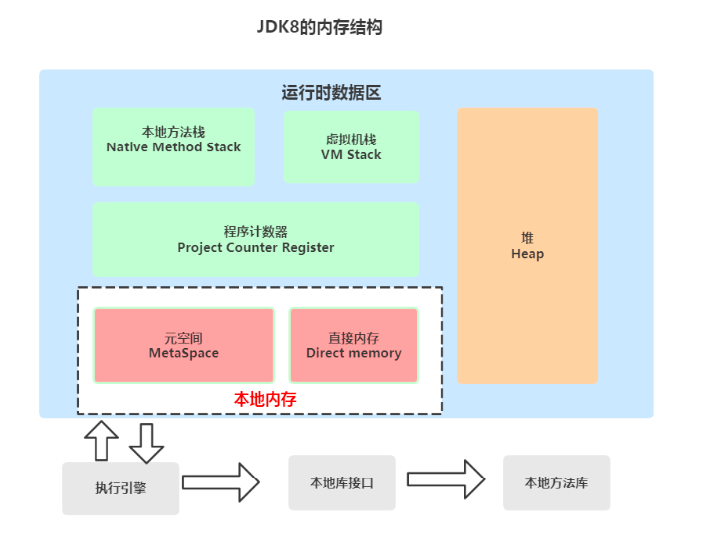
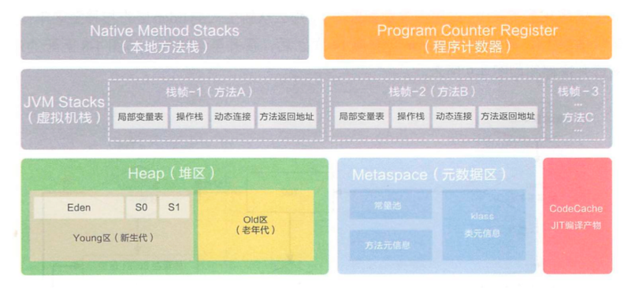
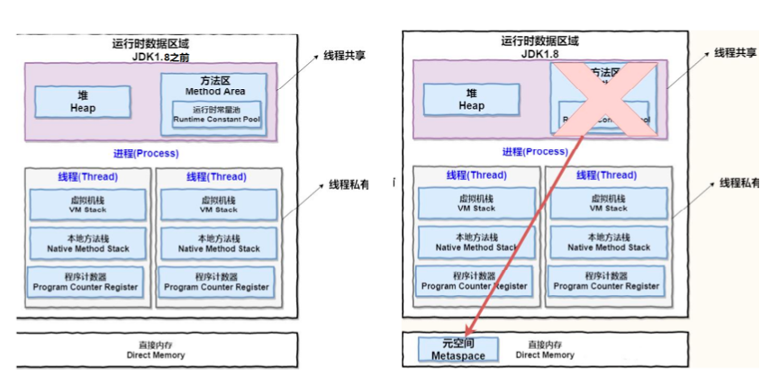

## 1.JVM 整体架构

::: tip 提示
根据 JVM 规范，JVM 内存共分为虚拟机栈、堆、方法区、程序计数器、本地方法栈五个部分。
:::

| 名称    | 特征                           | 作用                                       | 配置参数                                                                               | 异常                                   |
|-------|------------------------------|------------------------------------------|------------------------------------------------------------------------------------|--------------------------------------|
| 程序计数器 | 占用内存小，线程私有，生命周期与线程相同         | 大致为字节码行号指示器                              | 无                                                                                  | 无                                    |
| 虚拟机栈  | 线程私有，生命周期与线程相同，使用连续的内存空间     | Java 方法执行的内存模型，存储局部变量表、 操作栈、动态链接、方法出口等信息 | -Xss                                                                               | StackOverflowError/ OutOfMemoryError |
| 堆     | 线程共享，生命周期与虚拟机相同，可以不使用连续的内存地址 | 保存对象实例，所有对象实例(包括数组)都要在堆上分配               | -Xms -Xsx -Xmn                                                                     | OutOfMemoryError                     |
| 方法区   | 线程共享，生命周期与虚拟机相同，可以不使用连续的内存地址 | 存储已被虚拟机加载的类信息、常量、静态变量、即时编译器编译后的代码等数据     | -XX:PermSize:16M -XX:MaxPermSize64M/-XX:MetaspaceSize=16M -XX:MaxMetaspaceSize=64M | OutOfMemoryError                     |
| 本地方法栈 | 线程私有                         | 为虚拟机使用到的 Native 方法服务                     | 无                                                                                  | StackOverflowError/ OutOfMemoryError |

::: tip 提示
JVM 分为五大模块: 类装载器子系统、 运行时数据区、 执行引擎、 本地方法接口和垃圾收集模块 。
:::

## 2.JVM 运行时内存

Java 虚拟机有自动内存管理机制，如果出现面的问题，排查错误就必须要了解虚拟机是怎样使用内存的。

**Java7 和 Java8 内存结构的不同主要体现在方法区的实现**

方法区是 Java 虚拟机规范中定义的一种概念上的区域，不同的厂商可以对虚拟机进行不同的实现。

我们通常使用的 Java SE 都是由 Sun JDK 和 OpenJDK 所提供，这也是应用最广泛的版本。而该版本使用的 VM 就是 HotSpot VM。
通常情况下，我们所讲的java虚拟机指的就是HotSpot的版本。

**JDK7 内存结构**

**JDK8 的内存结构**

针对 JDK8 虚拟机内存详解

**JDK7 和 JDK8 变化小结**

线程私有的

1. 程序计数器
2. 虚拟机栈
3. 本地方法栈

线程共享的

1. 堆
2. 方法区 直接内存(非运行时数据区的一部分)

**对于 Java8，HotSpots 取消了永久代，那么是不是就没有方法区了呢?** 

当然不是，方法区只是一个规范，只不过它的实现变了。

在 Java8 中，元空间(Metaspace)登上舞台，方法区存在于元空间(Metaspace)。同时，元空间不再与堆连续，而且是存在于本地内存(Native memory)。

**方法区 Java8 之后的变化**

- 移除了永久代(PermGen)，替换为元空间(Metaspace)
- 永久代中的 class metadata(类元信息)转移到了 native memory(本地内存，而不是虚拟机) 
- 永久代中的 interned Strings(字符串常量池) 和 class static variables(类静态变量)转移到了Java heap 
- 永久代参数(PermSize MaxPermSize) -> 元空间参数(MetaspaceSize MaxMetaspaceSize)

**Java8 为什么要将永久代替换成 Metaspace?**

- 字符串存在永久代中，容易出现性能问题和内存溢出。 
- 类及方法的信息等比较难确定其大小，因此对于永久代的大小指定比较困难，太小容易出现永久代溢出，太大则容易导致老年代溢出。
- 永久代会为 GC 带来不必要的复杂度，并且回收效率偏低。
- Oracle 可能会将 HotSpot 与 JRockit 合二为一，JRockit 没有所谓的永久代。

### 2.1 PC 程序计数器

## 3. 实战 OutOfMemoryError 异常

