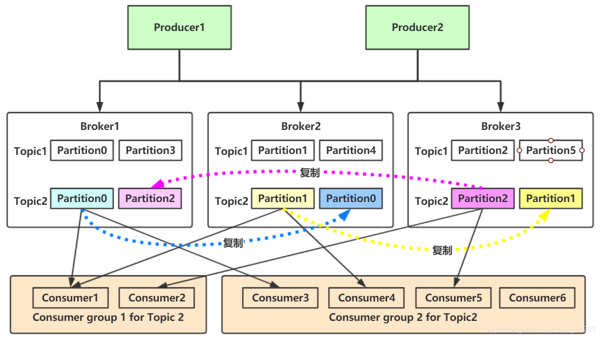
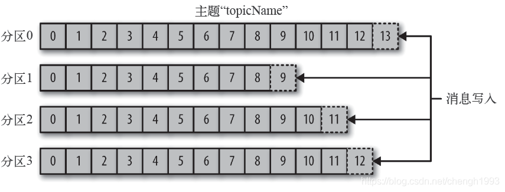
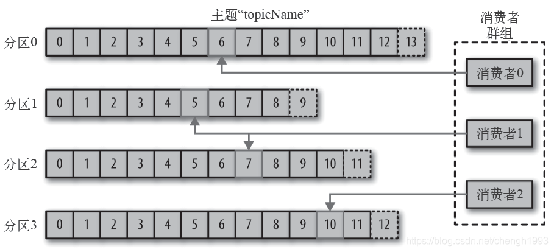
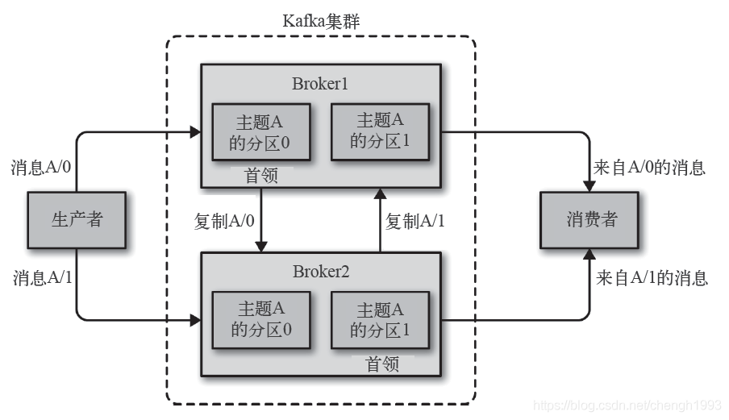
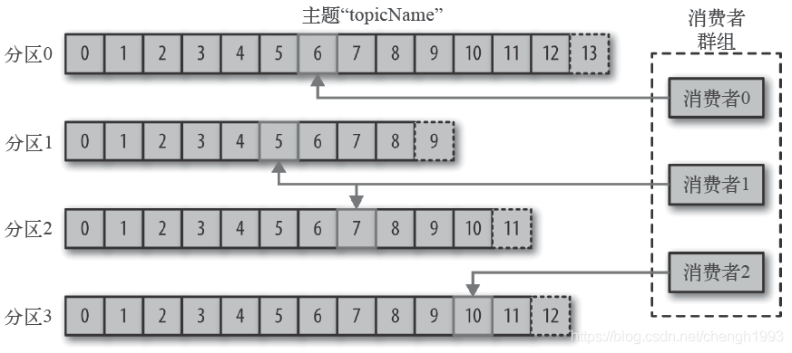
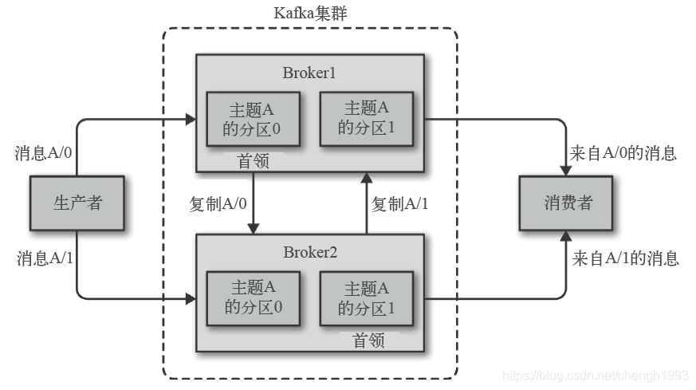
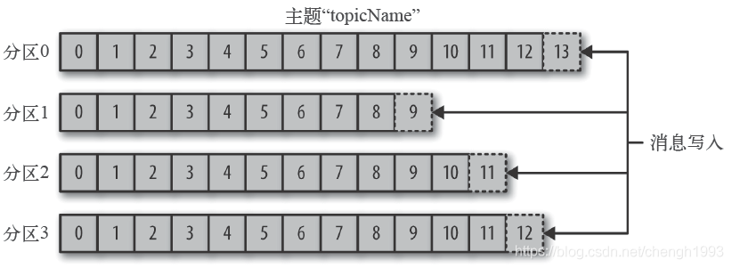
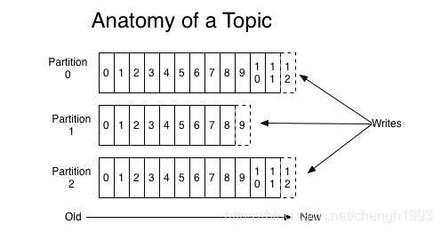
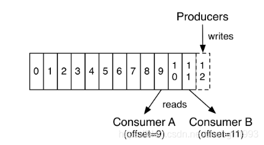
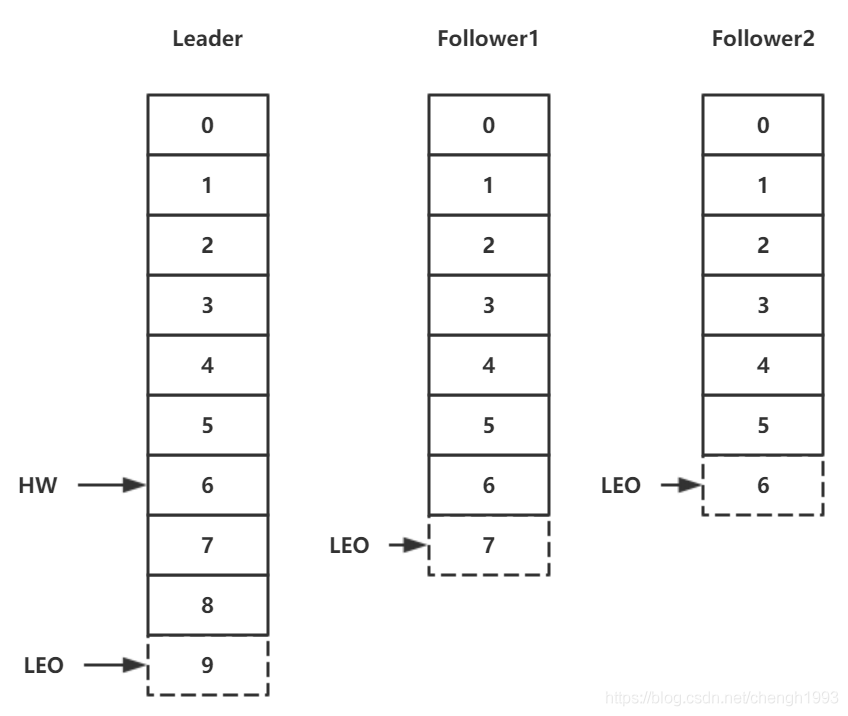

# Kafka 架构与实战

## 1. 概念和基本架构

### 1.1 Kafka 介绍

Kafka 是最初由 Linkedin 公司开发，是一个分布式、分区的、多副本的、多生产者、多订阅者，基于 Zookeeper 协调的分布式日志系统(也可以当做MQ系统)。
常见可以用于 web/nginx 日志、访问日志，消息服务等等。Linkedin 于 2010 年贡献给了 Apache 基金会并成为顶级开源项目。

主要应用场景是: 日志收集系统和消息系统。

Kafka主要设计目标如下:

- 以时间复杂度为 O(1) 的方式提供消息持久化能力，即使对 TB 级以上数据也能保证常数时间的访问性能。 
- 高吞吐率。即使在非常廉价的商用机器上也能做到单机支持每秒100K条消息的传输。
- 支持 Kafka Server 间的消息分区，及分布式消费，同时保证每个 partition 内的消息顺序传输。
- 同时支持离线数据处理和实时数据处理。
- 支持在线水平扩展(服务不停)。



消息系统有两种主要的消息传递模式: 点对点传递模式、发布-订阅模式。大部分的消息系统选用发布-订阅模式。Kafka就是一种发布-订阅模式。

对于消息中间件，消息分推拉两种模式。Kafka只有消息的拉取，没有推送，可以通过轮询实现消息的推送。

1. Kafka 在一个或多个可以跨越多个数据中心的服务器上作为集群运行。
2. Kafka 集群中按照主题分类管理，一个主题可以有多个分区，一个分区可以有多个副本分区。 
3. 每个记录由一个键，一个值和一个时间戳组成。
   
Kafka具有四个核心API:

1. Producer API: 允许应用程序将记录流发布到一个或多个 Kafka 主题。
2. Consumer API: 允许应用程序订阅一个或多个主题并处理为其生成的记录流。
3. Streams API: 允许应用程序充当流处理器，使用一个或多个主题的输入流，并生成一个或多个输出主题的输出流，从而有效地将输入流转换为输出流。
4. Connector API: 允许构建和运行将 Kafka 主题连接到现有应用程序或数据系统的可重用生产者或使用者。例如，关系数据库的连接器可能会捕获对表的所有更改。

### 1.2 Kafka 优势

1. 高吞吐量。单机每秒处理几十上百万的消息量。即使存储了许多 TB 的消息，它也保持稳定的性能。 
2. 高性能。单节点支持上千个客户端，并保证零停机和零数据丢失。
3. 持久化数据存储。将消息持久化到磁盘。通过将数据持久化到硬盘以及 replication 防止数据丢失。
  - 零拷贝
  - 顺序读，顺序写
  - 利用Linux的页缓存
4. 分布式系统，易于向外扩展。所有的 Producer、Broker 和 Consumer 都会有多个，均为分布式的。无需停机即可扩展机器。多个 Producer、Consumer 可能是不同的应用。
5. 可靠性。Kafka是分布式，分区，复制和容错的。
6. 客户端状态维护。消息被处理的状态是在 Consumer 端维护，而不是由 Server 端维护。当失败时能自动平衡。
7. 支持 online 和 offline 的场景。
8. 支持多种客户端语言。Kafka支持 Java、.NET、PHP、Python 等多种语言。

### 1.3 Kafka应用场景

- 日志收集: 一个公司可以用 Kafka 收集各种服务的Log，通过 Kafka 以统一接口服务的方式开放给各种Consumer;
- 消息系统: 解耦生产者和消费者、缓存消息等;
- 用户活动跟踪: Kafka 经常被用来记录 Web 用户或者 App 用户的各种活动，如浏览网页、搜索、点击等活动，这些活动信息被各个服务器发布到 Kafka 的Topic中，然后消费者通过订阅这些 Topic 来做实时的监控分析，亦可保存到数据库;
- 运营指标: Kafka 也经常用来记录运营监控数据。包括收集各种分布式应用的数据，生产各种操作的集中反馈，比如报警和报告;
- 流式处理: 比如 Spark Streaming 和 Storm。

### 1.4 基本架构

#### 消息和批次

Kafka 的数据单元称为消息。可以把消息看成是数据库里的一个“数据行”或一条“记录”。消息由字节数组组成。

消息有键，键也是一个字节数组。当消息以一种可控的方式写入不同的分区时，会用到键。

为了提高效率，消息被分批写入 Kafka。批次就是一组消息，这些消息属于同一个主题和分区。

把消息分成批次可以减少网络开销。批次越大，单位时间内处理的消息就越多，单个消息的传输时间就越长。批次数据会被压缩，这样可以提升数据的传输和存储能力，但是需要更多的计算处理。

#### 模式

消息模式(schema)有许多可用的选项，以便于理解。如JSON和XML，但是它们缺乏强类型处理能力。
Kafka 的许多开发者喜欢使用 Apache Avro。Avro提供了一种紧凑的序列化格式，模式和消息体分开。
当模式发生变化时，不需要重新生成代码，它还支持强类型和模式进化，其版本既向前兼容，也向后兼容。

数据格式的一致性对 Kafka 很重要，因为它消除了消息读写操作之间的耦合性。 

#### 主题和分区

Kafka 的消息通过主题进行分类。主题相当于数据库的表或者文件系统里的文件夹。

主题可以被分为若干分区，一个主题通过分区分布于 Kafka 集群中，提供了横向扩展的能力。



#### 生产者和消费者

生产者创建消息。消费者消费消息。

一个消息被发布到一个特定的主题上。

生产者在默认情况下把消息均衡地分布到主题的所有分区上:

1. 直接指定消息的分区
2. 根据消息的key散列取模得出分区 
3. 轮询指定分区。

消费者通过偏移量来区分已经读过的消息，从而消费消息。

消费者是消费组的一部分。消费组保证每个分区只能被一个消费者使用，避免重复消费。



#### Broker 和集群

一个独立的 Kafka 服务器称为 Broker。

Broker 接收来自生产者的消息，为消息设置偏移量，并提交消息到磁盘保存。

Broker 为消费者提供服务，对读取分区的请求做出响应，返回已经提交到磁盘上的消息。

单个 Broker 可以轻松处理数千个分区以及每秒百万级的消息量。



每个集群都有一个 Broker 是集群控制器(自动从集群的活跃成员中选举出来)。

控制器负责管理工作:

- 将分区分配给 broker 
- 监控 broker

集群中一个分区属于一个 Broker，该 Broker 称为分区首领。

一个分区可以分配给多个 Broker，此时会发生分区复制。

分区的复制提供了消息冗余，高可用。副本分区不负责处理消息的读写。 那负责什么？？？只负责备份？

### 1.5 核心概念

#### 1.5.1 Producer

生产者创建消息。

该角色将消息发布到 Kafka 的 Topic 中。Broker 接收到生产者发送的消息后，Broker 将该消息追加到当前用于追加数据的 segment 文件中。

一般情况下，一个消息会被发布到一个特定的主题上。

1. 默认情况下通过轮询把消息均衡地分布到主题的所有分区上。
2. 在某些情况下，生产者会把消息直接写到指定的分区。这通常是通过消息键和分区器来实现的，分区器为键生成一个散列值，并将其映射到指定的分区上。这样可以保证包含同一个键的消息会被写到同一个分区上。
3. 生产者也可以使用自定义的分区器，根据不同的业务规则将消息映射到分区。

#### 1.5.2 Consumer

消费者读取消息。

1. 消费者订阅一个或多个主题，并按照消息生成的顺序读取它们。
2. 消费者通过检查消息的偏移量来区分已经读取过的消息。偏移量是另一种元数据，它是一个不断递增的整数值，在创建消息时，Kafka 会把它添加到消息里。
   在给定的分区里，每个消息的偏移量都是唯一的。消费者把每个分区最后读取的消息偏移量保存在 Zookeeper 或 Kafka 上，如果消费者关闭或重启，它的读取状态不会丢失。
3. 消费者是消费组的一部分。群组保证每个分区只能被一个消费者使用。
4. 如果一个消费者失效，消费组里的其他消费者可以接管失效消费者的工作，再平衡，分区重新分配。



#### 1.5.3 Broker

一个独立的 Kafka 服务器被称为 Broker。

Broker 为消费者提供服务，对读取分区的请求作出响应，返回已经提交到磁盘上的消息。

1. 如果某 Topic 有 N 个 Partition，集群有 N 个 Broker，那么每个 Broker 存储该 Topic 的一个 Partition。
2. 如果某 Topic 有 N 个 Partition，集群有 (N+M) 个 Broker，那么其中有 N 个 broker 存储该 Topic 的一个 Partition，剩下的 M 个 Broker 不存储该 Topic 的 Partition 数据。
3. 如果某 Topic 有 N 个 Partition，集群中 Broker 数目少于 N 个，那么一个 Broker 存储该 Topic 的一个或多个 Partition。在实际生产环境中，尽量避免这种情况的发生，这种情况容易导致 Kafka 集群数据不均衡。

> 也就是说 Broker 数量最好大于 Partition 数量。

Broker 是集群的组成部分。每个集群都有一个 Broker 同时充当了集群控制器的角色(自动从集群的活跃成员中选举出来)。

控制器负责管理工作，包括将分区分配给 Broker 和监控 Broker。在集群中，一个分区从属于一个 Broker，该 Broker 被称为分区的首领。



#### 1.5.4 Topic

每条发布到 Kafka 集群的消息都有一个类别，这个类别被称为 Topic。

物理上不同 Topic 的消息分开存储。

主题就好比数据库的表，尤其是分库分表之后的逻辑表。

#### 1.5.5 Partition

1. 主题可以被分为若干个分区，一个分区就是一个提交日志。
2. 消息以追加的方式写入分区，然后以先入先出的顺序读取。
3. 无法在整个主题范围内保证消息的顺序，但可以保证消息在单个分区内的顺序。
4. Kafka 通过分区来实现数据冗余和伸缩性。
5. 在需要严格保证消息的消费顺序的场景下，需要将 Partition 数目设为 1。



#### 1.5.6 Replicas

Kafka 使用主题来组织数据，每个主题被分为若干个分区，每个分区有多个副本。
那些副本被保存在 Broker 上， 每个 Broker 可以保存成百上千个属于不同主题和分区的副本。

副本有以下两种类型:

- 首领副本: 每个分区都有一个首领副本。为了保证一致性，所有生产者请求和消费者请求都会经过这个副本。
- 跟随者副本: 首领以外的副本都是跟随者副本。跟随者副本不处理来自客户端的请求，它们唯一的任务就是从首领那里复制消息，保持与首领一致的状态。如果首领发生崩溃，其中的一个跟随者会被提升为新首领。

#### 1.5.7 Offset

##### 生产者 Offset

消息写入的时候，每一个分区都有一个 Offset，这个 Offset 就是生产者的 Offset，同时也是这个分区的最新最大的 Offset。

有些时候没有指定某一个分区的 Offset，这个工作 Kafka 帮我们完成。



##### 消费者 Offset



这是某一个分区的 Offset 情况，生产者写入的 Offset 是最新最大的值是12，而当 Consumer A 进行消费时，从 0 开始消费，一直消费到了9，
消费者的 Offset 就记录在 9，Consumer B 就纪录在了11。

等下一次他们再来消费时，他们可以选择接着上一次的位置消费，当然也可以选择从头消费，或者跳到最近的记录并从「现在」开始消费。

#### 1.5.8 副本

Kafka 通过副本保证高可用。

副本分为首领副本(Leader)和跟随者副本(Follower)。

跟随者副本包括同步副本和不同步副本，在发生首领副本切换的时候，只有同步副本可以切换为首领副本。

##### 1.5.8.1 AR

分区中的所有副本统称为AR(Assigned Repllicas)。

AR=ISR+OSR

##### 1.5.8.2 ISR

所有与 Leader 副本保持一定程度同步的副本(包括Leader)组成 ISR(In-Sync Replicas)，ISR 集合是 AR 集合中的一个子集。

消息会先发送到 Leader 副本，然后 Follower 副本才能从 Leader 副本中拉取消息进行同步，同步期间内 Follower 副本相对于 Leader 副本而言会有一定程度的滞后。
前面所说的「一定程度」是指可以忍受的滞后范围，这个范围可以通过参数进行配置。

##### 1.5.8.3 OSR

与 Leader 副本同步滞后过多的副本(不包括Leader)副本，组成 OSR(Out-Sync Replicas)。在正常情况下，所有的 Follower 副本都应该与 Leader 副本保持一定程度的同步，即 AR=ISR, OSR 集合为空。

##### 1.5.8.4 HW

HW 是 High Watermark 的缩写，俗称高水位，它表示了一个特定消息的偏移量(Offset)，消费之只能拉取到这个 Offset 之前的消息。

##### 1.5.8.5 LEO

LEO 是 Log End Offset 的缩写，它表示了当前日志文件中下一条待写入消息的 Offset。



## 2. Kafka 安装与配置

### 2.1 Java 环境安装

1、上传 `jdk-8u261-linux-x64.rpm` 到服务器并安装

```shell
rpm -ivh jdk-8u261-linux-x64.rpm
```

2. 配置环境变量:

```shell
vim/etc/profile

export JAVA_HOME=/usr/java/jdk1.8.0_261_amd64
export PATH=$PATH:$JAVA_HOME/bin

source /etc/profile
java -version
```

### 2.2 Zookeeper 安装配置

1. 上传 zookeeper-3.4.14.tar.gz 到服务器
2. 解压到 `/opt/zmn/servers` 目录

```shell
tar -zxf zookeeper-3.4.14.tar.gz -C /opt/zmn/servers/
cd /opt/zmn/servers/zookeeper-3.4.14/conf

# 复制 zoo_sample.cfg 命名为 zoo.cfg
cp zoo_sample.cfg zoo.cfg
# 编辑zoo.cfg文件 
vim zoo.cfg
```

3. 修改 Zookeeper 保存数据的目录 `dataDir` 

```shell
dataDir=/var/lagou/zookeeper/data
```

4. 编辑 `/etc/profile`

- 设置环境变量 ZOO_LOG_DIR，指定Zookeeper保存日志的位置; 
- ZOOKEEPER_PREFIX 指向 Zookeeper 的解压目录;
- 将 Zookeeper 的 bin 目录添加到 PATH 中

```shell
export ZOOKEEPER_PREFIX=/opt/zmn/servers/zookeeper-3.4.14
export PATH=$PATH:ZOOKEEPER_PREFIX/bin
export ZOO_LOG_DIR=/var/zmn/zookeeper/log
```

5. 使配置生效
6. 验证

```shell
zkServer.sh status
```

### 2.3 Kafka 安装与配置

1、上传 kafka_2.12-1.0.2.tgz 到服务器并解压

```shell
tar -zxf kafka_2.12-1.0.2.tgz -C /opt/zmn/servers/
```

2、配置环境变量并生效

```shell
vi /etc/profile

export KAFKA_HOME=/opt/zmn/servers/kafka_2.12-1.0.2
export PATH=$PATH:KAFKA_HOME/bin
```

3、配置 `$KAFKA_HOME/config` 中的 `server.properties` 文件

Kafka 连接 Zookeeper 的地址，此处使用本地启动的 Zookeeper 实例，连接地址是 `localhost:2181`，后面的 `myKafka` 是 Kafka 在 Zookeeper 中的根节点路径

```shell
zookeeper.connect=localhost:2181/myKafka
```

配置 kafka 存储持久化数据的目录 `log.dir=/var/lagou/kafka/kafka-logs`

```shell
mkdir -p /var/zmn/kafka/kafka-logs
```

4、启动Zookeeper

```shell
zkServer.sh start
```

5、确认 Zookeeper 的状态

6、启动Kafka 

进入 Kafka 安装的根目录，执行如下命令

```shell
kafka-server-start.sh config/server.properties
```

> 启动成功，可以看到控制台输出的最后一行的 `started` 状态

7、查看Zookeeper的节点

```shell
ls /myKafka
```

8、此时Kafka是前台模式启动，要停止，使用 `Ctrl+C`。

如果要后台启动，使用命令: `kafka-server-start.sh -daemon config/server.properties`

查看 Kafka 的后台进程: `ps aux | grep kafka`

停止后台运行的 Kafka : `kafka-server-stop.sh`

### 2.4 生产与消费

1、`kafka-topics.sh` 用于管理主题

```shell
# 列出现有的主题
kafka-topics.sh --list --zookeeper localhost:2181/myKafka

# 创建主题，该主题包含一个分区，该分区为 Leader 分区，它没有 Follower 分区副本。
kafka-topics.sh --zookeeper localhost:2181/myKafka --create --topic topic_1 --partitions 1 --replication-factor 1

# 查看分区信息
kafka-topics.sh --zookeeper localhost:2181/myKafka --list

# 查看指定主题的详细信息
kafka-topics.sh --zookeeper localhost:2181/myKafka --describe --topic topic_1

# 删除指定主题
kafka-topics.sh --zookeeper localhost:2181/myKafka --delete --topic topic_1
```

2、`kafka-console-producer.sh` 用于生产消息

```shell
# 开启生产者
kafka-console-producer.sh --topic topic_1 --broker-list localhost:9020
```

3、`kafka-console-consumer.sh` 用于消费消息

```shell
# 开启消费者
kafka-console-consumer.sh --bootstrap-server localhost:9092 --topic topic_1

# 开启消费者方式二，从头消费，不按照偏移量消费
kafka-console-consumer.sh --bootstrap-server localhost:9092 --topic topic_1 --from-beginning
```

## 3. Kafka开发实战

### 3.1 消息的发送与接收


生产者主要的对象有: `KafkaProducer`，`ProducerRecord`。

其中 `KafkaProducer` 是用于发送消息的类，`ProducerRecord` 类用于封装 Kafka 的消息。

`KafkaProducer` 的创建需要指定的参数和含义

- `bootstrap.servers`

配置生产者如何与 Broker 建立连接。该参数设置的是初始化参数。如果生产者需要连接的是 Kafka 集群，则这里配置集群中几个 Broker 的地址，而不是全部。
当生产者连接上此处指定的 Broker 之后，在通过该连接发现集群中的其他节点。

- `key.serializer`

要发送信息的 key 数据的序列化类。设置的时候可以写类名，也可以使用该类的 Class 对象。

- `value.serializer`

要发送消息的 value 数据的序列化类。设置的时候可以写类名，也可以使用该类的 Class 对象。

- `acks`

默认值: `all`

`acks=0`: 生产者不等待 Broker 对消息的确认，只要将消息放到缓冲区，就认为消息已经发送完成。该情形不能保证 Broker 是否真的收到了消息，`retries` 配置也不会生效。发送的消息的返回的消息偏移量永远是 `-1`。

`acks=1`: 表示消息只需要写到主分区即可，然后就响应客户端，而不等待副本分区的确认。在该情形下，如果主分区收到消息确认之后就宕机了，而副本分区还没来得及同步该消息，则该消息丢失。

`acks=all`: 首领分区会等待所有的 ISR 副本分区确认记录。该处理保证了只要有一个 ISR 副本分区存活，消息就不会丢失。*这是 Kafka 最强的可靠性保证，等效于 `acks=-1`*

- `retries`

`retries` 重试次数

当消息发送出现错误的时候，系统会重发消息。

跟客户端收到错误时重发一样。如果设置了重试，还想保证消息的有序性，需要设置 `MAX_IN_FLIGHT_REQUESTS_PER_CONNECTION=1` 否则在重试此失败消息的时候，其他的消息可能发送成功了

> 其他参数可以从 `org.apache.kafka.clients.producer.ProducerConfig` 中找到。我们后面的内容会介绍到。

消费者生产消息后，需要 broker 端的确认，可以同步确认，也可以异步确认。同步确认效率低，异步确认效率高，但是需要设置回调对象。

------------------------------------------------------------------------------------------------------------------------

**测试案例**

生产者

```java

```


生产者2

```java

```


生产者3


```java

```


消息消费流程


消费者

```java

```

### 3.2 SpringBoot Kafka

1. `pom.xml` 文件


2. application.properties


3. Demo02SpringbootApplication.java


4. KafkaConfig.java


5. KafkaSyncProducerController.java


6. KafkaAsyncProducerController


7. MyConsumer.java


## 4. 服务端参数配置

> `$KAFKA_HOME/config/server.properties` 文件中的配置

### 4.1 zookeeper.connect

该参数用于配置 Kafka 要连接的 Zookeeper 集群的地址。

它的值是一个字符串，使用逗号分隔 Zookeeper 的多个地址。Zookeeper的单个地址是 `host:port` 形式的，可以在最后添加 Kafka 在 Zookeeper 中的根节点路径。

如: `zookeeper.connect=node2:2181,node3:2181,node4:2181/myKafka`

### 4.2 listeners

用于指定当前 Broker 向外发布服务的地址和端口。

与 `advertised.listeners` 配合，用于做内外网隔离。

内外网隔离配置:

- `listener.security.protocol.map`

监听器名称和安全协议的映射配置。

比如，可以将内外网隔离，即使它们都使用SSL。 

`listener.security.protocol.map=INTERNAL:SSL,EXTERNAL:SSL`

每个监听器的名称只能在 map 中出现一次。

- `inter.broker.listener.name`

用于配置 Broker 之间通信使用的监听器名称，该名称必须在 `advertised.listeners` 列表中。

`inter.broker.listener.name=EXTERNAL`

- `listeners`

用于配置 Broker 监听的 URI 以及监听器名称列表，使用逗号隔开多个 URI 及监听器名称。

如果监听器名称代表的不是安全协议，必须配置 `listener.security.protocol.map`。

每个监听器必须使用不同的网络端口。

- `advertised.listeners`

需要将该地址发布到 zookeeper 供客户端使用，如果客户端使用的地址与 listeners 配置不同。

可以在 zookeeper 的 `get /myKafka/brokers/ids/<broker.id>` 中找到。 

在 IaaS 环境，该条目的网络接口得与 Broker 绑定的网络接口不同。

如果不设置此条目，就使用 `listeners` 的配置。跟 `listeners` 不同，该条目不能使用 `0.0.0.0` 网络端口。 

`advertised.listeners` 的地址必须是 `listeners` 中配置的或配置的一部分。

### 4.3 broker.id

该属性用于唯一标记一个 Kafka 的 Broker，它的值是一个任意 Integer 值。

当 Kafka 以分布式集群运行的时候，尤为重要。

最好该值跟该 Broker 所在的物理主机有关的，如主机名为 `host1.zmn.com`，则 `broker.id=1`，如果主机名为 `192.168.100.101` ，则 `broker.id=101` 等等。

### 4.4 log.dir

通过该属性的值，指定 Kafka 在磁盘上保存消息的日志片段的目录。

它是一组用逗号分隔的本地文件系统路径。

如果指定了多个路径，那么 Broker 会根据「最少使用」原则，把同一个分区的日志片段保存到同一个路径下。

Broker 会往拥有最少数目分区的路径新增分区，而不是往拥有最小磁盘空间的路径新增分区。
