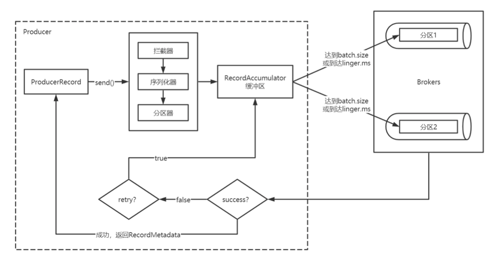
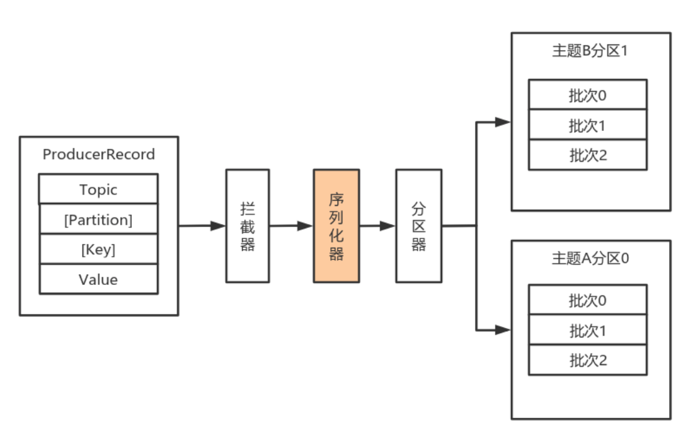
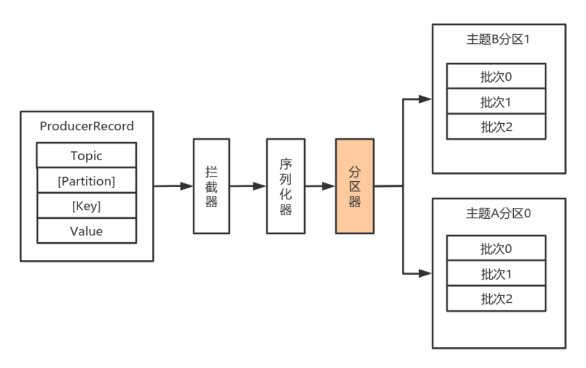
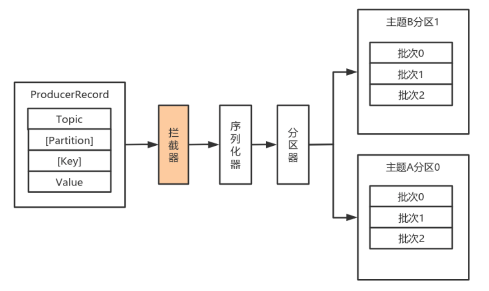
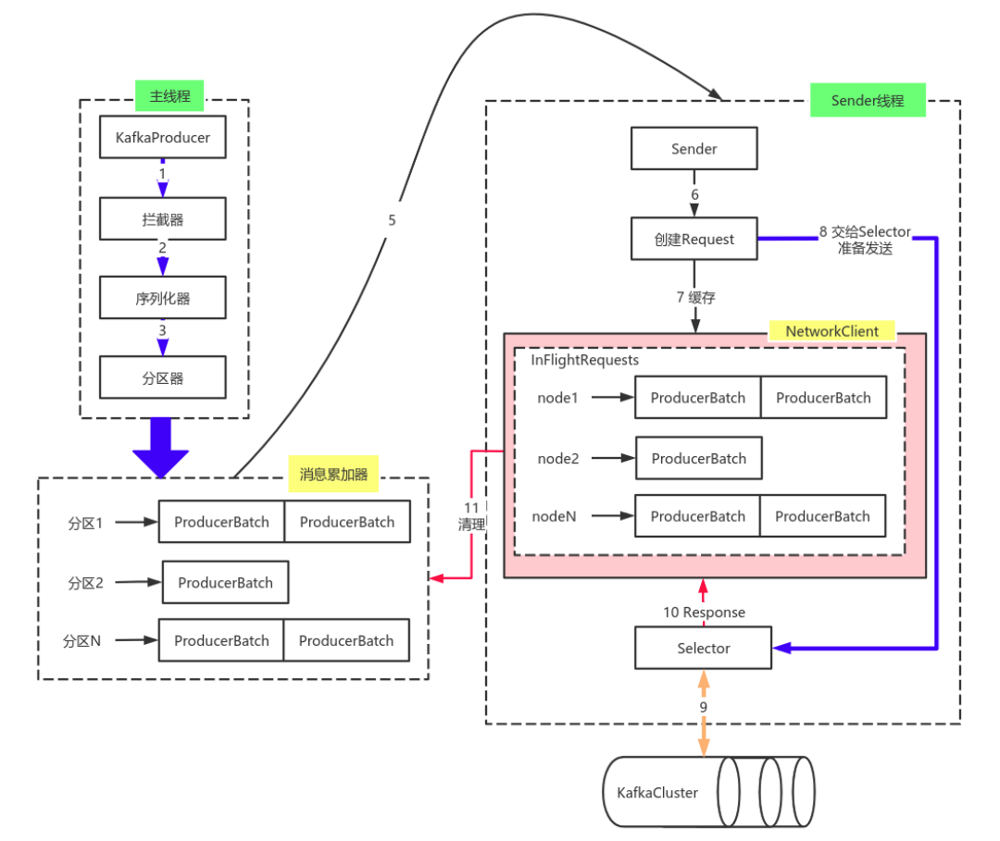

# Kafka 高级特性解析

## 1. 生产者

### 1.1 消息发送

#### 1.1.1 数据生产流程解析



1. Producer 创建时，会创建一个 Sender 线程并设置为守护线程。
2. 生产消息时，内部其实是异步流程; 生产的消息先经过 *拦截器 -> 序列化器 -> 分区器*，然后将消息缓存在缓冲区(该缓冲区也是在 Producer 创建时创建)。
3. 批次发送的条件为: 缓冲区数据大小达到 `batch.size` 或者 `linger.ms` 达到上限，哪个先达到就算哪个。
4. 批次发送后，发往指定分区，然后落盘到 Broker; 如果生产者配置了 `retrires` 参数大于 0 并且失败原因允许重试，那么客户端内部会对该消息进行重试。
5. 落盘到 Broker 成功，返回生产元数据给生产者。
6. 元数据返回有两种方式: 一种是通过阻塞直接返回，另一种是通过回调返回。

#### 1.1.2 必要参数配置

**Broker 配置**

1. 配置条目的使用方式:

```java

```

2. 配置参数:

| 属性                  | 说明                                                                                                                                                                                                                                                                                                                                                                                                         | 重要性  |
|---------------------|------------------------------------------------------------------------------------------------------------------------------------------------------------------------------------------------------------------------------------------------------------------------------------------------------------------------------------------------------------------------------------------------------------|------|
| `bootstrap.servers` | 生产者客户端与 Broker 集群建立初始连接需要的 Broker 地址列表，由该初始连接发现 Kafka 集群中其他的所有 Broker。该地址列表不需要写全部的 Kafka 集群中 Broker 的地址，但也不要写一个，以防该节点宕机的时候不可用。形式为: `host1:port1,host2:port2,...` .                                                                                                                                                                                                                                         | high |
| `key.serializer`    | 实现了接口 `org.apache.kafka.common.serialization.Serializer` 的key序列化类。                                                                                                                                                                                                                                                                                                                                         | high |
| `value.serializer`  | 实现了接口 `org.apache.kafka.common.serialization.Serializer` 的value序列化类。                                                                                                                                                                                                                                                                                                                                       | high |
| `acks`              | 该选项控制着已发送消息的持久性。 <br/> `acks=0`: 生产者不等待 Broker 的任何消息确认。只要将消息放到了 Socket 的缓冲区，就认为消息已发送。不能保证服务器是否收到该消息，`retries` 设置也不起作用，因为客户端不关心消息是否发送失败。客户端收到的消息偏移量永远是 -1。<br/> `acks=1`: Leader 将记录写到它本地日志，就响应客户端确认消息，而不等待 Follower 副本的确认。如果 Leader 确认了消息就宕机，则可能会丢失消息，因为 Follower 副本可能还没来得及同步该消息。<br/> `acks=all`: Leader 等待所有同步的副本确认该消息。保证了只要有一个同步副本存在，消息就不会丢失。这是最强的可用性保证。等价于 `acks=-1`。默认值为 1，字符串。可选值: `[all, -1, 0, 1]` | high |
| `compression.type`  | 生产者生成数据的压缩格式。默认是 none (没有压缩)。允许的值: none, gzip, snappy 和 lz4。 压缩是对整个消息批次来讲的。消息批的效率也影响压缩的比例。消息批越大，压缩效率越好。字符串类型的值。默认是none。                                                                                                                                                                                                                                                                                    | high |
| `retries`           | 设置该属性为一个大于 1 的值，将在消息发送失败的时候重新发送消息。该重试与客户端收到异常重新发送并无二至。允许重试但是不设置 `max.in.flight.requests.per.connection` 为1，存在消息乱序的可能，因为如果两个批次发送到同一个分区，第一个失败了重试，第二个成功了，则第一个消息批在第二个消息批后。`int` 类型的值，默认: 0，可选值: `[0,...,2147483647]`                                                                                                                                                                                           | high |

#### 1.1.3 序列化器



由于 Kafka 中的数据都是字节数组，在将消息发送到 Kafka 之前需要先将数据序列化为字节数组。

序列化器的作用就是用于序列化要发送的消息的。

Kafka 使用 `org.apache.kafka.common.serialization.Serializer` 接口用于定义序列化器，将泛型指定类型的数据转换为字节数组。

```java
/**
 * 将对象转换为 byte 数组的接口
 * 
 * 该接口的实现类需要提供无参构造器
 * 
 * @param <T> 从哪个类型转换
 */
public interface Serializer<T> extends Closeable {

    /**
     * Configure this class.
     * @param configs configs in key/value pairs
     * @param isKey whether is for key or value
     */
    default void configure(Map<String, ?> configs, boolean isKey) {
        // intentionally left blank
    }

    /**
     * Convert {@code data} into a byte array.
     *
     * @param topic topic associated with data (主题名称, associated with ... 与 ... 有关系)
     * @param data typed data
     * @return serialized bytes
     */
    byte[] serialize(String topic, T data);

    /**
     * Convert {@code data} into a byte array.
     *
     * @param topic topic associated with data
     * @param headers headers associated with the record
     * @param data typed data
     * @return serialized bytes
     */
    default byte[] serialize(String topic, Headers headers, T data) {
        return serialize(topic, data);
    }

    /**
     * Close this serializer.
     * <p>
     * This method must be idempotent as it may be called multiple times. (idempotent 幂等性)
     */
    @Override
    default void close() {
        // intentionally left blank
    }
}
```

系统提供了该接口的子接口以及实现类:

- `org.apache.kafka.common.serialization.ByteArraySerializer`
- `org.apache.kafka.common.serialization.ByteBufferSerializer`
- `org.apache.kafka.common.serialization.BytesSerializer`
- `org.apache.kafka.common.serialization.DoubleSerializer`
- `org.apache.kafka.common.serialization.FloatSerializer`
- `org.apache.kafka.common.serialization.IntegerSerializer`
- `org.apache.kafka.common.serialization.StringSerializer`
- `org.apache.kafka.common.serialization.LongSerializer`
- `org.apache.kafka.common.serialization.ShortSerializer`

**自定义序列化器**

数据的序列化一般生产中使用 avro。

自定义序列化器需要实现 `org.apache.kafka.common.serialization.Serializer<T>` 接口，并实现其中的 `serialize` 方法。

> 代码 略...

#### 1.1.4 分区器



默认(DefaultPartitioner)分区计算:

1. 如果 record 提供了分区号，则使用 record 提供的分区号
2. 如果 record 没有提供分区号，则使用 key 的序列化后的值的 Hash 值对分区数量取模
3. 如果 record 没有提供分区号，也没有提供 key，则使用轮询的方式分配分区号。


> 源码分析

如果要自定义分区器，则需要:

1. 首先开发 Partitioner 接口的实现类
2. 在 Kafka Producer 中进行设置: `configs.put("partitioner.class", "xxx.xx.Xxx.class")`

位于 `org.apache.kafka.clients.producer` 包中的分区器接口:

```java
/**
 * Partitioner Interface
 */
public interface Partitioner extends Configurable, Closeable {

    /**
     * Compute the partition for the given record.
     *
     * @param topic The topic name
     * @param key The key to partition on (or null if no key)
     * @param keyBytes The serialized key to partition on( or null if no key)
     * @param value The value to partition on or null
     * @param valueBytes The serialized value to partition on or null
     * @param cluster The current cluster metadata
     */
    int partition(String topic, Object key, byte[] keyBytes, Object value, byte[] valueBytes, Cluster cluster);

    /**
     * This is called when partitioner is closed.
     */
    void close();

    /**
     * Notifies the partitioner a new batch is about to be created. When using the sticky(粘) partitioner,
     * this method can change the chosen sticky partition for the new batch. 
     * @param topic The topic name
     * @param cluster The current cluster metadata
     * @param prevPartition The partition previously(预先的) selected for the record that triggered a new batch
     */
    default void onNewBatch(String topic, Cluster cluster, int prevPartition) {
    }
}
```

包 `org.apache.kafka.clients.producer.internals` 中分区器的默认实现:

```java
/**
 * The default partitioning strategy:
 * <ul>
 * <li>If a partition is specified(指定的) in the record, use it
 * <li>If no partition is specified but a key is present choose a partition based on a hash of the key
 * <li>If no partition or key is present choose the sticky partition that changes when the batch is full. (满了就选相邻的分区 => 轮询)
 * 
 * See KIP-480 for details about sticky partitioning.
 */
public class DefaultPartitioner implements Partitioner {

    private final StickyPartitionCache stickyPartitionCache = new StickyPartitionCache();

    public void configure(Map<String, ?> configs) {}

    /**
     * Compute the partition for the given record.
     *
     * @param topic The topic name
     * @param key The key to partition on (or null if no key)
     * @param keyBytes serialized key to partition on (or null if no key)
     * @param value The value to partition on or null
     * @param valueBytes serialized value to partition on or null
     * @param cluster The current cluster metadata
     */
    public int partition(String topic, Object key, byte[] keyBytes, Object value, byte[] valueBytes, Cluster cluster) {
        return partition(topic, key, keyBytes, value, valueBytes, cluster, cluster.partitionsForTopic(topic).size());
    }

    /**
     * Compute the partition for the given record.
     *
     * @param topic The topic name
     * @param numPartitions The number of partitions of the given {@code topic}
     * @param key The key to partition on (or null if no key)
     * @param keyBytes serialized key to partition on (or null if no key)
     * @param value The value to partition on or null
     * @param valueBytes serialized value to partition on or null
     * @param cluster The current cluster metadata
     */
    public int partition(String topic, Object key, byte[] keyBytes, Object value, byte[] valueBytes, Cluster cluster,
                         int numPartitions) {
        if (keyBytes == null) {
            return stickyPartitionCache.partition(topic, cluster);
        }
        // hash the keyBytes to choose a partition
        return Utils.toPositive(Utils.murmur2(keyBytes)) % numPartitions;
    }

    public void close() {}
    
    /**
     * If a batch completed for the current sticky partition, change the sticky partition. 
     * Alternately, if no sticky partition has been determined, set one.
     */
    public void onNewBatch(String topic, Cluster cluster, int prevPartition) {
        stickyPartitionCache.nextPartition(topic, cluster, prevPartition);
    }
}
```

可以实现 `Partitioner` 接口自定义分区器，然后在生产者中配置。

> 代码 略...

#### 1.1.5 拦截器



Producer 拦截器(`interceptor`)和 Consumer 端 Interceptor 是在 Kafka 0.10 版本被引入的，主要用于实现 Client 端的定制化控制逻辑。

对于 Producer 而言，Interceptor 使得用户在消息发送前以及 Producer 回调逻辑前有机会对消息做一些定制化需求，比如修改消息等。
同时，Producer 允许用户指定多个 Interceptor 按序作用于同一条消息从而形成一个拦截链(interceptor chain)。
Interceptor 实现的接口是 `org.apache.kafka.clients.producer.ProducerInterceptor`，其定义的方法包括:

- `onSend(ProducerRecord)`: 该方法封装进 `KafkaProducer.send` 方法中，即运行在用户主线程中。Producer 确保在消息被序列化以计算分区前调用该方法。用户可以在该方法中对消息做任何操作，但最好保证不要修改消息所属的 Topic 和分区，否则会影响目标分区的计算。
- `onAcknowledgement(RecordMetadata, Exception)`: 该方法会在消息被应答之前或消息发送失败时调用，并且通常都是在 Producer 回调逻辑触发之前。onAcknowledgement 运行在 Producer 的 IO 线程中，因此不要在该方法中放入很重的逻辑，否则会拖慢 Producer 的消息发送效率。
- `close`: 关闭 Interceptor，主要用于执行一些资源清理工作。

如前所述，Interceptor 可能被运行在多个线程中，因此在具体实现时用户需要自行确保线程安全。另外倘若指定了多个 Interceptor，则 Producer 将按照指定顺序调用它们，
并仅仅是捕获每个 Interceptor 可能抛出的异常记录到错误日志中而非在向上传递。这在使用过程中要特别留意。

**自定义拦截器** 

1. 实现 ProducerInterceptor 接口
2. 在 KafkaProducer 的设置中设置自定义的拦截器

> 代码 略...

### 1.2 原理剖析



由上图可以看出 KafkaProducer 有两个基本线程: 

- 主线程

负责消息创建，拦截器，序列化器，分区器等操作，并将消息追加到消息收集器 RecodeAccumulator 中;

消息收集器 RecodeAccumulator 为每个分区都维护了一个 Deque<ProducerBatch> 类型的双端队列。

ProducerBatch 可以理解为是 ProducerRecord 的集合，批量发送有利于提升吞吐量，降低网络影响;
由于生产者客户端使用 `java.io.ByteBuffer` 在发送消息之前进行消息保存，并维护了一个 BufferPool 实现 ByteBuffer 的复用; 
该缓存池只针对特定大小(`batch.size` 指定)的 ByteBuffer 进行管理，对于消息过大的缓存，不能做到重复利用。 

每次追加一条 ProducerRecord 消息，会寻找/新建对应的双端队列，从其尾部获取一个 ProducerBatch，判断当前消息的大小是否可以写入该批次中。
若可以写入则写入;若不可以写入，则新建一个 ProducerBatch，判断该消息大小是否超过客户端参数配置 `batch.size` 的值，不超过，则以 `batch.size` 建立新的 ProducerBatch，
这样方便进行缓存重复利用; 若超过，则以计算的消息大小建立对应的 ProducerBatch ，缺点就是该内存不能被复用了。

- Sender线程

该线程从消息收集器获取缓存的消息，将其处理为 `<Node, List<ProducerBatch>` 的形式。`Node` 表示集群的 Broker 节点。

进一步将 `<Node, List<ProducerBatch>` 转化为 `<Node, Request>` 形式，此时才可以向服务端发送数据。

在发送之前，Sender 线程将消息以 `Map<NodeId, Deque<Request>>` 的形式保存到 InFlightRequests 中进行缓存，可以通过其获取 leastLoadedNode, 即当前 Node 中负载压力最小的一个，以实现消息的尽快发出。

### 1.3 生产者参数配置补充

1. 参数设置方式

```java

```

2. 补充参数

> 表格

## 2. 消费者

### 2.1 概念入⻔


### 2.2 消息接收


### 2.3 消费组管理


## 3. 主题

### 3.1 管理


### 3.2 增加分区


### 3.3 分区副本的分配-了解


### 3.4 必要参数配置


### 3.5 KafkaAdminClient应用


### 3.6 偏移量管理


## 4. 分区

### 4.1 副本机制


### 4.2 Leader选举


### 4.3 分区重新分配


### 4.4 自动再均衡


### 4.5 修改分区副本


### 4.6 分区分配策略


## 5. 物理存储

### 5.1 日志存储概述


### 5.2 日志存储


### 5.3 磁盘存储


## 6. 稳定性

### 6.1 事务


### 6.2 控制器


### 6.3 可靠性保证


### 6.4 一致性保证


### 6.5 消息重复的场景及解决方案


### 6.6 __consumer_offsets


## 7. 延时队列


## 8. 重试队列


