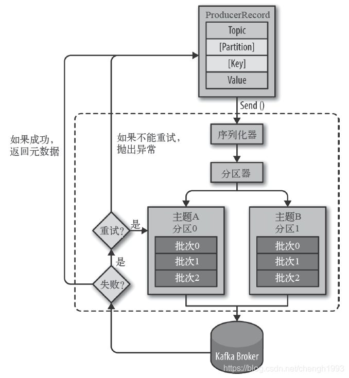

# Kafka 开发实战

## 1. 消息的发送与接收

### 1.1 消息发送



生产者主要的对象有: `KafkaProducer`，`ProducerRecord`。

其中 `KafkaProducer` 是用于发送消息的类，`ProducerRecord` 类用于封装 Kafka 的消息。

`KafkaProducer` 的创建需要指定的参数和含义

- `bootstrap.servers` <Badge type="warning" text="必须" vertical="top" />

配置生产者如何与 Broker 建立连接。该参数设置的是初始化参数。如果生产者需要连接的是 Kafka 集群，则这里配置集群中几个 Broker 的地址，而不是全部。
当生产者连接上此处指定的 Broker 之后，在通过该连接发现集群中的其他节点。

- `key.serializer` <Badge type="warning" text="必须" vertical="top" />

要发送信息的 key 数据的序列化类。设置的时候可以写类名，也可以使用该类的 Class 对象。

- `value.serializer` <Badge type="warning" text="必须" vertical="top" />

要发送消息的 value 数据的序列化类。设置的时候可以写类名，也可以使用该类的 Class 对象。

- `acks`

默认值: `all`

`acks=0`: 生产者不等待 Broker 对消息的确认，只要将消息放到缓冲区，就认为消息已经发送完成。该情形不能保证 Broker 是否真的收到了消息，`retries` 配置也不会生效。发送的消息的返回的消息偏移量永远是 `-1`。

`acks=1`: 表示消息只需要写到主分区即可，然后就响应客户端，而不等待副本分区的确认。在该情形下，如果主分区收到消息确认之后就宕机了，而副本分区还没来得及同步该消息，则该消息丢失。

`acks=all`: 首领分区会等待所有的 ISR 副本分区确认记录。该处理保证了只要有一个 ISR 副本分区存活，消息就不会丢失。*这是 Kafka 最强的可靠性保证，等效于 `acks=-1`*

- `retries`

`retries` 重试次数

当消息发送出现错误的时候，系统会重发消息。

跟客户端收到错误时重发一样。如果设置了重试，还想保证消息的有序性，需要设置 `MAX_IN_FLIGHT_REQUESTS_PER_CONNECTION = 1`(等待确认的请求数)。
否则在重试此失败消息的时候，其他的消息可能发送成功了。

> 其他参数可以从 `org.apache.kafka.clients.producer.ProducerConfig` 中找到。我们后面的内容会介绍到。

消费者生产消息后，需要 Broker 端的确认，可以同步确认，也可以异步确认。

同步确认效率低，异步确认效率高，但是需要设置回调对象。

------------------------------------------------------------------------------------------------------------------------

**测试案例**

生产者

> 同步等待消息确认

```java
public class MyProducer01 {

    public static void main(String[] args) throws ExecutionException, InterruptedException {

        HashMap<String, Object> configs = new HashMap<>();
        // 指定初始连接用到的 Broker 地址
        configs.put("bootstrap.servers", "localhost:9092");
        // 指定 key 的序列化类
        configs.put("key.serializer", IntegerSerializer.class);
        // 指定 value 的序列化类
        configs.put("value.serializer", StringSerializer.class);

        // configs.put("acks", "all");
        // configs.put("reties", "3");

        KafkaProducer<Integer, String> producer = new KafkaProducer<>(configs);

        // 用户自定义的消息头字段
        ArrayList<Header> headers = new ArrayList<>();
        headers.add(new RecordHeader("biz.name", "producer.demo".getBytes(StandardCharsets.UTF_8)));

        ProducerRecord<Integer, String> record = new ProducerRecord<>(
                "topic_1",
                0,
                0,
                "hello zmn 0",
                headers
        );

        // 消息同步确认
        Future<RecordMetadata> send = producer.send(record);
        RecordMetadata recordMetadata = send.get();

        System.out.println("消息的主题：" + recordMetadata.topic());
        System.out.println("消息的的分区：" + recordMetadata.partition());
        System.out.println("消息的偏移量：" + recordMetadata.offset());

        // 关闭生产者
        producer.close();
    }
}
```

生产者2

> 消息异步确认

```java
public class MyProducer02 {

    public static void main(String[] args) {

        HashMap<String, Object> configs = new HashMap<>();
        configs.put("bootstrap.servers", "localhost:9092");
        configs.put("key.serializer", IntegerSerializer.class);
        configs.put("value.serializer", StringSerializer.class);

        KafkaProducer<Integer, String> producer = new KafkaProducer<>(configs);
        ArrayList<Header> headers = new ArrayList<>();
        headers.add(new RecordHeader("biz.name", "producer.demo".getBytes(StandardCharsets.UTF_8)));
        ProducerRecord<Integer, String> record = new ProducerRecord<>("topic_1", 0, 0, "hello zmn 0", headers);

        // 消息异步确认
        producer.send(record, (metadata, exception) -> {
            if (Objects.isNull(exception)) {
                System.out.println("消息的主题：" + metadata.topic());
                System.out.println("消息的的分区：" + metadata.partition());
                System.out.println("消息的偏移量：" + metadata.offset());
            } else {
                System.out.println("异常消息：" + exception.getMessage());
            }
        });

        // 关闭生产者
        producer.close();
    }
}
```

### 1.2 消息消费

Kafka 不支持消息的推送，我们可以自己实现。

Kafka 采用的是消息的拉取(`poll`方法)

> `poll()` 方法，不是 `pull()`。

消费者主要的对象有：`KafkaConsumer` 用于消费消息的类。

`KafKaConsumer` 的创建需要指定的参数和含义：

- `bootstrap.servers` <Badge type="warning" text="必须" vertical="top" />

与 Kafka 建立初始连接的 Broker 地址列表。

- `key.deserializer` <Badge type="warning" text="必须" vertical="top" />

Key 的反序列化器。

- `value.deserializer` <Badge type="warning" text="必须" vertical="top" />

Value 的反序列化器。

- `group.id` <Badge type="tip" text="常用" vertical="top" />

指定消费组 id, 用于标志该消费者所属的消费组。

- `auto.offset.reset`

当 Kafka 中没有初始偏移量或当前偏移量在服务器中不存在(如数据被删除了)，该如何处理？

`earliest`: 自动重启偏移量到最早的偏移量

`latest`: 自动重置偏移量为最新的偏移量

`none`: 如果消费组原来的(previous)偏移量不存在，则向消费者抛异常

`anything`: 向消费者抛异常

---

`ConsumerConfig` 类中包含了所有的可以给 `KafkaConsumer` 配置的参数。

**测试案例**

消费者

```java
public class MyConsumer01 {

    public static void main(String[] args) {

        HashMap<String, Object> configs = new HashMap<>();
        // 使用常量代替手写字符串
        configs.put(ConsumerConfig.BOOTSTRAP_SERVERS_CONFIG, "localhost:9092");
        configs.put(ConsumerConfig.KEY_DESERIALIZER_CLASS_CONFIG, IntegerDeserializer.class);
        configs.put(ConsumerConfig.VALUE_DESERIALIZER_CLASS_CONFIG, StringDeserializer.class);

        configs.put(ConsumerConfig.GROUP_ID_CONFIG, "consumer_demo"); // 消费组 ID ()
        configs.put(ConsumerConfig.AUTO_OFFSET_RESET_CONFIG, "earliest"); // 如果找不到当前消费者额有效偏移量，则自动重置到最开始

        KafkaConsumer<Integer, String> consumer = new KafkaConsumer<>(configs);

        // 先订阅再消费
        // 订阅正则
        // Pattern pattern = Pattern.compile("topic_[0-9]");
        // consumer.subscribe(pattern);
        // 订阅指定主题列表
        consumer.subscribe(Arrays.asList("topic_1"));

        // 从服务端拉取消息
        // 如果没有可以消费的消息，则该方法可以放到 while 循环中，每过 3 秒重新拉取一次
        // 如果还没有拉取到，过 3 秒再次拉取，防止 while 循环太密集的 poll 调用
        ConsumerRecords<Integer, String> consumerRecords = consumer.poll(3_000); // 批量从主题的分区拉取消息

        // 获取指定主题的消息
        // Iterable<ConsumerRecord<Integer, String>> records = consumerRecords.records("topic_1");

        // 遍历本次从主题的分区拉取的批量消息
        consumerRecords.forEach(record -> System.out.println(record.topic() + "\t" + record.partition() + "\t" + record.offset() + "\t" +
                record.key() + "\t" + record.value()));

        consumer.close();
    }

}
```

> 可以将消息消费部分的代码放进 `while(true)` 的循环当中。

## 2. SpringBoot Kafka

1. `pom.xml` 文件，引入的核心依赖

```xml
<dependencies>
        <dependency>
            <groupId>org.springframework.boot</groupId>
            <artifactId>spring-boot-starter-web</artifactId>
        </dependency>
        <dependency>
            <groupId>org.springframework.kafka</groupId>
            <artifactId>spring-kafka</artifactId>
        </dependency>
    </dependencies>
```

2. application.properties

```properties
spring.application.name=kafka-02-springboot
server.port=18080

# Kafka 配置
spring.kafka.bootstrap-servers=localhost:9092

# producer 配置
spring.kafka.producer.key-serializer=org.apache.kafka.common.serialization.IntegerSerializer
spring.kafka.producer.value-serializer=org.apache.kafka.common.serialization.StringSerializer
# 生产者每个批次最多放多少记录
spring.kafka.producer.batch-size=16384
# 生产者端总的可用发送缓冲区大小 (此处设置为 32 M)
spring.kafka.producer.buffer-memory=33554432

# consumer 配置
spring.kafka.consumer.key-deserializer=org.apache.kafka.common.serialization.IntegerDeserializer
spring.kafka.consumer.value-deserializer=org.apache.kafka.common.serialization.StringDeserializer
spring.kafka.consumer.group-id=springboot-consumer-02
# 如果在 kafka 中找不到当前消费者的偏移量，则直接将偏移量重置为最早的
spring.kafka.consumer.auto-offset-reset=earliest
# 消费者的偏移量是自动提交还是手动提交.(此处使用自动提交)
spring.kafka.consumer.enable-auto-commit=true
# 消费者偏移量自动提交间隔时间
spring.kafka.consumer.auto-commit-interval=1000
```

3. KafkaConfig.java <Badge type="tips" text="可选" vertical="top" />

```java
@Configuration
public class KafkaConfig {

    @Bean
    public NewTopic topic1() {
        return new NewTopic("ntpc-01", 3, (short)1);
    }

    @Bean
    public NewTopic topic2() {
        return new NewTopic("ntpc-02", 5, (short)1);
    }

    /**
     * 自定义 KafkaAdmin
     */
    @Bean
    public KafkaAdmin kafkaAdmin() {
        HashMap<String, Object> config = new HashMap<>();
        config.put(CommonClientConfigs.BOOTSTRAP_SERVERS_CONFIG, "localhost:9092");
        return new KafkaAdmin(config);
    }

    /**
     * 自定义 KafkaTemplate
     */
    @Bean
    public KafkaTemplate<Integer, String> kafkaTemplate(ProducerFactory<Integer, String> producerFactory) {
        // 覆盖 ProducerFactory 原有设置
        HashMap<String, Object> configOverrides = new HashMap<>();
        configOverrides.put(ProducerConfig.BATCH_SIZE_CONFIG, 200);
        return new KafkaTemplate<>(producerFactory, configOverrides);
    }
}
```

4. KafkaSyncProducerController.java

> 同步发送消息

```java
@RestController
public class SyncProducerController {

    @Autowired
    private KafkaTemplate<Integer, String> kafkaTemplate;

    @RequestMapping("send/sync/{message}")
    public String send(@PathVariable String message) {

        ListenableFuture<SendResult<Integer, String>> future = kafkaTemplate.send(TopicConstant.KAFKA_TOPIC_SPRING, 0, 0, message);
        try {
            // 同步发送消息
            SendResult<Integer, String> sendResult = future.get();
            RecordMetadata metadata = sendResult.getRecordMetadata();
            System.out.println(metadata.topic() + "\t" + metadata.partition() + "\t" + metadata.offset());
        } catch (InterruptedException | ExecutionException e) {
            e.printStackTrace();
        }
        return "success";
    }

}
```

5. KafkaAsyncProducerController

> 异步发送消息

```java
@RestController
public class AsyncProducerController {

    @Autowired
    private KafkaTemplate<Integer, String> kafkaTemplate;

    @RequestMapping("send/async/{message}")
    public String send(@PathVariable String message) {
        ListenableFuture<SendResult<Integer, String>> future = kafkaTemplate.send(TopicConstant.KAFKA_TOPIC_SPRING, 0, 1, message);
        // 设置回调函数，异步等待 Broker 端返回结果
        future.addCallback(new ListenableFutureCallback<SendResult<Integer, String>>() {
            @Override
            public void onFailure(Throwable ex) {
                System.out.println("发送消息失败：" + ex.getMessage());
            }

            @Override
            public void onSuccess(SendResult<Integer, String> result) {
                RecordMetadata metadata = result.getRecordMetadata();
                System.out.println("消息发送成功！" + metadata.topic() + "\t" + metadata.partition() + "\t" + metadata.offset());
            }
        });
        return "";
    }
}
```

6. MyConsumer.java

```java
@Component
public class MyConsumer {

    @KafkaListener(topics = TopicConstant.KAFKA_TOPIC_SPRING)
    public void onMessage(ConsumerRecord<Integer, String> record) {
        System.out.println("消费者收到的消息：" + record.topic() + "\t" + record.partition() + "\t" +
                record.offset() + "\t" + record.key() + "\t" + record.value());
    }

}
```
