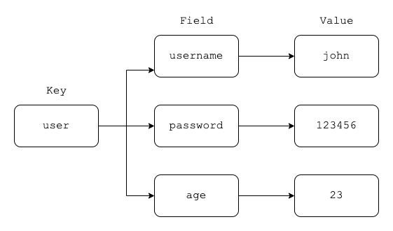
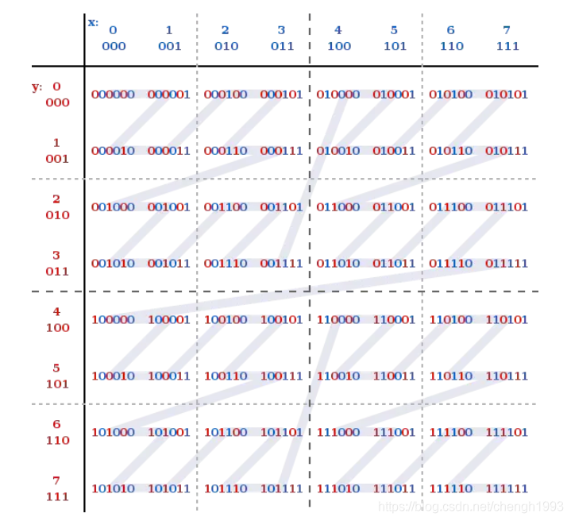
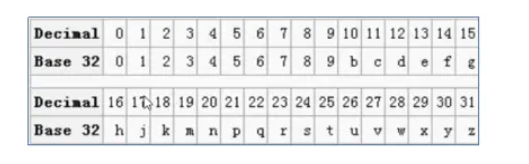

# Redis 数据类型选择和应用场景

Redis 是一个 Key-Value 的存储系统，使用 ANSI C 语言编写。

key的类型是字符串。

value的数据类型有:

- 常用的: string 字符串类型、list 列表类型、set 集合类型、sortedset(zset)有序集合类型、hash 类型。
- 不常见的: bitmap 位图类型、geo 地理位置类型。

Redis 5.0 新增一种: stream 类型

注意: Redis 中命令是忽略大小写的(set SET)，key 是不忽略大小写的(NAME name)。

## 1. Redis 的 Key 设计

1. 用 `:` 分割
2. 把表名转换为 key 前缀, 比如: `user:`
3. 第二段放置主键值
4. 第三段放置列名

比如: 用户表 `user`, 转换为 Redis 的 key-value 存储

| userid | username | password | email       |
|--------|----------|----------|-------------|
| 9      | john     | 123456   | john@zmn.cn |

- username 的 key: `user:9:username`

`{userid:9,username:john}`

- email 的 key: `user:9:email`

Key 设计的优势：

- 表示明确(看key知道意思)
- 不易被覆盖

## 2. String字符串类型

Redis 的 String 能表达3种值的类型: 字符串、整数、浮点数

常见操作命令如下表:

| 命令名称     | 语法                     | 命令描述                                                         |
|----------|------------------------|--------------------------------------------------------------|
| `set`    | `set key value`        | 赋值                                                           |
| `get`    | `get key`              | 取值                                                           |
| `setnx`  | `setnx key value`      | 当key不存在时才用赋值。<br/>`set key value NX PX 3000` 原子操作，px 设置生存毫秒数 |
| `getset` | `getset key value`     | 取值并赋值                                                        |
| `append` | `append key value`     | 向尾部追加值                                                       |
| `strlen` | `strlen key`           | 获取字符串长度                                                      |
| `incr`   | `incr key`             | 递增数字                                                         |
| `incrby` | `incrby key increment` | 增加指定的整数                                                      |
| `decr`   | `decr key`             | 递减数字                                                         |
| `decrby` | `decrby key decrement` | 减少指定的整数                                                      |

应用场景:

1. `key` 和命令是字符串
2. 普通的赋值
3. `incr` 用于乐观锁

> incr: 递增数字，可用于实现乐观锁 + watch(事务)

4. `setnx` 用于分布式锁

> 当 value 不存在时采用赋值，可用于实现分布式锁

```shell
127.0.0.1:6379> setnx name john #如果name不存在赋值
(integer) 1
127.0.0.1:6379> setnx name john #再次赋值失败
(integer) 0
127.0.0.1:6379> get name
"john"

127.0.0.1:6379> set age 18 NX PX 10000  # 如果不存在赋值 有效期10秒
OK
127.0.0.1:6379> set age 20 NX           # 赋值失败 (有效期没过)
(nil)
127.0.0.1:6379> get age                 # age失效 (有效期过了)
(nil)
127.0.0.1:6379> set age 30 NX PX 10000  # 赋值成功 (有效期过了，可以赋值成功)
OK
127.0.0.1:6379> get age
"30"
```

## 3. List 列表类型

List列表类型可以存储有序、可重复的元素

获取头部或尾部附近的记录是极快的

> 双端列表

List 的元素个数最多为 2^32-1 个(40亿)

常见操作命令如下表:

| 命令名称         | 命令格式                                   | 描述                                                                                                                                                            |
|--------------|----------------------------------------|---------------------------------------------------------------------------------------------------------------------------------------------------------------|
| `lpush`      | `lpush key v1 v2 v3 ...`               | 从左侧插入列表                                                                                                                                                       |
| `lpop`       | `lpop key`                             | 从列表左侧取出                                                                                                                                                       |
| `rpush`      | `rpush key v1 v2 v3 ...`               | 从右侧插入列表                                                                                                                                                       |
| `rpop`       | `rpop key`                             | 从列表右侧取出                                                                                                                                                       |
| `lpushx`     | `lpushx key value`                     | 将值插入到列表头部                                                                                                                                                     |
| `rpushx`     | `rpushx key value`                     | 将值插入到列表尾部                                                                                                                                                     |
| `blpop`      | `blpop key timeout`                    | 从列表左侧取出，当列表为空时阻塞，可以设置最大阻塞时间，单位为秒                                                                                                                              |
| `brpop`      | `brpop key timeout`                    | 从列表右侧取出，当列表为空时阻塞，可以设置最大阻塞时间，单位为秒                                                                                                                              |
| `llen`       | `llen key`                             | 获得列表中元素个数                                                                                                                                                     |
| `lindex`     | `lindex key index`                     | 获得列表中下标为 `index` 的元素, `index` 从 0 开始                                                                                                                          |
| `lrange`     | `lrange key start end`                 | 返回列表中指定区间的元素，区间通过 `start` 和 `end` 指定                                                                                                                          |
| `lrem`       | `lrem key count value`                 | 删除列表中与 `value` 相等的元素。<br/> 当 `count > 0` 时， `lrem` 会从列表左边开始删除; <br/> 当 `count < 0` 时，`lrem` 会从列表后边开始删除; <br/> 当 `count = 0` 时，`lrem` 删除所有值为 `value` 的元素 <br/> |
| `lset`       | `lset key index value`                 | 将列表 `index` 位置的元素设置成 `value` 的值                                                                                                                               |
| `rpoplpush`  | `rpoplpush key1 key2`                  | 从 `key1` 列表右侧弹出并插入到 `key2` 列表左侧                                                                                                                               |
| `ltrim`      | `ltrim key start end`                  | 对列表进行修剪，只保留 `start` 到 `end` 区间                                                                                                                                |
| `brpoplpush` | `brpoplpush key1 key2`                 | 从 `key1` 列表右侧弹出并插入到 `key2` 列表左侧，会阻塞                                                                                                                           |
| `linsert`    | `linsert key BEFORE/AFTER pivot value` | 将 `value` 插入到列表，且位于值 `pivot` 之前或之后                                                                                                                            |

应用场景:

1. 作为栈或队列使用(列表有序可以作为栈和队列使用)
2. 可用于各种列表，比如用户列表、商品列表、评论列表等。

```shell
127.0.0.1:6379> lpush list:1 1 2 3 4 5 3
(integer) 6
127.0.0.1:6379> lrange list:1 0 -1
1) "3"
2) "5"
3) "4"
4) "3"
5) "2"
6) "1"
127.0.0.1:6379> lpop list:1
"3"
127.0.0.1:6379> rpop list:1
"1"
127.0.0.1:6379> lindex list:1 1
"4"
127.0.0.1:6379> lrange list:1 0 -1
1) "5"
2) "4"
3) "3"
4) "2"
127.0.0.1:6379> rpoplpush list:1 list:2
"2"
127.0.0.1:6379> lrange list:1 0 -1
1) "5"
2) "4"
3) "3"
127.0.0.1:6379> lrange list:2 0 -1
1) "2"
```

## 4. Set 集合类型

Set: 无序、唯一元素

集合中最大的成员数为 2^32 - 1

常见操作命令如下表:

| 命令名称          | 命令格式                      | 描述                  |
|---------------|---------------------------|---------------------|
| `sadd`        | `sadd key mem1 mem2 ....` | 为集合添加新成员            |
| `srem`        | `srem key mem1 mem2 ....` | 删除集合中指定成员           |
| `smembers`    | `smembers key`            | 获得集合中所有元素           |
| `spop`        | `spop key`                | 返回集合中一个随机元素，并将该元素删除 |
| `srandmember` | `srandmember key`         | 返回集合中一个随机元素，不会删除该元素 |
| `scard`       | `scard key`               | 获得集合中元素的数量          |
| `sismember`   | `sismember key member`    | 判断元素是否在集合内          |
| `sinter`      | `sinter key1 key2 key3`   | 求多集合的交集             |
| `sdiff`       | `sdiff key1 key2 key3`    | 求多集合的差集             |
| `sunion`      | `sunion key1 key2 key3`   | 求多集合的并集             |

应用场景: 适用于不能重复的且不需要顺序的数据结构

比如: 关注的用户，还可以通过 `spop` 进行随机抽奖

## 5. sortedset 有序集合类型

SortedSet(ZSet) 有序集合: 元素本身是无序不重复的

每个元素关联一个分数(score)

可按分数排序，分数可重复

> 与 Set 最大的不同是有针对分数的操作。

常见操作命令如下表:

| 命令名称        | 命令格式                                         | 描述                                 |
|-------------|----------------------------------------------|------------------------------------|
| `zadd`      | `zadd key score1 member1 score2 member2 ...` | 为有序集合添加新成员                         |
| `zrem`      | `zrem key mem1 mem2 ....`                    | 删除有序集合中指定成员                        |
| `zcard`     | `zcard key`                                  | 获得有序集合中的元素数量                       |
| `zcount`    | `zcount key min max`                         | 返回集合中 score 值在 `[min,max]` 区间的元素数量 |
| `zincrby`   | `zincrby key increment member`               | 在集合的 member 分值上加 increment         |
| `zscore`    | `zscore key member`                          | 获得集合中 member 的分值                   |
| `zrank`     | `zrank key member`                           | 获得集合中 member 的排名(按分值从小到大)          |
| `zrevrank`  | `zrevrank key member`                        | 获得集合中 member 的排名(按分值从大到小)          |
| `zrange`    | `zrange key start end`                       | 获得集合中指定区间成员，按分数递增排序                |
| `zrevrange` | `zrevrange key start end`                    | 获得集合中指定区间成员，按分数递减排序                |

应用场景:

由于可以按照分值排序，所以适用于各种排行榜。比如: 点击排行榜、销量排行榜、关注排行榜等。

## 6. Hash类型(散列表)

Redis Hash 是一个 String 类型的 field 和 value 的映射表，它提供了字段和字段值的映射。

每个 Hash 可以存储 2^32 - 1 键值对(40多亿)。



常见操作命令如下表:

| 命令名称      | 命令格式                                    | 描述                 |
|-----------|-----------------------------------------|--------------------|
| `hset`    | `hset key field value`                  | 赋值，不区别新增或修改        |
| `hmset`   | `hmset key field1 value1 field2 value2` | 批量赋值               |
| `hsetnx`  | `hsetnx key field value`                | 赋值，如果filed存在则不操作   |
| `hexists` | `hexists key filed`                     | 查看某个field是否存在      |
| `hget`    | `hget key field`                        | 获取一个字段值            |
| `hmget`   | `hmget key field1 field2 ...`           | 获取多个字段值            |
| `hgetall` | `hgetall key`                           |                    |
| `hdel`    | `hdel key field1 field2...`             | 删除指定字段             |
| `hincrby` | `hincrby key field increment`           | 指定字段自增 `increment` |
| `hlen`    | `hlen key`                              | 获得字段数量             |

应用场景: 对象的存储，表数据的映射

## 7. bitmap 位图类型

bitmap 是进行位操作的

通过一个 bit 位来表示某个元素对应的值或者状态, 其中的 key 就是对应元素本身。

bitmap 本身会极大的节省储存空间。

常见操作命令如下表:

| 命令名称       | 命令格式                                          | 描述                                     |
|------------|-----------------------------------------------|----------------------------------------|
| `setbit`   | `setbit key offset value`                     | 设置 key 在 offset 处的 bit 值 (只能是 0 或者 1)。 |
| `getbit`   | `getbit key offset`                           | 获得 key 在 offset 处的 bit 值               |
| `bitcount` | `bitcount key`                                | 获得 key 的 bit 位为 1 的个数                  |
| `bitpos`   | `bitpos key value`                            | 返回第一个被设置为 bit 值的索引值                    |
| `bitop`    | `bitop and[or/xor/not] destkey key [key ...]` | 对多个 key 进行逻辑运算后存入 `destkey` 中          |

应用场景:

1. 用户每月签到，用户 id 为 key ，日期作为偏移量 (1 表示签到)
2. 统计活跃用户, 日期为 key，用户 id 为偏移量 (1 表示活跃)
3. 查询用户在线状态，日期为 key，用户 id 为偏移量 (1 表示在线)

```shell
127.0.0.1:6379> setbit user:sign:1000 20200101 1 # id为1000的用户20200101签到 
(integer) 0
127.0.0.1:6379> setbit user:sign:1000 20200103 1 # id为1000的用户20200103签到 
(integer) 0
127.0.0.1:6379> getbit user:sign:1000 20200101 # 获得id为1000的用户20200101签到状态. 1 表示签到
(integer) 1
127.0.0.1:6379> getbit user:sign:1000 20200102 # 获得id为1000的用户20200102签到状态. 0 表示未签到
(integer) 0
127.0.0.1:6379> bitcount user:sign:1000 # 获得id为1000的用户签到次数 
(integer) 2
127.0.0.1:6379> bitpos user:sign:1000 1 # id为1000的用户第一次签到的日期 
(integer) 20200101
127.0.0.1:6379> setbit 20200201 1000 1 # 20200201 id 为 1000 的用户上线 
(integer) 0
127.0.0.1:6379> setbit 20200202 1001 1 # 20200202 id 为 1001 的用户上线 
(integer) 0
127.0.0.1:6379> setbit 20200201 1002 1 # 20200201 id 为 1002 的用户上线 
(integer) 0
127.0.0.1:6379> bitcount 20200201 # 20200201 的上线用户有 2 个
(integer) 2
127.0.0.1:6379> bitop or desk1 20200201 20200202 # 合并20200201和20200202上线的用户
(integer) 126
127.0.0.1:6379> bitcount desk1 # 统计20200201和20200202上线的用户 
(integer) 3
```

## 8. geo 地理位置类型

geo 是 Redis 用来处理位置信息的。

在 Redis3.2 中正式使用。主要是利用了 Z阶曲线、Base32 编码和 geohash 算法。

### 8.1 Z阶曲线

在 x 轴和 y 轴上将十进制数转化为二进制数，采用 x 轴和 y 轴对应的二进制数依次交叉后得到一个六位数编码。
把数字从小到大依次连起来的曲线称为Z阶曲线，Z 阶曲线是把多维转换成一维的一种方法。



### 8.2 Base32 编码

Base32 这种数据编码机制，主要用来把二进制数据编码成可见的字符串，其编码规则是: 任意给定一个二进制数据，
以 5 个位 (bit) 为一组进行切分 (base64 以 6 个位(bit)为一组)，对切分而成的每个组进行编码得到 1 个可见字符。

Base32 编码表字符集中的字符总数为 32 个(0-9、b-z去掉a、i、l、o)，这也是 Base32 名字的由来。



### 8.3 GeoHash 算法

Gustavo 在 2008 年 2 月上线了 <http://geohash.org/> 网站。

GeoHash 是一种地理位置信息编码方法。 经过 GeoGeoHashhash 映射后，地球上任意位置的经纬度坐标可以表示成一个较短的字符串。
可以方便的存储在数据库中，附在邮件上，以及方便的使用在其他服务中。

以北京的坐标举例，`[39.928167,116.389550]` 可以 转换成 `wx4g0s8q3jf9`。

Redis 中经纬度使用 52 位的整数进行编码，放进 `zset` 中，`zset` 的value元素是key，score 是 GeoHash 的 52 位整数值。
在使用 Redis 进行 Geo 查询时，其内部对应的操作其实只是 `zset`( `skiplist` )的操作。通过 `zset` 的 score 进行排序就可以得到坐标附近的其它元素，
通过将 score 还原成坐标值就可以得到元素的原始坐标。

常见操作命令如下表:

| 命令名称                | 命令格式                                                | 描述              |
|---------------------|-----------------------------------------------------|-----------------|
| `geoadd`            | `geoadd key 经度 纬度 成员名称1 经度1 纬度1 成员名称2 经度2 纬度 2 ...` | 添加地理坐标          |
| `geohash`           | `geohash key 成员名称1 成员名称2...`                        | 返回标准的 Geohash 串 |
| `geopos`            | `geopos key 成员名称1 成员名称2...`                         | 返回成员经纬度         |
| `geodist`           | `geodist key 成员1 成员2 单位`                            | 计算成员间距离         |
| `georadiusbymember` | `georadiusbymember key 成员 值单位 count 数 asc[desc]`    | 根据成员查找附近的成员     |

应用场景:

1. 记录地理位置
2. 计算距离
3. 查找"附近的人"

```shell
# 添加用户地址 john、jack、jude 的经纬度
127.0.0.1:6379> geoadd user:addr 116.31 40.05 john 116.38 39.88 jack 116.47 40.00 jude
(integer) 3
# 获得 john 和 jude 的 Geohash
127.0.0.1:6379> geohash user:addr john jude
1) "wx4eydyk5m0"
2) "wx4gd3fbgs0"
# 获取 jack 的经纬度
127.0.0.1:6379> geopos user:addr jack
1) 1) "116.38000041246414185"
   2) "39.88000114172373145"
# 获取 john 和 jude 的距离，默认单位：米 
127.0.0.1:6379> geodist user:addr john jude
"14718.6972"
# 获取 john 和 jude 的距离，单位：千米
127.0.0.1:6379> geodist user:addr john jude km
"14.7187"
# 获得距离 john 20km 以内，由近到远的前三名的成员, 并获取他们的名称、距离及经纬度
# withcoord: 获得经纬度; withdist: 获得距离; withhash: 获得geohash码
127.0.0.1:6379> georadiusbymember user:addr john 20 km withcoord withdist count 3 asc
1) 1) "john"
   2) "0.0000"
   3) 1) "116.31000012159347534"
      2) "40.04999982043828055"
2) 1) "jude"
   2) "14.7187"
   3) 1) "116.46999925374984741"
      2) "39.99999991084916218"
3) 1) "jack"
   2) "19.8276"
   3) 1) "116.38000041246414185"
      2) "39.88000114172373145"
127.0.0.1:6379> 
```

## 9. Stream 数据流类型

Stream 是 Redis5.0 后新增的数据结构，用于可持久化的消息队列。

几乎满足了消息队列具备的全部内容，包括:

- 消息 ID 的序列化生成
- 消息遍历
- 消息的阻塞和非阻塞读取
- 消息的分组消费
- 未完成消息的处理
- 消息队列监控

每个 Stream 都有唯一的名称，它就是 Redis 的key，首次使用 `xadd` 指令追加消息时自动创建。

常见操作命令如下表:

| 命令名称         | 命令格式                                                                         | 描述                                                                 |
|--------------|------------------------------------------------------------------------------|--------------------------------------------------------------------|
| `xadd`       | `xadd key id <*> field1 value1....`                                          | 将指定消息数据追加到指定队列(key)中，* 表示最新生成的 id(当前时间 + 序列号)                      |
| `xread`      | `xread [COUNT count] [BLOCK milliseconds] STREAMS key [key ...] ID [ID ...]` | 从消息队列中读取，`COUNT`: 读取条数，`BLOCK`: 阻塞读(默认不阻塞) `key`: 队列名称 `id`: 消息 id |
| `xrange`     | `xrange key start end [COUNT]`                                               | 读取队列中给定 ID 范围的消息。`COUNT`: 返回消息条数(消息id从小到大)                         |
| `xrevrange`  | `xrevrange key start end [COUNT]`                                            | 读取队列中给定 ID 范围的消息。`COUNT`: 返回消息条数(消息id从大到小)                         |
| `xdel`       | `xdel key id`                                                                | 删除队列的消息                                                            |
| `xgroup`     | `xgroup create key groupname id`                                             | 创建一个新的消费组                                                          |
| `xgroup`     | `xgroup destory key groupname`                                               | 删除指定消费组                                                            |
| `xgroup`     | `xgroup delconsumer key groupname cname`                                     | 删除指定消费组中的某个消费者                                                     |
| `xgroup`     | `xgroup setid key id`                                                        | 修改指定消息的最大 id                                                       |
| `xreadgroup` | `xreadgroup group groupname consumer COUNT streams key `                     | 从队列中的消费组中创建消费者并消费数据(`consumer` 不存在则创建)                             |

应用场景: 消息队列的使用
