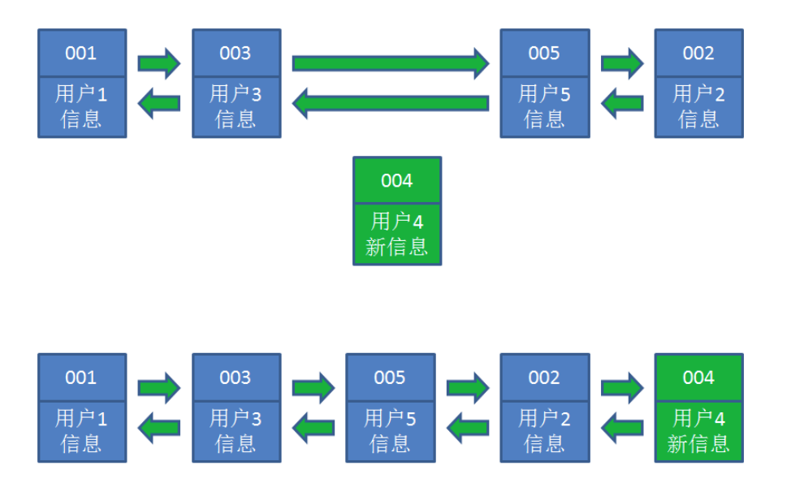
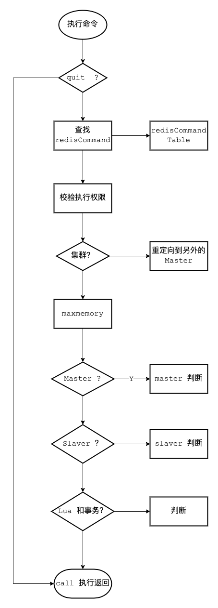
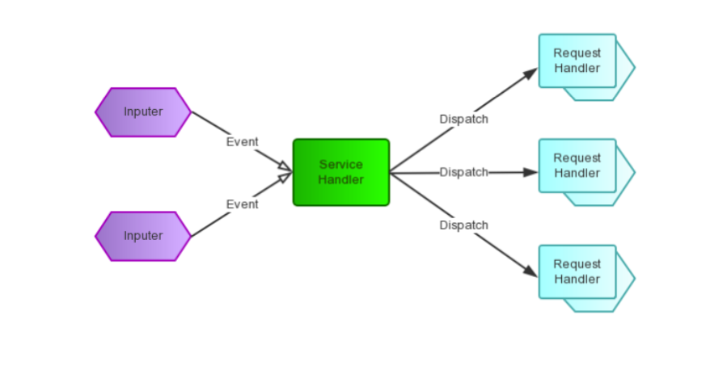

# Redis核心原理

## 1. Redis 持久化

### 1.1 为什么要持久化?

Redis 是内存数据库，宕机后数据会消失。

Redis 重启后快速恢复数据，要提供持久化机制。

Redis 持久化是为了快速的恢复数据而不是为了存储数据。

Redis 有两种持久化方式: RDB 和 AOF。

> 注意: Redis持久化不保证数据的完整性。

当 Redis 用作 DB 时，DB 数据要完整，所以一定要有一个完整的数据源(文件、mysql)。

在系统启动时，从这个完整的数据源中将数据 `load` 到 Redis 中。

数据量较小，不易改变，比如: 字典库(xml、Table)。

通过 `info` 命令可以查看关于持久化的信息

### 1.2 RDB

RDB(Redis DataBase)，是 Redis 默认的存储方式，RDB 方式是通过快照(snapshotting)完成的。

> 这一刻的数据 不关注过程 ???

**触发快照的方式**

1. 符合自定义配置的快照规则
2. 执行 `save` 或者 `bgsave` 命令 
3. 执行 `flushall` 命令
4. 执行主从复制操作(第一次)

**配置参数定期执行**

在 `redis.conf` 中配置: save 多少秒内数据变了多少

```
save "" # 不使用RDB存储 不能主从
save 900 1 # 表示15分钟(900秒钟)内至少1个键被更改则进行快照。 
save 300 10 # 表示5分钟(300秒)内至少10个键被更改则进行快照。 
save 60 10000 # 表示1分钟内至少10000个键被更改则进行快照。
```

漏斗设计 提供性能

**命令显式触发**

在客户端输入 bgsave 命令

```shell
127.0.0.1:6379> bgsave
Background saving started
```

#### 1.2.1 RDB执行流程


1. Redis 父进程首先判断: 当前是否在执行 `save` 或 `bgsave/bgrewriteaof` (aof文件重写命令)的子进程，如果在执行则 `bgsave` 命令直接返回。
2. 父进程执行 fork(调用OS函数复制主进程)操作创建子进程，这个复制过程中父进程是阻塞的，Redis 不能执行来自客户端的任何命令。
3. 父进程 fork 后，`bgsave` 命令返回 "Background saving started" 信息并不再阻塞父进程，并可以响应其他命令。
4. 子进程创建 RDB 文件，根据父进程内存快照生成临时快照文件，完成后对原有文件进行原子替换。(RDB始终完整)
5. 子进程发送信号给父进程表示完成，父进程更新统计信息。
6. 父进程fork子进程后，继续工作。

#### 1.2.2 RDB文件结构

| "REDIS" | RDB_VERSION | AUX_FIELD_KEY_VALUE_PAIRS | DB_NUM | DB_DICT_SIZE | EXPIRE_DICT_SIZE | KEY_VALUE_PAIRS | EOF | CHECK_SUM |
|---------|-------------|---------------------------|--------|--------------|------------------|-----------------|-----|-----------|

1. 头部 5 字节固定为 `"REDIS"` 字符串
2. 4 字节 "RDB" 版本号(不是 Redis 版本号)，当前为 9，填充后为0009 
3. 辅助字段，以 key-value 的形式

| 字段名        | 字段值   | 字段名            | 字段值     |
|------------|-------|----------------|---------|
| redis-ver  | 5.0.5 | aof-preamble   | 是否开启aof |
| redis-bits | 64/32 | repl-stream-db | 主从复制    |
| ctime      | 当前时间戳 | repl-id        | 主从复制    |
| used-mem   | 使用内存  | repl-offset    | 主从复制    |

4. 存储数据库号码
5. 字典大小
6. 过期 key
7. 主要数据，以 key-value 的形式存储
8. 结束标志 
9. 校验和，就是看文件是否损坏，或者是否被修改。

#### 1.2.3 RDB的优缺点

优点

- RDB 是二进制压缩文件，占用空间小，便于传输(传给 slaver) 
- 主进程 fork 子进程，可以最大化 Redis 性能，主进程不能太大，Redis 的数据量不能太大，复制过程中主进程阻塞

缺点

- 不保证数据完整性，会丢失最后一次快照以后更改的所有数据

### 1.3 AOF

AOF(append only file) 是 Redis 的另一种持久化方式。Redis 默认情况下是不开启的。
开启 AOF 持久化后 Redis 将所有对数据库进行过写入的命令(及其参数)(RESP)记录到 AOF 文件， 以此达到记录数据库状态的目的，
这样当 Redis 重启后只要按顺序回放这些命令就会恢复到原始状态了。

> AOF 会记录过程，RDB 只管结果

#### 1.3.1 AOF 持久化实现

配置 `redis.conf`

```shell
# 可以通过修改 redis.conf 配置文件中的 appendonly 参数开启
appendonly yes
# AOF 文件的保存位置和 RDB 文件的位置相同，都是通过 dir 参数设置的。
dir ./
# 默认的文件名是 appendonly.aof，可以通过 appendfilename 参数修改
appendfilename appendonly.aof
```

#### 1.3.2 AOF 原理

AOF 文件中存储的是 Redis 的命令，同步命令到 AOF 文件的整个过程可以分为三个阶段:

- 命令传播: Redis 将执行完的命令、命令的参数、命令的参数个数等信息发送到 AOF 程序中。 
- 缓存追加: AOF 程序根据接收到的命令数据，将命令转换为网络通讯协议的格式，然后将协议内容追加到服务器的 AOF 缓存中。
- 文件写入和保存: AOF 缓存中的内容被写入到 AOF 文件末尾，如果设定的 AOF 保存条件被满足的话，`fsync` 函数或者 `fdatasync` 函数会被调用，将写入的内容真正地保存到磁盘中。

##### 命令传播

- 当一个 Redis 客户端需要执行命令时，它通过网络连接，将协议文本发送给 Redis 服务器。
- 服务器在接到客户端的请求之后，它会根据协议文本的内容，选择适当的命令函数，并将各个参数从字符串文本转换为 Redis 字符串对象( StringObject )。
- 每当命令函数成功执行之后，命令参数都会被传播到 AOF 程序。

##### 缓存追加

当命令被传播到 AOF 程序之后，程序会根据命令以及命令的参数，将命令从字符串对象转换回原来的协议文本。
协议文本生成之后，它会被追加到 `redis.h/redisServer` 结构的 aof_buf 末尾。
redisServer 结构维持着 Redis 服务器的状态，aof_buf 域则保存着所有等待写入到 AOF 文件的协议文本(RESP)。

##### 文件写入和保存

每当服务器常规任务函数被执行、或者事件处理器被执行时，`aof.c/flushAppendOnlyFile` 函数都会被调用，这个函数执行以下两个工作:

- WRITE: 根据条件，将 aof_buf 中的缓存写入到 AOF 文件。 
- SAVE: 根据条件，调用 fsync 或 fdatasync 函数，将 AOF 文件保存到磁盘中。

##### AOF 保存模式

Redis 目前支持三种 AOF 保存模式，它们分别是:

- `AOF_FSYNC_NO` : 不保存。
- `AOF_FSYNC_EVERYSEC` : 每一秒钟保存一次。(默认) 
- `AOF_FSYNC_ALWAYS` : 每执行一个命令保存一次。(不推荐) 

以下三个小节将分别讨论这三种保存模式。

**不保存**

在这种模式下， 每次调用 flushAppendOnlyFile 函数， WRITE 都会被执行， 但 SAVE 会被略过。 

在这种模式下， SAVE 只会在以下任意一种情况中被执行:

- Redis 被关闭
- AOF 功能被关闭 
- 系统的写缓存被刷新(可能是缓存已经被写满，或者定期保存操作被执行) 

这三种情况下的 SAVE 操作都会引起 Redis 主进程阻塞。

**每一秒钟保存一次(推荐)**

在这种模式中， SAVE 原则上每隔一秒钟就会执行一次， 因为 SAVE 操作是由后台子线程(fork)调用的， 所以它不会引起服务器主进程阻塞。

**每执行一个命令保存一次**

在这种模式下，每次执行完一个命令之后， WRITE 和 SAVE 都会被执行。

另外，因为 SAVE 是由 Redis 主进程执行的，所以在 SAVE 执行期间，主进程会被阻塞，不能接受命令请求。

AOF 保存模式对性能和安全性的影响

对于三种 AOF 保存模式， 它们对服务器主进程的阻塞情况如下:

| 模式                   | WRITE 是否阻塞？ | SAVE 是否阻塞 | 停机时丢失的数据量                        |
|----------------------|-------------|-----------|----------------------------------|
| `AOF_FSYNC_NO`       | 阻塞          | 阻塞        | 操作系统最后一次对 AOF 文件触发 SAVE 操作之后的数据。 |
| `AOF_FSYNC_EVERYSEC` | 阻塞          | 不阻塞       | 一般情况下不超过 2 秒钟的数据。                |
| `AOF_FSYNC_ALWAYS`   | 阻塞          | 阻塞        | 最多丢失一个命令的数据。                     |


#### 1.3.3 AOF重写、触发方式、混合持久化

##### AOF 重写

AOF 记录数据的变化过程，越来越大，需要重写“瘦身”

Redis 可以在 AOF 体积变得过大时，自动地在后台(Fork子进程)对 AOF 进行重写。重写后的新 AOF文 件包含了恢复当前数据集所需的最小命令集合。

> 所谓的 「重写」 重写”其实是一个有歧义的词语，实际上，AOF 重写并不需要对原有的 AOF 文件进行任何写入和读取，它针对的是数据库中键的当前值。

举例如下:

```text
set s1 11 
set s1 22       -------> set s1 33
set s1 33 

没有优化的: 

set s1 11
set s1 22 
set s1 33 

优化后: 

set s1 33

------------------------------------------------------

lpush list1 1 2 3 
lpush list1 4 5 6       -------- > list1 1 2 3 4 5 6

优化后

lpush list1 1 2 3 4 5 6
```

Redis 不希望 AOF 重写造成服务器无法处理请求， 所以 Redis 决定将 AOF 重写程序放到(后台)子进程里执行， 这样处理的最大好处是:

1、子进程进行 AOF 重写期间，主进程可以继续处理命令请求。 
2、子进程带有主进程的数据副本，使用子进程而不是线程，可以在避免锁的情况下，保证数据的安全性。

不过， 使用子进程也有一个问题需要解决: 因为子进程在进行 AOF 重写期间， 主进程还需要继续处理命令， 而新的命令可能对现有的数据进行修改，
这会让当前数据库的数据和重写后的 AOF 文件中的数 据不一致。

为了解决这个问题， Redis 增加了一个 AOF 重写缓存， 这个缓存在 fork 出子进程之后开始启用， Redis 主进程在接到新的写命令之后，
除了会将这个写命令的协议内容追加到现有的 AOF 文件之外， 还会追加到这个缓存中。


**重写过程分析(整个重写操作是绝对安全的)**

Redis 在创建新 AOF 文件的过程中，会继续将命令追加到现有的 AOF 文件里面，即使重写过程中发生停机，
现有的 AOF 文件也不会丢失。而一旦新 AOF 文件创建完毕，Redis 就会从旧 AOF 文件切换到新 AOF 文件，
并开始对新 AOF 文件进行追加操作。

当子进程在执行 AOF 重写时， 主进程需要执行以下三个工作:

- 处理命令请求。
- 将写命令追加到现有的 AOF 文件中。
- 将写命令追加到 AOF 重写缓存中。

这样一来可以保证:

- 现有的 AOF 功能会继续执行，即使在 AOF 重写期间发生停机，也不会有任何数据丢失。
- 所有对数据库进行修改的命令都会被记录到 AOF 重写缓存中。

当子进程完成 AOF 重写之后，它会向父进程发送一个完成信号，父进程在接到完成信号之后，会调用一个信号处理函数， 并完成以下工作:

- 将 AOF 重写缓存中的内容全部写入到新 AOF 文件中。
- 对新的 AOF 文件进行改名，覆盖原有的 AOF 文件。

Redis 数据库里的 + AOF重写过程中的命令 -------> 新的AOF文件 ----> 覆盖老的

当步骤 1 执行完毕之后， 现有 AOF 文件、新 AOF 文件和数据库三者的状态就完全一致了。

当步骤 2 执行完毕之后， 程序就完成了新旧两个 AOF 文件的交替。

这个信号处理函数执行完毕之后， 主进程就可以继续像往常一样接受命令请求了。在整个 AOF 后台重写过程中， 
只有最后的写入缓存和改名操作会造成主进程阻塞，在其他时候， AOF 后台重写都不会对主进程造成阻塞，这将 AOF 重写对性能造成的影响降到了最低。

以上就是 AOF 后台重写， 也即是 `BGREWRITEAOF` 命令(AOF重写)的工作原理。

##### 触发方式

1. 配置触发

在 redis.conf 中配置

```shell
# 表示当前 AOF 文件大小超过上一次 AOF 文件大小的百分之多少的时候会进行重写。
# 如果之前没有重写过， 以启动时 AOF 文件大小为准
auto-aof-rewrite-percentage 100
# 限制允许重写最小 AOF 文件大小，也就是文件大小小于 64 MB 的时候，不需要进行优化
auto-aof-rewrite-min-size 64mb
```

2. 执行 `bgrewriteaof` 命令

```shell
127.0.0.1:6379> bgrewriteaof
Background append only file rewriting started
```

##### 混合持久化

RDB 和 AOF 各有优缺点，Redis 4.0 开始支持 RDB 和 AOF 的混合持久化。
如果把混合持久化打开，AOF rewrite 的时候就直接把 RDB 的内容写到 AOF 文件开头。

RDB 的头 + AOF 的身体 ----> `appendonly.aof` 

开启混合持久化: `aof-use-rdb-preamble yes`

我们可以看到该 AOF 文件是 RDB 文件的头和 AOF 格式的内容，在加载时，首先会识别 AOF 文件是否以 "REDIS" 字符串开头，
如果是就按 RDB 格式加载，加载完 RDB 后继续按 AOF 格式加载剩余部分。

#### 1.3.4 AOF 文件的载入与数据还原

因为 AOF 文件里面包含了重建数据库状态所需的所有写命令，所以服务器只要读入并重新执行一遍 AOF 文件里面保存的写命令，
就可以还原服务器关闭之前的数据库状态

Redis 读取 AOF 文件并还原数据库状态的详细步骤如下:

1. 创建一个不带网络连接的伪客户端(fake client): 因为 Redis 的命令只能在客户端上下文中执行， 
   而载入 AOF 文件时所使用的命令直接来源于 AOF 文件而不是网络连接，所以服务器使用了一个没有网络连接的伪客户端来执行 AOF 文件保存的写命令，
   伪客户端执行命令的效果和带网络连接的客户端执行命令的效果完全一样。
2. 从 AOF 文件中分析并读取出一条写命令
3. 使用伪客户端执行被读出的写命令 
4. 一直执行步骤 2 和步骤 3，直到 AOF 文件中的所有写命令都被处理完毕为止 

当完成以上步骤之后，AOF 文件所保存的数据库状态就会被完整地还原出来，整个过程如下图所示:


### 1.4 RDB与AOF对比

1、RDB存某个时刻的数据快照，采用二进制压缩存储，AOF 存操作命令，采用文本存储(混合) 
2、RDB 性能高、AOF 性能较低
3、RDB 在配置触发状态会丢失最后一次快照以后更改的所有数据，AOF 设置为每秒保存一次，则最多丢 2 秒的数据
4、Redis 以主服务器模式运行，RDB 不会保存过期键值对数据，Redis 以从服务器模式运行，RDB 会保存过期键值对，当主服务器向从服务器同步时，再清空过期键值对。

AOF写入文件时，对过期的 key 会追加一条 del 命令，当执行 AOF 重写时，会忽略过期 key 和 del 命令。

### 1.5 应用场景

内存数据库 `rdb + aof` 数据不容易丢

有原始数据源: 每次启动时都从原始数据源中初始化，则不用开启持久化 (数据量较小) 

缓存服务器 rdb 一般 性能高

在数据还原时

有 rdb + aof 则还原 aof，因为 RDB 会造成文件的丢失，AOF 相对数据要完整。

只有 rdb，则还原 rdb

## 2. 缓存过期和淘汰策略

Redis性能高:

官方数据

读: 110_000 次/s
写: 81_000次/s

长期使用，key会不断增加，Redis 作为缓存使用，物理内存也会满 

内存与硬盘交换(swap) 虚拟内存 ，频繁 IO 性能急剧下降

### 2.1 maxmemory

#### 不设置的场景

Redis 的 key 是固定的，不会增加 

Redis 作为 DB 使用，保证数据的完整性，不能淘汰，可以做集群，横向扩展

缓存淘汰策略: 禁止驱逐(默认)

#### 设置的场景

Redis 是作为缓存使用，不断增加 Key

`maxmemory`: 默认为0, 不限制

问题: 达到物理内存后性能急剧下架，甚至崩溃

内存与硬盘交换(swap) 虚拟内存，频繁IO，性能急剧下降

设置多少? 与业务有关

1 个 Redis 实例，保证系统运行 1G ，剩下的就都可以设置 Redis

> 物理内存的 3/4

slaver : 留出一定的内存

在 `redis.conf` 中

```shell
maxmemory   1024mb
```

命令: 获得 `maxmemory` 数

```shell
CONFIG GET maxmemory
```

设置 `maxmemory` 后，当趋近 `maxmemory` 时，通过缓存淘汰策略，从内存中删除对象 

不设置 `maxmemory`, 无最大内存限制 `maxmemory-policy noeviction` (禁止驱逐) 不淘汰

设置 `maxmemory maxmemory-policy` 要配置

### 2.2 expire 数据结构

在 Redis 中可以使用 `expire` 命令设置一个键的存活时间(ttl: time to live)，过了这段时间，该键就会自动被删除。

#### expire 的使用

`expire` 命令的使用方法如下: `expire key ttl`(单位秒)

```shell
127.0.0.1:6379> expire name 2 #2秒失效 (integer) 1
127.0.0.1:6379> get name
(nil)
127.0.0.1:6379> set name zhangfei
OK
127.0.0.1:6379> ttl name #永久有效 (integer) -1
127.0.0.1:6379> expire name 30 #30秒失效 (integer) 1
127.0.0.1:6379> ttl name #还有24秒失效 (integer) 24
127.0.0.1:6379> ttl name #失效
(integer) -2
```

#### expire 原理

```c
typedef struct redisDb {
    dict *dict;  -- key Value
    dict *expires; -- key ttl
    dict *blocking_keys;
    dict *ready_keys;
    dict *watched_keys;
    int id;
} redisDb;
```

上面的代码是 Redis 中关于数据库的结构体定义，这个结构体定义中除了 `id` 以外都是指向字典的指针，其中我们只看 `dict` 和 `expires`。

`dict` 用来维护一个 Redis 数据库中包含的所有 Key-Value 键值对，`expires` 则用于维护一个 Redis 数据库中设置了失效时间的键(即key与失效时间的映射)。

当我们使用 `expire` 命令设置一个 key 的失效时间时，Redis 首先到 `dict` 这个字典表中查找要设置的 key 是否存在，如果存在就将这个 key 和失效时间添加到 `expires` 这个字典表。

当我们使用 `setex` 命令向系统插入数据时，Redis 首先将 Key 和 Value 添加到 `dict` 这个字典表中，然后将 Key 和失效时间添加到 `expires` 这个字典表中。
简单地总结来说就是，*设置了失效时间的 key 和具体的失效时间全部都维护在 `expires` 这个字典表中*。

### 2.3 删除策略

Redis 的数据删除有定时删除、惰性删除和主动删除三种方式。

Redis目前采用惰性删除+主动删除的方式。

#### 定时删除

在设置键的过期时间的同时，创建一个定时器，让定时器在键的过期时间来临时，立即执行对键的删除操作。

需要创建定时器，而且消耗 CPU，一般不推荐使用。

#### 惰性删除

在 key 被访问时如果发现它已经失效，那么就删除它。

调用 `expireIfNeeded` 函数，该函数的意义是: 读取数据之前先检查一下它有没有失效，如果失效了就删除它。

```c
int expireIfNeeded(redisDb *db, robj *key) {
      //获取主键的失效时间 get 当前时间 - 创建时间 > ttl
      long long when = getExpire(db,key); 
      // 假如失效时间为负数，说明该主键未设置失效时间(失效时间默认为-1)，直接返回0 
      if (when < 0) return 0; 
      // 假如 Redis 服务器正在从 RDB 文件中加载数据，暂时不进行失效主键的删除，直接返回0
      if (server.loading) return 0;
      ...
      // 如果以上条件都不满足，就将主键的失效时间与当前时间进行对比，如果发现指定的主键还未失效就直接返回0
      if (mstime() <= when) return 0; 
      //如果发现主键确实已经失效了，那么首先更新关于失效主键的统计个数，然后将该主键失效的信息进行广播，最后将该主键从数据库中删除
      server.stat_expiredkeys++;
      propagateExpire(db,key);
      return dbDelete(db,key);
}
```

#### 主动删除

在 `redis.conf` 文件中可以配置主动删除策略,默认是 `no-enviction`(不删除)

```shell
maxmemory-policy allkeys-lru
```

##### LRU

LRU (Least recently used) 最近最少使用，算法根据数据的历史访问记录来进行淘汰数据，其核心思想是 "如果数据最近被访问过，那么将来被访问的几率也更高"。

最常见的实现是使用一个链表保存缓存数据，详细算法实现如下:

1. 新数据插入到链表头部;
2. 每当缓存命中(即缓存数据被访问)，则将数据移到链表头部; 
3. 当链表满的时候，将链表尾部的数据丢弃。
4. 在 Java 中可以使用 LinkHashMap (哈希链表)去实现 LRU
   
让我们以用户信息的需求为例，来演示一下 LRU 算法的基本思路: 

1. 假设我们使用哈希链表来缓存用户信息，目前缓存了 4 个用户，这 4 个用户是按照时间顺序依次从链表右端插入的。


2. 此时，业务方访问用户 5，由于哈希链表中没有用户 5 的数据，我们从数据库中读取出来，插入到缓存当中。这时候，链表中最右端是最新访问到的用户 5，最左端是最近最少访问的用户 1。


3. 接下来，业务方访问用户 2，哈希链表中存在用户 2 的数据，我们怎么做呢? 

我们把用户 2 从它的前驱节点和后继节点之间移除，重新插入到链表最右端。这时候，链表中最右端变成了最新访问到的用户 2，最左端仍然是最近最少访问的用户 1。


4. 接下来，业务方请求修改用户 4 的信息。同样道理，我们把用户 4 从原来的位置移动到链表最右侧，并把用户信息的值更新。

这时候，链表中最右端是最新访问到的用户 4，最左端仍然是最近最少访问的用户 1。



5. 业务访问用户 6，用户 6 在缓存里没有，需要插入到哈希链表。

假设这时候缓存容量已经达到上限，必须先删除最近最少访问的数据，那么位于哈希链表最左端的用户 1 就会被删除掉，然后再把用户 6 插入到最右端。


##### Redis 的 LRU 数据淘汰机制

在服务器配置中保存了 LRU 计数器 `server.lrulock`，会定时(Redis 定时程序 `serverCorn()`)更新，
`server.lrulock` 的值是根据 `server.unixtime` 计算出来的。

另外，从 struct `redisObject` 中可以发现，每一个 Redis 对象都会设置相应的 LRU。可以想象的是，每一次访问数据的时候，会更新 `redisObject.lru`。

LRU 数据淘汰机制是这样的: 在数据集中随机挑选几个键值对，取出其中 LRU 最大的键值对淘汰。

不可能遍历key 用当前时间-最近访问 越大 说明 访问间隔时间越长

`volatile-lru`

从已设置过期时间的数据集(`server.db[i].expires`)中挑选最近最少使用的数据淘汰

`allkeys-lru`

从数据集(`server.db[i].dict`)中挑选最近最少使用的数据淘汰

##### LFU

LFU (Least frequently used) 最不经常使用，如果一个数据在最近一段时间内使用次数很少，那么在将来一段时间内被使用的可能性也很小。

- `volatile-lfu`
- `allkeys-lfu`

##### random

随机

`volatile-random` 从已设置过期时间的数据集(`server.db[i].expires`)中任意选择数据淘汰

`allkeys-random` 从数据集(`server.db[i].dict`)中任意选择数据淘汰

##### ttl

`volatile-ttl`

从已设置过期时间的数据集(`server.db[i].expires`)中挑选将要过期的数据淘汰

Redis 数据集数据结构中保存了键值对过期时间的表，即 `redisDb.expires`。

TTL 数据淘汰机制: 从过期时间的表中随机挑选几个键值对，取出其中 `ttl` 最小的键值对淘汰。 

##### noenviction

禁止驱逐数据，不删除。(默认)

##### 缓存淘汰策略的选择

- allkeys-lru : 在不确定时一般采用策略。 冷热数据交换
- volatile-lru : 比allkeys-lru性能差 存:过期时间
- allkeys-random : 希望请求符合平均分布(每个元素以相同的概率被访问) 自己控制: volatile-ttl 缓存穿透

#### 案例分享: 字典库失效

key-Value 业务表存 `code` 显示文字 

早期将字典库，设置了 `maxmemory`，并设置缓存淘汰策略为 `allkeys-lru` 结果造成字典库某些字段失效，缓存击穿，DB压力剧增，差点宕机。 

分析:

字典库 : Redis 做 DB 使用，要保证数据的完整性

`maxmemory` 设置较小，采用 `allkeys-lru`，会对没有经常访问的字典库随机淘汰

当再次访问时会缓存击穿，请求会打到 DB 上。

解决方案:

1. 不设置 `maxmemory`
2. 使用 `noenviction` 策略

- Redis 是作为 DB 使用的，要保证数据的完整性，所以不能删除数据。
- 可以将原始数据源(XML)在系统启动时一次性加载到 Redis 中。
- Redis 做主从+哨兵，保证高可用。

## 3. 通讯协议及事件处理机制

### 3.1 通信协议

Redis 是单进程单线程的。应用系统和 Redis 通过 Redis 协议(RESP)进行交互。

#### 3.1.1 请求响应模式

Redis 协议位于 TCP 层之上，即客户端和 Redis 实例保持双工的连接。


##### 串行的请求响应模式(ping-pong)

串行化是最简单模式，客户端与服务器端建立长连接。

连接通过心跳机制检测(ping-pong) ACK 应答

客户端发送请求，服务端响应，客户端收到响应后，再发起第二个请求，服务器端再响应。


> `telnet` 和 `redis-cli` 发出的命令都属于该种模式

特点:

- 有问有答
- 耗时在网络传输命令
- 性能较低

##### 双工的请求响应模式(pipeline)

批量请求，批量响应 

请求响应交叉进行，不会混淆(TCP双工)


pipeline 的作用是将一批命令进行打包，然后发送给服务器，服务器执行完按顺序打包返回。 

通过 pipeline，一次 pipeline(n条命令) = 一次网络时间 + n 次命令时间

通过 Jedis 可以很方便的使用 pipeline

```java
class JedisDemo {
   public static void main(String[] args) {
      Jedis redis = new Jedis("192.168.1.111", 6379);
      redis.auth("12345678"); //授权密码 对应 redis.conf 的 requirepass 密码 
      Pipeline pipe = jedis.pipelined();
      for (int i = 0; i < 50000; i++) {
         pipe.set("key_" + String.valueOf(i), String.valueOf(i));
      }
      // 将封装后的 PIPE 一次性发给 Redis 
      pipe.sync();
   }
}
```

##### 原子化的批量请求响应模式(事务)

Redis可以利用事务机制批量执行命令。后面会详细讲解。

##### 发布订阅模式(pub/sub)

发布订阅模式是: 一个客户端触发，多个客户端被动接收，通过服务器中转。后面会详细讲解。 

##### 脚本化的批量执行(lua)

客户端向服务器端提交一个 Lua 脚本，服务器端执行该脚本。后面会详细讲解。

#### 3.1.2 请求数据格式

Redis 客户端与服务器交互采用序列化协议(RESP)。

请求以字符串数组的形式来表示要执行命令的参数。

Redis 使用命令特有(command-specific)数据类型作为回复。 

Redis通信协议的主要特点有:

- 客户端和服务器通过 TCP 连接来进行数据交互，服务器默认的端口号为 6379 。
- 客户端和服务器发送的命令或数据一律以` \r\n`(CRLF)结尾。
- 在这个协议中， 所有发送至 Redis 服务器的参数都是二进制安全(binary safe)的。
- 简单，高效，易读。

##### 内联格式

可以使用 `telnet` 给 Redis 发送命令，首字符为 Redis 命令名的字符，格式为 `str1 str2 str3...`

```shell
[root@localhost bin]# telnet 127.0.0.1 6379
Trying 127.0.0.1...
Connected to 127.0.0.1.
Escape character is '^]'.
ping
+PONG
exists name
:1
```

##### 规范格式(redis-cli) RESP 

1. 间隔符号; 在 Linux 下是 `\r\n`，在 Windows 下是 `\n`
2. 简单字符串 Simple Strings, 以 "+" 加号开头
3. 错误 Errors, 以 "-" 减号开头
4. 整数型 Integer， 以 ":" 冒号开头
5. 大字符串类型 Bulk Strings, 以 "$" 美元符号开头，长度限制 512M 
6. 数组类型 Arrays，以 "*" 星号开头 

用 SET 命令来举例说明 RESP 协议的格式。

```shell
redis> SET mykey Hello
"OK"
```

实际发送的请求数据:

```text
*3\r\n$3\r\nSET\r\n$5\r\nmykey\r\n$5\r\nHello\r\n
*3
$3
SET
$5
mykey
$5
Hello
```

实际收到的响应数据: `+OK\r\n`

#### 3.1.3 命令处理流程

整个流程包括: 服务器启动监听、接收命令请求并解析、执行命令请求、返回命令回复等。


##### Server 启动时监听 Socket 

启动调用 initServer 方法: 

- 创建 eventLoop(事件机制)
- 注册时间事件处理器
- 注册文件事件(socket)处理器 
- 监听 Socket 建立连接 

##### 建立Client

- redis-cli 建立socket 
- redis-server 为每个连接(socket)创建一个 Client 对象
- 创建文件事件监听 Socket
- 指定事件处理函数

##### 读取socket数据到输入缓冲区

从 client 中读取客户端的查询缓冲区内容。

##### 解析获取命令

将输入缓冲区中的数据解析成对应的命令 判断是单条命令还是多条命令并调用相应的解析器解析

##### 执行命令

解析成功后调用 `processCommand` 方法执行命令，如下图:



大致分三个部分:

- 调用 lookupCommand 方法获得对应的 redisCommand 
- 检测当前 Redis 是否可以执行该命令
- 调用 call 方法真正执行命令

#### 3.1.4 协议响应格式

##### 状态回复 

对于状态，回复的第一个字节是 “+”

```text
"+OK"
```

##### 错误回复

对于错误，回复的第一个字节是 “-”

```text
1. -ERR unknown command 'foobar'
2. -WRONGTYPE Operation against a key holding the wrong kind of value
```

##### 整数回复

对于整数，回复的第一个字节是 “:”

```text
":6"
```

##### 批量回复

对于批量字符串，回复的第一个字节是 “$”

```text
"$6 foobar"
```

##### 多条批量回复

对于多条批量回复(数组)，回复的第一个字节是 “*”

```text
"*3"
```

#### 3.1.5 协议解析及处理

包括协议解析、调用命令、返回结果。

##### 协议解析

用户在 Redis 客户端键入命令后，Redis-cli 会把命令转化为 RESP 协议格式，然后发送给服务器。服务器再对协议进行解析，分为三个步骤: 

1. 解析命令请求参数数量 

命令请求参数数量的协议格式为 `*N\r\n` ,其中 N 就是数量，比如:

```shell
set name:1 john
```

我们打开 AOF 文件可以看到协议内容

```text
*3(/r/n)
$3(/r/n)
set(/r/n)
$7(/r/n)
name:10(/r/n)
$7(/r/n)
john(/r/n)
```

首字符必须是 `*`，使用 `\r` 定位到行尾，之间的数就是参数数量了。

2. 循环解析请求参数

首字符必须是 `$`，使用 `/r` 定位到行尾，之间的数是参数的长度，从 `/n` 后到下一个 `$` 之间就是参数的值了。

循环解析直到没有"$"。

> 第 3 点呢？？？

##### 协议执行

协议的执行包括命令的调用和返回结果。

判断参数个数和取出的参数是否一致。

RedisServer 解析完命令后,会调用函数 processCommand 处理该命令请求

- quit校验，如果是 `quit` 命令，直接返回并关闭客户端 
- 命令语法校验，执行 `lookupCommand`，查找命令(set)，如果不存在则返回: “unknown command” 错误。
- 参数数目校验，参数数目和解析出来的参数个数要匹配，如果不匹配则返回: “wrong number of arguments” 错误。
- 此外还有权限校验，最大内存校验，集群校验，持久化校验等等。

校验成功后，会调用 `call` 函数执行命令，并记录命令执行时间和调用次数。如果执行命令时间过长，还要记录慢查询日志。

执行命令后返回结果的类型不同则协议格式也不同，分为5类: 状态回复、错误回复、整数回复、批量回复、多条批量回复。

### 3.2 事件处理机制

Redis 服务器是典型的事件驱动系统。

> MVC : java 上层调下层
> 
> 事件驱动: js 

Redis 将事件分为两大类: 文件事件和时间事件。

#### 文件事件

文件事件即 Socket 的读写事件，也就是 IO 事件。 file descriptor (文件描述符)

客户端的连接、命令请求、数据回复、连接断开

##### socket

套接字(socket)是一个抽象层，应用程序可以通过它发送或接收数据。

##### Reactor

Redis 事件处理机制采用单线程的 Reactor 模式，属于 I/O 多路复用的一种常见模式。

IO 多路复用(I/O multiplexing)指的通过单个线程管理多个 Socket。

Reactor pattern(反应器设计模式)是一种为处理并发服务请求，并将请求提交到一个或者多个服务处理程序的事件设计模式。

Reactor 模式是事件驱动的 

有一个或多个并发输入源(文件事件)

有一个 Service Handler

有多个 Request Handlers

这个 Service Handler 会同步的将输入的请求(Event)多路复用的分发给相应的 Request Handler




- Handle: I/O 操作的基本文件句柄，在 Linux 下就是fd(文件描述符)
- Synchronous Event Demultiplexer: 同步事件分离器，阻塞等待 Handles 中的事件发生。(系统)
- Reactor: 事件分派器，负责事件的注册，删除以及对所有注册到事件分派器的事件进行监控， 当事件发生时会调用 Event Handler 接口来处理事件。
- Event Handler: 事件处理器接口，这里需要 Concrete Event Handler 来实现该接口
- Concrete Event Handler: 真实的事件处理器，通常都是绑定了一个handle，实现对可读事件进行读取或对可写事件进行写入的操作。


- 主程序向事件分派器(Reactor)注册要监听的事件 
- Reactor 调用 OS 提供的事件处理分离器，监听事件(wait)
- 当有事件产生时，Reactor 将事件派给相应的处理器来处理 `handle_event()`

##### 4种IO多路复用模型与选择

select，poll，epoll、kqueue 都是IO多路复用的机制。

I/O 多路复用就是通过一种机制，一个进程可以监视多个描述符(socket)，一旦某个描述符就绪(一般是读就绪或者写就绪)，能够通知程序进行相应的读写操作。

###### select

```c
int select (int n, fd_set *readfds, fd_set *writefds, fd_set *exceptfds, struct timeval *timeout);
```

select 函数监视的文件描述符分3类，分别是:

- `writefds`
- `readfds`
- `exceptfds`

调用后 `select` 函数会阻塞，直到有描述符就绪(有数据可读、可写、或者有except)，或者超时(timeout指定等待时间，如果立即返回设为null即可)，函数返回。
当 `select` 函数返回后，可以通过遍历 `fd` 列表，来找到就绪的描述符。

**优点**

`select` 目前几乎在所有的平台上支持，其良好跨平台支持也是它的一个优点。

windows linux ...

**缺点**

单个进程打开的文件描述是有一定限制的，它由 `FD_SETSIZE` 设置，默认值是 1024，采用数组存储另外在检查数组中是否有文件描述需要读写时，采用的是线性扫描的方法，
即不管这些 socket 是不是活跃的，都轮询一遍，所以效率比较低。

###### poll

```c
int poll (struct pollfd *fds, unsigned int nfds, int timeout);

struct pollfd {
   int fd; // 文件描述符
   short events; // 要监视的事件 
   short revents; // 实际发生的事件
};
```

`poll` 使用一个 `pollfd` 的指针实现，`pollfd` 结构包含了要监视的 event 和发生的 event，不再使用 `select"参数-值"` 传递的方式。

- 优点: 采样链表的形式存储，它监听的描述符数量没有限制，可以超过 select 默认限制的 1024 大小
- 缺点: 另外在检查链表中是否有文件描述需要读写时，采用的是线性扫描的方法，即不管这些 socket 是不是活跃的，都轮询一遍，所以效率比较低。

###### epoll

epoll 是在 Linux2.6 内核中提出的，是之前的 select 和 poll 的增强版本。

相对于 select 和 poll 来说，epoll 更加灵活，没有描述符限制。

epoll 使用一个文件描述符管理多个描述符，将用户关系的文件描述符的事件存放到内核的一个事件表中，这样在用户空间和内核空间的 copy 只需一次。

```c
int epoll_create(int size)
```

创建一个 epoll 的句柄。自从 Linux 2.6.8 之后，`size` 参数是被忽略的。需要注意的是，当创建好 epoll 句柄后，它就是会占用一个 fd 值，在 Linux 下如果查看 `/proc/进程id/fd/`，是能够看到这个 fd 的，
所以在使用完 epoll 后，必须调用 `close()` 关闭，否则可能导致 fd 被耗尽。

```c
int epoll_ctl(int epfd, int op, int fd, struct epoll_event *event)
```

`poll` 的事件注册函数，它不同于 `select()` 是在监听事件时告诉内核要监听什么类型的事件，而是在这里先注册要监听的事件类型。

- 第一个参数是 `epoll_create()` 的返回值。 
- 第二个参数表示动作，用三个宏来表示: `EPOLL_CTL_ADD`: 注册新的 fd 到 epfd 中; `EPOLL_CTL_MOD`: 修改已经注册的fd的监听事件; `EPOLL_CTL_DEL`: 从 epfd 中删除一个 fd;
- 第三个参数是需要监听的 fd。 
- 第四个参数是告诉内核需要监听什么事

```c
int epoll_wait(int epfd, struct epoll_event * events, int maxevents, int timeout);
```

等待内核返回的可读写事件，最多返回 `maxevents` 个事件。 

优点: `epoll` 没有最大并发连接的限制，上限是最大可以打开文件的数目。举个例子,在 1GB 内存的机器上大约是 10 万左右。

效率提升， epoll 最大的优点就在于它只管你「活跃」的连接 ，而跟连接总数无关，因此在实际的网络环境 中， epoll 的效率就会远远高于 select 和 poll。

epoll 使用了共享内存，不用做内存拷贝。

###### kqueue

kqueue 是 unix 下的一个 IO 多路复用库。最初是 2000 年 Jonathan Lemon 在 FreeBSD 系统上开发的一个高性能的事件通知接口。
注册一批 socket 描述符到 kqueue 以后，当其中的描述符状态发生变化时，kqueue 将一次性通知应用程序哪些描述符可读、可写或出错了。

```c
struct kevent {
   uintptr_t   ident;   // 是事件唯一的 key，在 socket() 使用中，它是 socket 的 fd 句柄
   int16_t     filter;  // 是事件的类型(EVFILT_READ socket 可读事件, EVFILT_WRITE  socket 可写事件)
   uint16_t    flags;   // 操作方式
   uint32_t    fflags;  //
   intptr_t    data;    // 数据长度
   void        *udata;  // 数据
};
```

优点: 能处理大量数据，性能较高

##### 文件事件分派器

在 Redis 中，对文件事件的处理采用了 Reactor 模型。采用的是 epoll 的实现方式。


Redis 在主循环中统一处理文件事件和时间事件，信号事件则由专门的 Handler 来处理。 

主循环:

```c
void aeMain(aeEventLoop *eventLoop) {
   eventLoop->stop = 0;
   while (!eventLoop->stop) { //循环监听事件
      // 阻塞之前的处理
      if (eventLoop->beforesleep != NULL)
         eventLoop->beforesleep(eventLoop);
      // 事件处理，第二个参数决定处理哪类事件
      aeProcessEvents(eventLoop, AE_ALL_EVENTS|AE_CALL_AFTER_SLEEP);
   } 
}
```

##### 事件处理器

###### 连接处理函数 acceptTCPHandler

当客户端向 Redis 建立 socket 时，aeEventLoop 会调用 acceptTcpHandler 处理函数，服务器会为每个链接创建一个 Client 对象，
并创建相应文件事件来监听 socket 的可读事件，并指定事件处理函数。

```c
// 当客户端建立链接时进行的eventloop处理函数 networking.c
void acceptTcpHandler(aeEventLoop *el, int fd, void *privdata, int mask) {
   ....
   // 层层调用，最后在 anet.c 中 anetGenericAccept 方法中调用 socket 的 accept 方法 
   cfd = anetTcpAccept(server.neterr, fd, cip, sizeof(cip), &cport);
   if (cfd == ANET_ERR) {
        if (errno != EWOULDBLOCK)
            serverLog(LL_WARNING,
                "Accepting client connection: %s", server.neterr);
        return;
   }
   
   serverLog(LL_VERBOSE,"Accepted %s:%d", cip, cport);
   
   /**
    * 进行socket 建立连接后的处理
    */
    acceptCommonHandler(cfd,0,cip);
}
```

###### 请求处理函数 readQueryFromClient

当客户端通过 socket 发送来数据后，Redis 会调用 `readQueryFromClient` 方法, `readQueryFromClient` 方法会调用 `read` 方法从 socket 中读取数据到输入缓冲区中，
然后判断其大小是否大于系统设置的 `client_max_querybuf_len`，如果大于，则向 Redis 返回错误信息，并关闭 client。

```c
// 处理从client中读取客户端的输入缓冲区内容。
void readQueryFromClient(aeEventLoop *el, int fd, void *privdata, int mask) {
   client *c = (client*) privdata;
   ....
   if (c->querybuf_peak < qblen) c->querybuf_peak = qblen;
   c->querybuf = sdsMakeRoomFor(c->querybuf, readlen);
   // 从 fd 对应的socket中读取到 client 中的 querybuf 输入缓冲区
   nread = read(fd, c->querybuf+qblen, readlen);
   ....
   // 如果大于系统配置的最大客户端缓存区大小，也就是配置文件中的client-query-buffer-limit
   if (sdslen(c->querybuf) > server.client_max_querybuf_len) {
      sds ci = catClientInfoString(sdsempty(),c), bytes = sdsempty();
      // 返回错误信息，并且关闭client
      bytes = sdscatrepr(bytes,c->querybuf,64); serverLog(LL_WARNING,"Closing client that reached max query buffer length: %s (qbuf initial bytes: %s)", ci, bytes);
        sdsfree(ci);
        sdsfree(bytes);
        freeClient(c);
        return;
   }
   if (!(c->flags & CLIENT_MASTER)) {
      // processInputBuffer 处理输入缓冲区
      processInputBuffer(c);
   } else {
      // 如果client是master的连接
      size_t prev_offset = c->reploff; processInputBuffer(c);
      // 判断是否同步偏移量发生变化，则通知到后续的slave size_t applied = c->reploff - prev_offset;
      if (applied) {
         replicationFeedSlavesFromMasterStream(server.slaves, c->pending_querybuf, applied);
         sdsrange(c->pending_querybuf,applied,-1); 
      } 
   }
}
```

###### 命令回复处理器 sendReplyToClient 

`sendReplyToClient` 函数是 Redis 的命令回复处理器，这个处理器负责将服务器执行命令后得到的命令回复通过套接字返回给客户端。

1. 将 `outbuf` 内容写入到套接字描述符并传输到客户端
2. `aeDeleteFileEvent` 用于删除文件写事件

#### 时间事件

时间事件分为定时事件与周期事件。

一个时间事件主要由以下三个属性组成:

- id (全局唯一id)
- when (毫秒时间戳，记录了时间事件的到达时间) 
- timeProc (时间事件处理器，当时间到达时，Redis就会调用相应的处理器来处理事件)

```c
/* Time event structure
 *
* 时间事件结构
*/
typedef struct aeTimeEvent {
   // 时间事件的唯一标识符
   long id; /* time event identifier. */
   // 事件的到达时间，存贮的是UNIX的时间戳
   long when_sec; /* seconds */
   long when_ms; /* milliseconds */
   // 事件处理函数，当到达指定时间后调用该函数处理对应的问题
   aeTimeProc *timeProc;
   // 事件释放函数
   aeEventFinalizerProc *finalizerProc;
   // 多路复用库的私有数据
   void *clientData;
   // 指向下个时间事件结构，形成链表
   struct aeTimeEvent *next;
} aeTimeEvent;
```

##### serverCron

时间事件的最主要的应用是在 Redis 服务器需要对自身的资源与配置进行定期的调整，从而确保服务器的长久运行，这些操作由 `redis.c` 中的 `serverCron` 函数实现。
该时间事件主要进行以下操作:

1. 更新 Redis服务器各类统计信息，包括时间、内存占用、数据库占用等情况。 
2. 清理数据库中的过期键值对。
3. 关闭和清理连接失败的客户端。
4. 尝试进行aof和rdb持久化操作。 
5. 如果服务器是主服务器，会定期将数据向从服务器做同步操作。 
6. 如果处于集群模式，对集群定期进行同步与连接测试操作。

Redis 服务器开启后，就会周期性执行此函数，直到 Redis 服务器关闭为止。默认每秒执行 10 次，平均 100 毫秒执行一次，
可以在 Redis 配置文件的 hz 选项，调整该函数每秒执行的次数。

**server.hz**

serverCron 在一秒内执行的次数， 在 `redis/conf` 中可以配置

```shell
hz 10 #100毫秒一次
```

比如: `server.hz` 是100，也就是 serverCron 的执行间隔是10ms 

**run_with_period**

```shell
#define run_with_period(_ms_) \
if ((_ms_ <= 1000/server.hz) || !(server.cronloops%((_ms_)/(1000/server.hz))))
```

定时任务执行都是在 10 毫秒的基础上定时处理自己的任务(`run_with_period(ms)`)，即调用 `run_with_period(ms)` 来确定自己是否需要执行。返回1表示执行。

> "ms" 是指多长时间执行一次，单位是毫秒。

假如有一些任务需要每 500ms 执行一次，就可以在 serverCron 中用 `run_with_period(500)` 把每 500ms 需要执行一次的工作控制起来。

##### 定时事件

定时事件: 让一段程序在指定的时间之后执行一次。

`aeTimeProc`(时间处理器)的返回值是 `AE_NOMORE`

该事件在达到后删除，之后不会再重复。

##### 周期性事件

周期性事件: 让一段程序每隔指定时间就执行一次。

`aeTimeProc` (时间处理器)的返回值不是 `AE_NOMORE`

当一个时间事件到达后，服务器会根据时间处理器的返回值，对时间事件的 `when` 属性进行更新，让这个事件在一段时间后再次达到。

*serverCron 就是一个典型的周期性事件。*

#### aeEventLoop

aeEventLoop 是整个事件驱动的核心，Redis 自己的事件处理机制。

它管理着文件事件表和时间事件列表，不断地循环处理着就绪的文件事件和到期的时间事件。


```c
typedef struct aeEventLoop {
   // 最大文件描述符的值
   int maxfd; /* highest file descriptor currently registered */ 
   // 文件描述符的最大监听数
   int setsize; /* max number of file descriptors tracked */ 
   // 用于生成时间事件的唯一标识id
   long long timeEventNextId;
   // 用于检测系统时间是否变更(判断标准 now<lastTime)
   time_t lastTime; /* Used to detect system clock skew */ 
   // 注册的文件事件
   aeFileEvent *events; /* Registered events */
   // 已就绪的事件
   aeFiredEvent *fired; /* Fired events */
   // 注册要使用的时间事件
   aeTimeEvent *timeEventHead;
   // 停止标志，1表示停止
   int stop;
   // 这个是处理底层特定API的数据，对于epoll来说，该结构体包含了epoll fd和epoll_event void *apidata; /* This is used for polling API specific data */ 
   // 在调用processEvent前(即如果没有事件则睡眠)，调用该处理函数
   aeBeforeSleepProc *beforesleep;
   // 在调用aeApiPoll后，调用该函数
   aeBeforeSleepProc *aftersleep;
} aeEventLoop;
```

##### 初始化

Redis 服务端在其初始化函数 `initServer` 中，会创建事件管理器 `aeEventLoop` 对象。

函数 `aeCreateEventLoop` 将创建一个事件管理器，主要是初始化 `aeEventLoop` 的各个属性值，
比如 `events`、 `fired`、 `timeEventHead` 和 `apidata`

- 首先创建 aeEventLoop 对象。
- 初始化注册的文件事件表、就绪文件事件表。`events` 指针指向注册的文件事件表、`fired` 指针指向就绪文件事件表。表的内容在后面添加具体事件时进行初变更。
- 初始化时间事件列表，设置 `timeEventHead` 和 `timeEventNextId` 属性。
- 调用 `aeApiCreate` 函数创建 `epoll` 实例，并初始化 `apidata` 。

##### stop

停止标志，1 表示停止，初始化为 0。

##### 文件事件

`events`, `fired`, `apidata`

`aeFileEvent` 结构体为已经注册并需要监听的事件的结构体。

```c
typedef struct aeFileEvent {
   // 监听事件类型掩码，
   // 值可以是 AE_READABLE 或 AE_WRITABLE ，
   // 或者 AE_READABLE | AE_WRITABLE
   int mask; /* one of AE_(READABLE|WRITABLE) */
   
   // 读事件处理器 
   aeFileProc *rfileProc;
   
   // 写事件处理器 
   aeFileProc *wfileProc;
   
   // 多路复用库的私有数据 
   void *clientData;
   
} aeFileEvent;
```

`aeFiredEvent`: 已就绪的文件事件

```c
typedef struct aeFiredEvent {
   // 已就绪文件描述符
   int fd;
   
   // 事件类型掩码，
   // 值可以是 AE_READABLE 或 AE_WRITABLE 
   // 或者是两者的或
   int mask;
} aeFiredEvent;
```

`void *apidata`: 在 ae 创建的时候，会被赋值为 `aeApiState` 结构体，结构体的定义如下:
     
```c
typedef struct aeApiState { 
   // epoll_event 实例描述符
   int epfd;
   
   // 事件槽
   struct epoll_event *events;
   
} aeApiState;
```

这个结构体是为了 epoll 所准备的数据结构。Redis 可以选择不同的 I/O 多路复用方法。因此 `apidata` 是个 `void` 类型，根据不同的 io 多路复用库来选择不同的实现。

`ae.c` 里面使用如下的方式来决定系统使用的机制:

```shell
#ifdef HAVE_EVPORT
#include "ae_evport.c"
#else
    #ifdef HAVE_EPOLL
    #include "ae_epoll.c"
    #else
        #ifdef HAVE_KQUEUE
        #include "ae_kqueue.c"
        #else
        #include "ae_select.c"
        #endif
    #endif
#endif
```

##### 时间事件

`timeEventHead`, `beforesleep`, `aftersleep`

`aeTimeEvent` 结构体为时间事件，Redis 将所有时间事件都放在一个无序链表中，每次 Redis 会遍历整个链表，
查找所有已经到达的时间事件，并且调用相应的事件处理器。

```c
typedef struct aeTimeEvent { 
   /* 全局唯一ID */
   long long id; /* time event identifier. */ 
   /* 秒精确的UNIX时间戳，记录时间事件到达的时间*/ 
   long when_sec; /* seconds */
   /* 毫秒精确的UNIX时间戳，记录时间事件到达的时间*/ 
   long when_ms; /* milliseconds */
   /* 时间处理器 */
   aeTimeProc *timeProc;
   /* 事件结束回调函数，析构一些资源*/ 
   aeEventFinalizerProc *finalizerProc; 
   /* 私有数据 */
   void *clientData;
   /* 前驱节点 */
   struct aeTimeEvent *prev;
   /* 后继节点 */
   struct aeTimeEvent *next;
} aeTimeEvent;
```

`beforesleep` 对象是一个回调函数，在 redis-server 初始化时已经设置好了。

功能:

- 检测集群状态
- 随机释放已过期的键
- 在数据同步复制阶段取消客户端的阻塞
- 处理输入数据，并且同步副本信息
- 处理非阻塞的客户端请求
- AOF 持久化存储策略，类似于 mysql 的 bin log
- 使用挂起的输出缓冲区处理写入 

`aftersleep` 对象是一个回调函数，在 IO 多路复用与 IO 事件处理之间被调用。

#### aeMain

aeMain 函数其实就是一个封装的 `while` 循环，循环中的代码会一直运行直到 `eventLoop` 的 `stop` 被设置为 1(true)。
它会不停尝试调用 `aeProcessEvents` 对可能存在的多种事件进行处理，而 `aeProcessEvents` 就是实际用于处理事件的函数。

```c
void aeMain(aeEventLoop *eventLoop) {
    eventLoop->stop = 0;
    while (!eventLoop->stop) {
        if (eventLoop->beforesleep != NULL)
            eventLoop->beforesleep(eventLoop);
        aeProcessEvents(eventLoop, AE_ALL_EVENTS);
    }
}
```

`aemain` 函数中，首先调用 `Beforesleep`。这个方法在 Redis 每次进入 `sleep/wait` 去等待监听的端口发生 I/O 事件之前被调用。
当有事件发生时，调用 `aeProcessEvent`进行处理。

#### aeProcessEvent

首先计算距离当前时间最近的时间事件，以此计算一个超时时间;

然后调用 `aeApiPoll` 函数去等待底层的 I/O 多路复用事件就绪;

`aeApiPoll` 函数返回之后，会处理所有已经产生文件事件和已经达到的时间事件。

```c

```

*计算最早时间事件的执行时间，获取文件时间可执行时间*

aeSearchNearestTimer

aeProcessEvents 都会先计算最近的时间事件发生所需要等待的时间，然后调用 aeApiPoll 方法在这段时间中等待事件的发生，
在这段时间中如果发生了文件事件，就会优先处理文件事件，否则就会一直等待，直到最近的时间事件需要触发。

*堵塞等待文件事件产生*

aeApiPoll 用到了 epoll，select，kqueue 和 evport 四种实现方式。 

*处理文件事件*

`rfileProc` 和 `wfileProc` 就是在文件事件被创建时传入的函数指针 

- 处理读事件: `rfileProc`
- 处理写事件: `wfileProc`

*处理时间事件*

processTimeEvents 取得当前时间，循环时间事件链表，如果当前时间 >= 预订执行时间，则执行时间处理函数。
