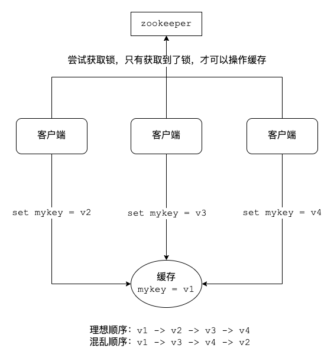

# Redis 企业实战

## 1. 架构设计

### 1.1 组件选择/多级

缓存的设计要分多个层次，在不同的层次上选择不同的缓存，包括 JVM 缓存、文件缓存和 Redis 缓存。

#### JVM 缓存

JVM 缓存就是本地缓存，设计在应用服务器中(Tomcat)。

通常可以采用 Ehcache 和 Guava Cache，在互联网应用中，由于要处理高并发，通常选择 Guava Cache。

适用本地( JVM )缓存的场景: 

1. 对性能有非常高的要求。
2. 不经常变化。
3. 占用内存不大。
4. 有访问整个集合的需求。
5. 数据允许不实时一致。

#### 文件缓存

这里的文件缓存是基于 HTTP 协议的文件缓存，一般放在 nginx 中。

因为静态文件(比如 CSS，JS，图片)中，很多都是不经常更新的。nginx 使用 proxy_cache 将用户的请求缓存到本地一个目录。
下一个相同请求可以直接调取缓存文件，就不用去请求服务器了。

```text
server {
        listen       80 default_server;
        server_name  localhost;
        root /mnt/blog/;
        location / {
        
        }
        
        #要缓存文件的后缀，可以在以下设置。
        location ~ .*\.(gif|jpg|png|css|js)(.*) {
            proxy_pass http://ip地址:90; 
            proxy_redirect off; 
            proxy_set_header Host $host; 
            proxy_cache cache_one; 
            proxy_cache_valid 200 302 24h; 
            proxy_cache_valid 301 30d; 
            proxy_cache_valid any 5m; 
            expires 90d;
            add_header wall  "hello zmn.";
        } 
}
```

#### Redis缓存

分布式缓存，采用 *主从 + 哨兵* 或 RedisCluster 的方式缓存数据库的数据。

在实际开发中

- 作为数据库使用，数据要完整
- 作为缓存使用，作为Mybatis的二级缓存使用

### 1.2 缓存大小

GuavaCache 的缓存设置方式:

```java
CacheBuilder.newBuilder().maximumSize(num) // 超过num会按照LRU算法来移除缓存
```

nginx 的缓存设置方式:

```text
http { 
    ...
    proxy_cache_path /path/to/cache levels=1:2 keys_zone=my_cache:10m max_size=10g inactive=60m use_temp_path=off;
    
    server {
        proxy_cache mycache;
        location / {
            proxy_pass http://localhost:8000;
        }
    }
}
```

Redis 缓存设置:

```text
maxmemory=num # 最大缓存量 一般为内存的3/4 
maxmemory-policy allkeys lru #
```

**缓存淘汰策略的选择**

- `allkeys-lru`: 在不确定时一般采用策略。
- `volatile-lru`: 比 `allkeys-lru` 性能差， 存:过期时间
- `allkeys-random`: 希望请求符合平均分布(每个元素以相同的概率被访问) 
- 自己控制: `volatile-ttl` 缓存穿透
- 禁止驱逐 用作 DB 不设置 `maxmemory`

### 1.3 key数量

官方说 Redis 单例能处理key: 2.5 亿个

一个 key 或是 value 大小最大是 512M

### 1.4 读写峰值

Redis 采用的是基于内存的采用的是单进程单线程模型的 KV 数据库，由 C 语言编写，官方提供的数据是可以达到 110_000+ 的 QPS(每秒内查询次数)。80_000 的写。

### 1.5 命中率

- 命中: 可以直接通过缓存获取到需要的数据。
- 不命中: 无法直接通过缓存获取到想要的数据，需要再次查询数据库或者执行其它的操作。原因可能是由于缓存中根本不存在，或者缓存已经过期。

通常来讲，缓存的命中率越高则表示使用缓存的收益越高，应用的性能越好(响应时间越短、吞吐量越高)，抗并发的能力越强。

由此可见，在高并发的互联网系统中，缓存的命中率是至关重要的指标。

通过 `info` 命令可以监控服务器状态

```shell
127.0.0.1:6379> info
# Server
redis_version:5.0.5
redis_git_sha1:00000000
redis_git_dirty:0
redis_build_id:e188a39ce7a16352
redis_mode:standalone
os:Linux 3.10.0-229.el7.x86_64 x86_64 
arch_bits:64
# 缓存命中
keyspace_hits:1000
# 缓存未命中
keyspace_misses:20
used_memory:433264648
expired_keys:1333536
evicted_keys:1547380
```

> 命中率 = 1000 / 1000 + 20 = 83% ??? 我算的是 0.98

一个缓存失效机制，和过期时间设计良好的系统，命中率可以做到 95% 以上。 

影响缓存命中率的因素:

1. 缓存的数量越少命中率越高，比如缓存单个对象的命中率要高于缓存集合 
2. 过期时间越长命中率越高
3. 缓存越大缓存的对象越多，则命中的越多

### 1.6 过期策略

Redis 的过期策略是定时删除+惰性删除，这个前面已经讲了。

### 1.7 性能监控指标

利用 `info` 命令就可以了解 Redis 的状态了，主要监控指标有:

```shell
connected_clients:68 # 连接的客户端数量
used_memory_rss_human:847.62M # 系统给 Redis 分配的内存 
used_memory_peak_human:794.42M # 内存使用的峰值大小 
total_connections_received:619104 # 服务器已接受的连接请求数量 
instantaneous_ops_per_sec:1159 # 服务器每秒钟执行的命令数量 QPS 
instantaneous_input_kbps:55.85 # Redis 网络入口 kps 
instantaneous_output_kbps:3553.89 # Redis 网络出口 kps 
rejected_connections:0 # 因为最大客户端数量限制而被拒绝的连接请求数量 
expired_keys:0 # 因为过期而被自动删除的数据库键数量
evicted_keys:0 # 因为最大内存容量限制而被驱逐(evict)的键数量 
keyspace_hits:0 # 查找数据库键成功的次数
keyspace_misses:0 # 查找数据库键失败的次数
```

Redis监控平台: grafana、prometheus 以及 redis_exporter。

### 1.8 缓存预热

缓存预热就是系统启动前,提前将相关的缓存数据直接加载到缓存系统。

避免在用户请求的时候,先查询数据库,然后再将数据缓存的问题! 用户直接查询实现被预热的缓存数据。

加载缓存思路:

- 数据量不大，可以在项目启动的时候自动进行加载
- 利用定时任务刷新缓存，将数据库的数据刷新到缓存中

## 2. 缓存问题

### 2.1 缓存穿透

一般的缓存系统，都是按照 key 去缓存查询，如果不存在对应的 value，就应该去后端系统查找(比如 DB)。

缓存穿透是指在高并发下查询 key 不存在的数据(不存在的key)，会穿过缓存查询数据库。导致数据库 压力过大而宕机。

解决方案:

对查询结果为空的情况也进行缓存，缓存时间(ttl)设置短一点，或者该 key 对应的数据 insert 了之后清理缓存。

问题:缓存太多空值占用了更多的空间

使用布隆过滤器。在缓存之前在加一层布隆过滤器，在查询的时候先去布隆过滤器查询 key 是否存在，如果不存在就直接返回，存在再查缓存和 DB。


布隆过滤器(Bloom Filter)是 1970 年由布隆提出的。它实际上是一个很长的二进制向量和一系列随机 Hash 映射函数。

布隆过滤器可以用于检索一个元素是否在一个集合中。它的优点是空间效率和查询时间都远远超过一般的算法。


布隆过滤器的原理是，当一个元素被加入集合时，通过 K 个 Hash 函数将这个元素映射成一个数组中的 K 个点，把它们置为 1。
检索时，我们只要看看这些点是不是都是 1 就(大约)知道集合中有没有它了: 如果这些点有任何一个 0，则被检元素一定不在; 
如果都是 1，则被检元素很可能在。这就是布隆过滤器的基本思想。

### 2.2 缓存雪崩

当缓存服务器重启或者大量缓存集中在某一个时间段失效，这样在失效的时候，也会给后端系统(比如 DB)带来很大压力。

突然间大量的 key 失效了或 Redis 重启，大量访问数据库，数据库崩溃。

解决方案:

1. key 的失效期分散开，不同的 key 设置不同的有效期 
2. 设置二级缓存(数据不一定一致)
3. 高可用(脏读)

### 2.3 缓存击穿

对于一些设置了过期时间的 key，如果这些 key 可能会在某些时间点被超高并发地访问，是一种非常 "热点" 的数据。
这个时候，需要考虑一个问题: 缓存被 "击穿" 的问题，这个和缓存雪崩的区别在于，这里针对某一 key 缓存，前者则是很多 key。

缓存在某个时间点过期的时候，恰好在这个时间点对这个 Key 有大量的并发请求过来，这些请求发现缓存过期一般都会从后端DB加载数据并回设到缓存，
这个时候大并发的请求可能会瞬间把后端DB压垮。

解决方案: 

1. 用分布式锁控制访问的线程

使用 Redis 的 `setnx` 互斥锁先进行判断，这样其他线程就处于等待状态，保证不会有大并发操作去操作数据库。

2. 不设超时时间，`volatile-lru` 但会造成写一致问题

当数据库数据发生更新时，缓存中的数据不会及时更新，这样会造成数据库中的数据与缓存中的数据的不一致，应用会从缓存中读取到脏数据。
可采用延时双删策略处理，这个我们后面会详细讲到。

### 2.4 数据不一致

缓存和 DB 的数据不一致的根源: 数据源不一样。

如何解决？强一致性很难，追求最终一致性(时间) 

互联网业务数据处理的特点

- 高吞吐量
- 低延迟
- 数据敏感性低于金融业

时序控制是否可行?

先更新数据库再更新缓存或者先更新缓存再更新数据库，本质上不是一个原子操作，所以时序控制不可行。高并发情况下会产生不一致。

**保证数据的最终一致性(延时双删)**

1. 先更新数据库同时删除缓存项(key)，等读的时候再填充缓存
2. 2 秒后再删除一次缓存项(key)
3. 设置缓存过期时间 Expired Time 比如 10 秒或 1 小时
4. 将缓存删除失败记录到日志中，利用脚本提取失败记录再次删除(缓存失效期过长 7*24)

升级方案

通过数据库的 binlog 来异步淘汰 key，利用工具(canal)将 binlog 日志采集发送到 MQ 中，然后通过 ACK 机制确认处理删除缓存。

### 2.5 数据并发竞争

这里的并发指的是多个 Redis 的 client 同时 `set` 同一个 key 引起的并发问题。

多客户端(Jedis)同时并发写一个 key，一个 key 的值是 1，本来按顺序修改为2,3,4，最后是 4，但是顺序变成了4,3,2，最后变成了 2。

#### 方案1: 分布式锁 + 时间戳

1. 整体技术方案

这种情况，主要是准备一个分布式锁，大家去抢锁，抢到锁就做 `set` 操作。

加锁的目的实际上就是把并行读写改成串行读写的方式，从而来避免资源竞争。



- 我们希望的 key 更新顺序是：`v1 -> v2 -> v3 -> v4`
- 由于并发问题，key 更新的顺序变成了： `v1 -> v3 -> v4 -> v2`
- 引入分布式锁 zookeeper，要更新数据必须要获得锁
- `set mykey = v2` 先获得了锁，这个数据会变成 `v2`
- 接下来 `set mykey = v4` 获得了锁，这个数据变成 `v4`
- 然后 `set mykey = v3` 获得了锁，难道数据要被改成 `v3` 吗? 这样的数据不就又错了？

所以数据必须带有时间戳，当 `v3` 想要去更新数据时，就比较自己的时间戳和 `v4` 的时间戳谁更早，如果自己更早则放弃更新，否则覆盖 `v4`。

2. Redis 分布式锁的实现

主要用到的 Redis 函数是 `setnx()`。

用 `SETNX` 实现分布式锁。

时间戳 

由于上面举的例子，要求 key 的操作需要顺序执行，所以需要保存一个时间戳判断 `set` 顺序。

```text
系统A key 1 {ValueA 7:00} 
系统B key 1 {ValueB 7:05}
```

假设系统 B 先抢到锁，将 `key1` 设置为 `{ValueB 7:05}`。接下来系统 A 抢到锁，发现自己的 `key1` 的时间戳早于缓存中的时间戳(7:00<7:05)，那就不做 `set` 操作了。

#### 方案2: 利用消息队列

在并发量过大的情况下,可以通过消息中间件进行处理,把并行读写进行串行化。

把 Redis 的 `set` 操作放在队列中使其串行化, 必须的一个一个执行。

### 2.6 Hot Key

当有大量的请求(几十万)访问某个 Redis 某个 key 时，由于流量集中达到网络上限，从而导致这个 Redis 的服务器宕机。造成缓存击穿，
接下来对这个 key 的访问将直接访问数据库造成数据库崩溃，或者访问数据库回填 Redis 再访问 Redis，继续崩溃。


如何发现热key

1、预估热 key，比如秒杀的商品、火爆的新闻等 
2、在客户端进行统计，实现简单，加一行代码即可
3、如果是 Proxy，比如 Codis，可以在 Proxy 端收集
4、利用 Redis 自带的命令，`monitor`、`hotkeys`。但是执行缓慢(不要用)
5、利用基于大数据领域的流式计算技术来进行实时数据访问次数的统计，比如 Storm、Spark Streaming、Flink，这些技术都是可以的。

发现热点数据后可以写到 zookeeper 中


如何处理热Key: 

1. 变分布式缓存为本地缓存。

发现热 key 后，把缓存数据取出后，直接加载到本地缓存中。采用 Ehcache、Guava Cache 都可以，这样系统在访问热 key 数据时就可以直接访问自己的缓存了。
(数据不要求时时一致)

2. 在每个 Redis 主节点上备份热 key 数据，这样在读取时可以采用随机读取的方式，将访问压力负载到每个 Redis 上。
3. 利用对热点数据访问的限流熔断保护措施。

每个系统实例每秒最多请求缓存集群读操作不超过 400 次，一超过就可以熔断掉，不让请求缓存集群，直接返回一个空白信息，然后用户稍后会自行再次重新刷新页面之类的。
(首页不行，系统友好性差)。

通过系统层自己直接加限流熔断保护措施，可以很好的保护后面的缓存集群。

### 2.7 Big Key

Big Key 指的是存储的值(Value)非常大，常见场景:

- 热门话题下的讨论
- 大V的粉丝列表
- 序列化后的图片
- 没有及时处理的垃圾数据
- ..... 

Big Key 的影响:

- Big Key 会大量占用内存，在集群中无法均衡
- Redis的性能下降，主从复制异常
- 在主动删除或过期删除时会操作时间过长而引起服务阻塞

如何发现大key:

1. redis-cli `--bigkeys`命令。可以找到某个实例5种数据类型(String、hash、list、set、zset)的最大key。

> 但如果 Redis 的 key 比较多，执行该命令会比较慢

2. 获取生产 Redis 的 rdb 文件，通过 rdbtools 分析 rdb 生成 csv 文件，再导入 MySQL 或其他数据库中进行分析统计，根据 `size_in_bytes` 统计 Big Key

大key的处理:

优化 Big Key 的原则就是 String 减少字符串长度，list、hash、set、zset等减少成员数。

1、String 类型的 Big key，尽量不要存入 Redis 中，可以使用文档型数据库 MongoDB 或缓存到 CDN 上。

> 如果必须用 Redis 存储，最好单独存储，不要和其他的 key 一起存储。采用一主一从或多从。

2. 单个简单的 key 存储的 value 很大，可以尝试将对象分拆成几个 key-value， 使用 `mget` 获取值，这样分拆的意义在于分拆单次操作的压力，将操作压力平摊到多次操作中，降低对 Redis 的IO影响。

3. hash，set，zset，list 中存储过多的元素，可以将这些元素分拆。(常见)

```text
以 hash 类型举例来说，对于 field 过多的场景，可以根据 field 进行 hash 取模，生成一个新的 key，
例如 原来的 hash_key:{filed1:value, filed2:value, filed3:value ...}，可以 hash 取模后形成如下 key:value 形式

hash_key:1:{filed1:value}
hash_key:2:{filed2:value}
hash_key:3:{filed3:value}
...

取模后，将原先单个 key 分成多个 key，每个 key filed 个数为原先的 1/N
```

3. 删除大 key 时不要使用 del,因为 del 是阻塞命令，删除时会影响性能。

4. 使用 lazy delete (`unlink` 命令)

删除指定的 key(s), 若 key 不存在则该 key 被跳过。但是，相比 DEL 会产生阻塞，该命令会在另一个线程中回收内存，因此它是非阻塞的。
这也是该命令名字的由来: 仅将 keys 从 key 空间中删除，真正的数据删除会在后续异步操作。

```shell
redis> SET key1 "Hello"
"OK"
redis> SET key2 "World"
"OK"
redis> UNLINK key1 key2 key3
(integer) 2
```

## 3. 缓存与数据库一致性

### 3.1 缓存更新策略

- 利用 Redis 的缓存淘汰策略被动更新 LRU 、LFU
- 利用TTL被动更新
- 在更新数据库时主动更新 (先更数据库再删缓存 —— 延时双删)
- 异步更新 定时任务 数据不保证时时一致 不穿DB

### 3.2 不同策略之间的优缺点

| 策略                 | 一致性 | 维护成本 |
|--------------------|-----|------|
| 利用Redis的缓存淘汰策略被动更新 | 最差  | 最低   |
| 利用TTL被动更新          | 较差  | 较低   |
| 在更新数据库时主动更新        | 较强  | 最高   |

### 3.3 与 Mybatis 整合

可以使用 Redis 做 Mybatis 的二级缓存，在分布式环境下可以使用。 

> 框架采用 Springboot + Mybatis + Redis。框架的搭建就不赘述了。

> 代码编写略...

## 4. 分布式锁

### 4.1 利用 Watch 实现 Redis 乐观锁

乐观锁基于CAS(Compare And Swap)思想(比较并替换)，是不具有互斥性，不会产生锁等待而消耗资源，但是需要反复的重试，但也是因为重试的机制，
能比较快的响应。因此我们可以利用 Redis 来实现乐观锁。

具体思路如下:

1. 利用 Redis 的 watch 功能，监控这个 redisKey 的状态值
2. 获取 RedisKey 的值
3. 创建 Redis 事务
4. 给这个 Key 的值 +1
5. 然后去执行这个事务，如果 Key 的值被修改过则回滚，Key 不 +1

Redis乐观锁实现秒杀

> 代码 略...

### 4.2 SETNX

实现原理

- 共享资源互斥
- 共享资源串行化

单应用中使用锁: (单进程多线程) synchronized、ReentrantLock
分布式应用中使用锁:(多进程多线程) 分布式锁是控制分布式系统之间同步访问共享资源的一种方式。

利用 Redis 的单线程特性对共享资源进行串行化处理

#### 实现方式

##### 获取锁

方式1: 使用 `set` 命令实现 (推荐)

```java{12}
/**
 * 使用redis的set命令实现获取分布式锁
 * 
 * @param lockKey    可以就是锁
 * @param requestId  请求ID，保证同一性 uuid + threadID
 * @param expireTime 过期时间，避免死锁 
 * @return
 */
public boolean getLock(String lockKey,String requestId,int expireTime) {
    //NX:保证互斥性
    // hset 原子性操作 只要lockKey有效 则说明有进程在使用分布式锁
    String result = jedis.set(lockKey, requestId, "NX", "EX", expireTime);
    if("OK".equals(result)) {
        return true;
    }
    return false;
}
```

方式2: 使用 `setnx` 命令实现 (并发会产生问题)

```java{2}
public  boolean getLock(String lockKey,String requestId,int expireTime) {
    Long result = jedis.setnx(lockKey, requestId);
    if(result == 1) {
    //成功设置 进程down 永久有效 别的进程就无法获得锁 jedis.expire(lockKey, expireTime);
    return true;
    }
    return false;
}
```

##### 释放锁 

方式1: `del` 命令实现 (并发)

```java
/**
 * 释放分布式锁
 * 
 * @param lockKey * @param requestId
 */
public static void releaseLock(String lockKey,String requestId) {
    if (requestId.equals(jedis.get(lockKey))) {
        jedis.del(lockKey);
    } 
}
```

问题在于如果调用 `jedis.del()` 方法的时候，这把锁已经不属于当前客户端的时候，会解除他人加的锁。
那么是否真的有这种场景? 答案是肯定的，比如客户端 A 加锁，一段时间之后客户端 A 解锁，在执行 `jedis.del()` 之前，锁突然过期了，
此时客户端 B 尝试加锁成功，然后客户端 A 再执行 `del()` 方法，则将客户端 B 的锁给解除了。

方式2: Redis + Lua脚本实现 (推荐)

```java{2}
public static boolean releaseLock(String lockKey, String requestId) {
    String script = "if redis.call('get', KEYS[1]) == ARGV[1] then return redis.call('del', KEYS[1]) else return 0 end";
    Object result = jedis.eval(script, Collections.singletonList(lockKey), Collections.singletonList(requestId));
    if (result.equals(1L)) {
        return true;
    }
    return false;
}
```

#### 存在问题

- 单机: 无法保证高可用
- 主从: 无法保证数据的强一致性，在主机宕机时会造成锁的重复获得。

无法续租: 超过 expireTime 后，不能继续使用

#### 本质分析

CAP 模型分析

在分布式环境下不可能满足三者共存，只能满足其中的两者共存，在分布式下 P 不能舍弃(舍弃 P 就是单机了)。
所以只能是 CP(强一致性模型)和 AP(高可用模型)。

分布式锁是 CP 模型，Redis 集群是 AP 模型。(base)

*Redis 集群不能保证数据的实时一致性，只能保证数据的最终一致性*。

为什么还可以用 Redis 实现分布式锁?

与业务有关

- 当业务不需要数据强一致性时，比如: 社交场景，就可以使用 Redis 实现分布式锁
- 当业务必须要数据的强一致性，即不允许重复获得锁，比如金融场景(重复下单，重复转账)就不要使用

可以使用CP模型实现，比如: zookeeper 和 etcd。

### 4.3 Redisson 分布式锁的使用

Redisson 是架设在 Redis 基础上的一个 Java 驻内存数据网格(In-Memory Data Grid)。

Redisson 在基于 NIO 的 Netty 框架上，生产环境使用分布式锁。

#### 4.3.1 使用步骤

1. 加入 jar 包的依赖

```xml
<dependency>
    <groupId>org.redisson</groupId>
    <artifactId>redisson</artifactId>
    <version>2.7.0</version>
</dependency>
```

2. 配置 Redisson

```java
public class RedissonManager {
    private static Config config = new Config();

    // 声明 Redisson 对象
    private static Redisson redisson = null;

    // 实例化 Redisson
    static {
        config.useClusterServers()
                // 集群状态扫描间隔时间，单位是毫秒
                .setScanInterval(2000)
                // cluster 方式至少 6 个节点(3主3从，3主做sharding，3从用来保证主宕机后可以高可用) 
                .addNodeAddress("redis://127.0.0.1:6379")
                .addNodeAddress("redis://127.0.0.1:6380")
                .addNodeAddress("redis://127.0.0.1:6381")
                .addNodeAddress("redis://127.0.0.1:6382")
                .addNodeAddress("redis://127.0.0.1:6383")
                .addNodeAddress("redis://127.0.0.1:6384");
        //得到redisson对象
        redisson = (Redisson) Redisson.create(config);
    }

    //获取redisson对象的方法
    public static Redisson getRedisson() {
        return redisson;
    }
}
```

3. 锁的获取和释放

```java
public class DistributedRedisLock {
    
    // 从配置类中获取 Redisson 对象
    private static Redisson redisson = RedissonManager.getRedisson();
    
    private static final String LOCK_TITLE = "redisLock_"; 
    
    // 加锁
    public static boolean acquire(String lockName) {
        // 声明 key 对象
        String key = LOCK_TITLE + lockName;
        // 获取锁对象
        RLock mylock = redisson.getLock(key);
        // 加锁，并且设置锁过期时间3秒，防止死锁的产生 uuid+threadId
        mylock.lock(2, 3, TimeUtil.SECOND);
        // 加锁成功
        return true;
    }

    //锁的释放
    public static void release(String lockName) {
        //必须是和加锁时的同一个key
        String key = LOCK_TITLE + lockName;
        //获取所对象
        RLock mylock = redisson.getLock(key);
        //释放锁(解锁) 
        mylock.unlock();
    }
}
```

4. 业务逻辑中使用分布式锁

```java{}
public String discount() throws IOException{
    String key = "lock001";
    // 加锁
    DistributedRedisLock.acquire(key); 
    // 执行具体业务逻辑
    dosoming()
    // 释放锁 
    DistributedRedisLock.release(key);
    //返回结果 
    return soming;
}
```

#### 4.3.2 Redisson 分布式锁的实现原理

##### 加锁机制

如果该客户端面对的是一个 Redis Cluster 集群，他首先会根据 Hash 节点选择一台机器。发送 Lua 脚本到 Redis 服务器上，脚本如下:

```lua
if (redis.call('exists', KEYS[1]) == 0) then --看有没有锁
    redis.call('hset', KEYS[1], ARGV[2], 1); --无锁 加锁
    redis.call('pexpire', KEYS[1], ARGV[1]);
    return nil;
end ;
if (redis.call('hexists', KEYS[1], ARGV[2]) == 1) then --我加的锁 
    redis.call('hincrby', KEYS[1], ARGV[2], 1); --重入锁 
    redis.call('pexpire', KEYS[1], ARGV[1]);
    return nil;
end ;
return redis.call('pttl', KEYS[1]); --不能加锁，返回锁的时间
```

Lua的作用: 保证这段复杂业务逻辑执行的原子性。

Lua的解释:

- `KEYS[1])`: 加锁的 key
- `ARGV[1]`: key 的生存时间，默认为 30 秒
- `ARGV[2]`: 加锁的客户端ID `(UUID.randomUUID()) + ":" + threadId)`

第一段 if 判断语句，就是用 `exists myLock` 命令判断一下，如果要加锁的那个锁 key 不存在的话，就进行加锁。

如何加锁呢? 很简单，用下面的命令:

```shell
hset myLock 8743c9c0-0795-4907-87fd-6c719a6b4586:1 1
```

通过这个命令设置一个 Hash 数据结构，这行命令执行后，会出现一个类似下面的数据结构:

```text
myLock :{"8743c9c0-0795-4907-87fd-6c719a6b4586:1":1 }
```

上述就代表 `8743c9c0-0795-4907-87fd-6c719a6b4586:1` 这个客户端对 `myLock` 这个锁 key 完成了加锁。

接着会执行 `pexpire myLock 30000` 命令，设置 myLock 这个锁 key 的生存时间是 30 秒。

##### 锁互斥机制

在这个时候，如果客户端 2 来尝试加锁，执行了同样的一段 Lua 脚本，会怎么样呢?

很简单，第一个 `if` 判断会执行 `exists myLock`，发现 `myLock` 这个锁 key 已经存在了。

接着第二个 `if` 判断，判断一下，`myLock` 锁 key 的 Hash 数据结构中，是否包含客户端 2 的 ID，但是明显不是的，因为那里包含的是客户端 1 的 ID。

所以，客户端 2 会获取到 `pttl myLock` 返回的一个数字，这个数字代表了 `myLock` 这个锁 key 的剩余生存时间。比如还剩 15_000 毫秒的生存时间。

此时客户端 2 会进入一个 `while` 循环，不停的尝试加锁。 

##### 自动延时机制

只要客户端 1 一旦加锁成功，就会启动一个 `watch dog` 看门狗，他是一个后台线程，会每隔 10 秒检查一 下，
如果客户端 1 还持有锁 key，那么就会不断的延长锁 key 的生存时间。

##### 可重入锁机制

第一个 `if` 判断肯定不成立，`exists myLock` 会显示锁 key 已经存在了。 

第二个 `if` 判断会成立，因为 `myLock` 的 `Hash` 数据结构中包含的那个 ID，就是客户端 1 的那个ID，也就是 `8743c9c0-0795-4907-87fd-6c719a6b4586:1`

此时就会执行可重入加锁的逻辑，他会用:

```shell
incrby myLock 8743c9c0-0795-4907-87fd-6c71a6b4586:1 1
```

通过这个命令，对客户端 1 的加锁次数，累加 1。数据结构会变成:

```text
myLock :{"8743c9c0-0795-4907-87fd-6c719a6b4586:1":2 }
```

##### 释放锁机制

执行 Lua 脚本如下:

```lua
-- 如果key已经不存在，说明已经被解锁，直接发布(publish) Redis 消息
if (redis.call('exists', KEYS[1]) == 0) then
    redis.call('publish', KEYS[2], ARGV[1]);
    return 1;
end ;
-- key 和 field 不匹配，说明当前客户端线程没有持有锁，不能主动解锁。 
-- 不是我加的锁 不能解锁
if (redis.call('hexists', KEYS[1], ARGV[3]) == 0) then
    --  将value减1
    return nil;
end ;

local counter = redis.call('hincrby', KEYS[1], ARGV[3], -1);
-- 如果 counter > 0 说明锁在重入，不能删除 key
if (counter > 0) then
    redis.call('pexpire', KEYS[1], ARGV[2]);
    return 0;
--删除key并且publish 解锁消息
else
    redis.call('del', KEYS[1]); -- 删除锁 
    redis.call('publish', KEYS[2], ARGV[1]);
    return 1;
end ;
return nil;
```

– `KEYS[1]`: 需要加锁的 key，这里需要是字符串类型。
– `KEYS[2]`: Redis 消息的 ChannelName, 一个分布式锁对应唯一的一个 channelName: `redisson_lockchannel{" + getName() + "}`
– `ARGV[1]`: Redis消息体，这里只需要一个字节的标记就可以，主要标记 Redis 的 key 已经解锁，再结合 Redis 的 Subscribe，能唤醒其他订阅解锁消息的客户端线程申请锁。
– `ARGV[2]`: 锁的超时时间，防止死锁
– `ARGV[3]`: 锁的唯一标识，也就是刚才介绍的 `id(UUID.randomUUID()) + “:” + threadId`

如果执行 `lock.unlock()`，就可以释放分布式锁，此时的业务逻辑也是非常简单的。其实说白了，就是每次都对 `myLock` 数据结构中的那个加锁次数 -1。

如果发现加锁次数是 0 了，说明这个客户端已经不再持有锁了，此时就会用: `del myLock` 命令，从 Redis 里删除这个key。
然后呢，另外的客户端 2 就可以尝试完成加锁了。

### 4.4 分布式锁特性

互斥性
任意时刻，只能有一个客户端获取锁，不能同时有两个客户端获取到锁。
同一性
锁只能被持有该锁的客户端删除，不能由其它客户端删除。
可重入性
持有某个锁的客户端可继续对该锁加锁，实现锁的续租
容错性 锁失效后(超过生命周期)自动释放锁(key失效)，其他客户端可以继续获得该锁，防止死锁

### 4.5 分布式锁的实际应用
数据并发竞争
利用分布式锁可以将处理串行化，前面已经讲过了。
防止库存超卖

订单1下单前会先查看库存，库存为10，所以下单5本可以成功; 订单2下单前会先查看库存，库存为10，所以下单8本可以成功;
订单1和订单2 同时操作，共下单13本，但库存只有10本，显然库存不够了，这种情况称为库存超卖。 可以采用分布式锁解决这个问题。

订单1和订单2都从Redis中获得分布式锁(setnx)，谁能获得锁谁进行下单操作，这样就把订单系统下单 的顺序串行化了，就不会出现超卖的情况了。伪码如下:


```java{}
//加锁并设置有效期 
if(redis.lock("RDL",200)){
    //判断库存
    if (orderNum < getCount()){
        //加锁成功 ,可以下单
        order(5);
        //释放锁 
        redis,unlock("RDL");
    }
}
```

注意此种方法会降低处理效率，这样不适合秒杀的场景，秒杀可以使用 CAS 和 Redis 队列的方式。

### 4.6 Zookeeper分布式锁的对比

- 基于 Redis 的 set 实现分布式锁 
- 基于 zookeeper 临时节点的分布式锁
- 基于 etcd 实现 

三者的对比，如下表

|       | Redis | zookeeper         | etcd        |
|-------|-------|-------------------|-------------|
| 一致性算法 | 无     | paxos(ZAB)        | raft        |
| CAP   | AP    | CP                | CP          |
| 高可用   | 主从集群  | n+1 (n至少为2)       | n+1         |
| 接口类型  | 客户端   | 客户端               | http/grpc   |
| 实现    | setNX | `createEphemeral` | restful API |

## 5. 分布式集群架构中的 session 分离

传统的 Session 是由 Tomcat 自己进行维护和管理，但是对于集群或分布式环境，不同的 Tomcat 管理各自的 Session，
很难进行 Session 共享，通过传统的模式进行 Session 共享，会造成 Session 对象在各个 Tomcat 之间，通过网络和 IO 进行复制，极大的影响了系统的性能。

可以将登录成功后的 Session 信息，存放在 Redis 中，这样多个服务器(Tomcat)可以共享 Session 信息。
利用 spring-session-data-redis(SpringSession)，可以实现基于 Redis 来实现的 Session 分离。
这个知识点在讲 Spring 的时候讲过了，这里就不再赘述了。

## 6. 阿里 Redis 使用手册

本文主要介绍在使用阿里云Redis的开发规范，从下面几个方面进行说明。 

- 键值设计
- 命令使用
- 客户端使用
- 相关工具

通过本文的介绍可以减少使用 Redis 过程带来的问题。 

### 6.1 键值设计

#### 6.1.1 key 名设计

**可读性和可管理性**

以业务名(或数据库名)为前缀(防止key冲突)，用冒号分隔，比如 `业务名:表名:id`

```text
ugc:video:1
```

**简洁性**

保证语义的前提下，控制 key 的长度，当 key 较多时，内存占用也不容忽视，例如:

```text
user:{uid}:friends:messages:{mid}
// 简化为
u:{uid}:fr:m:{mid}
```

不要包含特殊字符

反例: 包含空格、换行、单双引号以及其他转义字符

#### 6.1.2 value 设计

拒绝 BigKey

防止网卡流量、慢查询，string 类型控制在 10KB 以内，hash、list、set、zset 元素个数不要超过 5000。 

反例: 一个包含 200 万个元素的list。 (拆解)

非字符串的 BigKey，不要使用 `del` 删除，使用 `hscan`、`sscan`、`zscan` 方式渐进式删除，同时要注意防止 BigKey 过期时间自动删除问题
(例如一个 200 万的 zset 设置 1 小时过期，会触发 `del` 操作，造成阻塞，而且 该操作不会不出现在慢查询中(latency可查))，查找方法和删除方法

选择适合的数据类型

例如: 实体类型(要合理控制和使用数据结构内存编码优化配置,例如 ziplist，但也要注意节省内存和性能之间的平衡)

反例:

```shell
set user:1:name tom
set user:1:age 19
set user:1:favor football
```

正例：

```shell
hmset user:1 name tom age 19 favor football
```

控制key的生命周期

Redis 不是垃圾桶，建议使用 `expire` 设置过期时间(条件允许可以打散过期时间，防止集中过期)，不过期的数据重点关注 `idletime`。

### 6.2 命令使用

1. O(N) 命令关注 N 的数量

例如 `hgetall`、`lrange`、`smembers`、`zrange`、`sinter` 等并非不能使用，但是需要明确 N 的值。
有遍历的需求可以使用 `hscan`、`sscan`、`zscan` 代替。 

2. 禁用命令

禁止线上使用 `keys`、`flushall`、`flushdb` 等，通过 Redis 的 `rename` 机制禁掉命令，或者使用 scan 的方式渐进式处理。

3. 合理使用 select

Redis 的多数据库较弱，使用数字进行区分，很多客户端支持较差，同时多业务用多数据库实际还是单线程处理，会有干扰。

4. 使用批量操作提高效率
   1. 原生命令: 例如 mget、mset。
   2. 非原生命令:可以使用 `pipeline` 提高效率。
   
但要注意控制一次批量操作的元素个数(例如 500 以内，实际也和元素字节数有关)。
  
注意两者不同:

- 原生是原子操作，pipeline是非原子操作。
- pipeline可以打包不同的命令，原生做不到
- pipeline需要客户端和服务端同时支持。

5. 不建议过多使用 Redis 事务功能

Redis 的事务功能较弱(不支持回滚)，而且集群版本(自研和官方)要求一次事务操作的 key 必须在一个 slot 上(可以使用 `hashtag` 功能解决)

6. Redis 集群版本在使用 Lua 上有特殊要求
    1. 所有 key 都应该由 KEYS 数组来传递，`redis.call/pcall` 里面调用的 Redis 命令，key 的位置，必须是 KEYS array, 否则直接返回 `error，"-ERR bad lua script for redis cluster, all the keys that the script uses should be passed using the KEYS arrayrn"`
    2. 所有 key，必须在 1 个 slot 上，否则直接返回 `error, "-ERR eval/evalsha command keys must in same slotrn"`

7. `monitor`命令

必要情况下使用 `monitor` 命令时，要注意不要长时间使用。

### 6.3 客户端使用

1. 避免多个应用使用一个 Redis 实例

不相干的业务拆分，公共数据做服务化。

2. 使用连接池

可以有效控制连接，同时提高效率，标准使用方式:

```java
class PoolDemo {
    public static void main(String[] args) {
        Jedis jedis = null;
        try {
            jedis = jedisPool.getResource();
            // 具体的命令
            jedis.executeCommand();
        } catch (Exception e) {
            logger.error("op key {} error: " + e.getMessage(), key, e);
        } finally {
            // 注意：这里不是关闭连接，在 JedisPool 模式下，Jedis 会被归还给资源池。
            if (jedis != null) jedis.close;
        }
    }
}
```

3. 熔断功能

高并发下建议客户端添加熔断功能(例如 Netflix hystrix)

4. 合理的加密

设置合理的密码，如有必要可以使用 SSL 加密访问(阿里云 Redis 支持)

5. 淘汰策略

根据自身业务类型，选好 `maxmemory-policy`(最大内存淘汰策略)，设置好过期时间。

默认策略是 `volatile-lru`，即超过最大内存后，在过期键中使用 LRU 算法进行 key 的剔除，保证不过期数据不被删除，但是可能会出现OOM问题。

其他策略如下:

- `allkeys-lru`: 根据 LRU 算法删除键，不管数据有没有设置超时属性，直到腾出足够空间为止。
- `allkeys-random`: 随机删除所有键，直到腾出足够空间为止。
- `volatile-random`: 随机删除过期键，直到腾出足够空间为止。
- `volatile-ttl`: 根据键值对象的 `ttl` 属性，删除最近将要过期数据。如果没有，回退到 `noeviction` 策略。
- `noeviction`: 不会剔除任何数据，拒绝所有写入操作并返回客户端错误信息 `"(error) OOM command not allowed when used memory"`，此时 Redis 只响应读操作。

### 6.4 相关工具

1. 数据同步

Redis 间数据同步可以使用: `redis-port`

2. Big Key 搜索

Redis 大 Key 搜索工具

3. 热点 Key 寻找

内部实现使用 `monitor`，所以建议短时间使用 facebook 的 `redis-faina`

阿里云 Redis 已经在内核层面解决热点 Key 问题。

### 6.5 删除 BigKey

1. 下面操作可以使用 pipeline 加速。

2. Redis 4.0 已经支持 key 的异步删除，欢迎使用。

---

1. Hash删除: hscan + hdel
2. List删除: ltrim
3. Set删除: sscan + srem
4. SortedSet删除: zscan + zrem
