# Redis 底层数据结构

Redis 作为 Key-Value 存储系统，数据结构如下:

Redis 没有表的概念，Redis 实例所对应的 DB 以编号区分，DB 本身就是 key 的命名空间。 比如: `user:1000` 作为 key 值，表示在 user 这个命名空间下 id 为 1000 的元素，
类似于 user 表的 id=1000 的行。

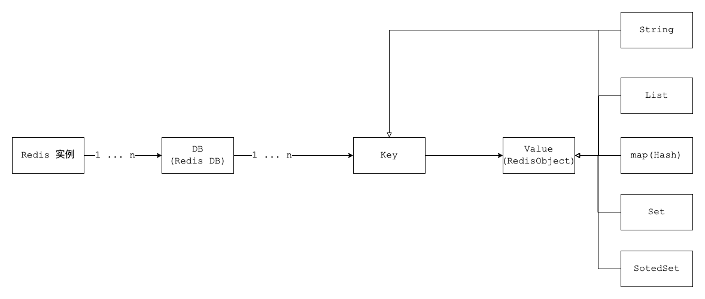

## 1. RedisDB 结构

Redis 中存在「数据库」的概念，该结构由 `redis.h` 中的 `redisDb` 定义。

当 Redis 服务器初始化时，会预先分配 16 个数据库。

所有数据库保存到结构 `redisServer` 的一个成员 `redisServer.db` 数组中

`redisClient` 中存在一个名叫 `db` 的指针指向当前使用的数据库

RedisDB 结构体源码:

```c
typedef struct redisDb {
    int id; //id是数据库序号，为0-15(默认Redis有16个数据库)
    long avg_ttl; //存储的数据库对象的平均ttl(time to live)，用于统计
    dict *dict; //存储数据库所有的 key-value
    dict *expires; // 存储 key 的过期时间
    dict *blocking_keys; // blpop 存储阻塞 key 和客户端对象
    dict *ready_keys; // 阻塞后 push 响应阻塞客户端 存储阻塞后push的key和客户端对象 
    dict *watched_keys; //存储 watch 监控的的 key 和客户端对象
} redisDb;
```

- `id` id是数据库序号，为 0-15 (默认Redis有16个数据库)
- `dict` 存储数据库所有的 key-value，后面要详细讲解
- `expires` 存储 key 的过期时间，后面要详细讲解

## 2. RedisObject 结构

Value 是一个对象，包含字符串对象、列表对象、哈希对象、集合对象和有序集合对象。

### 2.1 结构信息概览

```c
typedef struct redisObject {
    unsigned type:4; // 类型 对象类型 
    unsigned encoding:4;// 编码
    void *ptr;// 指向底层实现数据结构的指针
    //...
    int refcount;//引用计数
    //...
    unsigned lru:LRU_BITS; // LRU_BITS 为 24bit 记录最后一次被命令程序访问的时间 
    //...
} robj;
```

#### 4 位 type

type 字段表示对象的类型，占 4 位;

`REDIS_STRING`(字符串)、`REDIS_LIST` (列表)、`REDIS_HASH`(哈希)、`REDIS_SET`(集合)、`REDIS_ZSET`(有序集合)。

当我们执行 `type` 命令时，便是通过读取 `RedisObject` 的 `type` 字段获得对象的类型

```shell
127.0.0.1:6379> type a1
string
```

#### 4 位 encoding

`encoding` 表示对象的内部编码，占 4 位

每个对象有不同的实现编码

Redis 可以根据不同的使用场景来为对象设置不同的编码，大大提高了 Redis 的灵活性和效率。

通过 `object encoding` 命令，可以查看对象采用的编码方式

```shell
127.0.0.1:6379> object encoding a1
"int"
```

#### 24 位 LRU

lru 记录的是对象最后一次被命令程序访问的时间，( 4.0 版本占 24 位，2.6 版本占 22 位)。

高 16 位存储一个分钟数级别的时间戳，低 8 位存储访问计数(lfu : 最近访问次数)

```text
lru ---->  高16位: 最后被访问的时间
lfu -----> 低8位: 最近访问次数
```

#### refcount

`refcount` 记录的是该对象被引用的次数，类型为整型。

`refcount` 的作用，主要在于对象的引用计数和内存回收。

当对象的 `refcount` > 1 时，称为共享对象。

Redis 为了节省内存，当有一些对象重复出现时，新的程序不会创建新的对象，而是仍然使用原来的对象。

#### ptr

ptr 指针指向具体的数据，比如: `set hello world`，`ptr` 指向包含字符串 `world` 的 SDS。

> SDS (Simple Dynamic String，简单动态字符串) 是 Redis 底层所使用的字符串表示，几乎所有的 Redis 模块中都用了 SDS.

### 2.2 七种 type

#### 字符串对象

C语言: 字符数组 "\0"

Redis 使用了 SDS(Simple Dynamic String)。用于存储字符串和整型数据。

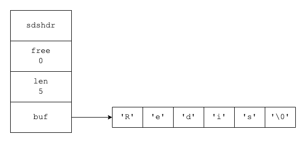

```d
struct sdshdr{
    //记录buf数组中已使用字节的数量 
    int len;
    // 记录 buf 数组中未使用字节的数量 
    int free; 
    //字符数组，用于保存字符串
    char buf[];
}
```

> `buf[]` 的长度 = `len` + `free` + 1

SDS的优势:

1. SDS 在 C 字符串的基础上加入了 `free` 和 `len` 字段，获取字符串长度: SDS 是 O(1)，C 字符串是 O(n)。
2. SDS 由于记录了长度，在可能造成缓冲区溢出时会自动重新分配内存，杜绝了缓冲区溢出。
3. 可以存取二进制数据，以字符串长度 len 来作为结束标识

- C语言: \0 空字符串 二进制数据包括空字符串，所以没有办法存取二进制数据
- SDS: 非二进制 \0
  二进制: 字符串长度 可以存二进制数据

**使用场景**

SDS 的主要应用在: 存储字符串和整型数据、存储 key、AOF 缓冲区和用户输入缓冲。

#### 跳跃表(重点)

跳跃表是有序集合(sorted-set)的底层实现，效率高，实现简单。

跳跃表的基本思想: 将有序链表中的部分节点分层，每一层都是一个有序链表。

**查找**

在查找时优先从最高层开始向后查找，当到达某个节点时，如果 next 节点值大于要查找的值或 next 指针指向null，则从当前节点下降一层继续向后查找。

举例:


查找元素 9，按道理我们需要从头结点开始遍历，一共遍历 8 个结点才能找到元素9。

第一次分层: 遍历 5 次找到元素 9 (红色的线为查找路径)

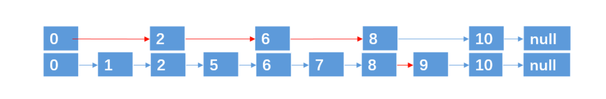


第二次分层: 遍历 4 次找到元素 9

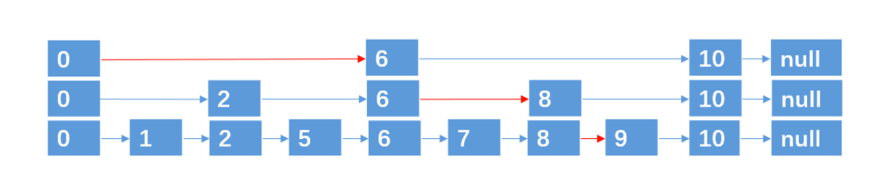

第三层分层: 遍历 4 次找到元素 9

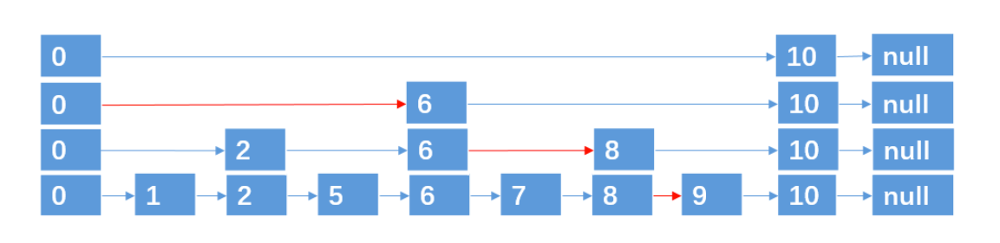

这种数据结构，就是跳跃表，它具有二分查找的功能。

**插入与删除**

上面例子中，9 个结点，一共 4 层，是理想的跳跃表。

通过抛硬币(概率 1/2)的方式来决定新插入结点跨越的层数:

- 正面:插入上层
- 背面:不插入

达到1/2概率(计算次数)

？？？

**删除**

找到指定元素并删除每层的该元素即可

--------------------------------------

跳跃表特点:

- 每层都是一个有序链表
- 查找次数近似于层数(1/2)
- 底层包含所有元素
- 空间复杂度 O(n) 扩充了一倍

--------------------------------------

##### Redis 跳跃表的实现

```c
// 跳跃表节点
typedef struct zskiplistNode {
    sds ele; /* 存储字符串类型数据 Redis 3.0 版本中使用 robj 类型表示， 但是在 Redis 4.0.1 中直接使用 sds 类型表示 */
    double score; //存储排序的分值
    struct zskiplistNode *backward; //后退指针，指向当前节点最底层的前一个节点
    
    /* 层，柔性数组，随机生成1-64的值 */
    struct zskiplistLevel {
        struct zskiplistNode *forward; //指向本层下一个节点
        unsigned int span; //本层下个节点到本节点的元素个数 
    } level[];
} zskiplistNode;

//链表
typedef struct zskiplist{
    //表头节点和表尾节点
    structz skiplistNode *header, *tail;
    //表中节点的数量
    unsigned long length; 
    //表中层数最大的节点的层数
    int level;
} zskiplist;
```

完整的跳跃表结构体:

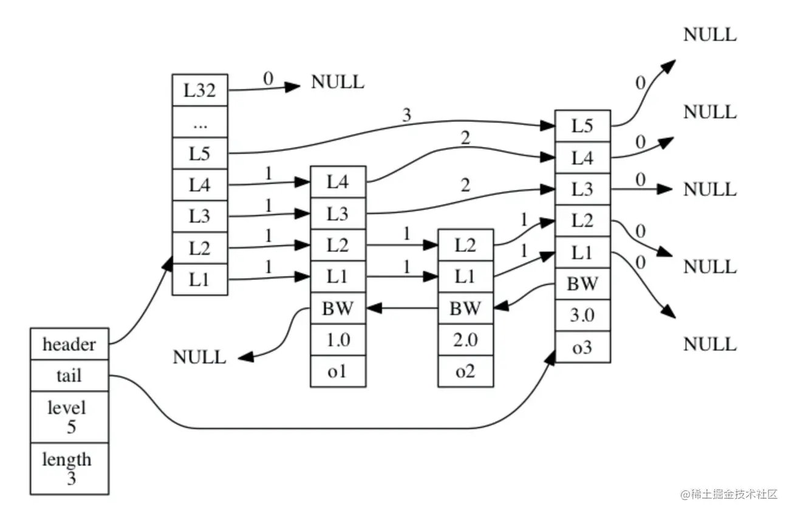

跳跃表的优势:

1、可以快速查找到需要的节点 O(logN)
2、可以在 O(1) 的时间复杂度下，快速获得跳跃表的头节点、尾结点、长度和高度。

应用场景: 有序集合的实现

#### 字典(重点+难点)

字典 Dict 又称散列表(Hash)，是用来存储键值对的一种数据结构。

Redis 整个数据库是用字典来存储的。(K-V结构)

对Redis进行CURD操作其实就是对字典中的数据进行CURD操作。

数组

数组: 用来存储数据的容器，采用 头指针 + 偏移量 的方式能够以 O(1) 的时间复杂度定位到数据所在的内存地址。

Redis 海量存储 快

Hash函数

Hash(散列)，作用是把任意长度的输入通过散列算法转换成固定类型、固定长度的散列值。

Hash 函数可以把 Redis 里的 key: 包括字符串、整数、浮点数统一转换成整数。

```text
key=100.1 String “100.1” 5位长度的字符串
Redis-cli :times 33
Redis-Server : MurmurHash
```

数组下标 = `hash(key) % 数组容量`(`hash值 % 数组容量得到的余数`)

Hash冲突

不同的 key 经过计算后出现数组下标一致，称为Hash冲突。

采用单链表在相同的下标位置处存储原始 key 和 value. 当根据 key 找 Value 时，找到数组下标，遍历单链表可以找出 key 相同的 value。

##### Redis 字典的实现

Redis 字典实现包括: 字典(dict)、Hash表(dictht)、Hash表节点(dictEntry)。

**Hash表**

```c
typedef struct dictht {
    dictEntry **table;      // 哈希表数组
    unsigned long size;     // 哈希表数组的大小
    unsigned long sizemask; // 用于映射位置的掩码，值永远等于(size-1) 
    unsigned long used;     // 哈希表已有节点的数量,包含next单链表数据
} dictht;
```

1. Hash 表的数组初始容量为 4，随着 k-v 存储量的增加需要对 Hash 表数组进行扩容，新扩容量为当前量的一倍，即 4, 8, 16, 32
2. 索引值 = Hash值 & 掩码值(Hash值与Hash表容量取余)

**Hash表节点**

```c
typedef struct dictEntry {
    void *key;          // 键
    union {             // 值 v 的类型可以是以下 4 种类型
        void *val;
        uint64_t u64;
        int64_t s64;
        double d;
    } v;
    struct dictEntry *next; // 指向下一个哈希表节点，形成单向链表解决 Hash 冲突
} dictEntry;
```

- `key` 字段存储的是键值对中的键
- `v` 字段是个联合体，存储的是键值对中的值
- `next` 指向下一个哈希表节点，用于解决 Hash 冲突

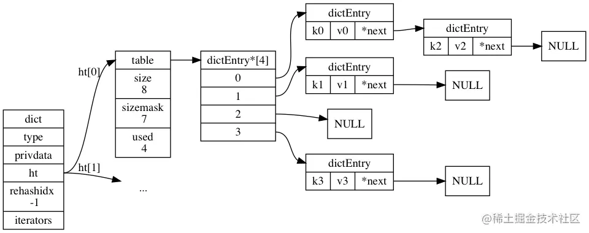

**Dict字典**

```c
typedef struct dict {
    dictType *type;     // 该字典对应的特定操作函数
    void *privdata;     // 上述类型函数对应的可选参数
    dictht ht[2];       /* 两张哈希表，存储键值对数据，ht[0]为原生哈希表，ht[1]为 rehash 哈希表 */
    long rehashidx;     /* rehash 标识 当等于 -1 时表示没有在 rehash，否则表示正在进行rehash操作; 存储的值表示 hash表, ht[0]的rehash进行到哪个索引值(数组下标) */
    int iterators;      // 当前运行的迭代器数量
} dict;
```

type 字段，指向 dictType 结构体，里边包括了对该字典操作的函数指针

```c
typedef struct dictType {
  // 计算哈希值的函数
  unsigned int (*hashFunction)(const void *key);
  // 复制键的函数
  void *(*keyDup)(void *privdata, const void *key);
  // 复制值的函数
  void *(*valDup)(void *privdata, const void *obj);
  // 比较键的函数
  int (*keyCompare)(void *privdata, const void *key1, const void *key2);
  // 销毁键的函数
  void (*keyDestructor)(void *privdata, void *key);
  // 销毁值的函数
  void (*valDestructor)(void *privdata, void *obj);
} dictType;
```

Redis 字典除了主数据库的 K-V 数据存储以外，还可以用于散列表对象、哨兵模式中的主从节点管理等。

在不同的应用中，字典的形态都可能不同，`dictType` 是为了实现各种形态的字典而抽象出来的操作函数(多态)。

**字典扩容**

字典达到存储上限(阈值 0.75)，需要 rehash(扩容)

扩容流程:

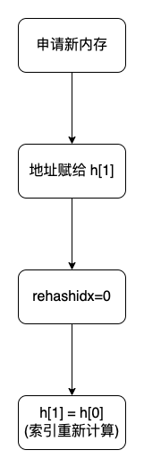

说明:

1. 初次申请默认容量为 4 个 `dictEntry`，非初次申请为当前 Hash 表容量的一倍。
2. `rehashidx=0` 表示要进行 rehash 操作。
3. 新增加的数据在新的 Hash 表 `h[1]`
4. 修改、删除、查询在老 Hash 表 `h[0]`、新 Hash 表 `h[1]` 中(rehash中)
5. 将老的 Hash 表 `h[0]` 的数据重新计算索引值后全部迁移到新的 Hash 表 `h[1]` 中，这个过程称为 rehash。

**渐进式 rehash**

当数据量巨大时 rehash 的过程是非常缓慢的，所以需要进行优化。
服务器忙，则只对一个节点进行 rehash 服务器闲，可批量 rehash(100节点)。

应用场景:

1. 主数据库的 K-V 数据存储
2. 散列表对象(hash)
3. 哨兵模式中的主从节点管理

#### 压缩列表

压缩列表(ziplist)是由一系列特殊编码的连续内存块组成的顺序型数据结构

节省内存

是一个字节数组，可以包含多个节点(entry)。每个节点可以保存一个字节数组或一个整数。

压缩列表的数据结构如下:

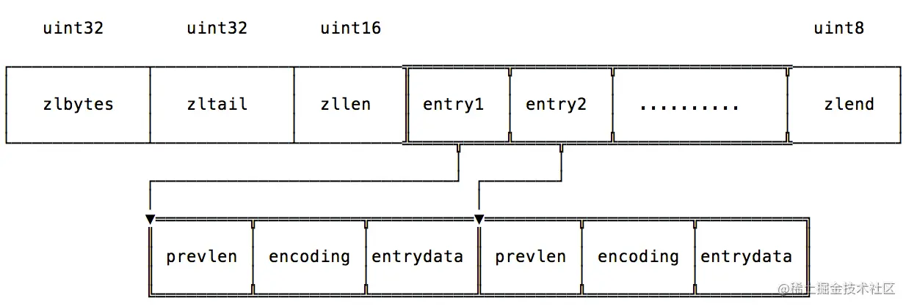

| 字段          | 说明                        |
|-------------|---------------------------|
| `zlbytes`   | 压缩列表的字节长度                 |
| `zltail`    | 压缩列表尾元素相对于压缩列表起始地址的偏移量    |
| `zllen`     | 压缩列表的元素个数                 |
| `entry1...` | 压缩列表的各个节点                 |
| `zlend`     | 压缩列表的结尾，占一个字节，恒为0xFF(255) |

`entryX` 元素的编码结构

| 字段                      | 说明         |
|-------------------------|------------|
| `previous_entry_length` | 前一个元素的字节长度 |
| `encoding`              | 表示当前元素的编码  |
| `entrydata`             | 数据内容       |

`ziplist` 结构体如下

```c
struct ziplist<T> {
    unsigned int zlbytes; // ziplist 的长度字节数，包含头部、所有 entry 和 zipend。 
    unsigned int zloffset; // 从 ziplist 的头指针到指向最后一个 entry 的偏移量，用于快速反向查询
    unsigned short int zllength; // entry 元素个数
    T[] entry; // 元素值
    unsigned char zlend; // ziplist 结束符，值固定为0xFF
}

typedef struct zlentry {
    unsigned int prevrawlensize;  // previous_entry_length字段的长度
    unsigned int prevrawlen;      // previous_entry_length字段存储的内容
    unsigned int lensize;         // encoding 字段的长度
    unsigned int len;             // 数据内容长度
    unsigned int headersize;      // 当前元素的首部长度，即 previous_entry_length 字段长度与 encoding 字段长度之和。
    unsigned char encoding;       // 数据类型
    unsigned char *p;             // 当前元素首地址
} zlentry;
```

应用场景:

- `sorted-set` 和 `hash` 元素个数少且是小整数或短字符串(直接使用)
- `list` 用快速链表(`quicklist`)数据结构存储，而快速链表是双向列表与压缩列表的组合。(间接使用)

#### 整数集合

整数集合(`intset`)是一个有序的(整数升序)、存储整数的连续存储结构。

当 Redis 集合类型的元素都是整数并且都处在 64 位有符号整数范围内(2^64)，使用该结构体存储。

```shell
127.0.0.1:6379> sadd set:001 1  3 5 6 2
(integer) 5
127.0.0.1:6379> object encoding set:001
"intset"
127.0.0.1:6379> sadd set:004 1 100000000000000000000000000 9999999999
(integer) 3
127.0.0.1:6379> object encoding set:004
"hashtable"
```

`intset` 的结构图如下

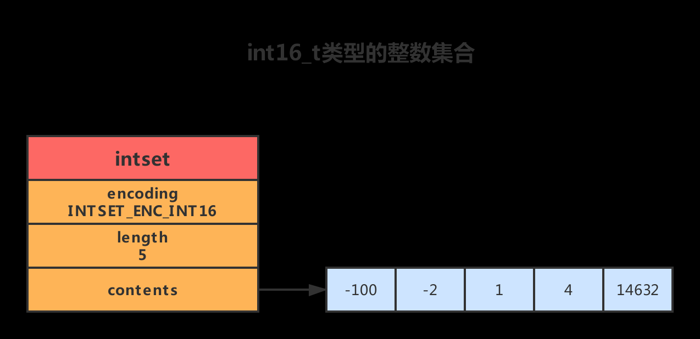

```c
typedef struct intset{ 
    //编码方式
    uint32_t encoding; 
    //集合包含的元素数量 
    uint32_t length; 
    //保存元素的数组 
    int8_t contents[];
}intset;
```

应用场景: 可以保存类型为 `int16_t`、`int32_t` 或者 `int64_t` 的整数值，并且保证集合中不会出现重复元素。

#### 快速列表(重要)

快速列表(QuickList)是 Redis 底层重要的数据结构，是列表的底层实现。

> 在 Redis 3.2 之前，Redis 采用双向链表(adlist)和压缩列表(ziplist)实现。

在 Redis 3.2 以后结合 `adlist` 和 `ziplist` 的优势 Redis 设计出了 QuickList。

```shell
127.0.0.1:6379> lpush list:001 1 2 5 4 3
(integer) 5
127.0.0.1:6379> object encoding list:001
"quicklist"
```

**双向列表(adlist)**

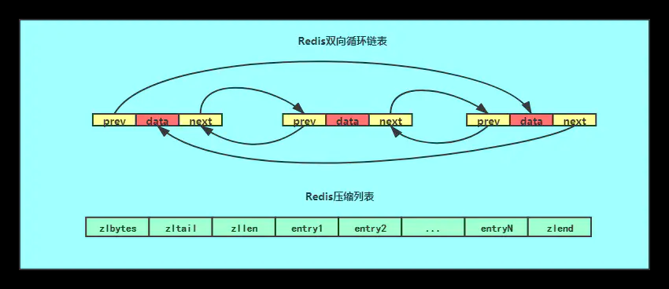

双向链表优势:

1. 双向: 链表具有前置节点和后置节点的引用，获取这两个节点时间复杂度都为 O(1)。
2. 普通链表(单链表): 节点类保留下一节点的引用。链表类只保留头节点的引用，只能从头节点插入删除。
3. 无环: 表头节点的 `prev` 指针和表尾节点的 `next` 指针都指向 `NULL`, 对链表的访问都是以 `NULL` 结束。

> 环状: 头的前一个节点指向尾节点

4. 带链表长度计数器: 通过 `len` 属性获取链表长度的时间复杂度为 O(1)。
5. 多态: 链表节点使用 `void*` 指针来保存节点值，可以保存各种不同类型的值。

**快速列表**

QuickList 是一个双向链表，链表中的每个节点是一个 `ziplist` 结构。

QuickList 中的每个节点 `ziplist` 都能够存储多个数据元素。

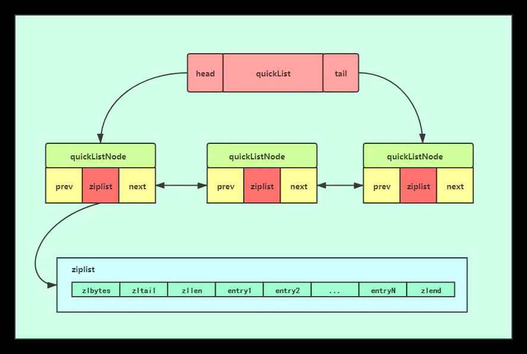

QuickList 的结构定义如下:

```c
typedef struct quicklist {
    quicklistNode *head;  // 指向quicklist的头部
    quicklistNode *tail;  // 指向quicklist的尾部
    unsigned long count;  // 列表中所有数据项的个数总和
    unsigned int len;     // quicklist节点的个数，即ziplist的个数
    int fill : 16; // ziplist大小限定，由 list-max-ziplist-size 给定 (Redis设定)
    unsigned int compress : 16; // 节点压缩深度设置，由 list-compress-depth 给定 (Redis设定)
} quicklist;
```

QuickListNode 的结构定义如下:

```c
typedef struct quicklistNode {
    struct quicklistNode *prev; // 指向上一个ziplist节点
    struct quicklistNode *next; // 指向下一个ziplist节点
    unsigned char *zl;          // 数据指针，如果没有被压缩，就指向ziplist结构，反之指向 quicklistLZF 结构
    unsigned int sz;  // 表示指向ziplist结构的总长度(内存占用长度)
    unsigned int count : 16;  // 表示ziplist中的数据项个数
    unsigned int encoding : 2;  // 编码方式，1--ziplist，2--quicklistLZF
    unsigned int container : 2;  // 预留字段，存放数据的方式，1--NONE，2--ziplist
    unsigned int recompress : 1;  // 解压标记，当查看一个被压缩的数据时，需要暂时解压，标记此参数为 1，之后再重新进行压缩
    unsigned int attempted_compress : 1; // 测试相关
    unsigned int extra : 10; // 扩展字段，暂时没用
} quicklistNode;
```

**数据压缩**

QuickList 每个节点的实际数据存储结构为 `ziplist`，这种结构的优势在于节省存储空间。为了进一步降低 `ziplist` 的存储空间，还可以对 `ziplist` 进行压缩。

Redis 采用的压缩算法是 LZF。其基本思想是: 数据与前面重复的记录重复位置及长度，不重复的记录原始数据。

压缩过后的数据可以分成多个片段，每个片段有两个部分: 解释字段和数据字段。

`quicklistLZF` 的结构体如下:

```c
typedef struct quicklistLZF {
    unsigned int sz; // LZF压缩后占用的字节数 
    char compressed[]; // 柔性数组，指向数据部分
} quicklistLZF;
```

**应用场景**

列表(List)的底层实现、发布与订阅、慢查询、监视器等功能。

#### 流对象

Stream 主要由: 消息、生产者、消费者和消费组构成。

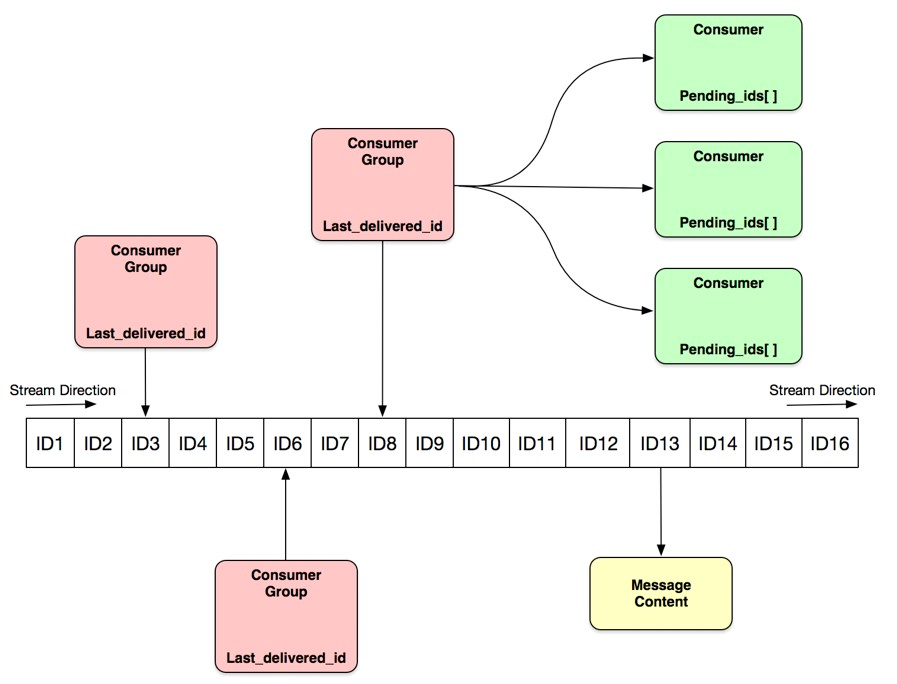

Redis Stream 的底层主要使用了 listpack(紧凑列表) 和 Rax 树(基数树)。

**listpack**

listpack 表示一个字符串列表的序列化，listpack 可用于存储字符串或整数。用于存储 Stream 的消息内容。

结构如下图:

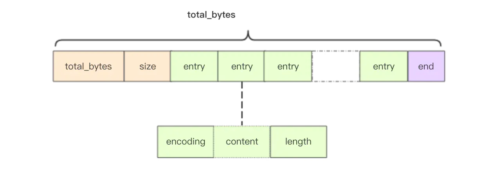

**Rax树**

Rax 是一个有序字典树(基数树 Radix Tree)，按照 key 的字典序排列，支持快速地定位、插入和删除操作。

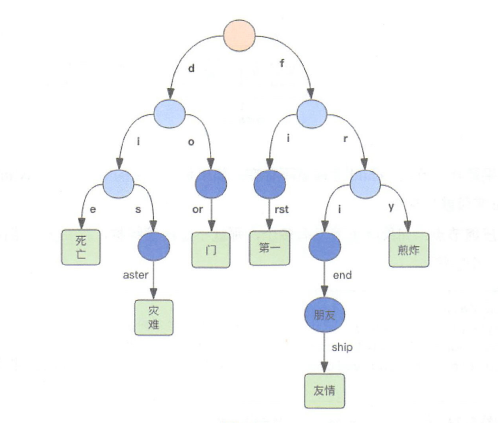

Rax 被用在 Redis Stream 结构里面用于存储消息队列，在 Stream 里面消息 ID 的前缀是 `时间戳 + 序号`，
这样的消息可以理解为时间序列消息。使用 Rax 结构进行存储就可以快速地根据消息 ID 定位到具体的消息，
然后继续遍历指定消息之后的所有消息。

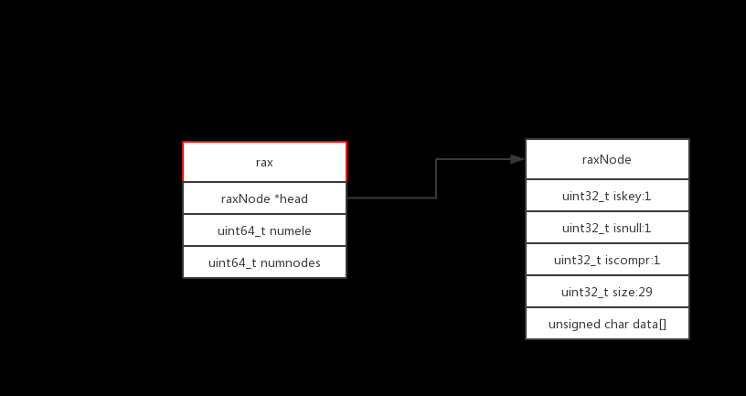

**应用场景**: Stream 的底层实现

### 2.3 十种 encoding

`encoding` 表示对象的内部编码，占 4 位。

Redis 通过 `encoding` 属性为对象设置不同的编码。

对于少的和小的数据，Redis 采用小的和压缩的存储方式，体现 Redis 的灵活性，大大提高了 Redis 的存储量和执行效率。

比如Set对象:

- `intset`: 元素是64位以内的整数
- `hashtable`: 元素是64位以外的整数

如下所示:

```shell
127.0.0.1:6379> sadd set:001 1  3 5 6 2
(integer) 5
127.0.0.1:6379> object encoding set:001
"intset"
127.0.0.1:6379> sadd set:004 1 100000000000000000000000000 9999999999
(integer) 3
127.0.0.1:6379> object encoding set:004
"hashtable"
```

#### String

int、raw、embstr

##### int

REDIS_ENCODING_INT(int类型的整数)

```shell
127.0.0.1:6379> set n1 123
OK
127.0.0.1:6379> object encoding n1
"int"
```

##### embstr

REDIS_ENCODING_EMBSTR(编码的简单动态字符串)

小字符串，长度小于44个字节

```shell
127.0.0.1:6379> set name:001 zhangfei
OK
127.0.0.1:6379> object encoding name:001
"embstr"
```

##### raw

REDIS_ENCODING_RAW (简单动态字符串)

大字符串，长度大于44个字节

```shell
127.0.0.1:6379> set address:001
asdasdasdasdasdasdsadasdasdasdasdasdasdasdasdasdasdasdasdasdasdasdasdasdasdasdas
dasdasdas
OK
127.0.0.1:6379> object encoding address:001
"raw"
```

#### list

列表的编码是 QuickList。

REDIS_ENCODING_QUICKLIST(快速列表)

```shell
127.0.0.1:6379> lpush list:001 1 2 5 4 3
(integer) 5
127.0.0.1:6379> object encoding list:001
"quicklist"
```

#### hash

散列的编码是字典和压缩列表

##### dict

REDIS_ENCODING_HT(字典)

当散列表元素的个数比较多或元素不是小整数或短字符串时。

```shell
127.0.0.1:6379>  hmset user:003
username111111111111111111111111111111111111111111111111111111111111111111111111
11111111111111111111111111111111  zhangfei password 111 num
2300000000000000000000000000000000000000000000000000
OK
127.0.0.1:6379> object encoding user:003
"hashtable"
```

##### ziplist

REDIS_ENCODING_ZIPLIST(压缩列表)

当散列表元素的个数比较少，且元素都是小整数或短字符串时。

```shell
127.0.0.1:6379> hmset user:001  username zhangfei password 111 age 23 sex M
OK
127.0.0.1:6379> object encoding user:001
"ziplist"
```

#### set

集合的编码是整形集合和字典

##### intset

REDIS_ENCODING_INTSET(整数集合)

当 Redis 集合类型的元素都是整数并且都处在 64 位有符号整数范围内(<18446744073709551616)

```shell
127.0.0.1:6379> sadd set:001 1  3 5 6 2
(integer) 5
127.0.0.1:6379> object encoding set:001
"intset"
```

##### dict

REDIS_ENCODING_HT(字典)

当 Redis 集合类型的元素是非整数或都处在 64 位有符号整数范围外(>18446744073709551616)

```shell
127.0.0.1:6379> sadd set:004 1 100000000000000000000000000 9999999999
(integer) 3
127.0.0.1:6379> object encoding set:004
"hashtable"
```

#### zset

有序集合的编码是压缩列表和跳跃表+字典

##### ziplist

REDIS_ENCODING_ZIPLIST(压缩列表)

当元素的个数比较少，且元素都是小整数或短字符串时。

```shell
127.0.0.1:6379> zadd hit:1 100 item1 20 item2 45 item3
(integer) 3
127.0.0.1:6379> object encoding hit:1
"ziplist"
```

##### skiplist + dict

REDIS_ENCODING_SKIPLIST(跳跃表+字典)

当元素的个数比较多或元素不是小整数或短字符串时。

```shell
127.0.0.1:6379>  zadd hit:2 100
item1111111111111111111111111111111111111111111111111111111111111111111111111111
1111111111111111111111111111111111 20 item2 45 item3
(integer) 3
127.0.0.1:6379>  object encoding hit:2
"skiplist"
```
