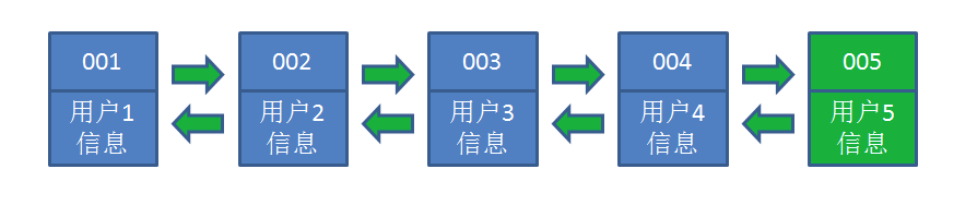

# Redis 缓存过期和淘汰策略

Redis性能高:

官方数据

读: 110_000 次/s
写: 81_000 次/s

长期使用，key会不断增加，Redis 作为缓存使用，物理内存也会满

内存与硬盘交换(swap) 虚拟内存 ，频繁 IO 性能急剧下降

## 1. maxmemory

### 1.1 不设置的场景

Redis 的 key 是固定的，不会增加

Redis 作为 DB 使用，保证数据的完整性，不能淘汰，可以做集群，横向扩展

缓存淘汰策略: 禁止驱逐(默认)

### 1.2 设置的场景

Redis 是作为缓存使用，不断增加 Key

`maxmemory`: 默认为0, 不限制

问题: 达到物理内存后性能急剧下架，甚至崩溃

内存与硬盘交换(swap) 虚拟内存，频繁IO，性能急剧下降

设置多少? 与业务有关

1 个 Redis 实例，保证系统运行 1G ，剩下的就都可以设置 Redis

> 物理内存的 3/4

slaver : 留出一定的内存

在 `redis.conf` 中

```shell
maxmemory   1024mb
```

命令: 获得 `maxmemory` 数

```shell
CONFIG GET maxmemory
```

设置 `maxmemory` 后，当趋近 `maxmemory` 时，通过缓存淘汰策略，从内存中删除对象

不设置 `maxmemory`, 无最大内存限制 `maxmemory-policy noeviction` (禁止驱逐) 不淘汰

设置 `maxmemory maxmemory-policy` 要配置

## 2. expire 数据结构

在 Redis 中可以使用 `expire` 命令设置一个键的存活时间(ttl: time to live)，过了这段时间，该键就会自动被删除。

### 2.1 expire 的使用

`expire` 命令的使用方法如下: `expire key ttl`(单位秒)

```shell
127.0.0.1:6379> expire name 2 #2秒失效 (integer) 1
127.0.0.1:6379> get name
(nil)
127.0.0.1:6379> set name zhangfei
OK
127.0.0.1:6379> ttl name #永久有效 (integer) -1
127.0.0.1:6379> expire name 30 #30秒失效 (integer) 1
127.0.0.1:6379> ttl name #还有24秒失效 (integer) 24
127.0.0.1:6379> ttl name #失效
(integer) -2
```

### 2.2 expire 原理

```c
typedef struct redisDb {
    dict *dict;  -- key Value
    dict *expires; -- key ttl
    dict *blocking_keys;
    dict *ready_keys;
    dict *watched_keys;
    int id;
} redisDb;
```

上面的代码是 Redis 中关于数据库的结构体定义，这个结构体定义中除了 `id` 以外都是指向字典的指针，其中我们只看 `dict` 和 `expires`。

`dict` 用来维护一个 Redis 数据库中包含的所有 Key-Value 键值对，`expires` 则用于维护一个 Redis 数据库中设置了失效时间的键(即key与失效时间的映射)。

当我们使用 `expire` 命令设置一个 key 的失效时间时，Redis 首先到 `dict` 这个字典表中查找要设置的 key 是否存在，如果存在就将这个 key 和失效时间添加到 `expires` 这个字典表。

当我们使用 `setex` 命令向系统插入数据时，Redis 首先将 Key 和 Value 添加到 `dict` 这个字典表中，然后将 Key 和失效时间添加到 `expires` 这个字典表中。
简单地总结来说就是，*设置了失效时间的 key 和具体的失效时间全部都维护在 `expires` 这个字典表中*。

## 3. 删除策略

Redis 的数据删除有定时删除、惰性删除和主动删除三种方式。

Redis目前采用惰性删除+主动删除的方式。

### 3.1 定时删除

在设置键的过期时间的同时，创建一个定时器，让定时器在键的过期时间来临时，立即执行对键的删除操作。

需要创建定时器，而且消耗 CPU，一般不推荐使用。

### 3.2 惰性删除

在 key 被访问时如果发现它已经失效，那么就删除它。

调用 `expireIfNeeded` 函数，该函数的意义是: 读取数据之前先检查一下它有没有失效，如果失效了就删除它。

```c
int expireIfNeeded(redisDb *db, robj *key) {
      //获取主键的失效时间 get 当前时间 - 创建时间 > ttl
      long long when = getExpire(db,key); 
      // 假如失效时间为负数，说明该主键未设置失效时间(失效时间默认为-1)，直接返回0 
      if (when < 0) return 0; 
      // 假如 Redis 服务器正在从 RDB 文件中加载数据，暂时不进行失效主键的删除，直接返回0
      if (server.loading) return 0;
      ...
      // 如果以上条件都不满足，就将主键的失效时间与当前时间进行对比，如果发现指定的主键还未失效就直接返回0
      if (mstime() <= when) return 0; 
      //如果发现主键确实已经失效了，那么首先更新关于失效主键的统计个数，然后将该主键失效的信息进行广播，最后将该主键从数据库中删除
      server.stat_expiredkeys++;
      propagateExpire(db,key);
      return dbDelete(db,key);
}
```

### 3.3 主动删除

在 `redis.conf` 文件中可以配置主动删除策略,默认是 `no-enviction`(不删除)

```shell
maxmemory-policy allkeys-lru
```

#### LRU

LRU (Least recently used) 最近最少使用，算法根据数据的历史访问记录来进行淘汰数据，其核心思想是 "如果数据最近被访问过，那么将来被访问的几率也更高"。

最常见的实现是使用一个链表保存缓存数据，详细算法实现如下:

1. 新数据插入到链表头部;
2. 每当缓存命中(即缓存数据被访问)，则将数据移到链表头部;
3. 当链表满的时候，将链表尾部的数据丢弃。
4. 在 Java 中可以使用 LinkHashMap (哈希链表)去实现 LRU

让我们以用户信息的需求为例，来演示一下 LRU 算法的基本思路:

1. 假设我们使用哈希链表来缓存用户信息，目前缓存了 4 个用户，这 4 个用户是按照时间顺序依次从链表右端插入的。


2. 此时，业务方访问用户 5，由于哈希链表中没有用户 5 的数据，我们从数据库中读取出来，插入到缓存当中。这时候，链表中最右端是最新访问到的用户 5，最左端是最近最少访问的用户 1。



3. 接下来，业务方访问用户 2，哈希链表中存在用户 2 的数据，我们怎么做呢?

我们把用户 2 从它的前驱节点和后继节点之间移除，重新插入到链表最右端。这时候，链表中最右端变成了最新访问到的用户 2，最左端仍然是最近最少访问的用户 1。


4. 接下来，业务方请求修改用户 4 的信息。同样道理，我们把用户 4 从原来的位置移动到链表最右侧，并把用户信息的值更新。

这时候，链表中最右端是最新访问到的用户 4，最左端仍然是最近最少访问的用户 1。


5. 业务访问用户 6，用户 6 在缓存里没有，需要插入到哈希链表。

假设这时候缓存容量已经达到上限，必须先删除最近最少访问的数据，那么位于哈希链表最左端的用户 1 就会被删除掉，然后再把用户 6 插入到最右端。


#### Redis 的 LRU 数据淘汰机制

在服务器配置中保存了 LRU 计数器 `server.lrulock`，会定时(Redis 定时程序 `serverCorn()`)更新，
`server.lrulock` 的值是根据 `server.unixtime` 计算出来的。

另外，从 struct `redisObject` 中可以发现，每一个 Redis 对象都会设置相应的 LRU。可以想象的是，每一次访问数据的时候，会更新 `redisObject.lru`。

LRU 数据淘汰机制是这样的: 在数据集中随机挑选几个键值对，取出其中 LRU 最大的键值对淘汰。

不可能遍历key 用当前时间-最近访问 越大 说明 访问间隔时间越长

`volatile-lru`

从已设置过期时间的数据集(`server.db[i].expires`)中挑选最近最少使用的数据淘汰

`allkeys-lru`

从数据集(`server.db[i].dict`)中挑选最近最少使用的数据淘汰

#### LFU

LFU (Least frequently used) 最不经常使用，如果一个数据在最近一段时间内使用次数很少，那么在将来一段时间内被使用的可能性也很小。

- `volatile-lfu`
- `allkeys-lfu`

#### random

随机

`volatile-random` 从已设置过期时间的数据集(`server.db[i].expires`)中任意选择数据淘汰

`allkeys-random` 从数据集(`server.db[i].dict`)中任意选择数据淘汰

#### ttl

`volatile-ttl`

从已设置过期时间的数据集(`server.db[i].expires`)中挑选将要过期的数据淘汰

Redis 数据集数据结构中保存了键值对过期时间的表，即 `redisDb.expires`。

TTL 数据淘汰机制: 从过期时间的表中随机挑选几个键值对，取出其中 `ttl` 最小的键值对淘汰。

#### noenviction

禁止驱逐数据，不删除。(默认)

#### 缓存淘汰策略的选择

- allkeys-lru : 在不确定时一般采用策略。 冷热数据交换
- volatile-lru : 比allkeys-lru性能差 存:过期时间
- allkeys-random : 希望请求符合平均分布(每个元素以相同的概率被访问) 自己控制: volatile-ttl 缓存穿透

## 4. 案例分享 —— 字典库失效

key-Value 业务表存 `code` 显示文字

早期将字典库，设置了 `maxmemory`，并设置缓存淘汰策略为 `allkeys-lru` 结果造成字典库某些字段失效，缓存击穿，DB压力剧增，差点宕机。

分析:

字典库 : Redis 做 DB 使用，要保证数据的完整性

`maxmemory` 设置较小，采用 `allkeys-lru`，会对没有经常访问的字典库随机淘汰

当再次访问时会缓存击穿，请求会打到 DB 上。

解决方案:

1. 不设置 `maxmemory`
2. 使用 `noenviction` 策略

- Redis 是作为 DB 使用的，要保证数据的完整性，所以不能删除数据。
- 可以将原始数据源(XML)在系统启动时一次性加载到 Redis 中。
- Redis 做主从+哨兵，保证高可用。
