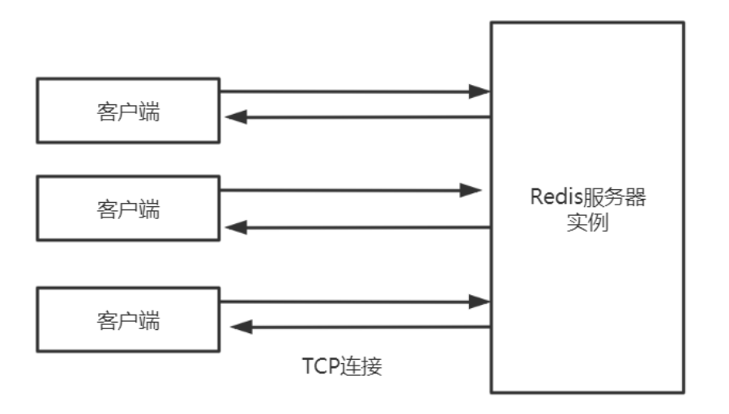
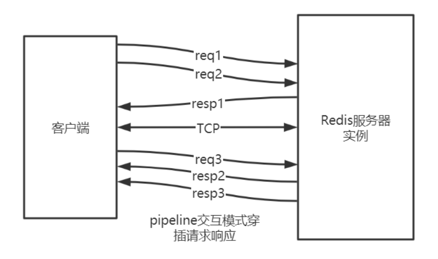
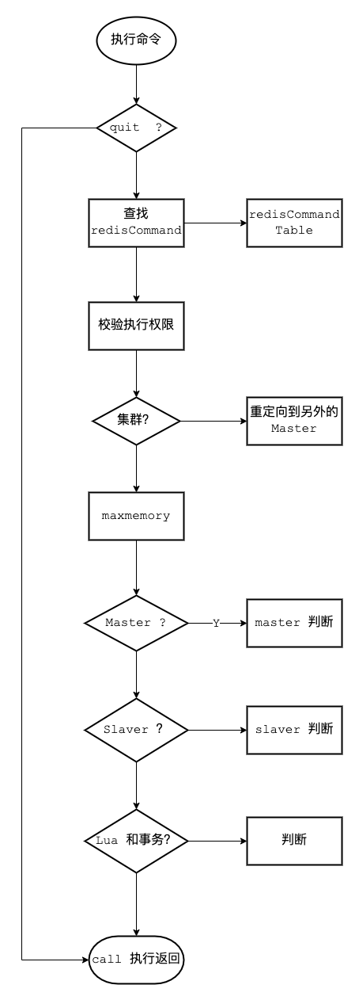
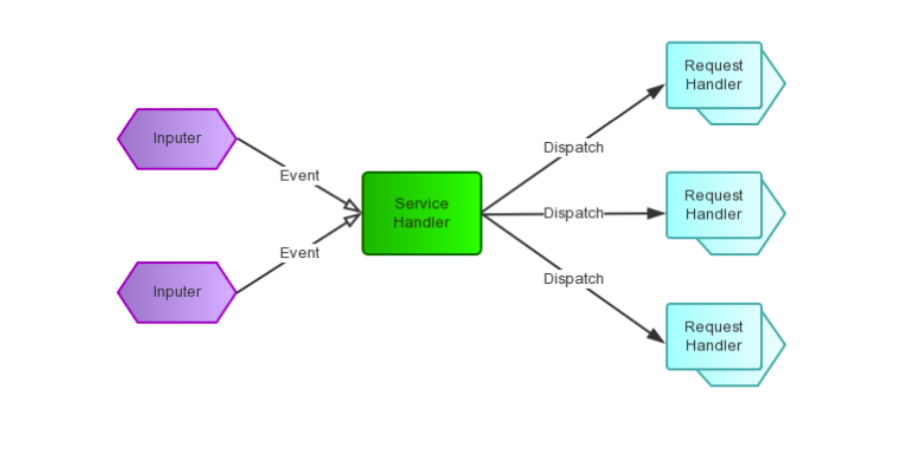
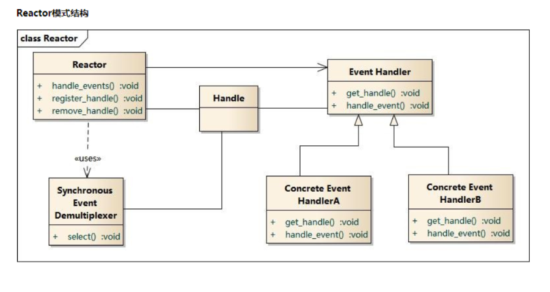
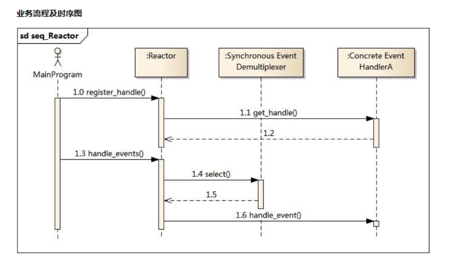
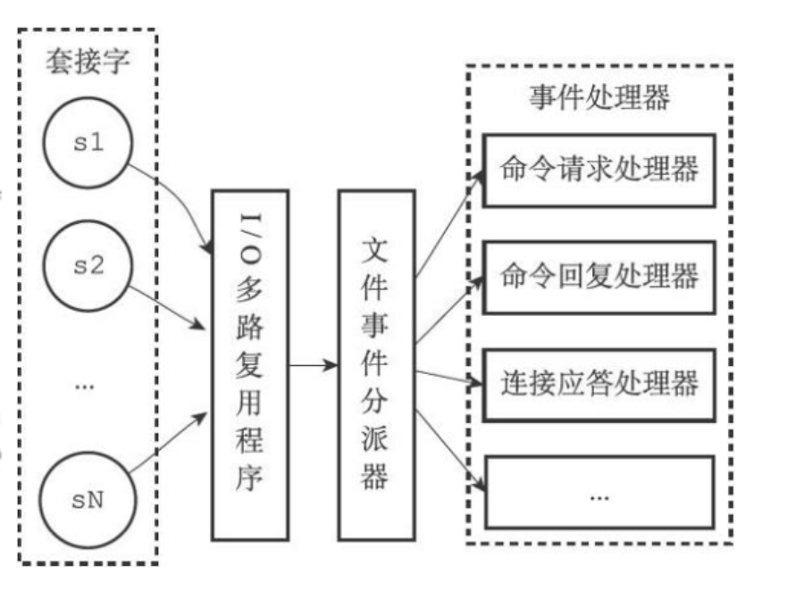
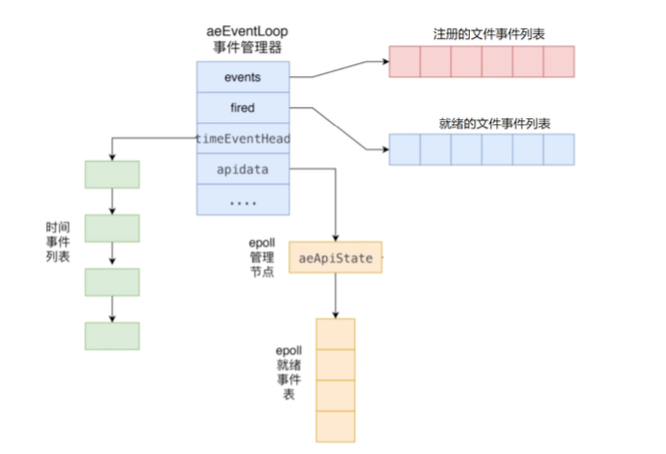

# Redis 通讯协议及事件处理机制

## 1. 通信协议

Redis 是单进程单线程的。应用系统和 Redis 通过 Redis 协议(RESP)进行交互。

### 1.1 请求响应模式

Redis 协议位于 TCP 层之上，即客户端和 Redis 实例保持双工的连接。



#### 串行的请求响应模式(ping-pong)

串行化是最简单模式，客户端与服务器端建立长连接。

连接通过心跳机制检测(ping-pong) ACK 应答

客户端发送请求，服务端响应，客户端收到响应后，再发起第二个请求，服务器端再响应。


> `telnet` 和 `redis-cli` 发出的命令都属于该种模式

特点:

- 有问有答
- 耗时在网络传输命令
- 性能较低

#### 双工的请求响应模式(pipeline)

批量请求，批量响应

请求响应交叉进行，不会混淆(TCP双工)



pipeline 的作用是将一批命令进行打包，然后发送给服务器，服务器执行完按顺序打包返回。

通过 pipeline，一次 pipeline(n条命令) = 一次网络时间 + n 次命令时间

通过 Jedis 可以很方便的使用 pipeline

```java
class JedisDemo {
   public static void main(String[] args) {
      Jedis redis = new Jedis("192.168.1.111", 6379);
      redis.auth("12345678"); //授权密码 对应 redis.conf 的 requirepass 密码 
      Pipeline pipe = jedis.pipelined();
      for (int i = 0; i < 50000; i++) {
         pipe.set("key_" + String.valueOf(i), String.valueOf(i));
      }
      // 将封装后的 PIPE 一次性发给 Redis 
      pipe.sync();
   }
}
```

#### 原子化的批量请求响应模式(事务)

Redis可以利用事务机制批量执行命令。后面会详细讲解。

#### 发布订阅模式(pub/sub)

发布订阅模式是: 一个客户端触发，多个客户端被动接收，通过服务器中转。后面会详细讲解。

#### 脚本化的批量执行(lua)

客户端向服务器端提交一个 Lua 脚本，服务器端执行该脚本。后面会详细讲解。

### 1.2 请求数据格式

Redis 客户端与服务器交互采用序列化协议(RESP)。

请求以字符串数组的形式来表示要执行命令的参数。

Redis 使用命令特有(command-specific)数据类型作为回复。

Redis通信协议的主要特点有:

- 客户端和服务器通过 TCP 连接来进行数据交互，服务器默认的端口号为 6379 。
- 客户端和服务器发送的命令或数据一律以` \r\n`(CRLF)结尾。
- 在这个协议中， 所有发送至 Redis 服务器的参数都是二进制安全(binary safe)的。
- 简单，高效，易读。

#### 内联格式

可以使用 `telnet` 给 Redis 发送命令，首字符为 Redis 命令名的字符，格式为 `str1 str2 str3...`

```shell
[root@localhost bin]# telnet 127.0.0.1 6379
Trying 127.0.0.1...
Connected to 127.0.0.1.
Escape character is '^]'.
ping
+PONG
exists name
:1
```

#### 规范格式(redis-cli) RESP

1. 间隔符号; 在 Linux 下是 `\r\n`，在 Windows 下是 `\n`
2. 简单字符串 Simple Strings, 以 "+" 加号开头
3. 错误 Errors, 以 "-" 减号开头
4. 整数型 Integer， 以 ":" 冒号开头
5. 大字符串类型 Bulk Strings, 以 "$" 美元符号开头，长度限制 512M
6. 数组类型 Arrays，以 "*" 星号开头

用 SET 命令来举例说明 RESP 协议的格式。

```shell
redis> SET mykey Hello
"OK"
```

实际发送的请求数据:

```text
*3\r\n$3\r\nSET\r\n$5\r\nmykey\r\n$5\r\nHello\r\n
*3
$3
SET
$5
mykey
$5
Hello
```

实际收到的响应数据: `+OK\r\n`

### 1.3 命令处理流程

整个流程包括: 服务器启动监听、接收命令请求并解析、执行命令请求、返回命令回复等。


#### Server 启动时监听 Socket

启动调用 initServer 方法:

- 创建 eventLoop(事件机制)
- 注册时间事件处理器
- 注册文件事件(socket)处理器
- 监听 Socket 建立连接

#### 建立Client

- redis-cli 建立socket
- redis-server 为每个连接(socket)创建一个 Client 对象
- 创建文件事件监听 Socket
- 指定事件处理函数

#### 读取socket数据到输入缓冲区

从 client 中读取客户端的查询缓冲区内容。

#### 解析获取命令

将输入缓冲区中的数据解析成对应的命令 判断是单条命令还是多条命令并调用相应的解析器解析

#### 执行命令

解析成功后调用 `processCommand` 方法执行命令，如下图:



大致分三个部分:

- 调用 lookupCommand 方法获得对应的 redisCommand
- 检测当前 Redis 是否可以执行该命令
- 调用 call 方法真正执行命令

### 1.4 协议响应格式

#### 状态回复

对于状态，回复的第一个字节是 “+”

```text
"+OK"
```

#### 错误回复

对于错误，回复的第一个字节是 “-”

```text
1. -ERR unknown command 'foobar'
2. -WRONGTYPE Operation against a key holding the wrong kind of value
```

#### 整数回复

对于整数，回复的第一个字节是 “:”

```text
":6"
```

#### 批量回复

对于批量字符串，回复的第一个字节是 “$”

```text
"$6 foobar"
```

#### 多条批量回复

对于多条批量回复(数组)，回复的第一个字节是 “*”

```text
"*3"
```

### 1.5 协议解析及处理

包括协议解析、调用命令、返回结果。

#### 协议解析

用户在 Redis 客户端键入命令后，Redis-cli 会把命令转化为 RESP 协议格式，然后发送给服务器。服务器再对协议进行解析，分为三个步骤:

1. 解析命令请求参数数量

命令请求参数数量的协议格式为 `*N\r\n` ,其中 N 就是数量，比如:

```shell
set name:1 john
```

我们打开 AOF 文件可以看到协议内容

```text
*3(/r/n)
$3(/r/n)
set(/r/n)
$7(/r/n)
name:10(/r/n)
$7(/r/n)
john(/r/n)
```

首字符必须是 `*`，使用 `\r` 定位到行尾，之间的数就是参数数量了。

2. 循环解析请求参数

首字符必须是 `$`，使用 `/r` 定位到行尾，之间的数是参数的长度，从 `/n` 后到下一个 `$` 之间就是参数的值了。

循环解析直到没有"$"。

> 第 3 点呢？？？

#### 协议执行

协议的执行包括命令的调用和返回结果。

判断参数个数和取出的参数是否一致。

RedisServer 解析完命令后,会调用函数 processCommand 处理该命令请求

- quit校验，如果是 `quit` 命令，直接返回并关闭客户端
- 命令语法校验，执行 `lookupCommand`，查找命令(set)，如果不存在则返回: “unknown command” 错误。
- 参数数目校验，参数数目和解析出来的参数个数要匹配，如果不匹配则返回: “wrong number of arguments” 错误。
- 此外还有权限校验，最大内存校验，集群校验，持久化校验等等。

校验成功后，会调用 `call` 函数执行命令，并记录命令执行时间和调用次数。如果执行命令时间过长，还要记录慢查询日志。

执行命令后返回结果的类型不同则协议格式也不同，分为5类: 状态回复、错误回复、整数回复、批量回复、多条批量回复。

## 2. 事件处理机制

Redis 服务器是典型的事件驱动系统。

> MVC : java 上层调下层
>
> 事件驱动: js

Redis 将事件分为两大类: 文件事件和时间事件。

### 2.1 文件事件

文件事件即 Socket 的读写事件，也就是 IO 事件。 file descriptor (文件描述符)

客户端的连接、命令请求、数据回复、连接断开

#### socket

套接字(socket)是一个抽象层，应用程序可以通过它发送或接收数据。

#### Reactor

Redis 事件处理机制采用单线程的 Reactor 模式，属于 I/O 多路复用的一种常见模式。

IO 多路复用(I/O multiplexing)指的通过单个线程管理多个 Socket。

Reactor pattern(反应器设计模式)是一种为处理并发服务请求，并将请求提交到一个或者多个服务处理程序的事件设计模式。

Reactor 模式是事件驱动的

有一个或多个并发输入源(文件事件)

有一个 Service Handler

有多个 Request Handlers

这个 Service Handler 会同步的将输入的请求(Event)多路复用的分发给相应的 Request Handler





- Handle: I/O 操作的基本文件句柄，在 Linux 下就是fd(文件描述符)
- Synchronous Event Demultiplexer: 同步事件分离器，阻塞等待 Handles 中的事件发生。(系统)
- Reactor: 事件分派器，负责事件的注册，删除以及对所有注册到事件分派器的事件进行监控， 当事件发生时会调用 Event Handler 接口来处理事件。
- Event Handler: 事件处理器接口，这里需要 Concrete Event Handler 来实现该接口
- Concrete Event Handler: 真实的事件处理器，通常都是绑定了一个handle，实现对可读事件进行读取或对可写事件进行写入的操作。



- 主程序向事件分派器(Reactor)注册要监听的事件
- Reactor 调用 OS 提供的事件处理分离器，监听事件(wait)
- 当有事件产生时，Reactor 将事件派给相应的处理器来处理 `handle_event()`

#### 4种IO多路复用模型与选择

select，poll，epoll、kqueue 都是IO多路复用的机制。

I/O 多路复用就是通过一种机制，一个进程可以监视多个描述符(socket)，一旦某个描述符就绪(一般是读就绪或者写就绪)，能够通知程序进行相应的读写操作。

##### select

```c
int select (int n, fd_set *readfds, fd_set *writefds, fd_set *exceptfds, struct timeval *timeout);
```

select 函数监视的文件描述符分3类，分别是:

- `writefds`
- `readfds`
- `exceptfds`

调用后 `select` 函数会阻塞，直到有描述符就绪(有数据可读、可写、或者有except)，或者超时(timeout指定等待时间，如果立即返回设为null即可)，函数返回。
当 `select` 函数返回后，可以通过遍历 `fd` 列表，来找到就绪的描述符。

**优点**

`select` 目前几乎在所有的平台上支持，其良好跨平台支持也是它的一个优点。

windows linux ...

**缺点**

单个进程打开的文件描述是有一定限制的，它由 `FD_SETSIZE` 设置，默认值是 1024，采用数组存储另外在检查数组中是否有文件描述需要读写时，采用的是线性扫描的方法，
即不管这些 socket 是不是活跃的，都轮询一遍，所以效率比较低。

##### poll

```c
int poll (struct pollfd *fds, unsigned int nfds, int timeout);

struct pollfd {
   int fd; // 文件描述符
   short events; // 要监视的事件 
   short revents; // 实际发生的事件
};
```

`poll` 使用一个 `pollfd` 的指针实现，`pollfd` 结构包含了要监视的 event 和发生的 event，不再使用 `select"参数-值"` 传递的方式。

- 优点: 采样链表的形式存储，它监听的描述符数量没有限制，可以超过 select 默认限制的 1024 大小
- 缺点: 另外在检查链表中是否有文件描述需要读写时，采用的是线性扫描的方法，即不管这些 socket 是不是活跃的，都轮询一遍，所以效率比较低。

##### epoll

epoll 是在 Linux2.6 内核中提出的，是之前的 select 和 poll 的增强版本。

相对于 select 和 poll 来说，epoll 更加灵活，没有描述符限制。

epoll 使用一个文件描述符管理多个描述符，将用户关系的文件描述符的事件存放到内核的一个事件表中，这样在用户空间和内核空间的 copy 只需一次。

```c
int epoll_create(int size)
```

创建一个 epoll 的句柄。自从 Linux 2.6.8 之后，`size` 参数是被忽略的。需要注意的是，当创建好 epoll 句柄后，它就是会占用一个 fd 值，在 Linux 下如果查看 `/proc/进程id/fd/`，是能够看到这个 fd 的，
所以在使用完 epoll 后，必须调用 `close()` 关闭，否则可能导致 fd 被耗尽。

```c
int epoll_ctl(int epfd, int op, int fd, struct epoll_event *event)
```

`poll` 的事件注册函数，它不同于 `select()` 是在监听事件时告诉内核要监听什么类型的事件，而是在这里先注册要监听的事件类型。

- 第一个参数是 `epoll_create()` 的返回值。
- 第二个参数表示动作，用三个宏来表示: `EPOLL_CTL_ADD`: 注册新的 fd 到 epfd 中; `EPOLL_CTL_MOD`: 修改已经注册的fd的监听事件; `EPOLL_CTL_DEL`: 从 epfd 中删除一个 fd;
- 第三个参数是需要监听的 fd。
- 第四个参数是告诉内核需要监听什么事

```c
int epoll_wait(int epfd, struct epoll_event * events, int maxevents, int timeout);
```

等待内核返回的可读写事件，最多返回 `maxevents` 个事件。

优点: `epoll` 没有最大并发连接的限制，上限是最大可以打开文件的数目。举个例子,在 1GB 内存的机器上大约是 10 万左右。

效率提升， epoll 最大的优点就在于它只管你「活跃」的连接 ，而跟连接总数无关，因此在实际的网络环境 中， epoll 的效率就会远远高于 select 和 poll。

epoll 使用了共享内存，不用做内存拷贝。

##### kqueue

kqueue 是 unix 下的一个 IO 多路复用库。最初是 2000 年 Jonathan Lemon 在 FreeBSD 系统上开发的一个高性能的事件通知接口。
注册一批 socket 描述符到 kqueue 以后，当其中的描述符状态发生变化时，kqueue 将一次性通知应用程序哪些描述符可读、可写或出错了。

```c
struct kevent {
   uintptr_t   ident;   // 是事件唯一的 key，在 socket() 使用中，它是 socket 的 fd 句柄
   int16_t     filter;  // 是事件的类型(EVFILT_READ socket 可读事件, EVFILT_WRITE  socket 可写事件)
   uint16_t    flags;   // 操作方式
   uint32_t    fflags;  //
   intptr_t    data;    // 数据长度
   void        *udata;  // 数据
};
```

优点: 能处理大量数据，性能较高

#### 文件事件分派器

在 Redis 中，对文件事件的处理采用了 Reactor 模型。采用的是 epoll 的实现方式。



Redis 在主循环中统一处理文件事件和时间事件，信号事件则由专门的 Handler 来处理。

主循环:

```c
void aeMain(aeEventLoop *eventLoop) {
   eventLoop->stop = 0;
   while (!eventLoop->stop) { //循环监听事件
      // 阻塞之前的处理
      if (eventLoop->beforesleep != NULL)
         eventLoop->beforesleep(eventLoop);
      // 事件处理，第二个参数决定处理哪类事件
      aeProcessEvents(eventLoop, AE_ALL_EVENTS|AE_CALL_AFTER_SLEEP);
   } 
}
```

#### 事件处理器

##### 连接处理函数 acceptTCPHandler

当客户端向 Redis 建立 socket 时，aeEventLoop 会调用 acceptTcpHandler 处理函数，服务器会为每个链接创建一个 Client 对象，
并创建相应文件事件来监听 socket 的可读事件，并指定事件处理函数。

```c
// 当客户端建立链接时进行的eventloop处理函数 networking.c
void acceptTcpHandler(aeEventLoop *el, int fd, void *privdata, int mask) {
   ....
   // 层层调用，最后在 anet.c 中 anetGenericAccept 方法中调用 socket 的 accept 方法 
   cfd = anetTcpAccept(server.neterr, fd, cip, sizeof(cip), &cport);
   if (cfd == ANET_ERR) {
        if (errno != EWOULDBLOCK)
            serverLog(LL_WARNING,
                "Accepting client connection: %s", server.neterr);
        return;
   }
   
   serverLog(LL_VERBOSE,"Accepted %s:%d", cip, cport);
   
   /**
    * 进行socket 建立连接后的处理
    */
    acceptCommonHandler(cfd,0,cip);
}
```

##### 请求处理函数 readQueryFromClient

当客户端通过 socket 发送来数据后，Redis 会调用 `readQueryFromClient` 方法, `readQueryFromClient` 方法会调用 `read` 方法从 socket 中读取数据到输入缓冲区中，
然后判断其大小是否大于系统设置的 `client_max_querybuf_len`，如果大于，则向 Redis 返回错误信息，并关闭 client。

```c
// 处理从client中读取客户端的输入缓冲区内容。
void readQueryFromClient(aeEventLoop *el, int fd, void *privdata, int mask) {
   client *c = (client*) privdata;
   ....
   if (c->querybuf_peak < qblen) c->querybuf_peak = qblen;
   c->querybuf = sdsMakeRoomFor(c->querybuf, readlen);
   // 从 fd 对应的socket中读取到 client 中的 querybuf 输入缓冲区
   nread = read(fd, c->querybuf+qblen, readlen);
   ....
   // 如果大于系统配置的最大客户端缓存区大小，也就是配置文件中的client-query-buffer-limit
   if (sdslen(c->querybuf) > server.client_max_querybuf_len) {
      sds ci = catClientInfoString(sdsempty(),c), bytes = sdsempty();
      // 返回错误信息，并且关闭client
      bytes = sdscatrepr(bytes,c->querybuf,64); serverLog(LL_WARNING,"Closing client that reached max query buffer length: %s (qbuf initial bytes: %s)", ci, bytes);
        sdsfree(ci);
        sdsfree(bytes);
        freeClient(c);
        return;
   }
   if (!(c->flags & CLIENT_MASTER)) {
      // processInputBuffer 处理输入缓冲区
      processInputBuffer(c);
   } else {
      // 如果client是master的连接
      size_t prev_offset = c->reploff; processInputBuffer(c);
      // 判断是否同步偏移量发生变化，则通知到后续的slave size_t applied = c->reploff - prev_offset;
      if (applied) {
         replicationFeedSlavesFromMasterStream(server.slaves, c->pending_querybuf, applied);
         sdsrange(c->pending_querybuf,applied,-1); 
      } 
   }
}
```

##### 命令回复处理器 sendReplyToClient

`sendReplyToClient` 函数是 Redis 的命令回复处理器，这个处理器负责将服务器执行命令后得到的命令回复通过套接字返回给客户端。

1. 将 `outbuf` 内容写入到套接字描述符并传输到客户端
2. `aeDeleteFileEvent` 用于删除文件写事件

### 2.2 时间事件

时间事件分为定时事件与周期事件。

一个时间事件主要由以下三个属性组成:

- id (全局唯一id)
- when (毫秒时间戳，记录了时间事件的到达时间)
- timeProc (时间事件处理器，当时间到达时，Redis就会调用相应的处理器来处理事件)

```c
/* Time event structure
 *
* 时间事件结构
*/
typedef struct aeTimeEvent {
   // 时间事件的唯一标识符
   long id; /* time event identifier. */
   // 事件的到达时间，存贮的是UNIX的时间戳
   long when_sec; /* seconds */
   long when_ms; /* milliseconds */
   // 事件处理函数，当到达指定时间后调用该函数处理对应的问题
   aeTimeProc *timeProc;
   // 事件释放函数
   aeEventFinalizerProc *finalizerProc;
   // 多路复用库的私有数据
   void *clientData;
   // 指向下个时间事件结构，形成链表
   struct aeTimeEvent *next;
} aeTimeEvent;
```

#### serverCron

时间事件的最主要的应用是在 Redis 服务器需要对自身的资源与配置进行定期的调整，从而确保服务器的长久运行，这些操作由 `redis.c` 中的 `serverCron` 函数实现。
该时间事件主要进行以下操作:

1. 更新 Redis服务器各类统计信息，包括时间、内存占用、数据库占用等情况。
2. 清理数据库中的过期键值对。
3. 关闭和清理连接失败的客户端。
4. 尝试进行aof和rdb持久化操作。
5. 如果服务器是主服务器，会定期将数据向从服务器做同步操作。
6. 如果处于集群模式，对集群定期进行同步与连接测试操作。

Redis 服务器开启后，就会周期性执行此函数，直到 Redis 服务器关闭为止。默认每秒执行 10 次，平均 100 毫秒执行一次，
可以在 Redis 配置文件的 hz 选项，调整该函数每秒执行的次数。

**server.hz**

serverCron 在一秒内执行的次数， 在 `redis/conf` 中可以配置

```shell
hz 10 #100毫秒一次
```

比如: `server.hz` 是100，也就是 serverCron 的执行间隔是10ms

**run_with_period**

```shell
#define run_with_period(_ms_) \
if ((_ms_ <= 1000/server.hz) || !(server.cronloops%((_ms_)/(1000/server.hz))))
```

定时任务执行都是在 10 毫秒的基础上定时处理自己的任务(`run_with_period(ms)`)，即调用 `run_with_period(ms)` 来确定自己是否需要执行。返回1表示执行。

> "ms" 是指多长时间执行一次，单位是毫秒。

假如有一些任务需要每 500ms 执行一次，就可以在 serverCron 中用 `run_with_period(500)` 把每 500ms 需要执行一次的工作控制起来。

#### 定时事件

定时事件: 让一段程序在指定的时间之后执行一次。

`aeTimeProc`(时间处理器)的返回值是 `AE_NOMORE`

该事件在达到后删除，之后不会再重复。

#### 周期性事件

周期性事件: 让一段程序每隔指定时间就执行一次。

`aeTimeProc` (时间处理器)的返回值不是 `AE_NOMORE`

当一个时间事件到达后，服务器会根据时间处理器的返回值，对时间事件的 `when` 属性进行更新，让这个事件在一段时间后再次达到。

*serverCron 就是一个典型的周期性事件。*

### 2.3 aeEventLoop

aeEventLoop 是整个事件驱动的核心，Redis 自己的事件处理机制。

它管理着文件事件表和时间事件列表，不断地循环处理着就绪的文件事件和到期的时间事件。



```c
typedef struct aeEventLoop {
   // 最大文件描述符的值
   int maxfd; /* highest file descriptor currently registered */ 
   // 文件描述符的最大监听数
   int setsize; /* max number of file descriptors tracked */ 
   // 用于生成时间事件的唯一标识id
   long long timeEventNextId;
   // 用于检测系统时间是否变更(判断标准 now<lastTime)
   time_t lastTime; /* Used to detect system clock skew */ 
   // 注册的文件事件
   aeFileEvent *events; /* Registered events */
   // 已就绪的事件
   aeFiredEvent *fired; /* Fired events */
   // 注册要使用的时间事件
   aeTimeEvent *timeEventHead;
   // 停止标志，1表示停止
   int stop;
   // 这个是处理底层特定API的数据，对于epoll来说，该结构体包含了epoll fd和epoll_event void *apidata; /* This is used for polling API specific data */ 
   // 在调用processEvent前(即如果没有事件则睡眠)，调用该处理函数
   aeBeforeSleepProc *beforesleep;
   // 在调用aeApiPoll后，调用该函数
   aeBeforeSleepProc *aftersleep;
} aeEventLoop;
```

#### 初始化

Redis 服务端在其初始化函数 `initServer` 中，会创建事件管理器 `aeEventLoop` 对象。

函数 `aeCreateEventLoop` 将创建一个事件管理器，主要是初始化 `aeEventLoop` 的各个属性值，
比如 `events`、 `fired`、 `timeEventHead` 和 `apidata`

- 首先创建 aeEventLoop 对象。
- 初始化注册的文件事件表、就绪文件事件表。`events` 指针指向注册的文件事件表、`fired` 指针指向就绪文件事件表。表的内容在后面添加具体事件时进行初变更。
- 初始化时间事件列表，设置 `timeEventHead` 和 `timeEventNextId` 属性。
- 调用 `aeApiCreate` 函数创建 `epoll` 实例，并初始化 `apidata` 。

#### stop

停止标志，1 表示停止，初始化为 0。

#### 文件事件

`events`, `fired`, `apidata`

`aeFileEvent` 结构体为已经注册并需要监听的事件的结构体。

```c
typedef struct aeFileEvent {
   // 监听事件类型掩码，
   // 值可以是 AE_READABLE 或 AE_WRITABLE ，
   // 或者 AE_READABLE | AE_WRITABLE
   int mask; /* one of AE_(READABLE|WRITABLE) */
   
   // 读事件处理器 
   aeFileProc *rfileProc;
   
   // 写事件处理器 
   aeFileProc *wfileProc;
   
   // 多路复用库的私有数据 
   void *clientData;
   
} aeFileEvent;
```

`aeFiredEvent`: 已就绪的文件事件

```c
typedef struct aeFiredEvent {
   // 已就绪文件描述符
   int fd;
   
   // 事件类型掩码，
   // 值可以是 AE_READABLE 或 AE_WRITABLE 
   // 或者是两者的或
   int mask;
} aeFiredEvent;
```

`void *apidata`: 在 ae 创建的时候，会被赋值为 `aeApiState` 结构体，结构体的定义如下:

```c
typedef struct aeApiState { 
   // epoll_event 实例描述符
   int epfd;
   
   // 事件槽
   struct epoll_event *events;
   
} aeApiState;
```

这个结构体是为了 epoll 所准备的数据结构。Redis 可以选择不同的 I/O 多路复用方法。因此 `apidata` 是个 `void` 类型，根据不同的 io 多路复用库来选择不同的实现。

`ae.c` 里面使用如下的方式来决定系统使用的机制:

```shell
#ifdef HAVE_EVPORT
#include "ae_evport.c"
#else
    #ifdef HAVE_EPOLL
    #include "ae_epoll.c"
    #else
        #ifdef HAVE_KQUEUE
        #include "ae_kqueue.c"
        #else
        #include "ae_select.c"
        #endif
    #endif
#endif
```

#### 时间事件

`timeEventHead`, `beforesleep`, `aftersleep`

`aeTimeEvent` 结构体为时间事件，Redis 将所有时间事件都放在一个无序链表中，每次 Redis 会遍历整个链表，
查找所有已经到达的时间事件，并且调用相应的事件处理器。

```c
typedef struct aeTimeEvent { 
   /* 全局唯一ID */
   long long id; /* time event identifier. */ 
   /* 秒精确的UNIX时间戳，记录时间事件到达的时间*/ 
   long when_sec; /* seconds */
   /* 毫秒精确的UNIX时间戳，记录时间事件到达的时间*/ 
   long when_ms; /* milliseconds */
   /* 时间处理器 */
   aeTimeProc *timeProc;
   /* 事件结束回调函数，析构一些资源*/ 
   aeEventFinalizerProc *finalizerProc; 
   /* 私有数据 */
   void *clientData;
   /* 前驱节点 */
   struct aeTimeEvent *prev;
   /* 后继节点 */
   struct aeTimeEvent *next;
} aeTimeEvent;
```

`beforesleep` 对象是一个回调函数，在 redis-server 初始化时已经设置好了。

功能:

- 检测集群状态
- 随机释放已过期的键
- 在数据同步复制阶段取消客户端的阻塞
- 处理输入数据，并且同步副本信息
- 处理非阻塞的客户端请求
- AOF 持久化存储策略，类似于 mysql 的 bin log
- 使用挂起的输出缓冲区处理写入

`aftersleep` 对象是一个回调函数，在 IO 多路复用与 IO 事件处理之间被调用。

### 2.4 aeMain

aeMain 函数其实就是一个封装的 `while` 循环，循环中的代码会一直运行直到 `eventLoop` 的 `stop` 被设置为 1(true)。
它会不停尝试调用 `aeProcessEvents` 对可能存在的多种事件进行处理，而 `aeProcessEvents` 就是实际用于处理事件的函数。

```c
void aeMain(aeEventLoop *eventLoop) {
    eventLoop->stop = 0;
    while (!eventLoop->stop) {
        if (eventLoop->beforesleep != NULL)
            eventLoop->beforesleep(eventLoop);
        aeProcessEvents(eventLoop, AE_ALL_EVENTS);
    }
}
```

`aemain` 函数中，首先调用 `Beforesleep`。这个方法在 Redis 每次进入 `sleep/wait` 去等待监听的端口发生 I/O 事件之前被调用。
当有事件发生时，调用 `aeProcessEvent`进行处理。

### 2.5 aeProcessEvent

首先计算距离当前时间最近的时间事件，以此计算一个超时时间;

然后调用 `aeApiPoll` 函数去等待底层的 I/O 多路复用事件就绪;

`aeApiPoll` 函数返回之后，会处理所有已经产生文件事件和已经达到的时间事件。

```c

```

*计算最早时间事件的执行时间，获取文件时间可执行时间*

aeSearchNearestTimer

aeProcessEvents 都会先计算最近的时间事件发生所需要等待的时间，然后调用 aeApiPoll 方法在这段时间中等待事件的发生，
在这段时间中如果发生了文件事件，就会优先处理文件事件，否则就会一直等待，直到最近的时间事件需要触发。

*堵塞等待文件事件产生*

aeApiPoll 用到了 epoll，select，kqueue 和 evport 四种实现方式。

*处理文件事件*

`rfileProc` 和 `wfileProc` 就是在文件事件被创建时传入的函数指针

- 处理读事件: `rfileProc`
- 处理写事件: `wfileProc`

*处理时间事件*

processTimeEvents 取得当前时间，循环时间事件链表，如果当前时间 >= 预订执行时间，则执行时间处理函数。
