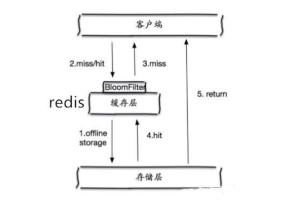

# Redis 缓存问题

## 1. 缓存穿透

一般的缓存系统，都是按照 key 去缓存查询，如果不存在对应的 value，就应该去后端系统查找(比如 DB)。

缓存穿透是指在高并发下查询 key 不存在的数据(不存在的key)，会穿过缓存查询数据库。导致数据库 压力过大而宕机。

解决方案:

对查询结果为空的情况也进行缓存，缓存时间(ttl)设置短一点，或者该 key 对应的数据 insert 了之后清理缓存。

问题:缓存太多空值占用了更多的空间

使用布隆过滤器。在缓存之前在加一层布隆过滤器，在查询的时候先去布隆过滤器查询 key 是否存在，如果不存在就直接返回，存在再查缓存和 DB。



布隆过滤器(Bloom Filter)是 1970 年由布隆提出的。它实际上是一个很长的二进制向量和一系列随机 Hash 映射函数。

布隆过滤器可以用于检索一个元素是否在一个集合中。它的优点是空间效率和查询时间都远远超过一般的算法。


布隆过滤器的原理是，当一个元素被加入集合时，通过 K 个 Hash 函数将这个元素映射成一个数组中的 K 个点，把它们置为 1。
检索时，我们只要看看这些点是不是都是 1 就(大约)知道集合中有没有它了: 如果这些点有任何一个 0，则被检元素一定不在;
如果都是 1，则被检元素很可能在。这就是布隆过滤器的基本思想。

## 2. 缓存雪崩

当缓存服务器重启或者大量缓存集中在某一个时间段失效，这样在失效的时候，也会给后端系统(比如 DB)带来很大压力。

突然间大量的 key 失效了或 Redis 重启，大量访问数据库，数据库崩溃。

解决方案:

1. key 的失效期分散开，不同的 key 设置不同的有效期
2. 设置二级缓存(数据不一定一致)
3. 高可用(脏读)

## 3. 缓存击穿

对于一些设置了过期时间的 key，如果这些 key 可能会在某些时间点被超高并发地访问，是一种非常 "热点" 的数据。
这个时候，需要考虑一个问题: 缓存被 "击穿" 的问题，这个和缓存雪崩的区别在于，这里针对某一 key 缓存，前者则是很多 key。

缓存在某个时间点过期的时候，恰好在这个时间点对这个 Key 有大量的并发请求过来，这些请求发现缓存过期一般都会从后端DB加载数据并回设到缓存，
这个时候大并发的请求可能会瞬间把后端DB压垮。

解决方案:

1. 用分布式锁控制访问的线程

使用 Redis 的 `setnx` 互斥锁先进行判断，这样其他线程就处于等待状态，保证不会有大并发操作去操作数据库。

2. 不设超时时间，`volatile-lru` 但会造成写一致问题

当数据库数据发生更新时，缓存中的数据不会及时更新，这样会造成数据库中的数据与缓存中的数据的不一致，应用会从缓存中读取到脏数据。
可采用延时双删策略处理，这个我们后面会详细讲到。

## 4. 数据不一致

缓存和 DB 的数据不一致的根源: 数据源不一样。

如何解决？强一致性很难，追求最终一致性(时间)

互联网业务数据处理的特点

- 高吞吐量
- 低延迟
- 数据敏感性低于金融业

时序控制是否可行?

先更新数据库再更新缓存或者先更新缓存再更新数据库，本质上不是一个原子操作，所以时序控制不可行。高并发情况下会产生不一致。

**保证数据的最终一致性(延时双删)**

1. 先更新数据库同时删除缓存项(key)，等读的时候再填充缓存
2. 2 秒后再删除一次缓存项(key)
3. 设置缓存过期时间 Expired Time 比如 10 秒或 1 小时
4. 将缓存删除失败记录到日志中，利用脚本提取失败记录再次删除(缓存失效期过长 7*24)

升级方案

通过数据库的 binlog 来异步淘汰 key，利用工具(canal)将 binlog 日志采集发送到 MQ 中，然后通过 ACK 机制确认处理删除缓存。

## 5. 数据并发竞争

这里的并发指的是多个 Redis 的 client 同时 `set` 同一个 key 引起的并发问题。

多客户端(Jedis)同时并发写一个 key，一个 key 的值是 1，本来按顺序修改为2,3,4，最后是 4，但是顺序变成了4,3,2，最后变成了 2。

### 5.1 分布式锁 + 时间戳

1. 整体技术方案

这种情况，主要是准备一个分布式锁，大家去抢锁，抢到锁就做 `set` 操作。

加锁的目的实际上就是把并行读写改成串行读写的方式，从而来避免资源竞争。


- 我们希望的 key 更新顺序是：`v1 -> v2 -> v3 -> v4`
- 由于并发问题，key 更新的顺序变成了： `v1 -> v3 -> v4 -> v2`
- 引入分布式锁 zookeeper，要更新数据必须要获得锁
- `set mykey = v2` 先获得了锁，这个数据会变成 `v2`
- 接下来 `set mykey = v4` 获得了锁，这个数据变成 `v4`
- 然后 `set mykey = v3` 获得了锁，难道数据要被改成 `v3` 吗? 这样的数据不就又错了？

所以数据必须带有时间戳，当 `v3` 想要去更新数据时，就比较自己的时间戳和 `v4` 的时间戳谁更早，如果自己更早则放弃更新，否则覆盖 `v4`。

2. Redis 分布式锁的实现

主要用到的 Redis 函数是 `setnx()`。

用 `SETNX` 实现分布式锁。

时间戳

由于上面举的例子，要求 key 的操作需要顺序执行，所以需要保存一个时间戳判断 `set` 顺序。

```text
系统A key 1 {ValueA 7:00} 
系统B key 1 {ValueB 7:05}
```

假设系统 B 先抢到锁，将 `key1` 设置为 `{ValueB 7:05}`。接下来系统 A 抢到锁，发现自己的 `key1` 的时间戳早于缓存中的时间戳(7:00<7:05)，那就不做 `set` 操作了。

### 5.2 利用消息队列

在并发量过大的情况下,可以通过消息中间件进行处理,把并行读写进行串行化。

把 Redis 的 `set` 操作放在队列中使其串行化, 必须的一个一个执行。

## 6. Hot Key

当有大量的请求(几十万)访问某个 Redis 某个 key 时，由于流量集中达到网络上限，从而导致这个 Redis 的服务器宕机。造成缓存击穿，
接下来对这个 key 的访问将直接访问数据库造成数据库崩溃，或者访问数据库回填 Redis 再访问 Redis，继续崩溃。


如何发现热key

1. 预估热 key，比如秒杀的商品、火爆的新闻等
2. 在客户端进行统计，实现简单，加一行代码即可
3. 如果是 Proxy，比如 Codis，可以在 Proxy 端收集
4. 利用 Redis 自带的命令，`monitor`、`hotkeys`。但是执行缓慢(不要用)
5. 利用基于大数据领域的流式计算技术来进行实时数据访问次数的统计，比如 Storm、Spark Streaming、Flink，这些技术都是可以的。

发现热点数据后可以写到 zookeeper 中


如何处理热Key:

1. 变分布式缓存为本地缓存。

发现热 key 后，把缓存数据取出后，直接加载到本地缓存中。采用 Ehcache、Guava Cache 都可以，这样系统在访问热 key 数据时就可以直接访问自己的缓存了。
(数据不要求时时一致)

2. 在每个 Redis 主节点上备份热 key 数据，这样在读取时可以采用随机读取的方式，将访问压力负载到每个 Redis 上。
3. 利用对热点数据访问的限流熔断保护措施。

每个系统实例每秒最多请求缓存集群读操作不超过 400 次，一超过就可以熔断掉，不让请求缓存集群，直接返回一个空白信息，然后用户稍后会自行再次重新刷新页面之类的。
(首页不行，系统友好性差)。

通过系统层自己直接加限流熔断保护措施，可以很好的保护后面的缓存集群。

## 7. Big Key

Big Key 指的是存储的值(Value)非常大，常见场景:

- 热门话题下的讨论
- 大V的粉丝列表
- 序列化后的图片
- 没有及时处理的垃圾数据
- .....

Big Key 的影响:

- Big Key 会大量占用内存，在集群中无法均衡
- Redis的性能下降，主从复制异常
- 在主动删除或过期删除时会操作时间过长而引起服务阻塞

如何发现大key:

1. redis-cli `--bigkeys`命令。可以找到某个实例5种数据类型(String、hash、list、set、zset)的最大key。

> 但如果 Redis 的 key 比较多，执行该命令会比较慢

2. 获取生产 Redis 的 rdb 文件，通过 rdbtools 分析 rdb 生成 csv 文件，再导入 MySQL 或其他数据库中进行分析统计，根据 `size_in_bytes` 统计 Big Key

大key的处理:

优化 Big Key 的原则就是 String 减少字符串长度，list、hash、set、zset等减少成员数。

1、String 类型的 Big key，尽量不要存入 Redis 中，可以使用文档型数据库 MongoDB 或缓存到 CDN 上。

> 如果必须用 Redis 存储，最好单独存储，不要和其他的 key 一起存储。采用一主一从或多从。

2. 单个简单的 key 存储的 value 很大，可以尝试将对象分拆成几个 key-value， 使用 `mget` 获取值，这样分拆的意义在于分拆单次操作的压力，将操作压力平摊到多次操作中，降低对 Redis 的IO影响。

3. hash，set，zset，list 中存储过多的元素，可以将这些元素分拆。(常见)

```text
以 hash 类型举例来说，对于 field 过多的场景，可以根据 field 进行 hash 取模，生成一个新的 key，
例如 原来的 hash_key:{filed1:value, filed2:value, filed3:value ...}，可以 hash 取模后形成如下 key:value 形式

hash_key:1:{filed1:value}
hash_key:2:{filed2:value}
hash_key:3:{filed3:value}
...

取模后，将原先单个 key 分成多个 key，每个 key filed 个数为原先的 1/N
```

3. 删除大 key 时不要使用 del,因为 del 是阻塞命令，删除时会影响性能。

4. 使用 lazy delete (`unlink` 命令)

删除指定的 key(s), 若 key 不存在则该 key 被跳过。但是，相比 DEL 会产生阻塞，该命令会在另一个线程中回收内存，因此它是非阻塞的。
这也是该命令名字的由来: 仅将 keys 从 key 空间中删除，真正的数据删除会在后续异步操作。

```shell
redis> SET key1 "Hello"
"OK"
redis> SET key2 "World"
"OK"
redis> UNLINK key1 key2 key3
(integer) 2
```
