# Redis 高可用方案

高可用性(High Availability) 通常来描述一个系统经过专门的设计，从而减少停工时间，而保持其服务的高度可用性。

> CAP 的 AP模型

单机的 Redis 是无法保证高可用性的，当 Redis 服务器宕机后，即使在有持久化的机制下也无法保证不丢失数据。

所以我们采用 Redis 多机和集群的方式来保证 Redis 的高可用性。

> 单进程 + 单线程 + 多机 (集群)

## 1. 主从复制

Redis 支持主从复制功能，可以通过执行 `slaveof`(Redis 5 以后改成 `replicaof`)或者在配置文件中设置

`slaveof`来开启复制功能。

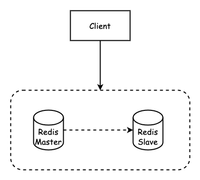

一主一从

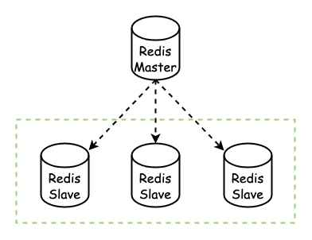

一主多从

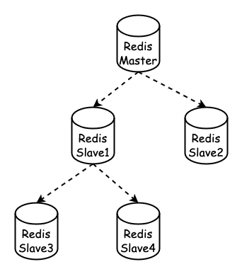

传递复制

- 主对外从对内，主可写从不可写
- 主挂了，从不可为主

### 1.1 主从配置

主Redis配置

无需特殊配置

从Redis配置

修改从服务器上的 `redis.conf` 文件:

```shell
# slaveof <masterip> <masterport>
# 表示当前【从服务器】对应的【主服务器】的IP是192.168.10.135，端口是6379。
replicaof 127.0.0.1 6379
```

### 1.2 作用

读写分离

- 一主多从，主从同步
- 主负责写，从负责读
- 提升 Redis 的性能和吞吐量
- 主从的数据一致性问题

数据容灾

- 从机是主机的备份
- 主机宕机，从机可读不可写
- 默认情况下主机宕机后，从机不可为主机
- 利用哨兵可以实现主从切换，做到高可用

### 1.3 原理与实现

#### 1.3.1 复制流程

##### 保存主节点信息

当客户端向从服务器发送 `slaveof`(`replicaof`) 主机地址(`127.0.0.1`) 端口(`6379`)时: 从服务器将主机 IP (127.0.0.1)和端口(6379)保存到 `redisServer` 的 `masterhost` 和 `masterport` 中。

```c
Struct redisServer{
    char *masterhost;//主服务器ip
    int masterport;//主服务器端口
};
```

从服务器将向发送 `SLAVEOF` 命令的客户端返回 OK，表示复制指令已经被接收，而实际上复制工作是在 OK 返回之后进行。

##### 建立 socket 连接

Slaver 与 Master 建立 Socket 连接。

Slaver 关联文件事件处理器

该处理器接收 RDB 文件(全量复制)、接收 Master 传播来的写命令(增量复制)

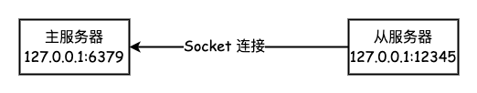

主服务器 `accept` 从服务器 Socket 连接后，创建相应的客户端状态。相当于从服务器是主服务器的 Client 端。

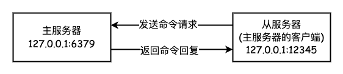

##### 发送 ping 命令

Slaver 向 Master 发送 ping 命令

1. 检测 Socket 的读写状态 
2. 检测 Master 能否正常处理

Master的响应

1. 发送 "pong", 说明正常
2. 返回错误，说明 Master 不正常
3. timeout，说明网络超时

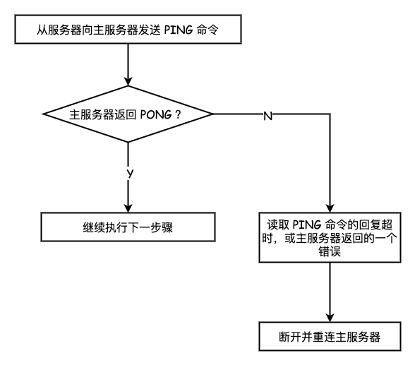

##### 权限验证

主从正常连接后，进行权限验证。

- 主未设置密码(`requirepass=""`) ，从也不用设置密码(`masterauth=""`)
- 主设置密码(`requirepass != ""`)，从需要设置密码(`masterauth=主的requirepass的值`)；或者从通过 `auth` 命令向主发送密码

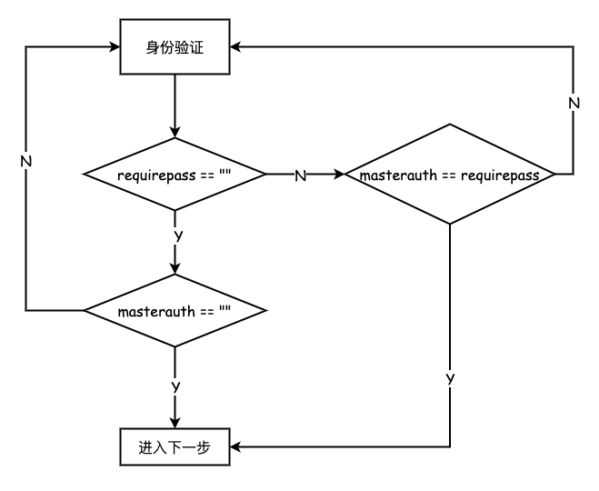

##### 发送端口信息

在身份验证步骤之后，从服务器将执行命令 `REPLCONF listening-port`，向主服务器发送从服务器的监听端口号。

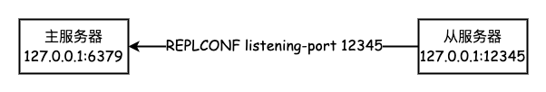

##### 同步数据

Redis 2.8 之后分为全量同步和增量同步，具体的后面详细讲解。

##### 命令传播

当同步数据完成后，主从服务器就会进入命令传播阶段，主服务器只要将自己执行的写命令发送给从服务器，
而从服务器只要一直执行并接收主服务器发来的写命令。

### 1.3.2 同步数据集

Redis 2.8 以前使用 `SYNC` 命令同步复制

Redis 2.8 之后采用 `PSYNC` 命令替代 `SYNC`

#### 旧版本

> Redis 2.8 以前

##### 实现方式

Redis 的同步功能分为同步(`sync`)和命令传播(command propagate)。

**同步操作**

1. 通过从服务器发送 SYNC 命令给主服务器
2. 主服务器生成 RDB 文件并发送给从服务器，同时发送保存所有写命令给从服务器
3. 从服务器清空之前数据并执行解释 RDB 文件
4. 保持数据一致(还需要命令传播过程才能保持一致)

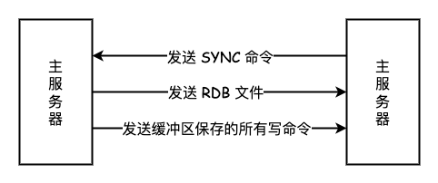

**命令传播操作**

同步操作完成后，主服务器执行写命令，该命令发送给从服务器并执行，使主从保存一致。

**缺陷**

没有全量同步和增量同步的概念，从服务器在同步时，会清空所有数据。

主从服务器断线后重复制，主服务器会重新生成 RDB 文件和重新记录缓冲区的所有命令，并全量同步到从服务器上。

#### 新版

> Redis 2.8 以后

实现方式

在 Redis 2.8 之后使用 `PSYNC` 命令，具备完整重同步和部分重同步模式。

- Redis 的主从同步，分为全量同步和增量同步。
- 只有从机第一次连接上主机是全量同步。 
- 断线重连有可能触发全量同步也有可能是增量同步( master 判断 `runid` 是否一致)。

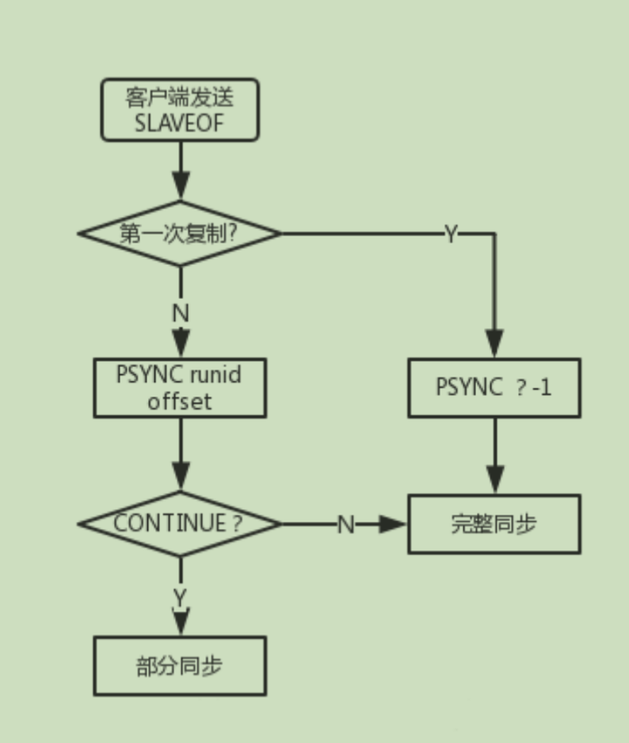

除此之外的情况都是增量同步。

##### 全量同步

Redis 的全量同步过程主要分三个阶段:

- 同步快照阶段: Master 创建并发送快照RDB给 Slave ，Slave 载入并解析快照。 Master 同时将此阶段所产生的新的写命令存储到缓冲区。
- 同步写缓冲阶段: Master 向 Slave 同步存储在缓冲区的写操作命令。
- 同步增量阶段: Master 向 Slave 同步写操作命令。

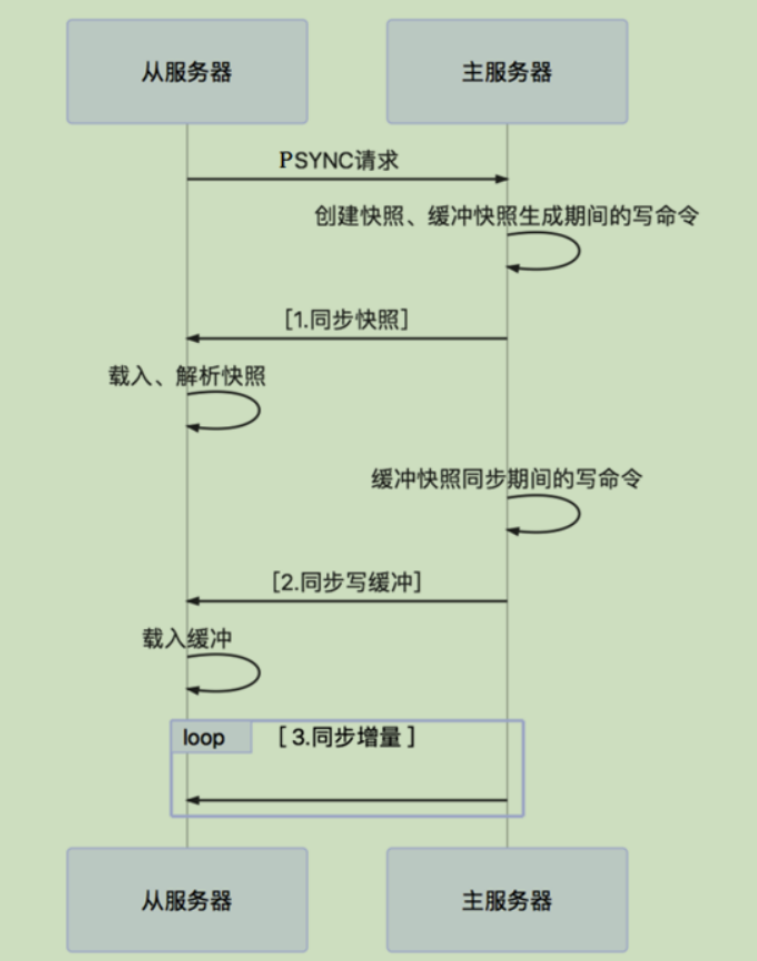

##### 增量同步

- Redis 增量同步主要指 Slave 完成初始化后开始正常工作时，Master 发生的写操作同步到 Slave 的过程。
- 通常情况下， Master 每执行一个写命令就会向 Slave 发送相同的写命令，然后 Slave 接收并执行。

### 1.3.3 心跳检测

在命令传播阶段，从服务器默认会以每秒一次的频率向主服务器发送命令:

```shell
replconf ack <replication_offset>
# ack : 应答 
# replication_offset : 从服务器当前的复制偏移量
```

主要作用有三个:

1. 检测主从的连接状态

检测主从服务器的网络连接状态。

通过向主服务器发送 `INFO replication` 命令，可以列出从服务器列表，可以看出从最后一次向主发送命令距离现在过了多少秒。`lag` 的值应该在 0 或 1 之间跳动，
如果超过 1 则说明主从之间的连接有故障。

2. 辅助实现 min-slaves
  
Redis可以通过配置防止主服务器在不安全的情况下执行写命令

```shell
min-slaves-to-write 3 (min-replicas-to-write 3)
min-slaves-max-lag 10 (min-replicas-max-lag 10)
```

上面的配置表示: 从服务器的数量少于 3 个，或者三个从服务器的延迟(`lag`)值都大于或等于 10 秒时，主服务器将拒绝执行写命令。
这里的延迟值就是上面 `INFO replication` 命令的 `lag` 值。

3. 检测命令丢失

如果因为网络故障，主服务器传播给从服务器的写命令在半路丢失，那么当从服务器向主服务器发送 `REPLCONF ACK` 命令时，主服务器将会发觉从服务器当前的复制偏移量少于自己的复制偏移量，
然后主服务器就会根据从服务器提交的复制偏移量，在复制积压缓冲区里面找到从服务器缺少的数据，并将这些数据重新发送给从服务器。(补发) 网络不断。

增量同步: 网断了，再次连接时。

## 2. 哨兵模式


## 3. 集群与分区


