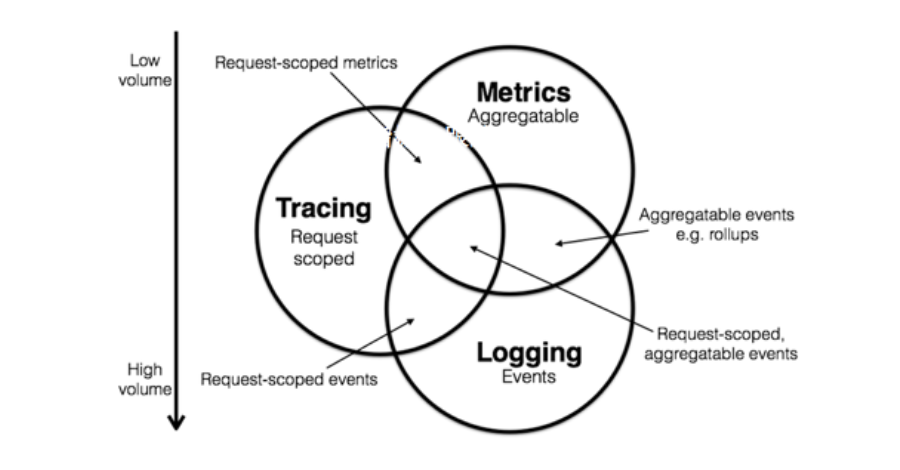
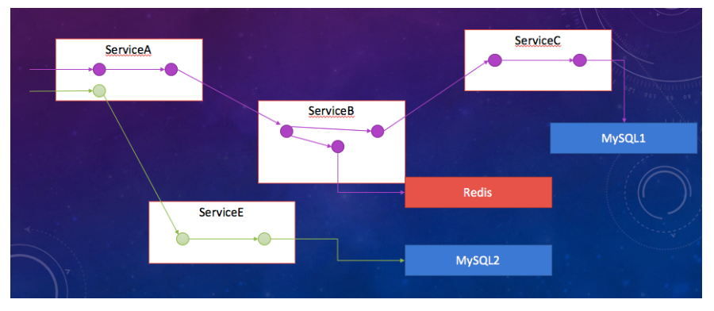
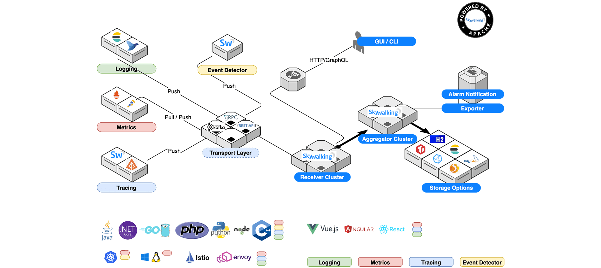

# SkyWalking 简介

随着微服务的兴起与流行，一些微服务架构下的问题也会越来越突出，服务之间的依赖关系愈发复杂。

如果某个服务出现问题，寻找问题往往需要很长的时间，可能需要一个一个服务的查找问题，由此我们就有了一个新的工具去方便定位这个问题。
这个工具就是 APM(应用性能管理)，他可以帮助我们在出现问题时，快速定位问题原因。

> APM, Application Performance Monitoring System.

SkyWalking 项目是由华为大牛 [吴晟](https://github.com/wu-sheng) 开源的个人项目，目前已经加入 Apache 孵化器。

SkyWalking 项目的核心目标是针对微服务、Cloud Native、容器化架构提供应用性能监控和分布式调用链追踪功能。

## APM 背景

APM (Application Performance Management) 即应用性能管理系统，是对企业系统即时监控，以实现对应用程序性能管理和故障管理的系统化的解决方案。

应用性能管理，主要指对企业的关键业务应用进行监测、优化，提高企业应用的可靠性和质量，保证用户得到良好的服务，降低 IT 总拥有成本。

随着微服务、云计算的发展，提升了应用的可用性、扩展性，同时也带来了运维、监控的复杂性，当我们需要从众多服务依赖中，查询出问题根源也越来越难。

系统的监控分为三个维度:

1. Metrics 

指标性统计 一个服务的正确率、成功率、流量、TPS、响应时间等

2. Tracing 分布式追踪 

从请求开始到结束，服务节点之间的调用链路

3. Logging 日志记录

程序在执行的过程中间发生了一些日志，会一帧一帧地跳出来给大家去记录这个东西，这是日志记录

## 分布式追踪

分布式链路追踪就是将一次分布式请求还原成调用链路，将一次分布式请求的调用情况集中展示，比如：各个服务节点上的耗时、请求具体到达哪台机器上、每个服务节点的请求状态等等。

## SkyWalking 简介

> <https://skywalking.apache.org/>

- 2015 年开始开源，由原华为技术专家吴晟主导实现的专门为微服务架构和云原生架构系统而设计，并且支持分布式链路追踪的 APM 系统 
- 专为微服务、云原生架构和基于容器(Docker、K8s、Mesos)架构而设计
- Apache (/əˈpætʃi/) 顶级项目

### 特性

1. 多种监控手段，语言探针和service mesh
2. 多语言探针: Java、.NET Core、PHP、Node.JS、Go
3. 支持多种数据存储方式: ElasticSearch、MySql、TiDB、H2、Sharding Sphere。(BanyanDB 已经研发两年了)
4. 强大的UI可视化界面
5. 高性能、高可用 (agent 端探针性能消耗低，服务端支持多种集群部署方式)
6. 支持多种指标的监控告警
7. 微核 + 插件式扩展的高扩展框架

### 主要部分及其功能

SkyWalking逻辑上分为四个部分：Probes（探针）, Platform backend（平台后端）, Storage（存储）, UI

探针就是 Agent，负责采集数据并上报给服务端，服务端对数据进行处理和存储，UI 负责展示。

### 同类型对比

同类型的开源 APM 产品有: 大众点评的 Cat、韩国的 pinpoint、老牌APM zipkin，综合比较 SkyWalking 是之中最值得推荐使用的产品。

SkyWalking 的优势

1. 国内开源项目，社区成熟，且可与作者直接沟通。(QQ群：392443393; 沟通时注意不要直接 @ 他，牛人脾气大！)
2. 支持语言更多: Java、.NET Core、PHP、Node.JS、Golang
3. 支持 Java 自动探针，代码无侵入，只要简单配置，就可以自动实现各种指标、调用链的埋点
4. 众多存储选择: ElasticSearch、MySql、TiDB、H2、Sharding Sphere
5. 扩展性: 支持模块、插件的可拔插
6. 支持 Java 语言的几十种插件，例如: Tomcat、RabbitMq、Kafka，且易于二次开发
7. 性能: 比其他开源软件性能都强
