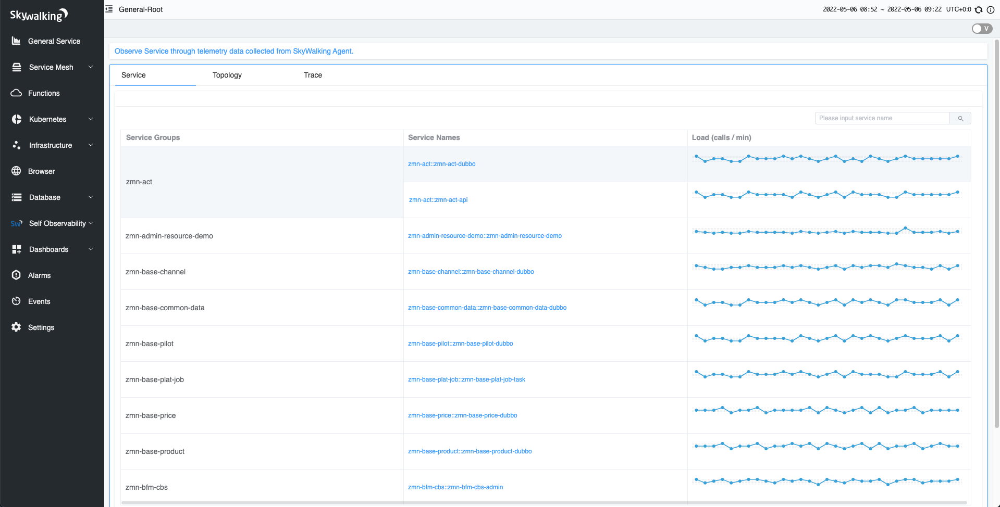

# SkyWalking 安装配置

## CentOS 7 安装

在 <http://skywalking.apache.org/downloads/> 下，我们下载 SkyWalking 发布版。

整体目录

```text
.
├── bin                 # Collector 和 Web 模块的启动脚本
├── config              # Collector 模块的配置
├── config-examples
├── LICENSE
├── licenses
├── logs
├── NOTICE
├── oap-libs            # SkyWalking 依赖的 jar 包配置
├── README.txt
├── tools
└── webapp              # Web模块的jar包和配置
```

> 新版本的 Agent 不再集成在发布包中，需要单独下载。

agent 目录介绍

```text
.
├── activations
├── bootstrap-plugins
├── config                          # 配置文件
├── LICENSE
├── licenses
├── logs
├── NOTICE
├── optional-plugins                # 可选插件
├── optional-reporter-plugins
├── plugins                         # 使用中的插件
└── skywalking-agent.jar            # agent
```

> 部分插件在使用上会影响整体的性能或者由于版权问题放置于可选插件包中，不会直接加载，如果需要使用，将可选插件中的 jar 包拷贝到 plugins 包下。

###  SkyWalking OAP 安装包准备

```shell
cd /opt/zmn/software/
# 解压
tar -zxvf apache-skywalking-apm-9.0.0.tar.gz
# 移动文件
mv apache-skywalking-apm-bin/ /opt/zmn/servers/apache-skywalking-apm-bin/
```

### SkyWalking OAP Server 搭建

1. 修改 OAP 配置文件 `apache-skywalking-apm-bin/config/application.yml`

通过 `storage.selector` 配置项来设置具体使用的存储器。

```yaml
storage:
  selector: ${SW_STORAGE:elasticsearch}
```

> ES7 和 ES6 的不兼容 BUG 修复了。

2. 启动 SkyWalking OAP 服务

```shell
[root@k8s-node2 bin]# ./oapService.sh
SkyWalking OAP started successfully!
```

是否真正启动成功，需要打开 `${OAP_HOME}/logs/skywalking-oap-server.log` 日志文件，查看是否有错误日志。

首次启动时，因为 SkyWalking OAP 会创建 Elasticsearch 的索引，所以会 "疯狂" 的打印日志。

> 友情提示：因为首次启动会创建 Elasticsearch 索引，所以可能会比较慢。

最终，我们看到如下日志，基本可以代表 SkyWalking OAP 服务启动成功：

```text
2022-04-25 15:51:43,341 - org.apache.skywalking.oap.server.starter.OAPServerBootstrap - 53 [main] INFO  [] - Version of OAP: 9.0.0-89644fe (20220217220813)
```

###  SkyWalking UI 搭建

1. 启动 SkyWalking UI 服务

```shell
[root@k8s-node2 bin]# ./webappService.sh
SkyWalking Web Application started successfully!
```

如果想要修改  SkyWalking UI 服务的参数，可以编辑 `webapp/webapp.yml` 配置文件。<Badge type="tip" text="可选" vertical="top" />

例如：

- `server.port`：SkyWalking UI 服务端口。
- `spring.cloud.discovery.client.simple.instances.oap-service`：SkyWalking OAP 服务地址数组。

因为 SkyWalking UI 界面的数据，是通过请求 SkyWalking OAP 服务来获得的。

2. 访问 UI 界面：

浏览器打开 <http://192.168.99.23:8080> 地址，界面如下图：




## Docker 安装


## Docker-compose 安装


## Kubernetes 安装

