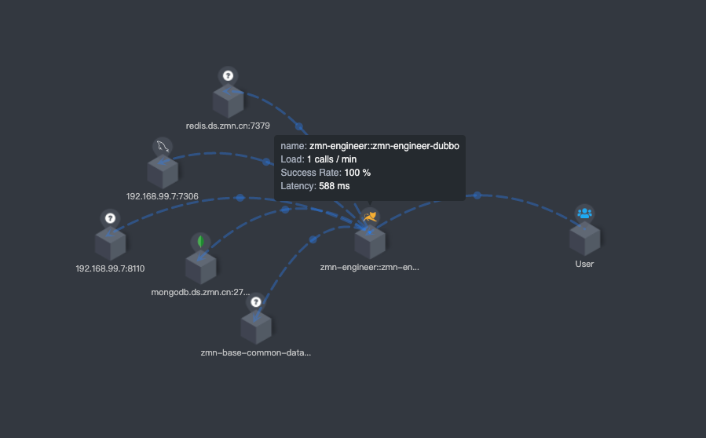

# SkyWalking 使用实战

## Java 应用接入

> Agent 命令参数参考 <https://skywalking.apache.org/docs/skywalking-java/v8.10.0/en/setup/service-agent/java-agent/configurations/>

方式一 <Badge type="tip" text="推荐" vertical="top" />

```shell
-javaagent:/opt/zmn/software/skywalking-agent/skywalking-agent.jar \
  -Dskywalking.agent.service_name=zmn-owl::zmn-owl-admin \
  -Dskywalking.collector.backend_service=192.168.99.23:11800 \
  -jar xxx.jar
```

方式二

```shell
# 启动命令
# SkyWalking Agent 配置
export SW_AGENT_NAME=zmn-owl::zmn-owl-admin
export SW_AGENT_COLLECTOR_BACKEND_SERVICES=192.168.99.23:11800
export JAVA_AGENT=-javaagent:/opt/zmn/software/skywalking-agent/skywalking-agent.jar

# Jar 启动
java -jar $JAVA_AGENT -jar xxx.jar
```

应用接入后，就可以在 SkyWalking 中查看链路追踪、拓扑图，如果需要查看详细的业务日志还需要接入日志。

## 日志接入

> 会在 `zmn-framework` 中统一添加，此处仅做学习参考。

### SpringBoot 项目日志接入

1. 添加 pom 依赖

```xml
<dependencies>
    <!-- SkyWalking -->
    <dependency>
        <groupId>org.apache.skywalking</groupId>
        <artifactId>apm-toolkit-logback-1.x</artifactId>
    </dependency>
    <dependency>
        <groupId>org.apache.skywalking</groupId>
        <artifactId>apm-toolkit-trace</artifactId>
    </dependency>
</dependencies>
```

2. `logback-spring.xml` 文件中添加日志收集器

```xml
<configuration scan="true" scanPeriod=" 5 seconds">

    <appender name="stdout" class="ch.qos.logback.core.ConsoleAppender">
        <encoder class="ch.qos.logback.core.encoder.LayoutWrappingEncoder">
            <layout class="org.apache.skywalking.apm.toolkit.log.logback.v1.x.mdc.TraceIdMDCPatternLogbackLayout">
                <Pattern>%d{yyyy-MM-dd HH:mm:ss.SSS} [%X{tid}] [%thread] %-5level %logger{36} -%msg%n</Pattern>
            </layout>
        </encoder>
    </appender>

    <appender name="grpc-log" class="org.apache.skywalking.apm.toolkit.log.logback.v1.x.log.GRPCLogClientAppender">
        <encoder class="ch.qos.logback.core.encoder.LayoutWrappingEncoder">
            <layout class="org.apache.skywalking.apm.toolkit.log.logback.v1.x.mdc.TraceIdMDCPatternLogbackLayout">
                <Pattern>%d{yyyy-MM-dd HH:mm:ss.SSS} [%X{tid}] [%thread] %-5level %logger{36} -%msg%n</Pattern>
            </layout>
        </encoder>
    </appender>

    <root level="INFO">
        <appender-ref ref="grpc-log"/>
        <appender-ref ref="stdout"/>
    </root>

</configuration>
```

## UI 使用

- Service: 微服务
- Topology: 拓扑图 (拓扑结构图是指由网络节点设备和通信介质构成的网络结构图。)
- Trace: 链路追踪
- Endpoint: 端点，是服务中的某个路径或者说URI

SkyWalking 允许用户了解服务和端点之间的拓扑关系，查看每个服务/服务实例/端点的度量，并设置警报规则。

### 概览

- Apdex：一个标准的应用性能工业指标。

> Apdex (Application Performance Index) 性能指数, 是一个国际通用标准，是用户对应用性能满意度的量化值。
>
> 参考：<https://support.huaweicloud.com/apm_faq/apm_03_0010.html>

- Percentile：百分位数，用于反映响应时间的长尾效应，例如 p99=200ms，代表 99% 的请求响应时间可以小于等于 200ms。

- SLA：又叫 "Success Rate"，成功率。

> SLA (Service Level Agreement) 服务级别协议，是指提供服务的企业与客户之间就服务的品质、水准、性能等方面所达成的双方共同认可的协议或契约。

- CPM：Call Per Minute 每分钟调用数。又叫 "Service Load"
- Latency: 等待时长

### Instance

- 进入，可以查看实例的基本信息，如：负载、响应时长、数据库连接池信息、链路追踪、日志和 JVM 相关信息。

- 「查看」可以快速查看启动参数等信息

### 拓扑图

拓扑图是根据探针上行数据分析出的整体拓扑结构。



拓扑图支持点击展现和下钻单个服务的性能统计、trace、告警，也可以通过点击拓扑图中的关系线，展现服务间、服务实例间的性能指标。

拓扑图连线上的点的数据含义

| 参数      | 说明        |
|---------|-----------|
| 侦查端     | 访问类型      |
| Latency | 等待时间      |
| Load    | 负载 (访问频率) |

> 侦查端，可选值：Client/Server。 如果访问外部服务则为 Client，如果两个受监控的服务相互访问，则同时为 Client + Server.

> 那么什么时候是 Server 呢？ 按照书上说，「如果调用数据只来源于上游服务，而没有下游服务的话，那么在拓扑图上就帮忙生成一个点，用来表示有用户访问该上游服务。」，这时候是 Server。其他时候是 Client。(个人觉得理解这个没什么用)

### 通过 Kibana 查看日志

使用三方工具查询日志，需要将配置文件 `application.yaml` 的配置项 `core/default/activeExtraModelColumns` 设置为 `true`.

> 搭建 Kibana 略 ...

#### Kibana 初始化设置

> 管理员配置好后，可以直接使用了，并不是每个人都需要了解。

1. Discovery > Index Patterns > Create index pattern

2. 输入右边的表，建议使用逻辑表

#### Kibana 日志搜索

搜索：

1. 直接输入搜索条件，可以使用任何关键字搜索，也可以添加 `*` 模糊搜索。如：`"05-07 14:53"`, `05-07 14:53*`

2. 指定字段搜索格式： `trace_id:"3e0341e4bf754f298eef423b14728b6d.300.16517398356430009"`

仅展示部分列：

- 默认展示文档(数据表)的所有列
- Available Fields 列表上的任何字段后面点击 "+" 按钮
- 去掉不想看的：在 Selected field 列表的字段后面点击 "×" 按钮

> KQL 语法，可以研究一下

## 预警配置

> 官方文档：<https://skywalking.apache.org/docs/main/latest/en/setup/backend/backend-alarm/>

预警配置在 `$APM_HOME/config/alarm-settings.yml` 中。

系统自带了几条规则作为参考：

1. Service average response time over 1s in the last 3 minutes.

最近三分钟平均响应时长超过 1S 的微服务。

```yaml
service_resp_time_rule:
  metrics-name: service_resp_time
  op: ">"
  threshold: 1000
  period: 10
  count: 3
  silence-period: 5
  message: Response time of service {name} is more than 1000ms in 3 minutes of last 10 minutes.
```

2. Service success rate lower than 80% in the last 2 minutes.

最近两分钟响应成功率低于 80% 的微服务。

```yaml
service_sla_rule:
  # Metrics value need to be long, double or int
  metrics-name: service_sla
  op: "<"
  threshold: 8000
  # The length of time to evaluate the metrics
  period: 10
  # How many times after the metrics match the condition, will trigger alarm
  count: 2
  # How many times of checks, the alarm keeps silence after alarm triggered, default as same as period.
  silence-period: 3
  message: Successful rate of service {name} is lower than 80% in 2 minutes of last 10 minutes
```

3. Percentile of service response time over 1s in the last 3 minutes

最近 3 分钟响应的「百分位数」超过 1S 的微服务

```yaml
service_resp_time_percentile_rule:
  # Metrics value need to be long, double or int
  metrics-name: service_percentile
  op: ">"
  threshold: 1000,1000,1000,1000,1000
  period: 10
  count: 3
  silence-period: 5
  message: Percentile response time of service {name} alarm in 3 minutes of last 10 minutes, due to more than one condition of p50 > 1000, p75 > 1000, p90 > 1000, p95 > 1000, p99 > 1000
```

4. Service Instance average response time over 1s in the last 2 minutes, and the instance name matches the regex.

> 上面是官方文档原话，很明显他在瞎说。

最近 2 分钟的平均响应时长超过 1s 的微服务实例。

```yaml
service_instance_resp_time_rule:
  metrics-name: service_instance_resp_time
  op: ">"
  threshold: 1000
  period: 10
  count: 2
  silence-period: 5
  message: Response time of service instance {name} is more than 1000ms in 2 minutes of last 10 minutes
```

5. Endpoint average response time over 1s in the last 2 minutes.

最近两分钟平均响应时长超过 1S 的端点。

> 并没有这个规则，官方文档瞎说的。

6. Database access average response time over 1s in the last 2 minutes.

最近两分钟平均响应时长超过 1s 的数据库

```yaml
database_access_resp_time_rule:
  metrics-name: database_access_resp_time
  threshold: 1000
  op: ">"
  period: 10
  count: 2
  message: Response time of database access {name} is more than 1000ms in 2 minutes of last 10 minutes
```

7. Endpoint relation average response time over 1s in the last 2 minutes.

最近两分钟关联端点响应时长超过 1s 的端点。

```yaml
endpoint_relation_resp_time_rule:
  metrics-name: endpoint_relation_resp_time
  threshold: 1000
  op: ">"
  period: 10
  count: 2
  message: Response time of endpoint relation {name} is more than 1000ms in 2 minutes of last 10 minutes
```

### 概述

首先解释下各个实体的定义：

- Service: 微服务。如：`zmn-erp-admin`
- Instance: 微服务的具体的实例。如：`55c82440049f457588c50fd38ae3a353@172.17.0.1`
- Endpoint: 端点。如：`POST:/rule/list.action`，`com.zmn.base.price.dubbo.interfaces.tariff.TariffSkuPriceReferRemoteService.synchroRedisData(Integer,Integer)`
- Database: 数据库。如：`plat.db.ds.zmn.cn:7306`

告警规则有两种：独立规则和复合规则。

### 独立规则

一条独立规则主要由以下几部分组成：

 - 规则名称 <Badge type="warning" text="必须" vertical="top" /> : 规则名需要全局唯一，并且必须以 `_rule`结尾。                                                                                         
 - `metrics-name` <Badge type="warning" text="必须" vertical="top" /> : 指标，可用的指标定义在 `/config/oal/*.oal` 中。详情见下表：可用指标规则表。                                                                 
 - `include-names`: 规则监控的实体列表，如果不填默认监控指标定义的所有实体。                                                                                  
 - `exclude-names`: 排除监控的实体列表，如果不填默认监控指标定义的所有实体。                                                                                  
 - `include-names-regex`: 提供一个正则表达式来匹配实体名称。和上面的设置一同生效。                                                                                  
 - `exclude-names-regex`: 提供一个正则表达式来排除实体名称。和上面的设置一同生效。                                                                                  
 - `include-labels`: 包含的标签列表                                                                                                       
 - `exclude-labels`: 排除的标签列表                                                                                                       
 - `include-labels-regex`: 包含的标签正则。和上面的设置一同生效                                                                                            
 - `exclude-labels-regex`: 排除的标签列表。和上面的设置一同生效。                                                                                           
 - `tags`: 填写 Key=Value 对，默认支持 `level`                                                                                   
 - `threshold` <Badge type="warning" text="必须" vertical="top" /> : 阈值。如果指标是多个值，则此处填数组。如百分位数设置为 `1000,1000,1000,1000,1000`; 如果忽略部分值，使用 `-`, 如 `-,-,1000,1000,1000` 表示不对 P50 和 P75 做预警。 
 - `op` <Badge type="warning" text="必须" vertical="top" /> : 比较符。支持 `>`, `>=`, `<`, `<=`, `==`                                                                               
 - `period` <Badge type="warning" text="必须" vertical="top" /> : 规则多久执行一次。单位：分钟。                                                                                                 
 - `count` <Badge type="warning" text="必须" vertical="top" /> : 规则条件匹配了，多长时间后发送预警消息。单位：分钟。                                                                                      
 - `only-as-condition`: true/false. 是否仅作为符合规则的条件。                                                                                      
 - `silence-period` <Badge type="warning" text="必须" vertical="top" /> : 预警后，多长时间内当前规则不再预警。单位：分钟。                                                                                       
 - `message` <Badge type="warning" text="必须" vertical="top" /> : 消息体。(如果仅作为符合规则的条件，可以不填)                                                                                        

> 如果想要在 SkyWalking UI 上面使用 tag 搜索的话，需要在系统变量 `SW_SEARCHABLE_ALARM_TAG_KEYS` 中添加 Key，
> 或者在 `${SW_HOME}/config/application.yml` 配置文件的 `core.default.searchableAlarmTags` 项中添加 Key。 默认仅支持 `level`。

可用系统监控指标规则表：

| 分类         | 说明                             | 指标                                                     | OAL                                                                                                                                                               |
|------------|--------------------------------|--------------------------------------------------------|-------------------------------------------------------------------------------------------------------------------------------------------------------------------|
| 微服务相关      | 服务平均响应时长                       | `service_resp_time`                                    | `from(Service.latency).longAvg();`                                                                                                                                |
| 微服务相关      | 服务成功响应百分数                      | `service_sla`                                          | `from(Service.*).percent(status == true);`                                                                                                                        |
| 微服务相关      | 每分钟请求数                         | `service_cpm`                                          | `from(Service.*).cpm();`                                                                                                                                          |
| 微服务相关      | 服务响应「百分位数」                     | `service_percentile`                                   | `from(Service.latency).percentile(10);` <br/>  // Multiple values including p50, p75, p90, p95, p99                                                               |
| 微服务相关      | 服务 Apdex 等级分数                  | `service_apdex`                                        | `from(Service.latency).apdex(name, status);`                                                                                                                      |
| 微服务相关      | MQ 消费数量                        | `service_mq_consume_count`                             | `from(Service.*).filter(type == RequestType.MQ).count();`                                                                                                         |
| 微服务相关      | MQ 消费等待时长                      | `service_mq_consume_latency`                           | `from((str->long)Service.tag["transmission.latency"]).filter(type == RequestType.MQ).filter(tag["transmission.latency"] != null).longAvg();`                      |
| 关联服务相关     | 关联服务客户端每分钟请求数                  | `service_relation_client_cpm`                          | `from(ServiceRelation.*).filter(detectPoint == DetectPoint.CLIENT).cpm();`                                                                                        |
| 关联服务相关     | 关联服务服务端每分钟请求数                  | `service_relation_server_cpm`                          | `from(ServiceRelation.*).filter(detectPoint == DetectPoint.SERVER).cpm();`                                                                                        |
| 关联服务相关     | 关联服务客户端成功响应百分数                 | `service_relation_client_call_sla`                     | `from(ServiceRelation.*).filter(detectPoint == DetectPoint.CLIENT).percent(status == true);`                                                                      |
| 关联服务相关     | 关联服务服务端成功响应百分数                 | `service_relation_server_call_sla`                     | `from(ServiceRelation.*).filter(detectPoint == DetectPoint.SERVER).percent(status == true);`                                                                      |
| 关联服务相关     | 关联服务客户端平均响应时长                  | `service_relation_client_resp_time`                    | `from(ServiceRelation.latency).filter(detectPoint == DetectPoint.CLIENT).longAvg();`                                                                              |
| 关联服务相关     | 关联服务服务端平均响应时长                  | `service_relation_server_resp_time`                    | `from(ServiceRelation.latency).filter(detectPoint == DetectPoint.SERVER).longAvg();`                                                                              |
| 关联服务相关     | 关联服务客户端响应「百分位数」                | `service_relation_client_percentile`                   | `from(ServiceRelation.latency).filter(detectPoint == DetectPoint.CLIENT).percentile(10);` <br/> // Multiple values including p50, p75, p90, p95, p99              |
| 关联服务相关     | 关联服务服务端响应「百分位数」                | `service_relation_server_percentile`                   | `from(ServiceRelation.latency).filter(detectPoint == DetectPoint.SERVER).percentile(10);` <br/> // Multiple values including p50, p75, p90, p95, p99              |
| 关联服务实例相关   | 关联服务实例客户端每分钟请求数                | `service_instance_relation_client_cpm`                 | `from(ServiceInstanceRelation.*).filter(detectPoint == DetectPoint.CLIENT).cpm();`                                                                                |
| 关联服务实例相关   | 关联服务实例客户端服务端每分钟请求数             | `service_instance_relation_server_cpm`                 | `from(ServiceInstanceRelation.*).filter(detectPoint == DetectPoint.SERVER).cpm();`                                                                                |
| 关联服务实例相关   | 关联服务实例客户端成功响应百分数               | `service_instance_relation_client_call_sla`            | `from(ServiceInstanceRelation.*).filter(detectPoint == DetectPoint.CLIENT).percent(status == true);`                                                              |
| 关联服务实例相关   | 关联服务实例客户端服务端成功响应百分数            | `service_instance_relation_server_call_sla`            | `from(ServiceInstanceRelation.*).filter(detectPoint == DetectPoint.SERVER).percent(status == true);`                                                              |
| 关联服务实例相关   | 关联服务实例客户端平均响应时长                | `service_instance_relation_client_resp_time`           | `from(ServiceInstanceRelation.latency).filter(detectPoint == DetectPoint.CLIENT).longAvg();`                                                                      |
| 关联服务实例相关   | 关联服务实例客户端服务端平均响应时长             | `service_instance_relation_server_resp_time`           | `from(ServiceInstanceRelation.latency).filter(detectPoint == DetectPoint.SERVER).longAvg(); `                                                                     |
| 关联服务实例相关   | 关联服务实例客户端响应「百分位数」              | `service_instance_relation_client_percentile`          | `from(ServiceInstanceRelation.latency).filter(detectPoint == DetectPoint.CLIENT).percentile(10);`   <br/>    // Multiple values including p50, p75, p90, p95, p99 |
| 关联服务实例相关   | 关联服务实例客户端服务端响应「百分位数」           | `service_instance_relation_server_percentile`          | `from(ServiceInstanceRelation.latency).filter(detectPoint == DetectPoint.SERVER).percentile(10);`   <br/>  // Multiple values including p50, p75, p90, p95, p99   |
| 微服务实例相关    | 微服务实例成功响应百分数                   | `service_instance_sla`                                 | ` from(ServiceInstance.*).percent(status == true);`                                                                                                               |
| 微服务实例相关    | 微服务实例平均响应时长                    | `service_instance_resp_time`                           | `from(ServiceInstance.latency).longAvg();`                                                                                                                        |
| 微服务实例相关    | 微服务实例每分钟请求数                    | `service_instance_cpm`                                 | ` from(ServiceInstance.*).cpm();`                                                                                                                                 |
| 端点相关       | 端点每分钟请求数                       | `endpoint_cpm`                                         | `from(Endpoint.*).cpm();`                                                                                                                                         |
| 端点相关       | 端点平均响应时长                       | `endpoint_resp_time`                                   | `from(Endpoint.latency).longAvg();`                                                                                                                               |
| 端点相关       | 端点成功响应百分数                      | `endpoint_sla`                                         | `from(Endpoint.*).percent(status == true);`                                                                                                                       |
| 端点相关       | 端点响应「百分位数」                     | `endpoint_percentile`                                  | `from(Endpoint.latency).percentile(10);` <br/> // Multiple values including p50, p75, p90, p95, p99                                                               |
| 端点相关       | 端点 MQ 消费数量                     | `endpoint_mq_consume_count`                            | `from(Endpoint.*).filter(type == RequestType.MQ).count();`                                                                                                        |
| 端点相关       | 端点 MQ 消费等待时长                   | `endpoint_mq_consume_latency`                          | `from((str->long)Endpoint.tag["transmission.latency"]).filter(type == RequestType.MQ).filter(tag["transmission.latency"] != null).longAvg();`                     |
| 关联端点相关     | 关联端点每分钟请求数                     | `endpoint_relation_cpm`                                | `from(EndpointRelation.*).filter(detectPoint == DetectPoint.SERVER).cpm();`                                                                                       |
| 关联端点相关     | 关联端点平均响应时长                     | `endpoint_relation_resp_time`                          | `from(EndpointRelation.rpcLatency).filter(detectPoint == DetectPoint.SERVER).longAvg();`                                                                          |
| 关联端点相关     | 关联端点成功响应百分数                    | `endpoint_relation_sla`                                | `from(EndpointRelation.*).filter(detectPoint == DetectPoint.SERVER).percent(status == true);`                                                                     |
| 关联端点相关     | 关联端点响应「百分位数」                   | `endpoint_relation_percentile`                         | `from(EndpointRelation.rpcLatency).filter(detectPoint == DetectPoint.SERVER).percentile(10);` <br/> // Multiple values including p50, p75, p90, p95, p99          |
| 数据库相关      | 数据库平均响应时长                      | `database_access_resp_time`                            | `from(DatabaseAccess.latency).longAvg();`                                                                                                                         |
| 数据库相关      | 数据库成功响应百分数                     | `database_access_sla`                                  | `from(DatabaseAccess.*).percent(status == true);`                                                                                                                 |
| 数据库相关      | 数据库每分钟请求数                      | `database_access_cpm`                                  | `from(DatabaseAccess.*).cpm();`                                                                                                                                   |
| 数据库相关      | 数据库响应「百分位数」                    | `database_access_percentile`                           | `from(DatabaseAccess.latency).percentile(10);`                                                                                                                    |
| 系统事件相关     | 事件总量                           | `event_total`                                          | `from(Event.*).count();`                                                                                                                                          |
| 系统事件相关     | 正常事件数量                         | `event_normal_count`                                   | `from(Event.*).filter(type == "Normal").count();`                                                                                                                 |
| 系统事件相关     | Error 事件数量                     | `event_error_count`                                    | `from(Event.*).filter(type == "Error").count();`                                                                                                                  |
| 系统事件相关     | Start 事件数量                     | `event_start_count`                                    | `from(Event.*).filter(name == "Start").count();`                                                                                                                  |
| 系统事件相关     | Shutdown 事件数量                  | `event_shutdown_count`                                 | `from(Event.*).filter(name == "Shutdown").count();`                                                                                                               |
| 微服务 JVM 相关 | 微服务实例 JVM CPU 使用率              | `instance_jvm_cpu`                                     | `from(ServiceInstanceJVMCPU.usePercent).doubleAvg();`                                                                                                             |
| 微服务 JVM 相关 | 微服务实例 JVM 堆内存                  | `instance_jvm_memory_heap`                             | `from(ServiceInstanceJVMMemory.used).filter(heapStatus == true).longAvg();`                                                                                       |
| 微服务 JVM 相关 | 微服务实例 JVM 非堆内存                 | `instance_jvm_memory_noheap`                           | `from(ServiceInstanceJVMMemory.used).filter(heapStatus == false).longAvg();`                                                                                      |
| 微服务 JVM 相关 | 微服务实例 JVM 最大堆内存                | `instance_jvm_memory_heap_max`                         | `from(ServiceInstanceJVMMemory.max).filter(heapStatus == true).longAvg();`                                                                                        |
| 微服务 JVM 相关 | 微服务实例 JVM 最大非堆内存               | `instance_jvm_memory_noheap_max`                       | `from(ServiceInstanceJVMMemory.max).filter(heapStatus == false).longAvg();`                                                                                       |
| 微服务 JVM 相关 | 微服务实例 JVM 新生代回收时间              | `instance_jvm_young_gc_time`                           | `from(ServiceInstanceJVMGC.time).filter(phase == GCPhase.NEW).sum();`                                                                                             |
| 微服务 JVM 相关 | 微服务实例 JVM 老年代回收时间              | `instance_jvm_old_gc_time`                             | `from(ServiceInstanceJVMGC.time).filter(phase == GCPhase.OLD).sum();`                                                                                             |
| 微服务 JVM 相关 | 微服务实例 JVM                      | `instance_jvm_normal_gc_time`                          | `from(ServiceInstanceJVMGC.time).filter(phase == GCPhase.NORMAL).sum();`                                                                                          |
| 微服务 JVM 相关 | 微服务实例 JVM 新生代回收次数              | `instance_jvm_young_gc_count`                          | `from(ServiceInstanceJVMGC.count).filter(phase == GCPhase.NEW).sum();`                                                                                            |
| 微服务 JVM 相关 | 微服务实例 JVM  老年代回收次数             | `instance_jvm_old_gc_count`                            | `from(ServiceInstanceJVMGC.count).filter(phase == GCPhase.OLD).sum();`                                                                                            |
| 微服务 JVM 相关 | 微服务实例 JVM                      | `instance_jvm_normal_gc_count`                         | `from(ServiceInstanceJVMGC.count).filter(phase == GCPhase.NORMAL).sum();`                                                                                         |
| 微服务 JVM 相关 | 微服务实例 JVM 线程存活数                | `instance_jvm_thread_live_count`                       | `from(ServiceInstanceJVMThread.liveCount).longAvg();`                                                                                                             |
| 微服务 JVM 相关 | 微服务实例 JVM 守护线程存活数              | `instance_jvm_thread_daemon_count`                     | `from(ServiceInstanceJVMThread.daemonCount).longAvg();`                                                                                                           |
| 微服务 JVM 相关 | 微服务实例 JVM 峰值线程数                | `instance_jvm_thread_peak_count`                       | `from(ServiceInstanceJVMThread.peakCount).longAvg();`                                                                                                             |
| 微服务 JVM 相关 | 微服务实例 JVM RUNNABLE 状态的线程数      | `instance_jvm_thread_runnable_state_thread_count`      | `from(ServiceInstanceJVMThread.runnableStateThreadCount).longAvg();`                                                                                              |
| 微服务 JVM 相关 | 微服务实例 JVM BLOCKED 状态的线程数       | `instance_jvm_thread_blocked_state_thread_count`       | `from(ServiceInstanceJVMThread.blockedStateThreadCount).longAvg();`                                                                                               |
| 微服务 JVM 相关 | 微服务实例 JVM WAITING 状态的线程数       | `instance_jvm_thread_waiting_state_thread_count`       | `from(ServiceInstanceJVMThread.waitingStateThreadCount).longAvg();`                                                                                               |
| 微服务 JVM 相关 | 微服务实例 JVM TIMED_WAITING 状态的线程数 | `instance_jvm_thread_timed_waiting_state_thread_count` | `from(ServiceInstanceJVMThread.timedWaitingStateThreadCount).longAvg();`                                                                                          |
| 微服务 JVM 相关 | 微服务实例 JVM 类加载器数                | `instance_jvm_class_loaded_class_count`                | `from(ServiceInstanceJVMClass.loadedClassCount).longAvg();`                                                                                                       |
| 微服务 JVM 相关 | 微服务实例 JVM                      | `instance_jvm_class_total_unloaded_class_count`        | `from(ServiceInstanceJVMClass.totalUnloadedClassCount).longAvg();`                                                                                                |
| 微服务 JVM 相关 | 微服务实例 JVM                      | `instance_jvm_class_total_loaded_class_count`          | `from(ServiceInstanceJVMClass.totalLoadedClassCount).longAvg();`                                                                                                  |

如果默认提供的指标不满足，还可以添加自定义键控指标。需要使用 OAL 语法。

> OAL 入门参考：<https://skywalking.apache.org/docs/main/v9.0.0/en/concepts-and-designs/oal/>

### 复合规则

复合规则仅适用于针对相同实体级别的告警规则，例如都是服务级别的告警规则：`service_percent_rule && service_resp_time_percentile_rule`。

不可以编写不同实体级别的告警规则，例如服务级别的一个告警规则和端点级别的一个规则：`service_percent_rule && endpoint_percent_rule`。

复合规则主要由以下几部分构成：

- 规则名称 <Badge type="warning" text="必须" vertical="top" /> ：在告警信息中显示的唯一名称，必须以 `_rule` 结尾。
- `expression` <Badge type="warning" text="必须" vertical="top" /> ：规则组成表达式，支持 `&&`, `||` 和 `()` 操作符。
- `message` <Badge type="warning" text="必须" vertical="top" /> ：规则触发时，发送的通知消息。
- `tags` <Badge type="warning" text="必须" vertical="top" /> : Key/Value 对的形式，标签功能。默认支持 `level`。

```yaml{23-29}
rules:
  service_percent_rule:
    metrics-name: service_percent
    include-names:
      - service_a
      - service_b
    exclude-names:
      - service_c
    threshold: 85
    op: <
    period: 10
    count: 4
    only-as-condition: false
  service_resp_time_percentile_rule:
    metrics-name: service_percentile
    op: ">"
    threshold: 1000,1000,1000,1000,1000
    period: 10
    count: 3
    silence-period: 5
    message: Percentile response time of service {name} alarm in 3 minutes of last 10 minutes, due to more than one condition of p50 > 1000, p75 > 1000, p90 > 1000, p95 > 1000, p99 > 1000
    only-as-condition: false
composite-rules:
  comp_rule:
    # Must satisfied percent rule and resp time rule 
    expression: service_percent_rule && service_resp_time_percentile_rule
    message: Service {name} successful rate is less than 80% and P50 of response time is over 1000ms
    tags:
      level: CRITICAL
```

### 预警消息发送

预警消息发送支持 WebHook 的方式，同时还支持 gRPCHook、Slack Chat Hook、WeChat Hook、DingTalk Hook、Feishu Hook、WeLink Hook 等。

#### WebHook

WebHook 的方式，会发送 POST 请求到配置的 URL。请求的 ContentType 为 `application/json`，数据结构是 `List<org.apache.skywalking.oap.server.core.alarm.AlarmMessage>`

数据结构具体如下：

```json
[{
  "scopeId": 1,
  "scope": "SERVICE",
  "name": "serviceA",
  "id0": "12",
  "id1": "",
  "ruleName": "service_resp_time_rule",
  "alarmMessage": "alarmMessage xxxx",
  "startTime": 1560524171000,
  "tags": [{
    "key": "level",
    "value": "WARNING"
  }]
}, {
  "scopeId": 1,
  "scope": "SERVICE",
  "name": "serviceB",
  "id0": "23",
  "id1": "",
  "ruleName": "service_resp_time_rule",
  "alarmMessage": "alarmMessage yyy",
  "startTime": 1560524171000,
  "tags": [{
    "key": "level",
    "value": "CRITICAL"
  }]
}]
```

#### DingTalk Hook

除了可以用 WebHook 对接预警系统发送系统预警消息外，也可以直接通过添加钉钉机器人的方式。

只需要在 `${SW_HOME}/config/alarm-settings.yml` 末尾添加如下配置即可。

```yaml
dingtalkHooks:
  textTemplate: |-
    {
      "msgtype": "text",
      "text": {
        "content": "Apache SkyWalking Alarm: \n %s."
      }
    }
  webhooks:
    - url: https://oapi.dingtalk.com/robot/send?access_token=05b4a0bed9fe137e7fd744556d82fe73826f3fd7754df073c4b600e2a786bfc3
      secret: SEC7bdd0717d3000fe1dbef7fdbb538a9c1f78ed0b3f7c17ae8695c8ca31d6086c9
```

## 可能遇到的问题

### UI

v 9.0.0 UI 存在的 BUG

1. `Trace` -> `View Logs` 按钮查询不到日志。(解决：点击具体的链路然后 `Related Logs` 查看关联的日志)
2. `Trace` 的 `Trace Id` 旁边的复制按钮，点击后会有 JS 报错导致复制不成功。(点开手动复制)

> 需要注意：`Notice: Please press Enter after inputting a tag, key of content, exclude key of content(key=value).`

Log 搜索界面的这几个搜索条件，输入后，需要按「回车键」，再点击 "Search" 按钮查询。

如果不满意，可以使用 Kibana 查看日志。

### OAP Server

常见报错：

1. Grpc server thread pool is full, rejecting the task

这个错误是因为你的oap服务的吞吐量太弱，太弱这里可以理解为：你的存储性能跟不上，或者你的oap server的配置太低都有可能， 但agent上报又快，最有效的方法是增加oap服务数量，提高底层存储配置。如果没有条件看下面：

默认grpc server的线程池大小是4*cpu数，排队队列长度是10000，可以调整这两个参数大小：定位到application.yml文件。在core的default下增加

gRPCThreadPoolSize: 默认是4倍的cpu，这里可以调高,例如8核默认是4*8=32，可以调成40或更多

gRPCThreadPoolQueueSize：默认是10000，可以调高


2. Can't split service id into 2 parts, org.apache.skywalking.oap.server.core.UnexpectedException: Can't split service id into 2 parts,

这种情况一般都是在 SkyWalking 老版本升级到 8.x 版本，因为存储没有清理干净导致的问题，请删除旧版本索引，再试试。

v9.0.0 已知 BUG，预计 v9.1.0 修复

### 日志分析

application.yaml

```yaml
log-analyzer:
  selector: ${SW_LOG_ANALYZER:default}
  default:
    lalFiles: ${SW_LOG_LAL_FILES:my-lal-config}
    malFiles: ${SW_LOG_MAL_FILES:"my-lal-mal-config"}
```

lal/my-lal-config.yml

```yaml
rules:
  - name: example
    dsl: |
      filter {
        if (log.service == "TestService") {
          abort {}
        }
        text {
          if (!regexp($/(?s)(?<timestamp>\d{4}-\d{2}-\d{2} \d{2}:\d{2}:\d{2}.\d{3}) \[TID:(?<tid>.+?)] \[(?<thread>.+?)] (?<level>\w{4,}) (?<logger>.{1,36}) - (?<msg>.+)/$)) {
            abort {}
          }
        }
        extractor {
          metrics {
            timestamp log.timestamp as Long
            labels level: parsed.level, service: log.service, instance: log.serviceInstance
            name "log_count"
            layer 'GENERAL'
            value 1
          }
        }
        sink {
          sampler {
            if (log.service == "ImportantApp") {
              rateLimit("ImportantAppSampler") {
                rpm 18000
              }
            } else {
              rateLimit("OtherSampler") {
                rpm 1800
              }
            }
          }
        }
      }

```

log-mal-rules/my-lal-mal-config.yaml

```yaml
expSuffix: instance(['service'], ['instance'], Layer.GENERAL)
metricPrefix: log
metricsRules:
  - name: count_info
    exp: log_count.tagEqual('level', 'INFO').sum(['service', 'instance'])
  - name: count_error
      exp: log_count.tagEqual('level', 'ERROR').sum(['service', 'instance'])
```

重启

```shell
cd /opt/zmn/servers/

./apm/bin/oapService.sh
./apm2/bin/oapService.sh


tail -fn 200 apm/logs/skywalking-oap-server.log 
tail -fn 200 apm2/logs/skywalking-oap-server.log
```

添加 Dashboard 然后添加 log_count_info log_count_error 没有数据。

ES 也没有新的索引添加。

```http request
GET _cat/indices?s=index:asc&v=true
```

结果仍然只有 84 行，和添加前 lal 之前一样。
