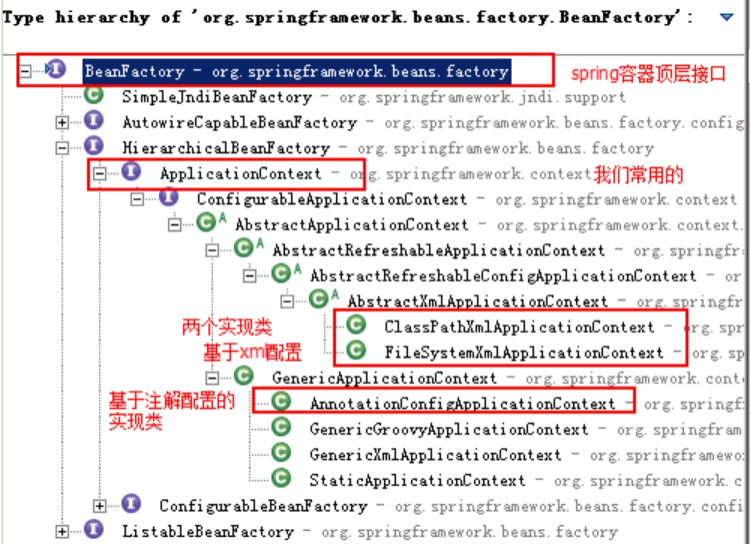
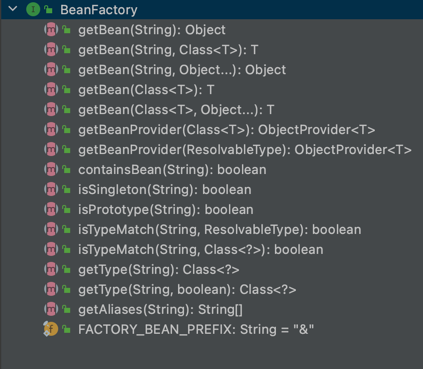
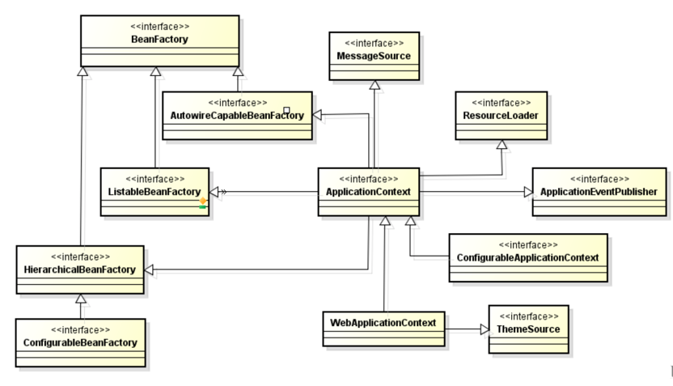
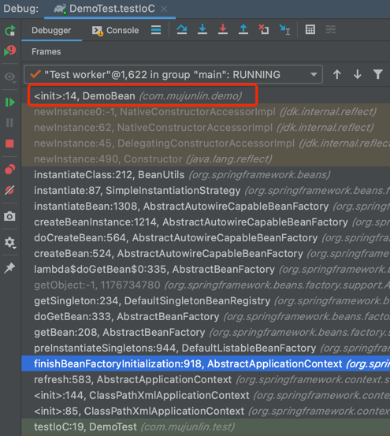

# Spring

## Spring IOC 应用

### 第一节 Spring IOC 基础

#### 1.1 BeanFactory与ApplicationContext区别

`BeanFactory` 是Spring框架中IoC容器的顶层接口,它只是用来定义一些基础功能,定义一些基础规范。 而 `ApplicationContext` 是它的一个子接口，所以 `ApplicationContext`
是具备 `BeanFactory` 提供的全部功能的。  
通常，我们称 `BeanFactory` 为 Spring IOC 的基础容器，`ApplicationContext` 是容器的高级接口，比 BeanFactory要拥有更多的功能， 比如说国际化支持和资源访问(xml，java配置类)
等等。



#### 1.2 XML 模式开发

引入 Spring 所需的基础依赖

```xml
<!-- https://mvnrepository.com/artifact/org.springframework/spring-context -->
<dependency>
    <groupId>org.springframework</groupId>
    <artifactId>spring-context</artifactId>
    <version>5.2.12.RELEASE</version>
</dependency>
```

`applicationContext.xml` 配置文件头

```xml
<?xml version="1.0" encoding="UTF-8"?>
<beans xmlns="http://www.springframework.org/schema/beans"
       xmlns:xsi="http://www.w3.org/2001/XMLSchema-instance"
       xsi:schemaLocation="http://www.springframework.org/schema/beans
        https://www.springframework.org/schema/beans/spring-beans.xsd">

</beans>
```

> xmlns : xml namespace 简称。
>
> 在命名空间后，可以为标签添加前缀。 如： `xmlns:aop`。使用该命名空间所定义的标签时，也需要添加前缀，如：`<aop:config ... />`

JAVA SE 方式：添加加载容器测试方法

```java
@Test
public void test101(){
    // 通过读取 classpath 下的 xml 文件来启动容器
    ApplicationContext applicationContext=new ClassPathXmlApplicationContext("classpath:applicationContext.xml");
    AccountDao accountDao=(AccountDao)applicationContext.getBean("accountDao");
    System.out.println(accountDao);
}
```

此时应该可以成功获取 `accountDao` Bean。

JAVA WEB 方式：

还需要先添加 `spring-web` 依赖

```xml
<!-- https://mvnrepository.com/artifact/org.springframework/spring-web -->
<dependency>
    <groupId>org.springframework</groupId>
    <artifactId>spring-web</artifactId>
    <version>5.2.12.RELEASE</version>
</dependency>
```

在 WEB-INF 文件夹中的 web.xml 文件中添加加载 `ApplicationContext` 的配置信息

```xml
<!--    2.配置 Spring IOC 容器的配置文件  -->
<context-param>
    <param-name>contextConfigLocation</param-name>
    <param-value>classpath:applicationContext.xml</param-value>
</context-param>

<!--  1.使用监听器启动 Spring IOC 容器  -->
<listener>
    <listener-class>org.springframework.web.context.ContextLoaderListener</listener-class>
</listener>
```

> 三大组件生命周期:
> 
> Listener：一直从程序启动到程序停止运行。
> 
> Filter：程序启动调用Filter的init()方法(永远只调用一次)，程序停止调用Filter的destroy()方法(永远只调用一次)，doFilter()方法每次的访问请求如果符合拦截条件都会调用
> 
> Servlet：程序第一次访问，会调用servlet的init()方法初始化(只执行一次)，每次程序执行都会根据请求调用doGet()或者doPost()方法，程序停止调用destroy()方法。

> web.xml中load-on-startup的作用
> 
> 如果值为正整数或者0时，表示容器在应用启动时就加载并初始化这个servlet，值越小，servlet的优先级越高，就越先被加载。值相同时，容器就会自己选择顺序来加载。

此时，在容器启动时，Spring 会将 Bean 添加到容器中。  
在 Servlet 中通过 Spring 提供的工具类 `WebApplicationContextUtils` 即可获取容器中的 Bean

```java
@Override
public void init() throws ServletException {
    WebApplicationContext webApplicationContext = WebApplicationContextUtils.getWebApplicationContext(this.getServletContext());
    proxyFactory = (ProxyFactory) webApplicationContext.getBean("proxyFactory");
    transferService = (TransferService) proxyFactory.getJdkProxy(webApplicationContext.getBean("transferService"));
}
```

##### 1.2.1 实例化 Bean 的三种方式

使用无参构造器

```xml
<bean id="connectionUtils" class="com.mujunlin.transfer.utils.ConnectionUtils"/>
```

静态方法

```java
public class CreateBeanFactory {
    
    public static ConnectionUtils getInstanceStatic() {
        return new ConnectionUtils();
    }
    
}
```

```xml
<bean id="connectionUtils" class="com.mujunlin.transfer.factory.CreateBeanFactory" factory-method="getInstanceStatic"/>
```

实例化方法

> 使用实例化方法, 与静态方法唯一的不同就是方法是非静态的，所以实例化 `Bean` 时，需要先创建工厂类的实例。

```java
public ConnectionUtils getInstance() {
    return new ConnectionUtils();
}
```

```xml
<bean id="createBeanFactory" class="com.mujunlin.transfer.factory.CreateBeanFactory"/>
<bean id="connectionUtils" factory-bean="createBeanFactory" factory-method="getInstance"/>
```

> 常用第一种方式。 第二、三种方式只有在通过 `XML` 方式配置起来非常麻烦的时候，可以考虑通过 `JAVA` 代码配置好。

##### 1.2.2 Bean 的作用范围和生命周期

在spring框架管理Bean对象的创建时，Bean对象默认都是单例的，但是它支持配置的方式改变作用范围。  
作用范围官方提供的说明如下表:  

Scope	| Description
--------|----------
singleton | (Default) Scopes a single bean definition to a single object instance for each Spring IoC container.
prototype | Scopes a single bean definition to any number of object instances.
request | Scopes a single bean definition to the lifecycle of a single HTTP request. That is, each HTTP request has its own instance of a bean created off the back of a single bean definition. Only valid in the context of a web-aware Spring ApplicationContext.
session | Scopes a single bean definition to the lifecycle of an HTTP Session. Only valid in the context of a web-aware Spring ApplicationContext.
application | Scopes a single bean definition to the lifecycle of a ServletContext. Only valid in the context of a web-aware Spring ApplicationContext.
websocket | Scopes a single bean definition to the lifecycle of a WebSocket. Only valid in the context of a web-aware Spring ApplicationContext.


singleton: 单例，IOC容器中只有一个该类对象。  
prototype: 原型，每次使用该类的对象（即调用 `getBean` 方法），都会返回一个新的对象。  

> 实际开发中用到最多的作用范围就是 `singleton` (单例模式), 少有 `prototype` (原型模式，也叫多例模式), 其他就更少了。

**不同作用范围的生命周期**

- 单例模式: singleton  
    对象出生:当创建容器时，对象就被创建了。   
    对象活着:只要容器在，对象一直活着。   
    对象死亡:当销毁容器时，对象就被销毁了。   
> 一句话总结:单例模式的bean对象生命周期与容器相同。 
- 多例模式: prototype  
    对象出生:当使用对象时，创建新的对象实例。  
    对象活着:只要对象在使用中，就一直活着。  
    对象死亡:当对象⻓时间不用时，被java的垃圾回收器回收了。  
> 一句话总结:多例模式的bean对象，spring框架只负责创建，不负责销毁。


##### 1.2.3 Bean 标签属性

在基于xml的IoC配置中，bean标签是最基础的标签。它表示了IoC容器中的一个对象。
换句话说，如果一个对象想让spring管理，在XML的配置中都需要使用此标签配置，Bean标签的属性如下:

属性 | 描述
------|------
id | 用于给bean提供一个唯一标识。在一个标签内部，标识必须唯一。
class|用于指定创建Bean对象的全限定类名。
name|用于给bean提供一个或多个名称。多个名称用空格分隔。
factory-bean|用于指定创建当前bean对象的工厂bean的唯一标识。当指定了此属性之后， class属性失效。
factory-method|用于指定创建当前bean对象的工厂方法，如配合factory-bean属性使用， 则class属性失效。如配合class属性使用，则方法必须是static的。
scope|用于指定bean对象的作用范围。通常情况下就是singleton。当要用到多例模式时，可以配置为prototype。
init-method|用于指定bean对象的初始化方法，此方法会在bean对象装配后调用。必须是一个无参方法。
destroy-method|用于指定bean对象的销毁方法，此方法会在bean对象销毁前执行。它只能为scope是singleton时起作用。

##### 1.2.4 DI 依赖注入的 XML 配置

**依赖注入分类**

按照注入的方式分类

- set方法注入: 它是通过类成员的set方法实现数据的注入。(使用最多的)

```java
private AccountDao accountDao;

public void setAccountDao(AccountDao accountDao) {
    this.accountDao = accountDao;
}
```  

```xml
<bean id="transferService" class="com.mujunlin.transfer.service.impl.TransferServiceImpl">
    <property name="AccountDao" ref="accountDao"/>
</bean>
```

> `ref` 属性用于传递 Bean，如果需要传递其他类型的参数，可以使用 `value` 属性

- 构造函数注入: 顾名思义，就是利用带参构造函数实现对类成员的数据赋值。 

```java
private AccountDao accountDao;

public TransferServiceImpl(AccountDao accountDao) {
    this.accountDao = accountDao;
}
```

```xml
<bean id="transferService" class="com.mujunlin.transfer.service.impl.TransferServiceImpl">
    <constructor-arg name="accountDao" ref="accountDao"/>
</bean>
```

> `constructor-arg` 标签还可以通过 `index` 属性传递参数，不过不方便。


按照注入的数据类型分类

- 基本类型和String ：注入的数据类型是基本类型或者是字符串类型的数据。  
- 其他Bean类型 ：注入的数据类型是对象类型。称为其他Bean的原因是，这个对象是要求出现在IoC容器中的。那么针对当前Bean来说，就是其他Bean了。  
- 复杂类型(集合类型) ：注入的数据类型是 `Array`，`List`，`Set`，`Map`，`Properties` 等类型。【应用场景较少】  

```java
private String[] strArr;
private Map<String, String> map;
private Set<String> set;
private Properties prop;

// 省略 setter ...

```

```xml
<property name="strArr">
    <array>
        <value>v1</value>
        <value>v2</value>
    </array>
</property>

<property name="map">
    <map>
        <entry key="k1" value="v1"/>
        <entry key="k2" value="v2"/>
    </map>
</property>

<property name="set">
    <set>
        <value>v1</value>
        <value>v2</value>
    </set>
</property>

<property name="prop">
    <props>
        <prop key="k1">v1</prop>
        <prop key="k2">v2</prop>
    </props>
</property>
```

> 其中 `Array` 和 `Set` 都是单值型集合，所以其实可以相互替换。  
> 同理，`Map` 和 `Properties` 都是键值对型的集合，所以也可以相互替换。  

#### 1.3 XML 与注解相结合模式开发

> 注意：  
> 1.实际企业开发中，纯xml模式使用已经很少了  
> 2.引入注解功能，不需要引入额外的jar   
> 3.XML+注解结合模式，XML 文件依然存在，所以，spring IOC容器的启动仍然从加载 XML 开始

**哪些bean的定义写在xml中，哪些bean的定义使用注解 ？**

第三方jar中的bean定义在 XML 中(如德鲁伊数据库连接池)，自己开发的 `Bean` 定义使用注解。

```xml
<!--  第三方 Jar 定义在 XML 中  -->
<bean id="dataSource" class="com.alibaba.druid.pool.DruidDataSource">
    <property name="driverClassName" value="com.mysql.cj.jdbc.Driver"/>
    <property name="url" value="jdbc:mysql://localhost:3306/bank"/>
    <property name="password" value="root"/>
    <property name="username" value="1234567890"/>
</bean>
```

**`XML`中标签与注解对照(IoC)**

xml形式|对应的注解形式
-------|------------
标签 | `@Component("accountDao")`，注解加在类上, `Bean` 的id属性内容直接配置在注解后面，如果不配置则默认定义个这个 `Bean` 的id为类名首字母小写; 另外，针对分层代码开发提供了 `@Componenet` 的三种别名 `@Controller`、 `@Service`、`@Repository` 分别用于控制层类、服务层类、dao层类的bean定义，这四个注解的用法完全一样，只是为了更清晰的区分而已。
标签的 `scope` 属性 | `@Scope("prototype")`，默认单例，注解加在类上
标签的 `init-method` 属性 | `@PostConstruct`，注解加在方法上，该方法就是初始化后调用的方法
标签的 `destroy-method` 属性 | `@PreDestroy`，注解加在方法上，该方法就是销毁前调用的方法

> 自己开发的 Bean 使用注解方式，都已经写了上万次了，就不在此做演示了。

**DI 依赖注入的注解实现**

- @Autowired(推荐使用)

  `@Autowired` 为Spring提供的注解，需要导入包 org.springframework.beans.factory.annotation.Autowired。  
  `@Autowired` 采取的策略为按照 *类型* 注入。
  
```java
// 如果使用 @Autowired 注解，最好使用构造注入【Spring 推荐】
private AccountDao accountDao;

@Autowired
public TransferServiceImpl(AccountDao accountDao) {
    this.accountDao = accountDao;
}
```

> 当一个类型有多个bean值的时候，会造成无法选择具体注入哪一个的情况， 这个时候我们需要配合着`@Qualifier`使用。  
> `@Qualifier`告诉Spring具体去装配哪个对象。这个时候我们就可以通过类型和名称定位到我们想注入的对象。  

- @Resource

  `@Resource` 注解由 J2EE 提供，需要导入包 javax.annotation.Resource。  
  `@Resource` 默认按照 ByName 自动注入。
  
```java
@Resource(name = "connectionUtils", type = ConnectionUtils.class)
private ConnectionUtils connectionUtils;
```
  
> 对于 `@Resource` :  
> 如果同时指定了 `name` 和 `type`，则从Spring上下文中找到唯一匹配的bean进行装配，找不到则抛出异常。  
> 如果指定了 `name`，则从上下文中查找名称(id)匹配的bean进行装配，找不到则抛出异常。  
> 如果指定了 `type`，则从上下文中找到类型匹配的唯一bean进行装配，找不到或是找到多个，都会抛出异常。   
> 如果既没有指定 `name`，又没有指定 `type`，则自动按照 `byName` 方式进行装配。  

**注意:**

`@Resource` 在 Jdk 11中已经移除，如果要使用，需要单独引入jar包。

```xml
<dependency>
    <groupId>javax.annotation</groupId>
  <artifactId>javax.annotation-api</artifactId>
    <version>1.3.2</version>
</dependency>
```


配置完依赖关系后，还需要配置注解扫描。

```xml
<context:component-scan base-package="com.mujunlin.transfer"/>
```

#### 1.4 纯注解模式

改造xm+注解模式，将xml中遗留的内容全部以注解的形式迁移出去，最终删除xml，从Java配置类启动

**注解对照**

注解|说明
---|---
`@Configuration` |表名当前类是一个配置类
`@ComponentScan` |替代 `context:component-scan`
`@PropertySource`|引入外部属性配置文件
`@Import`|引入其他配置类
`@Value`|对变量赋值，可以直接赋值，也可以使用 `${}` 读取资源配置文件中的信息 
`@Bean`|将方法返回对象加入 `Spring IOC` 容器

**注意**

如果是 WEB 应用，还需要在 `web.xml` 中配置使用注解的方式启动应用。

```xml
<!--  3.告诉 ContextLoaderListener 当前使用注解的方式启动 IOC 容器  -->
<context-param>
    <param-name>contextClass</param-name>
    <param-value>org.springframework.web.context.support.AnnotationConfigWebApplicationContext</param-value>
</context-param>
<!--    2.配置 Spring IOC 容器的配置文件  -->
<context-param>
    <param-name>contextConfigLocation</param-name>
    <param-value>com.mujunlin.transfer.SpringConfig</param-value>
</context-param>
<!--  1.使用监听器启动 Spring IOC 容器  -->
<listener>
    <listener-class>org.springframework.web.context.ContextLoaderListener</listener-class>
</listener>
```

### 第二节 Spring IOC 高级特性

#### 2.1 lazy-Init 延迟加载

`ApplicationContext` 容器的默认行为是在启动服务器时将所有 `Singleton` Bean提前进行实例化。
提前实例化意味着作为初始化过程的一部分，`ApplicationContext` 实例会创建并配置所有的  `Singleton` Bean。

```xml
<bean id="testBean" class="cn.mujunlin.LazyBean" />
<!--  上面的 Bean 定义等价于如下 Bean 定义  -->
<bean id="testBean" calss="cn.mujunlin.LazyBean" lazy-init="false" />
```

`lazy-init="false"` ，立即加载。表示在spring启动时，立刻进行实例化。  

如果不想让一个 `Singleton` Bean 在 `ApplicationContext` 初始化时被提前实例化，那么可以将 Bean 设置为延迟实例化。

```xml
<bean id="testBean" calss="cn.mujunlin.LazyBean" lazy-init="true" />
```

设置 `lazy-init="true"` 的 Bean 将不会在 `ApplicationContext` 启动时提前被实例化，而是第一次向容器通过 `getBean` 索取 Bean 时实例化。

**注意**

1. 如果一个设置了立即加载的 bean1，引用了一个延迟加载的 bean2 ，那么 bean1 在容器启动时被实例化，而 bean2 由于被 bean1 引用，所以也被实例化。
   这种情况也符合延时加载的 bean 在第一次调用时才被实例化的规则。
   
2. 如果一个 Bean 的 `scope` 属性为 `scope="prototype"` 时，即使设置了 `lazy-init="false"`，容器启动时也不会实例化Bean，
   而是调用 getBean 方法时实例化。
   
3. 在容器层次中通过在元素上使用 `default-lazy-init` 属性来控制延时初始化。

```xml
<beans default-lazy-init="true">
    <!-- no beans will be eagerly pre-instantiated... -->
</beans>
```

**应用场景**

1. 开启延迟加载一定程度提高容器启动和运转性能。【有点扯】

2. 对于不常使用的 Bean 设置延迟加载，这样偶尔使用的时候再加载，不必要从一开始该 Bean 就占用资源。【靠点谱】

#### 2.2 FactoryBean 和 BeanFactory

`BeanFactory` 接口是容器的顶级接口，定义了容器的一些基础行为，负责生产和管理Bean的一个工厂， 具体使用它下面的子接口类型，比如 `ApplicationContext`。

**FactoryBean**

Spring 中 Bean 有两种，一种是普通Bean，一种是工厂Bean(FactoryBean)，FactoryBean可以生成某一个类型的Bean实例，也就是说我们可以借助于它自定义Bean的创建过程。

> 与 Bean 创建的三种方式中的静态方法和实例化方法和FactoryBean作用类似，
> 但 FactoryBean 使用较多，尤其在 Spring 框架一些组件中会使用，还有其他框架和 Spring 框架整合时使用

接口源码如下：

```java
public interface FactoryBean<T> {
    
	String OBJECT_TYPE_ATTRIBUTE = "factoryBeanObjectType";

    /**
     * 返回FactoryBean创建的Bean实例，如果isSingleton返回true，
     * 则该实例会放到Spring容器的单例对象缓存池中。
     */
	@Nullable
	T getObject() throws Exception;

    /**
     * 返回FactoryBean创建的Bean类型
     */
	@Nullable
	Class<?> getObjectType();

    /**
     * 返回作用域是否单例
     */
	default boolean isSingleton() {
		return true;
	}

}
```

**使用测试**

创建一个用于生成 `Person` 对象的 `FactoryBean` 

```java
public class PersonFactoryBean implements FactoryBean<Person> {

    private String info;

    public void setInfo(String info) {
        this.info = info;
    }

    @Override
    public Person getObject() throws Exception {
        // 模拟构建复杂对象（假装这里很复杂吧...）
        Person person = new Person();
        String[] strings = info.split(",");
        person.setName(strings[0]);
        person.setAge(Integer.parseInt(strings[1]));
        return person;
    }

    @Override
    public Class<?> getObjectType() {
        return Person.class;
    }

    @Override
    public boolean isSingleton() {
        return true;
    }
}
```

在 `applicationContext.xml` 中配置这个 Bean 和依赖

```xml
<bean id="personBean" class="com.mujunlin.transfer.factory.PersonFactoryBean">
    <property name="info" value="John,20"/>
</bean>
```

测试获取 Bean

```java
ApplicationContext applicationContext = new ClassPathXmlApplicationContext("classpath:applicationContext.xml");
Object personBean = applicationContext.getBean("personBean");
System.out.println(personBean);
```

打印结果为: `Person(name=John, age=20)`

**注意**

如果需要获取 `PersonFactoryBean` 本身，不想获取通过工厂生产的 Bean。只需要在 `getBean` 方法的参数 `name` 前面加上 `&` 即可。

```java
Object personBean = applicationContext.getBean("&personBean");
```

打印结果为: `com.mujunlin.transfer.factory.PersonFactoryBean@51acdf2e`

#### 2.3 后置处理器

Spring提供了两种后处理bean的扩展接口，分别为 `BeanPostProcessor` 和 `BeanFactoryPostProcessor`，两者在使用上是有所区别的。

在 BeanFactory 初始化之后可以使用 `BeanFactoryPostProcessor` 进行后置处理做一些事情。

在Bean对象实例化(并不是Bean的整个生命周期完成)之后可以使用 `BeanPostProcessor` 进行后置处理做一些事情。

> 注意：对象不一定是 Spring Bean，而 Spring Bean 一定是个对象。

##### 2.3.1 BeanPostProcessor

`BeanPostProcessor` 是针对Bean级别的处理，可以针对某个具体的Bean.

接口源代码如下：

```java
public interface BeanPostProcessor {

	@Nullable
	default Object postProcessBeforeInitialization(Object bean, String beanName) throws BeansException {
		return bean;
	}

	@Nullable
	default Object postProcessAfterInitialization(Object bean, String beanName) throws BeansException {
		return bean;
	}

}
```

接口提供了两个方法，分别在Bean的初始化方法前和初始化方法后执行。

定义一个类实现了 `BeanPostProcessor`，默认是会对整个Spring容器中所有的bean进行处理。
如果要对具体的某个bean处理，可以通过方法参数判断，两个类型参数分别为 `Object` 和 `String` ，
第一个参数是每个bean的实例，第二个参数是每个bean的name或者id属性的值。所以我们可以通过第二个参数，来判断我们将要处理的具体的bean。

> 注意:处理是发生在Spring容器的实例化和依赖注入之后。

##### 2.3.2 BeanFactoryPostProcessor

BeanFactory级别的处理，是针对整个Bean的工厂进行处理。

典型应用是：`PropertyPlaceholderConfigurer`

调用 `BeanFactoryPostProcessor` 方法时，Bean还没有实例化，此时 Bean 刚被解析成 `BeanDefinition` 对象。

**BeanDefinition对象**:我们在 XML 中定义的 bean标签，Spring 解析 bean 标签成为一个 JavaBean， 这个JavaBean 就是 BeanDefinition。

## Spring IOC 源码剖析

阅读源码的原则

- 定焦原则:抓主线
- 宏观原则:站在上帝视⻆，关注源码结构和业务流程(淡化具体某行代码的编写细节)

读源码的方法和技巧

- 断点(观察调用栈)
- 反调(Find Usages)
- 经验(如：Spring框架中doXXX，一般是做具体处理的地方)

### 第一节 Spring IoC 容器初始化主体流程

#### 1.1 Spring 容器体系

IoC 容器是Spring的核心模块，是抽象了对象管理、依赖关系管理的框架解决方案。
Spring 提供了很多容器，其中 `BeanFactory` 是顶层容器(根容器)，不能被实例化，
*它定义了所有 IoC 容器必须遵从的一套原则*，具体的容器实现可以增加额外的功能，
比如我们常用到的 `ApplicationContext`，其下更具体的实现如 
`ClassPathXmlApplicationContext` 包含了解析 xml 等一系列的内容， 
`AnnotationConfigApplicationContext` 则是包含了注解解析等一系列的内容。

> 通常认为 IoC 容器就是 Map 而已，其实这是错误的理解。  
> 准确的来说 Map 只是 IoC 容器的一个成员，叫做单例池(`singletonObjects`)。  
> 容器是一组组件和过程的集合，包括 BeanFactory, 单例池, BeanPostProcessor 等, 以及这些组件间的协作。

Spring IoC 容器继承体系非常聪明，需要使用哪个层次用哪个层次即可，不必使用功能大而全的。

**BeanFactory 接口定义如下**



**BeanFactory 容器继承体系**



#### 1.2 Bean生命周期关键时机点

创建一个普通 Java Bean，实现 `InitializingBean` 接口。

```java
public class DemoBean implements InitializingBean {

	public DemoBean() {
		System.out.println("DemoBean 构造器方法 ... ");
	}

	@Override
	public void afterPropertiesSet() throws Exception {
		System.out.println("DemoBean afterPropertiesSet方法 ... ");
	}
}
```

再在容器中添加 `BeanFactoryPostProcessor` 和 `DemoBeanPostProcessor` 的自定义实现类。

```java
public class DemoBeanFactoryPostProcessor implements BeanFactoryPostProcessor {

	public DemoBeanFactoryPostProcessor() {
		System.out.println("BeanFactoryPostProcessor 实现类构造方法 ... ");
	}

	@Override
	public void postProcessBeanFactory(ConfigurableListableBeanFactory beanFactory) throws BeansException {
		System.out.println("BeanFactoryPostProcessor 实现类函数方法 postProcessBeanFactory 执行 ... ");
	}
}

public class DemoBeanPostProcessor implements BeanPostProcessor {

    public DemoBeanPostProcessor() {
        System.out.println("BeanPostProcessor 实现类构造方法 ... ");
    }

    @Override
    public Object postProcessBeforeInitialization(Object bean, String beanName) throws BeansException {
        if ("demoBean".equals(beanName)) {
            System.out.println("BeanPostProcessor 实现类 postProcessBeforeInitialization 方法执行 ... ");
        }
        return bean;
    }

    @Override
    public Object postProcessAfterInitialization(Object bean, String beanName) throws BeansException {
        if ("demoBean".equals(beanName)) {
            System.out.println("BeanPostProcessor 实现类 postProcessAfterInitialization 方法执行 ... ");
        }
        return bean;
    }
}
```

添加测试方法，从容器中获取 Bean 打印结果如下。

```shell
BeanFactoryPostProcessor 实现类构造方法 ... 
BeanFactoryPostProcessor 实现类函数方法 postProcessBeanFactory 执行 ... 
BeanPostProcessor 实现类构造方法 ... 
DemoBean 构造器方法 ... 
BeanPostProcessor 实现类 postProcessBeforeInitialization 方法执行 ... 
DemoBean afterPropertiesSet方法 ... 
BeanPostProcessor 实现类 postProcessAfterInitialization 方法执行 ... 
com.mujunlin.demo.DemoBean@1125777d
```

由此可以窥见 Bean 创建的简单过程。

通过Debug模式跟踪代码的执行流程，首先在 `DemoBean` 的构造方法处添加断点，
观察 Java Bean 的构造方法的执行调用栈



可以看到首先会调用 `AbstractApplicationContext#refresh` 方法，
然后调用 `AbstractApplicationContext#finishBeanFactoryInitialization` 方法，最终执行 Java Bean 的构造方法。

> 观察调用栈时，位置越靠上的地方在调用链上越接近断点方法位置。

同样的方式，可以看到各个主要节点的主要方法：

关键点|触发代码 
-----|-----
构造器 | refresh#finishBeanFactoryInitialization
BeanFactoryPostProcessor 初始化 | refresh#invokeBeanFactoryPostProcessors
BeanFactoryPostProcessor 方法调用 | refresh#invokeBeanFactoryPostProcessors
BeanPostProcessor 初始化 | refresh#registerBeanPostProcessors
BeanPostProcessor 方法(before + after)调用 | refresh#finishBeanFactoryInitialization

由上表不难看出，Bean 的生命节点的关键时机，都会通过 `AbstractApplicationContext#refresh` 方法，
可知此方法之重要。接下来，将着重分析 `refresh` 方法。

#### 1.3 Spring IoC容器初始化主流程

由上分析可知，Spring IoC 容器初始化的关键环节就在 `AbstractApplicationContext#refresh()` 方法中 ，
我们通过分析 `refresh` 方法来俯瞰容器创建的主体流程，主体流程下的具体子流程我们后面再来讨论。

> `refresh` 方法执行了容器启动的绝大多数方法，方法名之所以是这个，是因为 Spring 提供了接口可以刷新容器。

```java
public void refresh() throws BeansException, IllegalStateException {
	// 对象锁。通过 FindUsage 可知: refresh()、registerShutdownHook()、close() 不能并行执行
	synchronized (this.startupShutdownMonitor) {
		StartupStep contextRefresh = this.applicationStartup.start("spring.context.refresh");

		// Prepare this context for refreshing.
		// 刷新前的预处理：设置容器启动时间、设置开启状态、验证环境星系里一些必须存在的属性等。
		prepareRefresh();

		// Tell the subclass to refresh the internal bean factory.
		// 【重要】
		// 获取 BeanFactory (默认实现是 DefaultListableBeanFactory) 并设置 BeanFactory 的一些基本信息(如: allowCircularReferences, allowBeanDefinitionOverriding);
		// 加载 BeanDefinition 并注册到 BeanDefinitionRegistry (beanDefinitionMap 本质其实是 ConcurrentHashMap ) 中
		ConfigurableListableBeanFactory beanFactory = obtainFreshBeanFactory();

		// Prepare the bean factory for use in this context.
		// BeanFactory 前置处理：设置 BeanFactory 使用的其他 context 相关的信息
		prepareBeanFactory(beanFactory);

		try {
			// Allows post-processing of the bean factory in context subclasses.
			// BeanFactory 后置处理：并没有具体实现，是留作扩展使用 【👍🏻】
			postProcessBeanFactory(beanFactory);

			StartupStep beanPostProcess = this.applicationStartup.start("spring.context.beans.post-process");
			// Invoke factory processors registered as beans in the context.
			// 将实现了 BeanFactoryPostProcessor 的类加载到容器中实例化，并完成函数方法的调用
			invokeBeanFactoryPostProcessors(beanFactory);

			// Register bean processors that intercept bean creation.
			// 注册 BeanPostProcessor (Bean 的后置处理器)
			registerBeanPostProcessors(beanFactory);
			beanPostProcess.end();

			// Initialize message source for this context.
			// 国际化相关初始化[不重要]
			initMessageSource();

			// Initialize event multicaster for this context.
			// 初始化事件派发器[不重要]
			initApplicationEventMulticaster();

			// Initialize other special beans in specific context subclasses.
			// 容器刷新时的逻辑，没有默认实现，也是留给子类的扩展接口。
			onRefresh();

			// Check for listener beans and register them.
			// 注册实现了 ApplicationListener 接口的监听器
			registerListeners();

			// Instantiate all remaining (non-lazy-init) singletons.
			// 【核心关注】
			// 初始化所有剩下的非懒加载的单例Bean；创建这些 Bean 的实例(未设置属性)；填充属性
			// 初始化方法调用(如: afterPropertiesSet, init-method方法);调用 BeanPostProcessor 的后置(after)处理方法
			finishBeanFactoryInitialization(beanFactory);

			// Last step: publish corresponding event.
			// 最后一步：调用 LifecycleProcessor 的 onRefresh 方法，并且发布事件 (ContextRefreshedEvent)
			finishRefresh();
		} catch (BeansException ex) {
			// ...
		} finally {
			// ...
		}
	}
}
```

### 第二节 BeanFactory创建流程

BeanFactory 创建，此处其实指的是 `ConfigurableListableBeanFactory beanFactory = obtainFreshBeanFactory();` 这一行代码。
这一行代码，其实在实现中完成了两件事：

1. 获取 BeanFactory (默认实现是 DefaultListableBeanFactory) 并设置 BeanFactory 的一些基本信息(如: allowCircularReferences, allowBeanDefinitionOverriding);  
2. 加载 BeanDefinition 并注册到 BeanDefinitionRegistry 中

现在我们逐一分析。

#### 2.1 获取BeanFactory

```java
protected ConfigurableListableBeanFactory obtainFreshBeanFactory() {
	refreshBeanFactory();
	return getBeanFactory();
}
```

方法中只有两行代码。由方法名可以推断，`refreshBeanFactory` 方法应该是构建 BeanFactory 的，然后直接返回了构建好的 BeanFactory。源码如下：

```java
protected final void refreshBeanFactory() throws BeansException {
	// 判断是否有 Bean 工厂。
	if (hasBeanFactory()) {
		// 清空工厂中的 Bean
		destroyBeans();
		// 关闭 BeanFactory
		closeBeanFactory();
	}
	try {
		// 实例化 BeanFactory (里面其实就 new 了一个 DefaultListableBeanFactory)
		DefaultListableBeanFactory beanFactory = createBeanFactory();
		// 设置序列化ID
		beanFactory.setSerializationId(getId());
		// 自定义 Bean 工厂的一些属性（是否覆盖[id重复的情况下]、是否允许循环依赖）
		customizeBeanFactory(beanFactory);
        // 加载应用中的 BeanDefinition 【重要】
		loadBeanDefinitions(beanFactory);
		// 给当前 BeanFactory 赋值
		this.beanFactory = beanFactory;
	}
	catch (IOException ex) {
		throw new ApplicationContextException("I/O error parsing bean definition source for " + getDisplayName(), ex);
	}
}

public final ConfigurableListableBeanFactory getBeanFactory() {
    DefaultListableBeanFactory beanFactory = this.beanFactory;
    if (beanFactory == null) {
        throw new IllegalStateException("BeanFactory not initialized or already closed - " +
        "call 'refresh' before accessing beans via the ApplicationContext");
    }
    return beanFactory;
}
```

生产 BeanFactory 其实还是比较简单。其中，加载应用中的 BeanDefinition 流程相对比较复杂。

#### 2.2 BeanDefinition加载解析及注册

`BeanDefinition` 加载解析及注册在源代码上其实就是这一行代码： `loadBeanDefinitions(beanFactory);`。
进入到其具体实现 `AbstractXmlApplicationContext#loadBeanDefinitions` 方法当中，源码如下:

```java
@Override
protected void loadBeanDefinitions(DefaultListableBeanFactory beanFactory) throws BeansException, IOException {
	// Create a new XmlBeanDefinitionReader for the given BeanFactory.
	// 为指定的 BeanFactory 创建一个 XmlBeanDefinitionReader 用于读取解析 XML 对象
	XmlBeanDefinitionReader beanDefinitionReader = new XmlBeanDefinitionReader(beanFactory);

	// Configure the bean definition reader with this context's
	// resource loading environment.
	// 给生成的 DefinitionReader 设置资源环境加载相关的信息
	beanDefinitionReader.setEnvironment(this.getEnvironment());
	beanDefinitionReader.setResourceLoader(this);
	beanDefinitionReader.setEntityResolver(new ResourceEntityResolver(this));

	// Allow a subclass to provide custom initialization of the reader,
	// then proceed with actually loading the bean definitions.
	// 用于自定义初始化策略。提供给子类的扩展接口。(内部的实现几乎是空的，说几乎是因为不是完全没有代码，只是有一点点看不懂的状态设置的代码)
	initBeanDefinitionReader(beanDefinitionReader);
	// 然后继续去真正加载 Bean Definition s
	loadBeanDefinitions(beanDefinitionReader);
}

// 这些配置相关的代码都没有什么可看的，我们继续进入到真正加载 Bean Definition 的重载方法当中。
protected void loadBeanDefinitions(XmlBeanDefinitionReader reader) throws BeansException, IOException {
	// 是否被加载成 Resource 资源对象？
	Resource[] configResources = getConfigResources();
	if (configResources != null) {
		reader.loadBeanDefinitions(configResources);
	}
	// 如果没有被加载成资源对象，则走另外的分支
	String[] configLocations = getConfigLocations();
	if (configLocations != null) {
		reader.loadBeanDefinitions(configLocations);
	}
}
```

我们通过 XML 的方式加载的 ApplicationContext 一般来讲都会进入到第二个分支，我们继续分析第二个分支的代码。
进入到 `AbstractBeanDefinitionReader#loadBeanDefinitions` 方法当中，源代码如下：

```java
@Override
public int loadBeanDefinitions(String... locations) throws BeanDefinitionStoreException {
	Assert.notNull(locations, "Location array must not be null");
	int count = 0;
	// 如果有多个配置文件，便依次加载，并计数
	for (String location : locations) {
		count += loadBeanDefinitions(location);
	}
	return count;
}

// 继续进入重载方法
@Override
public int loadBeanDefinitions(String location) throws BeanDefinitionStoreException {
    return loadBeanDefinitions(location, null);
}

// 继续进入重载方法
public int loadBeanDefinitions(String location, @Nullable Set<Resource> actualResources) throws BeanDefinitionStoreException {
	// 获取资源加载器
	ResourceLoader resourceLoader = getResourceLoader();
	if (resourceLoader == null) {
		throw new BeanDefinitionStoreException(
				"Cannot load bean definitions from location [" + location + "]: no ResourceLoader available");
	}

	// 判断资源加载器的类型是否为 ResourcePatternResolver (用于处理XML, URL等不同类型资源文件的统一接口)
	if (resourceLoader instanceof ResourcePatternResolver) {
		// Resource pattern matching available.
		try {
			// 将资源文件加载为 Resource 对象
			Resource[] resources = ((ResourcePatternResolver) resourceLoader).getResources(location);
			// 加载资源中配置的 BeanDefinition 对象并返回计数
			int count = loadBeanDefinitions(resources);
			if (actualResources != null) {
				Collections.addAll(actualResources, resources);
			}
			if (logger.isTraceEnabled()) {
				logger.trace("Loaded " + count + " bean definitions from location pattern [" + location + "]");
			}
			return count;
		} catch (IOException ex) {
			throw new BeanDefinitionStoreException(
					"Could not resolve bean definition resource pattern [" + location + "]", ex);
		}
	} else {
		// Can only load single resources by absolute URL.
		// 只能处理单个绝对定位的 URL 资源文件
		Resource resource = resourceLoader.getResource(location);
		int count = loadBeanDefinitions(resource);
		if (actualResources != null) {
			actualResources.add(resource);
		}
		if (logger.isTraceEnabled()) {
			logger.trace("Loaded " + count + " bean definitions from location [" + location + "]");
		}
		return count;
	}
}

// 殊途同归。最终加载 BeanDefinition 的都是同一个重载方法
@Override
public int loadBeanDefinitions(Resource... resources) throws BeanDefinitionStoreException {
	Assert.notNull(resources, "Resource array must not be null");
	int count = 0;
	for (Resource resource : resources) {
		count += loadBeanDefinitions(resource);
	}
	return count;
}
```

继续进入，会进入到新的类 `XmlBeanDefinitionReader` 的同名方法当中。

```java
@Override
public int loadBeanDefinitions(Resource resource) throws BeanDefinitionStoreException {
	return loadBeanDefinitions(new EncodedResource(resource));
}

// 继续进入重载方法当中
public int loadBeanDefinitions(EncodedResource encodedResource) throws BeanDefinitionStoreException {
	Assert.notNull(encodedResource, "EncodedResource must not be null");
	if (logger.isTraceEnabled()) {
		logger.trace("Loading XML bean definitions from " + encodedResource);
	}

	Set<EncodedResource> currentResources = this.resourcesCurrentlyBeingLoaded.get();

	if (!currentResources.add(encodedResource)) {
		throw new BeanDefinitionStoreException(
				"Detected cyclic loading of " + encodedResource + " - check your import definitions!");
	}

	try (InputStream inputStream = encodedResource.getResource().getInputStream()) {
		InputSource inputSource = new InputSource(inputStream);
		if (encodedResource.getEncoding() != null) {
			inputSource.setEncoding(encodedResource.getEncoding());
		}
		// doXxx !!! 真正干活的来了。
		return doLoadBeanDefinitions(inputSource, encodedResource.getResource());
	}
	catch (IOException ex) {
		// ...
	}
	finally {
		// ...
	}
}

// 进入真正干活的方法当中
protected int doLoadBeanDefinitions(InputSource inputSource, Resource resource)
		throws BeanDefinitionStoreException {

	try {
		// 读取 XML 中的信息，将 XML 中的信息加载到 Document对象当中
		Document doc = doLoadDocument(inputSource, resource);
		// 解析 Document 对象成 BeanDefinition 并进行注册
		int count = registerBeanDefinitions(doc, resource);
		if (logger.isDebugEnabled()) {
			logger.debug("Loaded " + count + " bean definitions from " + resource);
		}
		return count;
	}
	// catch () {} * N (N 多异常处理。 严谨！ 👍🏻
}

// 继续进入注册方法当中
public int registerBeanDefinitions(Document doc, Resource resource) throws BeanDefinitionStoreException {
	BeanDefinitionDocumentReader documentReader = createBeanDefinitionDocumentReader();
	// 获取 Registry 中已有的 BeanDefinition 数量
	int countBefore = getRegistry().getBeanDefinitionCount();
	// 注册解析 BeanDefinition 并注册
	documentReader.registerBeanDefinitions(doc, createReaderContext(resource));
	// 返回解析当前 Document 对象所新注册的 BeanDefinition 的数量
	return getRegistry().getBeanDefinitionCount() - countBefore;
}
```

首尾的计数相关的代码都没有什么技术含量，我们重点关注：解析和注册。  
继续进入会进入到 `DefaultBeanDefinitionDocumentReader#registerBeanDefinitions` 当中，源码如下：

```java
@Override
public void registerBeanDefinitions(Document doc, XmlReaderContext readerContext) {
	this.readerContext = readerContext;
	doRegisterBeanDefinitions(doc.getDocumentElement());
}

// 继续进入
protected void doRegisterBeanDefinitions(Element root) {
	// Any nested <beans> elements will cause recursion in this method. In
	// order to propagate and preserve <beans> default-* attributes correctly,
	// keep track of the current (parent) delegate, which may be null. Create
	// the new (child) delegate with a reference to the parent for fallback purposes,
	// then ultimately reset this.delegate back to its original (parent) reference.
	// this behavior emulates a stack of delegates without actually necessitating one.
	BeanDefinitionParserDelegate parent = this.delegate;
	// 创建委托对象
	this.delegate = createDelegate(getReaderContext(), root, parent);

	if (this.delegate.isDefaultNamespace(root)) {
		String profileSpec = root.getAttribute(PROFILE_ATTRIBUTE);
		if (StringUtils.hasText(profileSpec)) {
			String[] specifiedProfiles = StringUtils.tokenizeToStringArray(
					profileSpec, BeanDefinitionParserDelegate.MULTI_VALUE_ATTRIBUTE_DELIMITERS);
			// We cannot use Profiles.of(...) since profile expressions are not supported
			// in XML config. See SPR-12458 for details.
			if (!getReaderContext().getEnvironment().acceptsProfiles(specifiedProfiles)) {
				if (logger.isDebugEnabled()) {
					logger.debug("Skipped XML bean definition file due to specified profiles [" + profileSpec +
							"] not matching: " + getReaderContext().getResource());
				}
				return;
			}
		}
	}

	// 空实现的扩展方法
	preProcessXml(root);
	// 真正解析 BeanDefinition 的
	parseBeanDefinitions(root, this.delegate);
	// 空实现的扩展方法
	postProcessXml(root);

	this.delegate = parent;
}

// 继续进入
protected void parseBeanDefinitions(Element root, BeanDefinitionParserDelegate delegate) {
	if (delegate.isDefaultNamespace(root)) {
		NodeList nl = root.getChildNodes();
		for (int i = 0; i < nl.getLength(); i++) {
			Node node = nl.item(i);
			if (node instanceof Element) {
				Element ele = (Element) node;
				if (delegate.isDefaultNamespace(ele)) {
					// 解析默认标签元素（如: bean）
					parseDefaultElement(ele, delegate);
				}
				else {
					// 解析自定义标签元素
					delegate.parseCustomElement(ele);
				}
			}
		}
	}
	else {
		delegate.parseCustomElement(root);
	}
}

// 继续进入默认元素解析当中
private void parseDefaultElement(Element ele, BeanDefinitionParserDelegate delegate) {
	// import 元素处理
	if (delegate.nodeNameEquals(ele, IMPORT_ELEMENT)) {
		importBeanDefinitionResource(ele);
	}
	// alias 元素处理
	else if (delegate.nodeNameEquals(ele, ALIAS_ELEMENT)) {
		processAliasRegistration(ele);
	}
	// bean 元素处理
	else if (delegate.nodeNameEquals(ele, BEAN_ELEMENT)) {
		processBeanDefinition(ele, delegate);
	}
	// 嵌套 beans 处理
	else if (delegate.nodeNameEquals(ele, NESTED_BEANS_ELEMENT)) {
		// recurse
		doRegisterBeanDefinitions(ele);
	}
}

// 继续进入此行的目的 bean 处理当中
protected void processBeanDefinition(Element ele, BeanDefinitionParserDelegate delegate) {
	// 此处并没有封装 BeanDefinition 而是生成了 BeanDefinitionHolder，而他内部持有一个 BeanDefinition。
	// 在此内部也就完成了 BeanDefinition 的封装，其实里面也就是俗套的解析 Element 对象
	// 并 new 一个 GenericBeanDefinition 然后给这个对象赋值，并放到 dbHolder 当中
	BeanDefinitionHolder bdHolder = delegate.parseBeanDefinitionElement(ele);
	if (bdHolder != null) {
		// 如果有自定义标签则处理自定义标签
		bdHolder = delegate.decorateBeanDefinitionIfRequired(ele, bdHolder);
		try {
			// Register the final decorated instance.
			// 完成最终的装饰实例(BeanDefinition) 的注册
			BeanDefinitionReaderUtils.registerBeanDefinition(bdHolder, getReaderContext().getRegistry());
		}
		catch (BeanDefinitionStoreException ex) {
			getReaderContext().error("Failed to register bean definition with name '" +
					bdHolder.getBeanName() + "'", ele, ex);
		}
		// Send registration event.
		getReaderContext().fireComponentRegistered(new BeanComponentDefinition(bdHolder));
	}
}
```

封装完 BeanDefinition 之后，我们继续来关注注册的流程。来到 `BeanDefinitionReaderUtils#registerBeanDefinition` 方法当中。

```java
public static void registerBeanDefinition(
		BeanDefinitionHolder definitionHolder, BeanDefinitionRegistry registry)
		throws BeanDefinitionStoreException {

	// Register bean definition under primary name.
	String beanName = definitionHolder.getBeanName();
	// 看名字也知道是在这里完成注册
	registry.registerBeanDefinition(beanName, definitionHolder.getBeanDefinition());

	// Register aliases for bean name, if any.
	String[] aliases = definitionHolder.getAliases();
	if (aliases != null) {
		for (String alias : aliases) {
			registry.registerAlias(beanName, alias);
		}
	}
}
```

再进入到 `DefaultListableBeanFactory#registerBeanDefinition` 方法当中，
可以看到：其实所谓的注册，也无非就是做一堆判断然后将 BeanDefinition 信息放入到Map当中：
`this.beanDefinitionMap.put(beanName, beanDefinition)`。  

到此，注册流程结束。


### 第三节 Bean创建流程

由前面的分析可知，Bean 的创建是在 `AbstractApplicationContext#finishBeanFactoryInitialization` 这一样代码处执行的。
我们进入到此方法当中，源代码如下：

```java
protected void finishBeanFactoryInitialization(ConfigurableListableBeanFactory beanFactory) {
	// Initialize conversion service for this context.
	// BeanFactory 中是否包含类型转换的 Bean
	if (beanFactory.containsBean(CONVERSION_SERVICE_BEAN_NAME) &&
			beanFactory.isTypeMatch(CONVERSION_SERVICE_BEAN_NAME, ConversionService.class)) {
		beanFactory.setConversionService(
				beanFactory.getBean(CONVERSION_SERVICE_BEAN_NAME, ConversionService.class));
	}

	// Register a default embedded value resolver if no BeanFactoryPostProcessor
	// (such as a PropertySourcesPlaceholderConfigurer bean) registered any before:
	// at this point, primarily for resolution in annotation attribute values.
	if (!beanFactory.hasEmbeddedValueResolver()) {
		beanFactory.addEmbeddedValueResolver(strVal -> getEnvironment().resolvePlaceholders(strVal));
	}

	// Initialize LoadTimeWeaverAware beans early to allow for registering their transformers early.
	String[] weaverAwareNames = beanFactory.getBeanNamesForType(LoadTimeWeaverAware.class, false, false);
	for (String weaverAwareName : weaverAwareNames) {
		getBean(weaverAwareName);
	}

	// Stop using the temporary ClassLoader for type matching.
	beanFactory.setTempClassLoader(null);

	// Allow for caching all bean definition metadata, not expecting further changes.
	beanFactory.freezeConfiguration();

	// Instantiate all remaining (non-lazy-init) singletons.
	// 将所有剩余的非懒加载的单例Bean实例化
	beanFactory.preInstantiateSingletons();
}
```

进入最后一行代码当中，来到 `DefaultListableBeanFactory#preInstantiateSingletons` 方法，源代码如下：

```java
@Override
public void preInstantiateSingletons() throws BeansException {
	if (logger.isTraceEnabled()) {
		logger.trace("Pre-instantiating singletons in " + this);
	}

	// Iterate over a copy to allow for init methods which in turn register new bean definitions.
	// While this may not be part of the regular factory bootstrap, it does otherwise work fine.
	// 存放所有的 Bean 名称，即是 Bean 的 id
	List<String> beanNames = new ArrayList<>(this.beanDefinitionNames);

	// Trigger initialization of all non-lazy singleton beans...
	for (String beanName : beanNames) {
		// 合并父 BeanDefinition
		RootBeanDefinition bd = getMergedLocalBeanDefinition(beanName);
		// 非抽象、且单例、且非延迟加载
		if (!bd.isAbstract() && bd.isSingleton() && !bd.isLazyInit()) {
			if (isFactoryBean(beanName)) {
				// 如果是工厂 Bean 获取 Bean 的时候就加上前缀 "&"
				Object bean = getBean(FACTORY_BEAN_PREFIX + beanName);
				if (bean instanceof FactoryBean) {
					FactoryBean<?> factory = (FactoryBean<?>) bean;
					boolean isEagerInit;
					if (System.getSecurityManager() != null && factory instanceof SmartFactoryBean) {
						isEagerInit = AccessController.doPrivileged(
								(PrivilegedAction<Boolean>) ((SmartFactoryBean<?>) factory)::isEagerInit,
								getAccessControlContext());
					}
					else {
						isEagerInit = (factory instanceof SmartFactoryBean &&
								((SmartFactoryBean<?>) factory).isEagerInit());
					}
					if (isEagerInit) {
						getBean(beanName);
					}
				}
			}
			else {
				// 普通 Bean 则直接获取
				getBean(beanName);
			}
		}
	}

	// Trigger post-initialization callback for all applicable beans...
	// balabala ... 暂时看不懂的东西
}
```

> 在判断是否为工厂类时，调用了 `AbstractBeanFactory#isFactoryBean(java.lang.String)` 方法。
> 其中调用了方法： `java.lang.Class#isAssignableFrom`, 在此将此方法与 instanceof 关键字做比较：
> - isAssignableFrom()方法是从类继承的角度去判断；instanceof关键字是从实例继承的角度去判断。
> - isAssignableFrom()方法是判断是否为某个类的父类；instanceof关键字是判断是否某个类的子类。

无论是否工厂类，最终都调用了 `getBean` 方法，继续进入到 `AbstractBeanFactory#getBean` 当中，源码如下：

```java
@Override
public Object getBean(String name) throws BeansException {
    // doXxx !!! 真正干活的来了。
	return doGetBean(name, null, null, false);
}

// 进入到真正干活的方法当中
protected <T> T doGetBean(
		String name, @Nullable Class<T> requiredType, @Nullable Object[] args, boolean typeCheckOnly)
		throws BeansException {

	// 转换BeanName：如果以 & 开头的，则去掉前缀；如果是别名的，则获取到 Bean 的真实名字
	String beanName = transformedBeanName(name);
	Object beanInstance;

	// Eagerly check singleton cache for manually registered singletons.
	// 尝试从单例池(singletonObjects)中通过 BeanName 获取 Bean
	Object sharedInstance = getSingleton(beanName);
	// 如果获取成功,则直接返回
	if (sharedInstance != null && args == null) {
		if (logger.isTraceEnabled()) {
			if (isSingletonCurrentlyInCreation(beanName)) {
				logger.trace("Returning eagerly cached instance of singleton bean '" + beanName +
						"' that is not fully initialized yet - a consequence of a circular reference");
			}
			else {
				logger.trace("Returning cached instance of singleton bean '" + beanName + "'");
			}
		}
		// 针对 FactoryBean 【具体的其实看的不是很懂】
		beanInstance = getObjectForBeanInstance(sharedInstance, name, beanName, null);
	}

	else {
		// Fail if we're already creating this bean instance:
		// We're assumably within a circular reference.
		// 以防已经创建过 Bean 实例，所以如果是 Prototype 类型或者有循环依赖，都直接抛出异常
		if (isPrototypeCurrentlyInCreation(beanName)) {
			throw new BeanCurrentlyInCreationException(beanName);
		}

		// Check if bean definition exists in this factory.
		// 检查工厂中是否有这个 BeanDefinition
		BeanFactory parentBeanFactory = getParentBeanFactory();
		if (parentBeanFactory != null && !containsBeanDefinition(beanName)) {
			// Not found -> check parent.
		}

		if (!typeCheckOnly) {
			markBeanAsCreated(beanName);
		}

		StartupStep beanCreation = this.applicationStartup.start("spring.beans.instantiate")
				.tag("beanName", name);
		try {
			if (requiredType != null) {
				beanCreation.tag("beanType", requiredType::toString);
			}
			// 合并父子 Bean 的属性
			RootBeanDefinition mbd = getMergedLocalBeanDefinition(beanName);
			checkMergedBeanDefinition(mbd, beanName, args);

			// Guarantee initialization of beans that the current bean depends on.
			// 处理 dependsOn 配置 (可以指定 Bean A 在创建之前,先创建 Bean B)
			String[] dependsOn = mbd.getDependsOn();
			if (dependsOn != null) {
				for (String dep : dependsOn) {
					// ... 
				}
			}

			// Create bean instance.
			// 🌟 创建单例 Bean
			if (mbd.isSingleton()) {
				sharedInstance = getSingleton(beanName, () -> {
					try {
						return createBean(beanName, mbd, args);
					}
					catch (BeansException ex) {
						// Explicitly remove instance from singleton cache: It might have been put there
						// eagerly by the creation process, to allow for circular reference resolution.
						// Also remove any beans that received a temporary reference to the bean.
						destroySingleton(beanName);
						throw ex;
					}
				});
				beanInstance = getObjectForBeanInstance(sharedInstance, name, beanName, mbd);
			}

			else if (mbd.isPrototype()) {
				// It's a prototype -> create a new instance.
				Object prototypeInstance = null;
				try {
					beforePrototypeCreation(beanName);
					prototypeInstance = createBean(beanName, mbd, args);
				}
				finally {
					afterPrototypeCreation(beanName);
				}
				beanInstance = getObjectForBeanInstance(prototypeInstance, name, beanName, mbd);
			}

			else {
				// 我们当前只关注 单例 和 原型两种类型的 Bean，其他的暂时忽略
			}
		}
		catch (BeansException ex) {
			beanCreation.tag("exception", ex.getClass().toString());
			beanCreation.tag("message", String.valueOf(ex.getMessage()));
			cleanupAfterBeanCreationFailure(beanName);
			throw ex;
		}
		finally {
			beanCreation.end();
		}
	}

	return adaptBeanInstance(name, beanInstance, requiredType);
}
```

继续进入到 `DefaultSingletonBeanRegistry#getSingleton` 方法当中

```java
public Object getSingleton(String beanName, ObjectFactory<?> singletonFactory) {
	Assert.notNull(beanName, "Bean name must not be null");
	synchronized (this.singletonObjects) {
		// 再试试单例池当中有没有
		Object singletonObject = this.singletonObjects.get(beanName);
		// 如果仍然没有，则继续；否则直接返回
		if (singletonObject == null) {
			// 是否正在销毁？抛出异常：继续
			if (this.singletonsCurrentlyInDestruction) {
				throw new BeanCreationNotAllowedException(beanName,
						"Singleton bean creation not allowed while singletons of this factory are in destruction " +
						"(Do not request a bean from a BeanFactory in a destroy method implementation!)");
			}
			if (logger.isDebugEnabled()) {
				logger.debug("Creating shared instance of singleton bean '" + beanName + "'");
			}
			// 单例对象创建前：标识一下该 Bean 正在被创建(其实就是往 `singletonsCurrentlyInCreation` 这个Set集合中加入当前 Bean Name)。
			// 因为创建过程复杂，步骤很多，需要这么个标识
			beforeSingletonCreation(beanName);
			boolean newSingleton = false;
			boolean recordSuppressedExceptions = (this.suppressedExceptions == null);
			if (recordSuppressedExceptions) {
				this.suppressedExceptions = new LinkedHashSet<>();
			}
			try {
				// singletonFactory 是通过参数传入的。
				// 这个参数是一个函数式接口，其实现就是调用方法时传入的 createBean(beanName, mbd, args);
				singletonObject = singletonFactory.getObject();
				newSingleton = true;
			}
			catch (IllegalStateException ex) {
				// ...
			} catch (BeanCreationException ex) {
				// ...
			}
			finally {
				if (recordSuppressedExceptions) {
					this.suppressedExceptions = null;
				}
				afterSingletonCreation(beanName);
			}
			if (newSingleton) {
				addSingleton(beanName, singletonObject);
			}
		}
		return singletonObject;
	}
}
```

我们继续进入到 `AbstractAutowireCapableBeanFactory#createBean` 方法当中

```java
@Override
protected Object createBean(String beanName, RootBeanDefinition mbd, @Nullable Object[] args)
		throws BeanCreationException {

	if (logger.isTraceEnabled()) {
		logger.trace("Creating instance of bean '" + beanName + "'");
	}
	RootBeanDefinition mbdToUse = mbd;

	// Make sure bean class is actually resolved at this point, and
	// clone the bean definition in case of a dynamically resolved Class
	// which cannot be stored in the shared merged bean definition.
	Class<?> resolvedClass = resolveBeanClass(mbd, beanName);
	if (resolvedClass != null && !mbd.hasBeanClass() && mbd.getBeanClassName() != null) {
		mbdToUse = new RootBeanDefinition(mbd);
		mbdToUse.setBeanClass(resolvedClass);
	}

	// Prepare method overrides.
	try {
		mbdToUse.prepareMethodOverrides();
	}
	catch (BeanDefinitionValidationException ex) { // ... }

	try {
		// Give BeanPostProcessors a chance to return a proxy instead of the target bean instance.
		Object bean = resolveBeforeInstantiation(beanName, mbdToUse);
		if (bean != null) {
			return bean;
		}
	} catch (Throwable ex) { // ... }

	try {
		// 🌟 doXxx !!! 真正干活的来了
		Object beanInstance = doCreateBean(beanName, mbdToUse, args);
		if (logger.isTraceEnabled()) {
			logger.trace("Finished creating instance of bean '" + beanName + "'");
		}
		return beanInstance;
	}
	catch (BeanCreationException | ImplicitlyAppearedSingletonException ex) { // ... }
	catch (Throwable ex) { // ... }
}

// 进入到真正干活的方法当中

```


```java
protected Object doCreateBean(String beanName, RootBeanDefinition mbd, @Nullable Object[] args)
		throws BeanCreationException {

	// Instantiate the bean.
	BeanWrapper instanceWrapper = null;
	if (mbd.isSingleton()) {
		instanceWrapper = this.factoryBeanInstanceCache.remove(beanName);
	}
	if (instanceWrapper == null) {
		// 创建 Bean 实例 (仅仅是简单调用了无参构造，并未设置属性)
		instanceWrapper = createBeanInstance(beanName, mbd, args);
	}
	Object bean = instanceWrapper.getWrappedInstance();
	Class<?> beanType = instanceWrapper.getWrappedClass();
	if (beanType != NullBean.class) {
		mbd.resolvedTargetType = beanType;
	}

	// Allow post-processors to modify the merged bean definition.
	synchronized (mbd.postProcessingLock) {
		if (!mbd.postProcessed) {
			// 合并 Bean Definition 的后置处理器信息 ...
			mbd.postProcessed = true;
		}
	}

	// Eagerly cache singletons to be able to resolve circular references
	// even when triggered by lifecycle interfaces like BeanFactoryAware.
	boolean earlySingletonExposure = (mbd.isSingleton() && this.allowCircularReferences &&
			isSingletonCurrentlyInCreation(beanName));
	if (earlySingletonExposure) {
		// 处理循环依赖相关 ... 
	}

	// Initialize the bean instance.
	Object exposedObject = bean;
	try {
		// 填充 Bean 属性(如：处理自动装配)
		populateBean(beanName, mbd, instanceWrapper);
		// 触发 xxAware 方法调用、获取 BeanPostProcessors 并触发 before 方法调用、init-method 方法调用、获取 BeanPostProcessors 并触发 after 方法调用
		exposedObject = initializeBean(beanName, exposedObject, mbd);
	}
	catch (Throwable ex) {
		if (ex instanceof BeanCreationException && beanName.equals(((BeanCreationException) ex).getBeanName())) {
			throw (BeanCreationException) ex;
		}
		else {
			throw new BeanCreationException(
					mbd.getResourceDescription(), beanName, "Initialization of bean failed", ex);
		}
	}

	if (earlySingletonExposure) {
		// 应该还是处理循环依赖
	}

	// Register bean as disposable.
	try {
		registerDisposableBeanIfNecessary(beanName, bean, mbd);
	}
	catch (BeanDefinitionValidationException ex) {
		throw new BeanCreationException(
				mbd.getResourceDescription(), beanName, "Invalid destruction signature", ex);
	}

	return exposedObject;
}
```

到此，Bean 创建的生命周期完成。

### 第四节 lazy-init 延迟加载机制原理

普通 Bean 的初始化是在容器启动初始化阶段执行的，
而被 lazy-init=true 修饰的 bean 则是在从容器里第一次进行 context.getBean() 时进行触发。  

Spring 启动的时候会把所有 Bean 信息(包括XML和注解)解析转化成 Spring 能够识别的 BeanDefinition，
并存到 Hashmap(beanDefinitionMap) 里供下面的初始化时用，
然后对每个 BeanDefinition 进行处理，如果是懒加载的则在容器初始化阶段不处理，其他的则在容器初始化阶段进行初始化并依赖注入。

因为在 `DefaultListableBeanFactory#preInstantiateSingletons` 当中添加了 `!bd.isLazyInit()` 的条件判断，
满足则继续实例化并缓存 Bean，否则将不做任何处理。懒加载的 Bean 在容器初始化阶段不做实例化并缓存的处理，就此完成。

调用 getBean 方法时，会进入 `AbstractBeanFactory#doGetBean`。 如果是普通 Bean，此时单例池中已经有实例可用，会直接返回。
如果是 lazy-init 的Bean，此时会通过和普通 Bean 创建同样的逻辑实例化 Bean 并返回。

- 对于被修饰为lazy-init的 Bean, Spring 容器初始化阶段不会进行 init 并且依赖注入，当第一次进行 getBean 时候才进行初始化并依赖注入 。
- 对于非懒加载的 Bean，getBean 的时候会从缓存里头获取，因为容器初始化阶段 Bean 已经初始化完成并缓存到了单例池(`singletonObjects`)中。

### 第五节 Spring IoC循环依赖问题

#### 5.1 什么是循环依赖

循环依赖其实就是循环引用，也就是两个或者两个以上的 Bean 互相持有对方，最终形成闭环。  
比如A 依赖于B，B依赖于C，C又依赖于A。

> 注意：这里不是函数的循环调用，是对象的相互依赖关系。循环调用其实就是一个死循环，除非有终结条件。

Spring中循环依赖场景有: 

- 构造器的循环依赖(构造器注入)
- Field 属性的循环依赖(set注入)

其中，构造器的循环依赖问题无法解决，只能拋出 BeanCurrentlyInCreationException 异常；
在解决属性循环依赖时，Spring 采用的是提前暴露对象的方法。

**循环依赖解决**

无法解决：

- 单例 singleton bean 构造器参数循环依赖(无法解决) 
- 原型 prototype bean 循环依赖(无法解决)

可以解决：

- 单例bean通过setXxx或者@Autowired进行循环依赖

#### 5.2 循环依赖处理机制

Spring 的循环依赖的理论依是 Java 的引用传递。
当获得对象的引用时，对象的属性是可以延后设置的，但是构造器必须是在获取引用之前。

Spring 通过 setXxx 或者 @Autowired 方法解决循环依赖，其实是通过提前暴露一个 ObjectFactory 对象来完成的。
简单来说 ClassA 在调用构造器完成对象初始化之后，在调用 ClassA 的 setClassB 方法之前就把 ClassA 实例化的对象通过 ObjectFactory 提前暴露到Spring容器中。

如：现有 ClassA 依赖于 ClassB，ClassB 又依赖于 ClassA。  
ClassA 实例化时，调用完构造方法后将自己放到三级缓存中。
在设值时发现依赖于 ClassB，此时可以去三级缓存中获取尚未完成设值的 BeanA，同时将 BeanA 升级到二级缓存中。
BeanB 创建完成后，会放入一级缓存(singletonObjects)。BeanA 再从一级缓存中获取 BeanB 完成设值。

> 感觉上，只需要二级缓存就够了。这样设计，是因为在从三级缓存向二级缓存升级的时候，还可以通过扩展接口添加其他操作。

现在我们进入源码：

在 `AbstractAutowireCapableBeanFactory#doCreateBean` 方法当中, 执行完 Bean 初始化构建(简单执行构造方法)后，有如下代码：

```java
// Eagerly cache singletons to be able to resolve circular references
// even when triggered by lifecycle interfaces like BeanFactoryAware.
boolean earlySingletonExposure = (mbd.isSingleton() && this.allowCircularReferences &&
		isSingletonCurrentlyInCreation(beanName));
if (earlySingletonExposure) {
	if (logger.isTraceEnabled()) {
		logger.trace("Eagerly caching bean '" + beanName +
				"' to allow for resolving potential circular references");
	}
	addSingletonFactory(beanName, () -> getEarlyBeanReference(beanName, mbd, bean));
}
```

在此段代码中，如果是单例Bean、允许循环依赖、而且正在构建中，则会将 Bean 添加到三级缓存(singletonFactory)当中，
其代码实现 `DefaultSingletonBeanRegistry#addSingletonFactory` 也很简单：

```java
protected void addSingletonFactory(String beanName, ObjectFactory<?> singletonFactory) {
	Assert.notNull(singletonFactory, "Singleton factory must not be null");
	synchronized (this.singletonObjects) {
		if (!this.singletonObjects.containsKey(beanName)) {
			this.singletonFactories.put(beanName, singletonFactory);
			this.earlySingletonObjects.remove(beanName);
			this.registeredSingletons.add(beanName);
		}
	}
}
```

BeanA 初始化构建完成并加入三级缓存中以后，对BeanB的依赖体现在 BeanB 是 BeanA 的属性，
所以处理依赖问题，实际上就在设置属性的代码中。我们继续观察设置属性的代码：

```java
protected void populateBean(String beanName, RootBeanDefinition mbd, @Nullable BeanWrapper bw) {
    
    // ... 这里有一大段代码，但是与我们此行无关，我们直接进入最后一行的代码当中

	if (pvs != null) {
		applyPropertyValues(beanName, mbd, bw, pvs);
	}
}
```

进入到 `AbstractAutowireCapableBeanFactory#applyPropertyValues` 方法当中，可以看到如下代码：

```java
String propertyName = pv.getName();
Object originalValue = pv.getValue();
if (originalValue == AutowiredPropertyMarker.INSTANCE) {
	Method writeMethod = bw.getPropertyDescriptor(propertyName).getWriteMethod();
	if (writeMethod == null) {
		throw new IllegalArgumentException("Autowire marker for property without write method: " + pv);
	}
	originalValue = new DependencyDescriptor(new MethodParameter(writeMethod, 0), true);
}
// 处理依赖
Object resolvedValue = valueResolver.resolveValueIfNecessary(pv, originalValue);
Object convertedValue = resolvedValue;
```

进入处理依赖的方法 `BeanDefinitionValueResolver#resolveValueIfNecessary` 当中，会进入如下分支：

```java
// We must check each value to see whether it requires a runtime reference
// to another bean to be resolved.
if (value instanceof RuntimeBeanReference) {
	RuntimeBeanReference ref = (RuntimeBeanReference) value;
	return resolveReference(argName, ref);
}
```

继续进入 `BeanDefinitionValueResolver#resolveReference` 当中，可以发现这个方法返回的 Object 都是通过 
`AbstractBeanFactory#getBean(java.lang.String)` 方法返回的。而这个方法，我们已经相当熟悉了。

```java
@Override
public Object getBean(String name) throws BeansException {
	// doXxx !!! 真正干活的来了。
	return doGetBean(name, null, null, false);
}
```

此时，通过调用 `getBean` 方法，获取BeanA所依赖的BeanB。

和 BeanA 一样，在给 BeanB 设值的时候，会发现在 BeanB 同样依赖 BeanA，又回经过同样的流程进入到此地。

带着新的关注点，进入熟悉的方法当中。这一次我们首先关注这一行代码：

```java
// Eagerly check singleton cache for manually registered singletons.
// 尝试从单例池(singletonObjects)中通过 BeanName 获取 Bean
Object sharedInstance = getSingleton(beanName);
```

进入其实现 `DefaultSingletonBeanRegistry#getSingleton(java.lang.String, boolean)` 中

```java
@Nullable
protected Object getSingleton(String beanName, boolean allowEarlyReference) {
	// Quick check for existing instance without full singleton lock
	Object singletonObject = this.singletonObjects.get(beanName);
	if (singletonObject == null && isSingletonCurrentlyInCreation(beanName)) {
		singletonObject = this.earlySingletonObjects.get(beanName);
		if (singletonObject == null && allowEarlyReference) {
			synchronized (this.singletonObjects) {
				// Consistent creation of early reference within full singleton lock
				singletonObject = this.singletonObjects.get(beanName);
				if (singletonObject == null) {
					singletonObject = this.earlySingletonObjects.get(beanName);
					if (singletonObject == null) {
						ObjectFactory<?> singletonFactory = this.singletonFactories.get(beanName);
						if (singletonFactory != null) {
							singletonObject = singletonFactory.getObject();
							this.earlySingletonObjects.put(beanName, singletonObject);
							this.singletonFactories.remove(beanName);
						}
					}
				}
			}
		}
	}
	return singletonObject;
}
```

> 通过此处的代码，我们也可以看出，为什么我们称 `singletonObjects` 为一级缓存、
> `earlySingletonObjects` 为二级缓存，`singletonFactories` 为三级缓存。

通过此方法，BeanB 会获取到多依赖的(未成形的) BeanA。BeanB 设值完成后会将其放入一级缓存中：

DefaultSingletonBeanRegistry#addSingleton 源代码如下：

```java
protected void addSingleton(String beanName, Object singletonObject) {
	synchronized (this.singletonObjects) {
		this.singletonObjects.put(beanName, singletonObject);
		this.singletonFactories.remove(beanName);
		this.earlySingletonObjects.remove(beanName);
		this.registeredSingletons.add(beanName);
	}
}
```

BeanB 构建组装完成后，BeanA 也可以顺利完成装配并升级到一级缓存中。


*********************************************************************

## Spring AOP 应用

> AOP 本质：在不改变原有业务逻辑的情况下增强横切逻辑。
> 使用场景：横切逻辑代码往往是权限校验代码、日志代码、事务控制代码、性能监控代码。

### 第一节 AOP 相关术语

为什么叫做面向切面编程？
如果把软件流程必做瀑布的话，像权限校验、事务的开启和提交等这些功能，是每一个功能都需要的。而且都是在核心功能的前后。
把每个核心功能的这些外围功能连接起来的话，就像是被切开了一样。

有些书上说，面向切面编程弥补了面向对象编程的不足，如何理解？
因为面向对象编程的特点是：封装、继承、多态。我的理解是核心还是继承，各个类的交互是通过父子继承关系，这样也就像瀑布一样自上而下。
当需要在一堆不相关的类的指定位置添加统一的功能，这样就无能为力了。而这，恰好是AOP的专长。

**AOP术语**

名词|描述
----|----
JoinPoint(连接点)|它指的是那些可以用于把增强代码加入到业务主线中的点，这些点指的就是方法。在方法执行的前后通过动态代理技术加入增强的代码。在Spring框架AOP思想的技术实现中，也只支持方法类型的连接点。
Pointcut(切入点)|它指的是那些已经把增强代码加入到业务主线进来之后的连接点。没有对其增强的方法就只是连接点。
Advice(增强)|它指的是切面类中用于提供增强功能的方法。并且不同的方法增强的时机是不一样的。比如，开启事务肯定要在业务方法执行之前执行;提交事务要在业务方法正常执行之后执行，而回滚事务要在业务方法执行产生异常之后执行等等。这些就是增强的类型。其分类有:前置增强、后置增强、异常增强、最终增强、环绕增强。
Target(目标对象)|它指的是代理的目标对象。即被代理对象。
Proxy(代理)|它指的是一个类被AOP织入增强后，产生的代理类。即代理对象。
Weaving(织入)|它指的是把增强应用到目标对象来创建新的代理对象的*过程*。Spring采用动态代理织入，而AspectJ采用编译期织入和类装载期织入。
Aspect(切面)|它指定是增强的代码所关注的方面，把这些相关的增强代码定义到一个类中，这个类就是切面类。例如，事务切面，它里面定义的方法就是和事务相关的，像开启事务，提交事务，回滚事务等等，不会定义其他与事务无关的方法。前面的案例中 TransactionManager 就是一个切面。

> 众多的概念，目的就是为了锁定要在哪个地方插入什么横切逻辑代码。

### 第二节 Spring中AOP的代理选择

Spring 实现AOP思想使用的是动态代理技术。

默认情况下，Spring会根据被代理对象是否实现接口来选择使用JDK还是CGLIB。
当被代理对象没有实现任何接口时，Spring 会选择CGLIB。当被代理对象实现了接口，Spring会选择JDK官方的代理技术。

不过，我们可以通过配置的方式，让 Spring 强制使用CGLIB。【可以但没有必要】

### 第三节 Spring中AOP的配置方式

在Spring的AOP配置中，也和 IoC 配置一样，支持3类配置方式。 

- 第一类:使用XML配置
- 第二类:使用XML+注解组合配置
- 第三类:使用纯注解配置

接下来，我们逐一实现。

### 第四节 Spring中AOP实现

#### 4.1 XML 模式

首先引入坐标

```xml
<dependency>
    <groupId>org.springframework</groupId>
    <artifactId>spring-aop</artifactId>
    <version>5.1.12.RELEASE</version>
</dependency>
<dependency>
    <groupId>org.aspectj</groupId>
    <artifactId>aspectjweaver</artifactId>
    <version>1.9.4</version>
</dependency>
```

配置 AOP 相关信息

```xml
<!--  配置 aop 相关内容  -->

<!--  横切逻辑 Bean  -->
<bean id="logUtils" class="com.mujunlin.transfer.utils.LogUtils"/>
<!--  使用 config 标签，表明开始 aop 配置， 在内部配置切面 aspect  -->
<aop:config>
    <!--    横切逻辑    -->
    <aop:aspect id="logAspect" ref="logUtils">
        <!--       切入点锁定感兴趣的方法，使用 aspectj 表达式     -->
        <aop:pointcut id="pt1" expression="execution(* com.mujunlin.transfer.service.impl.*.*(..))"/>
        <!--      增强类型      -->
        <aop:before method="beforeMethod" pointcut-ref="pt1"/>
    </aop:aspect>
</aop:config>
```

**五种增强类型**

类型|标签|位置|执行时机|细节
---|----|----|-------|---
前置增强|aop:before|它只能出现在aop:aspect标签内部|前置通知永远都会在切入点方法(业务核心方法)执行之前执行|前置通知可以获取切入点方法的参数，并对其进行增强
正常执行时增强|aop:after-returning|它只能出现在aop:aspect标签内部|方法正常执行之后执行|
异常增强|aop:after-throwing|它只能出现在aop:aspect标签内部|异常通知的执行时机是在切入点方法(业务核心方法)执行产生异常之后，异常通知执行。如果切入点方法执行没有产生异常，则异常通知不会执行。|异常通知不仅可以获取切入点方法执行的参数，也可以获取切入点方法执行产生的异常信息。
最终增强|aop:after|它只能出现在aop:aspect标签内部|最终通知的执行时机是在切入点方法(业务核心方法)执行完成之后，切入点方法返回之前执行。 换句话说，无论切入点方法执行是否产生异常，它都会在返回之前执行。|最终通知执行时，可以获取到通知方法的参数。同时它可以做一些清理操作。
环绕增强|aop:around|它只能出现在aop:aspect标签内部| |

> 特别说明：
> 环绕通知，它是有别于前面四种通知类型外的特殊通知。
> 前面四种通知(前置，后置，异常和最终) 它们都是指定何时增强的通知类型。  
> 而环绕通知，它是 `Spring` 框架为我们提供的一种可以通过编码的方式，控制增强代码何时执行的通知类型。
> 它里面借助的 `ProceedingJoinPoint` 接口及其实现类， 实现手动触发切入点方法的调用(也就是可以自己决定是否触发切入点方法)。

> method:用于指定前置通知的方法名称   
> pointcut:用于指定切入点表达式   
> pointcut-ref:用于指定切入点表达式的引用  

#### 4.2 XML+注解模式

使用注解配置切面类

```java
@Component
@Aspect
public class LogUtils {

    @Pointcut("execution(public void com.mujunlin.transfer.service.impl.*.*(..))")
    public void point1() {

    }

    @Before("point1()")
    public void beforeMethod(JoinPoint joinPoint) {
        // 可以获取连接点的参数
        Object[] args = joinPoint.getArgs();
        for (Object arg : args) {
            System.out.println(arg);
        }
        System.out.println("业务逻辑开始前执行。。。");
    }
    
    // ... 其他省略
}
```

使用 xml 配置注解驱动

```xml
<aop:aspectj-autoproxy proxy-target-class="true"/>
```

#### 4.3 注解模式

纯注解模式，只需要在前面的基础上将注解驱动改为配置类的方式。

在 Spring 的配置类上添加 `@EnableAspectJAutoProxy` 注解即可

### 第五节 Spring 声明式事务的支持

> 编程式事务:在业务代码中添加事务控制代码，这样的事务控制机制就叫做编程式事务。
> 
> 声明式事务:通过xml或者注解配置的方式达到事务控制的目的，叫做声明式事务。

#### 5.1 事务回顾

**事务的概念**

事务指逻辑上的一组操作，组成这组操作的各个单元，要么全部成功，要么全部不成功。从而确保了数据的准确与安全。

**事务的四大特性**

*原子性(Atomicity)*

原子性是指事务是一个不可分割的工作单位，事务中的操作要么都发生，要么都不发生。

从操作的⻆度来描述，事务中的各个操作要么都成功要么都失败。

*一致性(Consistency)*

事务必须使数据库从一个一致性状态变换到另外一个一致性状态。

例如转账前A有1000，B有1000。转账后A+B也得是2000。

一致性是从数据的⻆度来讲的。(1000，1000) (900，1100)，不应该出现(900，1000)

*隔离性(Isolation)*

事务的隔离性是多个用户并发访问数据库时，数据库为每一个用户开启的事务，
每个事务不能被其他事务的操作数据所干扰，多个并发事务之间要相互隔离。

比如:事务1给员工涨工资2000，但是事务1尚未被提交，员工发起事务2查询工资，发现工资涨了2000 块钱，读到了事务1尚未提交的数据(脏读)

*持久性(Durability)*

持久性是指一个事务一旦被提交，它对数据库中数据的改变就是永久性的，接下来即使数据库发生故障也不应该对其有任何影响。

**事务的隔离级别**

不考虑隔离级别，会出现以下情况:(以下情况全是错误的)，也即为隔离级别在解决事务并发问题

- 脏读: 一个线程中的事务读到了另外一个线程中 *未提交* 的数据。
- 不可重复读: 一个线程中的事务读到了另外一个线程中已经提交的 *update* 的数据(前后内容不一样)
- 虚读(幻读): 一个线程中的事务读到了另外一个线程中已经提交的 *insert* 或者 *delete* 的数据(前后条 数不一样)

场景:   
员工A发起事务1，查询工资，工资为1w，此时事务1尚未关闭；  
财务人员发起了事务2，给员工A张了2000块钱，并且提交了事务；  
员工A通过事务1再次发起查询请求，发现工资为1.2w，原来读出来1w读不到了，叫做不可重复读

场景:   
事务1查询所有工资为1w的员工的总数，查询出来了10个人，此时事务尚未关闭  
事务2财务人员发起，新来员工，工资1w，向表中插入了2条数据，并且提交了事务  
事务1再次查询工资为1w的员工个数，发现有12个人，⻅了⻤了，这就叫幻读

**数据库定义的四种隔离级别**

级别|说明|隔离级别|备注
---|---|---|---
Serializable(串行化)|可避免脏读、不可重复读、虚读情况的发生。(串行化) |最高|
Repeatable read(可重复读)|可避免脏读、不可重复读情况的发生。(幻读有可能发生)| 第二|该机制下会对要 update 的行进行加锁
Read committed(读已提交)|可避免脏读情况发生。不可重复读和幻读一定会发生。 |第三|
Read uncommitted(读未提交)|最低级别，以上情况均无法保证。(读未提交) |最低|

> 注意:级别依次升高，效率依次降低
> 
> MySQL的默认隔离级别是:REPEATABLE READ
> 
> 查询当前使用的隔离级别: `select @@tx_isolation;`
> 
> 设置MySQL事务的隔离级别: `set session transaction isolation level xxx;` (设置的是当前 mysql连接会话的，并不是永久改变的)

**事务的传播行为**

事务往往在service层进行控制，如果出现service层方法A调用了另外一个service层方法B，A和B方法本身都已经被添加了事务控制，
那么A调用B的时候，就需要进行事务的一些协商，这就叫做事务的传播行为。

A调用B，我们站在 B 的⻆度来观察来定义事务的传播行为

级别|说明
---|---
PROPAGATION_REQUIRED|如果当前没有事务，就新建一个事务，如果已经存在一个事务中，加入到这个事务中。【这是最常⻅的选择。】
PROPAGATION_SUPPORTS|支持当前事务，如果当前没有事务，就以非事务方式执行。
PROPAGATION_MANDATORY|使用当前的事务，如果当前没有事务，就抛出异常。
PROPAGATION_REQUIRES_NEW|新建事务，如果当前存在事务，把当前事务挂起。
PROPAGATION_NOT_SUPPORTED|以非事务方式执行操作，如果当前存在事务，就把当前事务挂起。
PROPAGATION_NEVER|以非事务方式执行，如果当前存在事务，则抛出异常。
PROPAGATION_NESTED|如果当前存在事务，则在嵌套事务内执行。如果当前没有事务，则执行与 PROPAGATION_REQUIRED 类似的操作。

> 前两个较为常见。

#### 5.2 Spring中事务的API

不同的 ORM 框架，提交事务使用了不同的方法。

- mybatis: `sqlSession.commit();`
- hibernate: `session.commit();`

因此 Spring 提供了统一的接口


> 此接口是Spring的事务管理器核心接口。
> 
> Spring本身并不支持事务实现，只是负责提供标准，应用底层支持什么样的事务，需要提供具体实现类。 此处也是策略模式的具体应用。
> 
> 在Spring框架中，也为我们内置了一些具体策略，例如:`DataSourceTransactionManager`, `HibernateTransactionManager` 等等。
> (HibernateTransactionManager 事务管理器在 spring-orm-5.1.12.RELEASE.jar 中)

DataSourceTransactionManager  -> Spring JdbcTemplate、Mybatis(mybatis-spring.jar)

HibernateTransactionManager   -> Hibernate框架

> DataSourceTransactionManager 归根结底是横切逻辑代码，声明式事务要做的就是使用Aop(动态代理)将事务控制逻辑织入到业务代码。


#### 5.3 Spring 声明式事务配置

**XML的方式配置**

声明式事务，无非也就是配置一个 AOP

```xml
<bean id="transactionManager" class="org.springframework.jdbc.datasource.DataSourceTransactionManager">
    <constructor-arg name="dataSource" ref="dataSource"/>
</bean>

<tx:advice id="txAdvice" transaction-manager="transactionManager">
    <!--    定制事务细节：传播行为、隔离级别    -->
    <tx:attributes>
        <!--    一般性配置    -->
        <tx:method name="*" read-only="false" propagation="REQUIRED" isolation="DEFAULT" timeout="-1"/>
        <!--    针对 query 方法的配置    -->
        <tx:method name="query*" read-only="true" propagation="SUPPORTS" />
    </tx:attributes>
</tx:advice>

<aop:config>
    <aop:advisor advice-ref="txAdvice" pointcut="execution(* com.mujunlin.transfer.service.impl.*(..))"/>
</aop:config>
```

**注解方式**

在接口、类或者方法上添加@Transactional注解。

Spring基于注解驱动开发的事务控制配置，只需要把 xml 配置部分改为注解实现。
只是需要一个注解替换掉xml配置文件中的 `<tx:annotation-driven transaction- manager="transactionManager"/>` 配置。
在 Spring 的配置类上添加 @EnableTransactionManagement 注解即可


## Spring AOP 源码


### 第一节 代理对象创建

已知Spring AOP 是通过代理对象的方式实现，而代理对象的产生需要后于委托对象的产生。我们可以推断：
代理对象的创建时机是在 Bean 创建完成后，返回前。我们可以进入
`AbstractAutowireCapableBeanFactory#initializeBean` 方法观察。

```java
protected Object initializeBean(String beanName, Object bean, @Nullable RootBeanDefinition mbd) {
	if (System.getSecurityManager() != null) {
		AccessController.doPrivileged((PrivilegedAction<Object>) () -> {
			invokeAwareMethods(beanName, bean);
			return null;
		}, getAccessControlContext());
	}
	else {
		invokeAwareMethods(beanName, bean);
	}

	Object wrappedBean = bean;
	if (mbd == null || !mbd.isSynthetic()) {
		wrappedBean = applyBeanPostProcessorsBeforeInitialization(wrappedBean, beanName);
	}

	try {
		invokeInitMethods(beanName, wrappedBean, mbd);
	}
	catch (Throwable ex) {
		throw new BeanCreationException(
				(mbd != null ? mbd.getResourceDescription() : null),
				beanName, "Invocation of init method failed", ex);
	}
	if (mbd == null || !mbd.isSynthetic()) {
		wrappedBean = applyBeanPostProcessorsAfterInitialization(wrappedBean, beanName);
	}

	return wrappedBean;
}

// 我们继续进入 后置处理方法
@Override
public Object applyBeanPostProcessorsAfterInitialization(Object existingBean, String beanName)
		throws BeansException {

	Object result = existingBean;
	for (BeanPostProcessor processor : getBeanPostProcessors()) {
		Object current = processor.postProcessAfterInitialization(result, beanName);
		if (current == null) {
			return result;
		}
		result = current;
	}
	return result;
}
```

继续进入到产生代理对象的 `AbstractAutoProxyCreator#postProcessAfterInitialization` 方法当中。

```java
@Override
public Object postProcessAfterInitialization(@Nullable Object bean, String beanName) {
	if (bean != null) {
		Object cacheKey = getCacheKey(bean.getClass(), beanName);
		if (this.earlyProxyReferences.remove(cacheKey) != bean) {
			return wrapIfNecessary(bean, beanName, cacheKey);
		}
	}
	return bean;
}

// 关键似乎就在 return 的 wrapXxx 当中了。继续进入
protected Object wrapIfNecessary(Object bean, String beanName, Object cacheKey) {
	if (StringUtils.hasLength(beanName) && this.targetSourcedBeans.contains(beanName)) {
		return bean;
	}
	if (Boolean.FALSE.equals(this.advisedBeans.get(cacheKey))) {
		return bean;
	}
	if (isInfrastructureClass(bean.getClass()) || shouldSkip(bean.getClass(), beanName)) {
		this.advisedBeans.put(cacheKey, Boolean.FALSE);
		return bean;
	}

	// Create proxy if we have advice.
	// 查找和当前委托 Bean 匹配的 Advisor
	Object[] specificInterceptors = getAdvicesAndAdvisorsForBean(bean.getClass(), beanName, null);
	if (specificInterceptors != DO_NOT_PROXY) {
		this.advisedBeans.put(cacheKey, Boolean.TRUE);
		Object proxy = createProxy(
				bean.getClass(), beanName, specificInterceptors, new SingletonTargetSource(bean));
		this.proxyTypes.put(cacheKey, proxy.getClass());
		return proxy;
	}

	this.advisedBeans.put(cacheKey, Boolean.FALSE);
	return bean;
}

// 继续进入到 createProxy 方法当中
protected Object createProxy(Class<?> beanClass, @Nullable String beanName,
		@Nullable Object[] specificInterceptors, TargetSource targetSource) {

	if (this.beanFactory instanceof ConfigurableListableBeanFactory) {
		AutoProxyUtils.exposeTargetClass((ConfigurableListableBeanFactory) this.beanFactory, beanName, beanClass);
	}

	// 创建代理的工作交给 ProxyFactory
	ProxyFactory proxyFactory = new ProxyFactory();
	proxyFactory.copyFrom(this);

	// 判断是否设置 proxyTargetClass 为 true。对应配置上的是否强制使用 CgLib 动态代理
	if (!proxyFactory.isProxyTargetClass()) {
		if (shouldProxyTargetClass(beanClass, beanName)) {
			proxyFactory.setProxyTargetClass(true);
		}
		else {
			evaluateProxyInterfaces(beanClass, proxyFactory);
		}
	}

	// 把增强和通用拦截器合并，都适配成 Advisor
	Advisor[] advisors = buildAdvisors(beanName, specificInterceptors);
	proxyFactory.addAdvisors(advisors);
	// 设置参数
	proxyFactory.setTargetSource(targetSource);
	customizeProxyFactory(proxyFactory);

	proxyFactory.setFrozen(this.freezeProxy);
	if (advisorsPreFiltered()) {
		proxyFactory.setPreFiltered(true);
	}

	// Use original ClassLoader if bean class not locally loaded in overriding class loader
	ClassLoader classLoader = getProxyClassLoader();
	if (classLoader instanceof SmartClassLoader && classLoader != beanClass.getClassLoader()) {
		classLoader = ((SmartClassLoader) classLoader).getOriginalClassLoader();
	}
	// 准备工作完成，开始创建代理对象
	return proxyFactory.getProxy(classLoader);
}
```

进入到 `ProxyFactory#getProxy(java.lang.ClassLoader)` 方法当中

```java
public Object getProxy(@Nullable ClassLoader classLoader) {
	return createAopProxy().getProxy(classLoader);
}
```

通过 `createAopProxy` 方法在内部决定使用 JDK 动态代理还是 CgLib 动态代理。
通过 `getProxy` 方法调用具体方法完成代理对象创建。

> 通过源码跟踪，我们最终发现： AOP 代理对象的创建是使用了后置处理器 AbstractAutoProxyCreator 来完成的。

### 第二节 Spring声明式事务控制

声明式事务很方便，尤其纯注解模式，仅仅几个注解就能控制事务了。好神奇!

那么这些注解都做了什么?

> @EnableTransactionManagement 
> 
> @Transactional

从开关注解入手

```java
@Target(ElementType.TYPE)
@Retention(RetentionPolicy.RUNTIME)
@Documented
@Import(TransactionManagementConfigurationSelector.class)
public @interface EnableTransactionManagement{
    // ...
}
```

发现他引入了 `TransactionManagementConfigurationSelector` 类。进入其中：

```java
public class TransactionManagementConfigurationSelector extends AdviceModeImportSelector<EnableTransactionManagement> {
    
	@Override
	protected String[] selectImports(AdviceMode adviceMode) {
		switch (adviceMode) {
			case PROXY:
				return new String[] {AutoProxyRegistrar.class.getName(),
						ProxyTransactionManagementConfiguration.class.getName()};
			case ASPECTJ:
				return new String[] {determineTransactionAspectClass()};
			default:
				return null;
		}
	}

	private String determineTransactionAspectClass() {
		return (ClassUtils.isPresent("javax.transaction.Transactional", getClass().getClassLoader()) ?
				TransactionManagementConfigUtils.JTA_TRANSACTION_ASPECT_CONFIGURATION_CLASS_NAME :
				TransactionManagementConfigUtils.TRANSACTION_ASPECT_CONFIGURATION_CLASS_NAME);
	}

}
```

关注第一个方法，最终返回了两个对象：

`AutoProxyRegistrar` 

```java
public class AutoProxyRegistrar implements ImportBeanDefinitionRegistrar {

	private final Log logger = LogFactory.getLog(getClass());

	@Override
	public void registerBeanDefinitions(AnnotationMetadata importingClassMetadata, BeanDefinitionRegistry registry) {
		boolean candidateFound = false;
		Set<String> annTypes = importingClassMetadata.getAnnotationTypes();
		for (String annType : annTypes) {
			AnnotationAttributes candidate = AnnotationConfigUtils.attributesFor(importingClassMetadata, annType);
			if (candidate == null) {
				continue;
			}
			Object mode = candidate.get("mode");
			Object proxyTargetClass = candidate.get("proxyTargetClass");
			if (mode != null && proxyTargetClass != null && AdviceMode.class == mode.getClass() &&
					Boolean.class == proxyTargetClass.getClass()) {
				candidateFound = true;
				if (mode == AdviceMode.PROXY) {
					AopConfigUtils.registerAutoProxyCreatorIfNecessary(registry);
					if ((Boolean) proxyTargetClass) {
						AopConfigUtils.forceAutoProxyCreatorToUseClassProxying(registry);
						return;
					}
				}
			}
		}
		if (!candidateFound && logger.isInfoEnabled()) {
			String name = getClass().getSimpleName();
			// log ...
		}
	}

}
```

`ProxyTransactionManagementConfiguration`

```java
@Configuration(proxyBeanMethods = false)
@Role(BeanDefinition.ROLE_INFRASTRUCTURE)
public class ProxyTransactionManagementConfiguration extends AbstractTransactionManagementConfiguration {

	@Bean(name = TransactionManagementConfigUtils.TRANSACTION_ADVISOR_BEAN_NAME)
	@Role(BeanDefinition.ROLE_INFRASTRUCTURE)
	public BeanFactoryTransactionAttributeSourceAdvisor transactionAdvisor(
			TransactionAttributeSource transactionAttributeSource, TransactionInterceptor transactionInterceptor) {

		// 事务增强
		BeanFactoryTransactionAttributeSourceAdvisor advisor = new BeanFactoryTransactionAttributeSourceAdvisor();
		// 向事务增强中注入属性解析器 transactionAttributeSource
		advisor.setTransactionAttributeSource(transactionAttributeSource);
		// 向事务增强中注入事务拦截器 transactionInterceptor
		advisor.setAdvice(transactionInterceptor);
		if (this.enableTx != null) {
			advisor.setOrder(this.enableTx.<Integer>getNumber("order"));
		}
		return advisor;
	}

	@Bean
	@Role(BeanDefinition.ROLE_INFRASTRUCTURE)
	// 属性解析器 transactionAttributeSource
	public TransactionAttributeSource transactionAttributeSource() {
		return new AnnotationTransactionAttributeSource();
	}

	@Bean
	@Role(BeanDefinition.ROLE_INFRASTRUCTURE)
	// 事务拦截器 transactionInterceptor
	public TransactionInterceptor transactionInterceptor(TransactionAttributeSource transactionAttributeSource) {
		TransactionInterceptor interceptor = new TransactionInterceptor();
		interceptor.setTransactionAttributeSource(transactionAttributeSource);
		if (this.txManager != null) {
			interceptor.setTransactionManager(this.txManager);
		}
		return interceptor;
	}

}
```


> `@EnableTransactionManagement` 注解
> 
> 1)通过 `@import` 引入了 `TransactionManagementConfigurationSelector`类
> 
> 它的selectImports方法导入了另外两个类: `AutoProxyRegistrar` 和 `ProxyTransactionManagementConfiguration`
>  
> 2)`AutoProxyRegistrar` 类分析
> 
> 方法 `registerBeanDefinitions` 中，引入了其他类，通过 `AopConfigUtils.registerAutoProxyCreatorIfNecessary(registry)` 
> 引入 `InfrastructureAdvisorAutoProxyCreator`， 它继承了 `AbstractAutoProxyCreator`，是一个后置处理器类
> 
> 3)`ProxyTransactionManagementConfiguration` 是一个添加了 `@Configuration` 注解的配置类 (注册bean)
> 
> 注册事务增强器(注入属性解析器、事务拦截器)
> 
> 属性解析器: `AnnotationTransactionAttributeSource`，内部持有了一个解析器集合, `Set<TransactionAnnotationParser> annotationParsers`;
> 具体使用的是 `SpringTransactionAnnotationParser` 解析器，用来解析 `@Transactional` 的事务属性
> 
> 事务拦截器: `TransactionInterceptor` 实现了 `MethodInterceptor` 接口，该通用拦截会在产生代理对象之前和aop增强合并，最终一起影响到代理对象
> 
> `TransactionInterceptor` 的 `invoke` 方法中 `invokeWithinTransaction` 会触发原有业务逻辑调用(增强事务)


