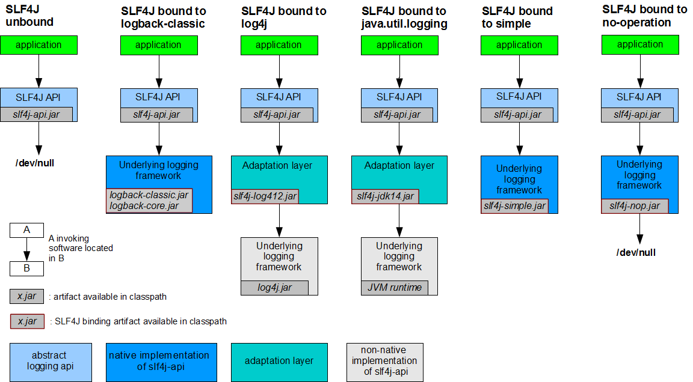
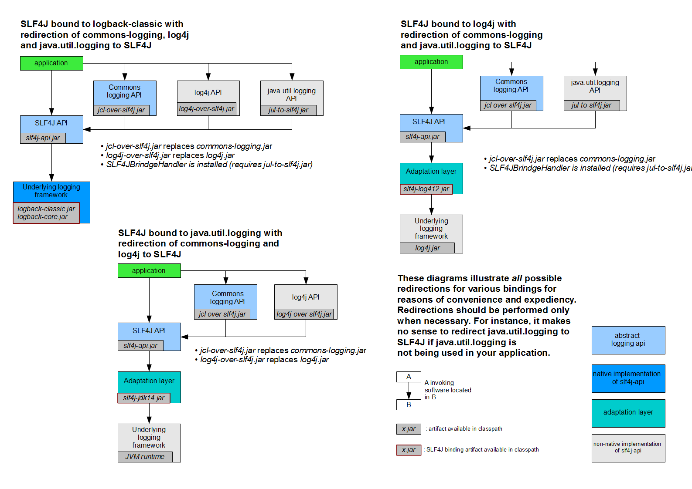

# SpringBoot

## 第一部分 基础应用

### 第 1 节 约定优于配置

> 约定优于配置(Convention over Configuration)，又称按约定编程，是一种软件设计规范。
> 
> 本质上是对系统、类库或框架中一些东西假定一个大众化地合理地默认值。

如果所用工具的约定与你的期待相符，便可省去配置;反之，你可以配置来达到你所期待的方式。

简单来说就是假如你所期待的配置与约定的配置一致，那么就可以不做任何配置，约定不符合期待时才需要对约定进行替换配置。

好处: 大大减少了配置项

### 第 2 节  SpringBoot

SpringBoot是由Pivotal团队在2013年开始研发、2014年4月发布第一个版本的全新开源的轻量级框架。
它基于Spring4.0设计，不仅继承了Spring框架原有的优秀特性，而且还通过简化配置来进一步简化了Spring应用的整个搭建和开发过程。
另外SpringBoot通过集成大量的框架使得依赖包的版本冲突，以及引用的不稳定性等问题得到了很好的解决。

**主要特性**

1. SpringBoot Starter: 他将常用的依赖分组进行了整合，将其合并到一个依赖中，这样就可以一次性添加到项目的Maven或Gradle构建中;
2. 使编码变得简单，SpringBoot采用 `JavaConfig` 的方式对Spring进行配置，并且提供了大量的注解，极大地提高了工作效率。
3. 自动配置: SpringBoot的自动配置特性利用了Spring对条件化配置的支持，合理地推测应用所需的 `Bean` 并自动化配置他们;
4. 使部署变得简单，SpringBoot内置了三种Servlet容器，Tomcat，Jetty,undertow.我们只需要一个 Java 的运行环境就可以跑SpringBoot的项目了，SpringBoot的项目可以打成一个jar包。

> 自动配置: SpringBoo 在启动过程中会自动的将一些配置类的 Bean 进行创建, 并且添加到 IoC 容器中

### 第 3 节 热部署

在开发项目过程中，当修改了某些代码后需要本地验证时，需要重启本地服务进行验证，启动这个项目，如果项目庞大的话还是需要较长时间的，
spring开发团队为我们带来了一个插件: spring-boot-devtools，很好的解决了本地验证缓慢的问题。

**使用**

添加热部署依赖

```xml
<dependency>
    <groupId>org.springframework.boot</groupId>
    <artifactId>spring-boot-devtools</artifactId>
</dependency>
```

打开 IDE 工具的自动编译功能

**原理**

我们引入了插件后，插件会监控我们 classpath 下的资源变化，当 classpath 下的文件有变化后，会触发重启

重启快速的原因: 这里对类加载采用了两种类加载器，对于第三方jar包采用 `base-classloader` 来加载，对于开发人员自己开发的代码则使用 `restartClassLoader` 来进行加载，
这使得比停掉服务重启要快的多，因为使用插件*只是重启开发人员编写的代码部分*。

可以添加验证代码:

```java
@Slf4j
@Component
public class DevTools implements InitializingBean {


    @Override
    public void afterPropertiesSet() throws Exception {
        // Spring MVC 包提供
        log.info("guava-jar classLoader:" + DispatcherServlet.class.getClassLoader().toString());
        // 自定义代码
        log.info("DevTools classLoader:" + this.getClass().getClassLoader().toString());
    }

}
```

输出结果如下: 

```shell
com.mujunlin.config.DevTools             : guava-jar classLoader:jdk.internal.loader.ClassLoaders$AppClassLoader@ed17bee
com.mujunlin.config.DevTools             : DevTools classLoader:org.springframework.boot.devtools.restart.classloader.RestartClassLoader@43163af2
```

**排除资源**

某些资源在更改后不一定需要触发重新启动。
例如，Thymeleaf模板可以就地编辑。默认情况下，改变资源 /META-INF/maven ， /META-INF/resources ， /resources ， /static ， /public ，/templates 时不触发重新启动

因为在源代码 `org.springframework.boot.devtools.autoconfigure.DevToolsProperties.Restart` 中有如下内容:

```java
private static final String DEFAULT_RESTART_EXCLUDES = "META-INF/maven/**,"
		+ "META-INF/resources/**,resources/**,static/**,public/**,templates/**,"
		+ "**/*Test.class,**/*Tests.class,git.properties,META-INF/build-info.properties";
```

如果要自定义这些排除项，则可以使用该 `spring.devtools.restart.exclude` 属性。
例如，仅排除 `/static`， `/public` 您将设置以下属性:

```properties
spring.devtools.restart.exclude=static/**, template/**
```

### 第 4 节 全局配置文件

#### 4.1 概述及优先级

全局配置文件能够对一些默认配置值进行修改及自定义配置。

Spring Boot使用一个 `application.properties` 或者 `application.yaml` 的文件作为全局配置文件


**按照优先级从高到低的顺序**

1. 先去项目根目录找`config`文件夹下找配置文件件 
2. 再去根目录下找配置文件
3. 去`resources`下找`config`文件夹下找配置文件
4. 去`resources`下找配置文件

> 这四个目录下的配置文件都会被加载
> 
> 如果同一个目录下，有`application.yml`也有`application.properties`，默认先读取 `application.properties` 【注意】
> 
> 如果高优先级中配置文件属性与低优先级配置文件不冲突的属性，则会共同存在 —— 互补配置
> 
> 如果同一个配置属性，在多个配置文件都配置了，默认使用第1个读取到的，后面读取的不覆盖前面读取到的

> 注意：
> 
> Spring Boot 2.4 改进了处理 `application.properties` 和 `application.yml` 配置文件的方式; 如果是2.4.0之前版本，优先级properties>yaml; 但是如果是2.4.0的版本，优先级yaml>properties
> 
> 如果想继续使用 Spring Boot 2.3 的配置逻辑，也可以通过在 application.properties 或者 application.yml 配置文件中添加以下参数:
> 
> ```properties
> spring.config.use-legacy-processing = true
> ```

如果我们的配置文件名字不叫application.properties或者application.yml，可以通过以下参数来指定配置文件的名字

```shell
$ java -jar myproject.jar --spring.config.name=myproject
```

我们同时也可以指定其他位置的配置文件来生效, 指定配置文件和默认加载的这些配置文件共同起作用形成互补配置。

```shell
java -jar run-0.0.1-SNAPSHOT.jar --spring.config.location=D:/application.properties
```

#### 4.2 properties 配置文件

使用Spring Initializr 方式构建Spring Boot项目时，会在resource目录下自动生成一个空的 `application.properties` 文件，Spring Boot项目启动时会自动加载application.properties文件。

在 `application.properties` 文件中定义Spring Boot项目的相关属性，这些相关属性可以是系统属性、环境变量、命令参数等信息，也可以是自定义配置文件名称和位置

**示例**

`application.properties` 配置文件中的自定义配置属性注入到 Person 实体类的对应属性中

1. 添加实体类

```java
@Data
public class Pet {

    private String type;
    private String name;

}
```

```java
@Data
@Component // 将当前注入属性值的Person类对象作为Bean组件放到Spring容器中，只有这样才能被 @ConfigurationProperties 注解进行赋值
@ConfigurationProperties(prefix = "person") //将配置文件中以person开头的属性注入到该类中
public class Person {

    private int id; //id
    private String name; //名称
    private List hobby; //爱好
    private String[] family; //家庭成员
    private Map map;
    private Pet pet; //宠物

}
```

> `@ConfigurationProperties(prefix = "person")` 注解的作用是将配置文件中以person开头的属性值通过 setXX()方法注入到实体类对应属性中
> 
> `@Component` 注解的作用是将当前注入属性值的Person类对象作为Bean组件放到Spring容器中，只有这样才能被 `@ConfigurationProperties` 注解进行赋值

2. 在配置文件中编写需要对 Person类设置的配置属性

```properties
person.id=101
person.name=tom
person.hobby=eat,sleep
person.family=father,mother
person.map.k1=v1
person.map.k2=v2
person.pet.type=dog
person.pet.name=wong
```

编写application.properties配置文件时，由于要配置的Person对象属性是我们自定义的，Spring Boot无法自动识别，
所以不会有任何书写提示。在实际开发中，为了出现代码提示的效果来方便配置，在使用 `@ConfigurationProperties` 注解进行配置文件属性值注入时，
可以在pom.xml文件中添加一个 Spring Boot提供的配置处理器依赖

```xml
<dependency>
    <groupId>org.springframework.boot</groupId>
    <artifactId>spring-boot-configuration-processor</artifactId>
    <optional>true</optional>
</dependency>
```

> 在pom.xml中添加上述配置依赖后，还需要重新运行项目启动类或者 Build Project 重构当前Spring Boot项目方可生效

3. 编写测试并打印结果如下

```shell
Person(id=101, name=tom, hobby=[eat, sleep], family=[father, mother], map={k1=v1, k2=v2}, pet=Pet(type=dog, name=wong))
```

#### 4.3 yaml 配置文件

YAML文件格式是Spring Boot支持的一种JSON超集文件格式，以数据为中心，比 properties、xml 等更适合做配置文件

- yml和xml相比，少了一些结构化的代码，使数据更直接，一目了然， 相比properties文件更简洁
- YAML 文件的扩展名可以使用`.yml`或者`.yaml`
- application.yml文件使用 “key:(空格)value” 格式配置属性，使用缩进控制层级关系

**YML 不同数据类型的属性值**

1. value值为普通数据类型(例如数字、字符串、布尔等)

当YAML配置文件中配置的属性值为普通数据类型时，可以直接配置对应的属性值，同时对于字符串类型的属性值，不需要额外添加引号，示例代码如下

```yaml
server: 
  port: 8080
  servlet:
    context-path: /hello
```

2. value值为数组和单列集合

当YAML配置文件中配置的属性值为数组或单列集合类型时，主要有两种书写方式: *缩进式* 写法和 *行内式* 写法。

缩进式:

```yaml
person:
  hobby:
    - eat
    - sleep
```

或者

```yaml
person:
  hobby:
    eat,
    sleep
```

行内式：

```yaml
person:
  hobby: [eat,sleep]
```

在YAML配置文件中通过两种缩进式写法对person对象的单列集合(或数组)类型的爱好 hobby 赋值。
其中一种形式为 “-(空格)属性值”，另一种形式为多个属性值之前加英文逗号分隔(注意，最后一个属性值后不要加逗号)。

通过上述示例对比发现，YAML配置文件的行内式写法更加简明、方便。
另外，包含属性值的中括号 “[]” 还可以进一步省略，在进行属性赋值时，程序会自动匹配和校对。

3. value值为Map集合和对象

当YAML配置文件中配置的属性值为Map集合或对象类型时，YAML配置文件格式同样可以分为两种书写方式: 缩进式写法和行内式写法。

缩进式：

```yaml
person:
  map:
    k1: v1
    k2: v2
```

行内式：

```yaml
person:
  map: {k1: v2, k2: v2}
```

在YAML配置文件中，配置的属性值为Map集合或对象类型时，缩进式写法的形式按照YAML文件格式编写即可，而行内式写法的属性值要用大括号“{}”包含(同时不要忘记key后面的空格)。

**配置自定义对象**

```yaml
person:
  id: 102
  name: jack
  hobby: [eat,shit]
  family: father,mother
  map: {k1: v1,k2: v2}
  pet: {type: cat,name: luo}
```

打印结果如下：

```shell
Person(id=102, name=jack, hobby=[eat, shit], family=[father, mother], map={k1=v1, k2=v2}, pet=Pet(type=cat, name=luo))
```

### 第 5 节 属性注入

使用Spring Boot全局配置文件设置属性时，
如果配置属性是Spring Boot已有属性，例如服务端口 `server.port`，那么Spring Boot内部会自动扫描并读取这些配置文件中的属性值并覆盖默认属性；
如果配置的属性是用户自定义属性，还必须在程序中注入这些配置属性方可生效。

#### 5.1 属性注入常用注解

注解|说明
---|---
`@Configuration` | 声明一个类作为配置类 
`@Bean` | 声明在方法上，将方法的返回值加入Bean容器
`@Value` | 属性注入
`@ConfigurationProperties(prefix = "jdbc")` | 批量属性注入 
`@PropertySource("classpath:/jdbc.properties")` | 声明在类上，指定外部属性文件

#### 5.2 @Value属性值注入

以数据源连接为例

1. 引入依赖

```xml
<dependency>
    <groupId>com.github.drtrang</groupId>
    <artifactId>druid-spring-boot2-starter</artifactId>
    <version>1.1.10</version>
</dependency>
```

2. 添加配置

```yaml
jdbc:
  driverClassName: com.mysql.cj.jdbc.Driver
  url: jdbc:mysql:///springboot
  username: root
  password: 1234567890
```

3. 添加配置类

```java
@Configuration
public class JdbcConfiguration {

    @Value("${jdbc.url}")
    String url;

    @Value("${jdbc.driverClassName}")
    String driverClassName;

    @Value("${jdbc.username}")
    String username;

    @Value("${jdbc.password}")
    String password;

    @Bean
    public DataSource dataSource() {
        DruidDataSource dataSource = new DruidDataSource();
        dataSource.setUrl(url);
        dataSource.setDriverClassName(driverClassName);
        dataSource.setUsername(username);
        dataSource.setPassword(password);
        return dataSource;
    }

}
```

> 使用 spring 中的 `@Value` 注解对每个属性进行注入,用 `@Bean` 注解将返回值添加 到容器中

#### 5.3 @ConfigurationProperties 批量注入

实现上一点同样功能

```java
@Data
@Configuration
@EnableConfigurationProperties(JdbcConfiguration.class) // 主要作用是使下方的注解生效
@ConfigurationProperties(prefix = "jdbc")
public class JdbcConfiguration {

    String url;

    String driverClassName;

    String username;

    String password;

    @Bean
    public DataSource dataSource() {
        DruidDataSource dataSource = new DruidDataSource();
        dataSource.setUrl(url);
        dataSource.setDriverClassName(driverClassName);
        dataSource.setUsername(username);
        dataSource.setPassword(password);
        return dataSource;
    }
    
}
```

> `@EnableConfigurationProperties` 是 Spring Boot 提供的一个注解，使用该注解用于启用应用对另外一个注解 `@ConfigurationProperties` 的支持

配置文件如下：

```yaml
jdbc:
  driver-class-name: com.mysql.cj.jdbc.Driver
  url: jdbc:mysql:///springboot
  username: root
  password: 1234567890
```

#### 5.4 第三方配置

`@ConfigurationProperties` 不仅可以声明在类上，还可以声明在使用 `@Bean` 定义 Bean 的方法上；
用于给第三方的 Bean 注入属性。

**示例**

有第三方 Bean 如下

```java
// 假定此类为第三方类，无法使用 @Value 注入
@Data
public class OtherComponent {

    /**
     * 是否启用
     */
    private Boolean enabled;

    /**
     * IP 地址
     */
    private InetAddress remoteAddress;

}
```

使用 `@Bean` 注解向容器中注入 Bean
 
```java
@Configuration
public class OtherComponentConfig {

    @Bean
    @ConfigurationProperties(prefix = "other")
    public OtherComponent otherComponent() {
        return new OtherComponent();
    }

}
```

此时，可以通过配置文件向注入的第三方 Bean 注入属性

```yaml
other:
  enabled: true
  remote-address: 192.168.10.1
```

#### 5.5 松散绑定

Spring Boot 使用一些宽松的规则将属性绑定到 `@ConfigurationProperties` Bean上，属性名和 Bean属性名 的命名风格可以不完全相同。

配置文件的命名风格|说明
---|---
acme.my-project.person.first-name | 羊肉串模式风格 【推荐使用】
acme.myProject.person.firstName | 标准驼峰模式
acme.my_project.person.first_name | 下划线模式
ACME_MYPROJECT_PERSON_FIRSTNAME | 大写下划线，如果使用系统环境时候推荐使用

#### 5.6 两种注入方式比较

特征|@ConfigurationProperties|@Value
---|---|---
松散绑定| yes | Limited
元数据支持 | yes | no
SpEL 表达式 | no | yes
应用场景 | 批量属性注入 | 单个属性注入

### 第 6 节 SpringBoot日志框架 

#### 6.1 日志框架介绍

在项目的开发中，日志是必不可少的一个记录事件的组件，不管是记录运行情况还是追踪线上问题，都离不开对日志的分析，所以也会相应的在项目中实现和构建我们所需要的日志框架。

而市面上常见的日志框架有很多，比如:JCL、SLF4J、Jboss-logging、jUL、log4j、log4j2、logback等 等，我们该如何选择呢?

通常情况下，日志是由一个抽象层+实现层的组合来搭建的。

日志-抽象层|日志-实现层
---|---
JCL(Jakarta Commons Logging)、SLF4J(Simple Logging Facade for Java)、jboss-logging|jul(java.util.logging)、log4j、logback、log4j2


Spring 框架选择使用了 JCL 作为默认日志输出。而 Spring Boot 默认选择了 SLF4J 结合 LogBack

#### 6.2 SLF4J 的使用

在开发的时候不应该直接使用日志实现类，应该使用日志的抽象层。

下图是 SLF4J 结合各种日志框架的官方示例，从图中可以清晰地看出SLF4J API 永远作为日志的门面，直接应用与应用程序中。



> 注意:由于每一个日志的实现框架都有自己的配置文件，所以在使用 SLF4j 之后，配置文件还是要使用实现日志框架的配置文件。


#### 6.3 统一日志框架的使用

一般情况下，在项目中存在着各种不同的第三方 `jar` ，且它们的日志选择也可能不尽相同，
显然这样是不利于我们使用的，那么如果我们想为项目设置统一的日志框架该怎么办呢?

官方示例如下：




从图中可以得到一种统一日志框架的方式：使用一种和被替换的日志框架类完全一样的 jar 进行替换，这样不至于原来的第三方 jar 报错，
而这个替换的 jar 其实使用了 SLF4J API. 这样项目中的日志就都可以通过 SLF4J API 结合自己选择的框架进行日志输出。

**统一日志框架步骤**

1. 排除系统中的其他日志框架。
2. 使用中间包替换原本的日志框架。 
3. 导入我们选择的 SLF4J 实现。


#### 6.4. Spring Boot 的日志关系 

1. 排除其他日志框架

根据上面总结的要统一日志框架的使用，第一步要排除其他的日志框架。
在 Spring Boot 的 Maven 依赖里可以清楚的看到 Spring Boot 排除了其他日志框架。

```xml
<dependency>
  <groupId>org.apache.activemq</groupId>
  <artifactId>activemq-leveldb-store</artifactId>
  <version>${activemq.version}</version>
  <exclusions>
    <exclusion>
      <groupId>commons-logging</groupId>
      <artifactId>commons-logging</artifactId>
    </exclusion>
  </exclusions>
</dependency>
```

> 我们自行排除依赖时也只需要按照图中的方式就好了。


2. 统一框架引入替换包

Spring Boot 是使用了 `SLF4J+logback` 的日志框架组合，查看 Spring Boot 项目的 Maven 依赖关系, 
可以看到 Spring Boot 的核心启动器 `spring-boot-starter` 引入了 `spring-boot-starter-logging`.

而 `spring-boot-starter-logging` 的 Maven 依赖主要引入了 `logback-classic` (包含了日志框架 Logback 的实现)，
`log4j-to-slf4j` (在 log4j 日志框架作者开发此框架的时候还没有想到使用日志抽象层进行开发，因此出现了 log4j 向 slf4j 转换的工具)，
`jul-to-slf4j` ( Java 自带的日志框架转换为 slf4j).

由此可见，Spring Boot 可以自动的适配日志框架，而且底层使用 `SLF4j + LogBack` 记录日志，如果我们自行引入其他框架，需要排除其日志框架。

#### 6.5. Spring Boot 的日志使用

**日志级别和格式**

从上面的分析，发现 Spring Boot 默认已经使用了 SLF4J + LogBack . 
所以我们在不进行任何额外操作的情况下就可以使用 SLF4J + Logback 进行日志输出。

```java
@RunWith(SpringRunner.class)
@SpringBootTest
@Slf4j
public class LogBackTest {

    @Test
    public void testLog() {
        log.trace("Trace log ...");
        log.debug("Debug log ...");
        log.info("Info log ...");
        log.warn("Warn log ...");
        log.error("Error log ...");
    }

}
```

> 已知日志级别从小到大为 trace < debug < info < warn < error . 
> 运行得到输出如下。由此可见 Spring Boot INFO.

```shell
2021-05-09 18:03:18.256  INFO 1917 --- [           main] com.mujunlin.LogBackTest                 : Info log ...
2021-05-09 18:03:18.256  WARN 1917 --- [           main] com.mujunlin.LogBackTest                 : Warn log ...
2021-05-09 18:03:18.256 ERROR 1917 --- [           main] com.mujunlin.LogBackTest                 : Error log ...
```

从上面的日志结合 Logback 日志格式可以知道 Spring Boot 默认日志格式是:

```shell
%d{yyyy-MM-dd HH:mm:ss.SSS} [%thread] %-5level %logger{50} - %msg%n 
# %d{yyyy-MM-dd HH:mm:ss.SSS} 时间
# %thread 线程名称
# %-5level 日志级别从左显示5个字符宽度
# %logger{50} 类名
# %msg%n 日志信息加换行
```

至于为什么 Spring Boot 的默认日志输出格式是这样?

见源代码 `/org/springframework/boot/logging/logback/defaults.xml`

```xml
<included>
    <property name="CONSOLE_LOG_PATTERN" value="${CONSOLE_LOG_PATTERN:-%clr(%d{${LOG_DATEFORMAT_PATTERN:-yyyy-MM-dd HH:mm:ss.SSS}}){faint} %clr(${LOG_LEVEL_PATTERN:-%5p}) %clr(${PID:- }){magenta} %clr(---){faint} %clr([%15.15t]){faint} %clr(%-40.40logger{39}){cyan} %clr(:){faint} %m%n${LOG_EXCEPTION_CONVERSION_WORD:-%wEx}}"/>
    <property name="CONSOLE_LOG_CHARSET" value="${CONSOLE_LOG_CHARSET:-default}"/>
    <property name="FILE_LOG_PATTERN" value="${FILE_LOG_PATTERN:-%d{${LOG_DATEFORMAT_PATTERN:-yyyy-MM-dd HH:mm:ss.SSS}} ${LOG_LEVEL_PATTERN:-%5p} ${PID:- } --- [%t] %-40.40logger{39} : %m%n${LOG_EXCEPTION_CONVERSION_WORD:-%wEx}}"/>
    <property name="FILE_LOG_CHARSET" value="${FILE_LOG_CHARSET:-default}"/>
</included>
```

#### 6.6 自定义日志输出

可以直接在配置文件编写日志相关配置

```yaml
logging:
  pattern:
    console: "%d{yyyy-MM-dd HH:mm:ss.SSS} [%thread] %-5level %logger{50} - %msg%n" # 控制台输出格式
    file: "%d{yyyy-MM-dd HH:mm:ss.SSS} [%thread] %-5level %logger{50} -%msg%n" # 日志文件输出格式
  file:
    path: /var/log # 日志默认输出文件
  level:
    com.mujunlin: debug # 给包指定日志级别
```

> 格式配置的时候注意要添加 `"` 符号，否则会解析出错。
> 
> 说实话，我是很讨厌 YML 的。不方便写注释，松散绑定解析方式成谜，👎🏻


关于日志的输出路径，可以使用 `logging.file.name` 或者 `logging.file.path` 进行定义；
其中： `logging.file.name` 可以指定日志文件的的路径和文件名，
而 `logging.file.path` 仅可以指定日志文件的路径，文件名默认使用 `spring.log`

#### 6.7 替换日志框架

因为 Log4j 日志框架已经年久失修，原作者都觉得写的不好，所以下面演示替换日志框架为 Log4j2 的方式。

> 根据官网介绍，Log4j2 与 logging 需要二选一

```xml
<dependencies>
    <dependency>
        <groupId>org.springframework.boot</groupId>
        <artifactId>spring-boot-starter-web</artifactId>
        <exclusions>
            <exclusion>
                <artifactId>spring-boot-starter-logging</artifactId>
                <groupId>org.springframework.boot</groupId>
            </exclusion>
        </exclusions>
    </dependency>
    <dependency>
        <groupId>org.springframework.boot</groupId>
        <artifactId>spring-boot-starter-log4j2</artifactId>
    </dependency>
</dependencies>
```

> 排除依赖时，可以使用 Diagrams 视图，选中需要排除的依赖 -> 单击右键 -> Exclude，POM 文件中会自动添加排除的 XML 标签

