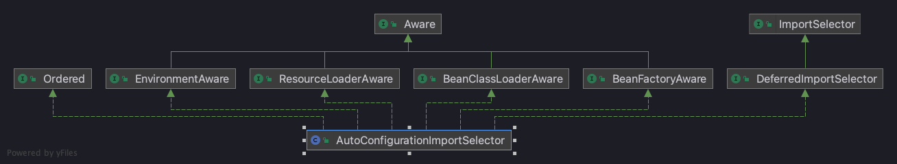
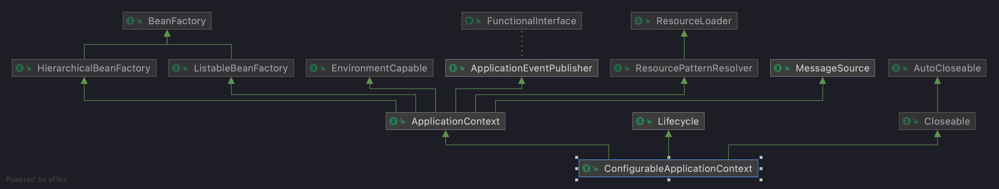
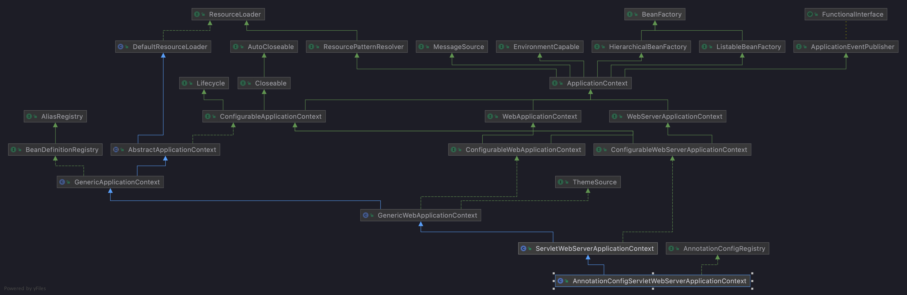

# Spring Boot 源码剖析

源码导入需要注意两点：

1. 2.2.x 以后都是使用的 Gradle 构建
2. 需要在 pom.xml 文件中添加 `<disable.checks>true</disable.checks>` 关闭 maven 代码检查

## 依赖管理


> 问题一: 为什么导入dependency时不需要指定版本?


在Spring Boot入门程序中，项目`pom.xml`文件有两个核心依赖，分别是 `spring-boot-starter-parent` 
和`spring-boot-starter-web`，关于这两个依赖的相关介绍具体如下

### spring-boot-starter-parent

找到`spring-boot-starter-parent`依赖，代码如下:

```xml
<parent>
	<groupId>org.springframework.boot</groupId>
	<artifactId>spring-boot-starter-parent</artifactId>
	<version>2.2.13.RELEASE</version>
	<relativePath/> <!-- lookup parent from repository -->
</parent>
```

上述代码中，将`spring-boot-starter-parent`依赖作为 Spring Boot 项目的统一父项目依赖管理，并将项目版本号统一为`2.2.13.RELEASE`，
该版本号根据实际开发需求是可以修改的。

进入并查看`spring-boot-starter-parent`底层源文件，先看 spring-boot-starter-parent做了哪些事。

首先看`spring-boot-starter-parent`的`properties`节点

```xml
<properties>
	<main.basedir>${basedir}/../../..</main.basedir>
	<java.version>1.8</java.version>
	<resource.delimiter>@</resource.delimiter> <!-- delimiter that doesn't clash with Spring ${} placeholders -->
	<project.build.sourceEncoding>UTF-8</project.build.sourceEncoding>
	<project.reporting.outputEncoding>UTF-8</project.reporting.outputEncoding>
	<maven.compiler.source>${java.version}</maven.compiler.source>
	<maven.compiler.target>${java.version}</maven.compiler.target>
</properties>
```

> `spring-boot-starter-parent`在此定义了:
> 
> - 工程的Java版本为 1.8
> - 工程代码的编译源文件编码格式为 UTF-8 
> - 工程编译后的文件编码格式为 UTF-8
> - Maven打包编译的版本

再看`spring-boot-starter-parent`的 build 节点，在此节点分别定义了`resources`资源和`pluginManagement`

我们详细看一下`resources`节点，里面定义了资源过滤，针对`application`的`yml`、`properties`格式进行了过滤，可以支持不同环境的配置。
比如 `application-dev.yml`、`application-test.yml`、`application-dev.properties`等等。

```xml
<resources>
	<resource>
		<directory>${basedir}/src/main/resources</directory>
		<filtering>true</filtering>
		<includes>
			<include>**/application*.yml</include>
			<include>**/application*.yaml</include>
			<include>**/application*.properties</include>
		</includes>
	</resource>
	<resource>
		<directory>${basedir}/src/main/resources</directory>
		<excludes>
			<exclude>**/application*.yml</exclude>
			<exclude>**/application*.yaml</exclude>
			<exclude>**/application*.properties</exclude>
		</excludes>
	</resource>
</resources>
```

> 而 `pluginManagement` 则是引入了相应的插件和对应的版本依赖，在此不做过多展示


最后来看`spring-boot-starter-parent`的父依赖`spring-boot-dependencies`

`spring-boot-dependencies`的`properties`节点:

```xml
<properties>
	<main.basedir>${basedir}/../..</main.basedir>
	<!-- Dependency versions -->
	<activemq.version>5.15.14</activemq.version>
	<antlr2.version>2.7.7</antlr2.version>
	<appengine-sdk.version>1.9.84</appengine-sdk.version>
	<artemis.version>2.10.1</artemis.version>
	<aspectj.version>1.9.6</aspectj.version>
	<assertj.version>3.13.2</assertj.version>
	<atomikos.version>4.0.6</atomikos.version>
	<awaitility.version>4.0.3</awaitility.version>
	<bitronix.version>2.1.4</bitronix.version>
	<byte-buddy.version>1.10.19</byte-buddy.version>
	<caffeine.version>2.8.8</caffeine.version>
	<cassandra-driver.version>3.7.2</cassandra-driver.version>
	......
</properties>
```

这个才是 SpringBoot 项目的真正管理依赖的项目，里面定义了上百个SpringBoot相关的版本

`spring-boot-dependencies`的`dependencyManagement`节点在其子节点`dependencies`中定义了SpringBoot版本的依赖的组件以及相应版本

所以得出结论：

`spring-boot-starter-parent`通过*继承*`spring-boot-dependencies`从而实现了SpringBoot的版本依赖管理，
所以我们的 SpringBoot 工程继承`spring-boot-starter-parent`后已经具备版本锁定等配置了, 这就是在 SpringBoot 项目中*部分依赖*不需要写版本号的原因


---

> 问题二 : `spring-boot-starter-parent` 父依赖启动器的主要作用是进行版本统一管理，那么项目运行依赖的JAR包是从何而来的?

### spring-boot-starter-web

查看`spring-boot-starter-web`依赖文件源码，核心代码具体如下

```xml
<dependencies>
	<dependency>
		<groupId>org.springframework.boot</groupId>
		<artifactId>spring-boot-starter</artifactId>
	</dependency>
	<dependency>
		<groupId>org.springframework.boot</groupId>
		<artifactId>spring-boot-starter-json</artifactId>
	</dependency>
	<dependency>
		<groupId>org.springframework.boot</groupId>
		<artifactId>spring-boot-starter-tomcat</artifactId>
	</dependency>
	<dependency>
		<groupId>org.springframework.boot</groupId>
		<artifactId>spring-boot-starter-validation</artifactId>
		<exclusions>
			<exclusion>
				<groupId>org.apache.tomcat.embed</groupId>
				<artifactId>tomcat-embed-el</artifactId>
			</exclusion>
		</exclusions>
	</dependency>
	<dependency>
		<groupId>org.springframework</groupId>
		<artifactId>spring-web</artifactId>
	</dependency>
	<dependency>
		<groupId>org.springframework</groupId>
		<artifactId>spring-webmvc</artifactId>
	</dependency>
</dependencies>
```

从上述代码可以发现，`spring-boot-starter-web`依赖启动器的主要作用是: 打包了Web开发场景所需的底层所有依赖(基于依赖传递，当前项目也存在对应的依赖jar包)

正因如此，在`pom.xml`中引入`spring-boot-starter-web`依赖启动器时，就可以实现Web场景开发，而不需要额外导入Tomcat服务器以及其他Web依赖文件等。
当然，这些引入的依赖文件的版本号还是由spring-boot-starter-parent父依赖进行的统一管理。 

> Spring Boot除了提供有上面介绍的Web依赖启动器外，还提供了其他许多开发场景的相关依赖，我们可以打开Spring Boot官方文档，搜索“Starters”关键字查询场景依赖启动器
>
> 这些依赖启动器适用于不同的场景开发，使用时只需要在`pom.xml`文件中导入对应的依赖启动器即可。

需要说明的是，Spring Boot官方并不是针对所有场景开发的技术框架都提供了场景启动器，例如阿里巴巴的Druid数据源等，Spring Boot官方就没有提供对应的依赖启动器。

为了充分利用 SpringBoot 框架的优势，在 SpringBoot 官方没有整合这些技术框架的情况下，Druid 等技术框架所在的开发团队主动与 SpringBoot 框架进行了整合，
实现了各自的依赖启动器，例如druid-spring-boot-starter等。(我们在`pom.xml`文件中引入这些第三方的依赖启动器时，切记要手动配置对应的版本号)

> 命名规范：
> 
> 官方： spring-boot-starter-xxx
> 自定义：xxx-spring-boot-starter


## 自动配置

> 自动配置: 根据我们添加的jar包依赖，会自动将一些配置类的 Bean 注册进 IoC 容器，我们可以在需要的地方使用`@Autowired`等注解来使用它。

**问题:Spring Boot到底是如何进行自动配置的，都把哪些组件进行了自动配置?**

已知 SpringBoot 应用的启动入口是`@SpringBootApplication`注解标注类中的`main()`方法，我们首先来看这个注解

### @SpringBootApplication

核心代码如下

```java
// 注解的适用范围,Type表示注解可以描述在类、接口、注解或枚举中
@Target(ElementType.TYPE)
//表示注解的生命周期，Runtime表示运行时
@Retention(RetentionPolicy.RUNTIME)
//表示注解可以记录在 javaDoc 中
@Documented
// 表示可以被子类继承该注解
@Inherited
// 标明该类为配置类
@SpringBootConfiguration
// 启动自动配置功能
@EnableAutoConfiguration
@ComponentScan(excludeFilters = { @Filter(type = FilterType.CUSTOM, classes = TypeExcludeFilter.class),
		@Filter(type = FilterType.CUSTOM, classes = AutoConfigurationExcludeFilter.class) })
public @interface SpringBootApplication {
	// 根据class来排除特定的类，使其不能加入spring容器，传入参数value类型是class类型。
	@AliasFor(annotation = EnableAutoConfiguration.class)
	Class<?>[] exclude() default {};
	// 根据classname 来排除特定的类，使其不能加入spring容器，传入参数value类型是class的全类名字符串数组。
	@AliasFor(annotation = EnableAutoConfiguration.class)
	String[] excludeName() default {};
	// 指定扫描包，参数是包名的字符串数组。
	@AliasFor(annotation = ComponentScan.class, attribute = "basePackages")
	String[] scanBasePackages() default {};
	// 扫描特定的包，参数类似是Class类型数组。
	@AliasFor(annotation = ComponentScan.class, attribute = "basePackageClasses")
	Class<?>[] scanBasePackageClasses() default {};

	@AliasFor(annotation = Configuration.class)
	boolean proxyBeanMethods() default true;

}
```

从源码可以看出，`@SpringBootApplication`注解是一个组合注解，前面 4 个是注解的元数据信息， 我们主要看后面 3 个注解:
`@SpringBootConfiguration`、`@EnableAutoConfiguration`、 `@ComponentScan` 三个核心注解，关于这三个核心注解的相关说明具体如下

### @SpringBootConfiguration

> `@SpringBootConfiguration`: SpringBoot 的配置类，标注在某个类上，表示这是一个 SpringBoot 的配置类。

查看`@SpringBootConfiguration`注解源码，核心代码如下:

```java
@Target(ElementType.TYPE)
@Retention(RetentionPolicy.RUNTIME)
@Documented
@Configuration
public @interface SpringBootConfiguration {
	@AliasFor(annotation = Configuration.class)
	boolean proxyBeanMethods() default true;
}
```

从上述源码可以看出，`@SpringBootConfiguration`注解内部有一个核心注解`@Configuration`，
该注解 是Spring框架提供的，表示当前类为一个配置类(XML配置文件的注解表现形式)，并可以被组件扫描器扫描。

由此可见，`@SpringBootConfiguration`注解的作用与`@Configuration`注解相同，都是标识一个可以被组件扫描器扫描的配置类，
只不过`@SpringBootConfiguration`是被 SpringBoot 进行了重新封装命名而已。

### @EnableAutoConfiguration

> 启动自动配置功能

核心源码如下：

```java
// 自动配置包
@AutoConfigurationPackage
// Spring的底层注解@Import，给容器中导入一个组件;
// 导入的组件是AutoConfigurationPackages.Registrar.class
@Import(AutoConfigurationImportSelector.class)
// 告诉SpringBoot开启自动配置功能，这样自动配置才能生效。
public @interface EnableAutoConfiguration {
    /**
     * Environment property that can be used to override when auto-configuration is
     * enabled.
     */
    String ENABLED_OVERRIDE_PROPERTY = "spring.boot.enableautoconfiguration";
    // 返回不会被导入到 Spring 容器中的类
    Class<?>[] exclude() default {};
    // 返回不会被导入到 Spring 容器中的类名
    String[] excludeName() default {};

}
```

`@EnableAutoConfiguration`就是借助`@Import`来收集所有符合自动配置条件的 Bean 定义，并加载到 IoC 容器中。

> Spring 中有很多以`Enable`开头的注解，其作用就是借助`@Import`来收集并注册特定场景相关的 Bean ，并加载到 IOC 容器中。

#### @AutoConfigurationPackage

```java
// Spring的底层注解@Import，给容器中导入一个组件;
// 导入的组件是AutoConfigurationPackages.Registrar.class
@Import(AutoConfigurationPackages.Registrar.class)
public @interface AutoConfigurationPackage {

}
```

进入被导入的 `Registrar` 类当中：

```java
static class Registrar implements ImportBeanDefinitionRegistrar, DeterminableImports {

	@Override
	public void registerBeanDefinitions(AnnotationMetadata metadata, BeanDefinitionRegistry registry) {
		// 将注解标注的元信息传入，获取到相应的包名
		register(registry, new PackageImport(metadata).getPackageName());
	}

	@Override
	public Set<Object> determineImports(AnnotationMetadata metadata) {
		return Collections.singleton(new PackageImport(metadata));
	}

}
```

应用启动时，会进入到`Registrar`的`register`方法当中，该方法有两个参数：

- Bean定义的注册中心
- 根据注解元数据获取的包名（也就是使用`@AutoConfigurationPackage`注解的类, 也就是核心启动类所在的包）

继续进入到 `register` 方法当中：

```java
public static void register(BeanDefinitionRegistry registry, String... packageNames) {
	// 这里参数 packageNames 默认情况下就是一个字符串，是使用了注解 @SpringBootApplication 的 SpringBoot 应用程序入口类所在的包
	if (registry.containsBeanDefinition(BEAN)) {
		// 如果该 BeanDefinition 已经注册，则将要注册包名称添加进去
		BeanDefinition beanDefinition = registry.getBeanDefinition(BEAN);
		ConstructorArgumentValues constructorArguments = beanDefinition.getConstructorArgumentValues();
		constructorArguments.addIndexedArgumentValue(0, addBasePackages(constructorArguments, packageNames));
	}
	else {
		// 如果该 Bean 尚未注册，则将参数中提供的包名设置到 BeanDefinition 中，然后注册该 BeanDefinition，
		GenericBeanDefinition beanDefinition = new GenericBeanDefinition();
		beanDefinition.setBeanClass(BasePackages.class);
		beanDefinition.getConstructorArgumentValues().addIndexedArgumentValue(0, packageNames);
		beanDefinition.setRole(BeanDefinition.ROLE_INFRASTRUCTURE);
		registry.registerBeanDefinition(BEAN, beanDefinition);
	}
}
```

其中 BEAN 的定义为 ： `private static final String BEAN = AutoConfigurationPackages.class.getName();`

由此可见： `Registrar` 主要就干了一件事 —— 注册了 BasePackages 类。

BasePackages 有一个参数：使用了 @AutoConfigurationPackage 这个注解的类所在的包路径。
作用是供以后使用，比如给 JPA entity 扫描器，用来扫描开发人员通过注解 @Entity 定义的 entity 类。

#### @Import(AutoConfigurationImportSelector.class)

`@Import({AutoConfigurationImportSelector.class})`: 将`AutoConfigurationImportSelector`这个类导入到 Spring 容器中，
`AutoConfigurationImportSelector`可以帮助 Springboot 应用将所有符合条件的 `@Configuration` 配置都加载到当前 SpringBoot 创建和使用的 IoC 容器( ApplicationContext )中。



可以看出 `AutoConfigurationImportSelector` 实现了 `DeferredImportSelector` 接口和各种 Aware 接口。
而 `DeferredImportSelector` 接口又继承了 `ImportSelector` 接口。

很多其它的 Aware 接口，分别表示在某个时机会被回调。在该类的内部有如下变量声明：

```java
private ConfigurableListableBeanFactory beanFactory;
private Environment environment;
private ClassLoader beanClassLoader;
private ResourceLoader resourceLoader;
```

就是在其声明的各个 `Aware` 接口的节点进行赋值的。

**确定自动配置实现逻辑的入口方法**

实现了`DeferredImportSelector`接口，在 SpringBoot 启动过程中就会执行 `DeferredImportSelectorGrouping` 类的 `getImports` 方法。
而跟自动配置逻辑相关的入口方法就在 `DeferredImportSelectorGrouping` 类的 `getImports` 方法处， 因此我们就从方法来开始分析SpringBoot的自动配置源码

先看一下 getImports 方法：

```java
public Iterable<Group.Entry> getImports() {
	for (DeferredImportSelectorHolder deferredImport : this.deferredImports) {
		this.group.process(deferredImport.getConfigurationClass().getMetadata(),
				deferredImport.getImportSelector());
	}
	return this.group.selectImports();
}
```

> 此处的 `this.group` 是 `DeferredImportSelector.Group`, 可见实际上是 `DeferredImportSelector` 的内部接口。

接下来我们再逐一分析 `getImports` 中调用的两个方法： `DeferredImportSelector.Group#process` 和 `DeferredImportSelector.Group#selectImports`。

我们首先来看 `DeferredImportSelector.Group#process` 方法：

首先看这个方法的两个参数，一个是元数据信息，另一个是正是 `AutoConfigurationImportSelector`，而自动配置的逻辑正是由此组件类完成，具体的处理逻辑就在 `process` 方法当中

进入到具体的实现 `AutoConfigurationImportSelector.AutoConfigurationGroup#process` 方法当中（绕了一圈，最终又回到了`AutoConfigurationImportSelector`当中）

```java
public void process(AnnotationMetadata annotationMetadata, DeferredImportSelector deferredImportSelector) {
	// ... 断言 ...
	// 1、调用 getAutoConfigurationEntry 方法获取自动配置类，存入变量 autoConfigurationEntry 中
	AutoConfigurationEntry autoConfigurationEntry = ((AutoConfigurationImportSelector) deferredImportSelector)
			.getAutoConfigurationEntry(getAutoConfigurationMetadata(), annotationMetadata);
	// ...
}
```

我们继续进入到 `AutoConfigurationImportSelector#getAutoConfigurationEntry` 的方法当中：

```java
protected AutoConfigurationEntry getAutoConfigurationEntry(AutoConfigurationMetadata autoConfigurationMetadata,
		AnnotationMetadata annotationMetadata) {
	if (!isEnabled(annotationMetadata)) {
		return EMPTY_ENTRY;
	}
	AnnotationAttributes attributes = getAttributes(annotationMetadata);
	// 1、获取 META-INF/spring.factories 文件中 key 为 org.springframework.boot.autoconfigure.EnableAutoConfiguration 的自动配置类全路径列列表
	List<String> configurations = getCandidateConfigurations(annotationMetadata, attributes);
	// 通过 LinkedHashSet 的特性删除重复的自动配置类
	configurations = removeDuplicates(configurations);
	// 获取需要排除的自动配置类的全路径类名列表，比如注解属性exclude的配置类
	// 比如: @SpringBootApplication(exclude = FreeMarkerAutoConfiguration.class)
	// 将会获取到exclude = FreeMarkerAutoConfiguration.class的注解数据
	Set<String> exclusions = getExclusions(annotationMetadata, attributes);
	// 检查要被排除的配置类，如果有非自动配置类，要抛出异常
	checkExcludedClasses(configurations, exclusions);
	// 2、将需要排除的配置类移除
	configurations.removeAll(exclusions);
	// 3、因为从spring.factories文件获取的自动配置类太多，如果有些不必要的自动配置类都加载进内存，会造成内存浪费，因此这里需要进行过滤
	// 注意这里会调用AutoConfigurationImportFilter的match方法来判断是否符合 @ConditionalOnBean, @ConditionalOnClass 或 @ConditionalOnWebApplication
	// 这是很聪明的一种策略，如果 classpath 下又相应的 jar 包才自动配置和添加进 IoC 容器中 👍🏻
	configurations = filter(configurations, autoConfigurationMetadata);
	 // 4、获取了符合条件的自动配置类后，此时触发AutoConfigurationImportEvent事件，
	// 目的是告诉 ConditionEvaluationReport 条件评估报告器对象来记录符合条件的自动配置类 [其实这里无足轻重]
	// 该事件什么时候会被触发?--> 在刷新容器时调用invokeBeanFactoryPostProcessors后置处理器时触发
	fireAutoConfigurationImportEvents(configurations, exclusions);
	// 5、将符合条件和要排除的自动配置类封装进 AutoConfigurationEntry 对象，并返回
	return new AutoConfigurationEntry(configurations, exclusions);
}
```

方法返回的对象中包含了需要自动配置的类集合 + 需要排除的类集合。我们再次回到方法的调用处：`AutoConfigurationImportSelector.AutoConfigurationGroup#process` 方法当中

```java
@Override
public void process(AnnotationMetadata annotationMetadata, DeferredImportSelector deferredImportSelector) {
	Assert.state(deferredImportSelector instanceof AutoConfigurationImportSelector,
			() -> String.format("Only %s implementations are supported, got %s",
					AutoConfigurationImportSelector.class.getSimpleName(),
					deferredImportSelector.getClass().getName()));
	// 1、调用 getAutoConfigurationEntry 方法获取自动配置类，存入变量 autoConfigurationEntry 中
	AutoConfigurationEntry autoConfigurationEntry = ((AutoConfigurationImportSelector) deferredImportSelector)
			.getAutoConfigurationEntry(getAutoConfigurationMetadata(), annotationMetadata);
	// 2、将封装了自动配置类的 autoConfigurationEntry 对象添加到 autoConfigurationEntries 集合中
	this.autoConfigurationEntries.add(autoConfigurationEntry);
	// 3、遍历刚获取的自动配置类
	for (String importClassName : autoConfigurationEntry.getConfigurations()) {
		// 这里符合条件的自动配置类作为key，annotationMetadata作为值放进entries集合
		this.entries.putIfAbsent(importClassName, annotationMetadata);
	}
}
```

可以看到其实此处没有再做更多的操作。 再回到方法的调用处： getImports 方法当中。

接下来进入到代码 `return this.group.selectImports();` 的实现 `AutoConfigurationImportSelector.AutoConfigurationGroup#selectImports` 当中：

```java
@Override
public Iterable<Entry> selectImports() {
	if (this.autoConfigurationEntries.isEmpty()) {
		return Collections.emptyList();
	}
	// 获取所有要排除的自动配置类的set集合
	Set<String> allExclusions = this.autoConfigurationEntries.stream()
			.map(AutoConfigurationEntry::getExclusions).flatMap(Collection::stream).collect(Collectors.toSet());
	// 获取经过滤后所有符合条件的自动配置类的set集合
	Set<String> processedConfigurations = this.autoConfigurationEntries.stream()
			.map(AutoConfigurationEntry::getConfigurations).flatMap(Collection::stream)
			.collect(Collectors.toCollection(LinkedHashSet::new));
	// 再次移除掉要排除的自动配置类
	processedConfigurations.removeAll(allExclusions);
	// 对标注有@Order注解的自动配置类进行排序
	return sortAutoConfigurations(processedConfigurations, getAutoConfigurationMetadata()).stream()
			.map((importClassName) -> new Entry(this.entries.get(importClassName), importClassName))
			.collect(Collectors.toList());
}
```

可以看到`selectImports` 方法，主要是对经过exclude属性排除掉的自动配置类和通过`AutoConfigurationImportFilter`接口过滤后的满足条件的自动配置类,
再进一步排除，然后再排序。

> 并没有做什么实质性的操作，这是因为实质性的操作，比如加载 FactoryBean 到容器中，都是交给了自动配置类使用 @Bean 注解，通过 Spring 来实现的


**总结**

最后，我们再总结下 SpringBoot 自动配置的原理，主要做了以下事情:

1. 从`spring.factories`配置文件中加载自动配置类;
2. 加载的自动配置类中排除掉`@EnabelAutoConfiguration`注解的`exclude`属性指定的自动配置类;
3. 然后再用`AutoConfigurationImportFilter`接口去过滤自动配置类，看是否符合其标注注解(若有标注的话)`ConditionOnXxx`的条件，若都符合的话则返回匹配结果;
4. 然后触发`AutoConfigurationImportEvent`事件，告诉条件评估报告器对象来分别记录符合条件的和exclude的自动配置类。 
5. 最后 Spring 再将最后筛选后的自动配置类导入IOC容器中。


#### @Conditional

`@Conditional`是 Spring4 新提供的注解，它的作用是按照一定的条件进行判断，满足条件则容器注册 Bean。

- @ConditionalOnBean:仅仅在当前上下文中存在某个对象时，才会实例化一个Bean。 
- @ConditionalOnClass:某个class位于类路径上，才会实例化一个Bean。 
- @ConditionalOnExpression:当表达式为true的时候，才会实例化一个Bean。基于SpEL表达式 的条件判断。 
- @ConditionalOnMissingBean:仅仅在当前上下文中不存在某个对象时，才会实例化一个Bean。 
- @ConditionalOnMissingClass:某个class类路径上不存在的时候，才会实例化一个Bean。 
- @ConditionalOnNotWebApplication:不是web应用，才会实例化一个Bean。 
- @ConditionalOnWebApplication:当项目是一个Web项目时进行实例化。 
- @ConditionalOnNotWebApplication:当项目不是一个Web项目时进行实例化。 
- @ConditionalOnProperty:当指定的属性有指定的值时进行实例化。 
- @ConditionalOnJava:当JVM版本为指定的版本范围时触发实例化。 
- @ConditionalOnResource:当类路径下有指定的资源时触发实例化。 
- @ConditionalOnJndi:在JNDI存在的条件下触发实例化。 
- @ConditionalOnSingleCandidate:当指定的Bean在容器中只有一个，或者有多个但是指定了首 选的Bean时触发实例化。

#### 自动配置使用

在 SpringMVC 项目中，通常除了配置前端控制器外还需要配置字符编码过滤器 characterEncodingFilter。以此为例，看看在 SpringBoot 中如何实现自动配置的：

```java
@Configuration(proxyBeanMethods = false)
// 1、启动指定类的ConfigurationProperties批量配置功能; 2、将配置文件中对应的值和 HttpProperties 绑定起来;
@EnableConfigurationProperties(HttpProperties.class)
// 判断当前应用是否是web应用，如果是则当前配置类生效，并把 HttpProperties 加入到 IoC 容器中
@ConditionalOnWebApplication(type = ConditionalOnWebApplication.Type.SERVLET)
// 判断当前项目有没有这个CharacterEncodingFilter(SpringMVC中进行乱码解决的过滤器)
@ConditionalOnClass(CharacterEncodingFilter.class)
// 判断配置文件中是否存在某个配置 spring.http.encoding.enabled
// 如果不存在，判断也是成立的, matchIfMissing = true 表示即使我们配置文件中不配置则默认为： spring.http.encoding.enabled=true
@ConditionalOnProperty(prefix = "spring.http.encoding", value = "enabled", matchIfMissing = true)
public class HttpEncodingAutoConfiguration {

	// 它已经和SpringBoot配置文件中的值进行映射了
	private final HttpProperties.Encoding properties;

	// 只有一个有参构造器的情况下，参数的值就会从容器中拿
	public HttpEncodingAutoConfiguration(HttpProperties properties) {
		this.properties = properties.getEncoding();
	}

	@Bean
    // 如果当前容器中没有字符编码过滤器才添加
	@ConditionalOnMissingBean
	public CharacterEncodingFilter characterEncodingFilter() {
		CharacterEncodingFilter filter = new OrderedCharacterEncodingFilter();
		filter.setEncoding(this.properties.getCharset().name());
		filter.setForceRequestEncoding(this.properties.shouldForce(Type.REQUEST));
		filter.setForceResponseEncoding(this.properties.shouldForce(Type.RESPONSE));
		return filter;
	}

	@Bean
	public LocaleCharsetMappingsCustomizer localeCharsetMappingsCustomizer() {
		return new LocaleCharsetMappingsCustomizer(this.properties);
	}

}
```

#### 精髓

1. SpringBoot 启动会加载大量的自动配置类
2. 我们看我们需要实现的功能有没有 SpringBoot 默认写好的自动配置类
3. 我们再来看这个自动配置类中到底配置了哪些组件;(只要我们有我们要用的组件，我们就不需要再配置了)
4. 给容器中自动配置类添加组件的时候，会从 properties 类中获取某些属性，我们就可以在配置文件中指定这些属性的值。
   
- xxxAutoConfiguration :自动配置类，用于给容器中添加组件从而代替之前我们手动完成大量繁琐的配置。
- xxxProperties : 封装了对应自动配置类的默认属性值，如果我们需要自定义属性值，只需要根据 xxxProperties 寻找相关属性在配置文件设值即可。


### @ComponentScan

主要是从定义的扫描路径中，找出标识了需要装配的类自动装配到 Spring 的 Bean 容器中。

常用属性如下:

- basePackages、value: 指定扫描路径，如果为空则以@ComponentScan注解的类所在的包为基 本的扫描路径
- basePackageClasses: 指定具体扫描的类
- includeFilters: 加载指定 Filter 条件的类
- excludeFilters: 排除指定 Filter 条件的类

@ComponentScan的配置如下:

```java
@ComponentScan(excludeFilters = { @Filter(type = FilterType.CUSTOM, classes = TypeExcludeFilter.class),
		@Filter(type = FilterType.CUSTOM, classes = AutoConfigurationExcludeFilter.class) })
```

> 借助`excludeFilters`将 `TypeExcludeFilter` 及 `AutoConfigurationExcludeFilter` 这两个类进行排除

当前`@ComponentScan`注解没有标注 `basePackages` 及 `value`，所以扫描路径默认为`@ComponentScan`注解的类所在的包为基本扫描路径
(也就是标注了`@SpringBootApplication`注解的项目启动类所在的路径)

---

## Run方法执行流程

> 问题三: `@EnableAutoConfiguration`注解是通过`@Import`注解加载了自动配置的 Bean, `@ComponentScan`注解进行注解扫描;
> 
> 那么真正根据包扫描，把组件类生成实例对象存到IOC容器中是如何实现的?

SpringBoot 项目的`main`方法

```java
// 标注一个主程序类，说明这是一个 SpringBoot 应用
@SpringBootApplication
public class SpringBootTest2Application {
	public static void main(String[] args) {
		SpringApplication.run(SpringBootTest2Application.class, args);
	}
}
```

进入 run 方法当中：

```java
public static ConfigurableApplicationContext run(Class<?> primarySource, String... args) {
    return run(new Class<?>[] { primarySource }, args);
 }

// 继续进入重载方法
public static ConfigurableApplicationContext run(Class<?>[] primarySources, String[] args) {
	// 1、初始化SpringApplication，2、执行run方法
	return new SpringApplication(primarySources).run(args);
}
```

### SpringApplication() 

```java
public SpringApplication(Class<?>... primarySources) {
	this(null, primarySources);
}

// 继续进入 this 方法当中

public SpringApplication(ResourceLoader resourceLoader, Class<?>... primarySources) {
	// 设置资源加载器为 null
	this.resourceLoader = resourceLoader;
	// 断言加载资源类不能为null（此时的资源类实际上就是核心启动类的 Class）
	Assert.notNull(primarySources, "PrimarySources must not be null");
	//将primarySources数组转换为List，最后放到LinkedHashSet集合中
	this.primarySources = new LinkedHashSet<>(Arrays.asList(primarySources));
	//【1.1 通过类路径下的 class 推断应用类型，后面会根据类型初始化对应的环境。常用的一般都是servlet环境 】
	this.webApplicationType = WebApplicationType.deduceFromClasspath();
	//【1.2 初始化 classpath/META-INF/spring.factories 中已配置的 ApplicationContextInitializer 】
	setInitializers((Collection) getSpringFactoriesInstances(ApplicationContextInitializer.class));
	//【1.3 初始化classpath下所有已配置的 ApplicationListener 】
	setListeners((Collection) getSpringFactoriesInstances(ApplicationListener.class));
	//【1.4 根据调用栈，推断出 main 方法所在类的类名 】
	this.mainApplicationClass = deduceMainApplicationClass();
}
```

接下来依次来看核心的四个方法

**deduceFromClasspath**

> 根据类路径下的 Class 推断是普通 MVC 应用还是 Reactive 应用

```java
static WebApplicationType deduceFromClasspath() {
	// classpath下必须存在 org.springframework.web.reactive.DispatcherHandler
	if (ClassUtils.isPresent(WEBFLUX_INDICATOR_CLASS, null) && !ClassUtils.isPresent(WEBMVC_INDICATOR_CLASS, null)
			&& !ClassUtils.isPresent(JERSEY_INDICATOR_CLASS, null)) {
		return WebApplicationType.REACTIVE;
	}
	for (String className : SERVLET_INDICATOR_CLASSES) {
		if (!ClassUtils.isPresent(className, null)) {
			return WebApplicationType.NONE;
		}
	}
	// classpath环境下存在 javax.servlet.Servlet 或者 org.springframework.web.context.ConfigurableWebApplicationContext
	return WebApplicationType.SERVLET;
}
```

**getSpringFactoriesInstances**

```java
private <T> Collection<T> getSpringFactoriesInstances(Class<T> type, Class<?>[] parameterTypes, Object... args) {
	ClassLoader classLoader = getClassLoader();
	// Use names and ensure unique to protect against duplicates
	// 通过指定的classLoader从 META-INF/spring.factories 的资源文件中获取所有的key是 type 的类的全路径列表
	Set<String> names = new LinkedHashSet<>(SpringFactoriesLoader.loadFactoryNames(type, classLoader));
	// 通过反射给 Set 中所有的类生成实例化对象
	List<T> instances = createSpringFactoriesInstances(type, parameterTypes, classLoader, args, names);
	// 对Spring工厂实例排序(org.springframework.core.annotation.Order注解指定的顺序)
	AnnotationAwareOrderComparator.sort(instances);
	// 返回实例化对象集合
	return instances;
}
```

> 第二步和第三步都是调用了这个方法，获取到了在配置文件`spring.factories`中配置的`ApplicationListener`和`ApplicationContextInitializer`的实例化对象集合

> `ApplicationContextInitializer`是Spring框架的类, 这个类的主要目的就是在`ConfigurableApplicationContext`调用`refresh()`方法之前，
> 回调这个类的`initialize`方法。

**总结**

关于`SpringApplication`类的构造过程，到这里我们就梳理完了。纵观`SpringApplication`类的实例化过程，我们可以看到，
合理的利用该类，我们能在`Spring`容器创建之前做一些预备工作，和定制化的需求。

### run(args)

上一节我们查看了 SpringApplication 类的实例化过程，这一节总结SpringBoot启动流程最重要的部分 —— `run`方法。
通过run方法梳理出SpringBoot启动的流程。

> 经过深入分析后，大家会发现 SpringBoot 也就是给 Spring 包了一层皮，事先替我们准备好 Spring 所需要的环境及一些基础。

进入 `run` 方法当中：

```java
public ConfigurableApplicationContext run(String... args) {
	// 记录程序运行时间
	StopWatch stopWatch = new StopWatch();
	stopWatch.start();
	// ConfigurableApplicationContext 是 ApplicationContext 接口的子接口。在ApplicationContext 基础上增加了配置上下文的工具。
	// ConfigurableApplicationContext 是容器的高级接口。
	ConfigurableApplicationContext context = null;
	Collection<SpringBootExceptionReporter> exceptionReporters = new ArrayList<>();
	configureHeadlessProperty();
	// 1、获取并启动监听器
	SpringApplicationRunListeners listeners = getRunListeners(args);
	listeners.starting();
	try {
		ApplicationArguments applicationArguments = new DefaultApplicationArguments(args);
		// 2、构造应用上下文环境
		ConfigurableEnvironment environment = prepareEnvironment(listeners, applicationArguments);
		// 处理需要忽略的 Bean
		configureIgnoreBeanInfo(environment);
		// 打印banner
		Banner printedBanner = printBanner(environment);
		// 3、初始化应用上下文
		context = createApplicationContext();
		// 实例化 SpringBootExceptionReporter类，用来支持报告关于启动的错误
		exceptionReporters = getSpringFactoriesInstances(SpringBootExceptionReporter.class,
				new Class[] { ConfigurableApplicationContext.class }, context);
		// 4、刷新应用上下文前的准备阶段
		prepareContext(context, environment, listeners, applicationArguments, printedBanner);
		// 5、刷新应用上下文
		refreshContext(context);
		// 刷新应用上下文后的扩展接口
		afterRefresh(context, applicationArguments);
		// 时间记录停止
		stopWatch.stop();
		if (this.logStartupInfo) {
			new StartupInfoLogger(this.mainApplicationClass).logStarted(getApplicationLog(), stopWatch);
		}
		// 发布容器启动完成事件
		listeners.started(context);
		callRunners(context, applicationArguments);
	}
	// catch * n ...
	return context;
}
```

> 在以上的代码中，启动过程中的重要步骤共分为六步
> 
> 第一步:获取并启动监听器
> 
> 第二步:构造应用上下文环境
> 
> 第三步:初始化应用上下文
> 
> 第四步:刷新应用上下文前的准备阶段 【重要】
> 
> 第五步:刷新应用上下文 【重要】
> 
> 第六步:刷新应用上下文后的扩展接口

接下来我们将根据这6大步骤进行详细解读。其中最重要的是第四、五步，我们会着重的分析。

#### 第一步:获取并启动监听器

**获取监听器**

进入第一步的代码当中：

```java
private SpringApplicationRunListeners getRunListeners(String[] args) {
	Class<?>[] types = new Class<?>[] { SpringApplication.class, String[].class };
	// SpringApplicationRunListeners 负责在 SpringBoot 启动的不同阶段广播不同的消息，传递给 ApplicationListener 监听器实现类
	return new SpringApplicationRunListeners(logger,
			// 从 META-INF/spring.factories 的资源文件中获取所有的key是 SpringApplicationRunListener 的类并生成实例化对象
			getSpringFactoriesInstances(SpringApplicationRunListener.class, types, this, args));
}
```

通过 `getSpringFactoriesInstances` 方法获取到配置文件中key是`SpringApplicationRunListener`的所有实例化对象。
我们继续进入 SpringApplicationRunListeners 的有参构造方法当中：

```java
SpringApplicationRunListeners(Log log, Collection<? extends SpringApplicationRunListener> listeners) {
	this.log = log;
	this.listeners = new ArrayList<>(listeners);
}
```

此处的代码十分简单，无非就是把 log 工具和刚刚获取到的 Listener 实例对象集合赋值给对象

**启动监听器**

获取完监听器，我们继续进入启动监听器的方法当中：

```java
void starting() {
	for (SpringApplicationRunListener listener : this.listeners) {
		listener.starting();
	}
}
```

这里更加简单，就是将获取到的 Listener 实例化对象集合依次调用`starting`方法启动。

**总结**

事件机制在Spring是很重要的一部分内容，通过事件机制我们可以监听Spring容器中正在发生的一些事件，同样也可以自定义监听事件。

Spring的事件为Bean和Bean之间的消息传递提供支持。

当一个对象处理完某种任务后，通知另外的对象进行某些处理，常用的场景有进行某些操作后发送通知，消息、邮件等情况。


####  第二步:构造应用上下文环境

> 应用上下文环境包括什么呢? 
> 
> 包括计算机的环境，Java环境，Spring的运行环境，Spring项目的配置(在SpringBoot中就是那个熟悉的application.properties/yml)等等。

明确了应用上下文环境的定义后，我们进入构造应用上下文环境的方法当中：

```java
private ConfigurableEnvironment prepareEnvironment(SpringApplicationRunListeners listeners,
		ApplicationArguments applicationArguments) {
	// Create and configure the environment
	// 创建并配置相应的环境
	ConfigurableEnvironment environment = getOrCreateEnvironment();
	// 根据用户配置，配置 environment系统环境
	configureEnvironment(environment, applicationArguments.getSourceArgs());
	ConfigurationPropertySources.attach(environment);
	// 启动相应的监听器，其中一个重要的监听器 ConfigFileApplicationListener 就是加载项目配置文件的监听器。
	listeners.environmentPrepared(environment);
	bindToSpringApplication(environment);
	if (!this.isCustomEnvironment) {
		environment = new EnvironmentConverter(getClassLoader()).convertEnvironmentIfNecessary(environment,
				deduceEnvironmentClass());
	}
	ConfigurationPropertySources.attach(environment);
	return environment;
}
```

可见主要完成了三件事：

1. 创建并配置相应的环境
2. 根据用户配置，配置 environment系统环境
3. 启动相应的监听器


**创建并配置相应的环境**

```java
private ConfigurableEnvironment getOrCreateEnvironment() {
	if (this.environment != null) {
		return this.environment;
	}
	//如果应用类型是 SERVLET 则实例化 StandardServletEnvironment
	switch (this.webApplicationType) {
	case SERVLET:
		return new StandardServletEnvironment();
	case REACTIVE:
		return new StandardReactiveWebEnvironment();
	default:
		return new StandardEnvironment();
	}
}
```

根据 webApplicationType 创建不同的环境对象。

> 那么 webApplicationType 是怎么来的呢？
> 
> 是在执行 SpringApplication 的有参构造的时候，根据 classpath 下的 Class 来推断是普通 MVC 应用还是 Reactive 应用

**根据用户配置，配置 environment系统环境**

```java
protected void configureEnvironment(ConfigurableEnvironment environment, String[] args) {
	if (this.addConversionService) {
		ConversionService conversionService = ApplicationConversionService.getSharedInstance();
		environment.setConversionService((ConfigurableConversionService) conversionService);
	}
	// 将 main 方法的 args 封装成 SimpleCommandLinePropertySource 加入环境中
	configurePropertySources(environment, args);
	// 激活相应的配置文件
	configureProfiles(environment, args);
}
```


**启动相应的监听器**

```java
void environmentPrepared(ConfigurableEnvironment environment) {
	for (SpringApplicationRunListener listener : this.listeners) {
		listener.environmentPrepared(environment);
	}
}
```

继续进入

```java
public void environmentPrepared(ConfigurableEnvironment environment) {
	this.initialMulticaster
			.multicastEvent(new ApplicationEnvironmentPreparedEvent(this.application, this.args, environment));
}
```

进入最终实现

```java
public void multicastEvent(final ApplicationEvent event, @Nullable ResolvableType eventType) {
	ResolvableType type = (eventType != null ? eventType : resolveDefaultEventType(event));
	Executor executor = getTaskExecutor();
	for (ApplicationListener<?> listener : getApplicationListeners(event, type)) {
		if (executor != null) {
			executor.execute(() -> invokeListener(listener, event));
		}
		else {
			invokeListener(listener, event);
		}
	}
}
```

此处的 Listener 集合中有一个关键的 Listener ： ConfigFileApplicationListener。 进入到这个 Listener 当中，有说明如下：

```java
/**
 * {@link EnvironmentPostProcessor} that configures the context environment by loading
 * properties from well known file locations. By default properties will be loaded from
 * 'application.properties' and/or 'application.yml' files in the following locations:
 * <ul>
 * <li>file:./config/</li>
 * <li>file:./</li>
 * <li>classpath:config/</li>
 * <li>classpath:</li>
 * </ul>
 */
```

`prepareEnvironment`方法执行结束时，`environment`对象中已经包含了所有的环境信息，无论是配置文件中的还是启动命令上的。

####  第三步:初始化应用上下文

> 所谓应用上下文，就是当前环境、当前范围的*属性集合*。

```java
// 3、初始化应用上下文
context = createApplicationContext();
```

创建的实例化对象最终赋值给了`context`这个变量。而这个变量的声明是一个接口类型：

```java
// ConfigurableApplicationContext 是 ApplicationContext 接口的子接口。在ApplicationContext 基础上增加了配置上下文的工具。
// ConfigurableApplicationContext 是容器的高级接口。
ConfigurableApplicationContext context = null;
```

我们可以简单看一下此接口的继承体系



我们继续进入创建具体实现

```java
protected ConfigurableApplicationContext createApplicationContext() {
	Class<?> contextClass = this.applicationContextClass;
	if (contextClass == null) {
		try {
			switch (this.webApplicationType) {
			case SERVLET:
				contextClass = Class.forName(DEFAULT_SERVLET_WEB_CONTEXT_CLASS);
				break;
			case REACTIVE:
				contextClass = Class.forName(DEFAULT_REACTIVE_WEB_CONTEXT_CLASS);
				break;
			default:
				contextClass = Class.forName(DEFAULT_CONTEXT_CLASS);
			}
		}
		catch (ClassNotFoundException ex) {
			throw new IllegalStateException(
					"Unable create a default ApplicationContext, please specify an ApplicationContextClass", ex);
		}
	}
	return (ConfigurableApplicationContext) BeanUtils.instantiateClass(contextClass);
}
```

SpringBoot 项目有三种对应的应用上下文，我们以web工程为例，其上下文为`AnnotationConfigServletWebServerApplicationContext`。

我们先看一下AnnotationConfigServletWebServerApplicationContext的设计



关于这个类的设计有两点需要注意：

1. 他有一个父类：`GenericWebApplicationContext`
2. 同时他还是`ConfigurableApplicationContext`接口的实现，因此可以用此接口接收这个类的实例对象

在上面`createApplicationContext()`方法中的，`BeanUtils.instantiateClass(contextClass)`这个方法中，
不但初始化了`AnnotationConfigServletWebServerApplicationContext`类，也就是我们的上下文context，
由于继承了`GenericWebApplicationContext`类，因此同样也触发了`GenericApplicationContext`类的构造函数，从而IoC容器也创建了。

仔细看他的构造函数，发现一个很熟悉的类`DefaultListableBeanFactory`，没错， DefaultListableBeanFactory就是IoC容器真实面目了。

> Ioc 容器以属性的形式存在于 context 当中，具体来说就是 context 中的 beanFactory 属性。

在后面的`refresh()`方法分析中，`DefaultListableBeanFactory`将是无处不在。

> 细细感受下上下文和容器的联系和区别，对于我们理解源码有很大的帮助。在我们学习过程中，我们也是将上下文和容器严格区分开来的。

####  第四步:刷新应用上下文前的准备阶段 【重要】

> 我们已知所谓的应用上下文，就是当前范围的属性集合。所谓的环境准备，也就是向集合中完成属性的设置和一些 Bean 对象的创建。

前面我们介绍了 SpringBoot 启动流程`run()`方法的前三步，接下来再来介绍第四步: 刷新应用上下文前的准备阶段。也就是`prepareContext()`方法。

```java
private void prepareContext(ConfigurableApplicationContext context, ConfigurableEnvironment environment,
		SpringApplicationRunListeners listeners, ApplicationArguments applicationArguments, Banner printedBanner) {
    // 设置容器环境（将之前构建的环境对象，设置到 context 中）
	context.setEnvironment(environment);
	// 执行容器后置处理
	postProcessApplicationContext(context);
	//执行容器中的 ApplicationContextInitializer 包括 spring.factories 和通过三种方式自定义配置的
	applyInitializers(context);
	// 向各个监听器发送容器已经准备好的事件
	listeners.contextPrepared(context);
	if (this.logStartupInfo) {
		logStartupInfo(context.getParent() == null);
		logStartupProfileInfo(context);
	}
	// Add boot specific singleton beans
	// 将 main 方法中的 args 参数封装成单例Bean，注册进容器
	ConfigurableListableBeanFactory beanFactory = context.getBeanFactory();
	beanFactory.registerSingleton("springApplicationArguments", applicationArguments);
	// 将 printedBanner 也封装成单例，注册进容器
	if (printedBanner != null) {
		beanFactory.registerSingleton("springBootBanner", printedBanner);
	}
	if (beanFactory instanceof DefaultListableBeanFactory) {
		((DefaultListableBeanFactory) beanFactory)
				.setAllowBeanDefinitionOverriding(this.allowBeanDefinitionOverriding);
	}
	if (this.lazyInitialization) {
		context.addBeanFactoryPostProcessor(new LazyInitializationBeanFactoryPostProcessor());
	}
	// Load the sources
	Set<Object> sources = getAllSources();
	Assert.notEmpty(sources, "Sources must not be empty");
	// 加载我们的启动类，将启动类注入容器
	load(context, sources.toArray(new Object[0]));
	// 发布容器已加载事件
	listeners.contextLoaded(context);
}
```

首先看这行`Set sources = getAllSources();`，通过Debug可以看到在`getAllSources()`中拿到了我们的启动类。

继续进入`load(context, sources.toArray(new Object[0]));`方法当中

```java
protected void load(ApplicationContext context, Object[] sources) {
	if (logger.isDebugEnabled()) {
		logger.debug("Loading source " + StringUtils.arrayToCommaDelimitedString(sources));
	}
	// 创建BeanDefinitionLoader
	BeanDefinitionLoader loader = createBeanDefinitionLoader(getBeanDefinitionRegistry(context), sources);
	if (this.beanNameGenerator != null) {
		loader.setBeanNameGenerator(this.beanNameGenerator);
	}
	if (this.resourceLoader != null) {
		loader.setResourceLoader(this.resourceLoader);
	}
	if (this.environment != null) {
		loader.setEnvironment(this.environment);
	}
	loader.load();
}
```

创建`BeanDefinitionLoader`的这一行代码当中，第二个参数就是我们的核心启动类没什么可说的，我们进入第一个参数的方`getBeanDefinitionRegistry`法当中：

```java
private BeanDefinitionRegistry getBeanDefinitionRegistry(ApplicationContext context) {
	if (context instanceof BeanDefinitionRegistry) {
		return (BeanDefinitionRegistry) context;
	}
	if (context instanceof AbstractApplicationContext) {
		return (BeanDefinitionRegistry) ((AbstractApplicationContext) context).getBeanFactory();
	}
	throw new IllegalStateException("Could not locate BeanDefinitionRegistry");
}
```

这里将我们前文创建的上下文强转为`BeanDefinitionRegistry`，他们之间是有继承关系的。 
`BeanDefinitionRegistry`定义了很重要的方法，其中有一个`registerBeanDefinition()`，该方法将`BeanDefinition`注册进`DefaultListableBeanFactory`容器的`beanDefinitionMap`中。

> 扩展回顾：Spring 容器在启动的时候，会将类解析成的`BeanDefinition`对象并存储到`DefaultListableBeanFactory`容器的`beanDefinitionMap`中。

获取到两个参数后，我们继续进入需要执行的方法`createBeanDefinitionLoader`当中：

```java
protected BeanDefinitionLoader createBeanDefinitionLoader(BeanDefinitionRegistry registry, Object[] sources) {
	return new BeanDefinitionLoader(registry, sources);
}
```

我们继续进入这个有参的构造方法当中：

```java
BeanDefinitionLoader(BeanDefinitionRegistry registry, Object... sources) {
	Assert.notNull(registry, "Registry must not be null");
	Assert.notEmpty(sources, "Sources must not be empty");
	// 核心启动类
	this.sources = sources;
	// 注解形式的Bean定义读取器。比如:@Configuration @Bean @Component @Controller @Service等等
	this.annotatedReader = new AnnotatedBeanDefinitionReader(registry);
	// XML形式的Bean定义读取器
	this.xmlReader = new XmlBeanDefinitionReader(registry);
	if (isGroovyPresent()) {
		this.groovyReader = new GroovyBeanDefinitionReader(registry);
	}
	// 类路径扫描器
	this.scanner = new ClassPathBeanDefinitionScanner(registry);
	// 扫描器添加排除过滤器
	this.scanner.addExcludeFilter(new ClassExcludeFilter(sources));
}
```

方法较为简单，主要就是完成了赋值工作。 成功创建完`loader`之后，调用了其`load()`方法，我们继续跟进：

```java
int load() {
	int count = 0;
	for (Object source : this.sources) {
		count += load(source);
	}
	return count;
}
// 继续进入
private int load(Object source) {
	Assert.notNull(source, "Source must not be null");
	// 从 Class 加载
	if (source instanceof Class<?>) {
		return load((Class<?>) source);
	}
	// 从 Resource 加载
	if (source instanceof Resource) {
		return load((Resource) source);
	}
	// 从 Package 加载
	if (source instanceof Package) {
		return load((Package) source);
	}
	if (source instanceof CharSequence) {
		return load((CharSequence) source);
	}
	throw new IllegalArgumentException("Invalid source type " + source.getClass());
}
// 继续进入
private int load(Class<?> source) {
	if (isGroovyPresent() && GroovyBeanDefinitionSource.class.isAssignableFrom(source)) {
		// Any GroovyLoaders added in beans{} DSL can contribute beans here
		GroovyBeanDefinitionSource loader = BeanUtils.instantiateClass(source, GroovyBeanDefinitionSource.class);
		load(loader);
	}
	// 核心启动类上是否添加有 @Component 注解
	if (isComponent(source)) {
		// 将核心启动类的BeanDefinition注册进beanDefinitionMap中
		this.annotatedReader.register(source);
		return 1;
	}
	return 0;
}
```

我们继续跟进`this.annotatedReader.register(source)`方法，最终进入到`AnnotatedBeanDefinitionReader#doRegisterBean`方法当中：

```java
private <T> void doRegisterBean(Class<T> beanClass, @Nullable String name,
		@Nullable Class<? extends Annotation>[] qualifiers, @Nullable Supplier<T> supplier,
		@Nullable BeanDefinitionCustomizer[] customizers) {

    // 将指定的类封装为 AnnotatedGenericBeanDefinition
	AnnotatedGenericBeanDefinition abd = new AnnotatedGenericBeanDefinition(beanClass);
	if (this.conditionEvaluator.shouldSkip(abd.getMetadata())) {
		return;
	}

	abd.setInstanceSupplier(supplier);
    // 获取该类的 scope 属性
	ScopeMetadata scopeMetadata = this.scopeMetadataResolver.resolveScopeMetadata(abd);
	abd.setScope(scopeMetadata.getScopeName());
	String beanName = (name != null ? name : this.beanNameGenerator.generateBeanName(abd, this.registry));

	AnnotationConfigUtils.processCommonDefinitionAnnotations(abd);
	if (qualifiers != null) {
		for (Class<? extends Annotation> qualifier : qualifiers) {
			if (Primary.class == qualifier) {
				abd.setPrimary(true);
			}
			else if (Lazy.class == qualifier) {
				abd.setLazyInit(true);
			}
			else {
				abd.addQualifier(new AutowireCandidateQualifier(qualifier));
			}
		}
	}
	if (customizers != null) {
		for (BeanDefinitionCustomizer customizer : customizers) {
			customizer.customize(abd);
		}
	}

	// BeanDefinitionHolder 对象持有了 BeanDefinition
	BeanDefinitionHolder definitionHolder = new BeanDefinitionHolder(abd, beanName);
	definitionHolder = AnnotationConfigUtils.applyScopedProxyMode(scopeMetadata, definitionHolder, this.registry);
    // 将该BeanDefinition注册到 IoC 容器的beanDefinitionMap中
	BeanDefinitionReaderUtils.registerBeanDefinition(definitionHolder, this.registry);
}
```

继续进入注册方法当中：

```java
public static void registerBeanDefinition(
		BeanDefinitionHolder definitionHolder, BeanDefinitionRegistry registry)
		throws BeanDefinitionStoreException {

	// Register bean definition under primary name.
    // 注册 Bean （primary name 就是我们通常所说的BeanId）    
	String beanName = definitionHolder.getBeanName();
	registry.registerBeanDefinition(beanName, definitionHolder.getBeanDefinition());

	// Register aliases for bean name, if any.
    // 注册别名
	String[] aliases = definitionHolder.getAliases();
	if (aliases != null) {
		for (String alias : aliases) {
			registry.registerAlias(beanName, alias);
		}
	}
}
```

继续进入注册Bean的方法当中，最终来到`DefaultListableBeanFactory#registerBeanDefinition`：

```java
@Override
public void registerBeanDefinition(String beanName, BeanDefinition beanDefinition)
		throws BeanDefinitionStoreException {
    
    // ...

	this.beanDefinitionMap.put(beanName, beanDefinition);
	this.beanDefinitionNames.add(beanName);
	removeManualSingletonName(beanName);
	
	// ...
		
}
```

完成Bean注册。

至此，应用上下文刷新的准备工作就完成了。回顾过程，主要就是完成了环境中一些属性的设置和将一些类(如核心启动类)生成实例化对象，并存储到容器中。

####  第五步:刷新应用上下文 【重要】

首先我们要知道到IoC容器的初始化过程，主要分下面三步:

1. BeanDefinition的Resource定位 
2. BeanDefinition的载入
3. 向IoC容器注册BeanDefinition

前面介绍了`prepareContext()`方法，在准备刷新阶段做了什么工作。

接下来我们主要从`refresh()`方法中总结IoC容器的初始化过程。

从`run`方法的`refreshContext()`方法一路跟下去，最终来到`AbstractApplicationContext#refresh`方法。

> 此处是 Spring 的源码部分了，因此在此只是重点分析和自动配置相关的代码，如：`invokeBeanFactoryPostProcessors(beanFactory);`

```java
@Override
public void refresh() throws BeansException, IllegalStateException {
	synchronized (this.startupShutdownMonitor) {
		// Prepare this context for refreshing.
		prepareRefresh();

		// Tell the subclass to refresh the internal bean factory.
        // 获取之前创建的 BeanFactory 对象
		ConfigurableListableBeanFactory beanFactory = obtainFreshBeanFactory();

		// Prepare the bean factory for use in this context.
		prepareBeanFactory(beanFactory);

		try {
			// Allows post-processing of the bean factory in context subclasses.
			postProcessBeanFactory(beanFactory);

			// Invoke factory processors registered as beans in the context.
			invokeBeanFactoryPostProcessors(beanFactory);

			// Register bean processors that intercept bean creation.
			registerBeanPostProcessors(beanFactory);

			// Initialize message source for this context.
			initMessageSource();

			// Initialize event multicaster for this context.
			initApplicationEventMulticaster();

			// Initialize other special beans in specific context subclasses.
			onRefresh();

			// Check for listener beans and register them.
			registerListeners();

			// Instantiate all remaining (non-lazy-init) singletons.
			finishBeanFactoryInitialization(beanFactory);

			// Last step: publish corresponding event.
			finishRefresh();
		}

		catch (BeansException ex) {
			if (logger.isWarnEnabled()) {
				logger.warn("Exception encountered during context initialization - " +
						"cancelling refresh attempt: " + ex);
			}

			// Destroy already created singletons to avoid dangling resources.
			destroyBeans();

			// Reset 'active' flag.
			cancelRefresh(ex);

			// Propagate exception to caller.
			throw ex;
		}

		finally {
			// Reset common introspection caches in Spring's core, since we
			// might not ever need metadata for singleton beans anymore...
			resetCommonCaches();
		}
	}
}
```

**invokeBeanFactoryPostProcessors(beanFactory)**

IoC容器的初始化过程包括三个步骤，在invokeBeanFactoryPostProcessors()方法中完成了IoC容器初始化过程的三个步骤。

1. 第一步:Resource定位

在 SpringBoot 中，我们都知道他的包扫描是从主类所在的包开始扫描的，`prepareContext()`方法中，会先将主类解析成 BeanDefinition，
然后在`refresh()`方法的`invokeBeanFactoryPostProcessors()`方法中解析主类的BeanDefinition获取basePackage的路径。这样就完成了定位的过程。
其次 SpringBoot 的各种starter是通过SPI扩展机制实现的自动装配，SpringBoot的自动装配同样也是在`invokeBeanFactoryPostProcessors()`方法中实现的。
还有一种情况，在 SpringBoot 中有很多的@EnableXXX注解，细心点进去看的应该就知道其底层是`@Import`注解，在`invokeBeanFactoryPostProcessors()`方法中也实现了对该注解指定的配置类的定位加载。

常规的在 SpringBoot 中有三种实现定位，第一个是主类所在包的，第二个是SPI扩展机制实现的自动装配(比如各种starter)，第三种就是@Import注解指定的类。(对于非常规的不说了)

2. 第二步:BeanDefinition的载入

在第一步中说了三种Resource的定位情况，定位后紧接着就是`BeanDefinition`的分别载入。 所谓的载入就是通过上面的定位得到的basePackage，
SpringBoot 会将该路径拼接成:`classpath:com/mujunlin/**/.class`这样的形式，然后一个叫做`xPathMatchingResourcePatternResolver`的类会将该路径下所有的`.class`文件都加载进来，
然后遍历判断是不是有`@Component`注解，如果有的话，就是我们要装载的BeanDefinition。大致过程就是这样的了。

> @Configuration，@Controller，@Service等注解底层都是@Component注解，只不过包装了一层罢了。

3. 第三步:注册BeanDefinition

通过调用上文提到的`BeanDefinitionRegister`接口的实现来完成。这个注册过程把载入过程中解析得到的`BeanDefinition`向 IoC 容器进行注册。
通过上文的分析，我们可以看到，在IoC容器中将`BeanDefinition`注入到一个ConcurrentHashMap中，IoC容器就是通过这个HashMap来持有这些BeanDefinition数据的。
比如`DefaultListableBeanFactory`中的beanDefinitionMap属性。

OK，总结完了，接下来我们通过代码看看具体是怎么实现的。


####  第六步:刷新应用上下文后的扩展接口


