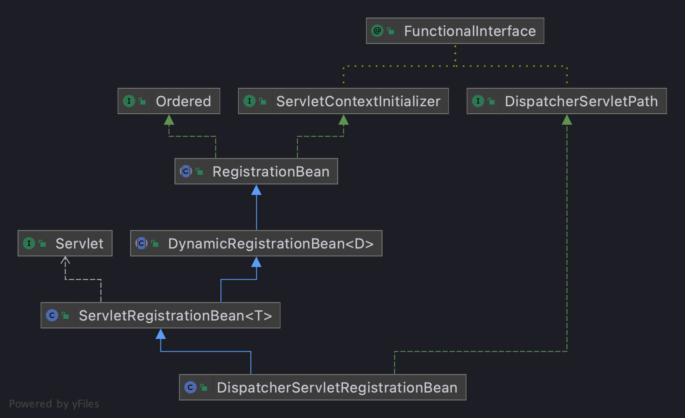
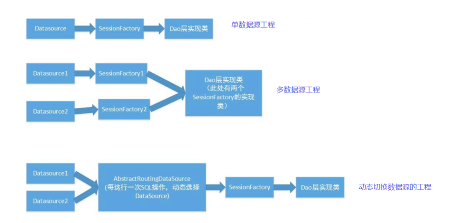
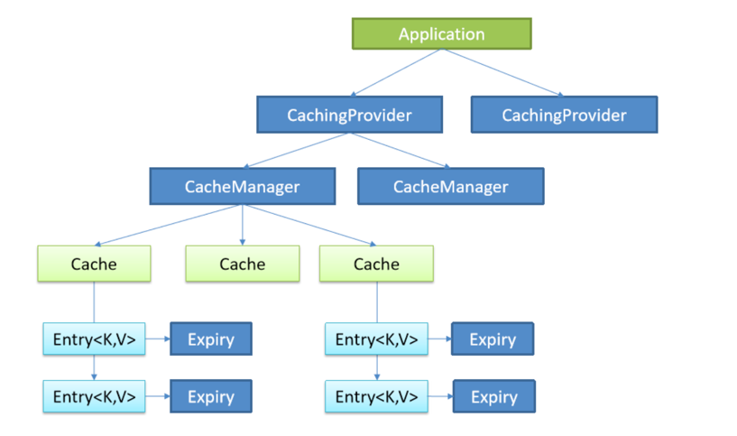
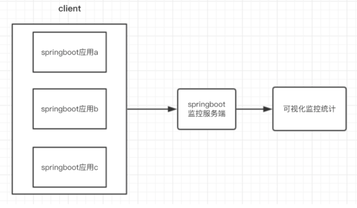

# SpringBoot 高级

## 自定义 Starter

### SpringBoot starter 机制

SpringBoot 中的starter是一种非常重要的机制，能够抛弃以前繁杂的配置，将其统一集成进 starter，
应用者只需要在maven中引入starter依赖，SpringBoot就能自动扫描到要加载的信息并启动相应的默认配置。

starter 让我们摆脱了各种依赖库的处理，需要配置各种信息的困扰。SpringBoot会自动通过classpath路径下的类发现需要的Bean，并注册进IOC容器。
SpringBoot 提供了针对日常企业应用研发各种场景的 spring-boot-starter 依赖模块。
所有这些依赖模块都遵循着约定成俗的默认配置，并允许我们调整这些配置，即遵循“约定大于配置”的理念。

比如我们在springboot里面要引入redis,那么我们需要在pom中引入以下内容

```xml
<dependency>
  <groupId>org.springframework.boot</groupId>
  <artifactId>spring-boot-starter-data-redis</artifactId>
</dependency>
```

这就是一个starter。 简而言之，starter 就是一个外部的项目，我们需要使用它的时候就可以在当前springboot项目中引入它。

**为什么要自定义starter?**

在我们的日常开发工作中，经常会有一些独立于业务之外的配置模块，我们经常将其放到一个特定的包下，然后如果另一个工程需要复用这块功能的时候，需要将代码硬拷贝到另一个工程，重新集成一遍，麻烦至极。
如果我们将这些可独立于业务代码之外的功配置模块封装成一个个starter，复用的时候只需要将其在pom中引用依赖即可，再由SpringBoot为我们完成自动装配，就非常轻松了。

**自定义starter的命名规则**

SpringBoot 提供的starter以`spring-boot-starter-xxx`的方式命名的， 官方建议自定义的starter使用`xxx-spring-boot-starter`命名规则。
以区分SpringBoot生态提供的starter。


### 自定义starter代码实现

**自定义starter**

新建 maven 工程并导入依赖

```xml
<dependencies>
    <dependency>
        <groupId>org.springframework.boot</groupId>
        <artifactId>spring-boot-autoconfigure</artifactId>
        <version>2.2.9.RELEASE</version>
    </dependency>
</dependencies>
```

编写需要自动注入的 JavaBean

```java
@Data
@EnableConfigurationProperties(SimpleBean.class)
@ConfigurationProperties(prefix = "simple.bean")
public class SimpleBean {

    private int id;

    private String name;
}
```

编写自动配置类

```java
@Configuration
public class MyAutoConfiguration {

    static {
        System.out.println("=== MyAutoConfiguration init ===");
    }

    @Bean
    public SimpleBean simpleBean() {
        return new SimpleBean();
    }

}
```

resources下创建/META-INF/spring.factories

```properties
org.springframework.boot.autoconfigure.EnableAutoConfiguration=\
com.mujunlin.config.MyAutoConfiguration
```


> SpringBoot 启动的时候会去加载我们的simpleBean到IOC容器中。这其实是一种变形的SPI机制

**使用starter**

导入自定义starter的依赖

```xml
<dependency>
    <groupId>com.mujunlin</groupId>
    <artifactId>my-spring-boot-starter</artifactId>
    <version>1.0-SNAPSHOT</version>
</dependency>
```

在全局配置文件中配置属性值

```yaml
simple:
  bean:
    id: 102
    name: zhangsan
```

编写测试方法

```java
@Autowired
private SimpleBean simpleBean;

@Test
public void test102() {
    System.out.println(simpleBean);
}
```

### 热插拔技术支持

如果有一天我们不想要启动工程的时候自动装配 SimpleBean 呢? 可能有的同学会想，我们去pom中把依赖注释掉，这的确是一种方案，但未免有点Low。

还记得我们经常会在启动类Application上面加@EnableXXX注解吗?

其实这个`@Enablexxx`注解就是一种热拔插技术，加了这个注解就可以启动对应的 starter，
当不需要对应的 starter 的时候只需要把这个注解注释掉就行，是不是很优雅呢?那么这是如何实现的呢?

1. 添加标记类

```java
public class ConfigMarker {
}
```

2. 添加启用注解

```java
@Target(ElementType.TYPE)
@Retention(RetentionPolicy.RUNTIME)
@Import(ConfigMarker.class)
public @interface EnableRegisterServer {
}
```

3. 在 MyAutoConfiguration 类上添加注解

```java
@ConditionalOnBean(ConfigMarker.class)
```

4. 需要启用时，在核心启动类上添加注解

```java
@EnableRegisterServer
```

> 原理其实很简单，当加了`@EnableRegisterServer`注解的时候，由于这个注解使用了`@Import({ConfigMarker.class})` ，
> 所以Spring会去加载`ConfigMarker`到上下文中，因为条件注解`@ConditionalOnBean(ConfigMarker.class)`的存在，
> 所以`MyAutoConfiguration`类就会被实例化。

## 内嵌Tomcat

SpringBoot 默认支持Tomcat，Jetty，和Undertow作为底层容器。

默认使用Tomcat，一旦引入`spring-boot-starter-web`模块，就默认使用Tomcat容器。

```xml
<dependency>
  <groupId>org.springframework.boot</groupId>
  <artifactId>spring-boot-starter-web</artifactId>
</dependency>
```

### Servlet容器的使用

观察`spring-boot-starter-web`的 POM 文件

```xml
<dependencies>
	<dependency>
		<groupId>org.springframework.boot</groupId>
		<artifactId>spring-boot-starter-tomcat</artifactId>
	</dependency>
	<dependency>
		<groupId>org.springframework.boot</groupId>
		<artifactId>spring-boot-starter-validation</artifactId>
		<exclusions>
			<exclusion>
				<groupId>org.apache.tomcat.embed</groupId>
				<artifactId>tomcat-embed-el</artifactId>
			</exclusion>
		</exclusions>
	</dependency>
	<dependency>
		<groupId>org.springframework</groupId>
		<artifactId>spring-web</artifactId>
	</dependency>
	<dependency>
		<groupId>org.springframework</groupId>
		<artifactId>spring-webmvc</artifactId>
	</dependency>
</dependencies>
```

核心就是引入了， Tomcat 和 SpringMVC 相关的依赖。 因此，默认的 Servlet 容器就是 Tomcat。

**切换servlet容器**

如果想切换其他Servlet容器呢，只需如下两步: 

- 将tomcat依赖移除掉
- 引入其他Servlet容器依赖

```xml
<dependency>
	<groupId>org.springframework.boot</groupId>
	<artifactId>spring-boot-starter-web</artifactId>
	<exclusions>
		<exclusion>
			<!--移除spring-boot-starter-web中的tomcat-->
			<groupId>org.springframework.boot</groupId>
			<artifactId>spring-boot-starter-tomcat</artifactId>
		</exclusion>
	</exclusions>
</dependency>

<!--引入jetty-->
<dependency>
	<groupId>org.springframework.boot</groupId>
	<artifactId>spring-boot-starter-jetty</artifactId>
</dependency>
```


### 自动配置原理

> 问题：SpringBoot 是如何启动内置 Tomcat 的?

**SpringBoot 启动内置 Tomcat 流程**

通过前面的学习已知：SpringBoot 的核心启动类上的注解`@SpringBootApplication`是一个组合注解。组成这个注解的注解中有一个启动自动配置功能的注解
`@EnableAutoConfiguration`，在这个注解中通过`@Import(AutoConfigurationImportSelector.class)`导入了`AutoConfigurationImportSelector`。

系统启动时，首先调用`selectImport()`方法，在该方法中调用了`getAutoConfigurationEntry()`方法，
在之中又调用了`getCandidateConfigurations()`方法，`getCandidateConfigurations()`方法就去`META-INF/spring.factory`配置文件中加载相关配置类。
这个`spring.factories`配置文件是加载的 spring-boot-autoconfigure 的配置文件

配置文件中，有一个重要的配置类`ServletWebServerFactoryAutoConfiguration`是用于加载Servlet Web容器的自动配置类

进入`ServletWebServerFactoryAutoConfiguration`类

```java
@Configuration(proxyBeanMethods = false)
@AutoConfigureOrder(Ordered.HIGHEST_PRECEDENCE)
@ConditionalOnClass(ServletRequest.class)
@ConditionalOnWebApplication(type = Type.SERVLET)
@EnableConfigurationProperties(ServerProperties.class)
@Import({ ServletWebServerFactoryAutoConfiguration.BeanPostProcessorsRegistrar.class,
		ServletWebServerFactoryConfiguration.EmbeddedTomcat.class,
		ServletWebServerFactoryConfiguration.EmbeddedJetty.class,
		ServletWebServerFactoryConfiguration.EmbeddedUndertow.class })
public class ServletWebServerFactoryAutoConfiguration{
    // 略...
}
```

1. `@ConditionalOnClass(ServletRequest.class)@ConditionalOnWebApplication(type = Type.SERVLET)`用于指定加载条件
2. `@EnableConfigurationProperties`用于指定`properties`文件相关信息
3. 最后通过`@Import`注解引入了一个自动配置的注册器和三种Web容器。这也是为什么说 SpringBoot 默认支持这三种容器的原因。

以 Tomcat 为例，我们继续进入`EmbeddedTomcat`当中

```java
@Configuration(proxyBeanMethods = false)
@ConditionalOnClass({ Servlet.class, Tomcat.class, UpgradeProtocol.class })
@ConditionalOnMissingBean(value = ServletWebServerFactory.class, search = SearchStrategy.CURRENT)
static class EmbeddedTomcat {

	@Bean
	TomcatServletWebServerFactory tomcatServletWebServerFactory(
			ObjectProvider<TomcatConnectorCustomizer> connectorCustomizers,
			ObjectProvider<TomcatContextCustomizer> contextCustomizers,
			ObjectProvider<TomcatProtocolHandlerCustomizer<?>> protocolHandlerCustomizers) {
		TomcatServletWebServerFactory factory = new TomcatServletWebServerFactory();
		factory.getTomcatConnectorCustomizers()
				.addAll(connectorCustomizers.orderedStream().collect(Collectors.toList()));
		factory.getTomcatContextCustomizers()
				.addAll(contextCustomizers.orderedStream().collect(Collectors.toList()));
		factory.getTomcatProtocolHandlerCustomizers()
				.addAll(protocolHandlerCustomizers.orderedStream().collect(Collectors.toList()));
		return factory;
	}

}
```

该类会实例化`TomcatServletWebServerFactory`并注入容器中。我们继续观察`TomcatServletWebServerFactory`，其内部的`getWebServer`方法是核心

```java
@Override
public WebServer getWebServer(ServletContextInitializer... initializers) {
	if (this.disableMBeanRegistry) {
		Registry.disableRegistry();
	}
	// 实例化一个 Tomcat
	Tomcat tomcat = new Tomcat();
	// 设置 Tomcat 的临时工作目录
	File baseDir = (this.baseDirectory != null) ? this.baseDirectory : createTempDir("tomcat");
	tomcat.setBaseDir(baseDir.getAbsolutePath());
	// 默认使用 Http11NioProtocol 实例化 Connector
	Connector connector = new Connector(this.protocol);
	connector.setThrowOnFailure(true);
	// 给 service 添加 connector
	tomcat.getService().addConnector(connector);
	customizeConnector(connector);
	tomcat.setConnector(connector);
	// 关闭热部署
	tomcat.getHost().setAutoDeploy(false);
	// 配置 Engine
	configureEngine(tomcat.getEngine());
	for (Connector additionalConnector : this.additionalTomcatConnectors) {
		tomcat.getService().addConnector(additionalConnector);
	}
	prepareContext(tomcat.getHost(), initializers);
	// 实例化Tomcat的WebServer时会将DispatcherServlet和一些Filter添加到Tomcat当中
	return getTomcatWebServer(tomcat);
}
```

继续进入`getTomcatWebServer()`等方法，一直往下跟到 Tomcat 初始化方法，调用`tomcat.start()`方法，tomcat就正式开启运行

```java
private void initialize() throws WebServerException {
	logger.info("Tomcat initialized with port(s): " + getPortsDescription(false));
	synchronized (this.monitor) {
		try {
			// Start the server to trigger initialization listeners
			this.tomcat.start();
			// 略...
		} catch (Exception ex) {
			// 略...
		}
	}
}
```

至此 Tomcat 在 SpringBoot 中的配置以及最终启动的流程就完成了。

**getWebServer()的调用分析**

已知`getWebServer()`方法是内嵌 Tomcat 配置和启动的核心，那么这个方法是什么时候被调用的呢？

我们还是从一切的源头，核心启动类的`run`方法开始

```java
SpringApplication.run(SpringBootTest2Application.class, args);
```

这个方法最终会调用到一个同名方法`run(String... args)`

```java
	public ConfigurableApplicationContext run(String... args) {
		// 记录程序运行时间
		StopWatch stopWatch = new StopWatch();
		stopWatch.start();
		// ConfigurableApplicationContext 是 ApplicationContext 接口的子接口。在ApplicationContext 基础上增加了配置上下文的工具。
		// ConfigurableApplicationContext 是容器的高级接口。
		ConfigurableApplicationContext context = null;
		Collection<SpringBootExceptionReporter> exceptionReporters = new ArrayList<>();
		configureHeadlessProperty();
		// 1、获取并启动监听器
		SpringApplicationRunListeners listeners = getRunListeners(args);
		listeners.starting();
		try {
			ApplicationArguments applicationArguments = new DefaultApplicationArguments(args);
			// 2、构造应用上下文环境
			ConfigurableEnvironment environment = prepareEnvironment(listeners, applicationArguments);
			// 处理需要忽略的 Bean
			configureIgnoreBeanInfo(environment);
			// 打印banner
			Banner printedBanner = printBanner(environment);
			// 3、初始化应用上下文
			context = createApplicationContext();
			// 实例化 SpringBootExceptionReporter类，用来支持报告关于启动的错误
			exceptionReporters = getSpringFactoriesInstances(SpringBootExceptionReporter.class,
					new Class[] { ConfigurableApplicationContext.class }, context);
			// 4、刷新应用上下文前的准备阶段
			prepareContext(context, environment, listeners, applicationArguments, printedBanner);
			// 5、刷新应用上下文
			refreshContext(context);
			// 刷新应用上下文后的扩展接口
			afterRefresh(context, applicationArguments);
			// 时间记录停止
			stopWatch.stop();
			if (this.logStartupInfo) {
				new StartupInfoLogger(this.mainApplicationClass).logStarted(getApplicationLog(), stopWatch);
			}
			// 发布容器启动完成事件
			listeners.started(context);
			callRunners(context, applicationArguments);
		}catch (Throwable ex) {//...}

		try {listeners.running(context);}catch (Throwable ex) {//...}
		return context;
	}
```

在第5步`refreshContext`方法内部，最终会调用到`AbstractApplicationContext#refresh()`方法，
其内部的`onRefresh()`方法会调用到`ServletWebServerApplicationContext#createWebServer`方法

```java
private void createWebServer() {
	WebServer webServer = this.webServer;
	ServletContext servletContext = getServletContext();
	if (webServer == null && servletContext == null) {
		ServletWebServerFactory factory = getWebServerFactory();
		this.webServer = factory.getWebServer(getSelfInitializer());
	}
	else if (servletContext != null) {
		try {
			getSelfInitializer().onStartup(servletContext);
		}
		catch (ServletException ex) {
			throw new ApplicationContextException("Cannot initialize servlet context", ex);
		}
	}
	initPropertySources();
}
```

Tomcat 配置和启动后，我们再次回到`AbstractApplicationContext#refresh()`方法当中，
继续看他的最后一步`finishRefresh`方法，来到`ServletWebServerApplicationContext#finishRefresh`方法当中

```java
@Override
protected void finishRefresh() {
	super.finishRefresh();
	// 启动需要在Tomcat启动时完成启动的Servlet；检查Connector是否都启动完成；打印最终启动完成日志
	WebServer webServer = startWebServer();
	if (webServer != null) {
		publishEvent(new ServletWebServerInitializedEvent(webServer, this));
	}
}
```

我们继续进入`startWebServer`方法，最终来到`TomcatWebServer#start`

```java
@Override
public void start() throws WebServerException {
	synchronized (this.monitor) {
		if (this.started) {
			return;
		}
		try {
			addPreviouslyRemovedConnectors();
			Connector connector = this.tomcat.getConnector();
			if (connector != null && this.autoStart) {
				// 启动需要在Tomcat启动时完成启动的Servlet
				performDeferredLoadOnStartup();
			}
			// 检查Connector是否都启动完成
			checkThatConnectorsHaveStarted();
			this.started = true;
			// 打印最终启动完成日志
			logger.info("Tomcat started on port(s): " + getPortsDescription(true) + " with context path '"
					+ getContextPath() + "'");
		}
		catch (ConnectorStartFailedException ex) {
			stopSilently();
			throw ex;
		}
		catch (Exception ex) {
			PortInUseException.throwIfPortBindingException(ex, () -> this.tomcat.getConnector().getPort());
			throw new WebServerException("Unable to start embedded Tomcat server", ex);
		}
		finally {
			Context context = findContext();
			ContextBindings.unbindClassLoader(context, context.getNamingToken(), getClass().getClassLoader());
		}
	}
}
```

至此，完成`ServletWebServerFactory#getWebServer`方法调用，配置并启动 Tomcat 容器完成。

## 自动配置SpringMVC

在 SpringBoot 项目中我们可以直接使用诸如`@RequestMapping`这类 SpringMVC 注解，可是我们明明没有配置 SpringMVC 为什么就可以直接使用呢？

我们首先回顾一下，在一个普通的 WEB 项目中我们应该如何使用 SpringMVC。我们首先需要在 web.xml 文件中配置如下内容：

```xml
<servlet>
    <description>spring mvc servlet</description>
    <servlet-name>springMvc</servlet-name>
    <servlet-class>org.springframework.web.servlet.DispatcherServlet</servlet-class>
    <load-on-startup>1</load-on-startup>
</servlet>
<servlet-mapping>
    <servlet-name>springMvc</servlet-name>
    <url-pattern>*.do</url-pattern>
</servlet-mapping>
```

在 SpringBoot 项目中，我们没有 web.xml 文件，那么我们如何配置`DispatcherServlet`呢？

Servlet3.0 规范的诞生，为 SpringBoot 彻底去掉 web.xml 奠定了基础。

> 当实现了 Servlet3.0 规范的容器(如Tomcat7及以上)启动时，会通过SPI扩展机制自动扫描所有已添加的jar包下的
> `/META-INF/services/javax.servlet.ServletContainerInitializer`中指定的类，并实例化该类；
> 然后调用实例化对象中的`onStartup`方法。

在 Servlet3.0 规范中，如果要添加一个 servlet，除了可以采用 xml 配置的方式，还可以通过代码的方式：

```java
servletContext.addServlet(name, this.servlet);
```

借此，我们能够动态地往 web 容器中添加一个我们构造好的`DispatcherServlet`对象，从而实现自动装配 SpringMVC。


### 自动配置DispatcherServlet和DispatcherServletRegistry

SpringBoot 的自动配置基于SPI机制，实现自动配置的核心要点就是添加一个自动配置的类，SpringBoot MVC 的自动配置也是相同原理。

我们首先找到 SpringMVC 对应的自动配置类`org.springframework.boot.autoconfigure.web.servlet.DispatcherServletAutoConfiguration`

```java
@AutoConfigureOrder(Ordered.HIGHEST_PRECEDENCE)
@Configuration(proxyBeanMethods = false)
@ConditionalOnWebApplication(type = Type.SERVLET)
@ConditionalOnClass(DispatcherServlet.class)
@AutoConfigureAfter(ServletWebServerFactoryAutoConfiguration.class)
public class DispatcherServletAutoConfiguration{}
```

1. `@Configuration`表名这是一个配置类，将会被spring解析。
2. `@ConditionalOnWebApplication`意味着当时一个web项目，且是`Servlet`项目的时候才会被解析。
3. `@ConditionalOnClass`指明`DispatcherServlet`这个核心类必须存在才解析该类。 
4. `@AutoConfigureAfter`指明在`ServletWebServerFactoryAutoConfiguration`这个类之后再解析，设定了一个顺序。
   (被指的这个类就是前面配置Tomcat容器的自动配置类)

这些注解表明了解析该自动配置类所需的前置条件。

此外，`DispatcherServletAutoConfiguration`类包含了两个内部类，分别是 

1. DispatcherServletConfiguration 
2. DispatcherServletRegistrationConfiguration

前者是用于配置`DispatcherServlet`，后者是用于配置`DispatcherServlet`的注册类。

> 什么是注册类?
> 
> 我们知道`Servlet`实例需要被添加(注册)到如 Tomcat 这样的`ServletContext`中才能够提供请求服务。
> `DispatcherServletRegistrationConfiguration`将生成一个Bean(`DispatcherServletRegistrationBean`)，
> 负责将`DispatcherServlet`注册到`ServletContext`中。

**DispatcherServletConfiguration**

```java
@Configuration(proxyBeanMethods = false)
@Conditional(DefaultDispatcherServletCondition.class)
@ConditionalOnClass(ServletRegistration.class)
@EnableConfigurationProperties({ HttpProperties.class, WebMvcProperties.class })
protected static class DispatcherServletConfiguration {
    // ...
}
```

- `@Conditional`指明了一个前置条件判断，由DefaultDispatcherServletCondition实现。主要是判断了是否已经存在`DispatcherServlet`类，如果没有才会触发解析。

- `@ConditionalOnClass`指明了当`ServletRegistration`类存在的时候才会触发解析，生成的`DispatcherServlet`才能注册到ServletContext中。

- `@EnableConfigurationProperties`将会从`application.properties`这样的配置文件中读取`spring.http`和`spring.mvc`前缀的属性生成配置对象HttpProperties和WebMvcProperties。

再看`DispatcherServletConfiguration`的内部代码

```java
@Bean(name = DEFAULT_DISPATCHER_SERVLET_BEAN_NAME)
public DispatcherServlet dispatcherServlet(HttpProperties httpProperties, WebMvcProperties webMvcProperties) {
	DispatcherServlet dispatcherServlet = new DispatcherServlet();
	dispatcherServlet.setDispatchOptionsRequest(webMvcProperties.isDispatchOptionsRequest());
	dispatcherServlet.setDispatchTraceRequest(webMvcProperties.isDispatchTraceRequest());
	dispatcherServlet.setThrowExceptionIfNoHandlerFound(webMvcProperties.isThrowExceptionIfNoHandlerFound());
	dispatcherServlet.setPublishEvents(webMvcProperties.isPublishRequestHandledEvents());
	dispatcherServlet.setEnableLoggingRequestDetails(httpProperties.isLogRequestDetails());
	return dispatcherServlet;
}

@Bean
@ConditionalOnBean(MultipartResolver.class)
@ConditionalOnMissingBean(name = DispatcherServlet.MULTIPART_RESOLVER_BEAN_NAME)
public MultipartResolver multipartResolver(MultipartResolver resolver) {
	// Detect if the user has created a MultipartResolver but named it incorrectly
	return resolver;
}
```

- `dispatcherServlet`方法将生成一个`DispatcherServlet`的Bean对象，并放到 IoC 容器中。(比较简单，就是获取一个实例，然后添加一些属性设置。)

- `multipartResolver`方法主要是把你配置的`MultipartResolver`的Bean重命名一下，防止你不是用multipartResolver这个名字作为Bean的名字。

**DispatcherServletRegistrationConfiguration**

```java
@Configuration(proxyBeanMethods = false)
@Conditional(DispatcherServletRegistrationCondition.class)
@ConditionalOnClass(ServletRegistration.class)
@EnableConfigurationProperties(WebMvcProperties.class)
@Import(DispatcherServletConfiguration.class)
protected static class DispatcherServletRegistrationConfiguration{
    
    @Bean(name = DEFAULT_DISPATCHER_SERVLET_REGISTRATION_BEAN_NAME)
    @ConditionalOnBean(value = DispatcherServlet.class, name = DEFAULT_DISPATCHER_SERVLET_BEAN_NAME)
    public DispatcherServletRegistrationBean dispatcherServletRegistration(DispatcherServlet dispatcherServlet,
                                                                           WebMvcProperties webMvcProperties, ObjectProvider<MultipartConfigElement> multipartConfig) {
        DispatcherServletRegistrationBean registration = new DispatcherServletRegistrationBean(dispatcherServlet,
                webMvcProperties.getServlet().getPath());
        registration.setName(DEFAULT_DISPATCHER_SERVLET_BEAN_NAME);
        registration.setLoadOnStartup(webMvcProperties.getServlet().getLoadOnStartup());
        multipartConfig.ifAvailable(registration::setMultipartConfig);
        return registration;
    }
}
```

首先我们来看类的声明：

- `@Conditional`指明了一个前置判断，由DispatcherServletRegistrationCondition实现。主要判断了注册类`dispatcherServletRegistration`的Bean是否存在。

- `@ConditionOnClass`判断了`ServletRegistration`是否存在
  
- `@EnableConfigurationProperties`生成了WebMvcProperties的属性对象 
  
- `@Import`导入了`DispatcherServletConfiguration`，也就是我们上面的配置对象。

我们再看类的内部内容：

内部只有一个方法，生成了`DispatcherServletRegistrationBean`。
核心逻辑就是实例化了一个Bean，设置了一些参数，如dispatcherServlet、loadOnStartup等。

> 需要注意一点：在内部方法上声明了一个`@ConditionalOnBean`，表示需要这个方法的执行依赖于这个Bean；
> 一般来说也就是说明这个方法就是为上面声明的这个Bean服务的。

**总结**

SpringBoot MVC 的自动配置类是`DispatcherServletAutoConfiguration`，主要做了两件事: 

1. 配置DispatcherServlet 
2. 配置DispatcherServlet的注册Bean(DispatcherServletRegistrationBean)

### 注册 DispatcherServlet 到 ServletContext

已知`DispatcherServlet`和`DispatcherServletRegistrationBean`这两个Bean的自动配置。

`DispatcherServlet`我们很熟悉，而`DispatcherServletRegistrationBean`主要负责将`DispatcherServlet`注册到`ServletContext`当中。


**注册 DispatcherServlet 流程**

既然该类的职责是负责注册DispatcherServlet，那么我们需要知道什么时候触发注册操作。
为此，我们先看看`DispatcherServletRegistrationBean`这个类的类图



我们从他的顶级接口`ServletContextInitializer`开始

```java
@FunctionalInterface
public interface ServletContextInitializer {
	void onStartup(ServletContext servletContext) throws ServletException;
}
```

继续进入其实现——`RegistrationBean#onStartup`中

```java
@Override
public final void onStartup(ServletContext servletContext) throws ServletException {
    // 判断当前到底是一个 filter，还是 servlet，还是listener
	String description = getDescription();
	if (!isEnabled()) {
		logger.info(StringUtils.capitalize(description) + " was not registered (disabled)");
		return;
	}
	register(description, servletContext);
}
```

我们继续跟进`register`方法，最终来到`DynamicRegistrationBean#register`中

```java
@Override
protected final void register(String description, ServletContext servletContext) {
	D registration = addRegistration(description, servletContext);
	if (registration == null) {
		logger.info(StringUtils.capitalize(description) + " was not registered (possibly already registered?)");
		return;
	}
	configure(registration);
}
```

继续进入`addRegistration`方法最终来到`ServletRegistrationBean#addRegistration`

```java
@Override
protected ServletRegistration.Dynamic addRegistration(String description, ServletContext servletContext) {
	String name = getServletName();
	return servletContext.addServlet(name, this.servlet);
}
```

其内部代码十分简单：直接将`DispatcherServlet`给add到了`servletContext`当中。

至此，完成 DispatcherServlet 的注册工作。

**SpringBoot 启动流程中具体体现**

我们现在已知在`ServletContextInitializer#onStartup`方法中，最终会将 dispatcherServlet 注册到 servletContext 当中，
那么这个方法在 SpringBoot 启动过程的什么时间节点调用的呢？

我们再次回到获取 Tomcat 的地方`ServletWebServerApplicationContext#createWebServer`方法当中

```java
ServletWebServerFactory factory = getWebServerFactory();
this.webServer = factory.getWebServer(getSelfInitializer());
```

我们只关注最核心的这两行，进入`getSelfInitializer`方法当中

```java
private void selfInitialize(ServletContext servletContext) throws ServletException {
	prepareWebApplicationContext(servletContext);
	registerApplicationScope(servletContext);
	WebApplicationContextUtils.registerEnvironmentBeans(getBeanFactory(), servletContext);
	for (ServletContextInitializer beans : getServletContextInitializerBeans()) {
		beans.onStartup(servletContext);
	}
}
```

在`beans.onStartup(servletContext);`的这一行代码中，最终调用了`ServletContextInitializer#onStartup`方法。

**总结**

SpringBoot 自动装配 SpringMVC 其实就是往ServletContext中加入了一个 DispatcherServlet。 
Servlet3.0 规范中有这个说明，除了可以动态加入`Servlet`还可以动态加`Listener`和`Filter`

- `public ServletRegistration.Dynamic addServlet(String servletName, Servlet servlet);` 
- `public FilterRegistration.Dynamic addFilter(String filterName, Class <? extends Filter> filterClass);`
- `public void addListener(Class <? extends EventListener> listenerClass);`

## SpringBoot数据访问

### 简单使用

添加数据库驱动依赖

```xml
<dependency>
    <groupId>mysql</groupId>
    <artifactId>mysql-connector-java</artifactId>
    <scope>runtime</scope>
</dependency>
```

配置数据库连接

```properties
spring.datasource.driver-class-name=com.mysql.cj.jdbc.Driver
spring.datasource.url=jdbc:mysql:///springboot?useUnicode=true&characterEncoding=utf-8&useSSL=true&serverTimezone=UTC
spring.datasource.username=root
spring.datasource.password=root
```

添加spring-boot-starter-jdbc依赖

```xml
<dependency>
    <groupId>org.springframework.boot</groupId>
    <artifactId>spring-boot-starter-jdbc</artifactId>
</dependency>
```

添加测试方法

```java
@RunWith(SpringRunner.class)
@SpringBootTest
class SpringbootTestDataApplicationTests {

    @Autowired
    private DataSource dataSource;

    @Test
    public void contextLoads() throws SQLException {
        Connection connection = dataSource.getConnection();
        System.out.println(connection);
    }

}
```

**切换数据库连接池**

SpringBoot提供了三种数据库连接池: HikariCP、CommonsDBCP2、Tomcat JDBC Connection Pool

其中spring boot2.x版本默认使用HikariCP，maven中配置如下:

```xml
<dependency>
    <groupId>mysql</groupId>
    <artifactId>mysql-connector-java</artifactId>
</dependency>
```

如果不使用HikariCP，而改用Commons DBCP2，则配置如下:

```xml
<dependency>
    <groupId>org.apache.commons</groupId>
    <artifactId>commons-dbcp2</artifactId>
</dependency>
<dependency>
    <groupId>org.springframework.boot</groupId>
    <artifactId>spring-boot-starter-jdbc</artifactId>
    <exclusions>
        <exclusion>
            <groupId>com.zaxxer</groupId>
            <artifactId>HikariCP</artifactId>
        </exclusion>
    </exclusions>
</dependency>
```

> 还是同样的套路，排除默认添加的依赖，然后添加新的依赖。

同样方法也可切换至 Tomcat JDBC Connection Pool

```xml
<dependency>
    <groupId>org.apache.tomcat</groupId>
    <artifactId>tomcat-jdbc</artifactId>
</dependency>
<dependency>
    <groupId>org.springframework.boot</groupId>
    <artifactId>spring-boot-starter-jdbc</artifactId>
    <exclusions>
        <exclusion>
            <groupId>com.zaxxer</groupId>
            <artifactId>HikariCP</artifactId>
        </exclusion>
    </exclusions>
</dependency>
```

### 数据源自动配置

> 问题: 为什么说 SpringBoot 默认使用的连接池类型是HikariCP，在哪里指定的?

我们还是首先从`spring.factories`中找到数据源的配置类`org.springframework.boot.autoconfigure.jdbc.DataSourceAutoConfiguration`

该类内部首先有两个内部类：`EmbeddedDatabaseConfiguration`和`PooledDataSourceConfiguration`。我们主要关注`PooledDataSourceConfiguration`

```java
@Configuration(proxyBeanMethods = false)
@Conditional(PooledDataSourceCondition.class)
@ConditionalOnMissingBean({ DataSource.class, XADataSource.class })
@Import({ DataSourceConfiguration.Hikari.class, DataSourceConfiguration.Tomcat.class,
		DataSourceConfiguration.Dbcp2.class, DataSourceConfiguration.Generic.class,
		DataSourceJmxConfiguration.class })
protected static class PooledDataSourceConfiguration {

}
```

1. `@Conditional(PooledDataSourceCondition.class)`指明了加载的条件，进入这个条件类会发现，就是看是否有指定属性`spring.datasource.type=`，指定数据库连接池的类型。
   （如果没有指定，会有默认值。）
2. `@Import`注解指明了会导入的类。而它们都是`DataSourceConfiguration`的子类。
   进入该类当中，他有四个子类。前面三个都很熟悉，就是 SpringBoot 默认支持的三种数据库连接池。
   而最后一个子类`Generic`则表示自定义的连接池类型，如 Druid 连接池。

他的三个子类都是很相似的，我们以`Hikari`为例：

```java
@Configuration(proxyBeanMethods = false)
@ConditionalOnClass(HikariDataSource.class)
@ConditionalOnMissingBean(DataSource.class)
@ConditionalOnProperty(name = "spring.datasource.type", havingValue = "com.zaxxer.hikari.HikariDataSource",
		matchIfMissing = true)
static class Hikari {

	@Bean
	@ConfigurationProperties(prefix = "spring.datasource.hikari")
	HikariDataSource dataSource(DataSourceProperties properties) {
		HikariDataSource dataSource = createDataSource(properties, HikariDataSource.class);
		if (StringUtils.hasText(properties.getName())) {
			dataSource.setPoolName(properties.getName());
		}
		return dataSource;
	}

}
```

1. 前面三行都是指明这是配置类和指明了加载的条件，注意看第四行，和刚刚一样，也是看是否有指定`spring.datasource.type`属性。
   而关键就在于最后一句，`matchIfMissing = true`表明如果没有指定该属性的话，默认是生效。这也是为什么前面说没有指定的话，会有默认值。
   
2. 该类的内部只有一个方法，返回了一个 Bean : `HikariDataSource`。
   他上面的`@ConfigurationProperties(prefix = "spring.datasource.hikari")`表明可以使用此前缀为这个Bean添加属性。
   
3. 再来看这个方法的内部，关键就是`createDataSource(properties, HikariDataSource.class);`方法，我们进入其中：

```java
protected static <T> T createDataSource(DataSourceProperties properties, Class<? extends DataSource> type) {
	// 使用 DataSource 建造数据源；利用反射创建type数据源；绑定相关属性
	return (T) properties.initializeDataSourceBuilder().type(type).build();
}
```

我们逐一来看这三个方法

```java
public DataSourceBuilder<?> initializeDataSourceBuilder() {
	return DataSourceBuilder.create(getClassLoader()).type(getType()).driverClassName(determineDriverClassName())
			.url(determineUrl()).username(determineUsername()).password(determinePassword());
}
```

```java
public <D extends DataSource> DataSourceBuilder<D> type(Class<D> type) {
	this.type = type;
	return (DataSourceBuilder<D>) this;
}
```

```java
// 根据类型创建 Datasource 并返回
public T build() {
	Class<? extends DataSource> type = getType();
	DataSource result = BeanUtils.instantiateClass(type);
	maybeGetDriverClassName();
	bind(result);
	return (T) result;
}
// 获取数据库连接池的类型
private Class<? extends DataSource> getType() {
	Class<? extends DataSource> type = (this.type != null) ? this.type : findType(this.classLoader);
	if (type != null) {
		return type;
	}
	throw new IllegalStateException("No supported DataSource type found");
}
// 如果当前 type 未设置的话，默认从下面数组中挨个尝试创建，直到成功为止。
// 前面说如果没有配置 type 属性，会有默认值。其实不准确，应该说没有配置进入默认的创建数据库连接池的方法，
// 具体创建什么类型的数据库连接池还是看这个默认的 DATA_SOURCE_TYPE_NAMES 数组
public static Class<? extends DataSource> findType(ClassLoader classLoader) {
	for (String name : DATA_SOURCE_TYPE_NAMES) {
		try {
			return (Class<? extends DataSource>) ClassUtils.forName(name, classLoader);
		}
		catch (Exception ex) {
			// Swallow and continue
		}
	}
	return null;
}
// 默认的数据库连接池类型集合
private static final String[] DATA_SOURCE_TYPE_NAMES = new String[] { "com.zaxxer.hikari.HikariDataSource",
		"org.apache.tomcat.jdbc.pool.DataSource", "org.apache.commons.dbcp2.BasicDataSource" };
```

三个方法使用 DataSource 建造数据源，然后利用反射创建type数据源，绑定相关属性，最终返回实例化的 DataSource 并存入 Spring 容器中。

> 2.0 之后不再默认使用Tomcat连接池，默认开始使用 Hikari 连接池

### 使用 Druid 连接池

添加依赖

```xml
<dependency>
    <groupId>com.alibaba</groupId>
    <artifactId>druid-spring-boot-starter</artifactId>
    <version>1.1.10</version>
</dependency>
```

> SpringBoot 官方没有对此数据库连接池做整合，因此需要手动指定版本号

配置文件中引入相关依赖

```properties
# 指定数据库连接池类型
spring.datasource.type=com.alibaba.druid.pool.DruidDataSource

spring.datasource.druid.initial-size=5
```

**番外**

如果希望使用`spring.datasource.xx`这类 Spring 原生与数据源相关的属性配置，可以添加如下类使`DruidDataSource`接收原生属性配置的属性

```java
@Configuration
public class DruidConfig {
    @Bean
    @ConfigurationProperties(prefix = "spring.datasource")
    public DataSource dataSource() {
        return new DruidDataSource();
    }
}
```


### SpringBoot与MyBatis

MyBatis 是一款优秀的持久层框架，SpringBoot 官方虽然没有对MyBatis进行整合，但是MyBatis团队自行适配了对应的启动器，进一步简化了使用MyBatis进行数据的操作。

因为 SpringBoot 框架开发的便利性，所以实现 SpringBoot 与数据访问层框架(例如 MyBatis)的整合非常简单，主要是引入对应的依赖启动器，并进行数据库相关参数设置即可

```xml
<dependency>
    <groupId>org.mybatis.spring.boot</groupId>
    <artifactId>mybatis-spring-boot-starter</artifactId>
    <version>1.3.2</version>
</dependency>
```

**Mybatis自动配置源码分析**

还是老方法，我们首先找到`spring.factories`中指定的自动配置类`org.mybatis.spring.boot.autoconfigure.MybatisAutoConfiguration`

首先来看这个自动配置类的声明

```java
@org.springframework.context.annotation.Configuration
@ConditionalOnClass({ SqlSessionFactory.class, SqlSessionFactoryBean.class })
@ConditionalOnBean(DataSource.class)
@EnableConfigurationProperties(MybatisProperties.class)
@AutoConfigureAfter(DataSourceAutoConfiguration.class)
public class MybatisAutoConfiguration {
    // ...
}
```

类的声明上面没有什么特殊的，无非就是指明了加载的条件、使用的配置文件和加载的顺序（需要在`DataSourceAutoConfiguration`加载后加载）。

再来看类的内部，类的内部主要关注两个标注了`@Bean`注解的方法：`sqlSessionFactory`和`sqlSessionTemplate`

1. `sqlSessionFactory`方法主要在内部解析了配置文件，然后通过调用`SqlSessionFactoryBuilder#build`方法并使用配置的数据构建一个`DefaultSqlSessionFactory`并返回。

2. `sqlSessionTemplate`方法则主要创建了一个`SqlSessionTemplate`对象并返回。这个类同样实现了`SqlSession`接口，相较于`DefaultSqlSession`他是线程安全的。

至此，已经完成了`sqlSessionFactory`和`sqlSessionTemplate`的实例化和注册。那么，给Mapper接口创建代理对象并存入容器中是如何实现的呢？

已知，`@MapperScan(basePackages = “com.mybatis.mapper”)`指定了包扫描的路径，那么我们就从此注解开始

我们先来看注解的声明

```java
@Retention(RetentionPolicy.RUNTIME)
@Target(ElementType.TYPE)
@Documented
@Import(MapperScannerRegistrar.class)
public @interface MapperScan {
    // ...
}
```

注解的声明上没有什么特别的，主要就是导入了`MapperScannerRegistrar`。
由于`MapperScannerRegistrar`实现了`ImportBeanDefinitionRegistrar`接口，Spring在实例化之前会调用到`registerBeanDefinitions`方法。

在`registerBeanDefinitions`方法中，获取到了`@MapperScan`所有的注解属性，然后创建了一个`scanner`扫描对象，并将注解标注的属性赋值给这个扫描对象。
然后调用了`scanner.doScan(StringUtils.toStringArray(basePackages));`方法。

```java
@Override
public Set<BeanDefinitionHolder> doScan(String... basePackages) {
  Set<BeanDefinitionHolder> beanDefinitions = super.doScan(basePackages);

  if (beanDefinitions.isEmpty()) {
    logger.warn("No MyBatis mapper was found in '" + Arrays.toString(basePackages) + "' package. Please check your configuration.");
  } else {
    processBeanDefinitions(beanDefinitions);
  }

  return beanDefinitions;
}
```

首先调用了父类的`doScan`方法，扫描到了所有的Mapper接口，并封装成`BeanDefinition`然后存入`beanDefinitionMap`中。
然后返回封装了`BeanDefinition`的`BeanDefinitionHolder`集合调用`processBeanDefinitions`进行后置处理。

这个方法中有一行：

```java
definition.setBeanClass(this.mapperFactoryBean.getClass());
```

执行完这一行后，将mapper的Bean类设置为了`MapperFactoryBean`。MapperFactoryBean实现了FactoryBean接口，所以当Spring从待实例化的Bean容器中遍历到这个Bean并开始执行实例化时，
返回的对象实际上是getObject方法中返回的对象。我们来看他的`getObject()`方法：

```java
@Override
public T getObject() throws Exception {
  return getSqlSession().getMapper(this.mapperInterface);
}
// 我们继续进入 getMapper 方法
@Override
public <T> T getMapper(Class<T> type) {
  return getConfiguration().getMapper(type, this);
}
// 继续进入
public <T> T getMapper(Class<T> type, SqlSession sqlSession) {
  return mapperRegistry.getMapper(type, sqlSession);
}
// 继续进入
public <T> T getMapper(Class<T> type, SqlSession sqlSession) {
  final MapperProxyFactory<T> mapperProxyFactory = (MapperProxyFactory<T>) knownMappers.get(type);
  if (mapperProxyFactory == null) {
    throw new BindingException("Type " + type + " is not known to the MapperRegistry.");
  }
  try {
    // 代理对象创建成功  
    return mapperProxyFactory.newInstance(sqlSession);
  } catch (Exception e) {
    throw new BindingException("Error getting mapper instance. Cause: " + e, e);
  }
}
```

此处的`this.mapperInterface`就是当前Mapper接口。至此，代理对象创建完成。


### 动态数据源切换

**动态数据源介绍**

业务背景

电商订单项目分正向和逆向两个部分: 
其中正向数据库记录了订单的*基本信息*，包括订单基本信息、订单商品信息、优惠券信息、发票信息、账期信息、结算信息、订单备注信息、收货人信息 等;
逆向数据库主要包含了商品的退货信息和维修信息。
数据量超过500万行就要考虑分库分表和读写分离，那么我们在正向操作和逆向操作的时候，就需要动态的切换到相应的数据库，进行相关的操作。

解决思路

现在项目的结构设计基本上是基于MVC的，那么数据库的操作集中在dao层完成，业务逻辑集中在service层处理，controller层处理请求。
假设在执行dao层代码之前能够将数据源(DataSource)换成我们想要执行操作的数据源，那么这个问题就解决了。

原理

Spring内置了一个`AbstractRoutingDataSource`，它可以把多个数据源配置成一个Map，然后根据不同的key返回不同的数据源。
因为`AbstractRoutingDataSource`也实现了`DataSource`接口，因此应用程序可以先设置好key， 
访问数据库的代码就可以从`AbstractRoutingDataSource`拿到对应的真实的数据源，从而访问指定的数据库。




**AbstractRoutingDataSource**

首先看源码

```java
public abstract class AbstractRoutingDataSource extends AbstractDataSource implements InitializingBean {

   @Nullable
   private Map<Object, Object> targetDataSources;

   @Nullable
   private Object defaultTargetDataSource;

   private boolean lenientFallback = true;

   private DataSourceLookup dataSourceLookup = new JndiDataSourceLookup();

   @Nullable
   private Map<Object, DataSource> resolvedDataSources;

   @Nullable
   private DataSource resolvedDefaultDataSource;
   
   // 方法略...
}
```

1. 该抽象类继承了`AbstractDataSource`，而这个类实现了`DataSource`接口，因此该类也是一个标准的数据源。
2. `targetDataSources`存放了多数据源，`resolvedDataSources`是被转换成数据源后的Map。（也就是说这两个Map的内容实质上是一样的，只是一个原始数据，一个是转换成数据源对象后的）
3. `defaultTargetDataSource`存放了默认数据源对象。

再看类内部的一个重要方法 `getConnection`

```java
@Override
public Connection getConnection() throws SQLException {
	return determineTargetDataSource().getConnection();
}
```

继续关注determineTargetDataSource

```java
protected DataSource determineTargetDataSource() {
	Assert.notNull(this.resolvedDataSources, "DataSource router not initialized");
	Object lookupKey = determineCurrentLookupKey();
	DataSource dataSource = this.resolvedDataSources.get(lookupKey);
	if (dataSource == null && (this.lenientFallback || lookupKey == null)) {
		dataSource = this.resolvedDefaultDataSource;
	}
	if (dataSource == null) {
		throw new IllegalStateException("Cannot determine target DataSource for lookup key [" + lookupKey + "]");
	}
	return dataSource;
}
```

可以发现就是从`resolvedDataSources`中根据`key`取出了对应的数据源对象。因此，获取这个key的`determineCurrentLookupKey`是关键。

我们可以通过覆盖该方法从而实现数据源动态切换。那么现在的问题就是如何存储动态选择的key，在调用`determineCurrentLookupKey`方法的时候返回呢？

在Servlet的线程模型中，推荐使用ThreadLocal存储key。

**简单实现**

首先准备MVC的基础环境。基础环境准备完成后，首先添加多数据源的配置

```properties
spring.druid.datasource.master.password=root
spring.druid.datasource.master.username=root
spring.druid.datasource.master.jdbc-url=jdbc:mysql://localhost:3306/product_master?useUnicode=true&characterEncoding=utf-8&useSSL=true&serverTimezone=UTC
spring.druid.datasource.master.driver-class-name=com.mysql.cj.jdbc.Driver

spring.druid.datasource.slave.password=root
spring.druid.datasource.slave.username=root
spring.druid.datasource.slave.jdbc-url=jdbc:mysql://localhost:3306/product_slave?useUnicode=true&characterEncoding=utf-8&useSSL=true&serverTimezone=UTC
spring.druid.datasource.slave.driver-class-name=com.mysql.cj.jdbc.Driver
```

然后向Spring容器中注入`DataSource`实例对象

```java
@Slf4j
@Configuration
public class MyDataSourceConfiguration {

    @Bean("masterDataSource")
    @ConfigurationProperties(prefix = "spring.druid.datasource.master")
    DataSource masterDataSource() {
        log.info("create master datasource...");
        return DataSourceBuilder.create().build();
    }

    @Bean("slaveDataSource")
    @ConfigurationProperties(prefix = "spring.druid.datasource.slave")
    DataSource slaveDataSource() {
        log.info("create slave datasource...");
        return DataSourceBuilder.create().build();
    }
}
```

同时排除SpringBoot自动配置

```java
@SpringBootApplication(exclude = {
        DataSourceAutoConfiguration.class
})
```

添加`AbstractRoutingDataSource`的子类并覆盖`determineCurrentLookupKey`方法，实现数据源动态切换

```java
public class RoutingDataSource extends AbstractRoutingDataSource {

    @Override
    protected Object determineCurrentLookupKey() {
        return "masterDataSource";
    }

}
```

在注入`DataSource`的自定义自动配置类中添加主数据源配置

```java
@Bean
@Primary    // 当前配置类将返回多个 Datasource 对象，那么以谁为主呢？使用此注解
DataSource primaryDataSource(
        @Autowired @Qualifier("masterDataSource") DataSource masterDataSource,
        @Autowired @Qualifier("slaveDataSource") DataSource slaveDataSource) {
    log.info("create routing datasource...");
    Map<Object, Object> map = new HashMap<>();
    map.put("masterDataSource", masterDataSource);
    map.put("slaveDataSource", slaveDataSource);
    RoutingDataSource routing = new RoutingDataSource();
    routing.setTargetDataSources(map);
    routing.setDefaultTargetDataSource(masterDataSource);
    return routing;
}
```

当前，自定义的数据源自动配置类注入的主数据源是一个`RoutingDataSource`；
具体使用哪一个数据源，会通过调用`AbstractRoutingDataSource`子类的`determineCurrentLookupKey`方法决定。

而当前这个方法直接返回了`"masterDataSource"`显然是不行的。前面已经说过，对于 Servlet 线程模型的应用，推荐使用 ThreadLocal 保存key值。

接下来我们添加`RoutingDataSourceContext`用于保存key值。

```java
public class RoutingDataSourceContext {
    public static final ThreadLocal<String> local = new ThreadLocal<>();
    // key : 指定数据源类型 master/slave
    public RoutingDataSourceContext(String key) {
        local.set(key);
    }
    public static String getDataSourceRoutingKey() {
        String key = local.get();
        return key == null ? "masterDataSource" : key;
    }
    public void close() {
        local.remove();
    }
}
```

同时修改获取key的方法

```java
@Override
protected Object determineCurrentLookupKey() {
    return RoutingDataSourceContext.getDataSourceRoutingKey();
}
```

在Controller方法中使用RoutingDataSourceContext

```java
@GetMapping("/findAllProductM")
public String findAllProductM() {
    String key = "masterDataSource";
    RoutingDataSourceContext routingDataSourceContext = new RoutingDataSourceContext(key);
    productService.findAllM();
    return "master";
}
```

**优化：使用注解声明方式**

Spring提供的声明式事务管理，就只需要一个 @Transactional() 注解，放在某个Java方法上，这个方法就自动具有了事务。
我们也可以编写一个类似的`@RoutingWith("slaveDataSource")`注解，放到某个Controller的方法上，这个方法内部就自动选择了对应的数据源。

添加注解类

```java
@Target(ElementType.METHOD)
@Retention(RetentionPolicy.RUNTIME)
public @interface RoutingWith {

    String value() default "masterDataSource";

}
```

添加切面

```java
@Aspect
@Component
public class RoutingAspect {
    @Around("@annotation(routingWith)")
    public Object routingWithDatasource(ProceedingJoinPoint joinPoint, RoutingWith routingWith) throws Throwable {
        String key = routingWith.value();
        RoutingDataSourceContext routingDataSourceContext = new RoutingDataSourceContext(key);
        return joinPoint.proceed();
    }
}
```

使用注解

```java
@GetMapping("/findAllProductM")
@RoutingWith("masterDataSource")
public String findAllProductM() {
    productService.findAllM();
    return "master";
}
```

## SpringBoot 缓存

### JSR107

JSR是 Java Specification Requests 的缩写，Java规范请求。
故名思议提交Java规范，JSR-107就是关于如何使用缓存的规范，是java提供的一个接口规范，类似于JDBC规范，没有具体的实现，具体的实现就是Redis等这些缓存。

Java Caching(JSR-107)定义了5个核心接口，分别是CachingProvider、CacheManager、 Cache、Entry和Expiry。

- CachingProvider(缓存提供者): 创建、配置、获取、管理和控制多个CacheManager。
  
- CacheManager(缓存管理器): 创建、配置、获取、管理和控制多个唯一命名的Cache，Cache存在于CacheManager的上下文中。
  一个CacheManager仅对应一个CachingProvider。
  
- Cache(缓存): 由CacheManager进行管理，CacheManager管理Cache的生命周期。
  Cache存在于CacheManager的上下文中，是一个类似map的数据结构，并临时存储以key为索引的值。
  一个Cache仅被一个CacheManager所拥有 
  
- Entry(缓存键值对): 是一个存储在Cache中的key-value对(简单理解就是Cache中的一条数据)
  
- Expiry(缓存时效):每一个存储在Cache中的条目都有一个定义的有效期。
  一旦超过这个时间，条目就自动过期，过期后，条目将不可以访问、更新和删除操作。
  缓存有效期可以通过ExpiryPolicy设置



一个应用里面可以有多个缓存提供者(CachingProvider)，一个缓存提供者可以获取到多个缓存管理器(CacheManager)，
一个缓存管理器管理着不同的缓存(Cache)，缓存中是一个个的缓存键值对(Entry)，每个entry都有一个有效期(Expiry)。

> 缓存管理器和缓存之间的关系，有点类似于数据库中连接池和连接的关系。

使用JSR-107需导入依赖

```xml
<dependency>
    <groupId>javax.cache</groupId>
    <artifactId>cache-api</artifactId>
</dependency>
```

### Spring的缓存抽象

**缓存抽象定义**

Spring从3.1开始定义了`org.springframework.cache.Cache`和`org.springframework.cache.CacheManager`接口来统一不同的缓存技术;
并支持使用`Java Caching(JSR-107)`注解简化我们进行缓存开发。
Spring Cache 只负责维护抽象层，具体的实现由自己的技术选型来决定。将缓存处理和缓存技术解除耦合。

每次调用需要缓存功能的方法时，Spring会检查指定参数的指定的目标方法是否已经被调用过，
如果有就直接从缓存中获取方法调用后的结果，如果没有就调用方法并缓存结果后返回给用户，下次调用直接从缓存中获取。

使用Spring缓存抽象时我们需要关注以下两点:

1. 确定那些方法需要被缓存

2. 缓存策略

**重要接口**

- Cache:缓存抽象的规范接口，缓存实现有:RedisCache、EhCache、ConcurrentMapCache等 
  
- CacheManager:缓存管理器，管理Cache的生命周期

### Spring缓存使用

先介绍下Spring提供的重要缓存注解及几个重要概念:

概念/注解|作用
---|---
Cache|缓存接口，定义缓存操作。实现有:RedisCache、EhCacheCache、 ConcurrentMapCache等
CacheManager|缓存管理器，管理各种缓存(Cache)组件 
`@Cacheable`|主要针对方法配置，能够根据方法的请求参数对其结果进行缓存。【缓存查询】
`@CacheEvict`|清空缓存。【执行了标注该注解的方法，会清空缓存】
`@CachePut`|保证方法被调用，又希望结果被缓存。【缓存更新】
`@EnableCaching`|开启基于注解的缓存【这个注解是前面三个注解生效的前提】
keyGenerator|缓存数据时key生成策略
serialize|缓存数据时value序列化策略


> 注意：
> 
> `@Cacheable`标注在方法上，表示该方法的结果需要被缓存起来，缓存的键由keyGenerator的策略决定，缓存的值的形式则由serialize序列化策略决定(序列化还是json格式);
>  标注上该注解后，在缓存时效内再次调用该方法时将不会调用方法本身而是直接从缓存获取结果。
> 
>  `@CachePut`也标注在方法上，和`@Cacheable`相似也会将方法的返回值缓存起来，
>  不同的是标注@CachePut的方法每次都会被调用，而且每次都会将结果缓存起来，适用于对象的更新

**@Cacheable初体验**

1. 开启基于注解的缓存功能:主启动类标注`@EnableCaching`

```java
@SpringBootApplication
@EnableCaching
public class SpringbootTestDataApplication {
    public static void main(String[] args) {
        SpringApplication.run(SpringbootTestDataApplication.class, args);
    }
}
```

2. 标注缓存相关注解:`@Cacheable`、`@CacheEvict`、`@CachePut`

`@Cacheable`: 将方法运行的结果进行缓存，以后再获取相同的数据时，直接从缓存中获取，不再调用方法。

**@Cacheable注解的属性**

属性名|描述
---|---
cacheNames/value|指定缓存的名字，缓存使用CacheManager管理多个缓存组件 Cache，这些Cache组件就是根据这个名字进行区分的。对缓存的真 正CRUD操作在Cache中定义，每个缓存组件Cache都有自己唯一的 名字，通过cacheNames或者value属性指定，相当于是将缓存的键 值对进行分组，缓存的名字是一个数组，也就是说可以将一个缓存 键值对分到多个组里面
key|缓存数据时的key的值，默认是使用方法参数的值，可以使用SpEL表 达式计算key的值
keyGenerator|缓存的生成策略，和key二选一，都是生成键的，keyGenerator可自定义
cacheManager|指定缓存管理器(如ConcurrentHashMap、Redis等)
cacheResolver|和cacheManager功能一样，和cacheManager二选一
condition|指定缓存的条件(满足什么条件时才缓存)，可用SpEL表达式(如 #id>0，表示当入参id大于0时才缓存)
unless|否定缓存，即满足unless指定的条件时，方法的结果不进行缓存。使用unless时可以在调用的方法获取到结果之后再进行判断(如 #result==null，表示如果结果为null时不缓存)
sync|是否使用异步模式进行缓存

> 注意:   
> 
> 既满足condition又满足unless条件的也不进行缓存   
> 
> 使用异步模式进行缓存时(sync=true):unless条件将不被支持 

可用的SpEL表达式见下表:

名字|位置|描述|示例
---|---|---|---
methodName|root object|当前被调用的方法名|#root.methodName
target|root object|当前被调用的目标对象|#root.target
args|root object|当前被调用的方法的参数列表|#root.args[0]
method |root |当前被调用的方法| #root.method.name object
targetClass |root| 当前被调用的目标对象类| root.targetClass object
caches |root object |当前方法调用使用的缓存列表 (如@Cacheable(value= {“cache1”, “cache2”}))，则有两 个cache|#root.caches[0].name
argument name |evaluation context |方法参数的名字，可以直接 # 参数名，也可以使用#p0或#a0 的形式，0代表参数的索引|#iban、#a0、#p0
result |evaluation context|方法执行后的返回值(仅当方法 执行之后的判断有效， 如"unless"，"cache put"的表 达式，"cache evict"的表达式 beforeInvocation=false)|#result

### 缓存自动配置原理源码剖析

看自动配置源码，老方法，我们先找到相关的自动配置类。
缓存相关的自动配置类：`org.springframework.boot.autoconfigure.cache.CacheAutoConfiguration`

关注三件事：

1. 自动配置过程中，完成了那些Bean对象的创建？做了哪些事？
2. 当前缓存对象(Cache)使用的底层数据结构是什么？
3. 添加好使用缓存的注解后，查询流程有什么样的改变？

我们首先看类的声明

```java
@Configuration(proxyBeanMethods = false)
@ConditionalOnClass(CacheManager.class)
@ConditionalOnBean(CacheAspectSupport.class)
@ConditionalOnMissingBean(value = CacheManager.class, name = "cacheResolver")
@EnableConfigurationProperties(CacheProperties.class)
@AutoConfigureAfter({ CouchbaseAutoConfiguration.class, HazelcastAutoConfiguration.class,
		HibernateJpaAutoConfiguration.class, RedisAutoConfiguration.class })
@Import({ CacheConfigurationImportSelector.class, CacheManagerEntityManagerFactoryDependsOnPostProcessor.class })
public class CacheAutoConfiguration {}
```

一些条件和加载时机相关的注解无需过多关注。我们主要关注两个注解`@EnableConfigurationProperties(CacheProperties.class)`和`@Import`

`@EnableConfigurationProperties(CacheProperties.class)`表示可以使用`spring.cache.xxx`注解完成缓存相关的属性注入。

`@Import`注解导入了两个类，我们首先看第一个： `CacheConfigurationImportSelector`

```java
static class CacheConfigurationImportSelector implements ImportSelector {

	@Override
	public String[] selectImports(AnnotationMetadata importingClassMetadata) {
		CacheType[] types = CacheType.values();
		String[] imports = new String[types.length];
		for (int i = 0; i < types.length; i++) {
			imports[i] = CacheConfigurations.getConfigurationClass(types[i]);
		}
		return imports;
	}

}
```

`selectImports`方法执行完成之后，返回的`imports`数组包含了所有支持的缓存的类型的全限定类名列表。

我们随便进入一个，此处以`RedisCacheConfiguration`为例：

```java
@Configuration(proxyBeanMethods = false)
@ConditionalOnClass(RedisConnectionFactory.class)
@AutoConfigureAfter(RedisAutoConfiguration.class)
@ConditionalOnBean(RedisConnectionFactory.class)
@ConditionalOnMissingBean(CacheManager.class)
@Conditional(CacheCondition.class)
class RedisCacheConfiguration {
    // 
}
```

在类声明上添加了许多加载的条件。因此，如果要使这个配置类生效，需要引入Redis相关的依赖。
如果没有特别引入缓存相关的依赖时，默认生效的是：`SimpleCacheConfiguration`

```java
@Configuration(proxyBeanMethods = false)
@ConditionalOnMissingBean(CacheManager.class)
@Conditional(CacheCondition.class)
class SimpleCacheConfiguration {

	@Bean
	ConcurrentMapCacheManager cacheManager(CacheProperties cacheProperties,
			CacheManagerCustomizers cacheManagerCustomizers) {
		ConcurrentMapCacheManager cacheManager = new ConcurrentMapCacheManager();
		List<String> cacheNames = cacheProperties.getCacheNames();
		if (!cacheNames.isEmpty()) {
			cacheManager.setCacheNames(cacheNames);
		}
		return cacheManagerCustomizers.customize(cacheManager);
	}

}
```

该类没有过多的条件注解，会默认生效。

他给 Spring 容器添加了一个Bean，是一个 CacheManager 。至此，缓存自动配置完成。
对于方法的执行过程，不必过多关心，我们来看看注入的这个`ConcurrentMapCacheManager`。

ConcurrentMapCacheManager实现了CacheManager接口。
再来看`ConcurrentMapCacheManager`的getCache方法

> 缓存添加成功后，执行查询的时候，会首先进入 getCache 方法。

```java
@Override
@Nullable
public Cache getCache(String name) {
	Cache cache = this.cacheMap.get(name);
	if (cache == null && this.dynamic) {
		synchronized (this.cacheMap) {
			cache = this.cacheMap.get(name);
			if (cache == null) {
				cache = createConcurrentMapCache(name);
				this.cacheMap.put(name, cache);
			}
		}
	}
	return cache;
}
```

方法执行过程中，如果获取 Cache 对象失败，则会创建一个 ConcurrentMapCache 对象并返回。

> 此处可知，当前的缓存对象的底层数据结构就是：ConcurrentHashMap

我们继续进入返回的`ConcurrentMapCache`对象当中，我们重点关注两个方法

```java
@Override
@Nullable
protected Object lookup(Object key) {
	return this.store.get(key);
}
```

不难理解，就是通过key查询缓存值的。

```java
@Override
public void put(Object key, @Nullable Object value) {
	this.store.put(key, toStoreValue(value));
}
```

put方法，顾名思义就是向缓存中存入数据的。


**@Cacheable运行流程:**

1. 方法运行之前，先去查询Cache(缓存组件)，按照cacheNames指定的名字获取
   (CacheManager先获取相应的缓存，第一次获取缓存如果没有Cache组件会自动创建)

2. 去Cache中查找缓存的内容，使用的key默认就是方法的参数:
   key默认是使用keyGenerator生成的，默认使用的是SimpleKeyGenerator  
   
```java
public static Object generateKey(Object... params) {
	if (params.length == 0) {
		return SimpleKey.EMPTY;
	}
	if (params.length == 1) {
		Object param = params[0];
		if (param != null && !param.getClass().isArray()) {
			return param;
		}
	}
	return new SimpleKey(params);
}
```
> SimpleKeyGenerator生成key的默认策略:
> 
> 如果没有参数:key = new SimpleKey();
> 
> 如果有一个参数:key = 参数的值
> 
> 如果有多个参数:key = new SimpleKey(params);

3. 没有查到缓存就调用目标方法

4. 将目标方法返回的结果放进缓存中

**总结:** 

`@Cacheable`标注的方法在执行之前会先检查缓存中有没有这个数据，默认按照参数的值为key查询缓存，
如果没有就运行方法并将结果放入缓存，以后再来调用时直接使用缓存中的数据。

> 核心
>
> 1、使用`CacheManager(ConcurrentMapCacheManager)`按照名字得到`Cache(ConcurrentMapCache)`组件
>
> 2、key使用keyGenerator生成，默认使用SimpleKeyGenerator

### 其他常用缓存注解

**@CachePut**

说明: 

既调用方法，又更新缓存数据，*一般用于更新操作*。 在更新缓存时一定要和想更新的缓存有*相同名称和相同的key*(可类比同一张表的同一条数据)

运行时机: 

先调用目标方法，然后将目标方法的结果缓存起来

```java
@CachePut(value = "emp",key = "#employee.id")
public Employee updateEmp(Employee employee){
    employeeMapper.updateEmp(employee);
    return employee;
}
```

> `@CachePut`标注的方法总会被调用，且调用之后才将结果放入缓存，因此可以使用`#result`获取到方法的返回值。


**@CacheEvict**

说明: 

缓存清除，清除缓存时要指明缓存的名字和key，相当于告诉数据库要删除哪个表中的哪条数据，key默认为参数的值

属性: 

- value/cacheNames: 缓存的名字
- key: 缓存的键
- allEntries: 是否清除指定缓存中的所有键值对，默认为false，设置为true时会清除缓存中的所有键值对，与key属性二选一使用
- beforeInvocation: 在`@CacheEvict`注解的方法调用之前清除指定缓存，默认为false，即在方法调用之后清除缓存；
  设置为true时则会在方法调用之前清除缓存
  (在方法调用之前还是之后清除缓存的区别在于，方法调用时是否会出现异常。
  若不出现异常，这两种设置没有区别；若出现异常，设置为在方法调用之后清除缓存将不起作用，因为方法调用失败了)


```java
@CacheEvict(value = "emp",key = "#id",beforeInvocation = true)
public void delEmp(Integer id){
    employeeMapper.deleteEmpById(id);
}
```

**@CacheConfig**

作用:

标注在类上，抽取缓存相关注解的公共配置，可抽取的公共配置有缓存名字、主键生成器等(如注解中的属性所示)

```java
@Target(ElementType.TYPE)
@Retention(RetentionPolicy.RUNTIME)
@Documented
public @interface CacheConfig {

	String[] cacheNames() default {};

	String keyGenerator() default "";

	String cacheManager() default "";

	String cacheResolver() default "";

}
```

通过`@CacheConfig`的cacheNames属性指定缓存的名字之后，该类中的其他缓存注解就不必再写value或者cacheName了，会使用该名字作为value或cacheName的值。
当然也遵循就近原则。


###  基于Redis的缓存实现

SpringBoot默认开启的缓存管理器是`ConcurrentMapCacheManager`，创建缓存组件是ConcurrentMapCache，将缓存数据保存在一个个的ConcurrentHashMap<Object, Object>中。

开发时我们可以使用缓存中间件:redis、memcache、ehcache等，这些缓存中间件的启用很简单 —— 只要向容器中加入相关的bean就会启用，可以启用多个缓存中间件。

我们以 Redis 为例

首先引入依赖

```xml
<dependency>
    <groupId>org.springframework.boot</groupId>
    <artifactId>spring-boot-starter-data-redis</artifactId>
</dependency>
```

照例我们看看Redis自动配置做了哪些事情，
老方法，我们找到Redis的自动配置类`org.springframework.boot.autoconfigure.data.redis.RedisAutoConfiguration`

```java
@Configuration(
    proxyBeanMethods = false
)
@ConditionalOnClass({RedisOperations.class})
@EnableConfigurationProperties({RedisProperties.class})
@Import({LettuceConnectionConfiguration.class, JedisConnectionConfiguration.class})
public class RedisAutoConfiguration {
    public RedisAutoConfiguration() {
    }

    @Bean
    @ConditionalOnMissingBean(
        name = {"redisTemplate"}
    )
    @ConditionalOnSingleCandidate(RedisConnectionFactory.class)
    public RedisTemplate<Object, Object> redisTemplate(RedisConnectionFactory redisConnectionFactory) {
        RedisTemplate<Object, Object> template = new RedisTemplate();
        template.setConnectionFactory(redisConnectionFactory);
        return template;
    }

    @Bean
    @ConditionalOnMissingBean
    @ConditionalOnSingleCandidate(RedisConnectionFactory.class)
    public StringRedisTemplate stringRedisTemplate(RedisConnectionFactory redisConnectionFactory) {
        StringRedisTemplate template = new StringRedisTemplate();
        template.setConnectionFactory(redisConnectionFactory);
        return template;
    }
}
```

首先看类的声明，`@EnableConfigurationProperties`注解指定了Redis可以使用的配置，同时还引入了两个配置类，我们赞不关注。

类内部向容器中注入了两个Bean：`RedisTemplate`和`StringRedisTemplate`。
其中`StringRedisTemplate`是用来操作字符串，key和value都是字符串的情况。这是基于我们缓存很多情况下都是字符串的设计。

至此，Redis自动配置完成，我们可以在代码中直接使用`@Autowired`注解注入两个 Template 操作Redis缓存。

> 使用redis存储对象时，该对象必须可序列化(实现Serializable接口)，否则会报错。


### 自定义RedisCacheManager

SpringBoot默认采用的是JDK的对象序列化方式，我们可以切换为使用JSON格式进行对象的序列化操作，
这时需要我们自定义序列化规则(当然我们也可以使用Json工具先将对象转化为Json格式之后再保存至redis，这样就无需自定义序列化)

**Redis注解默认序列化机制**

一切多要从SpringBoot缓存自动配置说起。
在缓存自动配置类中导入了一个类：`CacheConfigurationImportSelector`，而这个类只有一个方法`selectImports`。
在这个方法中，会循环依次尝试加载SpringBoot支持各种缓存配置类，直到Spring容器中存在了CacheManager对象为止。
加载顺序参见`CacheConfigurations#MAPPINGS`数组。

既然要看Redis的默认序列化机制，我们进入这个数组的`RedisCacheConfiguration`类中。

这个类主要是向容器中注入了一个`cacheManager`对象。而这个方法最终会调用到一行：

```java
config = config.serializeValuesWith(
				SerializationPair.fromSerializer(new JdkSerializationRedisSerializer(classLoader)));
```

因此，我们说SpringBoot默认采用的是JDK的对象序列化方式。

> RedisCacheConfiguration内部同样通过Redis连接工厂RedisConnectionFactory定义了一个缓存管理器RedisCacheManager;
> 
> 同时定制RedisCacheManager时，也默认使用了JdkSerializationRedisSerializer序列化方式


**自定义RedisCacheManager**

我们再回头看这个类的声明上。有一行`@ConditionalOnMissingBean(CacheManager.class)`，
因此我们可以自定义类然后注入一个`CacheManager`

```java
@Configuration
public class RedisCacheConfig {
    
    @Bean
    public RedisCacheManager cacheManager(RedisConnectionFactory
                                                  redisConnectionFactory) {
        // 分别创建String和JSON格式序列化对象，对缓存数据key和value进行转换 
        RedisSerializer<String> strSerializer = new StringRedisSerializer();
        Jackson2JsonRedisSerializer jacksonSeial = new Jackson2JsonRedisSerializer(Object.class);
        // 解决查询缓存转换异常的问题
        ObjectMapper om = new ObjectMapper();
        om.setVisibility(PropertyAccessor.ALL, JsonAutoDetect.Visibility.ANY);
        om.enableDefaultTyping(ObjectMapper.DefaultTyping.NON_FINAL);
        jacksonSeial.setObjectMapper(om);
        // 定制缓存数据序列化方式及时效
        RedisCacheConfiguration config =
                RedisCacheConfiguration.defaultCacheConfig()
                        .entryTtl(Duration.ofDays(1))
                        .serializeKeysWith(RedisSerializationContext.SerializationPair
                                .fromSerializer(strSerializer))
                        .serializeValuesWith(RedisSerializationContext.SerializationPair
                                .fromSerializer(jacksonSeial))
                        .disableCachingNullValues();
        RedisCacheManager cacheManager = RedisCacheManager
                .builder(redisConnectionFactory).cacheDefaults(config).build();
        return cacheManager;
    }
    
}
```

在定义的Bean组件中，通过RedisCacheConfiguration对缓存数据的key和value分别进行了序列化方式的定制。
其中缓存数据的key定制为StringRedisSerializer(即String格式)，而value定制为了Jackson2JsonRedisSerializer(即JSON格式)，
同时还使用`entryTtl(Duration.ofDays(1))`方法将缓存数据有效期设置为1天。

完成基于注解的Redis缓存管理器RedisCacheManager定制后，可以对该缓存管理器的效果进行测试
(使用自定义序列化机制的RedisCacheManager测试时，实体类可以不用实现序列化接口)


## 部署与监控

### 多环境部署

在项目运行中，包括多种环境，例如线上环境prod(product)、开发环境dev(development)、测试 环境test、提测环境qa、单元测试unitest等等。
不同的环境需要进行不同的配置，从而在不同的场景中跑我们的程序。例如prod环境和dev环境通常需要连接不同的数据库、需要配置不同的日志输出配置。
还有一些类和方法，在不同的环境下有不同的实现方式。

Spring Boot 对此提供了支持，一方面是注解@Profile，另一方面还有多资源配置文件。

#### @Profile 注解

`@profile`注解的作用是指定类或方法在特定的Profile环境生效，任何`@Component`或`@Configuration`注解的类都可以使用`@Profile`注解。
在使用DI来依赖注入的时候，能够根据`@Profile`标明的环境，注入符合当前运行环境的相应的Bean。

使用要求:

- @Component 或 @Configuration 注解的类可以使用 @profile
  
- @Profile 中需要指定一个字符串，约定生效的环境

> @Profile 注解支持定义在其他注解之上


**Profile激活**

实际使用中，注解中标示了prod、test、qa等多个环境，运行时使用哪个profile由`spring.profiles.active`控制，
以下说明2种方式:配置文件方式、命令行方式。

1. 配置文件方式激活profile

确定当前使用的是哪个环境，环境的值与application-prod.properties中-后面的值对应，这是SpringBoot约定好的。 
在`resources/application.properties`中添加下面的配置。

```properties
spring.profiles.active=dev
```

> 需要注意的是，spring.profiles.active 的取值应该与 @Profile 注解中的标示保持一致。

除此之外，同理还可以在`resources/application.yml`中配置，效果是一样的:

```yaml
spring:
  profiles:
    active: dev
```

2. 命令行方式激活profile

在打包后运行的时候，添加参数:

```shell
java -jar spring-boot-config-0.0.1-SNAPSHOT.jar --spring.profiles.active=dev
```

#### 多Profile的资源文件

除了`@Profile`注解的可以指定某些方法和类具体在哪个环境下注入。
springboot的环境隔离还可以使用多资源文件的方式，进行一些参数的配置。

**资源配置文件**

Springboot的资源配置文件除了`application.properties`之外，还可以有对应的资源文件 application-{profile}.properties。

假设，一个应用的工作环境有: dev、test、prod 那么，我们可以添加 4 个配置文件: 

- `application.properties` - 公共配置 
- `application-dev.properties` - 开发环境配置 
- `application-test.properties` - 测试环境配置 
- `application-prod.properties` - 生产环境配置

不同的`properties`配置文件也可以在`application.properties`文件中来激活 `profile: spring.profiles.active=test`

## SpringBoot监控

微服务的特点决定了功能模块的部署是分布式的，大部分功能模块都是运行在不同的机器上，彼此通过服务调用进行交互，
前后台的业务流会经过很多个微服务的处理和传递，出现了异常如何快速定位是哪个环节出现了问题?

在这种情况下，微服务的监控显得尤为重要。springboot作为微服务框架，除了它强大的快速开发功能外，还有就是它提供了actuator模块，
引入该模块能够自动为springboot应用提供一系列用于监控的端点。

### Actuator

**什么是Actuator**

Actuator是 SpringBoot 的一个附加功能,可帮助你在应用程序生产环境时监视和管理应用程序。 
可以使用HTTP的各种请求来监管,审计,收集应用的运行情况。

SpringBoot Actuator提供了对单个 SpringBoot 的监控，信息包含:应用状态、内存、线程、堆栈等等，比较全面的监控了Spring Boot应用的整个生命周期。
特别对于微服务管理十分有意义。

**Actuator 的 REST 接口**

Actuator 监控分成两类:原生端点和用户自定义端点;

自定义端点：用户可以根据自己的实际应用，定义一些比较关心的指标，在运行期进行监控。（是扩展性的体现）

原生端点：在应用程序里提供众多 Web 接口，通过它们了解应用程序运行时的内部状况。

原生端点又可以分成三类:

- 应用配置类: 可以查看应用在运行期的静态信息。例如自动配置信息、加载的 Spring Bean 信息、yml文件配置信息、环境信息、请求映射信息;
- 度量指标类: 主要是运行期的动态信息，例如堆栈、请求链、一些健康指标、metrics 信息等;
- 操作控制类: 主要是指 shutdown,用户可以发送一个请求将应用的监控功能关闭。

Actuator 提供了 13 个接口，具体如下表所示:

HTTP方法|路径|描述
---|---|---
GET | /auditevents | 显示应用暴露的审计事件 (比如认证进入、订单失败)
GET | /beans | 描述应用程序上下文里全部的 Bean，以及它们的关系
GET | /conditions | 就是 1.0 的/autoconfig，提供一份自动配置生效的条件情况，记录哪些自动配置条件通过了，哪些没通过
GET | /configprops | 描述配置属性(包含默认值)如何注入Bean
GET | /env | 获取全部环境属性
GET | /env/{name}| 根据名称获取特定的环境属性值
GET | /flyway | 提供一份 Flyway 数据库迁移信息
GET | /liquidbase | 显示Liquibase 数据库迁移的纤细信息
GET | /health | 报告应用程序的健康指标，这些值由 HealthIndicator 的实现类提供
GET | /heapdump | dump 一份应用的 JVM 堆信息
GET | /httptrace | 显示HTTP足迹，最近100个HTTP request/response
GET | /info | 获取应用程序的定制信息，这些信息由info打头的属性提供
GET | /logfile | 返回log file中的内容(如果logging.file或者logging.path被设置)
GET | /loggers | 显示和修改配置的loggers
GET | /metrics |  报告各种应用程序度量信息，比如内存用量和HTTP请求计数
GET | /metrics/{name} | 报告指定名称的应用程序度量值
GET | /scheduledtasks | 展示应用中的定时任务信息
🚀 POST| /shutdown | 关闭应用程序，要求endpoints.shutdown.enabled设置为 true
GET | /threaddump | 获取线程活动的快照
GET | /sessions | 如果我们使用了 Spring Session， 展示应用中的 HTTP sessions 信息
GET | /mappings | 描述全部的URI路径，以及它们和控制器(包含Actuator端 点)的映射关系


**使用Actuator**

使用`Actuator`功能与`SpringBoot`使用其他功能一样简单，只需要在pom.xml中添加如下依赖:

```xml
<dependency>
     <groupId>org.springframework.boot</groupId>
     <artifactId>spring-boot-starter-actuator</artifactId>
</dependency>
```

> 为了保证`actuator`暴露的监控接口的安全性，需要添加安全控制的依赖`spring-boot-starter-security`，访问应用监控端点时，都需要输入验证信息。
> Security依赖，可以选择不加，不进行安全管理。

**属性详解**

在 Spring Boot 2.x 中为了安全起见，Actuator只开放了两个端点`/actuator/health`和`/actuator/info`。其他端点可以在配置文件中设置打开。

1. 开启所有的监控点

```properties
management.endpoints.web.exposure.include=*
```

2. 开启部分监控点

```properties
management.endpoints.web.exposure.include=beans,trace
```

3. Actuator 默认所有的监控点路径都在`/actuator`，这个路径也支持定制

```properties
management.endpoints.web.base-path=/manage
```

设置完重启后，再次访问地址就会变成`/manage`。


Actuator 几乎监控了应用涉及的方方面面，我们重点讲述一些经常在项目中常用的属性。


**health**

health 主要用来检查应用的运行状态，这是我们使用最高频的一个监控点。
通常使用此接口提醒我们应用实例的运行状态，以及应用不”健康“的原因，比如数据库连接、磁盘空间不够等。

health 通过合并几个健康指数检查应用的健康情况。SpringBoot Actuator 有几个预定义的健康指标，
比如`DataSourceHealthIndicator`, `DiskSpaceHealthIndicator`, `MongoHealthIndicator`, `RedisHealthIndicator`等，
它使用这些健康指标作为健康检查的一部分。

举个例子，如果你的应用中使用Redis，`RedisHealthIndicator`将被当作检查的一部分; 如果使用MongoDB，那么`MongoHealthIndicator`将被当作检查的一部分。

可以在配置文件中关闭特定的健康检查指标，比如关闭`Redis`的健康检查:

```properties
management.health.redise.enabled=false
```

默认，所有的这些健康指标被当作健康检查的一部分。

**info**

info 就是我们自己配置在配置文件中以`info`开头的配置信息。

**beans**

展示Bean的别名、类型、是否单例、类的地址、依赖等信息。

**conditions**

SpringBoot 的自动配置功能非常便利，但有时候也意味着出问题比较难找出具体的原因。
使用`conditions`可以在应用运行时查看代码某个配置在什么条件下生效，或者某个自动配置为什么没有生效。

**heapdump**

返回一个 GZip 压缩的 JVM 堆 dump

启动示例项目，访问: `http://localhost:8080/actuator/heapdump` 会自动生成一个Jvm的堆文件`heapdump`，
我们可以使用JDK自带的Jvm监控工具VisualVM打开此文件查看内存快照。

**mappings**

描述全部的 URI 路径，以及它们和控制器的映射关系

**threaddump**

`/threaddump`接口会生成当前线程活动的快照。

这个功能非常好，方便我们在日常定位问题的时候查看线程的情况。 主要展示了线程名、线程ID、线程的状态、是否等待锁资源等信息。

生产出现问题的时候，可以通过应用的线程快照来检测应用正在执行的任务。

**shutdown**

开启接口优雅关闭 SpringBoot 应用功能，要使用这个功能首先需要在配置文件中开启:

```properties
management.endpoint.shutdown.enabled=true
```

> shutdown 接口默认只支持 POST 请求。

### SpringBoot Admin

对于 Spring Actuator 而言，最大的缺点在于是以json形式来进行展示，为了更好的进行监控显示，我们来介绍一个更加方便的工具: SpringBoot Admin。

Spring Boot Admin: 可视化后台管理系统。

SpringBoot Admin 是一个针对spring-boot的actuator接口进行UI美化封装的监控工具。
他可以返回在列表中浏览所有被监控spring-boot项目的基本信息，
比如: Spring容器管理的所有的bean、详细的Health信息、内存信息、JVM信息、垃圾回收信息、各种配置信息(比如数据源、缓存列表和命中率)等，
Threads 线程管理，Environment 管理等。


利用SpringBoot Admin进行监控的架构图如下:



SpringBoot Admin 监控， 通俗点就是我们如果有n个springboot业务系统需要监控的话，
那么需要一个额外的SpringBoot Admin应用来进行监控这些client，client和server之间需要做一点配置即可。

**添加Server模块**

```xml
<dependency>
    <groupId>org.springframework.boot</groupId>
    <artifactId>spring-boot-starter-actuator</artifactId>
</dependency>
<dependency>
    <groupId>org.springframework.boot</groupId>
    <artifactId>spring-boot-starter-web</artifactId>
</dependency>

<dependency>
    <groupId>de.codecentric</groupId>
    <artifactId>spring-boot-admin-starter-server</artifactId>
</dependency>
```

主启动类添加启用Server注解

```java
@EnableAdminServer
```

**添加Client端**

给需要被监控的类添加依赖

```xml
<dependency>
    <groupId>de.codecentric</groupId>
    <artifactId>spring-boot-admin-starter-client</artifactId>
    <version>2.1.0</version>
</dependency>
```

添加配置文件注册进server

```properties
management.endpoints.web.exposure.include=*
management.endpoint.health.show-details=always

spring.boot.admin.client.url=http://localhost:8081
```


