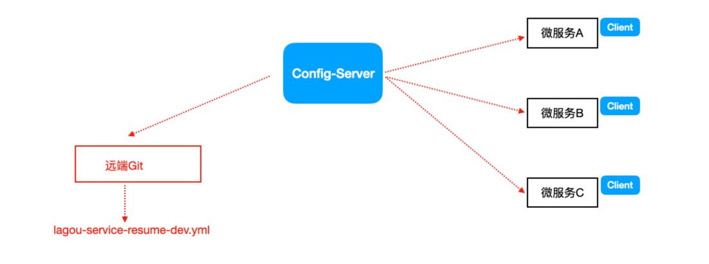

# Spring Cloud Config

我们往往使用配置文件管理一些配置信息，比如application.yml 

- 单体应用架构

配置信息的管理、维护并不会显得特别麻烦，手动操作就可以，因为就一个工程;

- 微服务架构

因为我们的分布式集群环境中可能有很多个微服务，我们不可能一个一个去修改配置然后重启生效，在一定场景下我们还需要在运行期间动态调整配置信息，
比如:根据各个微服务的负载情况，动态调整数据源连接池大小，我们希望配置内容发生变化的时候，微服务可以自动更新。

场景总结如下:

1. 集中配置管理，一个微服务架构中可能有成百上千个微服务，所以集中配置管理 是很重要的(一次修改、到处生效)
2. 不同环境不同配置，比如数据源配置在不同环境(开发dev,测试test,生产prod) 中是不同的
3. 运行期间可动态调整。例如，可根据各个微服务的负载情况，动态调整数据源连 接池大小等配置修改后可自动更新
4. 如配置内容发生变化，微服务可以自动更新配置 那么，我们就需要对配置文件进行集中式管理，这也是分布式配置中心的作用。

## 简介

Spring Cloud Config 是一个分布式配置管理方案，包含了 Server 端和 Client 端两个部分。



- Server端: 提供配置文件的存储、以接口的形式将配置文件的内容提供出去，通过使用 `@EnableConfigServer` 注解在SpringBoot应用中非常简单的嵌入 

- Client端: 通过接口获取配置数据并初始化自己的应用

## 应用

> Config Server 是集中式的配置服务，用于集中管理应用程序各个环境下的配置。默认使用Git存储配置文件内容，也可以SVN。 

比如，我们要对“简历微服务”的application.yml进行管理(区分开发环境、测试环境、生产环境)

1. 在 GitLab 上创建config项目，并上传配置文件

命名规则如下:

`{application}-{profile}.yml` 或者 `{application}-{profile}.properties` 

其中，application为应用名称，profile指的是环境(用于区分开发环境，测试环境、生产环境等) 

示例: service-resume-dev.yml、service-resume-test.yml、service-resume-prod.yml

2. 构建 Config Server 统一配置中心

新建SpringBoot工程，引入依赖坐标(需要注册自己到Eureka)

```xml
<dependencies>
    <!--eureka client 客户端依赖引入-->
    <dependency>
        <groupId>org.springframework.cloud</groupId>
        <artifactId>spring-cloud-starter-netflix-eureka-client</artifactId>
    </dependency>
    <!--config配置中心服务端-->
    <dependency>
        <groupId>org.springframework.cloud</groupId>
        <artifactId>spring-cloud-config-server</artifactId>
    </dependency>
</dependencies>
```

配置启动类，使用注解@EnableConfigServer开启配置中心服务器功能

```java
@SpringBootApplication
@EnableDiscoveryClient
@EnableConfigServer // 开启配置中心功能
public class ConfigServerApplication9006 {
    public static void main(String[] args) {
        SpringApplication.run(ConfigServerApplication9006.class, args);
    }
}
```

application.properties 配置

```properties
server.port=9006

spring.application.name=cloud-config-server
spring.cloud.config.server.git.uri=https://gitee.com/mujunlin/springcloud-config-repo.git
spring.cloud.config.server.git.username=mujunlin
spring.cloud.config.server.git.password=!qgy2K2i8bkMRV_
spring.cloud.config.server.git.search-paths=
spring.cloud.config.server.default-label=master

# 注册到 Eureka 服务注册中心集群。注册到集群时，多个Server地址使用 "," 连接。
eureka.client.service-url.defaultZone=http://cloud-eureka-server-a:8761/eureka,http://cloud-eureka-server-b:8762/eureka
# 服务实例中显示 IP 而不是主机名
eureka.instance.prefer-ip-address=true
# 实例ID (默认：ip/hostname:service-name:port)
eureka.instance.instance-id=${spring.cloud.client.ip-address}:${spring.application.name}:${server.port}:@project.version@
# 每隔多久拉取一次服务列表
eureka.client.registry-fetch-interval-seconds=30
# SpringBoot 中暴露健康检查等端点接口
management.endpoints.web.exposure.exclude="*"
# 暴露健康检查接口的细节
management.endpoint.health.show-details=always
```

> 测试访问 `http://localhost:9006/master/lagou-service-resume-dev.yml` 可以查看到配置文件内容

3. 构建Client客户端(在已有简历微服务基础上)

已有工程中添加依赖坐标

```xml
<dependency>
    <groupId>org.springframework.cloud</groupId>
    <artifactId>spring-cloud-config-client</artifactId>
</dependency>
```

application.yml修改为bootstrap.yml配置文件


bootstrap.yml是系统级别的，优先级比application.yml高，应用启动时会检查这个配置文件，在这个配置文件中指定配置中心的服务地址，会自动拉取所有应用配置并且启用。

(主要是把与统一配置中心连接的配置信息放到bootstrap.yml) 

注意:需要统一读取的配置信息，从集中配置中心获取

```properties
# 配置文件名称
spring.cloud.config.name=service-resume
# 后缀名称
spring.cloud.config.profile=dev
# 分支名称
spring.cloud.config.label=master
spring.cloud.config.uri=http://localhost:9006
```

